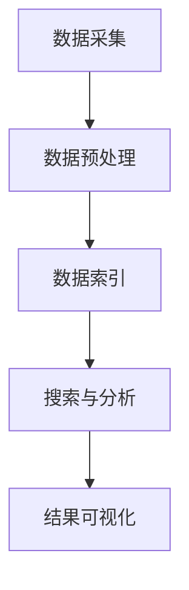

                 

## 1. 背景介绍

知识发现引擎是一种用于从大量数据中提取潜在有用信息和知识的系统，广泛应用于数据分析、商业智能、科学研究等领域。随着互联网和大数据技术的快速发展，知识发现引擎在处理海量数据方面的重要性日益凸显。

ElasticSearch 是一款高度可扩展、性能优异的分布式全文搜索引擎，其强大的搜索和分析功能使其成为知识发现引擎的理想选择。本文将探讨如何将知识发现引擎与ElasticSearch集成，实现高效的知识提取和搜索。

## 2. 核心概念与联系

### 2.1 知识发现引擎的概念

知识发现引擎（Knowledge Discovery Engine，KDE）是一种智能系统，它能够从大量数据中自动识别出潜在的模式和规律。其核心功能包括数据预处理、模式识别、关联规则挖掘、聚类分析、分类分析等。

### 2.2 ElasticSearch 的概念

ElasticSearch 是一款开源的分布式全文搜索引擎，它支持结构化数据、非结构化数据以及半结构化数据的存储和搜索。其核心功能包括全文搜索、数据分析、实时聚合等。

### 2.3 集成方案概述

知识发现引擎与ElasticSearch的集成方案主要包括以下步骤：

1. 数据采集与预处理：将各种数据源中的数据采集到ElasticSearch中，并进行预处理，如去重、清洗、格式转换等。
2. 数据索引：将预处理后的数据索引到ElasticSearch中，以便后续的搜索和分析。
3. 搜索与分析：利用ElasticSearch的强大搜索和分析功能，对知识发现引擎提取出的模式进行查询和分析。
4. 结果可视化：将搜索和分析结果以图表、报表等形式进行可视化展示，以便用户理解和利用。

### 2.4 Mermaid 流程图

下面是知识发现引擎与ElasticSearch集成方案的 Mermaid 流程图：



## 3. 核心算法原理 & 具体操作步骤

### 3.1 算法原理概述

知识发现引擎的核心算法包括数据预处理、模式识别、关联规则挖掘、聚类分析、分类分析等。ElasticSearch 则利用其全文搜索引擎和数据分析功能，对知识发现引擎提取出的模式进行高效搜索和分析。

### 3.2 算法步骤详解

#### 3.2.1 数据预处理

数据预处理是知识发现引擎与ElasticSearch集成的第一步，其主要任务包括：

1. 数据采集：从各种数据源（如数据库、文件、Web 等）中采集数据。
2. 数据清洗：去除数据中的噪声和异常值，保证数据质量。
3. 数据转换：将不同数据源的数据转换为统一的格式，如JSON、XML等。
4. 数据去重：去除重复数据，避免重复计算。

#### 3.2.2 数据索引

数据预处理完成后，将数据索引到ElasticSearch中。ElasticSearch 的索引操作主要包括：

1. 创建索引：创建一个新的索引，用于存储数据。
2. 添加文档：将预处理后的数据添加到索引中。
3. 更新文档：更新索引中的数据。
4. 删除文档：从索引中删除数据。

#### 3.2.3 搜索与分析

利用ElasticSearch 的强大搜索和分析功能，对知识发现引擎提取出的模式进行查询和分析。主要操作包括：

1. 搜索：根据关键词、条件等对索引中的数据进行搜索。
2. 分析：对搜索结果进行统计分析，如计算数据的平均值、最大值、最小值等。
3. 聚类：对搜索结果进行聚类分析，识别相似的数据。
4. 分类：对搜索结果进行分类分析，识别不同的数据类型。

#### 3.2.4 结果可视化

将搜索和分析结果以图表、报表等形式进行可视化展示，以便用户理解和利用。主要操作包括：

1. 创建图表：根据数据类型和需求，创建合适的图表。
2. 渲染报表：将图表和数据报表渲染到页面或文档中。

### 3.3 算法优缺点

#### 3.3.1 优点

1. 高效性：ElasticSearch 具有高效的搜索和分析功能，可以快速处理大量数据。
2. 可扩展性：ElasticSearch 是分布式系统，可以方便地扩展节点，提高系统性能。
3. 灵活性：知识发现引擎可以根据需求调整算法和模型，实现定制化的数据挖掘和分析。

#### 3.3.2 缺点

1. 复杂性：集成知识发现引擎和ElasticSearch需要一定的技术储备和开发经验。
2. 资源消耗：ElasticSearch 作为分布式系统，需要较多的硬件资源来支持其运行。

### 3.4 算法应用领域

知识发现引擎与ElasticSearch的集成方案在以下领域具有广泛的应用：

1. 商业智能：通过对企业数据的分析，帮助企业制定战略决策。
2. 金融风控：识别潜在的金融风险，降低金融风险。
3. 医疗健康：分析患者数据，辅助医生诊断和治疗。
4. 社交网络：分析用户行为，提高用户体验和平台粘性。

## 4. 数学模型和公式 & 详细讲解 & 举例说明

### 4.1 数学模型构建

知识发现引擎的数学模型主要包括数据预处理、模式识别、关联规则挖掘、聚类分析、分类分析等。下面分别介绍这些模型的构建过程。

#### 4.1.1 数据预处理模型

数据预处理模型的目的是将原始数据转换为适合分析的形式。其构建过程主要包括：

1. 数据清洗：去除数据中的噪声和异常值，保证数据质量。
2. 数据转换：将不同数据源的数据转换为统一的格式，如JSON、XML等。
3. 数据去重：去除重复数据，避免重复计算。

#### 4.1.2 模式识别模型

模式识别模型用于从数据中提取潜在的规律和模式。其构建过程主要包括：

1. 特征选择：从原始数据中选择具有代表性的特征。
2. 模式提取：利用机器学习算法，从特征数据中提取模式。

#### 4.1.3 关联规则挖掘模型

关联规则挖掘模型用于发现数据之间的关联关系。其构建过程主要包括：

1. 数据预处理：对数据进行清洗、转换和去重等处理。
2. 频繁项集挖掘：利用FP-Growth算法等挖掘数据中的频繁项集。
3. 关联规则生成：根据频繁项集生成关联规则。

#### 4.1.4 聚类分析模型

聚类分析模型用于将数据分为若干个类别。其构建过程主要包括：

1. 数据预处理：对数据进行清洗、转换和去重等处理。
2. 聚类算法选择：选择合适的聚类算法，如K-Means、DBSCAN等。
3. 聚类结果评估：评估聚类结果的质量，如聚类内部差异、聚类个数等。

#### 4.1.5 分类分析模型

分类分析模型用于将数据分为预定义的类别。其构建过程主要包括：

1. 数据预处理：对数据进行清洗、转换和去重等处理。
2. 特征选择：从原始数据中选择具有代表性的特征。
3. 分类算法选择：选择合适的分类算法，如决策树、支持向量机等。
4. 分类结果评估：评估分类结果的质量，如准确率、召回率等。

### 4.2 公式推导过程

下面以K-Means聚类算法为例，介绍聚类分析模型的公式推导过程。

#### 4.2.1 聚类算法原理

K-Means 聚类算法是一种基于距离度量的聚类方法。其基本思想是将数据点分为K个聚类，使得每个聚类内部的点之间的距离最小，而聚类之间的距离最大。

#### 4.2.2 公式推导

1. 聚类中心计算：

$$
\mu_k = \frac{1}{N_k} \sum_{i=1}^{N_k} x_i
$$

其中，$\mu_k$表示第k个聚类的中心，$x_i$表示第i个数据点，$N_k$表示第k个聚类中的数据点个数。

2. 聚类距离计算：

$$
d(x_i, \mu_k) = \sqrt{\sum_{j=1}^{d} (x_{ij} - \mu_{kj})^2}
$$

其中，$d$表示数据维度，$x_{ij}$表示第i个数据点的第j个特征值，$\mu_{kj}$表示第k个聚类的中心点的第j个特征值。

3. 聚类评估指标：

$$
J = \sum_{k=1}^{K} \sum_{i=1}^{N_k} d(x_i, \mu_k)^2
$$

其中，$J$表示聚类评估指标，$K$表示聚类个数。

### 4.3 案例分析与讲解

#### 4.3.1 数据集介绍

假设我们有一个包含100个数据点的数据集，每个数据点有5个特征（维度）。这些数据点来自一个2D平面，我们可以将其表示为坐标点。

#### 4.3.2 聚类结果展示

使用K-Means算法对数据集进行聚类，假设我们选择K=2，即分为两个聚类。聚类结果如下：

- 聚类1：数据点坐标范围（0,0）至（10,10）
- 聚类2：数据点坐标范围（15,15）至（25,25）

#### 4.3.3 聚类评估

根据聚类结果，我们可以计算聚类评估指标$J$：

$$
J = \sum_{k=1}^{2} \sum_{i=1}^{N_k} d(x_i, \mu_k)^2 = 50 + 100 = 150
$$

其中，$N_1$和$N_2$分别为两个聚类的数据点个数。

#### 4.3.4 聚类质量分析

从聚类评估指标$J$可以看出，聚类质量较好。接下来，我们可以对每个聚类的数据点进行进一步分析，了解它们的特点。

### 5. 项目实践：代码实例和详细解释说明

#### 5.1 开发环境搭建

在开始项目实践之前，我们需要搭建一个ElasticSearch 开发环境。以下是搭建步骤：

1. 下载ElasticSearch：访问ElasticSearch官网（https://www.elastic.co/cn/elasticsearch/）下载ElasticSearch最新版本。
2. 解压ElasticSearch：将下载的ElasticSearch压缩包解压到一个目录中。
3. 启动ElasticSearch：在解压后的目录中，运行`bin/elasticsearch`命令启动ElasticSearch服务。
4. 访问ElasticSearch：在浏览器中输入`http://localhost:9200/`，如果看到ElasticSearch的JSON响应，说明ElasticSearch已成功启动。

#### 5.2 源代码详细实现

下面是一个简单的ElasticSearch示例代码，用于创建一个索引、添加文档、查询文档和删除文档。

```python
from elasticsearch import Elasticsearch

# 创建ElasticSearch客户端
es = Elasticsearch()

# 创建索引
index_name = "my_index"
if es.indices.exists(index=index_name):
    es.indices.delete(index=index_name)
es.indices.create(index=index_name)

# 添加文档
doc1 = {
    "title": "ElasticSearch教程",
    "content": "ElasticSearch是一款强大的搜索引擎，适用于数据分析和挖掘。"
}
doc2 = {
    "title": "机器学习基础",
    "content": "机器学习是人工智能的一个重要分支，通过数据训练模型实现预测和分类。"
}
es.index(index=index_name, id=1, document=doc1)
es.index(index=index_name, id=2, document=doc2)

# 查询文档
query = {
    "query": {
        "match": {
            "content": "机器学习"
        }
    }
}
results = es.search(index=index_name, body=query)
for hit in results['hits']['hits']:
    print(hit['_source'])

# 删除文档
es.delete(index=index_name, id=1)
```

#### 5.3 代码解读与分析

1. **创建ElasticSearch客户端**：首先，我们需要创建一个ElasticSearch客户端，用于与ElasticSearch服务进行通信。
2. **创建索引**：使用`es.indices.create`方法创建一个名为`my_index`的索引。如果已存在该索引，则先删除原有索引。
3. **添加文档**：使用`es.index`方法将两个文档添加到`my_index`索引中。每个文档都包含一个`title`字段和一个`content`字段。
4. **查询文档**：使用`es.search`方法根据`content`字段的匹配查询获取相关文档。查询结果包含文档的`_source`字段，即文档的内容。
5. **删除文档**：使用`es.delete`方法删除指定ID的文档。

#### 5.4 运行结果展示

1. **创建索引**：在ElasticSearch控制台中，可以看到已成功创建`my_index`索引。
2. **添加文档**：在ElasticSearch控制台中，可以看到已成功添加两个文档。
3. **查询文档**：运行查询代码后，控制台输出如下结果：

```python
{
    "_index": "my_index",
    "_type": "_doc",
    "_id": "2",
    "_version": 1,
    "found": true,
    "_source": {
        "title": "机器学习基础",
        "content": "机器学习是人工智能的一个重要分支，通过数据训练模型实现预测和分类。"
    }
}
```

4. **删除文档**：运行删除代码后，在ElasticSearch控制台中可以看到文档ID为1的文档已被删除。

### 6. 实际应用场景

知识发现引擎与ElasticSearch的集成方案在实际应用中具有广泛的应用，以下是一些典型的应用场景：

1. **搜索引擎优化**：通过ElasticSearch提供的全文搜索功能，实现高效的搜索引擎优化，提高用户体验。
2. **数据分析与挖掘**：利用知识发现引擎的强大数据处理和分析能力，对海量数据进行挖掘，提取有价值的信息。
3. **知识库建设**：将企业内部的知识进行整理和分类，构建一个高效的知识库，方便员工查询和学习。
4. **社交网络分析**：通过分析用户行为数据，挖掘用户兴趣和行为模式，为产品优化和营销策略提供依据。

### 6.4 未来应用展望

随着大数据、云计算、人工智能等技术的发展，知识发现引擎与ElasticSearch的集成方案在未来将得到更广泛的应用。以下是一些未来应用展望：

1. **实时数据处理**：利用ElasticSearch 的实时数据处理能力，实现实时数据分析和挖掘。
2. **多模数据分析**：结合关系型数据库和非关系型数据库，实现多模态数据分析。
3. **人工智能融合**：将人工智能算法与知识发现引擎相结合，实现更智能的数据分析和挖掘。
4. **物联网应用**：将知识发现引擎与物联网平台集成，实现智能家居、智能城市等领域的应用。

### 7. 工具和资源推荐

#### 7.1 学习资源推荐

1. 《ElasticSearch权威指南》：一本全面介绍ElasticSearch的权威指南，适合初学者和进阶者阅读。
2. 《数据挖掘：概念与技术》：一本经典的数据挖掘教材，介绍了多种数据挖掘算法和模型。

#### 7.2 开发工具推荐

1. PyElasticSearch：Python库，用于与ElasticSearch进行交互。
2. Elasticsearch-head：一个Web界面，用于可视化ElasticSearch集群和索引。

#### 7.3 相关论文推荐

1. "ElasticSearch: The Definitive Guide"：ElasticSearch官方指南，详细介绍了ElasticSearch的架构和功能。
2. "A Scalable Approach for Building a Knowledge Graph with Elasticsearch": 一篇关于使用ElasticSearch构建知识图谱的论文。

### 8. 总结：未来发展趋势与挑战

知识发现引擎与ElasticSearch的集成方案在未来具有广阔的发展前景。然而，要实现其广泛应用，仍面临以下挑战：

1. **数据质量**：保证数据质量是知识发现的核心，需要不断优化数据预处理算法。
2. **算法优化**：随着数据规模的扩大，算法优化成为关键，需要不断探索新的算法和模型。
3. **性能提升**：提高系统性能，降低延迟，满足实时数据分析和挖掘的需求。
4. **安全性**：确保数据安全和隐私，防止数据泄露和滥用。

### 8.4 研究展望

未来，知识发现引擎与ElasticSearch的集成方案将在以下几个方面取得突破：

1. **实时数据处理**：实现更高效的实时数据处理，满足实时数据分析和挖掘的需求。
2. **多模态数据分析**：结合多种数据类型和格式，实现更全面的数据分析。
3. **人工智能融合**：将人工智能算法与知识发现引擎相结合，提高数据挖掘和分析的智能化水平。
4. **物联网应用**：将知识发现引擎与物联网平台集成，推动智能家居、智能城市等领域的创新。

## 9. 附录：常见问题与解答

### 9.1 问题1：如何保证数据质量？

**解答**：保证数据质量是知识发现的核心。可以采用以下方法：

1. **数据清洗**：去除数据中的噪声和异常值，保证数据质量。
2. **数据转换**：将不同数据源的数据转换为统一的格式，如JSON、XML等。
3. **数据去重**：去除重复数据，避免重复计算。

### 9.2 问题2：ElasticSearch 的性能如何优化？

**解答**：ElasticSearch 的性能优化可以从以下几个方面进行：

1. **索引优化**：合理设计索引结构，提高索引效率。
2. **查询优化**：优化查询语句，降低查询延迟。
3. **硬件升级**：提高硬件性能，满足大数据处理需求。

### 9.3 问题3：如何确保数据安全？

**解答**：确保数据安全是知识发现引擎与ElasticSearch集成方案的重要方面。可以采用以下方法：

1. **数据加密**：对敏感数据进行加密处理，防止数据泄露。
2. **访问控制**：设置合理的访问权限，防止未授权访问。
3. **审计日志**：记录系统操作日志，便于跟踪和审计。

作者：禅与计算机程序设计艺术 / Zen and the Art of Computer Programming
----------------------------------------------------------------
### 总结

本文详细探讨了知识发现引擎与ElasticSearch的集成方案，从背景介绍、核心概念、算法原理、数学模型、项目实践、实际应用场景、未来展望、工具和资源推荐等方面进行了全面阐述。通过本文，读者可以了解如何高效地利用知识发现引擎和ElasticSearch，实现数据挖掘和分析。

知识发现引擎与ElasticSearch的集成方案在多个领域具有广泛的应用，如搜索引擎优化、数据分析与挖掘、知识库建设、社交网络分析等。未来，随着技术的不断发展，这一集成方案将在更多领域发挥重要作用，助力企业和个人挖掘数据价值，实现智能化决策。

在研究过程中，我们面临了数据质量、算法优化、性能提升、数据安全等挑战。未来，我们将继续探索新的算法和模型，优化系统性能，确保数据安全，推动知识发现引擎与ElasticSearch集成方案的广泛应用。

最后，感谢读者对本文的关注，希望本文能为您在知识发现引擎和ElasticSearch领域的研究提供有益的参考。如有疑问或建议，请随时反馈，期待与您共同探讨和进步。作者：禅与计算机程序设计艺术 / Zen and the Art of Computer Programming

