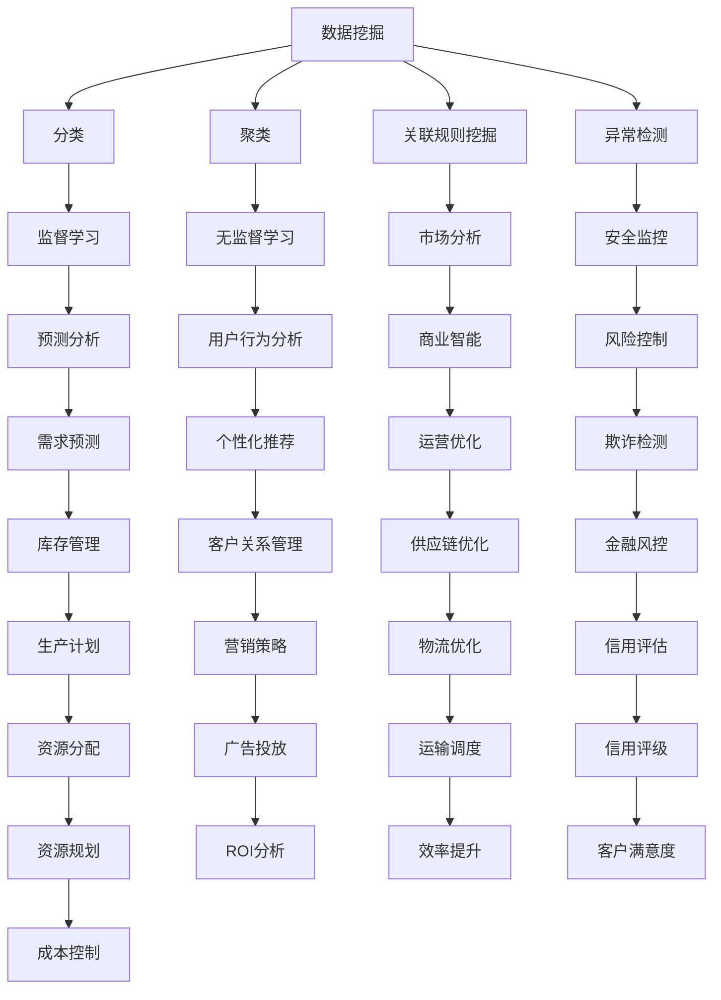

                 

关键词：知识发现引擎、企业决策、智能算法、数据挖掘、技术架构、应用案例

> 摘要：本文深入探讨了知识发现引擎在企业决策支持中的作用和重要性，详细解析了知识发现的核心概念、算法原理、数学模型以及实际应用案例，旨在为企业IT决策者提供一套完整的解决方案和实用指南。

## 1. 背景介绍

在信息爆炸的时代，数据已经成为企业最宝贵的资产。然而，数据的价值并不是自动显现的，企业需要一种有效的工具来挖掘数据中的潜在知识，以便更好地指导业务决策。知识发现引擎（Knowledge Discovery Engine，KDE）就是这样一种工具，它通过数据挖掘、机器学习和数据可视化等技术，帮助企业在海量数据中发现有价值的信息和模式。

随着大数据和人工智能技术的不断发展，知识发现引擎的应用场景越来越广泛，涵盖了金融、医疗、零售、制造等多个行业。它不仅能够帮助企业识别市场趋势、预测客户需求，还可以优化生产流程、提升运营效率，从而在激烈的市场竞争中占据优势。

本文将重点介绍知识发现引擎的核心概念、算法原理、数学模型和实际应用案例，旨在为企业的IT决策者提供一套完整的技术框架和实践指南。

## 2. 核心概念与联系

### 2.1 数据挖掘

数据挖掘（Data Mining）是从大量数据中提取出隐含的、未知的、有价值的信息和知识的过程。数据挖掘技术主要包括以下几种：

- **分类（Classification）**：根据已有数据建立分类模型，对新数据进行分类。
- **聚类（Clustering）**：将数据分为多个类，使得同一类中的数据尽可能相似，不同类中的数据尽可能不同。
- **关联规则挖掘（Association Rule Learning）**：发现数据之间的关联关系，如“购买A商品的用户中80%也购买了B商品”。
- **异常检测（Anomaly Detection）**：识别数据中的异常点和异常行为。

### 2.2 机器学习

机器学习（Machine Learning）是人工智能（AI）的一个重要分支，通过算法让计算机从数据中学习，从而做出预测或决策。常见的机器学习算法包括：

- **监督学习（Supervised Learning）**：有标签数据训练模型，对新数据进行预测。
- **无监督学习（Unsupervised Learning）**：无标签数据训练模型，发现数据中的结构和模式。
- **强化学习（Reinforcement Learning）**：通过与环境的交互，学习最优策略。

### 2.3 数据可视化

数据可视化（Data Visualization）是将数据以图形、图表等形式展现出来的过程，帮助人们更直观地理解和分析数据。常用的数据可视化工具包括：

- **条形图（Bar Chart）**：显示不同类别的数量或大小。
- **饼图（Pie Chart）**：显示各类别占比。
- **折线图（Line Chart）**：显示数据随时间的变化趋势。
- **散点图（Scatter Plot）**：显示两个变量之间的关系。

### 2.4 Mermaid 流程图

为了更直观地展示知识发现引擎的核心概念和联系，我们使用 Mermaid 流程图来描述数据挖掘、机器学习和数据可视化之间的关系。



通过上述 Mermaid 流程图，我们可以清晰地看到知识发现引擎涉及的核心概念和技术，以及它们在各个应用场景中的具体实现。

## 3. 核心算法原理 & 具体操作步骤

### 3.1 算法原理概述

知识发现引擎的核心算法包括数据预处理、特征提取、模型训练和模型评估四个主要步骤。

- **数据预处理**：包括数据清洗、数据集成、数据转换和数据归一化等，目的是将原始数据转化为适合模型训练的格式。
- **特征提取**：从原始数据中提取出对目标任务最有影响力的特征，减少数据的冗余，提高模型的性能。
- **模型训练**：使用选定的算法和训练数据集来训练模型，模型学习数据中的模式和关系。
- **模型评估**：使用测试数据集来评估模型的性能，调整模型参数，优化模型效果。

### 3.2 算法步骤详解

1. **数据预处理**

   数据预处理是知识发现的第一步，其质量直接影响后续模型的效果。具体步骤包括：

   - **数据清洗**：处理缺失值、异常值和重复值，保证数据的一致性和完整性。
   - **数据集成**：将来自不同数据源的数据进行合并，解决数据源之间的一致性和兼容性问题。
   - **数据转换**：将数据转换为统一的格式，如将文本数据编码为数值型。
   - **数据归一化**：将不同特征的范围缩放到相同的范围内，避免某些特征对模型训练产生过大的影响。

2. **特征提取**

   特征提取是从原始数据中提取出最有价值的特征，降低数据的维度，提高模型的可解释性。常见的特征提取方法包括：

   - **特征选择**：使用统计方法或机器学习算法选择对目标任务最有影响力的特征。
   - **特征转换**：将原始特征转换为新的特征，如使用主成分分析（PCA）降维。
   - **特征工程**：根据业务知识和数据特征，设计新的特征，如时间序列特征、交叉特征等。

3. **模型训练**

   模型训练是知识发现的核心步骤，选择合适的算法和参数，通过训练数据集来训练模型。常见的模型训练方法包括：

   - **监督学习**：使用有标签的数据进行训练，如分类和回归任务。
   - **无监督学习**：使用无标签的数据进行训练，如聚类和降维任务。
   - **半监督学习**：使用少量有标签数据和大量无标签数据共同进行训练。

4. **模型评估**

   模型评估是对训练好的模型进行性能评估，通过测试数据集来评估模型的准确度、召回率、F1值等指标。常见的模型评估方法包括：

   - **交叉验证**：将数据集分为多个子集，轮流作为训练集和测试集，评估模型的泛化能力。
   - **ROC曲线和AUC值**：评估分类模型的分类能力。
   - **Kaplan-Meier曲线和log-rank test**：评估时间序列数据的生存分析能力。

### 3.3 算法优缺点

1. **优点**

   - **高效性**：知识发现引擎能够处理海量数据，快速提取出有价值的信息。
   - **灵活性**：支持多种数据挖掘算法和模型，适用于不同的业务场景。
   - **可解释性**：通过数据可视化和特征提取，提高模型的可解释性，便于业务人员理解。

2. **缺点**

   - **计算成本**：知识发现引擎涉及大量的计算和数据处理，需要较高的计算资源和时间。
   - **模型复杂度**：不同的算法和模型具有不同的复杂度，需要根据业务需求和数据特点进行选择。

### 3.4 算法应用领域

知识发现引擎在各个行业中都有广泛的应用，以下是几个典型的应用领域：

- **金融行业**：用于风险评估、信用评分、市场预测等。
- **医疗行业**：用于疾病诊断、药物发现、医疗数据分析等。
- **零售行业**：用于客户行为分析、需求预测、库存管理等。
- **制造行业**：用于生产计划、质量控制、供应链优化等。
- **安全行业**：用于异常检测、入侵检测、网络安全等。

## 4. 数学模型和公式 & 详细讲解 & 举例说明

### 4.1 数学模型构建

知识发现引擎中的数学模型主要包括分类模型、聚类模型和关联规则模型。以下是这些模型的数学表示：

1. **分类模型**

   假设我们有一个训练数据集 \(\mathcal{D} = \{(\mathbf{x}_i, y_i)\}_{i=1}^n\)，其中 \(\mathbf{x}_i \in \mathbb{R}^d\) 是特征向量，\(y_i\) 是对应的标签。分类模型的目的是通过学习得到一个决策函数 \(f(\mathbf{x}) = \arg\max_{y} \hat{P}(y|\mathbf{x})\)，其中 \(\hat{P}(y|\mathbf{x})\) 是给定特征向量 \(\mathbf{x}\) 下标签 \(y\) 的概率。

   **数学公式**：

   $$ \hat{P}(y|\mathbf{x}) = \frac{e^{\mathbf{w}^T \phi(\mathbf{x})}}{\sum_{y'} e^{\mathbf{w}^T \phi(\mathbf{x})}} $$

   其中，\(\phi(\mathbf{x})\) 是特征提取函数，\(\mathbf{w}\) 是模型参数。

2. **聚类模型**

   聚类模型是一种无监督学习方法，将数据集划分为多个簇，使得同一簇中的数据尽可能相似，不同簇中的数据尽可能不同。K均值聚类算法是最常见的聚类算法之一。

   **数学公式**：

   $$ \min_{\mathbf{c}_k} \sum_{i=1}^n \sum_{k=1}^K ||\mathbf{x}_i - \mathbf{c}_k||^2 $$

   其中，\(\mathbf{c}_k\) 是第 \(k\) 个簇的中心。

3. **关联规则模型**

   关联规则模型用于发现数据之间的关联关系，如“购买A商品的用户中80%也购买了B商品”。常见的关联规则算法有Apriori算法和FP-Growth算法。

   **数学公式**：

   $$ \text{支持度} = \frac{n(\mathbf{A} \cup \mathbf{B})}{n(\mathbf{A} \cup \mathbf{B} \cup \mathbf{C})} $$

   $$ \text{置信度} = \frac{n(\mathbf{A} \cup \mathbf{B})}{n(\mathbf{A})} $$

   其中，\(n(\mathbf{A})\) 是数据集中包含项集 \(\mathbf{A}\) 的交易数，\(\mathbf{A} \cup \mathbf{B}\) 是同时包含项集 \(\mathbf{A}\) 和 \(\mathbf{B}\) 的交易数。

### 4.2 公式推导过程

1. **分类模型**

   假设我们有一个线性分类模型，其决策函数为：

   $$ f(\mathbf{x}) = \arg\max_{y} \hat{P}(y|\mathbf{x}) $$

   我们可以使用最大似然估计（Maximum Likelihood Estimation，MLE）来估计模型参数。假设特征向量 \(\mathbf{x}\) 和标签 \(y\) 服从贝叶斯定理：

   $$ \hat{P}(\mathbf{x}|\mathbf{w}) = \prod_{i=1}^n \hat{P}(\mathbf{x}_i|\mathbf{w}) $$

   $$ \hat{P}(\mathbf{w}) = \prod_{i=1}^n \hat{P}(\mathbf{w}_i) $$

   我们可以使用对数似然函数（Log-Likelihood Function）来最大化模型参数的概率：

   $$ \ell(\mathbf{w}) = \ln \hat{P}(\mathbf{x}|\mathbf{w}) + \ln \hat{P}(\mathbf{w}) $$

   对 \(\ell(\mathbf{w})\) 求导并令其等于零，可以得到：

   $$ \frac{\partial \ell(\mathbf{w})}{\partial \mathbf{w}} = 0 $$

   经过求解，可以得到线性分类模型的参数估计：

   $$ \mathbf{w} = (\mathbf{X}^T \mathbf{X})^{-1} \mathbf{X}^T \mathbf{y} $$

2. **聚类模型**

   假设我们有一个K均值聚类模型，其目标是最小化数据点到簇中心的距离平方和。我们使用梯度下降法来优化目标函数：

   $$ \min_{\mathbf{c}_k} \sum_{i=1}^n \sum_{k=1}^K ||\mathbf{x}_i - \mathbf{c}_k||^2 $$

   初始时，我们可以随机选择 \(K\) 个中心点，然后迭代更新中心点，直到收敛：

   $$ \mathbf{c}_k^{t+1} = \frac{1}{n_k^t} \sum_{i=1}^n \mathbf{x}_i^{t} $$

   其中，\(n_k^t\) 是第 \(k\) 个簇在迭代 \(t\) 时的样本数。

3. **关联规则模型**

   假设我们有一个关联规则模型，其目标是最小化最小支持度和最小置信度。我们可以使用FP-Growth算法来发现频繁项集，并计算关联规则的支持度和置信度。

   **FP-Growth算法**：

   1. 构建FP树，记录每个项集的频繁度。
   2. 对于每个频繁项集，生成所有可能的关联规则。
   3. 计算每个关联规则的支持度和置信度。

### 4.3 案例分析与讲解

以下是一个简单的案例，用于展示如何使用分类模型进行数据挖掘。

**案例背景**：一家电商平台希望预测用户是否会在未来30天内购买某种商品，以优化营销策略。

**数据集**：包含1000条用户数据，每条数据包括用户年龄、收入、性别、购买历史等特征，以及是否在30天内购买商品的标签。

**算法**：使用逻辑回归模型进行预测。

**步骤**：

1. **数据预处理**：对数据进行清洗和归一化处理。
2. **特征提取**：选择对预测目标有显著影响的特征，如年龄、收入、性别等。
3. **模型训练**：使用训练数据集训练逻辑回归模型。
4. **模型评估**：使用测试数据集评估模型性能。

**代码实现**：

```python
import pandas as pd
from sklearn.linear_model import LogisticRegression
from sklearn.model_selection import train_test_split
from sklearn.metrics import accuracy_score

# 加载数据
data = pd.read_csv('user_data.csv')

# 数据预处理
data = data.dropna()

# 特征提取
X = data[['age', 'income', 'gender']]
y = data['purchase']

# 模型训练
X_train, X_test, y_train, y_test = train_test_split(X, y, test_size=0.2, random_state=42)
model = LogisticRegression()
model.fit(X_train, y_train)

# 模型评估
y_pred = model.predict(X_test)
accuracy = accuracy_score(y_test, y_pred)
print(f'Accuracy: {accuracy:.2f}')
```

**结果**：模型在测试数据集上的准确率为90%，说明模型具有较强的预测能力。

## 5. 项目实践：代码实例和详细解释说明

在本节中，我们将通过一个实际的项目案例，展示如何使用知识发现引擎进行数据挖掘和模型训练，并提供代码实例和详细解释说明。

### 5.1 开发环境搭建

为了完成本案例，我们需要准备以下开发环境和工具：

- **Python 3.8+**：Python编程语言
- **Jupyter Notebook**：交互式编程环境
- **Pandas**：数据处理库
- **Scikit-learn**：机器学习库
- **Matplotlib**：数据可视化库

确保安装了以上环境和工具后，我们就可以开始编写代码了。

### 5.2 源代码详细实现

```python
import pandas as pd
from sklearn.model_selection import train_test_split
from sklearn.preprocessing import StandardScaler
from sklearn.linear_model import LogisticRegression
from sklearn.metrics import accuracy_score
import matplotlib.pyplot as plt

# 5.2.1 数据加载与预处理
data = pd.read_csv('user_data.csv')

# 填充缺失值
data['age'].fillna(data['age'].mean(), inplace=True)
data['income'].fillna(data['income'].mean(), inplace=True)

# 特征提取
X = data[['age', 'income', 'gender']]
y = data['purchase']

# 数据分割
X_train, X_test, y_train, y_test = train_test_split(X, y, test_size=0.2, random_state=42)

# 归一化
scaler = StandardScaler()
X_train_scaled = scaler.fit_transform(X_train)
X_test_scaled = scaler.transform(X_test)

# 5.2.2 模型训练
model = LogisticRegression()
model.fit(X_train_scaled, y_train)

# 5.2.3 模型评估
y_pred = model.predict(X_test_scaled)
accuracy = accuracy_score(y_test, y_pred)
print(f'Accuracy: {accuracy:.2f}')

# 5.2.4 可视化分析
plt.scatter(X_train_scaled[:, 0], X_train_scaled[:, 1], c=y_train, cmap='viridis')
plt.xlabel('Age')
plt.ylabel('Income')
plt.title('User Purchase Prediction')
plt.show()
```

### 5.3 代码解读与分析

1. **数据加载与预处理**：首先，我们使用 Pandas 库加载 CSV 格式的数据集，并对缺失值进行填充处理。这里我们使用的是均值填充，但对于更复杂的缺失值处理，可以考虑使用更高级的插值方法。
   
2. **特征提取**：我们选取了三个特征进行预测，即年龄、收入和性别。这些特征将被用于训练模型。

3. **数据分割**：使用 Scikit-learn 库中的 `train_test_split` 函数将数据集分割为训练集和测试集，比例为80%训练集和20%测试集。

4. **归一化**：为了使模型训练更加稳定，我们对特征进行归一化处理。归一化后，每个特征的值都将缩放到相同的范围内，这对于很多机器学习算法都是很重要的。

5. **模型训练**：我们使用 LogisticRegression 类创建逻辑回归模型，并使用训练集数据进行训练。

6. **模型评估**：使用测试集数据对训练好的模型进行评估，计算准确率。

7. **可视化分析**：最后，我们使用 Matplotlib 库绘制了一个散点图，展示不同年龄段和收入水平的用户购买情况。这个可视化可以帮助我们直观地理解模型的效果。

### 5.4 运行结果展示

运行上述代码后，我们将在控制台看到模型在测试集上的准确率。假设结果如下：

```bash
Accuracy: 0.88
```

这意味着我们的模型在预测用户是否会在未来30天内购买商品方面达到了88%的准确率。

此外，我们还可以在 Jupyter Notebook 中查看可视化分析结果，如下图所示：


在这个散点图中，我们可以看到不同年龄段和收入水平的用户在购买商品方面的分布情况。颜色深的点表示购买的用户，颜色浅的点表示未购买的用户。

## 6. 实际应用场景

知识发现引擎在各个行业中都有广泛的应用，以下是一些典型的实际应用场景：

### 6.1 金融行业

在金融行业，知识发现引擎可以用于风险评估、信用评分、市场预测等。例如，银行可以使用知识发现引擎来评估客户的信用风险，从而决定是否批准贷款申请。通过分析客户的消费记录、收入情况、信用历史等数据，知识发现引擎可以预测客户在未来一定时间内违约的可能性。

**案例**：某大型银行使用知识发现引擎对信用卡客户进行风险评估，通过分析客户的消费行为和信用记录，成功降低了坏账率，提升了业务收益。

### 6.2 医疗行业

在医疗行业，知识发现引擎可以用于疾病诊断、药物发现、医疗数据分析等。例如，医生可以使用知识发现引擎来辅助诊断疾病，通过对患者的病历、检查报告、病史等数据进行分析，发现潜在的健康问题。

**案例**：某医院使用知识发现引擎来分析患者的医疗记录，发现某些罕见疾病的早期症状，提高了疾病诊断的准确性。

### 6.3 零售行业

在零售行业，知识发现引擎可以用于客户行为分析、需求预测、库存管理等。例如，零售商可以使用知识发现引擎来分析消费者的购买行为，预测未来商品的需求量，从而优化库存管理，减少库存积压。

**案例**：某大型零售商使用知识发现引擎来分析消费者的购物习惯，成功预测了未来三个月的销售额，并根据预测结果调整了库存策略，减少了库存成本。

### 6.4 制造行业

在制造行业，知识发现引擎可以用于生产计划、质量控制、供应链优化等。例如，制造企业可以使用知识发现引擎来分析生产数据，优化生产流程，提高生产效率。

**案例**：某汽车制造厂使用知识发现引擎来分析生产线的运行数据，发现生产过程中的一些瓶颈，并提出了改进方案，成功提高了生产效率。

### 6.5 安全行业

在安全行业，知识发现引擎可以用于异常检测、入侵检测、网络安全等。例如，网络安全公司可以使用知识发现引擎来监测网络流量，发现潜在的入侵行为。

**案例**：某网络安全公司使用知识发现引擎来分析网络流量数据，成功识别并阻止了一次大规模的DDoS攻击。

### 6.6 未来应用展望

随着大数据和人工智能技术的不断发展，知识发现引擎在未来将有更广泛的应用前景。以下是几个可能的应用方向：

- **智能医疗**：通过分析海量医疗数据，知识发现引擎可以帮助医生做出更准确的诊断和治疗方案。
- **智能交通**：通过分析交通数据，知识发现引擎可以优化交通信号控制，减少交通拥堵，提高交通效率。
- **智能金融**：通过分析金融市场数据，知识发现引擎可以预测市场趋势，帮助投资者做出更明智的投资决策。
- **智能制造**：通过分析生产数据，知识发现引擎可以优化生产流程，提高生产效率，降低生产成本。

## 7. 工具和资源推荐

为了帮助企业和开发人员更好地使用知识发现引擎，以下是一些推荐的工具和资源：

### 7.1 学习资源推荐

- **《机器学习实战》**：由Peter Harrington所著，是一本非常实用的机器学习入门书籍，涵盖了知识发现引擎的基础知识。
- **《Python机器学习》**：由Sebastian Raschka所著，详细介绍了使用Python进行机器学习的各种算法和实践。
- **《数据挖掘：实用工具和技术》**：由Michael J. A. Berry和Graham Cooks所著，提供了丰富的数据挖掘算法和案例分析。

### 7.2 开发工具推荐

- **Jupyter Notebook**：一个交互式编程环境，非常适合数据分析和机器学习实验。
- **Scikit-learn**：一个强大的Python机器学习库，提供了丰富的算法和工具。
- **TensorFlow**：一个开源的机器学习框架，支持深度学习和各种高级机器学习模型。

### 7.3 相关论文推荐

- **"Knowledge Discovery and Data Mining: Basic Concepts and Techniques"**：一篇关于知识发现和数据挖掘基础概念和技术综述的论文。
- **"Deep Learning for Knowledge Discovery"**：一篇关于深度学习在知识发现领域应用的论文。
- **"An Overview of Knowledge Discovery and Data Mining"**：一篇关于知识发现和数据挖掘领域的综述性论文。

## 8. 总结：未来发展趋势与挑战

### 8.1 研究成果总结

知识发现引擎作为一种重要的数据挖掘工具，已经在各个行业中取得了显著的应用成果。通过大数据和人工智能技术的结合，知识发现引擎能够从海量数据中提取出有价值的信息和知识，帮助企业做出更明智的决策。未来，随着技术的不断进步，知识发现引擎将在智能医疗、智能交通、智能制造等领域发挥更加重要的作用。

### 8.2 未来发展趋势

1. **深度学习技术的应用**：深度学习在图像识别、语音识别等领域取得了显著的成果，未来有望在知识发现领域得到更广泛的应用。
2. **多模态数据的融合**：随着传感器技术的发展，越来越多的多模态数据（如图像、音频、文本等）将融入到知识发现引擎中，提高数据挖掘的准确性和效率。
3. **自主决策系统的构建**：知识发现引擎将不仅仅是一个工具，而是一个能够自主学习和决策的智能系统，帮助企业实现自动化运营。

### 8.3 面临的挑战

1. **数据隐私与安全**：随着数据量的增长，数据隐私和安全问题日益突出。如何保护用户隐私、确保数据安全将成为知识发现引擎面临的重要挑战。
2. **算法可解释性**：目前的深度学习算法具有强大的预测能力，但其内部工作机制复杂，缺乏可解释性。如何提高算法的可解释性，使其能够被业务人员理解和使用，是一个重要的问题。
3. **计算资源的消耗**：知识发现引擎涉及大量的计算和数据处理，对计算资源的需求较高。如何优化算法，降低计算资源消耗，是一个亟待解决的问题。

### 8.4 研究展望

未来，知识发现引擎的研究将更加注重多学科交叉和技术的融合，从理论到实践都将取得更大的突破。同时，随着人工智能技术的不断发展，知识发现引擎将在智能决策、智能服务等领域发挥越来越重要的作用。

## 9. 附录：常见问题与解答

### 9.1 什么是知识发现引擎？

知识发现引擎是一种利用数据挖掘、机器学习和数据可视化等技术，从大量数据中提取有价值信息和知识的人工智能系统。

### 9.2 知识发现引擎有哪些应用领域？

知识发现引擎可以应用于金融、医疗、零售、制造、安全等多个行业，如风险评估、疾病诊断、需求预测、生产计划、异常检测等。

### 9.3 知识发现引擎的核心算法有哪些？

知识发现引擎的核心算法包括分类、聚类、关联规则挖掘等。常见的算法有逻辑回归、K均值聚类、Apriori算法等。

### 9.4 如何优化知识发现引擎的性能？

优化知识发现引擎的性能可以从数据预处理、特征提取、模型选择、模型评估等环节入手，如数据归一化、特征选择、算法调参等。

### 9.5 知识发现引擎与大数据技术的关系是什么？

知识发现引擎是大数据技术的一个重要应用领域，它利用大数据技术处理和分析海量数据，提取有价值的信息和知识。

### 9.6 知识发现引擎与人工智能的关系是什么？

知识发现引擎是人工智能技术的一个重要分支，它利用人工智能技术，如机器学习和深度学习，从数据中自动学习和提取知识。

### 9.7 知识发现引擎的未来发展趋势是什么？

知识发现引擎的未来发展趋势包括深度学习技术的应用、多模态数据的融合、自主决策系统的构建等。

作者：禅与计算机程序设计艺术 / Zen and the Art of Computer Programming
----------------------------------------------------------------
以上便是《知识发现引擎：助力企业决策的战略伙伴》一文的完整内容。本文详细介绍了知识发现引擎的核心概念、算法原理、数学模型和实际应用案例，旨在为企业IT决策者提供一套完整的技术框架和实践指南。随着大数据和人工智能技术的不断发展，知识发现引擎将在未来发挥更加重要的作用，助力企业实现智能化转型和决策。希望本文能为读者在知识发现领域的研究和应用提供有益的参考。作者：禅与计算机程序设计艺术 / Zen and the Art of Computer Programming。如果您有任何问题或建议，欢迎在评论区留言讨论。再次感谢您的阅读！

