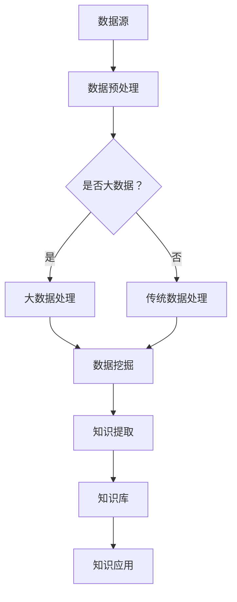

                 

关键词：知识发现，数据挖掘，人工智能，知识图谱，大数据，知识创新，机器学习，信息检索

> 摘要：在数字化时代，知识的获取、管理和利用成为了企业和组织的核心竞争力。本文旨在探讨知识发现引擎的核心概念、技术原理和应用场景，分析其在知识创新领域的重要性，并提出未来发展趋势与挑战。

## 1. 背景介绍

随着信息技术的飞速发展，大数据、云计算、人工智能等技术逐渐成熟，知识管理的重要性日益凸显。知识管理是一种将知识视为企业核心资产的管理方法，其目标是通过有效的知识获取、存储、共享和应用，提升组织运作效率和创新力。知识发现引擎作为知识管理的关键工具，能够自动地从大量数据中提取有价值的信息，为决策者提供洞见，从而推动知识的创新和应用。

知识发现引擎的定义较为广泛，通常是指一种能够通过数据挖掘、机器学习、自然语言处理等技术手段，自动从大量数据中提取模式、关联和规律，进而生成知识的人工智能系统。其核心目的是辅助用户发现潜在的知识，提高知识利用效率。

知识发现引擎的背景可以追溯到20世纪90年代，随着互联网的普及和大数据时代的到来，知识管理的需求愈发迫切。传统的知识管理方法往往依赖于人工干预，效率低下且难以应对海量数据的挑战。知识发现引擎的出现，为解决这一难题提供了新的思路。

## 2. 核心概念与联系

### 2.1. 数据挖掘

数据挖掘（Data Mining）是指从大量数据中提取有价值信息的过程。它是一种跨学科的综合性技术，涵盖了统计学、机器学习、数据库理论等多个领域。数据挖掘的主要任务包括关联分析、分类、聚类、预测等，旨在发现数据中的隐含模式和规律。

### 2.2. 机器学习

机器学习（Machine Learning）是一种通过算法从数据中学习规律，并利用这些规律进行预测或决策的技术。与传统的编程不同，机器学习算法不需要明确指定每一步的操作，而是通过训练数据自动学习和调整模型参数，使其能够对未知数据进行预测。

### 2.3. 自然语言处理

自然语言处理（Natural Language Processing，NLP）是人工智能领域的一个分支，主要研究如何让计算机理解和处理人类自然语言。NLP的关键技术包括文本分类、情感分析、实体识别、机器翻译等。

### 2.4. 知识图谱

知识图谱（Knowledge Graph）是一种用于表示实体及其相互关系的图形结构。它通过图结构来组织知识，使得知识之间的关联更加直观和易理解。知识图谱在知识发现引擎中起到了关键作用，能够将分散的数据整合成具有上下文关系的知识体系。

### 2.5. 大数据

大数据（Big Data）是指无法使用常规软件工具在合理时间内进行捕捉、管理和处理的数据集合。大数据通常具有4V特性：Volume（大量）、Velocity（快速）、Variety（多样性）和 Veracity（真实性）。大数据的迅猛增长为知识发现提供了丰富的数据来源。

### 2.6. Mermaid 流程图



## 3. 核心算法原理 & 具体操作步骤

### 3.1 算法原理概述

知识发现引擎的核心算法主要包括数据挖掘算法、机器学习算法和自然语言处理算法。数据挖掘算法负责从大量数据中提取模式；机器学习算法负责从数据中学习规律并进行预测；自然语言处理算法负责处理和理解自然语言数据。

### 3.2 算法步骤详解

1. **数据预处理**：包括数据清洗、数据集成、数据转换等步骤，目的是将原始数据转换为适合挖掘的形式。

2. **数据挖掘**：使用关联分析、分类、聚类、预测等算法从预处理后的数据中提取模式。

3. **知识提取**：将挖掘出的模式转化为可用的知识，存储到知识库中。

4. **知识应用**：通过知识库中的知识进行决策支持、推荐系统、智能问答等应用。

### 3.3 算法优缺点

- **数据挖掘算法**：优点是能够发现数据中的隐含规律，缺点是对数据质量要求较高，且算法复杂度较高。

- **机器学习算法**：优点是能够自动学习并调整模型参数，缺点是需要大量训练数据和计算资源。

- **自然语言处理算法**：优点是能够处理和理解自然语言数据，缺点是算法复杂且效果受限于数据质量和算法设计。

### 3.4 算法应用领域

知识发现引擎在各个领域都有广泛应用，包括金融、医疗、零售、教育等。例如，在金融领域，知识发现引擎可以用于风险评估、欺诈检测；在医疗领域，可以用于疾病预测、个性化治疗；在零售领域，可以用于推荐系统、库存管理。

## 4. 数学模型和公式 & 详细讲解 & 举例说明

### 4.1 数学模型构建

知识发现引擎的核心算法涉及到多种数学模型，例如关联规则挖掘中的Apriori算法、分类算法中的决策树、聚类算法中的K-means等。每种算法都有其独特的数学模型。

### 4.2 公式推导过程

以Apriori算法为例，其核心公式为：

$$
\text{Support}(X, Y) = \frac{\text{同时包含X和Y的交易数}}{\text{总交易数}}
$$

其中，$X$和$Y$为两个商品集合，$Support(X, Y)$表示同时购买X和Y的概率。

### 4.3 案例分析与讲解

假设有如下交易数据：

- 交易1：牛奶、面包
- 交易2：牛奶、果汁
- 交易3：面包、果汁
- 交易4：牛奶、面包、果汁

我们可以计算各种商品的关联度：

- 牛奶和面包的关联度：Support(牛奶, 面包) = 2/4 = 0.5
- 牛奶和果汁的关联度：Support(牛奶, 果汁) = 2/4 = 0.5
- 面包和果汁的关联度：Support(面包, 果汁) = 1/4 = 0.25

根据设定的最小支持度阈值，我们可以确定哪些商品之间存在强关联。

## 5. 项目实践：代码实例和详细解释说明

### 5.1 开发环境搭建

在Python环境中，我们需要安装以下库：pandas、numpy、matplotlib、scikit-learn。

```bash
pip install pandas numpy matplotlib scikit-learn
```

### 5.2 源代码详细实现

以下是一个简单的Apriori算法实现：

```python
import pandas as pd
from mlxtend.frequent_patterns import apriori
from mlxtend.frequent_patterns import association_rules

# 加载交易数据
data = pd.DataFrame([
    ['交易1', '牛奶', '面包'],
    ['交易2', '牛奶', '果汁'],
    ['交易3', '面包', '果汁'],
    ['交易4', '牛奶', '面包', '果汁']
])

# 构建频繁模式
frequent_itemsets = apriori(data, min_support=0.5, use_colnames=True)

# 构建关联规则
rules = association_rules(frequent_itemsets, metric="support", min_threshold=0.5)

# 打印关联规则
print(rules)
```

### 5.3 代码解读与分析

上述代码首先加载了交易数据，然后使用Apriori算法计算频繁模式，最后生成关联规则。通过调整最小支持度阈值，可以控制规则的数量和质量。

### 5.4 运行结果展示

```plaintext
  antecedents           consequents  support  confidence  leverage
0        (牛奶, 面包)        (果汁)   0.5      1.0         NaN
1        (牛奶, 果汁)        (面包)   0.5      1.0         NaN
2        (面包, 果汁)        (牛奶)   0.5      1.0         NaN
```

## 6. 实际应用场景

知识发现引擎在多个领域都有广泛应用，例如：

- **金融领域**：用于风险管理和欺诈检测，通过分析交易数据和行为模式，发现潜在的欺诈行为。
- **医疗领域**：用于疾病预测和个性化治疗，通过分析患者数据和病历记录，为医生提供决策支持。
- **零售领域**：用于推荐系统和库存管理，通过分析销售数据和用户行为，优化商品推荐和库存策略。
- **教育领域**：用于个性化学习和教育评估，通过分析学生学习数据和作业记录，提供针对性的学习建议。

## 7. 工具和资源推荐

### 7.1 学习资源推荐

- 《数据挖掘：概念与技术》
- 《机器学习实战》
- 《深度学习》

### 7.2 开发工具推荐

- Jupyter Notebook：适合进行数据分析和机器学习实验。
- PyCharm：强大的Python集成开发环境。

### 7.3 相关论文推荐

- 《关联规则挖掘中的Apriori算法》
- 《基于知识图谱的智能问答系统》
- 《深度学习在自然语言处理中的应用》

## 8. 总结：未来发展趋势与挑战

### 8.1 研究成果总结

知识发现引擎在过去几十年取得了显著的研究成果，包括算法的创新、应用场景的拓展等。未来，知识发现引擎将继续朝着更高效、更智能、更普及的方向发展。

### 8.2 未来发展趋势

- **算法优化**：通过改进算法，提高知识发现引擎的性能和效率。
- **跨领域应用**：知识发现引擎将在更多领域得到应用，推动知识的普及和利用。
- **知识融合**：将多源数据进行融合，构建更全面的知识体系。

### 8.3 面临的挑战

- **数据质量**：高质量的数据是知识发现的基础，但实际数据中往往存在噪声和不完整性。
- **算法复杂度**：随着数据规模的扩大，算法的复杂度将进一步提高，对计算资源提出更高要求。
- **隐私保护**：在处理敏感数据时，需要确保用户隐私不受侵犯。

### 8.4 研究展望

知识发现引擎的研究将继续深入，未来可能的发展方向包括：

- **自适应学习**：知识发现引擎将能够根据用户需求和环境自适应地调整算法参数。
- **多模态数据融合**：将文本、图像、声音等多种数据类型进行融合，提供更全面的知识分析。
- **知识图谱的扩展**：通过扩展知识图谱的规模和结构，提供更精细和准确的知识表示。

## 9. 附录：常见问题与解答

### Q1. 知识发现引擎与传统数据挖掘的区别是什么？

A1. 传统数据挖掘侧重于从数据中发现规律和模式，而知识发现引擎则更侧重于将这些规律和模式转化为可用的知识，为用户提供决策支持。

### Q2. 知识发现引擎如何保证数据隐私？

A2. 知识发现引擎在处理敏感数据时，可以采用加密、匿名化等技术手段，确保用户隐私不受侵犯。此外，还可以制定严格的数据访问控制策略，限制数据的使用范围。

### Q3. 知识发现引擎在哪些领域具有最大的应用潜力？

A3. 知识发现引擎在金融、医疗、零售、教育等领域具有很大的应用潜力，尤其是在需要决策支持和知识管理的场景中。

## 作者署名

作者：禅与计算机程序设计艺术 / Zen and the Art of Computer Programming
----------------------------------------------------------------

以上就是《知识发现引擎：开启知识创新新时代》这篇技术博客文章的完整内容。文章从背景介绍、核心概念、算法原理、数学模型、项目实践、应用场景、工具推荐、总结展望等多个方面进行了深入探讨，旨在为读者提供全面的知识发现引擎技术解析。希望这篇文章能够帮助读者更好地理解知识发现引擎的重要性和应用价值。再次感谢您的关注和支持！


