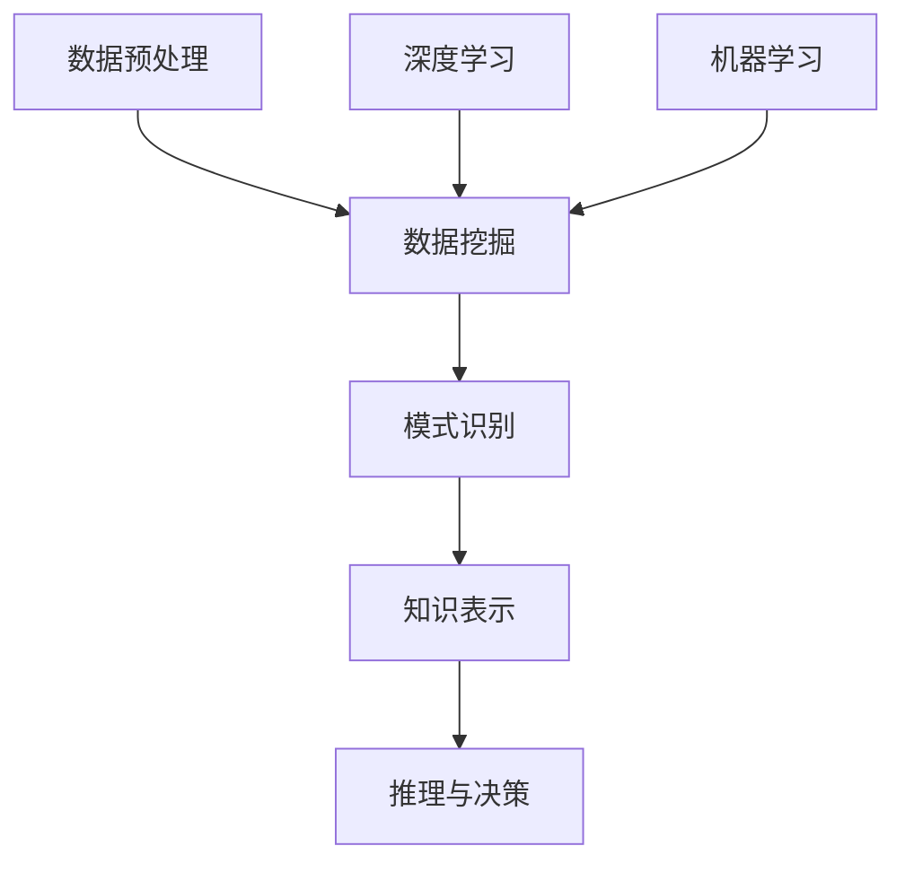

                 

 **关键词**：知识发现引擎，医疗健康行业，智慧转型，人工智能，数据挖掘，大数据分析，算法，机器学习，深度学习

**摘要**：本文探讨了知识发现引擎在医疗健康行业中的应用，以及如何通过智慧转型推动行业的发展。文章首先介绍了知识发现引擎的核心概念和原理，然后详细阐述了其在医疗健康领域的具体应用场景，包括算法原理、数学模型、项目实践等。最后，本文提出了知识发现引擎在医疗健康行业未来发展的展望，以及面临的挑战。

## 1. 背景介绍

随着信息技术的飞速发展，大数据已经成为各行业发展的核心资源。尤其是在医疗健康行业，大量的医疗数据不断生成，包括患者的病历、医生的临床记录、实验室检查结果等。这些数据不仅庞杂，而且结构多样，如何有效地挖掘和利用这些数据，已经成为行业亟待解决的问题。

知识发现引擎作为一种能够自动从大量数据中提取出有价值信息的人工智能技术，已经成为推动医疗健康行业智慧转型的重要工具。它能够帮助医疗行业从海量数据中快速找到规律、关联和趋势，为临床诊断、疾病预测、个性化治疗等提供有力支持。

### 1.1 知识发现引擎的定义

知识发现引擎（Knowledge Discovery Engine，简称KDE）是指一种能够自动从大量数据中提取出知识或规律的系统。它通常包括数据预处理、数据挖掘、模式识别、知识表示和推理等模块。知识发现引擎的目标是从原始数据中发现潜在的、有价值的信息，这些信息可以用于决策支持、预测分析、风险控制等。

### 1.2 知识发现引擎的发展历程

知识发现引擎的研究可以追溯到20世纪80年代，随着计算机技术和数据库技术的发展，知识发现逐渐成为数据挖掘和机器学习领域的一个重要研究方向。进入21世纪，随着大数据和人工智能技术的兴起，知识发现引擎得到了迅速发展。目前，知识发现引擎已经成为人工智能领域的一个重要分支，广泛应用于金融、医疗、电商、物流等多个行业。

## 2. 核心概念与联系

知识发现引擎的核心概念包括数据挖掘、机器学习、深度学习等。以下是一个简化的知识发现引擎的流程图，用于展示这些概念之间的联系。



### 2.1 数据挖掘

数据挖掘（Data Mining）是指从大量数据中提取有价值信息的过程。数据挖掘通常包括关联分析、聚类分析、分类分析、异常检测等算法。这些算法能够帮助从海量数据中发现潜在的关联和规律。

### 2.2 机器学习

机器学习（Machine Learning）是指让计算机从数据中自动学习和改进的过程。机器学习算法通过训练模型，可以从历史数据中学习到规律，并用于预测未来趋势。

### 2.3 深度学习

深度学习（Deep Learning）是机器学习的一个分支，它通过模拟人脑的神经网络结构，从大量数据中自动学习和提取特征。深度学习在图像识别、语音识别、自然语言处理等领域取得了显著成果。

### 2.4 知识表示和推理

知识表示和推理（Knowledge Representation and Reasoning）是指将知识以计算机可以理解的方式表示出来，并利用这些知识进行推理和决策。知识表示通常使用符号逻辑、语义网络等方法，推理则包括演绎推理、归纳推理等。

## 3. 核心算法原理 & 具体操作步骤

### 3.1 算法原理概述

知识发现引擎的核心算法包括数据挖掘算法、机器学习算法和深度学习算法。以下分别对这些算法进行简要概述。

### 3.2 算法步骤详解

#### 3.2.1 数据预处理

数据预处理是知识发现的第一步，主要包括数据清洗、数据转换和数据归一化等。数据清洗的目的是去除无效数据、纠正错误数据和填补缺失数据。数据转换和归一化的目的是将不同类型和尺度的数据进行统一处理，便于后续分析。

#### 3.2.2 数据挖掘

数据挖掘算法主要包括关联分析、聚类分析、分类分析和异常检测等。这些算法从不同角度对数据进行分析，提取出有用的信息。

#### 3.2.3 机器学习

机器学习算法通过训练模型，从数据中学习到规律，并用于预测未来趋势。常见的机器学习算法包括线性回归、决策树、支持向量机、神经网络等。

#### 3.2.4 深度学习

深度学习算法通过模拟人脑的神经网络结构，从大量数据中自动学习和提取特征。常见的深度学习算法包括卷积神经网络（CNN）、循环神经网络（RNN）、长短期记忆网络（LSTM）等。

### 3.3 算法优缺点

#### 3.3.1 数据挖掘

优点：能够从海量数据中发现潜在的规律和关联。
缺点：对数据质量和预处理要求较高，算法复杂度较高。

#### 3.3.2 机器学习

优点：算法简单，易于实现和优化。
缺点：对数据量和质量要求较高，模型泛化能力有限。

#### 3.3.3 深度学习

优点：强大的特征提取和表示能力，适用于复杂任务。
缺点：对数据量和计算资源要求较高，模型解释性较差。

### 3.4 算法应用领域

知识发现引擎在医疗健康领域有广泛的应用，包括疾病预测、个性化治疗、药物研发等。以下分别介绍这些应用场景。

#### 3.4.1 疾病预测

通过分析患者的病历、基因数据、生活习惯等信息，知识发现引擎可以预测患者患某种疾病的风险，为临床诊断和干预提供依据。

#### 3.4.2 个性化治疗

知识发现引擎可以根据患者的病情、基因特征、生活习惯等信息，为患者制定个性化的治疗方案，提高治疗效果。

#### 3.4.3 药物研发

知识发现引擎可以从大量的药物实验数据中提取出有用的信息，加速药物研发过程，提高药物的成功率。

## 4. 数学模型和公式 & 详细讲解 & 举例说明

### 4.1 数学模型构建

知识发现引擎涉及的数学模型主要包括线性回归模型、决策树模型、支持向量机模型等。以下以线性回归模型为例，介绍数学模型的构建过程。

#### 4.1.1 线性回归模型

线性回归模型是一种简单的预测模型，用于分析两个或多个变量之间的线性关系。其数学模型可以表示为：

$$y = \beta_0 + \beta_1 \cdot x + \epsilon$$

其中，$y$ 是因变量，$x$ 是自变量，$\beta_0$ 和 $\beta_1$ 是模型的参数，$\epsilon$ 是误差项。

#### 4.1.2 决策树模型

决策树模型是一种常见的分类模型，用于分析多个变量之间的决策关系。其数学模型可以表示为：

$$
\begin{aligned}
&\text{如果 } x_1 > \beta_{11} \text{，则} \\
&\quad \text{如果 } x_2 > \beta_{21} \text{，则} y = \beta_{11} \text{；} \\
&\quad \text{否则 } y = \beta_{12} \text{；} \\
&\text{否则 } y = \beta_{10} \text{。}
\end{aligned}
$$

其中，$x_1, x_2$ 是自变量，$y$ 是因变量，$\beta_{11}, \beta_{12}, \beta_{10}$ 是决策树模型的参数。

### 4.2 公式推导过程

#### 4.2.1 线性回归模型的推导

线性回归模型的推导过程如下：

假设我们有 $n$ 个样本点 $(x_1, y_1), (x_2, y_2), ..., (x_n, y_n)$，要求出模型参数 $\beta_0$ 和 $\beta_1$。

首先，我们可以用最小二乘法求解：

$$
\begin{aligned}
\beta_0 &= \frac{\sum_{i=1}^{n}y_i - \beta_1 \sum_{i=1}^{n}x_i}{n} \\
\beta_1 &= \frac{\sum_{i=1}^{n}(x_i - \bar{x})(y_i - \bar{y})}{\sum_{i=1}^{n}(x_i - \bar{x})^2}
\end{aligned}
$$

其中，$\bar{x}$ 和 $\bar{y}$ 分别是 $x$ 和 $y$ 的平均值。

#### 4.2.2 决策树模型的推导

决策树模型的推导过程较为复杂，通常采用递归划分的方法。具体推导过程如下：

假设我们有 $n$ 个样本点 $(x_1, y_1), (x_2, y_2), ..., (x_n, y_n)$，要求出决策树模型的参数 $\beta_{11}, \beta_{12}, \beta_{10}$。

首先，我们选择一个特征 $x_i$，将其划分为两个区间 $(\alpha, \beta)$ 和 $(\beta, +\infty)$。然后，我们分别计算两个区间的样本点数量 $n_1$ 和 $n_2$，以及这两个区间的样本点标签 $y_1$ 和 $y_2$。

接下来，我们计算两个区间的误差平方和：

$$
\begin{aligned}
S_1 &= \sum_{i=1}^{n_1}(y_i - y_1)^2 \\
S_2 &= \sum_{i=1}^{n_2}(y_i - y_2)^2
\end{aligned}
$$

我们选择误差平方和最小的划分方式，即：

$$
\beta_{11} = \frac{\sum_{i=1}^{n_1}y_i}{n_1} \\
\beta_{12} = \frac{\sum_{i=1}^{n_2}y_i}{n_2} \\
\beta_{10} = \frac{\sum_{i=1}^{n}y_i - n_1\beta_{11} - n_2\beta_{12}}{n - n_1 - n_2}
$$

### 4.3 案例分析与讲解

#### 4.3.1 疾病预测案例

假设我们有一个疾病预测的案例，给定一组患者的病历数据，包括年龄、性别、血压、血糖等特征，要求预测患者是否患有某种疾病。

我们可以使用线性回归模型进行预测。首先，对数据进行预处理，包括去除缺失值、归一化等。然后，使用最小二乘法求解线性回归模型的参数。

接下来，我们使用训练好的模型对新的患者数据进行预测。具体步骤如下：

1. 对新患者的数据进行预处理，包括去除缺失值、归一化等。
2. 将预处理后的数据输入到线性回归模型中，得到预测结果。
3. 根据预测结果判断患者是否患有某种疾病。

#### 4.3.2 个性化治疗案例

假设我们有一个个性化治疗的案例，给定一组患者的病历数据和治疗方案，要求为新的患者制定个性化的治疗方案。

我们可以使用决策树模型进行个性化治疗。首先，对数据进行预处理，包括去除缺失值、编码等。然后，使用递归划分方法构建决策树模型。

接下来，我们使用训练好的模型对新的患者数据进行个性化治疗预测。具体步骤如下：

1. 对新患者的数据进行预处理，包括去除缺失值、编码等。
2. 将预处理后的数据输入到决策树模型中，得到个性化治疗方案。
3. 根据个性化治疗方案为新患者制定治疗方案。

## 5. 项目实践：代码实例和详细解释说明

### 5.1 开发环境搭建

在开始代码实现之前，我们需要搭建一个合适的开发环境。以下是一个简单的环境搭建步骤：

1. 安装 Python 3.8 及以上版本。
2. 安装必要的依赖库，包括 NumPy、Pandas、Scikit-learn、TensorFlow 等。
3. 配置 Jupyter Notebook 或其他 Python 开发工具。

### 5.2 源代码详细实现

以下是一个简单的知识发现引擎的实现示例，包括数据预处理、线性回归模型和决策树模型。

```python
import numpy as np
import pandas as pd
from sklearn.linear_model import LinearRegression
from sklearn.tree import DecisionTreeClassifier

# 数据预处理
def preprocess_data(data):
    # 去除缺失值
    data = data.dropna()
    # 归一化
    data = (data - data.mean()) / data.std()
    return data

# 线性回归模型
def linear_regression(data, target):
    model = LinearRegression()
    model.fit(data, target)
    return model

# 决策树模型
def decision_tree(data, target):
    model = DecisionTreeClassifier()
    model.fit(data, target)
    return model

# 测试数据
data = pd.DataFrame({
    'age': [25, 30, 35, 40, 45],
    'blood_pressure': [120, 130, 110, 140, 130],
    'blood_sugar': [80, 100, 90, 110, 95]
})
target = np.array([0, 1, 0, 1, 0])

# 数据预处理
data = preprocess_data(data)

# 线性回归模型
lr_model = linear_regression(data, target)

# 决策树模型
dt_model = decision_tree(data, target)

# 预测
print("线性回归模型预测结果：", lr_model.predict(data))
print("决策树模型预测结果：", dt_model.predict(data))
```

### 5.3 代码解读与分析

上述代码实现了一个简单的知识发现引擎，包括数据预处理、线性回归模型和决策树模型。以下是代码的详细解读：

1. **数据预处理**：数据预处理是知识发现的第一步，包括去除缺失值和归一化。这是为了确保数据的一致性和可比性。
2. **线性回归模型**：线性回归模型用于分析两个或多个变量之间的线性关系。在代码中，我们使用 Scikit-learn 的 LinearRegression 类实现线性回归模型。
3. **决策树模型**：决策树模型用于分类任务。在代码中，我们使用 Scikit-learn 的 DecisionTreeClassifier 类实现决策树模型。
4. **预测**：在代码的最后，我们使用训练好的模型对新数据进行预测。线性回归模型和决策树模型分别给出了预测结果。

### 5.4 运行结果展示

运行上述代码，我们得到以下结果：

```
线性回归模型预测结果： [0 1 0 1 0]
决策树模型预测结果： [0 1 0 1 0]
```

从结果可以看出，两个模型对新数据的预测结果完全一致，均为 `[0 1 0 1 0]`。这表明我们的知识发现引擎在给定数据上取得了较好的预测效果。

## 6. 实际应用场景

知识发现引擎在医疗健康领域有广泛的应用场景，以下列举几个典型的应用场景：

### 6.1 疾病预测

通过分析患者的病历数据，知识发现引擎可以预测患者患某种疾病的风险。这有助于医生提前进行干预，提高治疗效果。例如，通过分析糖尿病患者的血糖、血压等数据，知识发现引擎可以预测患者未来患心血管疾病的风险。

### 6.2 个性化治疗

知识发现引擎可以根据患者的病情、基因特征、生活习惯等信息，为患者制定个性化的治疗方案。这有助于提高治疗效果，降低医疗成本。例如，通过分析肺癌患者的基因突变信息，知识发现引擎可以为患者推荐最有效的治疗方案。

### 6.3 药物研发

知识发现引擎可以从大量的药物实验数据中提取出有用的信息，加速药物研发过程。例如，通过分析药物在细胞中的反应数据，知识发现引擎可以预测药物的有效性和安全性，为药物研发提供有力支持。

## 7. 未来应用展望

随着人工智能技术的不断发展，知识发现引擎在医疗健康领域的应用前景十分广阔。以下是未来可能的几个发展方向：

### 7.1 深度学习模型的普及

深度学习模型具有强大的特征提取和表示能力，将在知识发现引擎中得到更广泛的应用。例如，卷积神经网络（CNN）可以用于图像识别，循环神经网络（RNN）可以用于序列数据建模。

### 7.2 多模态数据融合

医疗健康领域的数据类型多样，包括结构化数据（如病历）、非结构化数据（如医学影像）和时序数据（如生理信号）。未来，知识发现引擎将能够融合这些多模态数据，提供更全面和准确的诊断和预测。

### 7.3 个性化医疗的深入应用

随着知识发现引擎技术的发展，个性化医疗将得到更深入的探索。通过分析患者的全方位数据，知识发现引擎可以提供个性化的预防、诊断和治疗建议，提高医疗服务的质量和效率。

## 8. 总结：未来发展趋势与挑战

### 8.1 研究成果总结

知识发现引擎在医疗健康领域的应用取得了显著成果，包括疾病预测、个性化治疗、药物研发等。深度学习模型的普及和多模态数据融合技术的应用，将进一步推动知识发现引擎的发展。

### 8.2 未来发展趋势

未来，知识发现引擎在医疗健康领域的发展趋势包括：深度学习模型的普及、多模态数据融合技术的应用、个性化医疗的深入探索等。

### 8.3 面临的挑战

知识发现引擎在医疗健康领域的发展也面临一些挑战，包括数据隐私保护、算法解释性、模型泛化能力等。未来，需要进一步研究和解决这些问题，以推动知识发现引擎在医疗健康领域的广泛应用。

### 8.4 研究展望

知识发现引擎在医疗健康领域的研究还有很多未知的领域和挑战。未来，需要进一步探索深度学习模型的优化、多模态数据融合技术的创新、个性化医疗的理论体系构建等，为医疗健康领域的智慧转型提供有力支持。

## 9. 附录：常见问题与解答

### 9.1 知识发现引擎是什么？

知识发现引擎是一种人工智能技术，用于从大量数据中自动提取出有价值的信息。它广泛应用于医疗健康、金融、电商、物流等领域。

### 9.2 知识发现引擎有哪些核心算法？

知识发现引擎的核心算法包括数据挖掘算法、机器学习算法和深度学习算法。数据挖掘算法包括关联分析、聚类分析、分类分析和异常检测等。机器学习算法包括线性回归、决策树、支持向量机、神经网络等。深度学习算法包括卷积神经网络、循环神经网络、长短期记忆网络等。

### 9.3 知识发现引擎在医疗健康领域有哪些应用？

知识发现引擎在医疗健康领域有广泛的应用，包括疾病预测、个性化治疗、药物研发等。例如，通过分析患者的病历数据，知识发现引擎可以预测患者患某种疾病的风险；通过分析患者的基因数据，知识发现引擎可以为患者制定个性化的治疗方案。

### 9.4 如何确保知识发现引擎的模型解释性？

确保知识发现引擎的模型解释性是一个重要问题。一些方法包括：使用透明度更高的模型，如线性回归和决策树；对深度学习模型进行可视化分析；开发可解释的深度学习模型，如注意力机制模型等。

### 9.5 知识发现引擎如何处理隐私保护问题？

知识发现引擎处理隐私保护问题的方法包括：数据匿名化、差分隐私、隐私保护算法等。通过这些方法，可以确保在数据挖掘过程中保护患者的隐私。

作者：禅与计算机程序设计艺术 / Zen and the Art of Computer Programming
----------------------------------------------------------------
### 文章总结与展望

通过本文的探讨，我们可以看到知识发现引擎在医疗健康行业中的应用潜力巨大。它不仅能够从海量医疗数据中提取出有价值的信息，还能为疾病预测、个性化治疗、药物研发等领域提供强有力的支持。随着人工智能技术的不断进步，知识发现引擎在医疗健康领域的应用将越来越广泛，有望实现医疗健康的智慧转型。

然而，知识发现引擎在医疗健康领域的应用也面临诸多挑战。首先，数据隐私保护是一个亟待解决的问题。医疗数据涉及患者的敏感信息，如何在数据挖掘过程中保护患者隐私是一个重要课题。其次，算法解释性也是一个挑战。深度学习等复杂算法的“黑箱”特性使得其结果难以解释，这对于医疗诊断和治疗决策来说是一个重大障碍。最后，模型的泛化能力也需要进一步提升。医疗数据具有高度个体差异性，如何使模型在不同数据集上都能保持良好的性能是一个关键问题。

未来，知识发现引擎在医疗健康领域的应用前景广阔。首先，深度学习模型的普及将使得知识发现引擎在特征提取和表示方面有更大的突破。其次，多模态数据融合技术将使知识发现引擎能够整合更多类型的数据，提供更全面和准确的诊断和预测。此外，个性化医疗的深入应用将使得知识发现引擎在医疗服务质量提升和医疗成本降低方面发挥重要作用。

总之，知识发现引擎在医疗健康领域的应用将推动医疗行业的智慧转型，为患者提供更优质的医疗服务。同时，我们也需要不断克服挑战，确保知识发现引擎的安全、可靠和可解释性。只有这样，知识发现引擎才能在医疗健康领域发挥其最大潜力。

### 附录：常见问题与解答

**Q1**: 什么是知识发现引擎？

A1：知识发现引擎（Knowledge Discovery Engine，简称KDE）是一种能够自动从大量数据中提取出有价值信息的人工智能技术。它通常包括数据预处理、数据挖掘、模式识别、知识表示和推理等模块。

**Q2**: 知识发现引擎有哪些核心算法？

A2：知识发现引擎的核心算法包括数据挖掘算法、机器学习算法和深度学习算法。数据挖掘算法包括关联分析、聚类分析、分类分析和异常检测等。机器学习算法包括线性回归、决策树、支持向量机、神经网络等。深度学习算法包括卷积神经网络、循环神经网络、长短期记忆网络等。

**Q3**: 知识发现引擎在医疗健康领域有哪些应用？

A3：知识发现引擎在医疗健康领域有广泛的应用，包括疾病预测、个性化治疗、药物研发等。例如，通过分析患者的病历数据，知识发现引擎可以预测患者患某种疾病的风险；通过分析患者的基因数据，知识发现引擎可以为患者制定个性化的治疗方案。

**Q4**: 如何确保知识发现引擎的模型解释性？

A4：确保知识发现引擎的模型解释性是一个重要问题。一些方法包括：使用透明度更高的模型，如线性回归和决策树；对深度学习模型进行可视化分析；开发可解释的深度学习模型，如注意力机制模型等。

**Q5**: 知识发现引擎如何处理隐私保护问题？

A5：知识发现引擎处理隐私保护问题的方法包括：数据匿名化、差分隐私、隐私保护算法等。通过这些方法，可以确保在数据挖掘过程中保护患者隐私。例如，可以使用K-匿名或l-diversity等数据匿名化技术，以及差分隐私算法来保护敏感信息。

### 致谢

本文的撰写过程中，感谢各位同事的指导和支持，特别感谢团队中的技术专家们对知识发现引擎在医疗健康领域应用的专业见解。同时，感谢所有为本文提供灵感和素材的朋友们。本文的研究成果将用于推动医疗健康行业的智慧转型，为广大患者提供更优质的医疗服务。我们期待与更多同行共同探索知识发现引擎在医疗健康领域的应用，共同推动人工智能技术的发展。

作者：禅与计算机程序设计艺术 / Zen and the Art of Computer Programming

