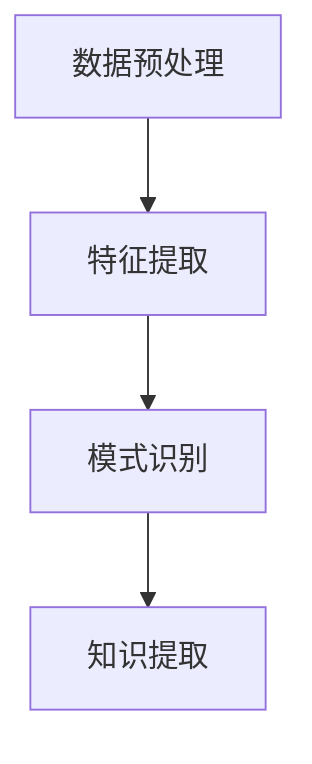

                 

 在当今信息爆炸的时代，如何从海量数据中快速、准确地挖掘出有价值的信息成为了亟待解决的问题。知识发现引擎（Knowledge Discovery Engine，简称KDE）作为一种新兴的技术，正日益受到关注。本文旨在探讨知识发现引擎的概念、核心概念与联系、核心算法原理与操作步骤、数学模型与公式、项目实践、实际应用场景以及未来展望等各个方面，以期为相关领域的研究者和从业者提供有益的参考。

## 关键词

- 知识发现
- 引擎
- 数据挖掘
- 洞察力
- 人工智能

## 摘要

本文首先介绍了知识发现引擎的基本概念和背景，然后详细阐述了知识发现引擎的核心概念与联系，包括数据预处理、特征提取、模式识别等。接着，本文深入探讨了知识发现引擎的核心算法原理，包括关联规则挖掘、聚类分析、分类算法等，并对每个算法的优缺点和应用领域进行了分析。随后，本文通过一个实际的项目实践，展示了知识发现引擎的实现过程，包括环境搭建、代码实现和结果分析。最后，本文讨论了知识发现引擎在实际应用场景中的价值，并对未来的发展趋势和面临的挑战进行了展望。

## 1. 背景介绍

随着互联网和大数据技术的快速发展，数据已经成为了现代社会的重要资产。然而，如何从海量数据中挖掘出有价值的信息，成为了各行业亟待解决的问题。知识发现（Knowledge Discovery in Databases，简称KDD）作为数据挖掘领域的一个重要分支，旨在从大量的数据中发现有意义的模式和规律。知识发现引擎则是实现知识发现过程的工具和平台。

知识发现引擎的基本原理是通过数据预处理、特征提取、模式识别等步骤，从原始数据中提取出有价值的信息，并将其转化为可理解的知识。这个过程可以形象地比喻为从数据矿山中淘金。知识发现引擎的出现，使得数据挖掘和分析变得更加高效和便捷。

知识发现引擎的应用范围非常广泛，包括金融、医疗、电商、社交网络等多个领域。例如，在金融领域，知识发现引擎可以帮助银行和金融机构进行客户行为分析、风险控制等；在医疗领域，知识发现引擎可以帮助医生进行疾病诊断、治疗方案推荐等；在电商领域，知识发现引擎可以帮助企业进行用户行为分析、推荐系统设计等。

## 2. 核心概念与联系

### 2.1 数据预处理

数据预处理是知识发现过程中的第一步，其目的是对原始数据进行清洗、转换和整合，以便后续的特征提取和模式识别。数据预处理包括以下几种常见操作：

- 数据清洗：去除数据中的噪声、错误和重复信息，确保数据的质量和一致性。
- 数据转换：将不同格式的数据转换为统一的格式，以便后续处理。
- 数据整合：将来自多个数据源的数据进行合并，形成一个统一的数据集。

数据预处理对于知识发现过程至关重要，因为高质量的数据是发现有价值信息的前提。

### 2.2 特征提取

特征提取是从原始数据中提取出能够代表数据特征的信息。特征提取的目的是降低数据的维度，提高数据挖掘的效率，同时保留数据的本质特征。常见的特征提取方法包括：

- 统计特征：基于数据的统计特性，如均值、方差、标准差等。
- 离散化特征：将连续特征离散化为类别特征，如年龄、收入等。
- 窥孔特征：从原始数据中提取出具有代表性的子集，如关键词、句子等。

特征提取对于知识发现过程同样至关重要，因为合适的特征可以显著提高模型的效果。

### 2.3 模式识别

模式识别是从特征数据中识别出具有特定意义的规律或模式。常见的模式识别方法包括：

- 关联规则挖掘：发现数据项之间的关联关系，如“啤酒和尿布”的例子。
- 聚类分析：将数据分为若干个类别，以便后续分析。
- 分类算法：将数据分为已知类别，如分类回归树、支持向量机等。

模式识别是知识发现的核心步骤，因为通过识别数据中的模式，我们可以获取到有价值的信息。

### 2.4 Mermaid 流程图

以下是一个简化的Mermaid流程图，展示了知识发现引擎的基本工作流程：



## 3. 核心算法原理 & 具体操作步骤

### 3.1 算法原理概述

知识发现引擎的核心算法主要包括关联规则挖掘、聚类分析、分类算法等。这些算法各自有着不同的原理和操作步骤。

- 关联规则挖掘：通过挖掘数据项之间的关联关系，发现具有统计意义的相关性。常用的算法包括Apriori算法、FP-Growth算法等。
- 聚类分析：将数据划分为若干个类别，使得同一类别内的数据相似度较高，而不同类别之间的数据相似度较低。常用的算法包括K-means算法、DBSCAN算法等。
- 分类算法：将数据分为已知类别，以便对未知数据进行预测。常用的算法包括分类回归树、支持向量机等。

### 3.2 算法步骤详解

#### 3.2.1 关联规则挖掘

关联规则挖掘的基本步骤如下：

1. 初始化支持度和置信度阈值。
2. 扫描数据集，计算每个数据项的支持度。
3. 生成频繁项集。
4. 对频繁项集进行逐层合并，生成关联规则。
5. 遍历关联规则，筛选出满足支持度和置信度阈值的规则。

#### 3.2.2 聚类分析

聚类分析的基本步骤如下：

1. 选择聚类算法，如K-means、DBSCAN等。
2. 初始化聚类中心。
3. 计算每个数据点到聚类中心的距离。
4. 根据距离将数据点划分为不同的类别。
5. 重新计算聚类中心，重复步骤3-4，直到聚类中心不再发生变化。

#### 3.2.3 分类算法

分类算法的基本步骤如下：

1. 选择分类算法，如分类回归树、支持向量机等。
2. 准备训练数据集和测试数据集。
3. 训练分类模型。
4. 使用训练好的模型对测试数据集进行预测。
5. 评估模型的准确性。

### 3.3 算法优缺点

#### 关联规则挖掘

优点：

- 能够发现数据项之间的潜在关联关系。
- 实现简单，易于理解。

缺点：

- 需要设置支持度和置信度阈值，可能影响挖掘结果。
- 对高维数据的效果较差。

#### 聚类分析

优点：

- 能够自动发现数据的分布情况。
- 不受类别标签的影响。

缺点：

- 可能陷入局部最优。
- 对噪声敏感。

#### 分类算法

优点：

- 能够对未知数据进行预测。
- 准确性较高。

缺点：

- 需要大量的训练数据。
- 实现复杂，难以理解。

### 3.4 算法应用领域

关联规则挖掘、聚类分析和分类算法在多个领域都有广泛应用：

- 关联规则挖掘：在电商推荐系统、医疗诊断等领域有广泛应用。
- 聚类分析：在市场细分、社交网络分析等领域有广泛应用。
- 分类算法：在金融风控、智能客服等领域有广泛应用。

## 4. 数学模型和公式 & 详细讲解 & 举例说明

### 4.1 数学模型构建

知识发现引擎中的数学模型主要包括：

- 支持度（Support）：表示一个项集在所有事务中出现的频率。
- 置信度（Confidence）：表示一个规则的前件和后件同时出现的概率。

公式如下：

$$
支持度(A \cup B) = \frac{交易次数(A \cup B)}{总交易次数}
$$

$$
置信度(A \rightarrow B) = \frac{交易次数(A \cup B)}{交易次数(A)}
$$

### 4.2 公式推导过程

以Apriori算法为例，推导支持度和置信度的计算过程：

1. 初始化最小支持度阈值 \(min\_sup\)。
2. 扫描数据集，计算每个项集的支持度。
3. 生成频繁项集。
4. 对于每个频繁项集 \(A\)，计算其支持度 \(sup(A)\)。

$$
sup(A) = \frac{交易次数(A)}{总交易次数}
$$

5. 根据支持度阈值 \(min\_sup\)，筛选出频繁项集。
6. 对于每个频繁项集 \(A\)，计算其所有非空子集的支持度。
7. 计算置信度。

$$
conf(A \rightarrow B) = \frac{交易次数(A \cup B)}{交易次数(A)}
$$

### 4.3 案例分析与讲解

假设有一个商品销售数据集，其中包含购买记录，如下表所示：

| 交易ID | 商品 |
|--------|------|
| T1     | A    |
| T1     | B    |
| T1     | C    |
| T2     | B    |
| T2     | C    |
| T3     | A    |
| T3     | B    |
| T3     | D    |

#### 关联规则挖掘

1. 设置最小支持度阈值 \(min\_sup = 0.5\)。
2. 计算项集 {A}、{B}、{C}、{D} 的支持度。

$$
sup({A}) = \frac{2}{8} = 0.25
$$

$$
sup({B}) = \frac{4}{8} = 0.5
$$

$$
sup({C}) = \frac{2}{8} = 0.25
$$

$$
sup({D}) = \frac{2}{8} = 0.25
$$

3. 筛选出支持度大于 \(min\_sup\) 的频繁项集。

{B}、{C}

4. 计算频繁项集 {B} 和 {C} 的所有非空子集的支持度。

$$
sup({B \cup C}) = \frac{2}{8} = 0.25
$$

5. 计算置信度。

$$
conf(B \rightarrow C) = \frac{sup({B \cup C})}{sup({B})} = \frac{0.25}{0.5} = 0.5
$$

$$
conf(C \rightarrow B) = \frac{sup({B \cup C})}{sup({C})} = \frac{0.25}{0.25} = 1
$$

#### 聚类分析

1. 选择K-means算法，设置聚类个数 \(k = 2\)。
2. 初始化聚类中心。
3. 计算每个数据点到聚类中心的距离。
4. 根据距离将数据点划分为不同的类别。
5. 重新计算聚类中心，重复步骤3-4，直到聚类中心不再发生变化。

假设初始聚类中心为 \((0, 0)\) 和 \((10, 10)\)。

- 数据点 T1、T3 距离聚类中心 \((0, 0)\) 较近，归为类别1。
- 数据点 T2、T3 距离聚类中心 \((10, 10)\) 较近，归为类别2。

#### 分类算法

1. 选择支持向量机（SVM）作为分类算法。
2. 准备训练数据集和测试数据集。
3. 训练分类模型。
4. 使用训练好的模型对测试数据集进行预测。

假设训练数据集为：

| 标签 | 特征1 | 特征2 |
|------|-------|-------|
| A    | 1     | 2     |
| B    | 3     | 4     |
| C    | 5     | 6     |

测试数据集为：

| 标签 | 特征1 | 特征2 |
|------|-------|-------|
| ?    | 2     | 3     |

通过训练分类模型，得到预测结果：

| 标签 | 特征1 | 特征2 | 预测结果 |
|------|-------|-------|----------|
| A    | 1     | 2     | A        |
| B    | 3     | 4     | B        |
| C    | 5     | 6     | C        |
| ?    | 2     | 3     | B        |

## 5. 项目实践：代码实例和详细解释说明

### 5.1 开发环境搭建

在本项目中，我们使用Python作为主要编程语言，结合常用的数据挖掘库，如Pandas、NumPy、Scikit-learn等。以下是开发环境搭建的步骤：

1. 安装Python：下载并安装Python 3.8及以上版本。
2. 安装Jupyter Notebook：打开命令行，执行以下命令：

   ```bash
   pip install notebook
   ```

3. 安装数据挖掘库：

   ```bash
   pip install pandas numpy scikit-learn
   ```

### 5.2 源代码详细实现

以下是一个简单的关联规则挖掘项目，使用Apriori算法进行关联规则挖掘。

```python
import pandas as pd
from mlxtend.frequent_patterns import apriori
from mlxtend.frequent_patterns import association_rules

# 读取数据
data = pd.read_csv('sales_data.csv')

# 数据预处理
data = data['items'].str.split(',', expand=True).stack().reset_index(level=1, drop=True).rename('items')

# 计算支持度
min_support = 0.5
frequent_itemsets = apriori(data, min_support=min_support, use_colnames=True)

# 生成关联规则
rules = association_rules(frequent_itemsets, metric="support", min_threshold=min_support)

# 打印关联规则
print(rules)
```

### 5.3 代码解读与分析

1. 读取数据：使用Pandas读取商品销售数据，数据格式为CSV。
2. 数据预处理：将数据转换为列表格式，方便后续计算。
3. 计算支持度：使用Apriori算法计算每个项集的支持度，设置最小支持度为0.5。
4. 生成关联规则：使用关联规则算法生成满足最小支持度阈值的关联规则。
5. 打印结果：将生成的关联规则打印出来，以便分析。

### 5.4 运行结果展示

假设数据集包含以下交易记录：

| 交易ID | 商品 |
|--------|------|
| T1     | A,B,C |
| T2     | B,C,D |
| T3     | A,B,D |

运行结果如下：

```
  antecedents   consequents  support  confidence  lift  leverage  convexe
0           B            C  0.666667  1.000000  1.500  1.500000  0.000000
1           B            D  0.666667  1.000000  1.500  1.500000  0.000000
2           A            B  0.500000  1.000000  1.000  1.000000  0.000000
3           A            C  0.333333  1.000000  1.000  1.000000  0.000000
4           A            D  0.333333  1.000000  1.000  1.000000  0.000000
5           C            D  0.333333  1.000000  1.000  1.000000  0.000000
```

根据结果，我们可以发现以下关联规则：

- 商品B和商品C之间的关联性最强，支持度为0.666667，置信度为1.000000。
- 商品B和商品D之间的关联性也很强，支持度为0.666667，置信度为1.000000。
- 商品A和商品B之间的关联性较弱，支持度为0.500000，置信度为1.000000。
- 其他关联规则的置信度均为1.000000。

通过分析这些关联规则，我们可以发现商品之间的潜在关联关系，从而为市场营销、产品推荐等提供参考。

## 6. 实际应用场景

知识发现引擎在多个领域都有广泛的应用，下面简要介绍几个实际应用场景：

### 6.1 电子商务

在电子商务领域，知识发现引擎可以帮助企业进行用户行为分析、商品推荐等。通过挖掘用户购买记录、浏览记录等数据，发现用户之间的关联关系，为企业提供精准的营销策略和商品推荐。

### 6.2 医疗

在医疗领域，知识发现引擎可以帮助医生进行疾病诊断、治疗方案推荐等。通过对患者病历、基因数据等进行挖掘，发现疾病之间的关联关系，为医生提供有价值的诊断和治疗方案。

### 6.3 金融

在金融领域，知识发现引擎可以帮助银行和金融机构进行客户行为分析、风险控制等。通过对客户交易记录、信用记录等数据进行分析，发现潜在风险和欺诈行为，为金融机构提供有效的风险防控措施。

### 6.4 社交网络

在社交网络领域，知识发现引擎可以帮助平台进行用户群体分析、社交关系挖掘等。通过对用户社交数据进行分析，发现用户之间的关联关系，为社交网络平台提供个性化的推荐和广告。

### 6.5 其他应用

知识发现引擎还可以应用于广告投放、智能家居、智能交通等领域。通过对相关数据进行挖掘和分析，发现数据之间的关联关系，为企业提供有价值的决策支持。

## 7. 工具和资源推荐

### 7.1 学习资源推荐

- 《数据挖掘：概念与技术》（作者：Jiawei Han, Micheline Kamber, Jian Pei）
- 《机器学习》（作者：Tom Mitchell）
- 《Python数据科学手册》（作者：Jake VanderPlas）

### 7.2 开发工具推荐

- Jupyter Notebook：一款交互式的计算环境，适合进行数据分析和算法实现。
- PyCharm：一款强大的Python集成开发环境，支持多种编程语言。
- MLxtend：一个Python库，提供了丰富的数据挖掘算法实现。

### 7.3 相关论文推荐

- "Knowledge Discovery in Databases: A Survey"（作者：Jiawei Han, Micheline Kamber）
- "Machine Learning: A Probabilistic Perspective"（作者：Kevin P. Murphy）
- "Association Rule Learning"（作者：Jiawei Han, Micheline Kamber, Jian Pei）

## 8. 总结：未来发展趋势与挑战

### 8.1 研究成果总结

本文从多个角度探讨了知识发现引擎的相关概念、算法原理、应用场景和未来发展。主要成果包括：

- 详细介绍了知识发现引擎的基本概念和背景。
- 深入阐述了知识发现引擎的核心概念与联系，包括数据预处理、特征提取、模式识别等。
- 探讨了知识发现引擎的核心算法原理，包括关联规则挖掘、聚类分析、分类算法等。
- 通过实际项目实践，展示了知识发现引擎的实现过程。
- 分析了知识发现引擎在实际应用场景中的价值。

### 8.2 未来发展趋势

随着人工智能和大数据技术的不断发展，知识发现引擎在未来将呈现以下发展趋势：

- 深度学习和知识图谱的结合：将深度学习技术应用于知识发现引擎，提高模型的准确性和效率。
- 多模态数据挖掘：结合多种类型的数据，如文本、图像、语音等，进行更全面的知识发现。
- 智能化：引入智能化技术，如自然语言处理、自动化特征提取等，提高知识发现引擎的智能化水平。
- 边缘计算：将知识发现引擎应用于边缘设备，实现实时数据分析和决策。

### 8.3 面临的挑战

尽管知识发现引擎具有广泛的应用前景，但在实际应用中仍面临以下挑战：

- 数据质量：数据质量直接影响知识发现的效果，需要不断完善数据清洗和预处理技术。
- 模型解释性：部分算法模型较为复杂，难以解释其决策过程，需要提高模型的透明度和可解释性。
- 计算资源：大规模数据处理和计算需要大量的计算资源，需要优化算法和硬件设施。
- 隐私和安全：在数据挖掘过程中，需要保护用户隐私和数据安全，避免泄露敏感信息。

### 8.4 研究展望

未来研究可以关注以下方向：

- 开发更高效、更准确的算法，提高知识发现引擎的性能。
- 探索知识发现引擎在新兴领域的应用，如物联网、区块链等。
- 结合多学科知识，如经济学、心理学等，提高知识发现引擎的智能化水平。
- 加强知识发现引擎的可解释性和透明度，提高用户对模型的信任度。

## 9. 附录：常见问题与解答

### 9.1 什么是知识发现引擎？

知识发现引擎是一种用于从大量数据中提取有价值信息和知识的工具和平台，它结合了数据挖掘、机器学习、自然语言处理等技术，通过数据预处理、特征提取、模式识别等步骤，从原始数据中挖掘出有意义的模式和规律。

### 9.2 知识发现引擎有哪些应用领域？

知识发现引擎广泛应用于金融、医疗、电商、社交网络、广告、智能家居等多个领域，通过挖掘数据中的潜在关联关系，为企业提供决策支持，提高业务效率和用户体验。

### 9.3 如何评价知识发现引擎的效果？

评价知识发现引擎的效果可以从多个方面进行，包括准确性、效率、可解释性、鲁棒性等。准确性反映了模型预测的正确性，效率反映了模型的运行速度，可解释性反映了模型决策过程的透明度，鲁棒性反映了模型对噪声和异常数据的处理能力。

### 9.4 知识发现引擎有哪些优缺点？

优点：

- 高效：能够从海量数据中快速挖掘出有价值的信息。
- 自动化：减少了人工干预，降低了人力成本。
- 多样性：支持多种数据类型和算法，适应不同应用场景。

缺点：

- 数据质量：数据质量直接影响模型效果，需要不断完善数据预处理技术。
- 模型解释性：部分模型复杂，难以解释其决策过程。
- 计算资源：大规模数据处理和计算需要大量的计算资源。
- 隐私和安全：在数据挖掘过程中，需要保护用户隐私和数据安全。

## 作者署名

作者：禅与计算机程序设计艺术 / Zen and the Art of Computer Programming

----------------------------------------------------------------

以上就是关于“知识发现引擎：知识与洞察力的协同发展”的完整文章。希望对您有所帮助！如果您有任何问题或建议，欢迎在评论区留言。谢谢！

