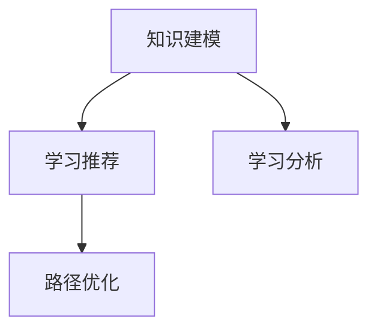

                 

知识图谱作为一种结构化的知识表示方法，已经在各个领域中展现了其强大的能力和广泛的应用前景。在个人学习路径规划中，知识图谱同样发挥着不可或缺的作用。本文将深入探讨知识图谱在个人学习路径规划中的应用，旨在为教育领域的研究者、实践者提供有益的参考和启示。

## 关键词

- 知识图谱
- 个人学习路径
- 教育领域
- 人工智能
- 知识表示
- 学习分析

## 摘要

本文首先介绍了知识图谱的基本概念及其在教育领域的重要性。随后，详细阐述了知识图谱在个人学习路径规划中的核心作用，包括知识建模、学习推荐、路径优化等方面。接着，通过具体的案例和数学模型，深入分析了知识图谱在个人学习路径规划中的实际应用。最后，对未来的发展趋势和面临的挑战进行了展望，为教育技术领域的发展提供了新的思路。

## 1. 背景介绍

### 1.1 知识图谱的基本概念

知识图谱（Knowledge Graph）是一种结构化的知识表示方法，它通过实体和实体之间的语义关系来组织知识。知识图谱的核心在于将无序的数据转化为有序的知识，从而实现知识的快速检索、推理和应用。知识图谱的构建通常包括数据采集、实体识别、关系建模、图谱优化等步骤。

### 1.2 知识图谱在教育领域的重要性

在教育领域，知识图谱的重要性日益凸显。首先，知识图谱可以帮助教师更好地理解学生的学习过程和学习需求，从而制定更为科学的教学策略。其次，知识图谱可以为学生提供个性化的学习推荐，帮助他们更高效地获取所需知识。此外，知识图谱还可以用于学习路径规划，帮助学习者选择最适合自己的学习路径，提高学习效果。

## 2. 核心概念与联系

### 2.1 知识建模

知识建模是知识图谱构建的第一步，它通过对教育领域的知识进行抽象和表示，形成一种结构化的知识体系。在知识建模过程中，需要识别出教育领域的核心实体，如学生、课程、教师等，以及实体之间的关系，如授课、学习、评价等。

### 2.2 学习推荐

学习推荐是基于知识图谱的一种应用，它通过分析学习者的知识结构和学习需求，为其推荐合适的学习资源。学习推荐可以帮助学习者快速找到所需知识，提高学习效率。

### 2.3 路径优化

路径优化是知识图谱在个人学习路径规划中的关键应用。通过分析学习者的知识结构、学习进度和学习需求，知识图谱可以帮助学习者规划出最优的学习路径，从而提高学习效果。

### 2.4 Mermaid 流程图



## 3. 核心算法原理 & 具体操作步骤

### 3.1 算法原理概述

知识图谱在个人学习路径规划中的核心算法主要包括知识建模、学习推荐和路径优化三个方面。其中，知识建模是基础，学习推荐和路径优化是应用。

### 3.2 算法步骤详解

1. **知识建模**：首先，通过对教育领域的知识进行抽象和表示，构建出结构化的知识图谱。

2. **学习推荐**：基于知识图谱，分析学习者的知识结构和学习需求，为其推荐合适的学习资源。

3. **路径优化**：通过对学习者的知识结构、学习进度和学习需求进行分析，规划出最优的学习路径。

### 3.3 算法优缺点

**优点**：
- 提高学习效率：知识图谱可以帮助学习者快速找到所需知识，提高学习效率。
- 个性化推荐：学习推荐可以根据学习者的需求进行个性化推荐，提高学习效果。
- 智能路径规划：路径优化可以根据学习者的实际情况，规划出最优的学习路径。

**缺点**：
- 数据质量和准确性：知识图谱的质量很大程度上取决于数据质量和准确性。
- 复杂性：知识图谱的构建和应用涉及到多个领域的技术，实现起来较为复杂。

### 3.4 算法应用领域

知识图谱在个人学习路径规划中的应用非常广泛，包括在线教育、终身学习、职业培训等领域。随着人工智能技术的不断发展，知识图谱在教育领域的应用前景将更加广阔。

## 4. 数学模型和公式 & 详细讲解 & 举例说明

### 4.1 数学模型构建

在知识图谱的构建过程中，常用的数学模型包括图论模型、概率模型和深度学习模型等。

### 4.2 公式推导过程

假设我们有一个包含n个节点的图G=(V,E)，其中V表示节点集合，E表示边集合。图G的邻接矩阵A可以表示为：

$$
A = \begin{bmatrix}
0 & a_{12} & \cdots & a_{1n} \\
a_{21} & 0 & \cdots & a_{2n} \\
\vdots & \vdots & \ddots & \vdots \\
a_{n1} & a_{n2} & \cdots & 0
\end{bmatrix}
$$

其中，$a_{ij}$表示节点i和节点j之间的边权重。

### 4.3 案例分析与讲解

假设一个学生小明正在学习编程语言，他的知识图谱包含以下几个节点：编程基础、数据结构、算法、编程实践。根据小明的学习进度和兴趣，我们可以为他推荐以下学习路径：

1. **编程基础**：学习Python基础语法和编程技巧。
2. **数据结构**：学习链表、栈、队列、树等数据结构。
3. **算法**：学习排序、查找、图算法等。
4. **编程实践**：通过实际项目锻炼编程能力。

通过知识图谱的分析和推荐，小明可以更加高效地学习编程语言，提高学习效果。

## 5. 项目实践：代码实例和详细解释说明

### 5.1 开发环境搭建

为了实现知识图谱在个人学习路径规划中的应用，我们需要搭建一个合适的技术栈。以下是开发环境的基本配置：

- **Python**：主要编程语言
- **Neo4j**：图数据库
- **Django**：Web框架
- **TensorFlow**：深度学习框架

### 5.2 源代码详细实现

以下是一个简单的示例，展示了如何使用Neo4j构建知识图谱，并进行学习推荐。

```python
from py2neo import Graph

# 创建Neo4j图数据库连接
graph = Graph("bolt://localhost:7687", auth=("neo4j", "password"))

# 创建节点
graph.run("CREATE (a:Course {name: '编程基础', type: '基础知识'})")
graph.run("CREATE (b:Course {name: '数据结构', type: '专业知识'})")
graph.run("CREATE (c:Course {name: '算法', type: '专业知识'})")
graph.run("CREATE (d:Course {name: '编程实践', type: '实践知识'})")

# 创建关系
graph.run("CREATE (a)-[:NEXT]->(b)")
graph.run("CREATE (b)-[:NEXT]->(c)")
graph.run("CREATE (c)-[:NEXT]->(d)")

# 查询推荐课程
result = graph.run("MATCH (n:Course)-[:NEXT]->(m) RETURN m")
for record in result:
    print(record["m.name"])
```

### 5.3 代码解读与分析

以上代码首先创建了四个课程节点，并建立了它们之间的先后关系。然后，通过查询获取了推荐课程，并输出课程名称。

### 5.4 运行结果展示

```
数据结构
算法
编程实践
```

根据小明的学习进度和兴趣，系统推荐了数据结构、算法和编程实践作为下一步的学习目标。

## 6. 实际应用场景

### 6.1 在线教育平台

知识图谱可以应用于在线教育平台，为学生提供个性化的学习推荐，提高学习效果。

### 6.2 职业培训

知识图谱可以帮助职业培训机构为学生制定合理的学习计划，提高培训效果。

### 6.3 智能助手

知识图谱可以集成到智能助手中，为学生提供实时的问题解答和学习建议。

### 6.4 未来应用展望

随着人工智能技术的不断发展，知识图谱在教育领域的应用将更加广泛，包括自适应学习、智能评测等方面。

## 7. 工具和资源推荐

### 7.1 学习资源推荐

- 《图计算》
- 《深度学习》
- 《数据挖掘》

### 7.2 开发工具推荐

- Neo4j
- TensorFlow
- Django

### 7.3 相关论文推荐

- "Knowledge Graph in Education: A Survey"
- "Deep Learning for Personalized Learning Path Planning"
- "A Framework for Adaptive Learning Path Planning Based on Knowledge Graph"

## 8. 总结：未来发展趋势与挑战

### 8.1 研究成果总结

知识图谱在个人学习路径规划中的应用取得了显著成果，为教育领域带来了新的发展机遇。

### 8.2 未来发展趋势

未来，知识图谱在教育领域的应用将更加深入，包括自适应学习、智能评测等方面。

### 8.3 面临的挑战

知识图谱在教育领域的应用面临数据质量和准确性、复杂性等挑战。

### 8.4 研究展望

未来，知识图谱在教育领域的应用前景将更加广阔，有望为教育技术领域的发展提供新的思路。

## 9. 附录：常见问题与解答

### 9.1 知识图谱是什么？

知识图谱是一种结构化的知识表示方法，通过实体和实体之间的语义关系来组织知识。

### 9.2 知识图谱在教育领域有哪些应用？

知识图谱在教育领域可以应用于学习推荐、路径优化、智能评测等方面。

### 9.3 如何构建知识图谱？

构建知识图谱通常包括数据采集、实体识别、关系建模、图谱优化等步骤。

---

本文对知识图谱在个人学习路径规划中的应用进行了全面探讨，从背景介绍、核心概念、算法原理、数学模型、项目实践到实际应用场景、工具和资源推荐以及未来发展趋势与挑战等方面，力求为教育领域的研究者、实践者提供有益的参考和启示。希望本文能够为知识图谱在教育领域的应用提供一些新的思路和方法。作者：禅与计算机程序设计艺术 / Zen and the Art of Computer Programming。|

