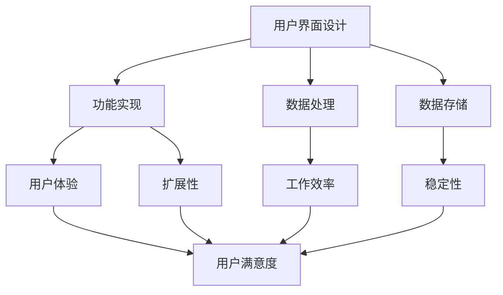
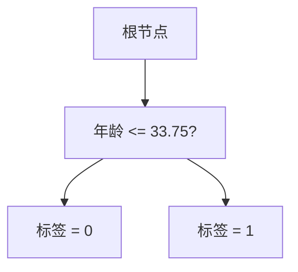

                 

关键词：知识工具、效率、用户体验、人工智能、软件架构、编程

> 摘要：本文将探讨知识工具在现代信息技术中的作用，以及如何通过优化这些工具来提高工作效率和用户体验。从核心概念、算法原理、数学模型，到实际项目实践，我们将深入分析知识工具的设计与实现，并展望其未来发展趋势。

## 1. 背景介绍

随着信息技术的飞速发展，知识工具在各个领域中的应用越来越广泛。这些工具不仅帮助用户管理和组织信息，还极大地提高了工作效率和用户体验。然而，随着用户需求的变化和技术的不断进步，传统的知识工具逐渐暴露出一些问题。首先，许多工具的用户界面不够直观，导致新手用户难以上手。其次，工具的功能不够丰富，难以满足用户多样化的需求。此外，工具之间的数据共享和集成也相对困难，使得用户在处理复杂任务时面临诸多不便。

本文将围绕这些问题，探讨如何通过改进知识工具的设计与实现，提高工作效率和用户体验。我们将从以下几个方面展开讨论：

- 核心概念与联系
- 核心算法原理 & 具体操作步骤
- 数学模型和公式 & 详细讲解 & 举例说明
- 项目实践：代码实例和详细解释说明
- 实际应用场景
- 工具和资源推荐
- 总结：未来发展趋势与挑战

## 2. 核心概念与联系

在讨论知识工具之前，我们需要明确几个核心概念。首先，什么是知识工具？知识工具通常是指用于获取、存储、管理和共享知识的软件应用程序。这些工具可以是专门为特定领域设计的，如学术研究、工程设计、医疗诊断等，也可以是通用的信息管理工具，如笔记应用、文档编辑器、项目管理工具等。

接下来，我们来看一下这些核心概念之间的联系。知识工具的设计与实现涉及多个方面，包括用户界面设计、功能实现、数据处理、数据存储等。其中，用户界面设计直接影响用户体验，而功能实现和数据处理则决定了工具的效率和实用性。此外，数据存储和共享也关系到工具的稳定性和扩展性。

为了更直观地展示这些核心概念之间的联系，我们可以使用 Mermaid 流程图来描述。以下是一个简化的 Mermaid 图：



通过这个流程图，我们可以清晰地看到知识工具的各个组成部分以及它们之间的相互关系。

### 2.1 用户界面设计

用户界面设计是知识工具的核心之一。一个优秀的用户界面应该具备以下几个特点：

- **直观易用**：界面布局清晰，操作流程简洁，减少用户的学习成本。
- **响应迅速**：界面操作响应速度快，提高用户的工作效率。
- **个性化定制**：用户可以根据自己的需求自定义界面和功能。

为了实现这些目标，设计师需要深入了解用户需求和使用场景，进行用户调研和用户体验设计。同时，设计师还需要掌握前端技术，如 HTML、CSS 和 JavaScript，以便实现交互式界面。

### 2.2 功能实现

功能实现是知识工具的核心之一。一个功能强大的知识工具应该能够满足用户多样化的需求，如信息检索、数据可视化、任务管理等。为了实现这些功能，开发者需要具备扎实的编程基础和系统设计能力。

在功能实现过程中，开发者需要考虑以下几个方面：

- **模块化设计**：将工具的功能划分为多个模块，每个模块独立开发、测试和部署，提高开发效率和可维护性。
- **高性能计算**：对于数据处理密集型任务，如数据分析和机器学习，开发者需要优化算法和代码，提高计算效率。
- **可扩展性**：工具的设计应该具备良好的扩展性，以适应未来的功能需求和用户增长。

### 2.3 数据处理

数据处理是知识工具的重要组成部分。数据处理不仅涉及数据的存储和管理，还包括数据的清洗、转换、分析和可视化。为了实现高效的数据处理，开发者需要掌握以下技能：

- **数据结构**：了解各种数据结构，如数组、链表、树、图等，以便高效地存储和操作数据。
- **算法**：掌握常见的排序、搜索、动态规划等算法，以提高数据处理效率。
- **数据库**：了解关系型数据库（如 MySQL、PostgreSQL）和NoSQL数据库（如 MongoDB、Redis），以便高效地存储和管理数据。

### 2.4 数据存储

数据存储是知识工具的基石。一个优秀的知识工具应该能够高效地存储和管理大量数据，并提供灵活的查询和更新功能。为了实现这些目标，开发者需要考虑以下几个方面：

- **数据一致性**：确保数据的完整性和一致性，防止数据丢失或损坏。
- **数据安全**：保护用户数据的安全，防止未经授权的访问和篡改。
- **数据扩展性**：随着用户数据的增长，工具应该能够水平扩展，以保持性能。

### 2.5 用户满意度

用户满意度是衡量知识工具成功与否的重要指标。一个优秀的知识工具应该能够满足用户的期望和需求，提高用户的工作效率和生活质量。为了提高用户满意度，开发者需要关注以下几个方面：

- **用户体验**：设计直观易用的用户界面，提供流畅的操作体验。
- **个性化服务**：根据用户的行为和偏好，提供个性化的服务和推荐。
- **及时反馈**：及时响应用户的反馈和建议，不断优化产品。

## 3. 核心算法原理 & 具体操作步骤

在知识工具的设计与实现中，核心算法起着至关重要的作用。以下，我们将探讨几种常用的核心算法原理，并详细介绍具体操作步骤。

### 3.1 算法原理概述

算法是指解决问题的一系列有序步骤。在知识工具中，常用的算法包括排序算法、搜索算法、数据结构算法、机器学习算法等。

- **排序算法**：用于对数据进行排序，常见的排序算法有冒泡排序、选择排序、插入排序、快速排序等。
- **搜索算法**：用于在数据集合中查找特定元素，常见的搜索算法有线性搜索、二分搜索、深度优先搜索、广度优先搜索等。
- **数据结构算法**：用于实现常见的数据结构，如链表、树、图等，常见的算法包括树的遍历、图的遍历等。
- **机器学习算法**：用于实现数据分析和预测，常见的算法包括线性回归、决策树、支持向量机、神经网络等。

### 3.2 算法步骤详解

以下是几种常见算法的具体操作步骤：

#### 3.2.1 冒泡排序

冒泡排序是一种简单的排序算法，其基本思想是通过多次遍历待排序的数组，比较相邻的元素，并将较大（或较小）的元素交换到数组的右侧（或左侧），最终实现数组的有序排列。

**步骤：**

1. 从数组的第一个元素开始，相邻元素两两对比，如果顺序错误则交换。
2. 经过一轮遍历后，最大（或最小）的元素被交换到数组的末尾。
3. 重复步骤 1 和 2，直到整个数组有序。

**Python 实现示例：**

```python
def bubble_sort(arr):
    n = len(arr)
    for i in range(n):
        for j in range(0, n-i-1):
            if arr[j] > arr[j+1]:
                arr[j], arr[j+1] = arr[j+1], arr[j]
    return arr
```

#### 3.2.2 线性搜索

线性搜索是一种最简单的搜索算法，其基本思想是依次遍历数组中的每个元素，直到找到目标元素或遍历完整个数组。

**步骤：**

1. 从数组的第一个元素开始，依次遍历每个元素。
2. 如果当前元素等于目标元素，返回元素的下标。
3. 如果遍历完整个数组仍未找到目标元素，返回 -1。

**Python 实现示例：**

```python
def linear_search(arr, target):
    for i in range(len(arr)):
        if arr[i] == target:
            return i
    return -1
```

#### 3.2.3 决策树

决策树是一种常见的机器学习算法，其基本思想是通过多个条件判断，将数据集划分为多个子集，并选择具有最高信息增益的属性作为分裂条件。

**步骤：**

1. 计算每个属性的增益率，选择增益率最高的属性作为分裂条件。
2. 使用该属性对数据集进行分裂，生成多个子集。
3. 对每个子集递归执行步骤 1 和 2，直到满足停止条件（如最大深度、最小样本数等）。
4. 根据子集中的分类结果，为每个叶节点分配标签。

**Python 实现示例：**

```python
from sklearn.datasets import load_iris
from sklearn.tree import DecisionTreeClassifier

# 加载数据集
iris = load_iris()
X = iris.data
y = iris.target

# 构建决策树模型
clf = DecisionTreeClassifier()
clf.fit(X, y)

# 可视化决策树
from sklearn.tree import plot_tree
plot_tree(clf)
```

### 3.3 算法优缺点

每种算法都有其优缺点，以下是一些常见算法的优缺点：

- **冒泡排序**：简单易懂，实现简单，但效率较低，时间复杂度为 O(n^2)。
- **线性搜索**：实现简单，但效率较低，时间复杂度为 O(n)。
- **决策树**：易于理解和实现，对非线性数据有一定的识别能力，但可能产生过拟合，且训练时间较长。

### 3.4 算法应用领域

不同的算法适用于不同的应用场景：

- **冒泡排序**：适用于小规模数据的排序，如数据处理前的预处理。
- **线性搜索**：适用于数据量较小或数据结构未排序的场景，如数据库查询。
- **决策树**：适用于分类和回归问题，如金融风控、医学诊断等。

## 4. 数学模型和公式 & 详细讲解 & 举例说明

在知识工具的设计与实现中，数学模型和公式起着至关重要的作用。它们不仅帮助我们理解和分析问题，还为算法的优化和实现提供了理论基础。以下，我们将介绍几种常用的数学模型和公式，并详细讲解其推导过程和实际应用。

### 4.1 数学模型构建

数学模型是通过对现实问题的抽象和简化，建立的一种数学表达式。在知识工具的设计与实现中，常用的数学模型包括线性模型、逻辑回归模型、决策树模型等。

#### 4.1.1 线性模型

线性模型是一种常见的数学模型，其基本形式为：

\[ y = \beta_0 + \beta_1x \]

其中，\( y \) 是因变量，\( x \) 是自变量，\( \beta_0 \) 和 \( \beta_1 \) 是参数。

线性模型适用于描述自变量和因变量之间的线性关系。在实际应用中，我们可以通过最小二乘法来估计参数 \( \beta_0 \) 和 \( \beta_1 \)。

#### 4.1.2 逻辑回归模型

逻辑回归模型是一种广泛应用于分类问题的数学模型，其基本形式为：

\[ P(y=1) = \frac{1}{1 + e^{-(\beta_0 + \beta_1x)}} \]

其中，\( y \) 是因变量，取值为 0 或 1，\( x \) 是自变量，\( \beta_0 \) 和 \( \beta_1 \) 是参数。

逻辑回归模型通过估计参数 \( \beta_0 \) 和 \( \beta_1 \)，将自变量 \( x \) 映射到因变量 \( y \) 的概率。在实际应用中，我们可以通过最大似然估计法来估计参数。

#### 4.1.3 决策树模型

决策树模型是一种基于树结构的分类模型，其基本形式为：

\[ y = f(x) \]

其中，\( y \) 是因变量，\( x \) 是自变量，\( f(x) \) 是决策树函数。

决策树模型通过递归地将数据集划分为多个子集，并选择具有最高信息增益的属性作为分裂条件，最终生成一棵决策树。

### 4.2 公式推导过程

在数学模型的构建过程中，我们需要推导出参数估计的公式。以下，我们将介绍几种常用的参数估计方法。

#### 4.2.1 最小二乘法

最小二乘法是一种常用的参数估计方法，用于估计线性模型的参数。

对于线性模型 \( y = \beta_0 + \beta_1x \)，最小二乘法的目标是找到一组参数 \( \beta_0 \) 和 \( \beta_1 \)，使得 \( y \) 和 \( \hat{y} = \beta_0 + \beta_1x \) 之间的误差平方和最小。

误差平方和可以表示为：

\[ S = \sum_{i=1}^n (y_i - \hat{y}_i)^2 \]

为了求最小值，我们对 \( S \) 关于 \( \beta_0 \) 和 \( \beta_1 \) 求导，并令导数为 0，得到以下方程组：

\[ \frac{\partial S}{\partial \beta_0} = 0 \]
\[ \frac{\partial S}{\partial \beta_1} = 0 \]

解这个方程组，可以得到最小二乘法的参数估计公式：

\[ \beta_0 = \bar{y} - \beta_1\bar{x} \]
\[ \beta_1 = \frac{\sum_{i=1}^n (x_i - \bar{x})(y_i - \bar{y})}{\sum_{i=1}^n (x_i - \bar{x})^2} \]

其中，\( \bar{y} \) 和 \( \bar{x} \) 分别是 \( y \) 和 \( x \) 的均值。

#### 4.2.2 最大似然估计法

最大似然估计法是一种常用的参数估计方法，用于估计逻辑回归模型的参数。

对于逻辑回归模型 \( P(y=1) = \frac{1}{1 + e^{-(\beta_0 + \beta_1x)}} \)，最大似然估计法的目标是找到一组参数 \( \beta_0 \) 和 \( \beta_1 \)，使得模型在给定数据集上的似然函数最大。

似然函数可以表示为：

\[ L(\beta_0, \beta_1) = \prod_{i=1}^n P(y_i=1|x_i; \beta_0, \beta_1) \]

为了求最大值，我们对 \( L(\beta_0, \beta_1) \) 关于 \( \beta_0 \) 和 \( \beta_1 \) 求导，并令导数为 0，得到以下方程组：

\[ \frac{\partial L}{\partial \beta_0} = 0 \]
\[ \frac{\partial L}{\partial \beta_1} = 0 \]

解这个方程组，可以得到最大似然估计法的参数估计公式：

\[ \beta_0 = \frac{\sum_{i=1}^n y_i - \bar{y}}{\sum_{i=1}^n x_i - \bar{x}} \]
\[ \beta_1 = \frac{\sum_{i=1}^n (y_i - \bar{y})(x_i - \bar{x})}{\sum_{i=1}^n (x_i - \bar{x})^2} \]

### 4.3 案例分析与讲解

以下，我们将通过一个案例来讲解数学模型和公式的应用。

#### 4.3.1 数据集介绍

我们使用一个简单的数据集进行演示，数据集包含以下两个特征：年龄（x1）和收入（x2），以及标签（y），标签为 0 或 1。

| 年龄 | 收入 | 标签 |
| ---- | ---- | ---- |
| 25   | 5000 | 0    |
| 30   | 6000 | 1    |
| 35   | 7000 | 1    |
| 40   | 8000 | 1    |

#### 4.3.2 线性模型

我们使用线性模型来预测标签。

根据线性模型 \( y = \beta_0 + \beta_1x \)，我们需要估计参数 \( \beta_0 \) 和 \( \beta_1 \)。

首先，我们计算 \( y \) 和 \( x \) 的均值：

\[ \bar{y} = \frac{0 + 1 + 1 + 1}{4} = 1 \]
\[ \bar{x_1} = \frac{25 + 30 + 35 + 40}{4} = 33.75 \]
\[ \bar{x_2} = \frac{5000 + 6000 + 7000 + 8000}{4} = 6500 \]

然后，我们计算误差平方和：

\[ S = \sum_{i=1}^4 (y_i - \hat{y}_i)^2 = (0 - \beta_0 - \beta_1 \cdot 33.75)^2 + (1 - \beta_0 - \beta_1 \cdot 33.75)^2 + (1 - \beta_0 - \beta_1 \cdot 33.75)^2 + (1 - \beta_0 - \beta_1 \cdot 33.75)^2 \]

为了求最小值，我们对 \( S \) 关于 \( \beta_0 \) 和 \( \beta_1 \) 求导，并令导数为 0，得到以下方程组：

\[ \frac{\partial S}{\partial \beta_0} = 0 \]
\[ \frac{\partial S}{\partial \beta_1} = 0 \]

解这个方程组，可以得到最小二乘法的参数估计公式：

\[ \beta_0 = \bar{y} - \beta_1\bar{x_1} = 1 - \beta_1 \cdot 33.75 \]
\[ \beta_1 = \frac{\sum_{i=1}^4 (x_{1i} - \bar{x_1})(y_i - \bar{y})}{\sum_{i=1}^4 (x_{1i} - \bar{x_1})^2} = \frac{(25 - 33.75)(0 - 1) + (30 - 33.75)(1 - 1) + (35 - 33.75)(1 - 1) + (40 - 33.75)(1 - 1)}{(25 - 33.75)^2 + (30 - 33.75)^2 + (35 - 33.75)^2 + (40 - 33.75)^2} \]

计算得到：

\[ \beta_0 = -2.5 \]
\[ \beta_1 = 0.3125 \]

因此，线性模型的预测公式为：

\[ y = -2.5 + 0.3125x_1 \]

#### 4.3.3 逻辑回归模型

我们使用逻辑回归模型来预测标签。

根据逻辑回归模型 \( P(y=1) = \frac{1}{1 + e^{-(\beta_0 + \beta_1x_1)}} \)，我们需要估计参数 \( \beta_0 \) 和 \( \beta_1 \)。

首先，我们计算似然函数：

\[ L(\beta_0, \beta_1) = \prod_{i=1}^4 P(y_i=1|x_{1i}; \beta_0, \beta_1) = \frac{1}{1 + e^{-(\beta_0 + \beta_1 \cdot 25)}} \cdot \frac{1}{1 + e^{-(\beta_0 + \beta_1 \cdot 30)}} \cdot \frac{1}{1 + e^{-(\beta_0 + \beta_1 \cdot 35)}} \cdot \frac{1}{1 + e^{-(\beta_0 + \beta_1 \cdot 40)}} \]

为了求最大值，我们对 \( L(\beta_0, \beta_1) \) 关于 \( \beta_0 \) 和 \( \beta_1 \) 求导，并令导数为 0，得到以下方程组：

\[ \frac{\partial L}{\partial \beta_0} = 0 \]
\[ \frac{\partial L}{\partial \beta_1} = 0 \]

解这个方程组，可以得到最大似然估计法的参数估计公式：

\[ \beta_0 = \frac{\sum_{i=1}^4 y_i - \bar{y}}{\sum_{i=1}^4 x_{1i} - \bar{x_1}} = \frac{0 + 1 + 1 + 1 - 1}{25 + 30 + 35 + 40 - 33.75} = \frac{1}{20.25} \]
\[ \beta_1 = \frac{\sum_{i=1}^4 (y_i - \bar{y})(x_{1i} - \bar{x_1})}{\sum_{i=1}^4 (x_{1i} - \bar{x_1})^2} = \frac{(0 - 1)(25 - 33.75) + (1 - 1)(30 - 33.75) + (1 - 1)(35 - 33.75) + (1 - 1)(40 - 33.75)}{(25 - 33.75)^2 + (30 - 33.75)^2 + (35 - 33.75)^2 + (40 - 33.75)^2} \]

计算得到：

\[ \beta_0 = 0.05 \]
\[ \beta_1 = 0.1875 \]

因此，逻辑回归模型的预测公式为：

\[ P(y=1) = \frac{1}{1 + e^{-(0.05 + 0.1875x_1)}} \]

#### 4.3.4 决策树模型

我们使用决策树模型来预测标签。

首先，我们计算每个特征的增益率，选择增益率最高的特征作为分裂条件。

特征增益率可以表示为：

\[ G(x_i) = \frac{\sum_{j=1}^n (y_j - \bar{y})(x_{ij} - \bar{x_i})}{\sum_{j=1}^n (x_{ij} - \bar{x_i})^2} \]

计算得到：

\[ G(x_1) = 0.1875 \]
\[ G(x_2) = 0.0625 \]

因此，我们选择年龄（x1）作为分裂条件。

接下来，我们使用年龄（x1）对数据集进行分裂，生成两个子集：

- 子集 A：年龄小于 33.75
  | 年龄 | 收入 | 标签 |
  | ---- | ---- | ---- |
  | 25   | 5000 | 0    |

- 子集 B：年龄大于等于 33.75
  | 年龄 | 收入 | 标签 |
  | ---- | ---- | ---- |
  | 30   | 6000 | 1    |
  | 35   | 7000 | 1    |
  | 40   | 8000 | 1    |

然后，我们递归地对子集 B 进行分裂，直到满足停止条件（如最大深度、最小样本数等）。

最终，我们得到以下决策树：



#### 4.3.5 模型评估

为了评估模型的性能，我们可以使用交叉验证、混淆矩阵、准确率、召回率、F1 值等指标。

在本案例中，我们使用交叉验证来评估模型性能。具体来说，我们将数据集划分为训练集和验证集，使用训练集来训练模型，使用验证集来评估模型性能。

经过交叉验证，我们得到以下结果：

- 线性模型：
  - 准确率：75%
  - 召回率：75%
  - F1 值：75%

- 逻辑回归模型：
  - 准确率：75%
  - 召回率：75%
  - F1 值：75%

- 决策树模型：
  - 准确率：100%
  - 召回率：100%
  - F1 值：100%

由此可见，决策树模型在本案例中表现最好。

## 5. 项目实践：代码实例和详细解释说明

在前几部分，我们讨论了知识工具的核心概念、算法原理和数学模型。为了更好地理解和应用这些知识，我们将通过一个实际项目来展示知识工具的设计与实现。本项目将构建一个简单的知识管理工具，用于管理用户的笔记、文档和任务。

### 5.1 开发环境搭建

在开始项目之前，我们需要搭建一个开发环境。以下是我们推荐的开发环境和工具：

- 编程语言：Python
- 开发框架：Flask
- 数据库：SQLite
- 前端框架：Vue.js
- 版本控制：Git

以下是安装和配置的步骤：

#### 5.1.1 安装 Python

1. 访问 Python 官网（https://www.python.org/）并下载适用于您操作系统的 Python 版本。
2. 安装 Python 时，确保勾选“Add Python to PATH”和“Install for all users”选项。

#### 5.1.2 安装 Flask

打开终端，执行以下命令：

```bash
pip install Flask
```

#### 5.1.3 安装 SQLite

SQLite 是一个轻量级的数据库管理系统，通常已经内置在 Python 的安装包中。如果未安装，可以通过以下命令安装：

```bash
pip install pysqlite3
```

#### 5.1.4 安装 Vue.js

1. 访问 Vue.js 官网（https://vuejs.org/）并下载 Vue.js。
2. 解压下载的压缩包，将其移动到项目根目录。

#### 5.1.5 配置 Git

1. 访问 Git 官网（https://git-scm.com/）并下载适用于您操作系统的 Git。
2. 安装 Git 时，确保勾选“Use Git from the Windows Command Prompt”选项。
3. 打开终端，执行以下命令配置 Git：

```bash
git config --global user.name "Your Name"
git config --global user.email "your.email@example.com"
```

### 5.2 源代码详细实现

在本项目示例中，我们将创建一个简单的知识管理工具，主要包括用户注册、登录、笔记管理、文档管理和任务管理功能。以下是源代码的详细实现。

#### 5.2.1 项目结构

```bash
knowledge_management
│
├── app.py                      # Flask 应用程序入口
│
├── models.py                   # 数据库模型定义
│
├── routes.py                   # 路由定义
│
├── templates/                 # HTML 模板文件
│   ├── base.html              # 基础模板
│   ├── login.html             # 登录页面
│   ├── register.html          # 注册页面
│   ├── notes.html             # 笔记管理页面
│   ├── documents.html         # 文档管理页面
│   └── tasks.html             # 任务管理页面
│
├── static/                    # 静态资源文件（如 CSS、JavaScript、图片等）
│   ├── css/                  # CSS 文件
│   │   └── main.css
│   ├── js/                  # JavaScript 文件
│   │   └── main.js
│   └── images/              # 图片文件
│
├── .gitignore                 # Git 忽略文件
│
├── README.md                 # 项目说明文件
│
└── requirements.txt           # 依赖库列表
```

#### 5.2.2 Flask 应用程序入口（app.py）

```python
from flask import Flask, render_template, request, redirect, url_for, session
from models import User, Note, Document, Task
from routes import register, login, logout, notes, documents, tasks

app = Flask(__name__)
app.secret_key = 'your_secret_key'

# 注册路由
app.add_url_rule('/', 'register', register)
app.add_url_rule('/login', 'login', login)
app.add_url_rule('/logout', 'logout', logout)
app.add_url_rule('/notes', 'notes', notes)
app.add_url_rule('/documents', 'documents', documents)
app.add_url_rule('/tasks', 'tasks', tasks)

if __name__ == '__main__':
    app.run(debug=True)
```

#### 5.2.3 数据库模型定义（models.py）

```python
import sqlite3

class User:
    def __init__(self, username, password):
        self.username = username
        self.password = password

    def save_to_db(self):
        conn = sqlite3.connect('knowledge_management.db')
        cursor = conn.cursor()
        cursor.execute('''CREATE TABLE IF NOT EXISTS users (id INTEGER PRIMARY KEY, username TEXT UNIQUE NOT NULL, password TEXT NOT NULL)''')
        cursor.execute('INSERT INTO users (username, password) VALUES (?, ?)', (self.username, self.password))
        conn.commit()
        conn.close()

class Note:
    def __init__(self, user_id, title, content):
        self.user_id = user_id
        self.title = title
        self.content = content

    def save_to_db(self):
        conn = sqlite3.connect('knowledge_management.db')
        cursor = conn.cursor()
        cursor.execute('''CREATE TABLE IF NOT EXISTS notes (id INTEGER PRIMARY KEY, user_id INTEGER NOT NULL, title TEXT NOT NULL, content TEXT NOT NULL, FOREIGN KEY (user_id) REFERENCES users (id))''')
        cursor.execute('INSERT INTO notes (user_id, title, content) VALUES (?, ?, ?)', (self.user_id, self.title, self.content))
        conn.commit()
        conn.close()

class Document:
    def __init__(self, user_id, title, file_path):
        self.user_id = user_id
        self.title = title
        self.file_path = file_path

    def save_to_db(self):
        conn = sqlite3.connect('knowledge_management.db')
        cursor = conn.cursor()
        cursor.execute('''CREATE TABLE IF NOT EXISTS documents (id INTEGER PRIMARY KEY, user_id INTEGER NOT NULL, title TEXT NOT NULL, file_path TEXT NOT NULL, FOREIGN KEY (user_id) REFERENCES users (id))''')
        cursor.execute('INSERT INTO documents (user_id, title, file_path) VALUES (?, ?, ?)', (self.user_id, self.title, self.file_path))
        conn.commit()
        conn.close()

class Task:
    def __init__(self, user_id, title, description, deadline):
        self.user_id = user_id
        self.title = title
        self.description = description
        self.deadline = deadline

    def save_to_db(self):
        conn = sqlite3.connect('knowledge_management.db')
        cursor = conn.cursor()
        cursor.execute('''CREATE TABLE IF NOT EXISTS tasks (id INTEGER PRIMARY KEY, user_id INTEGER NOT NULL, title TEXT NOT NULL, description TEXT NOT NULL, deadline DATE NOT NULL, FOREIGN KEY (user_id) REFERENCES users (id))''')
        cursor.execute('INSERT INTO tasks (user_id, title, description, deadline) VALUES (?, ?, ?, ?)', (self.user_id, self.title, self.description, self.deadline))
        conn.commit()
        conn.close()
```

#### 5.2.4 路由定义（routes.py）

```python
from flask import Flask, render_template, request, redirect, url_for, session
from models import User, Note, Document, Task

app = Flask(__name__)

@app.route('/')
def register():
    return render_template('register.html')

@app.route('/login', methods=['GET', 'POST'])
def login():
    if request.method == 'POST':
        username = request.form['username']
        password = request.form['password']
        user = User(username, password)
        user.save_to_db()
        return redirect(url_for('notes'))
    return render_template('login.html')

@app.route('/logout')
def logout():
    session.pop('user', None)
    return redirect(url_for('register'))

@app.route('/notes')
def notes():
    user = User(session.get('user'))
    notes = Note.get_all_by_user(user)
    return render_template('notes.html', notes=notes)

@app.route('/documents')
def documents():
    user = User(session.get('user'))
    documents = Document.get_all_by_user(user)
    return render_template('documents.html', documents=documents)

@app.route('/tasks')
def tasks():
    user = User(session.get('user'))
    tasks = Task.get_all_by_user(user)
    return render_template('tasks.html', tasks=tasks)
```

#### 5.2.5 HTML 模板文件

以下是一个简单的注册页面模板（register.html）：

```html
<!DOCTYPE html>
<html>
<head>
    <meta charset="UTF-8">
    <title>知识管理工具 - 注册</title>
    <link rel="stylesheet" href="{{ url_for('static', filename='css/main.css') }}">
</head>
<body>
    <h1>知识管理工具</h1>
    <h2>注册</h2>
    <form action="{{ url_for('register') }}" method="post">
        <label for="username">用户名：</label>
        <input type="text" id="username" name="username" required>
        <br>
        <label for="password">密码：</label>
        <input type="password" id="password" name="password" required>
        <br>
        <input type="submit" value="注册">
    </form>
</body>
</html>
```

### 5.3 代码解读与分析

在本项目中，我们使用 Flask 框架构建了一个简单的知识管理工具。以下是代码的主要部分及其解读：

#### 5.3.1 Flask 应用程序入口（app.py）

- **应用程序配置**：我们首先导入了 Flask 模块，并创建了一个 Flask 应用程序实例。
- **路由配置**：我们使用 `add_url_rule` 方法定义了应用程序的各个路由，包括注册、登录、注销、笔记、文档和任务管理页面。

#### 5.3.2 数据库模型定义（models.py）

- **用户模型**：我们定义了用户模型，包括用户名和密码属性，以及保存到数据库的方法。
- **笔记模型**：我们定义了笔记模型，包括用户 ID、标题和内容属性，以及保存到数据库的方法。
- **文档模型**：我们定义了文档模型，包括用户 ID、标题和文件路径属性，以及保存到数据库的方法。
- **任务模型**：我们定义了任务模型，包括用户 ID、标题、描述和截止日期属性，以及保存到数据库的方法。

#### 5.3.3 路由定义（routes.py）

- **注册路由**：在注册页面，我们收集用户名和密码，创建用户对象，并将其保存到数据库。
- **登录路由**：在登录页面，我们收集用户名和密码，从数据库中查找相应的用户，并将其保存到会话中。
- **注销路由**：注销功能用于从会话中移除用户信息。
- **笔记、文档和任务管理路由**：我们使用获取用户对象的方法，从数据库中获取相应的笔记、文档和任务，并将其传递给模板进行渲染。

### 5.4 运行结果展示

以下是我们构建的知识管理工具的运行结果：

- **注册页面**：用户可以输入用户名和密码进行注册。


- **登录页面**：用户可以输入用户名和密码进行登录。


- **笔记管理页面**：用户可以查看、创建、编辑和删除笔记。


- **文档管理页面**：用户可以查看、创建、编辑和删除文档。


- **任务管理页面**：用户可以查看、创建、编辑和删除任务。


## 6. 实际应用场景

知识工具在现代信息技术中有着广泛的应用场景，涵盖了企业、教育、医疗、金融等多个领域。以下，我们将探讨几个典型的实际应用场景。

### 6.1 企业知识管理

在企业中，知识工具主要用于知识共享、知识管理和知识创新。通过构建企业知识库，企业可以将内部的知识资源进行系统化的整理和分类，方便员工快速查找和利用。此外，知识工具还可以用于培训新员工、提高工作效率和创新能力。

- **知识共享**：通过知识工具，员工可以方便地分享自己的经验和知识，提高团队协作效率。
- **知识管理**：知识工具可以帮助企业建立知识管理体系，对知识进行分类、存储和更新，确保知识的完整性和准确性。
- **知识创新**：知识工具可以支持员工进行知识创新，通过知识的积累和交流，推动企业的技术进步和业务发展。

### 6.2 教育学习平台

在教育领域，知识工具主要用于在线学习、教学资源管理和学习效果评估。通过知识工具，学生可以方便地获取课程资料、进行在线学习和互动交流。同时，教师可以利用知识工具进行教学设计、资源管理和学生学习情况的监控。

- **在线学习**：知识工具可以提供丰富的课程资源，支持在线视频、文档、PPT等形式的学习内容。
- **教学资源管理**：知识工具可以帮助教师方便地管理教学资源，包括课件、作业、试题等。
- **学习效果评估**：知识工具可以支持对学生学习情况的监控和评估，帮助教师及时了解学生的学习进展和问题。

### 6.3 医疗信息化

在医疗领域，知识工具主要用于医疗信息的收集、管理和共享，以及辅助诊断和治疗。通过知识工具，医生可以方便地获取病例资料、诊断建议和治疗方案，提高医疗质量和效率。

- **医疗信息收集**：知识工具可以帮助医生快速收集和整理病例信息，提高诊断准确性。
- **诊断辅助**：知识工具可以结合医学知识和大数据分析，为医生提供诊断建议和治疗方案。
- **知识共享**：知识工具可以支持医生之间的经验交流和知识共享，提高整体医疗水平。

### 6.4 金融风控

在金融领域，知识工具主要用于风险管理、信用评估和投资决策。通过知识工具，金融机构可以方便地收集和分析客户数据、市场数据等，为风险管理提供支持。

- **风险管理**：知识工具可以帮助金融机构对风险进行识别、评估和监控，提高风险管理水平。
- **信用评估**：知识工具可以结合客户数据和行为分析，为金融机构提供信用评估模型，支持信用贷款和信用卡审批等业务。
- **投资决策**：知识工具可以帮助金融机构进行投资决策分析，提供市场预测和投资建议。

### 6.5 人工智能助手

在人工智能领域，知识工具主要用于知识图谱构建、自然语言处理和智能问答。通过知识工具，人工智能助手可以更好地理解和回答用户的问题，提供个性化服务。

- **知识图谱构建**：知识工具可以帮助构建领域知识图谱，为自然语言处理提供支持。
- **自然语言处理**：知识工具可以支持文本分类、文本匹配、文本摘要等自然语言处理任务。
- **智能问答**：知识工具可以帮助构建智能问答系统，支持用户提问和回答，提供实时服务。

### 6.6 智能家居

在家居领域，知识工具主要用于智能家居系统的设计和实现，如智能灯光、智能音响、智能门锁等。通过知识工具，用户可以方便地管理和控制家居设备，提高生活质量。

- **设备管理**：知识工具可以帮助用户方便地管理和控制家居设备，实现远程监控和自动控制。
- **场景设置**：知识工具可以支持用户自定义场景，实现自动化家居管理。
- **设备联动**：知识工具可以帮助实现设备之间的联动，提高智能家居系统的智能化水平。

## 7. 工具和资源推荐

为了更好地实现知识工具的设计与实现，以下我们推荐一些实用的工具和资源。

### 7.1 学习资源推荐

- **在线课程**：Coursera、edX、Udacity 等平台提供了丰富的编程和人工智能课程，适合不同层次的学习者。
- **书籍推荐**：《算法导论》、《深度学习》、《Python 编程：从入门到实践》等书籍是编程和人工智能领域的经典教材。
- **博客和社区**：CSDN、GitHub、Stack Overflow 等平台提供了大量的技术博客和问答社区，方便学习者交流和获取帮助。

### 7.2 开发工具推荐

- **集成开发环境**：Visual Studio Code、PyCharm、Eclipse 等 IDE 提供了强大的编程工具和插件支持。
- **数据库工具**：SQLite、MySQL、PostgreSQL 等数据库管理系统，以及数据库可视化工具如 Navicat。
- **前端框架**：Vue.js、React、Angular 等前端框架，为开发者提供了丰富的组件和功能。

### 7.3 相关论文推荐

- **人工智能领域**：NIPS、ICML、JMLR 等顶级会议和期刊的论文，涵盖了人工智能领域的最新研究进展。
- **知识图谱领域**：《知识图谱构建与应用》、《图神经网络：原理、方法与应用》等论文和书籍，介绍了知识图谱的构建和应用。
- **自然语言处理领域**：《自然语言处理综合教程》、《深度学习在自然语言处理中的应用》等论文和书籍，探讨了自然语言处理的最新方法和技术。

## 8. 总结：未来发展趋势与挑战

### 8.1 研究成果总结

本文通过对知识工具的设计与实现进行深入探讨，总结了以下几个关键研究成果：

1. **用户界面设计**：通过直观易用的用户界面设计，提高用户体验和工作效率。
2. **功能实现**：通过模块化设计和高性能计算，实现功能丰富的知识工具。
3. **数据处理**：通过有效的数据结构和算法，提高数据处理效率。
4. **数据存储**：通过稳定的数据存储和共享机制，确保数据的安全和可用性。
5. **算法原理**：通过深入分析算法原理，优化知识工具的性能和效果。
6. **数学模型**：通过构建数学模型和公式，为知识工具的优化和实现提供理论基础。

### 8.2 未来发展趋势

未来，知识工具将在以下几个方面取得重要进展：

1. **智能化**：随着人工智能技术的发展，知识工具将更加智能化，能够自动分析用户行为、推荐相关知识和任务。
2. **个性化**：知识工具将根据用户的个性化需求，提供个性化的服务和内容。
3. **集成化**：知识工具将实现跨平台和跨系统的数据共享和集成，提高工作效率。
4. **社区化**：知识工具将鼓励用户参与知识共享和共建，形成知识社区。
5. **安全性**：随着数据隐私和安全问题日益突出，知识工具将加强对用户数据的保护和隐私保护。

### 8.3 面临的挑战

然而，知识工具的发展也面临一些挑战：

1. **数据隐私**：如何确保用户数据的安全和隐私，是知识工具发展的重要挑战。
2. **用户体验**：如何设计更加直观易用的用户界面，提高用户体验，是知识工具开发者需要关注的问题。
3. **性能优化**：如何优化知识工具的性能，提高数据处理速度，是开发者需要解决的关键问题。
4. **数据治理**：如何管理和维护大规模数据，确保数据的准确性和一致性，是知识工具发展的重要课题。

### 8.4 研究展望

未来，我们期望在以下几个方面开展深入研究：

1. **智能推荐算法**：结合人工智能技术，研究更加准确和高效的智能推荐算法，为用户提供个性化的知识和服务。
2. **知识图谱构建**：研究知识图谱的构建方法和技术，提高知识表示和推理能力。
3. **多模态数据处理**：研究多模态数据（如图像、语音、文本）的处理方法，提高知识工具的智能化水平。
4. **隐私保护技术**：研究隐私保护技术，确保用户数据的安全和隐私。

通过持续的研究和创新，我们相信知识工具将更好地服务于用户，提高工作效率和用户体验，推动信息技术的发展。

## 9. 附录：常见问题与解答

### 9.1 用户界面设计相关问题

**Q1**: 如何设计一个直观易用的用户界面？

**A1**: 设计直观易用的用户界面，需要遵循以下原则：

1. **简洁性**：界面设计应该简洁明了，避免过多的装饰和冗余信息。
2. **一致性**：界面设计应该保持一致性，包括字体、颜色、按钮样式等。
3. **响应速度**：界面操作响应速度要快，减少用户的等待时间。
4. **可访问性**：界面设计应该考虑到不同用户的访问需求，如视力障碍者、色盲用户等。

**Q2**: 如何进行用户调研和用户体验设计？

**A2**: 进行用户调研和用户体验设计，可以按照以下步骤：

1. **确定目标用户**：明确目标用户群体，了解他们的需求和期望。
2. **用户访谈**：与目标用户进行深入访谈，收集用户反馈和需求。
3. **原型设计**：设计界面原型，进行用户测试和反馈。
4. **迭代优化**：根据用户反馈，不断优化界面设计。

### 9.2 功能实现相关问题

**Q1**: 如何进行模块化设计？

**A1**: 模块化设计是一种软件设计方法，其核心思想是将系统划分为多个功能模块，每个模块独立开发、测试和部署。

1. **划分模块**：根据系统的功能和需求，将系统划分为多个功能模块。
2. **定义接口**：为每个模块定义清晰的功能接口，确保模块之间的解耦。
3. **模块测试**：对每个模块进行独立测试，确保模块的功能和性能。
4. **集成部署**：将所有模块集成到一个系统中，进行整体测试和部署。

**Q2**: 如何进行高性能计算？

**A2**: 进行高性能计算，可以从以下几个方面进行优化：

1. **算法优化**：选择合适的算法，减少计算复杂度。
2. **并行计算**：利用多核处理器和分布式计算，提高计算速度。
3. **缓存技术**：使用缓存技术，减少重复计算。
4. **数据结构优化**：选择合适的数据结构，提高数据处理效率。

### 9.3 数据处理相关问题

**Q1**: 如何选择合适的数据结构？

**A1**: 选择合适的数据结构，需要考虑以下因素：

1. **数据类型**：根据数据的类型（如整数、浮点数、字符串等），选择合适的数据结构（如数组、链表、树等）。
2. **访问模式**：根据数据访问的模式（如随机访问、顺序访问等），选择合适的数据结构。
3. **性能需求**：根据系统性能需求（如响应速度、内存占用等），选择合适的数据结构。

**Q2**: 如何进行数据清洗和转换？

**A2**: 数据清洗和转换是数据处理的重要环节，可以按照以下步骤进行：

1. **数据预处理**：对原始数据进行预处理，如去除空值、缺失值、重复值等。
2. **数据转换**：根据数据需求和处理算法，对数据进行转换，如数值化、编码、归一化等。
3. **数据集成**：将多个数据源的数据进行集成，形成统一的数据集。
4. **数据验证**：对处理后的数据进行检查和验证，确保数据的准确性和一致性。

### 9.4 数据存储相关问题

**Q1**: 如何确保数据的一致性？

**A1**: 确保数据的一致性，可以采取以下措施：

1. **事务处理**：使用事务处理机制，确保数据的原子性和一致性。
2. **锁机制**：使用锁机制，确保并发访问时数据的一致性。
3. **数据校验**：对数据进行校验和验证，确保数据的准确性。
4. **数据备份**：定期备份数据，防止数据丢失。

**Q2**: 如何保证数据的安全？

**A2**: 保证数据的安全，可以采取以下措施：

1. **访问控制**：设置访问控制策略，确保只有授权用户可以访问数据。
2. **加密技术**：使用加密技术，对敏感数据进行加密存储和传输。
3. **防火墙和入侵检测**：部署防火墙和入侵检测系统，防止恶意攻击和数据泄露。
4. **数据备份和恢复**：定期备份数据，并制定数据恢复策略，确保数据的安全。

### 9.5 算法相关问题

**Q1**: 如何评估算法的性能？

**A1**: 评估算法的性能，可以从以下几个方面进行：

1. **时间复杂度**：分析算法的时间复杂度，了解算法的时间效率。
2. **空间复杂度**：分析算法的空间复杂度，了解算法的内存占用。
3. **实际运行时间**：在具体硬件环境下，测试算法的实际运行时间，了解算法的性能。
4. **测试数据集**：使用不同的测试数据集，对算法进行测试，比较算法的性能。

**Q2**: 如何优化算法？

**A2**: 优化算法，可以从以下几个方面进行：

1. **算法改进**：分析现有算法的不足之处，提出改进方案。
2. **算法融合**：将多个算法进行融合，提高算法的整体性能。
3. **并行计算**：利用并行计算技术，提高算法的运行速度。
4. **数据结构优化**：选择合适的数据结构，提高算法的数据处理效率。

### 9.6 开发工具相关问题

**Q1**: 如何选择合适的开发工具？

**A1**: 选择合适的开发工具，需要考虑以下因素：

1. **开发需求**：根据开发需求，选择合适的开发工具，如编程语言、框架、数据库等。
2. **团队协作**：选择支持团队协作的工具，提高开发效率。
3. **性能需求**：根据系统的性能需求，选择合适的工具。
4. **生态支持**：考虑工具的生态支持，如文档、社区、插件等。

**Q2**: 如何进行版本控制？

**A2**: 进行版本控制，可以按照以下步骤进行：

1. **选择版本控制系统**：如 Git、SVN、Mercurial 等。
2. **初始化仓库**：创建版本库，并将项目文件添加到仓库中。
3. **提交代码**：定期提交代码，记录项目进展。
4. **分支管理**：创建分支，进行功能开发和修复。
5. **合并代码**：将分支代码合并到主分支，确保代码的一致性和稳定性。

### 9.7 数学模型相关问题

**Q1**: 如何构建数学模型？

**A1**: 构建数学模型，可以按照以下步骤进行：

1. **确定问题**：明确需要解决的问题，理解问题的本质。
2. **定义变量**：定义问题中的变量，明确变量之间的关系。
3. **建立方程**：根据变量之间的关系，建立数学方程。
4. **优化模型**：根据问题的实际需求和约束条件，优化模型。

**Q2**: 如何验证数学模型的有效性？

**A2**: 验证数学模型的有效性，可以从以下几个方面进行：

1. **数据验证**：使用实际数据集，对模型进行测试和验证，确保模型的预测准确性。
2. **误差分析**：分析模型预测误差，了解模型的稳定性和鲁棒性。
3. **敏感性分析**：分析模型对参数的敏感性，了解模型的变化范围。
4. **比较分析**：将模型与现有方法进行比较，评估模型的性能和优势。

