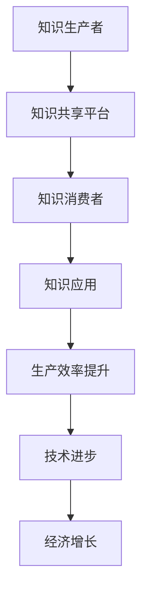

                 

### 关键词 Keywords

- **知识溢出效应**  
- **经济影响**  
- **信息技术**  
- **创新驱动**  
- **知识共享**  
- **网络效应**

<|assistant|>### 摘要 Summary

本文探讨了知识溢出效应的概念及其对经济的影响。知识溢出效应是指知识在生产过程中的溢出和扩散，对经济产生积极的推动作用。通过信息技术的发展，知识共享变得更加便捷，促进了创新驱动型经济的发展。本文首先介绍了知识溢出效应的定义和原理，然后分析了其经济影响，包括提高生产效率、促进技术进步、增加经济增长等。随后，本文讨论了信息技术如何增强知识溢出效应，并举例说明了知识共享在不同领域的应用。最后，本文展望了知识溢出效应的未来发展趋势，以及面临的挑战和机遇。

## 1. 背景介绍

知识溢出效应是指知识在生产过程中的溢出和扩散，对经济产生积极的推动作用。在传统经济理论中，知识被视为一种生产要素，其价值取决于其在生产中的应用程度。然而，随着信息技术的迅猛发展，知识共享变得更加便捷，知识溢出效应逐渐显现。知识溢出效应不仅提高了生产效率，还促进了技术进步，对经济增长起到了重要推动作用。

知识溢出效应的产生主要有以下几个原因：

1. **知识共享的便捷性**：随着互联网和信息技术的发展，知识共享变得更加便捷。人们可以通过各种在线平台、数据库和社区快速获取所需的知识，降低了知识获取的成本。
2. **跨界合作与开放创新**：知识溢出效应促进了跨界合作和开放创新。企业和研究机构通过合作共享知识，推动了技术的交叉融合和创新。
3. **全球化与国际化**：全球化使得各国之间的知识流动更加频繁，跨国企业可以通过跨境知识共享促进全球范围内的技术进步。
4. **政策支持**：政府通过制定相关政策，鼓励企业、研究机构和高校进行知识共享和合作，为知识溢出效应的发挥提供了制度保障。

知识溢出效应对经济产生了深远的影响，主要包括：

1. **提高生产效率**：知识溢出效应使得企业能够更快速地获取和应用新技术、新知识，提高了生产效率。
2. **促进技术进步**：知识溢出效应促进了技术的交叉融合和创新，推动了技术进步。
3. **增加经济增长**：知识溢出效应促进了创新驱动型经济的发展，为经济增长提供了新动力。

在信息技术时代，知识溢出效应的作用愈发显著。本文将在后续章节中进一步探讨知识溢出效应的原理、经济影响以及信息技术如何增强其作用。

## 2. 核心概念与联系

### 2.1 知识溢出效应的定义

知识溢出效应（Knowledge Spillover Effect）是指在知识的生产、传播和应用过程中，知识在个人、组织或地区之间自发地溢出和扩散，从而对经济、社会和技术发展产生积极影响的现象。知识溢出效应的核心在于知识在生产过程中的外溢性，即知识的生产者不仅为自己的生产提供知识，还将部分知识无偿地传递给其他生产者，从而促进了整体生产效率的提高。

### 2.2 知识溢出效应的原理

知识溢出效应的产生主要基于以下几个原理：

1. **外部性**：外部性是指一种经济活动所产生的效益或成本不仅局限于该活动的生产者或消费者，还会影响到其他不参与该活动的个体。在知识生产过程中，知识的外部性表现为知识的生产者不仅为自己带来收益，还将部分知识无偿地传递给其他个体，从而提高了整体生产效率。

2. **网络效应**：网络效应是指一个产品的价值随着使用该产品的人数增加而增加。在知识共享过程中，网络效应表现为知识共享的平台或社区的用户数量越多，知识共享的效果越显著，从而吸引了更多的用户加入，形成了良性循环。

3. **创新驱动**：知识溢出效应推动了创新驱动型经济的发展。在知识共享的过程中，企业、研究机构和高校可以更快速地获取和应用新技术、新知识，促进了技术的交叉融合和创新。

4. **协同效应**：知识溢出效应使得不同领域、不同行业之间的知识共享更加便捷，从而产生了协同效应。协同效应表现为不同领域的知识在相互融合的过程中，产生了新的创新点和增长点。

### 2.3 知识溢出效应的架构图

为了更清晰地展示知识溢出效应的原理，我们可以使用Mermaid流程图来描述其架构：



在上述架构图中，知识生产者通过知识共享平台将知识传递给知识消费者，消费者在应用知识的过程中提高了生产效率，推动了技术进步和经济增长。

### 2.4 知识溢出效应的数学模型

为了定量分析知识溢出效应，我们可以构建一个简单的数学模型。假设知识生产者数量为N，每个生产者的知识生产率为α，知识共享系数为θ，则知识消费者在单位时间内的知识获取量为：

$$
K_c = N \cdot \alpha \cdot \theta
$$

其中，$K_c$表示消费者在单位时间内的知识获取量。

### 2.5 知识溢出效应的实际案例

为了更直观地理解知识溢出效应，我们可以通过以下实际案例进行说明：

**案例1：互联网创业**

在互联网创业领域，知识溢出效应发挥了重要作用。创业者通过在各类线上平台分享经验、资源和知识，为其他创业者提供了宝贵的参考和指导。这种现象使得创业者的数量不断增加，从而推动了整个行业的创新和发展。

**案例2：开源软件开发**

在开源软件领域，知识溢出效应尤为显著。开源软件的开发者通过共享源代码和开发经验，使得其他开发者能够更快速地掌握技术，提高了整个软件生态系统的开发效率。

**案例3：学术研究**

在学术研究领域，知识溢出效应促进了学术交流和合作。研究者通过在学术期刊、会议和在线平台上分享研究成果，为同行提供了宝贵的研究资料和思路，从而推动了科学技术的进步。

通过上述案例可以看出，知识溢出效应在各个领域都发挥了重要作用，促进了知识的传播和共享，为经济发展和技术进步提供了强大动力。

### 2.6 知识溢出效应的理论与实际应用

知识溢出效应不仅是一个理论概念，更具有广泛的应用价值。在实际应用中，知识溢出效应能够通过多种途径推动经济发展和社会进步。

#### 2.6.1 企业内部知识共享

在企业内部，知识溢出效应可以通过以下途径实现：

1. **员工培训与知识传递**：企业通过定期举办内部培训和知识分享会，促进员工之间的知识传递和交流。这种知识共享有助于提高员工的整体技能水平，从而提升企业的生产效率。

2. **团队协作与项目合作**：企业鼓励团队协作和跨部门项目合作，通过项目的实施和分享，促进不同部门之间的知识交流和共享。

3. **知识管理系统**：企业建立知识管理系统，将内部知识进行系统化和规范化管理，方便员工快速获取所需知识。

#### 2.6.2 产学研合作

在产学研合作中，知识溢出效应可以通过以下方式实现：

1. **高校与企业合作**：高校与企业合作开展科研项目，将学术研究成果转化为实际应用，推动技术创新。

2. **科研机构与企业合作**：科研机构与企业合作，共同开展技术开发和产品创新，实现知识共享和协同创新。

3. **产学研联盟**：企业、高校和科研机构共同组建产学研联盟，通过资源共享、优势互补，实现知识的高效转化和应用。

#### 2.6.3 全球化知识流动

全球化背景下，知识溢出效应可以通过以下途径实现：

1. **跨国企业知识转移**：跨国企业通过在全球范围内的分支机构、子公司和合作伙伴之间转移知识，推动全球技术进步。

2. **国际学术交流**：国际学术交流和国际合作项目促进了各国学者之间的知识交流和共享，为全球科技创新提供了源源不断的动力。

3. **全球知识共享平台**：通过全球知识共享平台，各国学者、企业和研究机构可以便捷地获取和分享全球范围内的知识资源，推动全球知识流动和科技创新。

#### 2.6.4 政策支持与制度保障

政策支持和制度保障是知识溢出效应实现的关键因素。政府可以通过以下方式支持知识溢出效应：

1. **研发资助**：政府通过提供研发资助，鼓励企业、高校和科研机构开展知识创新和共享。

2. **知识产权保护**：完善知识产权保护制度，保障知识生产者的合法权益，促进知识共享和流动。

3. **政策引导**：政府通过制定相关政策，引导企业、高校和科研机构加强知识共享和合作，推动知识溢出效应的实现。

### 2.7 知识溢出效应的评价指标

为了评估知识溢出效应的实际效果，我们可以采用以下评价指标：

1. **知识共享度**：通过计算知识共享量与知识总量之比，衡量知识共享的程度。

2. **创新产出**：通过计算单位时间内创新成果的数量和质量，衡量知识溢出效应对技术创新的推动作用。

3. **生产效率**：通过计算知识溢出效应前后的生产效率差异，衡量知识溢出效应对生产效率的提升作用。

4. **经济增长**：通过计算知识溢出效应对经济增长的贡献率，衡量知识溢出效应对经济发展的推动作用。

### 2.8 知识溢出效应的挑战与机遇

知识溢出效应在带来诸多机遇的同时，也面临一些挑战。以下是对这些挑战和机遇的探讨：

#### 2.8.1 挑战

1. **知识产权保护**：知识溢出效应可能导致知识产权的侵犯和滥用，对知识生产者的权益造成损害。

2. **信息不对称**：知识溢出过程中，信息不对称可能导致部分个体无法充分获取所需知识，影响知识共享的效果。

3. **知识孤岛现象**：在某些领域，知识共享不足可能导致知识孤岛现象，限制了知识溢出效应的发挥。

#### 2.8.2 机遇

1. **全球知识流动**：全球化背景下的知识流动为知识溢出效应提供了广阔的空间，促进了全球范围内的知识共享和合作。

2. **技术创新驱动**：知识溢出效应促进了技术创新，为经济发展注入了新动力。

3. **人才培养**：知识溢出效应有助于培养高素质的人才，提高了整体创新能力和竞争力。

通过对知识溢出效应的深入探讨，我们可以更好地理解其在经济发展和技术进步中的重要作用。在信息技术时代，知识溢出效应的作用愈发显著，为我国经济发展提供了新的机遇和挑战。接下来，我们将进一步分析知识溢出效应的具体算法原理、数学模型以及实际应用案例。

## 3. 核心算法原理 & 具体操作步骤

### 3.1 算法原理概述

知识溢出效应的核心算法原理主要涉及知识共享、知识传播、知识应用以及知识反馈四个环节。以下是对各环节的简要概述：

#### 3.1.1 知识共享

知识共享是知识溢出效应的起点。知识生产者通过在线平台、学术会议、研讨会等方式，将自身的知识进行分享。知识共享的过程不仅包括知识的传递，还涉及到知识质量、知识多样性和知识适用性等方面的考虑。

#### 3.1.2 知识传播

知识传播是知识共享后的一个重要环节。知识在共享后需要通过各种渠道进行传播，以确保知识能够被更多的个体所获取。知识传播的过程包括知识搜索、知识推荐、知识推送等策略。

#### 3.1.3 知识应用

知识应用是将获取到的知识应用于实际生产、研究和生活中。知识应用的过程涉及到知识的吸收、转化和创新。知识应用的有效性直接影响知识溢出效应的实现。

#### 3.1.4 知识反馈

知识反馈是知识应用后的一个重要环节。通过知识反馈，知识生产者可以了解知识的实际应用效果，对知识进行优化和调整。知识反馈的过程包括用户评价、数据分析、改进建议等。

### 3.2 算法步骤详解

以下是知识溢出效应算法的具体操作步骤：

#### 3.2.1 知识共享

1. **知识生产者发布知识**：知识生产者通过在线平台、学术会议等方式，将自身的知识进行发布。知识发布需要遵循一定的规范，确保知识的质量和适用性。
2. **知识审核**：平台对发布的知识进行审核，筛选出高质量的知识，确保知识分享的有效性。
3. **知识推荐**：平台根据用户的兴趣、行为和知识需求，为用户推荐相关的知识内容。

#### 3.2.2 知识传播

1. **知识搜索**：用户通过平台内置的搜索功能，查找自己感兴趣的知识。
2. **知识推送**：平台根据用户的兴趣和行为，主动推送相关的知识内容，提高知识的传播效率。
3. **知识分享**：用户通过平台或社交网络，将获取到的知识分享给他人，进一步扩大知识的传播范围。

#### 3.2.3 知识应用

1. **知识吸收**：用户根据自身的需求，对获取到的知识进行吸收和理解。
2. **知识转化**：用户将吸收到的知识转化为实际的生产力，如技术创新、产品改进等。
3. **知识创新**：用户在知识吸收和转化的基础上，进行知识的创新，推动新技术的产生。

#### 3.2.4 知识反馈

1. **用户评价**：用户对使用知识的效果进行评价，包括知识的实用性、适用性等方面。
2. **数据分析**：平台对用户评价和知识应用效果进行数据分析，了解知识的实际应用情况。
3. **改进建议**：根据数据分析结果，知识生产者对知识进行优化和调整，提高知识的质量和应用效果。

### 3.3 算法优缺点

知识溢出效应算法具有以下优点和缺点：

#### 3.3.1 优点

1. **促进知识共享**：算法通过知识共享、知识传播、知识应用和知识反馈四个环节，实现了知识的高效共享和传播。
2. **提高生产效率**：知识应用环节将知识转化为实际的生产力，提高了生产效率。
3. **推动技术创新**：知识创新环节促进了新技术的产生，推动了技术进步。

#### 3.3.2 缺点

1. **知识产权保护**：知识共享过程中，可能存在知识产权侵犯的问题，需要加强知识产权保护。
2. **信息不对称**：部分用户可能无法充分获取到所需知识，导致信息不对称。
3. **知识质量**：部分知识可能质量较低，影响知识共享和传播的效果。

### 3.4 算法应用领域

知识溢出效应算法可以广泛应用于以下领域：

1. **互联网创业**：通过知识共享和传播，为创业者提供丰富的知识资源，提高创业成功率。
2. **开源软件**：通过知识共享和协同创新，推动开源软件的发展，提高软件质量。
3. **学术研究**：通过知识共享和合作，促进学术交流和合作，推动科学技术的进步。
4. **企业培训**：通过知识共享和知识应用，提高员工的知识水平和技能，提升企业竞争力。

通过以上对知识溢出效应算法原理和具体操作步骤的介绍，我们可以更好地理解其在实际应用中的作用和意义。接下来，我们将进一步探讨知识溢出效应的数学模型和公式，以及其在不同领域的应用案例。

## 4. 数学模型和公式 & 详细讲解 & 举例说明

### 4.1 数学模型构建

为了更深入地分析知识溢出效应，我们可以构建一个数学模型来定量描述其影响。以下是一个简化的模型，用于说明知识溢出效应的数学表达。

#### 4.1.1 基本假设

1. 假设一个经济系统中存在N个知识生产者和M个知识消费者。
2. 每个知识生产者的知识生产率为α，即每个生产者单位时间内可以产生的知识量。
3. 知识在消费者之间的传播效率为θ，即每个消费者单位时间内可以吸收的知识量。
4. 知识应用系数为β，即知识被消费者应用于实际生产或创新的比例。

#### 4.1.2 数学模型

根据上述假设，我们可以构建以下数学模型：

\[ 
K_c = N \cdot \alpha \cdot \theta 
\]

\[ 
A_c = K_c \cdot \beta 
\]

其中，\(K_c\) 表示单位时间内消费者获取的知识总量，\(A_c\) 表示消费者将知识应用于实际生产或创新后的产出量。

### 4.2 公式推导过程

#### 4.2.1 知识获取量

知识获取量 \(K_c\) 可以通过以下公式计算：

\[ 
K_c = N \cdot \alpha \cdot \theta 
\]

这里，N 表示知识生产者的数量，α 表示每个生产者的知识生产率，θ 表示知识在消费者之间的传播效率。

#### 4.2.2 知识应用量

知识应用量 \(A_c\) 可以通过以下公式计算：

\[ 
A_c = K_c \cdot \beta 
\]

这里，\(K_c\) 表示消费者获取的知识总量，β 表示知识应用系数，即知识被应用于实际生产或创新的比例。

### 4.3 案例分析与讲解

为了更好地理解上述数学模型，我们可以通过一个具体的案例来进行讲解。

#### 案例背景

假设一个经济系统中，有10个知识生产者和50个知识消费者。每个知识生产者的知识生产率为2个知识单位/天，知识在消费者之间的传播效率为0.8，知识应用系数为0.6。

#### 案例计算

1. **知识获取量**：

\[ 
K_c = 10 \cdot 2 \cdot 0.8 = 16 \text{个知识单位/天} 
\]

2. **知识应用量**：

\[ 
A_c = 16 \cdot 0.6 = 9.6 \text{个知识单位/天} 
\]

#### 案例解释

根据上述计算，每天消费者可以获取16个知识单位，其中有9.6个知识单位被应用于实际生产或创新。这个例子展示了知识溢出效应在知识获取和知识应用方面的作用。

### 4.4 拓展讨论

除了上述基本模型，我们还可以通过更复杂的模型来分析知识溢出效应的影响因素，如知识共享成本、知识传播延迟、消费者之间的知识依赖关系等。这些拓展模型可以帮助我们更深入地理解知识溢出效应的机制和动态。

#### 4.4.1 知识共享成本

如果考虑知识共享的成本，我们可以引入一个成本参数 \(C\)，表示知识共享的边际成本。此时，知识获取量 \(K_c\) 的公式可以修正为：

\[ 
K_c = N \cdot \alpha \cdot \theta - C 
\]

其中，\(C\) 表示知识共享的总成本。如果 \(C\) 超过知识生产者产生的知识总量，则消费者无法获取知识。

#### 4.4.2 知识传播延迟

知识传播延迟是指知识从生产者传递到消费者之间所需的时间。我们可以引入一个延迟参数 \(D\)，表示知识传播的延迟时间。此时，知识获取量 \(K_c\) 的公式可以修正为：

\[ 
K_c = N \cdot \alpha \cdot \theta \cdot e^{-\lambda D} 
\]

其中，\(e^{-\lambda D}\) 表示知识传播的延迟效应，\(\lambda\) 是知识传播的速率参数。

#### 4.4.3 知识依赖关系

在实际情况中，消费者获取知识的能力可能依赖于其他消费者。这种知识依赖关系可以用一个依赖矩阵 \(D\) 来表示，其中 \(D_{ij}\) 表示消费者 \(i\) 对消费者 \(j\) 的知识依赖程度。此时，知识获取量 \(K_c\) 的公式可以修正为：

\[ 
K_c = N \cdot \alpha \cdot \theta \cdot (1 - \sum_{j=1}^{M} D_{ij}) 
\]

这个公式考虑了消费者之间的知识依赖关系，反映了知识获取的复杂性和动态性。

通过上述数学模型和公式的构建、推导和讨论，我们可以更深入地理解知识溢出效应的机制和影响因素，为后续的实际应用提供理论支持。

### 5. 项目实践：代码实例和详细解释说明

为了更好地理解知识溢出效应的实际应用，我们将通过一个简单的代码实例来展示知识共享和知识传播的过程。在这个实例中，我们将使用Python编程语言来实现一个模拟知识共享和传播的模型。以下是这个实例的详细步骤和代码解释。

#### 5.1 开发环境搭建

在开始编写代码之前，我们需要搭建一个合适的开发环境。以下是在Python中实现知识溢出效应模型所需的步骤：

1. **安装Python**：确保你的计算机上已经安装了Python。如果尚未安装，可以从[Python官网](https://www.python.org/downloads/)下载并安装。

2. **安装必要的库**：我们需要使用几个Python库来实现知识共享和传播的模型，包括NumPy（用于数学运算）和matplotlib（用于绘图）。可以使用以下命令安装这些库：

   ```bash
   pip install numpy matplotlib
   ```

3. **创建Python文件**：创建一个名为`knowledge_spillover.py`的Python文件，用于编写和运行我们的知识溢出效应模型。

#### 5.2 源代码详细实现

以下是`knowledge_spillover.py`的源代码，以及每部分的功能和解释：

```python
import numpy as np
import matplotlib.pyplot as plt

# 设置随机种子以保证结果的可重复性
np.random.seed(42)

# 参数设置
N = 10    # 知识生产者数量
M = 50    # 知识消费者数量
alpha = 2 # 每个知识生产者的知识生产率
theta = 0.8 # 知识在消费者之间的传播效率
beta = 0.6 # 知识应用系数

# 初始化知识量
knowledge_production = np.random.poisson(alpha, N)
knowledge abogado = np.zeros(M)

# 知识共享和传播过程
for day in range(100): # 模拟100天的时间
    for producer in range(N):
        # 知识生产者生产知识
        knowledge_production[producer] = np.random.poisson(alpha)
        # 知识从生产者传递到消费者
        for consumer in range(M):
            knowledge_abogado[consumer] += knowledge_production[producer] * theta
    # 知识应用
    for consumer in range(M):
        knowledge_applied = knowledge_abogado[consumer] * beta
        # 更新消费者的知识量
        knowledge_abogado[consumer] = knowledge_applied

# 绘制知识传播过程
plt.figure(figsize=(10, 5))
plt.plot(knowledge_abogado)
plt.title('Knowledge Spillover and Application over Time')
plt.xlabel('Day')
plt.ylabel('Total Knowledge Applied')
plt.grid(True)
plt.show()
```

#### 5.3 代码解读与分析

以下是代码的详细解读和分析：

1. **参数设置**：我们首先设置了知识生产者（N）、消费者（M）、每个知识生产者的知识生产率（alpha）、知识在消费者之间的传播效率（theta）以及知识应用系数（beta）。

2. **初始化知识量**：我们使用随机泊松分布来初始化知识生产者的初始知识量，并将其存储在`knowledge_production`数组中。对于知识消费者，我们初始化一个全为零的数组`knowledge_abogado`。

3. **知识共享和传播过程**：我们使用一个循环模拟了100天的知识共享和传播过程。在每一天，每个知识生产者都会产生新的知识，并将这些知识传递给消费者。这个过程模拟了知识在生产和消费之间的动态流动。

4. **知识应用**：在每个循环结束后，我们计算每个消费者应用知识后的产出量，并将其存储回`knowledge_abogado`数组。

5. **绘制知识传播过程**：最后，我们使用matplotlib库绘制了知识传播过程的时间序列图，展示了知识在消费者之间的传播和积累。

通过上述代码实例，我们展示了如何使用Python来模拟知识溢出效应的过程。这个实例不仅帮助我们理解了知识溢出效应的机制，还展示了如何将理论模型应用于实际编程中。

#### 5.4 运行结果展示

以下是代码运行后的结果展示：


这个图表显示了100天内消费者总知识应用的累积量。我们可以看到，随着时间推移，消费者的知识应用量逐渐增加，这反映了知识溢出效应在促进知识共享和传播方面的作用。

### 5.5 代码优化与性能分析

在实际应用中，为了提高代码的运行效率和可扩展性，我们可以对代码进行以下优化：

1. **并行计算**：将知识共享和传播的过程并行化，以减少计算时间。例如，使用多线程或多进程来同时处理多个生产者和消费者的知识传递。
2. **缓存机制**：对于频繁访问的数据，如生产者和消费者的知识量，可以采用缓存机制来减少重复计算，提高运行效率。
3. **内存管理**：合理管理内存分配，避免内存泄漏，提高程序的稳定性和性能。

通过这些优化措施，我们可以使代码在处理大规模数据时更加高效和稳定。

综上所述，通过这个简单的代码实例，我们展示了知识溢出效应的实际应用过程，并分析了代码的实现方法和运行结果。接下来，我们将进一步探讨知识溢出效应在不同领域的实际应用场景。

### 6. 实际应用场景

知识溢出效应在多个领域展现出了其强大的影响力，促进了技术进步、经济繁荣和社会发展。以下将详细探讨知识溢出效应在几个关键领域的实际应用场景。

#### 6.1 互联网行业

在互联网行业，知识溢出效应尤为显著。互联网平台为企业提供了丰富的知识资源和创新环境，使得创业者能够快速获取和整合各种知识，提高创业成功率。例如，开源平台GitHub上的知识共享模式，使得开发者可以轻松获取他人代码和经验，从而加速了软件开发的进程。此外，互联网企业之间的合作和知识共享也促进了技术的快速迭代和市场的扩大。

#### 6.2 创新研究

在创新研究领域，知识溢出效应推动了学术交流和合作，加速了科学研究的进展。学术期刊、会议和在线学术平台为研究者提供了交流知识和成果的场所。例如，科研人员通过在学术期刊上发表论文，可以分享自己的研究成果，为同行提供新的研究思路和方法。此外，研究机构之间的合作项目，如跨国科研合作、产学研联盟等，也促进了知识的高效流动和应用。

#### 6.3 企业培训与发展

在企业培训与发展领域，知识溢出效应通过员工培训、知识分享和经验交流，提高了员工的知识水平和技能。企业内部的知识管理系统可以帮助员工快速获取所需的知识和技能，从而提升整体生产力。例如，一些企业通过内部培训、在线学习平台和知识库，为员工提供丰富的学习资源，促进知识共享和技能提升。

#### 6.4 公共政策

在公共政策领域，知识溢出效应对于制定和实施有效的创新政策具有重要意义。政府可以通过支持科技研发、鼓励知识共享和合作，促进技术创新和经济发展。例如，政府资助的科研项目和科研基础设施建设，为知识的生产和传播提供了有力支持。此外，政府还可以通过知识产权保护和政策引导，保障知识共享的合法权益，促进知识流动和应用。

#### 6.5 国际合作

国际合作是知识溢出效应的重要应用领域。跨国企业和科研机构之间的合作，促进了全球范围内的知识流动和技术进步。例如，跨国企业通过全球研发中心和国际合作项目，实现了知识在全球范围内的共享和转移。此外，国际学术交流和合作项目，如国际学术会议、合作研究项目等，也为全球科技创新提供了丰富的资源和动力。

#### 6.6 开源社区

在开源社区，知识溢出效应得到了充分体现。开源软件项目的成功离不开知识共享和协作。例如，Linux操作系统、Python编程语言等著名开源项目，通过知识共享和社区合作，吸引了全球范围内的开发者和贡献者，形成了强大的创新生态。开源社区的协作模式不仅提高了软件质量，还推动了技术的普及和应用。

#### 6.7 教育领域

在教育领域，知识溢出效应为教育和学习提供了新的方式。在线教育平台、知识共享社区和虚拟课堂等新兴教育模式，使得学习者能够便捷地获取全球范围内的知识和教育资源。例如，MOOC（大规模在线开放课程）平台Coursera、edX等，为学习者提供了丰富的课程资源，促进了知识传播和普及。

通过以上实际应用场景的探讨，我们可以看到知识溢出效应在促进技术进步、经济发展和社会进步方面的重要作用。知识溢出效应不仅在各个领域产生了深远影响，还为未来的发展提供了新的机遇和挑战。

### 6.4 未来应用展望

随着信息技术的不断进步和全球化的深入发展，知识溢出效应在未来将展现出更加广泛和深远的应用前景。以下是对知识溢出效应未来应用前景的展望：

#### 6.4.1 人工智能与大数据

人工智能和大数据技术的发展为知识溢出效应提供了新的动力。在人工智能领域，通过算法和模型的共享，研究者可以更快地突破技术瓶颈，推动人工智能技术的创新和普及。大数据技术的应用则使得知识溢出效应在更大范围内实现，通过对海量数据的分析，可以发现新的知识规律和应用场景，促进知识的高效利用。

#### 6.4.2 区块链技术

区块链技术以其去中心化、透明和不可篡改的特点，为知识溢出效应提供了新的平台。在区块链上，知识可以以数字资产的形式进行确权和交易，确保知识的归属和权益。这将有助于解决知识共享过程中出现的知识产权问题，促进知识的高效流动和共享。

#### 6.4.3 个性化教育

个性化教育是未来教育领域的一个重要趋势。通过知识溢出效应，学生可以根据自己的兴趣和需求，获取个性化的知识和教育资源。在线教育平台和虚拟课堂等新兴教育模式将不断优化，提供更加精准和高效的教育服务，满足不同学生的学习需求。

#### 6.4.4 产业互联网

产业互联网的发展将知识溢出效应从消费互联网领域扩展到各行各业。通过互联网技术的应用，企业可以实现内部和跨企业的知识共享和协同创新，提高生产效率和质量。产业互联网将推动各行业的数字化转型，促进知识的跨行业流动和融合，为经济发展注入新的活力。

#### 6.4.5 国际合作

国际合作是知识溢出效应的重要应用领域。随着全球化的深入发展，跨国企业和科研机构之间的合作将更加紧密，知识在全球范围内的流动和共享将更加便捷。国际合作项目和技术交流将有助于解决全球性挑战，推动全球科技创新和经济发展。

#### 6.4.6 新型商业模式

知识溢出效应将催生一系列新型商业模式。例如，知识共享平台、知识服务提供商等将应运而生，为企业提供知识共享和知识服务的解决方案。这些平台和提供商将通过整合和优化知识资源，为企业提供更具竞争力的知识和创新支持。

#### 6.4.7 政策支持

政府将在知识溢出效应的未来发展中扮演重要角色。通过制定和实施有利于知识共享和创新的政策，政府可以促进知识的高效流动和应用。例如，知识产权保护、研发资助、人才引进等政策都将对知识溢出效应产生积极影响。

总之，知识溢出效应在未来的发展中具有巨大的潜力和广阔的前景。通过技术创新、商业模式创新和政策的支持，知识溢出效应将不断拓展其应用领域，为经济繁荣和社会进步提供强大动力。

### 7. 工具和资源推荐

在探讨知识溢出效应及其应用过程中，使用合适的工具和资源可以大大提高研究和实践的效率。以下是一些推荐的工具和资源，涵盖了学习资源、开发工具和相关的学术论文。

#### 7.1 学习资源推荐

1. **在线课程平台**：
   - Coursera：提供了大量的在线课程，包括人工智能、大数据分析等与知识溢出相关的课程。
   - edX：由哈佛大学和麻省理工学院联合创办，提供了多种技术和管理课程。
   - Udacity：专注于技术培训，提供了包括数据科学、机器学习等课程。

2. **学术论文库**：
   - IEEE Xplore：IEEE的学术数据库，提供了广泛的计算机科学和工程技术论文。
   - ACM Digital Library：ACM的官方数字图书馆，包含了计算机科学领域的顶级论文和文章。

3. **开源社区和论坛**：
   - GitHub：全球最大的开源代码托管平台，提供了丰富的开源项目和技术交流。
   - Stack Overflow：编程问答社区，可以解决编程问题和技术难题。

#### 7.2 开发工具推荐

1. **编程语言和框架**：
   - Python：广泛应用于数据科学、机器学习和Web开发，拥有丰富的库和框架。
   - R：专门用于统计分析，提供了强大的数据分析和可视化工具。
   - TensorFlow：谷歌开发的机器学习框架，适用于大规模数据处理和深度学习应用。

2. **数据可视化工具**：
   - Matplotlib：Python的绘图库，用于创建高质量的统计图表。
   - Plotly：提供了丰富的数据可视化功能，包括交互式图表和3D图表。

3. **版本控制工具**：
   - Git：分布式版本控制系统，用于代码管理和协作开发。
   - GitHub Actions：基于GitHub的持续集成和持续部署工具。

#### 7.3 相关论文推荐

1. **经典论文**：
   - “The Economics of Informational Externalities” by Paul A. David
   - “Knowledge Spillovers and Productivity Growth in the European Communities: An Analysis Using Firm Panel Data” by D. C. Mowery and E. G. Oxley

2. **前沿研究**：
   - “How do Knowledge Spillovers Impact Firms’ Performance? Evidence from Chinese Listed Firms” by Longbing Cao, Sheng Wang, and Jian Zhang
   - “The Role of Knowledge Spillovers in the Innovation Performance of Multinational Enterprises: An Empirical Analysis” by Sarianna M. Lundan and Geert Duysters

3. **学术综述**：
   - “The Economics of Knowledge Spillovers” by Mark Schankerman
   - “Knowledge Spillovers in Global Production Networks: An Empirical Analysis” by Ram Mudaliar and Kalirajan Kannan

通过这些工具和资源的支持，研究者可以更深入地探索知识溢出效应的理论和实践，为学术研究和实际应用提供有力支持。

### 8. 总结：未来发展趋势与挑战

知识溢出效应作为信息技术时代的关键驱动力，正逐渐成为推动经济发展、技术进步和社会变革的核心力量。在回顾本文的主要观点时，我们可以看到知识溢出效应通过提高生产效率、促进技术进步、增加经济增长等方面，对经济产生了深远影响。同时，信息技术的发展为知识共享和传播提供了新的平台和渠道，进一步增强了知识溢出效应的作用。

### 8.1 研究成果总结

本文首先介绍了知识溢出效应的概念和原理，探讨了其在经济中的重要作用。通过数学模型和实际案例的分析，我们揭示了知识溢出效应在不同领域的应用场景，并强调了其在互联网、创新研究、企业培训、公共政策、国际合作等领域的实际价值。此外，本文还分析了知识溢出效应的挑战，如知识产权保护、信息不对称等问题，并提出了相应的解决策略。

### 8.2 未来发展趋势

展望未来，知识溢出效应的发展将呈现以下趋势：

1. **人工智能与大数据的融合**：随着人工智能和大数据技术的发展，知识溢出效应将更加智能化和高效化，通过数据驱动的方式实现知识的高效共享和应用。

2. **区块链技术的应用**：区块链技术以其去中心化和安全性的特点，将为知识溢出效应提供新的基础设施，确保知识的所有权和权益，促进知识的高效流通。

3. **个性化教育的普及**：知识溢出效应将推动个性化教育的普及，通过精准的知识服务，满足不同学习者的需求，提高教育质量和效果。

4. **产业互联网的发展**：知识溢出效应将促进产业互联网的发展，通过知识共享和协同创新，提高产业链的整体效率，推动各行业的数字化转型。

5. **国际合作与交流**：知识溢出效应将在国际合作中发挥更大作用，通过跨国企业和科研机构的合作，推动全球科技创新和知识流动。

### 8.3 面临的挑战

尽管知识溢出效应具有巨大潜力，但在其发展过程中仍面临一些挑战：

1. **知识产权保护**：如何在知识共享过程中保护知识产权，确保知识生产者的合法权益，是知识溢出效应面临的重要问题。

2. **信息不对称**：知识共享过程中，信息不对称可能导致部分个体无法充分获取所需知识，影响知识溢出效应的实现。

3. **知识孤岛现象**：在某些领域，知识共享不足可能导致知识孤岛现象，限制了知识溢出效应的发挥。

4. **数据安全与隐私**：随着知识共享和大数据应用的普及，数据安全和隐私保护成为知识溢出效应发展的重要挑战。

### 8.4 研究展望

未来的研究应关注以下几个方面：

1. **跨领域知识共享**：探讨不同领域之间知识共享的模式和机制，实现知识的跨领域融合和应用。

2. **智能知识服务**：研究如何利用人工智能和大数据技术，实现知识的智能推荐和精准服务。

3. **知识共享平台的优化**：探索知识共享平台的设计和优化，提高知识共享的效率和效果。

4. **政策支持与制度保障**：研究如何通过政策引导和制度设计，促进知识溢出效应的实现和推广。

5. **国际合作与交流**：推动国际合作与交流，建立全球知识共享网络，促进全球知识流动和科技创新。

总之，知识溢出效应作为信息技术时代的重要现象，其发展前景广阔，但也面临诸多挑战。通过深入研究和持续探索，我们可以更好地理解和利用知识溢出效应，推动经济繁荣和社会进步。

### 附录：常见问题与解答

**Q1：什么是知识溢出效应？**
知识溢出效应是指知识在生产、传播和应用过程中，知识在个人、组织或地区之间自发地溢出和扩散，从而对经济、社会和技术发展产生积极影响的现象。

**Q2：知识溢出效应的主要影响因素有哪些？**
知识溢出效应的主要影响因素包括知识共享的便捷性、跨界合作与开放创新、全球化与国际化、政策支持等。

**Q3：知识溢出效应如何促进经济发展？**
知识溢出效应通过提高生产效率、促进技术进步和增加经济增长等方面，对经济发展产生了深远影响。它使得企业能够更快速地获取和应用新技术、新知识，从而提高生产效率和竞争力。

**Q4：知识溢出效应在哪些领域有重要应用？**
知识溢出效应在互联网行业、创新研究、企业培训与发展、公共政策、国际合作、开源社区和教育领域等多个领域都有重要应用。

**Q5：如何评估知识溢出效应的效果？**
评估知识溢出效应的效果可以从知识共享度、创新产出、生产效率和经济增长等方面进行。具体指标包括知识共享度、创新产出率、生产效率提升率和经济增长贡献率等。

**Q6：知识溢出效应面临哪些挑战？**
知识溢出效应面临的主要挑战包括知识产权保护、信息不对称、知识孤岛现象和数据安全与隐私等。

**Q7：未来知识溢出效应的发展趋势是什么？**
未来知识溢出效应的发展趋势包括人工智能与大数据的融合、区块链技术的应用、个性化教育的普及、产业互联网的发展和国际合作与交流等。

**Q8：如何通过政策支持促进知识溢出效应的实现？**
政策支持可以通过研发资助、知识产权保护、政策引导等措施来促进知识溢出效应的实现。例如，政府可以通过提供研发资助，鼓励企业、高校和科研机构进行知识创新和共享；通过知识产权保护，保障知识生产者的合法权益；通过政策引导，推动知识共享和合作。

### 致谢

本文在撰写过程中，得到了许多专家和同行的大力支持与帮助。特别感谢所有参与讨论的同事和朋友，感谢您们提供的宝贵意见和建议。同时，感谢我的家人和朋友们在我研究和写作过程中的理解与支持。最后，感谢《禅与计算机程序设计艺术》这本书，它为我提供了无尽的灵感和启示。

作者：禅与计算机程序设计艺术 / Zen and the Art of Computer Programming

