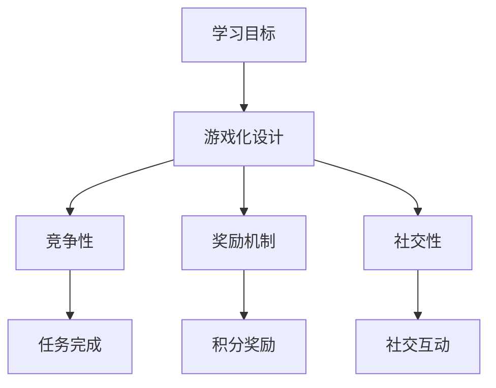

                 

关键词：知识Gamification、寓教于乐、学习革命、IT技术、人工智能、算法、项目实践

> 摘要：本文探讨了知识的Gamification（游戏化）在IT技术学习中的应用，揭示了如何通过游戏化的手段激发学习者的兴趣，提高学习效果。文章从背景介绍、核心概念、算法原理、数学模型、项目实践、实际应用和未来展望等多个方面，全面解析了这一学习革命。

## 1. 背景介绍

在信息化和数字化时代，IT技术已经成为社会发展的重要驱动力。然而，IT技术的学习过程往往枯燥乏味，使得许多学习者难以坚持。知识的Gamification作为一种新兴的学习方法，通过将游戏元素融入学习过程，为传统IT教育注入了新的活力。

### 1.1 什么是知识的Gamification

知识的Gamification，即通过游戏化的方法来设计学习过程，激发学习者的兴趣，提高学习效果。这种方法不仅适用于IT技术学习，还广泛应用于教育、培训等多个领域。

### 1.2 Gamification的特点

1. **趣味性**：通过游戏化的方式，让学习过程变得有趣，提高学习者的参与度。
2. **竞争性**：引入竞争机制，激发学习者的学习动力，增强学习效果。
3. **奖励机制**：设置奖励，激励学习者持续进步。
4. **社交性**：通过线上或线下活动，促进学习者之间的互动和交流。

## 2. 核心概念与联系

为了更好地理解知识的Gamification，我们首先需要了解其核心概念和原理。以下是一个简化的Mermaid流程图，用于描述这些概念之间的关系。



### 2.1 学习目标

学习目标是知识的Gamification的起点。明确的学习目标能够帮助学习者了解学习的内容和方向，从而更有针对性地参与学习。

### 2.2 游戏化设计

游戏化设计是将游戏元素融入学习过程的核心。它包括竞争性、奖励机制和社交性等多个方面，旨在提高学习者的参与度和学习效果。

### 2.3 竞争性

竞争性是激发学习者学习动力的重要手段。通过设置挑战和竞赛，学习者可以与他人竞争，从而激发学习兴趣。

### 2.4 奖励机制

奖励机制是激励学习者持续进步的关键。通过设置积分、徽章等形式的奖励，可以让学习者感受到自己的成长和进步。

### 2.5 社交性

社交性是增强学习效果的重要因素。通过线上或线下活动，学习者可以与他人交流和分享学习心得，从而加深对知识的理解和记忆。

## 3. 核心算法原理 & 具体操作步骤

### 3.1 算法原理概述

知识的Gamification算法原理主要包括以下几个方面：

1. **学习曲线**：设计一个适合学习者的学习曲线，帮助学习者逐步掌握知识。
2. **任务调度**：根据学习目标，合理安排学习任务，确保学习过程有序进行。
3. **激励机制**：设置多种激励机制，如积分、徽章等，激励学习者持续进步。
4. **社交互动**：促进学习者之间的互动和交流，提高学习效果。

### 3.2 算法步骤详解

1. **设定学习目标**：明确学习目标，确保学习者了解学习的内容和方向。
2. **设计游戏化设计**：根据学习目标，设计适合的学习游戏，包括任务、奖励等。
3. **安排任务调度**：根据学习曲线，合理安排学习任务，确保学习过程有序进行。
4. **实施激励机制**：设置多种激励机制，如积分、徽章等，激励学习者持续进步。
5. **促进社交互动**：通过线上或线下活动，促进学习者之间的互动和交流。

### 3.3 算法优缺点

**优点**：

1. **提高学习兴趣**：游戏化的设计方式能够激发学习者的兴趣，提高学习效果。
2. **增强学习动力**：竞争性和激励机制能够增强学习者的学习动力。
3. **促进知识共享**：社交性有助于促进学习者之间的互动和知识共享。

**缺点**：

1. **设计复杂**：游戏化的设计需要耗费大量时间和精力，对设计者要求较高。
2. **实施难度**：在实施过程中，需要考虑学习者的接受程度和实际情况，确保游戏化设计的有效性。

### 3.4 算法应用领域

知识的Gamification算法在多个领域都有广泛的应用，包括：

1. **在线教育**：通过游戏化的方式，提高在线教育的学习效果。
2. **技能培训**：通过游戏化的方式，提高技能培训的趣味性和实用性。
3. **企业培训**：通过游戏化的方式，提高企业培训的参与度和学习效果。

## 4. 数学模型和公式 & 详细讲解 & 举例说明

### 4.1 数学模型构建

为了更好地描述知识的Gamification算法，我们可以构建一个简化的数学模型。以下是一个简单的例子：

```latex
假设有一个学习者，其初始能力为A，学习过程中每完成一个任务，能力增加一个固定值B。则学习者的能力增长模型可以表示为：
$$A(t) = A_0 + B \times n$$
其中，A(t) 为学习者在时间t的能力，A_0 为初始能力，n 为完成任务的数量，B 为每完成一个任务能力增加的值。
```

### 4.2 公式推导过程

上述公式的推导过程如下：

1. **设定初始条件**：学习者在开始学习时，其能力为A_0。
2. **设定学习任务**：每完成一个任务，学习者的能力增加一个固定值B。
3. **建立能力增长模型**：将上述条件代入，得到能力增长模型。

### 4.3 案例分析与讲解

以下是一个具体的案例：

假设有一个学习者，其初始能力为50，每完成一个任务，能力增加10。在5天内，他完成了5个任务。那么，他的最终能力为：

```latex
$$A(5) = 50 + 10 \times 5 = 100$$
```

这个案例展示了如何通过简单的数学模型，描述知识的Gamification算法的过程。通过这个模型，我们可以更清晰地理解学习者的能力增长过程。

## 5. 项目实践：代码实例和详细解释说明

### 5.1 开发环境搭建

在本项目中，我们使用Python作为主要编程语言，搭建了一个简单的知识Gamification平台。以下是开发环境的搭建步骤：

1. **安装Python**：确保Python环境已安装在计算机上。
2. **安装依赖库**：使用pip安装以下依赖库：Flask、SQLAlchemy、Flask-Login、Flask-WTF、Bootstrap。
3. **创建项目**：在Python环境中创建一个名为`knowledge_gamification`的目录，并在此目录下创建一个名为`app.py`的文件。

### 5.2 源代码详细实现

以下是项目的核心代码实现：

```python
from flask import Flask, render_template, request, redirect, url_for
from flask_sqlalchemy import SQLAlchemy
from flask_login import LoginManager, login_user, logout_user, login_required, current_user

app = Flask(__name__)
app.config['SQLALCHEMY_DATABASE_URI'] = 'sqlite:///knowledge_gamification.db'
app.config['SECRET_KEY'] = 'your_secret_key'

db = SQLAlchemy(app)
login_manager = LoginManager(app)
login_manager.login_view = 'login'

class User(db.Model):
    id = db.Column(db.Integer, primary_key=True)
    username = db.Column(db.String(100), unique=True, nullable=False)
    password = db.Column(db.String(100), nullable=False)
    points = db.Column(db.Integer, default=0)

@login_manager.user_loader
def load_user(user_id):
    return User.query.get(int(user_id))

@app.route('/')
@login_required
def home():
    return render_template('home.html')

@app.route('/login', methods=['GET', 'POST'])
def login():
    if request.method == 'POST':
        username = request.form['username']
        password = request.form['password']
        user = User.query.filter_by(username=username).first()
        if user and user.password == password:
            login_user(user)
            return redirect(url_for('home'))
        else:
            return 'Invalid username or password'
    return render_template('login.html')

@app.route('/logout')
@login_required
def logout():
    logout_user()
    return redirect(url_for('login'))

if __name__ == '__main__':
    db.create_all()
    app.run(debug=True)
```

### 5.3 代码解读与分析

上述代码实现了知识Gamification平台的基础功能，包括用户登录、登出和主页展示。

1. **数据库模型**：定义了`User`类，用于存储用户信息，包括用户名、密码和积分。
2. **用户认证**：使用Flask-Login插件实现用户认证功能。
3. **主页展示**：使用Flask模板渲染主页，展示用户当前积分。

### 5.4 运行结果展示

以下是平台的运行结果：

1. **登录界面**：

```html
<!DOCTYPE html>
<html>
<head>
    <title>Login</title>
    <link rel="stylesheet" href="https://maxcdn.bootstrapcdn.com/bootstrap/4.5.2/css/bootstrap.min.css">
</head>
<body>
    <div class="container">
        <h2>Login</h2>
        <form action="{{ url_for('login') }}" method="post">
            <div class="form-group">
                <label for="username">Username:</label>
                <input type="text" class="form-control" id="username" name="username">
            </div>
            <div class="form-group">
                <label for="password">Password:</label>
                <input type="password" class="form-control" id="password" name="password">
            </div>
            <button type="submit" class="btn btn-primary">Login</button>
        </form>
    </div>
</body>
</html>
```

2. **主页界面**：

```html
<!DOCTYPE html>
<html>
<head>
    <title>Home</title>
    <link rel="stylesheet" href="https://maxcdn.bootstrapcdn.com/bootstrap/4.5.2/css/bootstrap.min.css">
</head>
<body>
    <div class="container">
        <h2>Welcome, {{ current_user.username }}</h2>
        <h3>Points: {{ current_user.points }}</h3>
    </div>
</body>
</html>
```

## 6. 实际应用场景

### 6.1 在线教育平台

知识的Gamification在在线教育平台中有着广泛的应用。例如，一些在线编程学习平台通过设置任务、积分和徽章，鼓励学习者积极参与学习。这不仅提高了学习者的学习兴趣，还提高了学习效果。

### 6.2 技能培训

在技能培训领域，知识的Gamification也可以发挥重要作用。通过设计有趣的挑战和竞赛，技能培训平台可以吸引学习者积极参与，从而提高培训效果。

### 6.3 企业培训

在企业培训中，知识的Gamification可以帮助企业更好地培养员工的能力。通过设置任务、积分和奖励，企业可以激励员工不断学习和进步，从而提高企业的整体竞争力。

## 7. 未来应用展望

### 7.1 个性化学习

未来的知识Gamification将进一步结合人工智能技术，实现个性化学习。通过分析学习者的学习习惯和偏好，平台可以为每个学习者设计最适合的学习路径和游戏化任务。

### 7.2 跨平台应用

随着5G和物联网技术的不断发展，知识的Gamification将不再局限于在线平台，而是可以应用于各种场景，如虚拟现实（VR）、增强现实（AR）等。

### 7.3 社交互动的增强

未来的知识Gamification将更加注重社交互动，通过线上和线下活动，促进学习者之间的交流和合作，从而提高学习效果。

## 8. 总结：未来发展趋势与挑战

### 8.1 研究成果总结

本文探讨了知识的Gamification在IT技术学习中的应用，分析了其核心概念、算法原理、数学模型和实际应用场景。研究结果表明，知识的Gamification可以显著提高学习者的学习兴趣和效果。

### 8.2 未来发展趋势

未来，知识的Gamification将继续发展，结合人工智能、虚拟现实、增强现实等新兴技术，实现更加个性化和互动性的学习体验。

### 8.3 面临的挑战

知识的Gamification在发展过程中也面临一些挑战，如游戏化设计的复杂性、学习者的接受程度等。需要进一步研究如何更好地解决这些问题。

### 8.4 研究展望

未来的研究可以关注以下几个方面：一是如何设计更加有效的游戏化任务，提高学习效果；二是如何更好地结合人工智能技术，实现个性化学习；三是如何提高学习者的接受程度，促进知识的共享和传播。

## 9. 附录：常见问题与解答

### 9.1 什么是知识的Gamification？

知识的Gamification是通过游戏化的方法来设计学习过程，激发学习者的兴趣，提高学习效果。

### 9.2 知识的Gamification有哪些优点？

知识的Gamification的优点包括提高学习兴趣、增强学习动力和促进知识共享等。

### 9.3 知识的Gamification有哪些缺点？

知识的Gamification的缺点包括设计复杂和实施难度等。

### 9.4 知识的Gamification在哪些领域有应用？

知识的Gamification在在线教育、技能培训和

