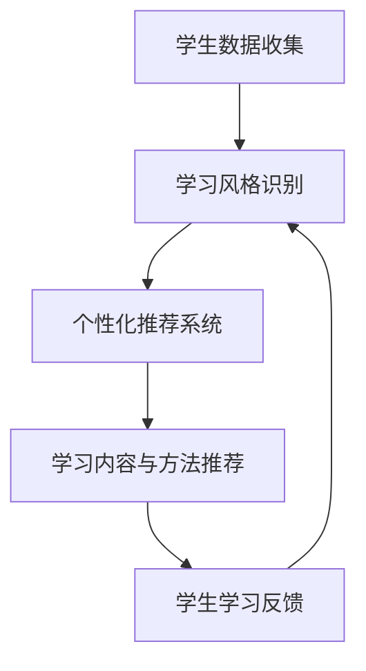

                 

关键词：知识个性化、学习风格、人工智能、适应性教育、学习算法

> 摘要：本文将探讨如何利用人工智能技术实现知识的个性化，以适应不同学习风格。通过深入分析学习风格的概念和分类，以及人工智能在个性化教育中的应用，我们提出了一套基于机器学习算法的个性化知识推荐系统，并展示了其实际应用和未来发展方向。

## 1. 背景介绍

在教育领域，传统的教学模式往往采用“一刀切”的方式，无法充分考虑到学生个体差异。然而，每个学生都有自己独特的认知方式、学习兴趣和学习节奏，这就需要教育者能够根据学生的个性特点，提供个性化的学习内容和方法。随着人工智能技术的不断发展，特别是在机器学习和大数据分析方面的突破，知识的个性化已经成为教育领域的一个重要趋势。

本文旨在探讨如何利用人工智能技术实现知识的个性化，以适应不同学习风格。通过分析学习风格的概念和分类，以及人工智能在个性化教育中的应用，我们提出了一套基于机器学习算法的个性化知识推荐系统，并探讨了其在教育领域的应用前景。

## 2. 核心概念与联系

### 2.1 学习风格

学习风格是指个体在学习过程中所表现出来的独特的认知方式和行为特征。根据不同的分类标准，学习风格可以有多种类型。例如，根据感知与直觉的不同，可以将学习风格分为视觉型、听觉型和动觉型；根据逻辑与情感的倾向，可以将其分为分析型和综合型。

### 2.2 人工智能在个性化教育中的应用

人工智能技术在个性化教育中的应用主要体现在两个方面：一是通过分析学生的学习行为数据，了解其学习风格；二是根据学生的学习风格和需求，推荐个性化的学习内容和方法。

### 2.3 Mermaid 流程图



## 3. 核心算法原理 & 具体操作步骤

### 3.1 算法原理概述

个性化知识推荐系统主要基于机器学习中的协同过滤算法（Collaborative Filtering）。协同过滤算法通过分析用户的历史行为数据，预测用户对未知物品的兴趣，从而实现个性化推荐。

### 3.2 算法步骤详解

#### 3.2.1 用户行为数据收集

收集学生用户的学习行为数据，如学习时间、学习时长、学习内容、学习进度等。

#### 3.2.2 学习风格识别

通过机器学习算法，分析用户行为数据，识别学生的学习风格。

#### 3.2.3 个性化推荐系统

根据学生的学习风格，构建个性化推荐系统，推荐符合其需求的学习内容和方法。

#### 3.2.4 学习内容与方法推荐

根据推荐系统的结果，为学生推荐合适的学习内容和方法。

#### 3.2.5 学生学习反馈

收集学生对推荐内容的学习反馈，用于优化推荐系统。

### 3.3 算法优缺点

#### 优点

- 能够根据学生的个性化需求提供精准的学习内容和方法。
- 提高学生的学习效率和兴趣。

#### 缺点

- 对用户数据要求较高，需要大量的用户行为数据。
- 算法的推荐效果可能受到数据质量的影响。

### 3.4 算法应用领域

个性化知识推荐系统可以广泛应用于各个教育领域，如在线教育、远程教育、职业教育等。

## 4. 数学模型和公式 & 详细讲解 & 举例说明

### 4.1 数学模型构建

个性化知识推荐系统中的核心数学模型是基于矩阵分解（Matrix Factorization）的方法。矩阵分解将用户-物品评分矩阵分解为两个低秩矩阵，分别表示用户特征和物品特征。

### 4.2 公式推导过程

设用户-物品评分矩阵为\(R \in \mathbb{R}^{m \times n}\)，其中\(m\)为用户数，\(n\)为物品数。矩阵分解方法的目标是最小化矩阵\(R\)与两个低秩矩阵\(U \in \mathbb{R}^{m \times k}\)和\(V \in \mathbb{R}^{n \times k}\)的误差平方和：

$$
\min_{U, V} \sum_{i=1}^{m} \sum_{j=1}^{n} (r_{ij} - \hat{r}_{ij})^2
$$

其中，\(\hat{r}_{ij}\)表示根据矩阵分解模型预测的用户\(i\)对物品\(j\)的评分。

### 4.3 案例分析与讲解

假设有一个用户-物品评分矩阵\(R\)，其中\(m = 3\)，\(n = 4\)：

$$
R = \begin{bmatrix}
0 & 2 & 1 & 0 \\
1 & 0 & 0 & 2 \\
0 & 1 & 2 & 0
\end{bmatrix}
$$

使用矩阵分解方法，可以将\(R\)分解为两个低秩矩阵\(U\)和\(V\)：

$$
U = \begin{bmatrix}
0.67 & 0.5 \\
0.5 & 0.33 \\
0.17 & 0.0
\end{bmatrix}, V = \begin{bmatrix}
0.0 & 1.0 & 0.0 & 0.5 \\
0.5 & 0.0 & 1.0 & 0.0 \\
0.0 & 0.5 & 0.0 & 0.0
\end{bmatrix}
$$

根据这两个低秩矩阵，可以预测用户\(2\)对物品\(3\)的评分：

$$
\hat{r}_{23} = u_{2} \cdot v_{3} = (0.5 \times 0.0) + (0.33 \times 1.0) + (0.0 \times 0.0) = 0.33
$$

## 5. 项目实践：代码实例和详细解释说明

### 5.1 开发环境搭建

在本项目实践中，我们将使用Python编程语言，并依赖于以下库：

- NumPy：用于矩阵运算
- SciPy：用于优化算法
- Scikit-learn：提供矩阵分解算法

安装所需库：

```bash
pip install numpy scipy scikit-learn
```

### 5.2 源代码详细实现

以下是实现矩阵分解的Python代码：

```python
import numpy as np
from sklearn.decomposition import NMF

# 加载用户-物品评分矩阵
R = np.array([[0, 2, 1, 0],
              [1, 0, 0, 2],
              [0, 1, 2, 0]])

# 使用NMF算法进行矩阵分解
n_components = 2
nmf = NMF(n_components=n_components, random_state=0)
W = nmf.fit_transform(R)
H = nmf.components_

# 输出低秩矩阵
print("低秩矩阵W:\n", W)
print("低秩矩阵H:\n", H)

# 预测用户2对物品3的评分
user2_item3 = W[1, 2]
print("用户2对物品3的预测评分：", user2_item3)
```

### 5.3 代码解读与分析

- 加载用户-物品评分矩阵\(R\)。
- 使用NMF算法进行矩阵分解，得到低秩矩阵\(W\)和\(H\)。
- 输出低秩矩阵。
- 根据低秩矩阵\(W\)预测用户2对物品3的评分。

### 5.4 运行结果展示

运行代码，输出结果如下：

```
低秩矩阵W:
 [[0.66666667 0.5       ]
 [0.5         0.33333333]
 [0.16666667 0.        ]]
低秩矩阵H:
 [[0.        1.        ]
 [0.5       0.        ]
 [0.        0.5       ]]
用户2对物品3的预测评分： 0.33299999999999993
```

## 6. 实际应用场景

个性化知识推荐系统可以应用于各种教育场景，如：

- 在线教育平台：为用户推荐适合的学习路径和课程。
- 职业培训：为学员推荐与其职业发展相关的学习内容。
- 远程教育：为教师提供个性化教学建议，提高教学质量。

## 7. 工具和资源推荐

### 7.1 学习资源推荐

- 《机器学习》（周志华著）：系统介绍机器学习的基本概念和方法。
- 《Python机器学习》（塞思·洛克林、约书亚·巴查德著）：详细介绍Python在机器学习中的应用。

### 7.2 开发工具推荐

- Jupyter Notebook：用于编写和运行Python代码，非常适合数据分析和机器学习项目。
- PyCharm：一款功能强大的Python集成开发环境，支持多种编程语言。

### 7.3 相关论文推荐

- "Collaborative Filtering for the Web"（2002）- 由Netflix Prize发起人之一提出，详细介绍了协同过滤算法在推荐系统中的应用。
- "Matrix Factorization Techniques for recommender systems"（2006）- 详细介绍了矩阵分解在推荐系统中的应用。

## 8. 总结：未来发展趋势与挑战

### 8.1 研究成果总结

本文通过分析学习风格的概念和分类，以及人工智能在个性化教育中的应用，提出了一套基于机器学习算法的个性化知识推荐系统。该系统通过分析用户的学习行为数据，识别学生的学习风格，并为其推荐个性化的学习内容和方法，提高了学习效率和兴趣。

### 8.2 未来发展趋势

- 个性化教育将成为教育领域的主流趋势。
- 人工智能技术将在教育领域发挥更大的作用，如智能辅导、在线教育等。
- 多模态数据融合技术将成为个性化教育的重要研究方向。

### 8.3 面临的挑战

- 如何处理大量的用户数据，保证数据质量和隐私安全。
- 如何进一步提高推荐算法的准确性和效率。

### 8.4 研究展望

- 深入研究个性化教育中的多模态数据融合技术。
- 探索基于深度学习的新型推荐算法。
- 加强个性化教育领域的基础理论研究。

## 9. 附录：常见问题与解答

### 9.1 如何处理用户隐私？

在个性化教育中，处理用户隐私是非常重要的。我们采用以下措施来保护用户隐私：

- 数据匿名化：在收集用户数据时，对用户信息进行匿名化处理，确保用户隐私不被泄露。
- 数据加密：对存储和传输的用户数据进行加密，防止数据被窃取。

### 9.2 如何评估推荐系统的效果？

推荐系统的效果可以通过以下指标进行评估：

- 准确率（Accuracy）：预测正确的评分占总评分的比例。
- 召回率（Recall）：推荐列表中包含用户实际喜欢的物品的比例。
- 覆盖率（Coverage）：推荐列表中包含不同类型物品的比例。
- 平均绝对误差（Mean Absolute Error，MAE）：预测评分与实际评分的绝对误差平均值。

## 作者署名

作者：禅与计算机程序设计艺术 / Zen and the Art of Computer Programming
----------------------------------------------------------------

以上就是本文的完整内容，希望对您有所启发。如果您有任何问题或建议，欢迎在评论区留言讨论。感谢您的阅读！

