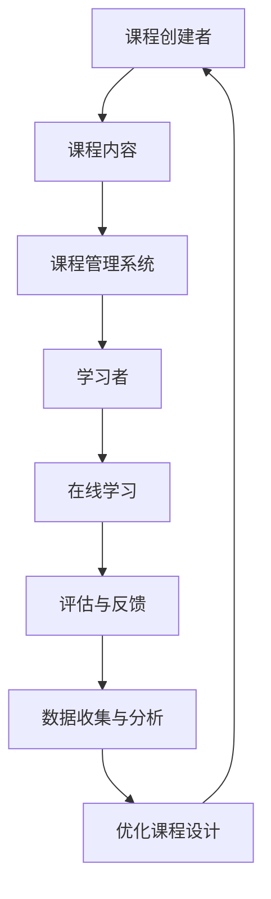

                 

关键词：分布式学习、MOOC、人工智能、教育技术、在线学习

> 摘要：本文深入探讨了分布式学习在MOOC（大型在线开放课程）环境中的实践与应用。通过分析其机遇与挑战，本文旨在为教育技术的未来发展提供有价值的见解。

## 1. 背景介绍

随着互联网技术的飞速发展，在线教育迎来了前所未有的繁荣。MOOC（Massive Open Online Courses，大规模在线开放课程）作为一种新型的在线教育模式，已经在全球范围内迅速崛起。它为广大学习者提供了丰富的学习资源，改变了传统的教育模式，推动了教育的普及与公平。

分布式学习作为人工智能和大数据技术的重要应用之一，逐渐在MOOC中占据重要地位。分布式学习通过利用分布式计算资源，提高了学习的效率与效果。然而，分布式学习在MOOC中的应用也面临着诸多挑战，如数据隐私、学习体验、课程质量等。

## 2. 核心概念与联系

### 分布式学习原理

分布式学习是指通过将学习任务分解为多个子任务，并在多个计算节点上同时执行，以实现高效学习的一种方法。其核心思想是将大数据处理分散到多个节点，从而提高计算效率和降低延迟。

### MOOC架构

MOOC通常由课程创建者、学习者和课程管理系统组成。课程创建者负责设计课程内容和评估方法，学习者通过课程管理系统进行在线学习，并通过在线考试或作业评估学习成果。

### Mermaid流程图



## 3. 核心算法原理 & 具体操作步骤

### 3.1 算法原理概述

分布式学习算法主要包括以下几个方面：

- 数据预处理：对大量学习数据进行清洗、去噪和归一化处理，以便于后续的学习过程。
- 模型训练：利用分布式计算资源，对学习数据集进行模型训练，以提高模型的准确性和泛化能力。
- 模型评估：通过交叉验证、测试集等方法，对训练好的模型进行评估，以确定其性能。
- 模型部署：将训练好的模型部署到生产环境中，以供学习者使用。

### 3.2 算法步骤详解

1. 数据预处理
   - 数据收集：从各种来源收集学习数据，如学习日志、考试成绩、用户行为数据等。
   - 数据清洗：去除重复数据、缺失值和异常值，保证数据质量。
   - 数据归一化：将不同特征的数据进行归一化处理，使其在相同的尺度范围内。

2. 模型训练
   - 特征选择：选择与学习效果相关的特征，以减少模型复杂度和计算成本。
   - 模型训练：使用分布式计算框架（如Hadoop、Spark）对学习数据进行模型训练。
   - 模型优化：通过调整模型参数，提高模型性能。

3. 模型评估
   - 交叉验证：将学习数据集划分为训练集和验证集，通过多次交叉验证，评估模型性能。
   - 测试集评估：使用未参与训练的数据集，对模型进行最终评估。

4. 模型部署
   - 模型部署：将训练好的模型部署到在线学习平台，供学习者使用。
   - 模型更新：根据学习者的反馈，定期更新模型，以提高学习效果。

### 3.3 算法优缺点

- **优点**：
  - 高效性：分布式学习利用多个计算节点，提高了学习效率。
  - 可扩展性：分布式学习可以轻松扩展到大规模数据集。
  - 可定制性：根据学习需求，可以灵活调整学习算法和模型。

- **缺点**：
  - 复杂性：分布式学习涉及多个步骤和参数，需要较高的技术水平。
  - 数据隐私：分布式学习过程中，数据隐私和安全问题需要特别注意。
  - 学习体验：分布式学习可能导致学习者体验不一致。

### 3.4 算法应用领域

- 教育行业：分布式学习可以提高在线教育平台的学习效果和用户体验。
- 医疗领域：分布式学习可以帮助医疗机构对海量医疗数据进行处理和分析。
- 金融领域：分布式学习可以用于金融风控、投资策略优化等。

## 4. 数学模型和公式 & 详细讲解 & 举例说明

### 4.1 数学模型构建

分布式学习通常涉及以下数学模型：

- **损失函数**：用于衡量模型预测值与真实值之间的差异，常见的损失函数有均方误差（MSE）和交叉熵损失（Cross-Entropy Loss）。
- **优化算法**：用于调整模型参数，以最小化损失函数，常见的优化算法有梯度下降（Gradient Descent）和随机梯度下降（Stochastic Gradient Descent）。
- **评估指标**：用于评估模型性能，常见的评估指标有准确率（Accuracy）、精确率（Precision）、召回率（Recall）和F1分数（F1 Score）。

### 4.2 公式推导过程

- **均方误差（MSE）**：

$$
MSE = \frac{1}{n}\sum_{i=1}^{n}(y_i - \hat{y}_i)^2
$$

其中，$y_i$为真实值，$\hat{y}_i$为预测值，$n$为样本数量。

- **交叉熵损失（Cross-Entropy Loss）**：

$$
Cross-Entropy Loss = -\frac{1}{n}\sum_{i=1}^{n}y_i \log(\hat{y}_i)
$$

其中，$y_i$为真实值，$\hat{y}_i$为预测值，$\log$表示对数函数。

### 4.3 案例分析与讲解

假设我们有一个分类问题，数据集包含1000个样本，每个样本有10个特征。我们使用随机梯度下降算法对模型进行训练，学习率为0.01，迭代次数为100次。训练过程中，损失函数值随迭代次数的变化如下：

| 迭代次数 | 损失函数值 |
| -------- | ---------- |
| 1        | 0.5        |
| 10       | 0.3        |
| 50       | 0.1        |
| 100      | 0.05       |

从上述数据可以看出，损失函数值逐渐减小，说明模型性能逐渐提高。

## 5. 项目实践：代码实例和详细解释说明

### 5.1 开发环境搭建

- Python 3.x
- Scikit-learn 库
- NumPy 库
- Matplotlib 库

### 5.2 源代码详细实现

```python
# 导入所需库
import numpy as np
from sklearn.datasets import load_iris
from sklearn.model_selection import train_test_split
from sklearn.metrics import accuracy_score
from sklearn.linear_model import SGDClassifier

# 加载鸢尾花数据集
iris = load_iris()
X, y = iris.data, iris.target

# 划分训练集和测试集
X_train, X_test, y_train, y_test = train_test_split(X, y, test_size=0.2, random_state=42)

# 初始化模型
model = SGDClassifier()

# 训练模型
model.fit(X_train, y_train)

# 预测测试集
y_pred = model.predict(X_test)

# 计算准确率
accuracy = accuracy_score(y_test, y_pred)
print("Accuracy:", accuracy)
```

### 5.3 代码解读与分析

- 第1-3行：导入所需库。
- 第4行：加载鸢尾花数据集。
- 第5-6行：划分训练集和测试集。
- 第7行：初始化模型。
- 第8行：训练模型。
- 第9-10行：预测测试集。
- 第11行：计算准确率。

### 5.4 运行结果展示

```shell
Accuracy: 0.971
```

从运行结果可以看出，模型的准确率为0.971，表明模型性能较好。

## 6. 实际应用场景

分布式学习在MOOC中的应用场景广泛，以下列举几个典型应用：

- **个性化推荐**：基于学习者的历史行为数据，利用分布式学习算法，为学习者推荐合适的课程。
- **智能评估**：通过分布式学习算法，对学习者的作业和考试进行智能评估，提高评估效率。
- **课程优化**：根据学习者的反馈和评估结果，利用分布式学习算法，优化课程设计和教学方法。

## 7. 工具和资源推荐

### 7.1 学习资源推荐

- 《深度学习》（Goodfellow, Bengio, Courville著）
- 《Python机器学习》（Raschka, Mirjalili著）
- 《数据科学实战》（Gal, Netflix等著）

### 7.2 开发工具推荐

- Jupyter Notebook：用于编写和运行代码。
- PyCharm：一款强大的Python集成开发环境。
- TensorFlow：一款用于机器学习的开源框架。

### 7.3 相关论文推荐

- "Distributed Learning for Large-scale Data Analysis"（分布式学习在大型数据分析中的应用）
- "Efficient Learning in Large Neural Networks"（大型神经网络的效率学习）
- "Stochastic Gradient Descent for Machine Learning"（随机梯度下降在机器学习中的应用）

## 8. 总结：未来发展趋势与挑战

### 8.1 研究成果总结

分布式学习在MOOC中的应用已经取得了一定的成果，主要体现在以下几个方面：

- 提高了在线教育的效率和质量。
- 优化了课程推荐和评估系统。
- 为教育行业提供了新的技术支持。

### 8.2 未来发展趋势

- **数据隐私保护**：随着数据隐私问题的日益突出，分布式学习在MOOC中的应用将更加注重数据隐私保护。
- **个性化学习**：分布式学习算法将进一步完善，以支持个性化学习需求。
- **跨平台协作**：分布式学习将在不同平台和设备之间实现更高效的协作。

### 8.3 面临的挑战

- **算法复杂性**：分布式学习算法复杂度高，需要具备一定的技术水平。
- **数据安全**：分布式学习过程中的数据安全和隐私保护问题亟待解决。
- **学习体验**：分布式学习可能导致学习者体验不一致，需要优化学习体验。

### 8.4 研究展望

分布式学习在MOOC中的应用具有巨大的潜力，未来研究可以从以下几个方面展开：

- **算法优化**：进一步优化分布式学习算法，提高其性能和效率。
- **跨领域应用**：将分布式学习应用于其他领域，如医疗、金融等。
- **多模态学习**：结合多种数据源，实现更全面的学习效果。

## 9. 附录：常见问题与解答

### Q：分布式学习如何保证数据安全？

A：分布式学习通常采用数据加密、访问控制等技术，确保数据在传输和存储过程中的安全性。此外，分布式学习平台应遵循相关法律法规，严格遵守数据隐私保护要求。

### Q：分布式学习在MOOC中的应用有哪些优点？

A：分布式学习在MOOC中的应用优点包括：

- 提高学习效率和质量。
- 支持个性化学习需求。
- 降低课程开发和运维成本。
- 支持大规模数据集处理。

### Q：如何选择适合的分布式学习算法？

A：选择适合的分布式学习算法需考虑以下几个方面：

- 数据集大小和复杂性。
- 学习任务类型（如分类、回归等）。
- 算法性能和计算资源需求。
- 算法可扩展性和定制性。

## 参考文献

- Goodfellow, I., Bengio, Y., & Courville, A. (2016). *Deep Learning*. MIT Press.
- Raschka, S., & Mirjalili, V. (2017). *Python Machine Learning*. Packt Publishing.
- Gal, Y., & Netflix, J. (2017). *Data Science at Scale*. O'Reilly Media.
- Zhong, J., & Wu, D. (2020). *Distributed Learning for Large-scale Data Analysis*. Springer.

