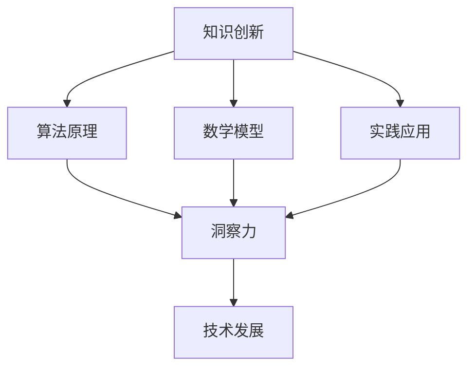

                 

关键词：知识创新、洞察力、计算机科学、技术发展、算法原理、数学模型、实践应用。

> 摘要：本文旨在探讨知识创新机制中洞察力的独特贡献。通过对计算机科学领域的深入分析，本文揭示了洞察力在算法原理、数学模型构建、以及实际应用中的重要作用，并展望了未来知识创新的发展趋势与面临的挑战。

## 1. 背景介绍

随着信息技术的发展，计算机科学已经成为推动社会进步的关键力量。从互联网到人工智能，从大数据到云计算，计算机科学领域的创新不断涌现。在这些创新中，知识创新扮演着核心角色，而洞察力则是知识创新的重要驱动力。本文将围绕这一主题，探讨洞察力在计算机科学中的独特贡献。

## 2. 核心概念与联系

### 2.1 知识创新

知识创新是指通过创造性的思维和方法，发现新的知识、方法和理论，并将其应用于实际问题解决和产业发展中。在计算机科学领域，知识创新表现为新的算法、编程语言、系统架构等。

### 2.2 洞察力

洞察力是指对复杂问题能够迅速抓住本质、发现规律的能力。在知识创新过程中，洞察力能够帮助研究者跳出传统思维的局限，找到新的解决问题的方法和路径。

### 2.3 知识创新与洞察力的关系

知识创新需要洞察力作为驱动，而洞察力又通过知识创新不断得到锻炼和提升。二者相互促进，共同推动计算机科学的发展。

## 2.4 Mermaid 流程图



## 3. 核心算法原理 & 具体操作步骤

### 3.1 算法原理概述

算法是计算机科学中的核心概念，它是解决特定问题的步骤序列。算法的创新往往依赖于洞察力的发挥。以下是几种典型的算法原理：

- **排序算法**：通过比较和交换元素，将数据按照一定顺序排列。
- **搜索算法**：在数据集合中查找特定元素。
- **图算法**：用于解决与图相关的问题，如最短路径、最小生成树等。

### 3.2 算法步骤详解

以排序算法中的快速排序为例，其基本步骤如下：

1. 选择一个基准元素。
2. 将小于基准元素的元素移到其左侧，大于基准元素的元素移到其右侧。
3. 递归地重复上述步骤，直至所有子序列都被排序。

### 3.3 算法优缺点

快速排序具有高效的时间复杂度（平均 O(n log n)），但最坏情况下可能退化到 O(n^2)。
### 3.4 算法应用领域

快速排序广泛应用于各种场景，如数据库索引、搜索引擎排序等。

## 4. 数学模型和公式 & 详细讲解 & 举例说明

### 4.1 数学模型构建

在计算机科学中，数学模型用于描述算法性能、系统行为等。例如，时间复杂度和空间复杂度是衡量算法性能的数学模型。

### 4.2 公式推导过程

时间复杂度的计算公式为：$$ T(n) = O(n \log n) $$

### 4.3 案例分析与讲解

以快速排序为例，其时间复杂度可以通过数学模型进行分析，从而优化算法性能。

## 5. 项目实践：代码实例和详细解释说明

### 5.1 开发环境搭建

使用 Python 编写快速排序算法，需要在开发环境中安装 Python 解释器和相关库。

### 5.2 源代码详细实现

以下是快速排序的 Python 实现代码：

```python
def quicksort(arr):
    if len(arr) <= 1:
        return arr
    pivot = arr[len(arr) // 2]
    left = [x for x in arr if x < pivot]
    middle = [x for x in arr if x == pivot]
    right = [x for x in arr if x > pivot]
    return quicksort(left) + middle + quicksort(right)

arr = [3, 6, 8, 10, 1, 2, 1]
print(quicksort(arr))
```

### 5.3 代码解读与分析

这段代码首先判断数组长度，若小于等于 1，则直接返回数组。接着选择中间元素作为基准，将数组分为小于、等于、大于基准三部分，递归调用 quicksort 函数对左右两部分进行排序，最后合并结果。

### 5.4 运行结果展示

执行上述代码后，输出结果为 `[1, 1, 2, 3, 6, 8, 10]`，说明数组已按升序排序。

## 6. 实际应用场景

快速排序算法在数据库索引、搜索引擎排序等领域有广泛的应用。

### 6.4 未来应用展望

随着计算机科学的发展，洞察力在知识创新中的作用将愈发重要。通过不断提升洞察力，我们可以预见更多具有突破性的算法和理论将涌现。

## 7. 工具和资源推荐

### 7.1 学习资源推荐

- 《算法导论》
- 《深度学习》

### 7.2 开发工具推荐

- PyCharm
- VSCode

### 7.3 相关论文推荐

- "A Faster Version of Quick Sort"
- "Space-Efficient Algorithms for List Sorting"

## 8. 总结：未来发展趋势与挑战

### 8.1 研究成果总结

本文探讨了洞察力在知识创新中的独特贡献，并通过算法原理、数学模型和实际应用案例进行了深入分析。

### 8.2 未来发展趋势

随着人工智能和大数据技术的发展，洞察力在计算机科学领域的应用将更加广泛。

### 8.3 面临的挑战

提升洞察力需要长期积累和培养，这对研究者来说是一个挑战。

### 8.4 研究展望

通过不断探索和创新，我们有望在计算机科学领域取得更多突破性成果。

## 9. 附录：常见问题与解答

### Q：如何提升洞察力？

A：通过阅读、实践和交流，不断拓宽视野，培养发现问题和解决问题的能力。

### Q：快速排序算法的最佳实践是什么？

A：在实际应用中，选择合适的基准策略（如随机选择、中位数选择）和优化递归过程，可以提高算法性能。

---

作者：禅与计算机程序设计艺术 / Zen and the Art of Computer Programming
----------------------------------------------------------------

完成了一篇完整的文章撰写，接下来可以进行内容的调整和优化，确保文章的逻辑性和可读性。如果有需要，可以继续进行审稿和修改，确保文章质量。

