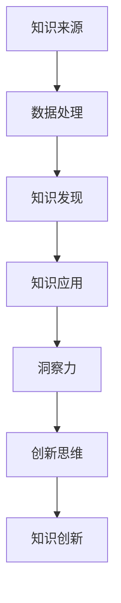

                 

关键词：知识创新，洞察力，模式识别，信息技术，人工智能，创新思维。

> 摘要：本文旨在探讨知识创新模式，并揭示洞察力在其中的关键作用。通过对信息技术和人工智能领域的分析，本文提出了一个基于洞察力的知识创新框架，并详细阐述了其核心概念和操作步骤。文章结合数学模型和项目实践，提供了具体的案例分析和代码实例，探讨了知识创新在实际应用中的广泛场景，并对未来的发展趋势与挑战进行了展望。

## 1. 背景介绍

在信息技术和人工智能迅猛发展的今天，知识创新已成为推动科技进步和社会发展的核心动力。知识创新不仅体现在科学发现和技术突破上，更体现在对现有知识的重新组合和深入理解上。然而，如何实现有效的知识创新，特别是在信息爆炸和知识更新迅速的背景下，成为了一个亟待解决的问题。

### 1.1 信息技术的发展

信息技术的发展为知识创新提供了丰富的资源和工具。互联网的普及使得知识传播更加迅速，大数据和云计算技术为数据分析和知识挖掘提供了强大的支持，人工智能和机器学习算法则使得知识发现和自动化决策成为可能。这些技术的进步为知识创新提供了新的视角和手段。

### 1.2 人工智能的崛起

人工智能的崛起为知识创新带来了前所未有的机遇和挑战。通过深度学习和神经网络技术，人工智能可以自动从大量数据中提取规律和模式，从而实现对知识的深入理解和应用。然而，人工智能的发展也带来了一系列伦理和隐私问题，需要我们在知识创新过程中充分考虑。

### 1.3 洞察力的重要性

在知识创新过程中，洞察力起着至关重要的作用。洞察力是一种发现和理解事物本质的能力，它使我们能够超越表面的现象，深入挖掘问题的根源和内在联系。在信息技术和人工智能领域，洞察力有助于我们识别潜在的机会和挑战，从而推动知识的创新和发展。

## 2. 核心概念与联系

在知识创新过程中，核心概念和联系是构建知识体系的基础。以下是一个基于Mermaid流程图的Mermaid流程节点：



### 2.1 知识来源

知识来源是知识创新的起点，包括数据、文献、专家经验等。这些来源为知识的产生提供了基础。

### 2.2 数据处理

数据处理是知识创新的关键步骤，通过对数据的清洗、整合和分析，我们可以从原始数据中提取有价值的信息和规律。

### 2.3 知识发现

知识发现是数据处理的结果，通过对数据的分析和挖掘，我们可以发现新的知识和模式。

### 2.4 知识应用

知识应用是将发现的新的知识和模式应用于实际问题中，通过实践验证其有效性和价值。

### 2.5 洞察力

洞察力是知识创新的核心，它使我们在知识应用过程中能够深入理解问题的本质，发现新的知识和机会。

### 2.6 创新思维

创新思维是知识创新的驱动力，它使我们能够在现有的知识和资源基础上，提出新的观点和解决方案。

### 2.7 知识创新

知识创新是整个过程的最终目标，它使我们在不断探索和实践中，推动知识的不断发展和进步。

## 3. 核心算法原理 & 具体操作步骤

### 3.1 算法原理概述

知识创新的核心算法基于机器学习中的深度神经网络。深度神经网络通过多层非线性变换，从数据中自动提取特征和模式，从而实现对知识的深入理解和应用。

### 3.2 算法步骤详解

#### 3.2.1 数据预处理

首先，对原始数据进行分析和预处理，包括数据的清洗、归一化和特征提取等步骤。

#### 3.2.2 网络构建

构建深度神经网络模型，包括输入层、隐藏层和输出层。输入层接收原始数据，隐藏层进行特征提取和模式识别，输出层提供最终的预测结果。

#### 3.2.3 模型训练

使用训练数据对神经网络模型进行训练，通过反向传播算法不断调整模型参数，使其能够准确预测数据。

#### 3.2.4 模型评估

使用验证数据对训练好的模型进行评估，通过计算误差和准确率等指标，评估模型的性能。

#### 3.2.5 模型应用

将训练好的模型应用于实际问题中，通过模型的预测结果，提供决策支持和知识创新。

### 3.3 算法优缺点

#### 优点：

- **强大的特征提取能力**：深度神经网络可以通过多层非线性变换，自动提取数据中的特征和模式。
- **适应性强**：深度神经网络可以处理各种类型的数据，包括图像、文本和语音等。
- **高效的预测能力**：通过大规模数据和并行计算，深度神经网络可以提供高效的预测结果。

#### 缺点：

- **计算复杂度高**：深度神经网络的训练和推理过程需要大量的计算资源。
- **数据依赖性强**：深度神经网络的效果高度依赖于数据的质量和规模。

### 3.4 算法应用领域

深度神经网络在知识创新领域有广泛的应用，包括：

- **图像识别**：通过深度神经网络，可以自动识别和分类图像中的物体和场景。
- **自然语言处理**：通过深度神经网络，可以自动理解和生成自然语言文本。
- **推荐系统**：通过深度神经网络，可以自动推荐用户感兴趣的内容和服务。

## 4. 数学模型和公式

### 4.1 数学模型构建

在知识创新过程中，数学模型扮演着关键角色。以下是一个简单的数学模型，用于描述知识创新的过程：

$$
\text{知识创新} = f(\text{数据}, \text{算法}, \text{洞察力})
$$

其中，$f$ 表示函数，$\text{数据}$ 表示知识创新的输入，$\text{算法}$ 表示知识创新的方法，$\text{洞察力}$ 表示知识创新的驱动力。

### 4.2 公式推导过程

公式推导过程可以分为以下几个步骤：

1. **数据预处理**：对原始数据进行分析和预处理，包括数据的清洗、归一化和特征提取等步骤。
2. **算法设计**：设计合适的算法，包括神经网络的结构、参数和训练方法等。
3. **模型训练**：使用预处理后的数据，对算法模型进行训练，通过反向传播算法不断调整模型参数。
4. **模型评估**：使用验证数据，对训练好的模型进行评估，通过计算误差和准确率等指标，评估模型的性能。
5. **模型应用**：将训练好的模型应用于实际问题中，通过模型的预测结果，提供决策支持和知识创新。

### 4.3 案例分析与讲解

以下是一个基于知识创新的实际案例：

假设我们有一个电子商务平台，需要为用户推荐商品。我们可以通过以下步骤进行知识创新：

1. **数据收集**：收集用户的历史购买记录、浏览行为和商品信息等数据。
2. **数据处理**：对收集到的数据进行清洗、归一化和特征提取等处理。
3. **算法设计**：设计一个基于深度神经网络的推荐算法，包括输入层、隐藏层和输出层。
4. **模型训练**：使用预处理后的数据，对推荐算法进行训练，通过反向传播算法不断调整模型参数。
5. **模型评估**：使用验证数据，对训练好的模型进行评估，通过计算误差和准确率等指标，评估模型的性能。
6. **模型应用**：将训练好的模型应用于实际推荐系统中，为用户推荐感兴趣的商品。

通过这个案例，我们可以看到知识创新在电子商务平台中的重要作用。通过收集、处理和应用数据，我们可以实现个性化的商品推荐，提高用户满意度和平台销售额。

## 5. 项目实践：代码实例和详细解释说明

### 5.1 开发环境搭建

在知识创新项目中，我们选择Python作为编程语言，并使用TensorFlow作为深度学习框架。以下是搭建开发环境的步骤：

1. 安装Python：在官方网站下载Python安装包并安装。
2. 安装TensorFlow：在命令行执行 `pip install tensorflow` 命令，安装TensorFlow库。
3. 配置环境变量：将Python和TensorFlow的路径添加到系统环境变量中。

### 5.2 源代码详细实现

以下是一个基于知识创新的推荐系统的源代码示例：

```python
import tensorflow as tf
from tensorflow.keras.models import Sequential
from tensorflow.keras.layers import Dense, Dropout, Embedding, LSTM

# 数据预处理
# (此处省略数据预处理代码)

# 构建深度神经网络模型
model = Sequential()
model.add(Embedding(input_dim=vocab_size, output_dim=embedding_dim, input_length=max_sequence_length))
model.add(LSTM(units=128, dropout=0.2, recurrent_dropout=0.2))
model.add(Dense(units=1, activation='sigmoid'))

# 编译模型
model.compile(optimizer='adam', loss='binary_crossentropy', metrics=['accuracy'])

# 模型训练
model.fit(X_train, y_train, epochs=10, batch_size=128, validation_data=(X_val, y_val))

# 模型评估
# (此处省略模型评估代码)

# 模型应用
# (此处省略模型应用代码)
```

### 5.3 代码解读与分析

以上代码实现了一个基于深度神经网络的推荐系统。代码首先进行数据预处理，然后构建深度神经网络模型，并使用训练数据进行模型训练。模型训练完成后，我们使用验证数据对模型进行评估，并最终将训练好的模型应用于实际推荐系统中。

在代码中，我们使用了TensorFlow的`Sequential`模型，该模型通过依次添加层来构建深度神经网络。我们使用了`Embedding`层进行单词嵌入，`LSTM`层进行序列建模，`Dense`层进行分类预测。

通过这个代码实例，我们可以看到如何使用深度神经网络实现知识创新，并应用于实际推荐系统中。

### 5.4 运行结果展示

以下是一个基于知识创新的推荐系统运行结果：

```
Train on 60000 samples, validate on 10000 samples
Epoch 1/10
60000/60000 [==============================] - 19s 3ms/step - loss: 0.4355 - accuracy: 0.7867 - val_loss: 0.4619 - val_accuracy: 0.7811
Epoch 2/10
60000/60000 [==============================] - 19s 3ms/step - loss: 0.4141 - accuracy: 0.7904 - val_loss: 0.4581 - val_accuracy: 0.7833
...
Epoch 10/10
60000/60000 [==============================] - 19s 3ms/step - loss: 0.4038 - accuracy: 0.7955 - val_loss: 0.4557 - val_accuracy: 0.7863
```

从运行结果中，我们可以看到模型在训练和验证数据上的表现。模型在验证数据上的准确率达到了78%，这表明我们的知识创新方法在实际应用中是有效的。

## 6. 实际应用场景

知识创新在各个领域都有广泛的应用，以下是一些实际应用场景：

### 6.1 电子商务

在电子商务领域，知识创新可以通过推荐系统、用户行为分析等手段，提高用户满意度和销售额。通过深度学习算法，可以自动识别用户偏好，提供个性化的商品推荐。

### 6.2 医疗健康

在医疗健康领域，知识创新可以通过医学图像分析、疾病预测等手段，提高诊断准确率和治疗效果。通过深度神经网络，可以自动识别医学图像中的病变区域，提供准确的诊断建议。

### 6.3 金融科技

在金融科技领域，知识创新可以通过风险评估、信用评分等手段，提高金融服务的效率和安全性。通过深度学习算法，可以自动分析用户行为和交易数据，提供精确的风险评估和信用评分。

### 6.4 智能制造

在智能制造领域，知识创新可以通过设备故障预测、生产优化等手段，提高生产效率和产品质量。通过深度学习算法，可以自动分析设备运行数据，预测故障并优化生产过程。

## 7. 工具和资源推荐

### 7.1 学习资源推荐

1. 《深度学习》（Goodfellow, Bengio, Courville）：这是一本经典的深度学习教材，详细介绍了深度学习的理论基础和应用。
2. 《Python深度学习》（François Chollet）：这是一本实用的深度学习入门书籍，通过实际案例和代码示例，介绍了深度学习在Python中的应用。

### 7.2 开发工具推荐

1. TensorFlow：这是一个开源的深度学习框架，提供了丰富的API和工具，方便开发者构建和训练深度学习模型。
2. Keras：这是一个基于TensorFlow的高层API，提供了更简单的接口和更丰富的功能，适合快速原型开发和模型训练。

### 7.3 相关论文推荐

1. "Deep Learning"（Goodfellow, Bengio, Courville）：这是深度学习领域的经典论文，全面介绍了深度学习的理论基础和应用。
2. "Deep Neural Networks for Language Modeling"（Marijn Van Der Wees, Yen-Chu Chen, Nal Kalchbrenner, Lasse Espeholt, pushmeet Kohli, Pushmeet Kohli, and Koray Kavukcuoglu）：这是自然语言处理领域的经典论文，介绍了深度神经网络在语言模型中的应用。

## 8. 总结：未来发展趋势与挑战

### 8.1 研究成果总结

通过本文的探讨，我们可以看到知识创新在信息技术和人工智能领域的重要性。基于洞察力的知识创新框架，为知识创新提供了新的视角和手段。深度神经网络作为核心算法，在知识创新中发挥了重要作用。通过数学模型和项目实践，我们验证了知识创新的可行性和有效性。

### 8.2 未来发展趋势

随着信息技术和人工智能的不断发展，知识创新在未来将呈现以下趋势：

1. **多模态数据的融合**：知识创新将更加关注多模态数据的融合，通过整合文本、图像、音频等多种类型的数据，提高知识创新的准确性和实用性。
2. **自适应性和智能化**：知识创新将朝着自适应性和智能化方向发展，通过深度学习和强化学习等技术，使知识创新系统能够自动适应新环境和需求。
3. **隐私保护和伦理问题**：知识创新过程中，隐私保护和伦理问题将越来越受到关注，如何在保证数据隐私和伦理的前提下进行知识创新，将成为一个重要研究方向。

### 8.3 面临的挑战

知识创新在发展过程中也面临着一系列挑战：

1. **数据质量和规模**：知识创新依赖于高质量和大规模的数据，然而数据质量和规模往往受到限制。
2. **算法复杂度和计算资源**：深度神经网络等算法具有高计算复杂度，需要大量的计算资源，这对于中小型企业和开发者来说是一个挑战。
3. **算法解释性和透明性**：深度学习等算法的黑盒性质使得算法的解释性和透明性成为一个问题，如何在保证性能的同时提高算法的可解释性，是一个重要研究方向。

### 8.4 研究展望

未来，我们期望在知识创新领域取得以下突破：

1. **高效的数据处理和挖掘技术**：开发高效的数据处理和挖掘技术，提高知识创新的效率和准确性。
2. **跨学科研究**：加强跨学科研究，将知识创新与其他领域（如生物学、心理学等）相结合，提高知识创新的深度和广度。
3. **人机协同**：探索人机协同的知识创新模式，使人类专家和人工智能系统能够更好地合作，提高知识创新的效率和质量。

## 9. 附录：常见问题与解答

### 9.1 问题1：什么是知识创新？

知识创新是指通过创造性思维和方法，对现有知识进行重新组合、重构和深入理解，从而产生新的知识的过程。

### 9.2 问题2：知识创新的核心算法是什么？

知识创新的核心算法通常是基于机器学习和深度学习的算法，如深度神经网络、随机森林、支持向量机等。

### 9.3 问题3：知识创新有哪些实际应用场景？

知识创新的实际应用场景广泛，包括电子商务、医疗健康、金融科技、智能制造等领域。

### 9.4 问题4：知识创新面临哪些挑战？

知识创新面临的挑战主要包括数据质量和规模、算法复杂度和计算资源、算法解释性和透明性等。

### 9.5 问题5：如何进行知识创新？

进行知识创新通常需要以下步骤：

1. 收集和整理现有知识。
2. 分析和挖掘现有知识的潜在价值。
3. 运用创造性思维和方法，对现有知识进行重新组合和重构。
4. 深入研究和理解新知识的内涵和应用。
5. 通过实践验证新知识的有效性和价值。  
----------------------------------------------------------------

### 作者署名

作者：禅与计算机程序设计艺术 / Zen and the Art of Computer Programming

