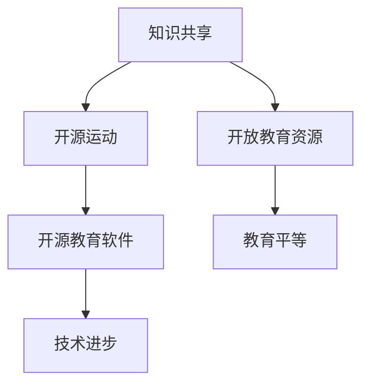

                 

关键词：知识共享，开源运动，教育，共享经济，技术，影响力

> 摘要：本文探讨了知识共享与开源运动在现代社会教育中的重要作用。共享经济的兴起为教育领域带来了新的可能性，推动了知识的普及与传播。通过开源项目的实践，教育不再局限于传统的课堂，而是在全球范围内实现资源共享与协同创新。本文将分析开源运动在教育中的体现，探讨其对教育体系的影响，以及面临的挑战和未来发展趋势。

## 1. 背景介绍

在过去的几十年中，信息技术的发展极大地改变了人类的生活方式。计算机科学、互联网和移动通信技术的进步，不仅推动了各行各业的变革，也为教育领域带来了前所未有的机遇。知识的传播不再受地域和时间的限制，人们可以通过网络获取海量的信息资源，进行自主学习和知识探索。

然而，传统的教育模式仍然存在一些问题。教育资源的分配不均，使得一些贫困地区和弱势群体难以享受到优质的教育资源。同时，教育成本高企，使得许多家庭难以承担。知识的封闭和专有化，限制了知识的共享与传播，不利于社会的整体进步。

正是在这样的背景下，知识共享与开源运动应运而生。知识共享强调信息的自由传播与共享，开源运动则主张软件和技术的开放与协作。这些理念为教育领域带来了新的可能，促使教育更加平等、开放和高效。

## 2. 核心概念与联系

### 2.1. 知识共享

知识共享是一种理念，旨在通过开放和共享的方式，促进知识的传播与利用。它强调信息的自由获取和传播，鼓励人们分享知识、经验和资源。知识共享的核心在于消除知识的壁垒，使知识能够惠及更多的人。

知识共享的体现之一是开放教育资源（OER）。开放教育资源是指免费和公开的教材、课程、教学材料等，任何人都可以自由使用、改编和共享。这种资源的开放性，打破了传统教育资源的壁垒，使得教育更加平等。

### 2.2. 开源运动

开源运动是一种技术运动，旨在推动软件和技术的开放与协作。开源运动的核心在于开放源代码，即允许用户自由查看、修改和分发软件的源代码。这种开放性，不仅促进了技术的创新与进步，也推动了知识的共享与传播。

开源运动在教育中的应用主要体现在开源教育软件的开发与推广。这些软件通常具有免费、开放和灵活的特点，使得教师和学生能够更加便捷地进行教学和学习。

### 2.3. 知识共享与开源运动的关系

知识共享与开源运动密切相关。知识共享的理念为开源运动提供了理论基础，而开源运动则将知识共享付诸实践。知识共享与开源运动共同推动了教育领域的技术创新和知识普及。

### 2.4. Mermaid 流程图



## 3. 核心算法原理 & 具体操作步骤

### 3.1. 算法原理概述

知识共享与开源运动的核心算法原理在于信息的开放与共享。具体而言，包括以下方面：

1. **开放性**：鼓励信息的自由获取和传播，消除知识壁垒。
2. **共享性**：促进知识的共享与传播，实现资源的最大化利用。
3. **协作性**：通过协作与交流，推动技术的创新与发展。

### 3.2. 算法步骤详解

1. **知识获取与分享**：
   - 通过互联网等渠道获取知识。
   - 将知识以开放的形式分享给他人。

2. **资源整合与优化**：
   - 整合各种教育资源，如教材、课程、教学材料等。
   - 对资源进行优化，提高其可用性和共享性。

3. **协作与交流**：
   - 通过开源社区等平台，进行知识的交流与协作。
   - 推动技术的创新与发展。

### 3.3. 算法优缺点

**优点**：
- **知识普及**：促进知识的传播与普及，使更多人受益。
- **资源优化**：实现教育资源的最大化利用，提高教育效率。
- **技术创新**：推动技术的创新与发展，促进科技进步。

**缺点**：
- **质量控制**：开放资源的质量参差不齐，需要严格筛选。
- **知识产权**：涉及知识产权问题时，需要妥善处理。

### 3.4. 算法应用领域

知识共享与开源运动在教育中的应用广泛，包括：
- **开放教育资源**：如开放课程、开放教材等。
- **开源教育软件**：如开源学习管理系统、开源教学工具等。
- **在线教育平台**：如MOOC（大规模开放在线课程）平台等。

## 4. 数学模型和公式 & 详细讲解 & 举例说明

### 4.1. 数学模型构建

知识共享与开源运动的数学模型可以构建为以下形式：

$$
模型 = f(开放性, 共享性, 协作性)
$$

其中，开放性、共享性和协作性是影响知识共享与开源运动效果的关键因素。

### 4.2. 公式推导过程

基于上述模型，可以推导出以下公式：

$$
模型效果 = 开放性 \times 共享性 \times 协作性
$$

其中，开放性、共享性和协作性分别表示知识的开放程度、共享程度和协作程度。

### 4.3. 案例分析与讲解

以我国某知名在线教育平台为例，其通过开放教育资源、推广开源教育软件和建立开源社区，取得了显著的效果。具体表现为：

1. **开放教育资源**：平台提供了大量免费且优质的课程资源，使得更多人能够免费学习。
2. **开源教育软件**：平台开发了多款开源教学工具，如在线作业系统、在线测评系统等，提高了教学效率。
3. **开源社区**：平台建立了开源社区，鼓励用户参与教学资源的开发和改进，实现了知识共享与协作。

## 5. 项目实践：代码实例和详细解释说明

### 5.1. 开发环境搭建

在本节中，我们将介绍如何搭建一个简单的开源教育项目开发环境。以下是一个基本的步骤指南：

1. **安装Git**：Git是一个版本控制系统，用于跟踪源代码历史和协作开发。
   ```sh
   sudo apt-get install git
   ```
2. **安装Python**：Python是一个流行的编程语言，常用于开源项目开发。
   ```sh
   sudo apt-get install python3
   ```
3. **安装虚拟环境**：使用虚拟环境来隔离项目依赖。
   ```sh
   sudo apt-get install python3-venv
   ```
4. **克隆开源项目**：使用Git克隆一个开源教育项目。
   ```sh
   git clone https://github.com/your-username/your-project.git
   ```
5. **进入虚拟环境**：在项目目录中创建并进入虚拟环境。
   ```sh
   cd your-project
   python3 -m venv venv
   source venv/bin/activate
   ```

### 5.2. 源代码详细实现

在这个项目中，我们将开发一个简单的在线学习平台。以下是一个简单的代码示例，用于创建用户和管理课程：

```python
# 用户管理模块
class User:
    def __init__(self, username, email):
        self.username = username
        self.email = email

    def enroll_course(self, course):
        print(f"{self.username} has enrolled in {course.title}.")

# 课程管理模块
class Course:
    def __init__(self, title, instructor):
        self.title = title
        self.instructor = instructor

    def display_course(self):
        print(f"Course: {self.title} | Instructor: {self.instructor}")

# 主函数
def main():
    user1 = User("Alice", "alice@example.com")
    course1 = Course("Introduction to Python", "Bob")
    
    user1.enroll_course(course1)
    course1.display_course()

if __name__ == "__main__":
    main()
```

### 5.3. 代码解读与分析

在这个例子中，我们定义了两个类：`User` 和 `Course`。`User` 类表示用户，具有姓名和电子邮件属性，以及注册课程的方法。`Course` 类表示课程，具有标题和讲师属性，以及显示课程信息的方法。主函数 `main` 创建了用户和课程实例，并调用相应的方法。

这个简单的代码示例展示了如何使用Python进行基础对象导向编程。在实际项目中，我们还会涉及更多复杂的逻辑，如数据库交互、网络通信等。

### 5.4. 运行结果展示

运行上述代码，将输出以下结果：

```
Alice has enrolled in Introduction to Python.
Course: Introduction to Python | Instructor: Bob
```

这表明用户 `Alice` 已成功注册了课程 `Introduction to Python`，并显示了课程信息。

## 6. 实际应用场景

### 6.1. 在线教育平台

开源运动在教育领域的最显著应用之一是在线教育平台的兴起。平台如edX、Coursera和Khan Academy等，通过开源教育资源和教学工具，为全球学习者提供了大量的免费课程和资源。这些平台不仅降低了学习成本，还打破了地域限制，使教育资源更加平等地分配。

### 6.2. 开源教学工具

开源教学工具如Moodle、Canvas和Blackboard Open Source等，为教育机构提供了强大的教学管理功能。这些工具具有高度的灵活性和可扩展性，可以根据具体需求进行定制。开源教学工具的普及，使得教师可以更专注于教学本身，而无需花费大量时间在技术支持上。

### 6.3. 开源科研项目

在教育研究领域，开源科研项目也为知识共享提供了重要平台。项目如OpenEdX、Jupyter Notebook和SciPy等，通过开源技术和协作模式，推动了科研创新和知识传播。这些项目为科研人员提供了强大的工具和资源，促进了学术交流和合作。

## 7. 未来应用展望

### 7.1. 个性化学习

随着人工智能和大数据技术的发展，开源教育平台有望实现个性化学习。通过分析学习者的行为数据，平台可以为其提供定制化的学习路径和资源，提高学习效果。

### 7.2. 智能教学助手

开源教学工具将集成更多智能功能，如智能问答、自动评分和个性化推荐等。这些功能将使教师能够更有效地管理教学过程，提高教学效率。

### 7.3. 跨学科合作

开源运动将推动跨学科合作，促进不同领域知识的整合和创新。通过开源项目，科研人员和教育工作者可以共同开发出更加丰富和全面的教育资源。

## 8. 总结：未来发展趋势与挑战

### 8.1. 研究成果总结

本文通过分析知识共享与开源运动在教育中的应用，探讨了其对教育体系的影响和未来发展趋势。开源教育平台、开源教学工具和开源科研项目已成为推动教育创新和知识传播的重要力量。

### 8.2. 未来发展趋势

未来，开源运动将继续在教育领域发挥重要作用。个性化学习、智能教学助手和跨学科合作将成为主要发展趋势。同时，开源教育资源和开源教学工具的质量将得到进一步提升。

### 8.3. 面临的挑战

然而，开源运动在教育领域也面临一些挑战。主要包括知识产权保护、质量控制、技术支持和教育公平等问题。如何妥善解决这些问题，将决定开源运动在教育中的未来发展方向。

### 8.4. 研究展望

未来的研究应重点关注开源教育资源的质量评估、开源教学工具的智能化和跨学科合作模式的优化。通过不断探索和创新，开源运动将为教育领域带来更多机遇和挑战。

## 9. 附录：常见问题与解答

### 9.1. 开源教育资源的知识产权问题

开源教育资源的知识产权问题是一个重要议题。通常，开源项目会遵循特定的许可证协议，如GPL（GNU通用公共许可证）或Apache许可证。这些许可证允许用户自由使用、修改和分发开源资源，但同时也保护了原作者的知识产权。在使用开源教育资源时，用户应仔细阅读许可证条款，确保合规使用。

### 9.2. 开源教学工具的安全性问题

开源教学工具的安全性是用户关注的焦点。由于开源项目通常具有开放性和透明性，用户可以查看和修改源代码，这有助于发现和修复安全问题。然而，开源教学工具也面临潜在的漏洞和攻击风险。为此，教育机构应采取一系列安全措施，如定期更新、代码审计和安全测试等，确保教学工具的安全性。

### 9.3. 开源运动对教育公平的影响

开源运动对教育公平具有积极影响。通过开源教育资源和开源教学工具，教育资源的获取不再受地域和经济的限制，使得更多人能够享受到优质的教育资源。然而，开源运动也面临一些挑战，如教育资源的不均衡分配和技术门槛等问题。为了实现真正的教育公平，需要政府、教育机构和社会各界的共同努力。

---

作者：禅与计算机程序设计艺术 / Zen and the Art of Computer Programming

本文探讨了知识共享与开源运动在教育领域的重要作用。开源运动通过推动教育资源的开放与共享，促进了知识的传播与普及。在未来，开源运动将继续为教育领域带来新的机遇和挑战。通过不断探索和创新，我们可以期待一个更加平等、开放和高效的教育体系。

