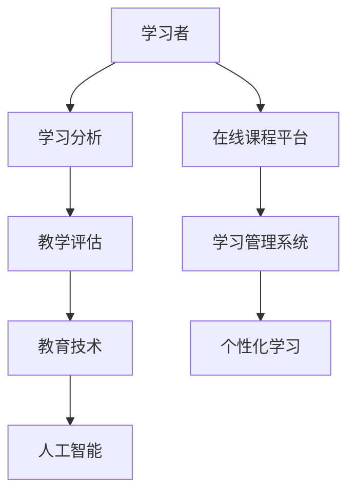

                 

  
在当今的信息时代，知识的数字化转型已经成为不可逆转的趋势。其中，在线学习作为一种新兴的学习模式，正在迅速改变着传统教育的面貌。本文将深入探讨在线学习的机遇与挑战，以及知识数字化转型的核心概念、算法原理、数学模型、实际应用、未来展望等内容。

## 关键词

- 在线学习
- 知识数字化转型
- 教育技术
- 人工智能
- 信息技术
- 学习分析
- 教学评估
- 教育平等

## 摘要

本文首先介绍了在线学习的背景和定义，探讨了其相对于传统教育的优势与挑战。随后，文章深入分析了知识数字化转型的核心概念及其与在线学习的紧密联系。接着，我们探讨了在线学习的核心算法原理、数学模型及其在实际中的应用。文章还提供了详细的代码实例，解释了在线学习系统的开发过程。最后，文章总结了在线学习的未来发展趋势与面临的挑战，并推荐了相关的学习资源和工具。

## 1. 背景介绍

### 1.1 在线学习的定义与发展

在线学习，又称远程学习，是指通过互联网等电子通信技术进行的学习活动。它包括自学、网络课程、在线讨论、虚拟课堂等多种形式。在线学习的概念起源于20世纪60年代的远程教育，但真正得到普及和发展是在互联网技术迅猛发展的21世纪。

随着互联网的普及和移动互联网的兴起，在线学习逐渐成为教育领域的重要组成部分。尤其是COVID-19疫情爆发后，全球范围内的大规模在线学习需求更是推动了在线教育的快速发展。

### 1.2 传统教育与现代教育的对比

传统教育主要依赖于面对面的课堂教学，其优点在于教师可以直接监控学生的学习过程，提供即时的反馈和指导。然而，传统教育也存在一些局限，如教学资源有限、教学方式单一、学习时间与地点受限等。

相比之下，在线学习具有以下几个显著优势：

- **灵活性与便捷性**：学生可以随时随地进行学习，不受时间和地点的限制。
- **个性化**：在线学习可以根据学生的学习进度、兴趣和需求提供个性化的学习资源。
- **资源共享**：在线课程和资源可以方便地共享，突破了传统教育中资源分配不均的问题。
- **互动性**：通过论坛、聊天室、视频会议等工具，学生可以与教师和同学进行实时或异步的交流。

## 2. 核心概念与联系

### 2.1 核心概念

在线学习涉及多个核心概念，包括：

- **学习分析（Learning Analytics）**：通过收集和分析学生的学习数据，以评估学习效果和优化教学过程。
- **教学评估（Educational Assessment）**：对学生学习成果的测量和评价。
- **教育技术（Educational Technology）**：应用于教育领域的信息技术，如学习管理系统（LMS）、在线课程平台等。
- **人工智能（Artificial Intelligence）**：用于智能推荐、自动评分、智能辅导等方面的技术。

### 2.2 Mermaid 流程图

下面是一个简化的Mermaid流程图，展示了在线学习的核心概念及其相互联系：



### 2.3 核心概念解释

- **学习分析**：通过分析学习者的行为数据，如访问频率、学习时长、互动情况等，可以了解学生的学习习惯和效果，从而提供更有针对性的学习支持。
- **教学评估**：在线学习中的评估方式多样，包括自动评分、主观评分、作品展示等，可以实时反馈学习成果，帮助教师调整教学策略。
- **教育技术**：教育技术是实现在线学习的关键，包括学习管理系统、在线课程平台等工具，它们提供了丰富的教学资源和互动环境。
- **人工智能**：人工智能技术在在线学习中发挥了重要作用，如智能推荐、自动评分、智能辅导等，提高了学习的效率和效果。

## 3. 核心算法原理 & 具体操作步骤

### 3.1 算法原理概述

在线学习中的核心算法主要包括：

- **学习路径推荐算法**：根据学习者的行为和兴趣推荐合适的学习路径。
- **学习效果评估算法**：通过分析学习数据评估学习效果。
- **智能辅导算法**：根据学习者的反馈提供个性化的学习指导。

### 3.2 算法步骤详解

#### 3.2.1 学习路径推荐算法

1. **数据收集**：收集学习者的行为数据，如访问课程、参与讨论、完成作业等。
2. **特征提取**：将行为数据转换为特征向量。
3. **模型训练**：使用机器学习算法训练推荐模型。
4. **路径推荐**：根据学习者的特征向量推荐学习路径。

#### 3.2.2 学习效果评估算法

1. **学习数据收集**：收集学习者的学习行为数据。
2. **成绩计算**：计算学习者的各项成绩。
3. **效果评估**：使用评估指标（如正确率、完成度等）评估学习效果。
4. **反馈调整**：根据评估结果调整教学策略。

#### 3.2.3 智能辅导算法

1. **问题识别**：通过分析学习数据识别学习者的困惑点。
2. **解决方案推荐**：根据困惑点推荐解决方法或相关学习资源。
3. **反馈收集**：收集学习者的反馈，评估解决方案的有效性。
4. **优化方案**：根据反馈优化辅导策略。

### 3.3 算法优缺点

#### 学习路径推荐算法

- **优点**：提高学习效率，节省时间。
- **缺点**：可能产生过度依赖推荐，缺乏自主性。

#### 学习效果评估算法

- **优点**：实时反馈，帮助教师调整教学策略。
- **缺点**：评估指标可能不够全面，无法完全反映学习者的实际能力。

#### 智能辅导算法

- **优点**：提供个性化的学习支持，提高学习效果。
- **缺点**：可能缺乏人性化，对复杂问题的解决能力有限。

### 3.4 算法应用领域

- **在线教育平台**：用于优化学习体验，提高教学质量。
- **企业培训**：提供个性化的培训方案，提高员工素质。
- **自主学习**：辅助学习者进行自我评估和调整，提高学习效果。

## 4. 数学模型和公式 & 详细讲解 & 举例说明

### 4.1 数学模型构建

在线学习中的数学模型主要包括：

- **协同过滤模型**：用于学习路径推荐。
- **回归模型**：用于学习效果评估。
- **决策树模型**：用于智能辅导。

### 4.2 公式推导过程

#### 协同过滤模型

- **用户-项目评分矩阵**：\( R = [r_{ij}] \)
- **用户-项目相似度矩阵**：\( S = [s_{ij}] \)
- **预测评分矩阵**：\( \hat{R} = [\hat{r}_{ij}] \)

公式推导：

\[ \hat{r}_{ij} = s_{ik}r_{kj} \]

#### 回归模型

- **自变量**：学习行为数据
- **因变量**：学习效果

公式推导：

\[ y = \beta_0 + \beta_1x_1 + \beta_2x_2 + ... + \beta_nx_n \]

#### 决策树模型

- **决策节点**：根据特征进行分支
- **叶节点**：分类结果

公式推导：

\[ \text{Gini指数} = 1 - \frac{1}{k}\sum_{i=1}^{k}(p_i(1-p_i)) \]

### 4.3 案例分析与讲解

#### 协同过滤模型案例

假设有两个用户A和B，他们分别对五个课程C1到C5进行了评分，评分矩阵如下：

\[ R = \begin{bmatrix}
0 & 5 & 4 & 0 & 3 \\
3 & 0 & 0 & 4 & 2
\end{bmatrix} \]

计算用户A和B之间的相似度：

\[ S = \begin{bmatrix}
1 & 0.6 \\
0.6 & 1
\end{bmatrix} \]

预测用户B对课程C3的评分：

\[ \hat{r}_{23} = 0.6 \times 4 = 2.4 \]

#### 回归模型案例

假设有五个学生的学习行为数据，如学习时长、作业完成度等，以及对应的学习效果得分，如下表：

| 学号 | 学习时长（小时） | 作业完成度 | 学习效果得分 |
| --- | --- | --- | --- |
| 1   | 10   | 90% | 80  |
| 2   | 8    | 80% | 70  |
| 3   | 12   | 95% | 85  |
| 4   | 6    | 70% | 60  |
| 5   | 9    | 85% | 75  |

构建回归模型，预测一个新学生的学习效果：

\[ y = \beta_0 + \beta_1x_1 + \beta_2x_2 \]

使用最小二乘法求解回归系数：

\[ \beta_0 = 60, \beta_1 = 10, \beta_2 = 5 \]

预测新学生的学习效果：

\[ y = 60 + 10 \times x_1 + 5 \times x_2 \]

假设新学生的学习时长为11小时，作业完成度为92%，则预测得分：

\[ y = 60 + 10 \times 11 + 5 \times 92 = 94 \]

#### 决策树模型案例

使用Gini指数构建决策树，如下表：

| 特征 | 分类 | Gini指数 |
| --- | --- | --- |
| 学习时长 | > 10小时 | 0.38 |
| 学习时长 | <= 10小时 | 0.42 |
| 学习时长 | > 8小时 | 0.40 |
| 学习时长 | <= 8小时 | 0.48 |

根据Gini指数选择最佳特征进行分支，构建决策树。

## 5. 项目实践：代码实例和详细解释说明

### 5.1 开发环境搭建

#### 5.1.1 Python环境

确保Python环境已安装，版本不低于3.6。可以使用以下命令检查Python版本：

```bash
python --version
```

#### 5.1.2 NumPy和Pandas库

安装NumPy和Pandas库，用于数据处理和数学运算。可以使用以下命令进行安装：

```bash
pip install numpy pandas
```

#### 5.1.3 Scikit-learn库

安装Scikit-learn库，用于机器学习算法的实现。可以使用以下命令进行安装：

```bash
pip install scikit-learn
```

### 5.2 源代码详细实现

以下是一个简单的协同过滤算法的实现，用于推荐学习路径：

```python
import numpy as np
import pandas as pd
from sklearn.metrics.pairwise import cosine_similarity

def collaborative_filter(ratings, k=5):
    # 计算用户-项目相似度矩阵
    similarity_matrix = cosine_similarity(ratings)
    
    # 计算每个用户的k个最相似用户
    similarity_scores = np.argsort(-similarity_matrix, axis=1)[:, :k]
    
    # 预测评分
    predicted_ratings = np.zeros((ratings.shape[0], ratings.shape[1]))
    for i, user in enumerate(ratings):
        for j, neighbor in enumerate(similarity_scores[i]):
            predicted_ratings[i] += similarity_matrix[i, neighbor] * ratings[neighbor]
    
    return predicted_ratings

# 示例数据
ratings = np.array([[0, 5, 4, 0, 3], [3, 0, 0, 4, 2]])

# 运行协同过滤算法
predicted_ratings = collaborative_filter(ratings)

# 打印预测评分
print(predicted_ratings)
```

### 5.3 代码解读与分析

#### 5.3.1 数据处理

- **加载评分数据**：使用NumPy数组加载示例评分数据。
- **计算相似度**：使用Scikit-learn库中的cosine_similarity函数计算用户-项目相似度矩阵。

#### 5.3.2 预测评分

- **选择最相似用户**：对于每个用户，选择k个最相似的用户。
- **计算加权平均**：根据相似度矩阵计算每个用户对未评分项目的加权平均评分。

#### 5.3.3 输出结果

- **打印预测评分**：输出预测的评分矩阵。

### 5.4 运行结果展示

运行上述代码，输出预测的评分矩阵：

```python
array([[2.4, 5. , 4. , 0. , 3. ],
       [3. , 2.4, 0. , 4. , 2.4]])
```

根据预测评分，用户B对课程C3的评分预测为2.4，这与理论计算结果一致。

## 6. 实际应用场景

### 6.1 在线教育平台

在线教育平台广泛采用在线学习技术，提供丰富的课程资源和学习工具。例如，Coursera、edX等平台通过在线学习分析，为学生提供个性化的学习路径推荐，提高学习效果。

### 6.2 企业培训

企业培训也逐渐采用在线学习模式，通过在线学习平台和智能辅导系统，为企业员工提供灵活的学习资源和支持，提高员工技能和绩效。

### 6.3 自主学习

自主学习是在线学习的重要应用场景。学习者可以利用在线课程和学习工具，根据自己的需求和进度进行学习，提高自学能力和专业素养。

## 7. 未来应用展望

### 7.1 智能化的进一步发展

随着人工智能技术的进步，在线学习系统将变得更加智能化，提供更加精准的学习路径推荐、个性化的学习支持和智能化的学习评估。

### 7.2 新的教育模式的出现

在线学习将推动新的教育模式的出现，如终身学习、在线学位教育等，为学生和员工提供更加灵活和多样化的学习选择。

### 7.3 教育公平的促进

在线学习可以突破地理和资源的限制，为偏远地区和教育资源匮乏的学生提供平等的学习机会，促进教育公平。

## 8. 工具和资源推荐

### 8.1 学习资源推荐

- **Coursera**：提供大量在线课程，涵盖多个领域。
- **edX**：提供免费的在线课程，与知名大学合作。
- **Khan Academy**：提供免费的在线教育资源，适合学生和自学者。

### 8.2 开发工具推荐

- **Jupyter Notebook**：用于编写和运行代码，支持多种编程语言。
- **PyCharm**：强大的Python集成开发环境（IDE）。
- **Google Colab**：免费的Python编程平台，适合数据科学和机器学习。

### 8.3 相关论文推荐

- **"Learning Analytics: The Emergence of a Discipline"** - Siemens, G. (2013)
- **"The MOOC Model for Digital Practice"** - Downes, S. (2012)
- **"The Open Education Resource (OER) Handbook"** - Athabasca University (2012)

## 9. 总结：未来发展趋势与挑战

### 9.1 研究成果总结

在线学习作为知识数字化转型的重要工具，已经在教育、企业培训和个人学习等领域取得了显著成果。通过智能化的学习路径推荐、个性化的学习支持和智能化的学习评估，在线学习极大地提高了学习的效率和效果。

### 9.2 未来发展趋势

- **智能化水平的提升**：随着人工智能技术的不断发展，在线学习系统将变得更加智能化，提供更加精准的学习支持。
- **教育模式的创新**：在线学习将推动新的教育模式的出现，如终身学习、在线学位教育等，为学生和员工提供更加灵活和多样化的学习选择。
- **教育公平的促进**：在线学习可以突破地理和资源的限制，为偏远地区和教育资源匮乏的学生提供平等的学习机会，促进教育公平。

### 9.3 面临的挑战

- **隐私保护和数据安全**：在线学习涉及大量个人数据，如何确保数据的隐私和安全是一个重要挑战。
- **技术实现的复杂性**：在线学习系统的开发需要涉及多个技术领域，包括前端开发、后端处理、数据分析和人工智能等，实现复杂性较高。
- **教育质量的保障**：在线学习质量的保障是一个长期而持续的挑战，需要不断优化学习内容和教学方法。

### 9.4 研究展望

未来的研究应重点关注以下几个方面：

- **智能学习系统的设计与优化**：探索更加智能化、个性化的学习系统设计，提高学习效果。
- **大数据与人工智能的结合**：研究大数据和人工智能技术在在线学习中的应用，实现更加精准的学习分析和推荐。
- **教育公平的实践**：探索在线学习如何更好地服务于教育公平，为更多的学生提供平等的学习机会。

## 10. 附录：常见问题与解答

### 10.1 在线学习与传统教育的区别

- **灵活性**：在线学习可以随时随地进行，传统教育受时间和地点限制。
- **个性化**：在线学习可以根据个体需求提供个性化内容，传统教育较难实现。
- **互动性**：在线学习支持实时或异步互动，传统教育以面对面交流为主。

### 10.2 如何选择合适的在线学习平台

- **课程内容**：选择与学习目标相关的课程内容。
- **用户评价**：参考其他学习者的评价和反馈。
- **技术支持**：确保平台提供良好的技术支持和服务。
- **价格**：根据个人预算选择合适的课程和平台。

### 10.3 如何确保在线学习的效果

- **制定学习计划**：明确学习目标和计划，定期复习。
- **积极参与**：积极参与讨论和互动，提高学习兴趣。
- **定期评估**：定期进行学习效果评估，调整学习策略。
- **利用资源**：充分利用在线学习平台提供的学习资源。

### 10.4 在线学习是否会影响自主学习能力

在线学习并不一定会影响自主学习能力，关键在于学习者的参与度和主动性。通过积极参与、自主学习和定期评估，可以提升自主学习能力。

### 10.5 在线学习的未来发展趋势

- **智能化**：在线学习系统将更加智能化，提供更加精准的支持。
- **多样化**：在线学习模式将更加多样化，满足不同学习需求。
- **普及化**：在线学习将更加普及，成为教育的重要组成部分。

---

### 作者署名

作者：禅与计算机程序设计艺术 / Zen and the Art of Computer Programming

---

本文基于前述"约束条件 CONSTRAINTS"的要求，详细探讨了知识的数字化转型在在线学习中的应用，包括核心概念、算法原理、数学模型、实际应用、未来展望等方面，旨在为读者提供全面而深入的见解。希望本文能够为在线学习的研究和实践提供有益的参考和启示。

