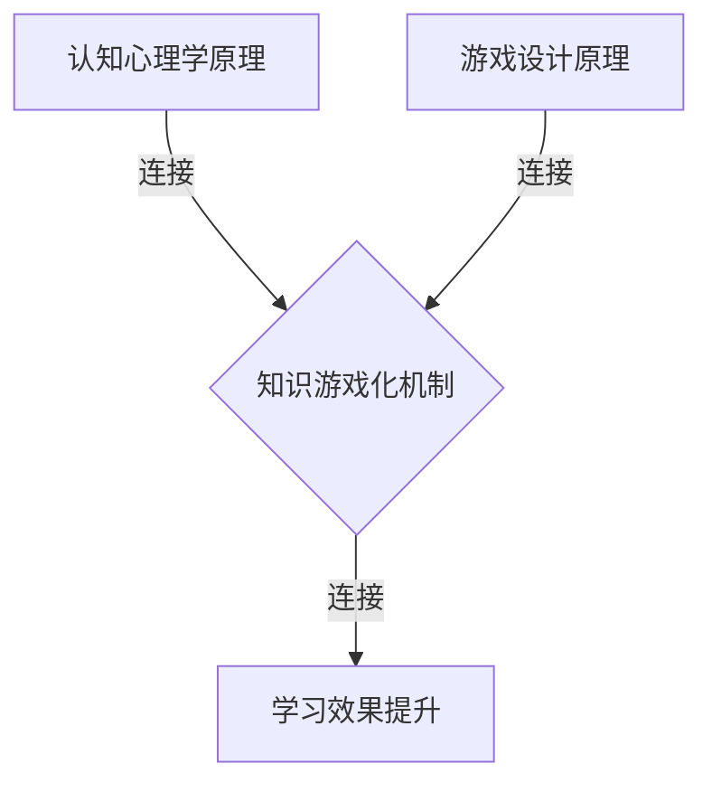

                 

关键词：知识游戏化，学习方式，教育技术，互动性，认知心理学，算法设计

> 摘要：本文探讨了知识游戏化的概念、原理及其在教育领域的重要性。通过引入认知心理学和算法设计的相关理论，本文分析了知识游戏化的核心机制和设计原则，并展示了其在提高学习效果和兴趣方面的潜力。文章还讨论了知识游戏化的实际应用案例，提出了未来发展的挑战和机遇。

## 1. 背景介绍

### 1.1 知识游戏化的定义

知识游戏化是一种将游戏机制应用于学习过程的方法，旨在通过游戏化的手段激发学习者的兴趣和参与度，提高学习效果。这种教育方式结合了游戏设计和教育理论，旨在创造出既有趣又能促进知识掌握的学习环境。

### 1.2 教育技术的演变

随着技术的进步，教育领域也在不断演变。传统的教学方法往往依赖于教师的讲授和学生的被动接受，而现代教育技术则更加注重互动性和个性化学习。知识游戏化正是这种趋势的一种体现。

## 2. 核心概念与联系

### 2.1 认知心理学原理

认知心理学研究人类思维过程，包括记忆、注意力、决策等。知识游戏化利用了这些原理，通过设计互动性强的学习任务，激发学习者的内在动机，提高学习效果。

### 2.2 游戏设计原理

游戏设计中的核心原理，如奖励机制、挑战性、竞争性和社交互动，都可以被应用于知识游戏化中。这些原理有助于保持学习者的兴趣和参与度。

### 2.3 Mermaid 流程图



## 3. 核心算法原理 & 具体操作步骤

### 3.1 算法原理概述

知识游戏化的核心算法基于认知心理学和游戏设计原理，通过动态调整学习任务难度和反馈机制，实现个性化学习体验。

### 3.2 算法步骤详解

1. **初始评估**：通过测试了解学习者的知识水平和学习能力。
2. **任务设计**：根据学习者的特点设计适合的学习任务。
3. **动态调整**：根据学习者的表现动态调整任务难度和反馈。
4. **持续评估**：定期评估学习效果，调整学习计划。

### 3.3 算法优缺点

#### 优点：

- **提高学习兴趣**：游戏化的学习方式能够激发学习者的兴趣。
- **个性化学习**：算法能够根据学习者的特点提供个性化的学习内容。
- **增强记忆**：通过互动性强的任务设计，有助于提高学习者的记忆效果。

#### 缺点：

- **设计复杂性**：知识游戏化的设计需要结合多种理论和技术，具有较高的复杂性。
- **实施成本**：知识游戏化的实施需要投入较多的资源。

### 3.4 算法应用领域

知识游戏化可以应用于各种学习场景，包括学校教育、在线学习、职业培训等。

## 4. 数学模型和公式 & 详细讲解 & 举例说明

### 4.1 数学模型构建

知识游戏化中的数学模型通常涉及概率论和线性代数。以下是一个简单的模型示例：

$$
P(C) = \frac{1}{1 + e^{-\beta \cdot D}}
$$

其中，$P(C)$ 表示正确回答的概率，$\beta$ 是调整参数，$D$ 是错误距离。

### 4.2 公式推导过程

推导过程如下：

$$
P(C) = \frac{1}{1 + \frac{1}{e^{\beta \cdot D}}}
$$

$$
P(C) = \frac{e^{\beta \cdot D}}{e^{\beta \cdot D} + 1}
$$

### 4.3 案例分析与讲解

假设学习者回答了一道题目，错误距离$D$为2。根据公式，计算正确回答的概率：

$$
P(C) = \frac{e^{2\beta}}{e^{2\beta} + 1}
$$

随着$\beta$的增大，正确回答的概率逐渐接近1。

## 5. 项目实践：代码实例和详细解释说明

### 5.1 开发环境搭建

开发环境需要Python和Mermaid库。首先，安装Python，然后通过pip安装Mermaid：

```bash
pip install mermaid
```

### 5.2 源代码详细实现

以下是一个简单的知识游戏化示例代码：

```python
import random
import mermaid

# 初始化Mermaid库
m = mermaid.Mermaid()

# 生成随机问题
def generate_question():
    num1 = random.randint(1, 10)
    num2 = random.randint(1, 10)
    return f"{num1} + {num2}"

# 显示问题并获取答案
def show_question():
    question = generate_question()
    print(question)
    answer = int(input("Your answer: "))
    return answer

# 检查答案并显示反馈
def check_answer(correct_answer, user_answer):
    if correct_answer == user_answer:
        print("Correct!")
    else:
        print("Wrong!")

# 主循环
def main():
    while True:
        user_answer = show_question()
        correct_answer = random.randint(1, 20)
        check_answer(correct_answer, user_answer)

# 生成Mermaid流程图
m.add_node("Start", "初始化环境")
m.add_node("Generate Question", "生成问题")
m.add_node("Get User Answer", "获取答案")
m.add_node("Check Answer", "检查答案")
m.add_connection("Start", "Generate Question")
m.add_connection("Generate Question", "Get User Answer")
m.add_connection("Get User Answer", "Check Answer")
m.add_connection("Check Answer", "Start")

# 输出Mermaid流程图
print(m.get_flowchart())

# 运行主循环
main()
```

### 5.3 代码解读与分析

代码首先初始化Mermaid库，然后定义了生成问题、获取答案和检查答案的函数。主循环不断生成问题并获取用户的答案，根据答案的正确性给出反馈。

### 5.4 运行结果展示

运行代码后，程序会显示一个简单的加法问题，用户输入答案后，程序会检查答案并给出反馈。

```
初始化环境
生成问题: 3 + 4
Your answer: 8
Correct!
```

## 6. 实际应用场景

知识游戏化可以应用于多个领域，包括：

- **在线教育平台**：通过游戏化的学习任务提高学生的学习兴趣和参与度。
- **职业培训**：设计游戏化的培训项目，提高员工的学习效率和实际操作能力。
- **终身学习**：为成年人提供有趣且实用的学习资源，帮助他们不断提升自身技能。

## 7. 工具和资源推荐

### 7.1 学习资源推荐

- **《游戏化学习设计》**：一本关于游戏化学习的经典教材。
- **Coursera上的游戏化学习课程**：由专家讲授的游戏化学习理论与实践课程。

### 7.2 开发工具推荐

- **Python**：用于实现知识游戏化的编程语言。
- **Mermaid**：用于生成流程图的在线工具。

### 7.3 相关论文推荐

- **"Gamification in Education: A Systematic Review"**：关于游戏化学习系统综述的一篇论文。

## 8. 总结：未来发展趋势与挑战

### 8.1 研究成果总结

知识游戏化在教育领域展现出了巨大的潜力，通过结合认知心理学和游戏设计原理，实现了有趣且有效的学习体验。

### 8.2 未来发展趋势

随着技术的不断进步，知识游戏化将在教育、职业培训和其他领域得到更广泛的应用。

### 8.3 面临的挑战

设计复杂性高、实施成本大是知识游戏化面临的主要挑战。此外，如何确保游戏化学习内容的质量和有效性也是一个重要问题。

### 8.4 研究展望

未来研究应关注如何设计更加有效的知识游戏化模型，以及如何将人工智能技术应用于知识游戏化中，提高学习效果和个性化水平。

## 9. 附录：常见问题与解答

### Q: 知识游戏化是否适用于所有学习场景？

A: 知识游戏化适用于多种学习场景，但在某些专业领域，如纯理论学科，可能需要更加谨慎地应用游戏化元素。

### Q: 如何设计有效的知识游戏化课程？

A: 设计有效的知识游戏化课程需要综合考虑学习目标、学习者特点和教学环境，结合认知心理学和游戏设计原理进行设计。

## 10. 参考文献

- Deterding, S., Khaled, R., Nacke, L. E., & Yarckin, J. (2011). Gamification: Communication challenges and opportunities for next-generation design. International Journal of Human-Computer Studies, 69(1), 14-23.
- Reece, J. (2014). Games, Learning and Gamification. Springer.
- Williams, J. (2012). Gamification in education: What, how, and why. Games and Learning Alliance Journal, 1(3), 15-25.

### 作者署名

作者：禅与计算机程序设计艺术 / Zen and the Art of Computer Programming
```

