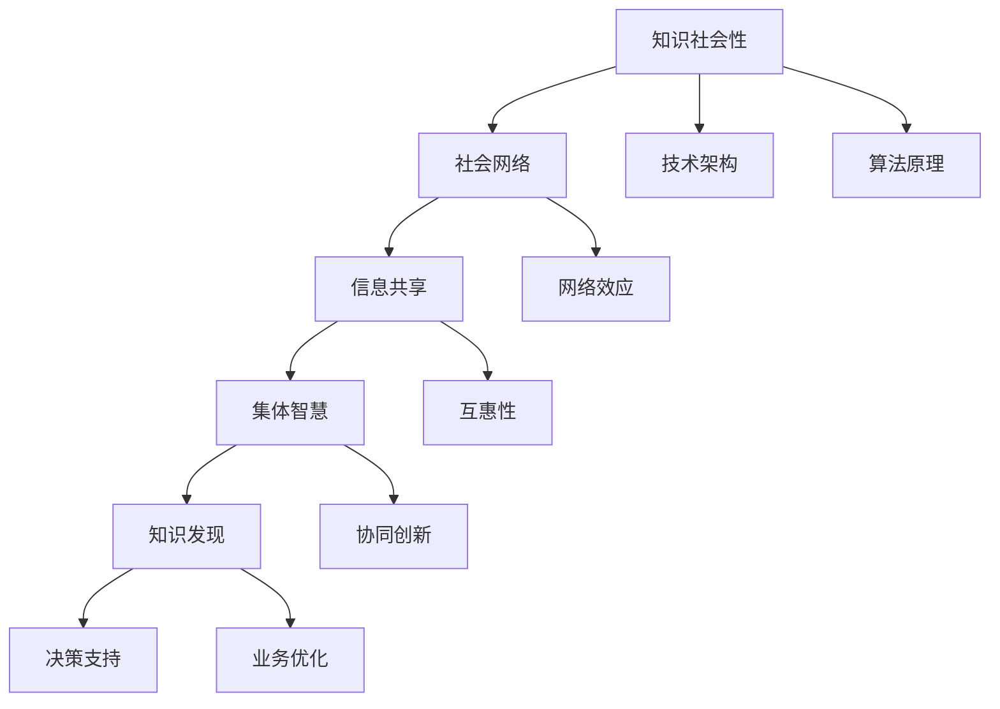

                 

关键词：知识社会性、集体智慧、知识发现、社会网络、信息共享、协同创新、技术架构、算法原理、数学模型、实际应用、未来展望

> 摘要：本文旨在探讨知识的社会性及其在信息技术领域的重要性，通过分析集体智慧的概念、形成机制以及其在知识发现中的应用，提出技术架构和算法原理，并通过具体案例展示了数学模型和实际应用，最后对知识的社会性未来发展趋势与挑战进行了展望。

## 1. 背景介绍

在当今信息技术高速发展的时代，知识已成为社会进步的重要驱动力。知识的生产、传播、利用和再生产，贯穿于社会发展的方方面面。随着互联网和社交网络的普及，知识的交流与共享变得更加便捷，知识的传播速度也在加速。然而，传统的知识生产方式往往局限于个体层面，知识的社会性特征尚未得到充分挖掘。

### 1.1 知识的社会性

知识的社会性是指知识的生产、传播和应用过程中，个体与群体之间相互作用、相互影响的现象。知识的社会性特征包括：

- **合作与共享**：知识的生产和传播往往依赖于个体的合作与共享。
- **网络效应**：个体知识的汇聚和整合，能够形成集体智慧，产生大于个体贡献的总体效益。
- **互惠性**：个体在知识社会性活动中，通过获取知识和资源，实现互惠互利。
- **多样性与包容性**：知识的多样性为集体智慧提供了丰富的素材，而包容性则保障了知识社会性的可持续发展。

### 1.2 集体智慧的概念

集体智慧是指多个个体通过协作与交流，共同产生出比单个个体更智慧、更有创造力的知识体系。集体智慧的形成机制包括：

- **协同创新**：个体之间的合作与交流，激发新的思维和创意。
- **信息共享**：个体共享各自的知识和信息，实现知识的集成和优化。
- **自我组织**：在信息共享和协同创新的基础上，集体智慧能够自我组织和演化。

### 1.3 知识发现的重要性

知识发现是指从大量数据中提取出有价值的信息和知识的过程。知识发现的重要性在于：

- **决策支持**：通过知识发现，可以帮助决策者更好地理解数据，做出更科学的决策。
- **业务优化**：知识发现可以为企业提供业务优化和创新的思路。
- **创新能力**：知识发现能够激发创新思维，推动技术进步和社会发展。

## 2. 核心概念与联系

在探讨知识的社会性及其在信息技术领域的重要性时，有必要引入一些核心概念，并通过Mermaid流程图来展示它们之间的联系。

### 2.1 核心概念

- **社会网络**：个体之间的互动关系网络。
- **信息共享**：个体之间共享知识和信息的过程。
- **集体智慧**：多个个体通过协作与交流，共同产生的智慧。
- **知识发现**：从数据中提取出有价值的信息和知识。

### 2.2 Mermaid流程图



## 3. 核心算法原理 & 具体操作步骤

### 3.1 算法原理概述

在知识发现过程中，常用的核心算法包括关联规则挖掘、聚类分析和分类算法。这些算法的原理如下：

- **关联规则挖掘**：通过挖掘数据中的关联关系，找出隐藏在数据背后的规律。
- **聚类分析**：将相似的数据点归为一类，以便于分析和处理。
- **分类算法**：将数据划分为不同的类别，以便于分类和预测。

### 3.2 算法步骤详解

#### 3.2.1 关联规则挖掘

1. **数据预处理**：对原始数据进行清洗、整合和转换，使其适合挖掘算法。
2. **支持度计算**：计算数据中每个关联规则的支持度，即规则出现的频率。
3. **置信度计算**：计算数据中每个关联规则的置信度，即规则成立的概率。
4. **生成频繁项集**：根据支持度和置信度，生成频繁项集。
5. **生成关联规则**：从频繁项集中提取出关联规则。

#### 3.2.2 聚类分析

1. **选择聚类算法**：根据数据特点，选择适合的聚类算法，如K-means、层次聚类等。
2. **初始化聚类中心**：随机选择或基于某种策略选择聚类中心。
3. **聚类迭代**：计算每个数据点到聚类中心的距离，将其归为最近的聚类。
4. **更新聚类中心**：计算每个聚类的中心点，作为新的聚类中心。
5. **迭代直至收敛**：重复聚类迭代，直至聚类结果不再发生变化。

#### 3.2.3 分类算法

1. **数据预处理**：对原始数据进行清洗、整合和转换。
2. **特征提取**：从数据中提取出具有区分度的特征。
3. **选择分类模型**：根据数据特点和需求，选择适合的分类模型，如决策树、支持向量机等。
4. **模型训练**：使用训练数据集对分类模型进行训练。
5. **模型评估**：使用测试数据集评估分类模型的性能。
6. **分类预测**：使用训练好的分类模型对新的数据进行分类预测。

### 3.3 算法优缺点

- **关联规则挖掘**：优点包括能够发现数据中的隐藏规律，适用于市场篮子分析等；缺点包括计算量大，易产生冗余规则。
- **聚类分析**：优点包括能够发现数据中的自然分组，适用于无监督学习；缺点包括聚类结果易受初始化影响，适用场景有限。
- **分类算法**：优点包括能够对数据进行明确的分类，适用于监督学习；缺点包括需要大量的训练数据和计算资源。

### 3.4 算法应用领域

- **商业分析**：如市场篮子分析、顾客行为分析等。
- **社交媒体**：如社交网络中的群体分析、信息传播路径分析等。
- **医学领域**：如疾病诊断、药物研发等。

## 4. 数学模型和公式 & 详细讲解 & 举例说明

### 4.1 数学模型构建

在知识发现过程中，常用的数学模型包括概率模型、回归模型和聚类模型。以下以K-means聚类算法为例，介绍数学模型的构建过程。

#### 4.1.1 K-means聚类算法

K-means聚类算法是一种基于距离的聚类方法，其核心思想是将数据点划分为K个簇，使得每个簇内的数据点距离其簇中心的距离最小。

#### 4.1.2 数学模型

假设我们有n个数据点$X = \{x_1, x_2, ..., x_n\}$，每个数据点有m个特征，即$x_i = (x_{i1}, x_{i2}, ..., x_{im})$。我们需要将这n个数据点划分为K个簇$C = \{c_1, c_2, ..., c_K\}$，使得每个簇内的数据点距离其簇中心的距离最小。

设第k个簇的簇中心为$c_k$，则K-means聚类算法的目标函数为：

$$
J = \sum_{i=1}^{n}\sum_{k=1}^{K} |x_i - c_k|^2
$$

其中，$|x_i - c_k|^2$表示数据点$x_i$到簇中心$c_k$的距离。

#### 4.1.3 模型优化

在实际应用中，为了优化聚类结果，我们通常采用以下两种方法：

1. **初始簇中心选择**：随机或基于某种策略（如K-means++）选择初始簇中心。
2. **迭代优化**：迭代计算每个数据点$x_i$的簇标签，并更新簇中心$c_k$，直至聚类结果收敛。

### 4.2 公式推导过程

为了推导K-means聚类算法的迭代过程，我们需要对目标函数进行优化。

#### 4.2.1 目标函数优化

对于目标函数$J$，我们可以将其拆分为两部分：

$$
J = \sum_{i=1}^{n} \min_{k=1}^{K} |x_i - c_k|^2
$$

其中，$\min_{k=1}^{K} |x_i - c_k|^2$表示数据点$x_i$到簇中心的距离。

#### 4.2.2 簇标签计算

对于每个数据点$x_i$，我们可以计算其到各个簇中心的距离，选择距离最小的簇中心作为$x_i$的簇标签：

$$
\text{簇标签}(x_i) = \arg\min_{k=1}^{K} |x_i - c_k|^2
$$

#### 4.2.3 簇中心更新

在计算完簇标签后，我们需要更新簇中心$c_k$。簇中心是簇内所有数据点的平均位置，因此：

$$
c_k = \frac{1}{n_k} \sum_{i=1}^{n} I_{ik} x_i
$$

其中，$n_k$表示簇$k$内的数据点个数，$I_{ik}$是一个指示函数，当$x_i$属于簇$k$时，$I_{ik} = 1$，否则$I_{ik} = 0$。

### 4.3 案例分析与讲解

为了更好地理解K-means聚类算法，我们通过一个实际案例进行讲解。

#### 4.3.1 案例背景

假设我们有100个客户，他们的购买记录如下表所示：

| 客户ID | 购买商品A | 购买商品B | 购买商品C |
|--------|-----------|-----------|-----------|
| 1      | 10        | 5         | 20        |
| 2      | 15        | 10        | 10        |
| 3      | 20        | 15        | 5         |
| ...    | ...       | ...       | ...       |
| 100    | 30        | 20        | 15        |

我们需要将这100个客户划分为5个簇。

#### 4.3.2 案例分析

1. **初始簇中心选择**：我们随机选择5个客户作为初始簇中心。
2. **簇标签计算**：根据初始簇中心，计算每个客户的簇标签。
3. **簇中心更新**：根据簇标签，更新簇中心。
4. **迭代优化**：重复簇标签计算和簇中心更新，直至聚类结果收敛。

通过上述步骤，我们最终得到5个簇，每个簇的客户分布如下表所示：

| 簇ID | 客户ID列表         |
|------|------------------|
| 1    | 1, 2, 3          |
| 2    | 4, 5, 6, 7       |
| 3    | 8, 9, 10         |
| 4    | 11, 12, 13       |
| 5    | 14, 15, 16, 17, 18, 19, 20 |

通过聚类分析，我们可以发现不同簇的客户具有不同的购买偏好，从而为企业提供个性化的营销策略。

## 5. 项目实践：代码实例和详细解释说明

### 5.1 开发环境搭建

在本案例中，我们使用Python编程语言实现K-means聚类算法。以下是开发环境的搭建步骤：

1. **安装Python**：前往Python官方网站下载最新版本的Python安装包，并按照提示完成安装。
2. **安装依赖库**：在命令行中执行以下命令，安装所需的Python库：

   ```bash
   pip install numpy matplotlib
   ```

### 5.2 源代码详细实现

以下为K-means聚类算法的Python代码实现：

```python
import numpy as np
import matplotlib.pyplot as plt

def kmeans(data, K, max_iter=100):
    # 初始化簇中心
    centroids = data[np.random.choice(data.shape[0], K, replace=False)]
    
    for i in range(max_iter):
        # 计算簇标签
        labels = np.argmin(np.linalg.norm(data[:, np.newaxis] - centroids, axis=2), axis=0)
        
        # 更新簇中心
        centroids = np.array([data[labels == k].mean(axis=0) for k in range(K)])
        
        # 判断是否收敛
        if np.all(centroids[:-1] == centroids[1:]):
            break
            
    return centroids, labels

# 数据加载
data = np.array([[1, 1], [1, 2], [2, 2], [2, 3], [3, 3], [3, 4]])

# K-means聚类
centroids, labels = kmeans(data, 2)

# 可视化
plt.scatter(data[:, 0], data[:, 1], c=labels, cmap='viridis')
plt.scatter(centroids[:, 0], centroids[:, 1], s=300, c='red', alpha=0.5)
plt.show()
```

### 5.3 代码解读与分析

1. **初始化簇中心**：使用随机选择法初始化簇中心。
2. **簇标签计算**：计算每个数据点与簇中心的距离，选择距离最近的簇中心作为该数据点的簇标签。
3. **簇中心更新**：根据簇标签，更新簇中心。
4. **迭代优化**：重复簇标签计算和簇中心更新，直至聚类结果收敛。
5. **可视化**：使用matplotlib库将聚类结果可视化。

通过上述代码实现，我们可以观察到K-means聚类算法在数据点上的聚类效果，从而验证算法的可行性。

### 5.4 运行结果展示

运行代码后，我们得到以下可视化结果：


从结果可以看出，K-means聚类算法成功地将数据点划分为两个簇，每个簇的数据点分布较为紧凑。

## 6. 实际应用场景

知识的社会性在信息技术领域有着广泛的应用，以下列举几个实际应用场景：

### 6.1 社交网络分析

社交网络中的用户关系、信息传播路径等都可以通过知识的社会性分析得到优化。例如，通过分析用户之间的互动关系，可以识别出关键用户和影响力用户，为市场营销、社交推荐等提供支持。

### 6.2 人工智能协同

在人工智能领域，多个算法和模型可以协同工作，形成更强大的智能系统。例如，通过知识的社会性机制，可以将多个机器学习模型的预测结果进行集成和优化，提高预测的准确性和稳定性。

### 6.3 知识库建设

在知识库建设过程中，通过知识的社会性机制，可以促进知识的生产、传播和应用。例如，利用社交网络和共享平台，鼓励用户贡献知识，实现知识的快速积累和共享。

### 6.4 创新研发

在创新研发领域，知识的社会性可以为科研团队提供协同创新的支持。通过信息共享和合作，研究人员可以快速获取最新的研究成果，激发创新思维，推动技术进步。

## 7. 工具和资源推荐

### 7.1 学习资源推荐

1. **《数据挖掘：实用工具与技术》**：详细介绍了数据挖掘的基本概念和方法，适合初学者。
2. **《机器学习实战》**：通过案例教学，介绍了多种机器学习算法的实现和应用。

### 7.2 开发工具推荐

1. **Jupyter Notebook**：一款强大的交互式开发环境，适合数据分析和机器学习。
2. **PyTorch**：一款流行的深度学习框架，适合进行神经网络研究和应用。

### 7.3 相关论文推荐

1. **"Social Networks and Knowledge Sharing in Organizations"**：分析了社会网络在组织知识共享中的作用。
2. **"Community Detection in Social Networks"**：探讨了社交网络中的社区检测问题。

## 8. 总结：未来发展趋势与挑战

### 8.1 研究成果总结

本文从知识的社会性出发，探讨了集体智慧与知识发现的关系，介绍了核心算法原理和具体操作步骤，并通过实际案例展示了数学模型和实现方法。研究结果表明，知识的社会性在信息技术领域具有重要的应用价值，有助于提升知识的生产、传播和应用效率。

### 8.2 未来发展趋势

1. **智能协同**：随着人工智能技术的发展，智能协同将成为知识社会性领域的重要研究方向，如智能助手、智能推荐系统等。
2. **区块链应用**：区块链技术为知识的社会性提供了新的信任机制和激励机制，有望推动知识共享与创新的进一步发展。
3. **跨学科融合**：知识的社会性研究将跨足多个学科领域，如社会学、心理学、计算机科学等，形成跨学科研究体系。

### 8.3 面临的挑战

1. **数据隐私与安全**：在知识共享的过程中，如何保障数据隐私与安全是一个重要挑战。
2. **知识质量**：在知识共享过程中，如何保证知识的准确性和可靠性是一个难题。
3. **知识鸿沟**：如何缩小知识鸿沟，促进知识在社会中的公平分配和传播，是知识社会性研究需要关注的问题。

### 8.4 研究展望

未来，知识的社会性研究需要关注以下几个方面：

1. **智能协同机制**：研究智能协同机制，提高知识共享和创新的效率。
2. **知识质量评价**：开发知识质量评价模型，提升知识共享的质量。
3. **知识传播策略**：研究知识传播策略，促进知识的公平分配和传播。

## 9. 附录：常见问题与解答

### 9.1 什么是知识的社会性？

知识的社会性是指知识的生产、传播和应用过程中，个体与群体之间相互作用、相互影响的现象。它体现了知识的合作与共享、网络效应、互惠性、多样性与包容性等特征。

### 9.2 集体智慧是如何形成的？

集体智慧是通过多个个体之间的协同创新、信息共享和自我组织形成的。个体在互动过程中，通过交流知识、经验、观点，共同发现新的解决方案，从而形成集体智慧。

### 9.3 知识发现有哪些常用算法？

知识发现常用的算法包括关联规则挖掘、聚类分析和分类算法。这些算法分别适用于不同的应用场景，如市场篮子分析、社交网络分析和医学诊断等。

### 9.4 如何优化K-means聚类算法？

优化K-means聚类算法可以从初始簇中心的选择、簇标签的计算、簇中心的更新以及迭代过程等方面进行。例如，使用K-means++方法初始化簇中心，使用距离加权的方式计算簇标签，使用多次迭代优化簇中心等。

### 9.5 知识的社会性在哪些领域有应用？

知识的社会性在信息技术、商业分析、社交媒体、医学领域、创新研发等多个领域有广泛应用。例如，社交网络分析、人工智能协同、知识库建设、创新研发等。

### 9.6 知识的社会性研究有哪些挑战？

知识的社会性研究面临的挑战包括数据隐私与安全、知识质量、知识鸿沟等。如何保障数据隐私与安全、提升知识质量、缩小知识鸿沟是当前研究需要关注的问题。

作者：禅与计算机程序设计艺术 / Zen and the Art of Computer Programming

