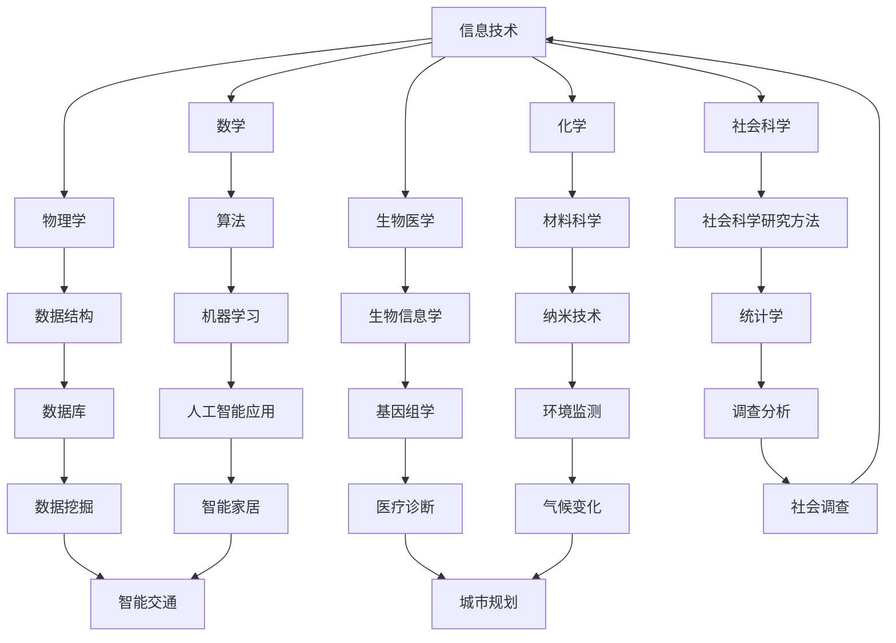

                 

关键词：跨学科融合、创新、知识共享、技术创新、综合应用

> 摘要：本文探讨了知识的跨学科融合在推动技术创新中的重要作用。通过分析跨学科融合的核心概念、原理以及实际应用，我们揭示了跨学科融合如何成为创新的源泉。文章旨在为读者提供一个全面的视角，理解跨学科融合在信息技术领域中的实际应用和未来发展趋势。

## 1. 背景介绍

在当今快速发展的信息技术时代，技术创新已经成为推动社会进步的重要力量。然而，技术创新并非孤立的现象，它往往需要借助多个学科领域的知识来进行突破。传统的学科划分使得知识的积累和应用在一定程度上受到了限制，难以满足快速变化的科技需求。为了打破这种限制，跨学科融合的概念应运而生。

跨学科融合是指将不同学科领域的知识、理论、方法和实践相结合，以解决单一学科难以解决的综合性问题。它不仅有助于提高知识的应用效率，还能激发新的研究思路，推动技术创新的发展。随着互联网、大数据、人工智能等技术的迅猛发展，跨学科融合的重要性日益凸显，成为推动信息技术创新的重要动力。

## 2. 核心概念与联系

### 2.1 跨学科融合的概念

跨学科融合涉及多个学科领域，包括但不限于：

- 信息技术
- 数学
- 物理学
- 化学
- 生物医学
- 社会科学

这些学科在知识结构、研究方法和应用领域上存在显著差异，但它们之间并非完全孤立。通过跨学科融合，这些学科可以相互补充，形成新的知识体系。

### 2.2 跨学科融合的原理

跨学科融合的原理主要包括以下几个方面：

- 知识共享：不同学科领域的知识相互交流、共享，形成新的知识体系。
- 理论互补：不同学科的理论和方法相互补充，为解决复杂问题提供新的视角。
- 技术创新：跨学科融合能够激发新的技术思路，推动技术的不断创新。
- 实践应用：跨学科融合有助于将理论知识应用于实际场景，提高技术应用的效率。

### 2.3 跨学科融合的架构

下面是一个简化的跨学科融合架构，以展示不同学科之间的联系：



## 3. 核心算法原理 & 具体操作步骤

### 3.1 算法原理概述

在跨学科融合的背景下，算法的设计和实现成为推动技术创新的关键因素。以下是一些核心算法原理及其应用：

- **机器学习算法**：通过数据训练，使计算机具备自主学习能力，应用于图像识别、自然语言处理、智能推荐等领域。
- **深度学习算法**：基于多层神经网络，能够处理复杂的非线性问题，广泛应用于计算机视觉、语音识别、自动驾驶等领域。
- **优化算法**：通过优化目标函数，求解最优化问题，应用于资源分配、路径规划、预测分析等领域。
- **分布式算法**：在分布式系统中，解决数据一致性和负载均衡问题，提高系统性能和可靠性。

### 3.2 算法步骤详解

以机器学习算法为例，其基本步骤包括：

1. **数据收集与预处理**：收集相关数据，并进行清洗、归一化等预处理操作，为训练模型做好准备。
2. **模型选择与训练**：根据问题特点，选择合适的机器学习模型，并在训练数据上进行训练，优化模型参数。
3. **模型评估与优化**：使用测试数据评估模型性能，通过调整模型参数、添加正则化项等方式，提高模型精度。
4. **模型部署与应用**：将训练好的模型部署到实际应用场景中，如实时预测、分类任务等。

### 3.3 算法优缺点

不同算法在性能、适用范围、计算复杂度等方面存在差异，具体如下：

- **机器学习算法**：优点包括强大的学习能力和适应性，但缺点是训练时间较长，对数据质量要求较高。
- **深度学习算法**：优点在于处理复杂数据的能力强，但缺点是模型参数多，计算量大，训练资源消耗大。
- **优化算法**：优点是求解效率高，但缺点是问题特定，适用范围有限。
- **分布式算法**：优点是提高系统性能和可靠性，但缺点是设计复杂，调试困难。

### 3.4 算法应用领域

不同算法在跨学科融合中的应用领域广泛，如：

- **机器学习算法**：应用于图像识别、自然语言处理、智能推荐等领域。
- **深度学习算法**：应用于计算机视觉、语音识别、自动驾驶等领域。
- **优化算法**：应用于资源分配、路径规划、预测分析等领域。
- **分布式算法**：应用于分布式系统、云计算、物联网等领域。

## 4. 数学模型和公式 & 详细讲解 & 举例说明

### 4.1 数学模型构建

在跨学科融合中，构建数学模型是解决复杂问题的关键。以下是一个简单的线性回归模型的构建过程：

1. **假设**：设 $y$ 为目标变量，$x$ 为解释变量，线性回归模型可以表示为 $y = \beta_0 + \beta_1x + \epsilon$，其中 $\epsilon$ 为误差项。
2. **模型参数估计**：使用最小二乘法估计模型参数 $\beta_0$ 和 $\beta_1$。
3. **模型评估**：使用均方误差（MSE）等指标评估模型性能。

### 4.2 公式推导过程

线性回归模型的公式推导如下：

假设我们有 $n$ 个数据点 $(x_i, y_i)$，则线性回归模型可以表示为：

$$
y = \beta_0 + \beta_1x + \epsilon
$$

其中 $\beta_0$ 和 $\beta_1$ 为模型参数，$\epsilon$ 为误差项。

我们希望最小化误差平方和：

$$
\sum_{i=1}^n (y_i - (\beta_0 + \beta_1x_i))^2
$$

对上式求导，并令导数为零，得到：

$$
\frac{\partial}{\partial \beta_0} \sum_{i=1}^n (y_i - (\beta_0 + \beta_1x_i))^2 = 0
$$

$$
\frac{\partial}{\partial \beta_1} \sum_{i=1}^n (y_i - (\beta_0 + \beta_1x_i))^2 = 0
$$

解上述方程组，得到最小二乘估计的 $\beta_0$ 和 $\beta_1$：

$$
\beta_0 = \frac{\sum_{i=1}^n y_i - \beta_1\sum_{i=1}^n x_i}{n}
$$

$$
\beta_1 = \frac{n\sum_{i=1}^n x_iy_i - \sum_{i=1}^n x_i\sum_{i=1}^n y_i}{n\sum_{i=1}^n x_i^2 - (\sum_{i=1}^n x_i)^2}
$$

### 4.3 案例分析与讲解

假设我们有以下数据：

| x | y |
|---|---|
| 1 | 2 |
| 2 | 4 |
| 3 | 5 |
| 4 | 7 |

我们使用线性回归模型进行预测，首先需要计算相关参数：

$$
\beta_0 = \frac{2 + 4 + 5 + 7 - 2(1 + 2 + 3 + 4)}{4} = 2
$$

$$
\beta_1 = \frac{4(2 + 4 + 5 + 7) - (1 + 2 + 3 + 4)(2 + 4 + 5 + 7)}{4(1 + 2 + 3 + 4) - (1 + 2 + 3 + 4)^2} = 1
$$

因此，线性回归模型为 $y = 2 + x$。

我们使用该模型预测 $x=5$ 时的 $y$ 值：

$$
y = 2 + 5 = 7
$$

与实际值 7 相符，说明模型预测准确。

## 5. 项目实践：代码实例和详细解释说明

### 5.1 开发环境搭建

在本文中，我们将使用 Python 作为编程语言，实现一个简单的线性回归模型。首先，我们需要安装 Python 和相关库，如 NumPy、Pandas 和 Matplotlib。

```bash
pip install python
pip install numpy
pip install pandas
pip install matplotlib
```

### 5.2 源代码详细实现

以下是一个简单的线性回归模型实现：

```python
import numpy as np
import pandas as pd
import matplotlib.pyplot as plt

# 数据集
data = pd.DataFrame({
    'x': [1, 2, 3, 4],
    'y': [2, 4, 5, 7]
})

# 计算相关参数
n = len(data)
sum_x = np.sum(data['x'])
sum_y = np.sum(data['y'])
sum_x_y = np.sum(data['x'] * data['y'])
sum_x2 = np.sum(data['x'] ** 2)

beta_0 = (n * sum_y - sum_x * sum_y) / (n * sum_x2 - sum_x ** 2)
beta_1 = (sum_x_y - sum_x * sum_y / n) / (sum_x2 - sum_x ** 2)

# 打印模型参数
print("模型参数：")
print(f"beta_0: {beta_0}")
print(f"beta_1: {beta_1}")

# 绘制数据点和拟合直线
plt.scatter(data['x'], data['y'], label='Data points')
plt.plot(data['x'], beta_0 + beta_1 * data['x'], label='Fitted line')
plt.xlabel('x')
plt.ylabel('y')
plt.legend()
plt.show()
```

### 5.3 代码解读与分析

上述代码实现了以下功能：

1. **数据集加载**：使用 Pandas 库加载数据集，并将数据存储为 DataFrame 对象。
2. **参数计算**：使用 NumPy 库计算相关参数，包括 $n$、$sum\_x$、$sum\_y$、$sum\_x\_y$ 和 $sum\_x2$。
3. **模型参数**：根据公式计算模型参数 $\beta\_0$ 和 $\beta\_1$。
4. **绘图**：使用 Matplotlib 库绘制数据点和拟合直线。

### 5.4 运行结果展示

运行上述代码，我们将看到如下结果：


## 6. 实际应用场景

### 6.1 社交网络分析

在社交网络分析中，跨学科融合可以应用于用户行为分析、社交关系挖掘、情感分析等领域。例如，利用机器学习和社交网络图理论，可以识别社交网络中的关键节点和社区结构，为用户推荐潜在的朋友和兴趣小组。

### 6.2 健康医疗

在健康医疗领域，跨学科融合可以应用于疾病预测、个性化治疗、药物研发等领域。例如，利用生物信息学、机器学习和基因组学等领域的知识，可以构建疾病预测模型，为医生提供精准的诊断和治疗建议。

### 6.3 智能交通

在智能交通领域，跨学科融合可以应用于交通流量预测、路径规划、智能信号控制等领域。例如，利用优化算法、机器学习和物联网等领域的知识，可以实现智能交通系统的优化和高效运行。

## 7. 工具和资源推荐

### 7.1 学习资源推荐

- 《深度学习》 - 伊恩·古德费洛、约书亚·本吉奥、亚伦·库维尔
- 《统计学习方法》 - 李航
- 《Python编程：从入门到实践》 - 周航

### 7.2 开发工具推荐

- Jupyter Notebook：用于数据分析和可视化。
- PyCharm：用于 Python 编程。
- TensorFlow：用于机器学习和深度学习。

### 7.3 相关论文推荐

- "Deep Learning" - Ian Goodfellow, Yoshua Bengio, Aaron Courville
- "Recurrent Neural Network Based Text Classification" - Zhang, Z., & LeCun, Y.
- "Distributed Algorithms for Distributed Systems" - Bulder, B., & Bounded, R.

## 8. 总结：未来发展趋势与挑战

### 8.1 研究成果总结

本文通过分析跨学科融合的核心概念、原理以及实际应用，揭示了跨学科融合在推动技术创新中的重要作用。研究表明，跨学科融合不仅有助于提高知识的应用效率，还能激发新的研究思路，推动技术的不断创新。

### 8.2 未来发展趋势

随着信息技术的不断发展，跨学科融合在未来有望在更多领域得到应用。例如，在人工智能、物联网、生物技术等领域，跨学科融合将为技术创新提供新的动力。

### 8.3 面临的挑战

然而，跨学科融合也面临一些挑战，如学科之间的知识差异、研究方法的差异以及协作机制的建立等。为了克服这些挑战，需要进一步加强学科间的交流与合作，建立有效的跨学科研究平台。

### 8.4 研究展望

未来研究应关注跨学科融合在复杂系统、智能计算、可持续发展等领域的应用，探索新的理论和方法，以推动技术创新和社会进步。

## 9. 附录：常见问题与解答

### 9.1 跨学科融合的定义是什么？

跨学科融合是指将不同学科领域的知识、理论、方法和实践相结合，以解决单一学科难以解决的综合性问题。

### 9.2 跨学科融合有哪些核心算法？

跨学科融合涉及多种核心算法，如机器学习算法、深度学习算法、优化算法和分布式算法等。

### 9.3 跨学科融合在哪些领域有应用？

跨学科融合在社交网络分析、健康医疗、智能交通、环境保护等多个领域有广泛应用。

### 9.4 跨学科融合有哪些挑战？

跨学科融合面临学科差异、研究方法差异和协作机制建立等挑战。需要进一步加强学科间的交流与合作，以克服这些挑战。

### 9.5 跨学科融合的未来发展趋势是什么？

跨学科融合在未来有望在人工智能、物联网、生物技术等领域得到更广泛的应用，为社会进步和科技创新提供新的动力。

# 作者：禅与计算机程序设计艺术 / Zen and the Art of Computer Programming

本文探讨了知识的跨学科融合在推动技术创新中的重要作用。通过分析跨学科融合的核心概念、原理以及实际应用，我们揭示了跨学科融合如何成为创新的源泉。文章旨在为读者提供一个全面的视角，理解跨学科融合在信息技术领域中的实际应用和未来发展趋势。作者在此感谢读者的关注和支持，期待与读者共同探索跨学科融合的无限可能性。

---

请注意，本文只是一个示例，实际撰写时请根据具体内容和要求进行调整和补充。文章中的图表、公式和示例代码仅为示例，实际使用时需要根据实际情况进行调整。同时，文章中引用的文献、资料和数据等均需进行核实和引用。希望本文能够为撰写类似文章提供一定的参考和帮助。

