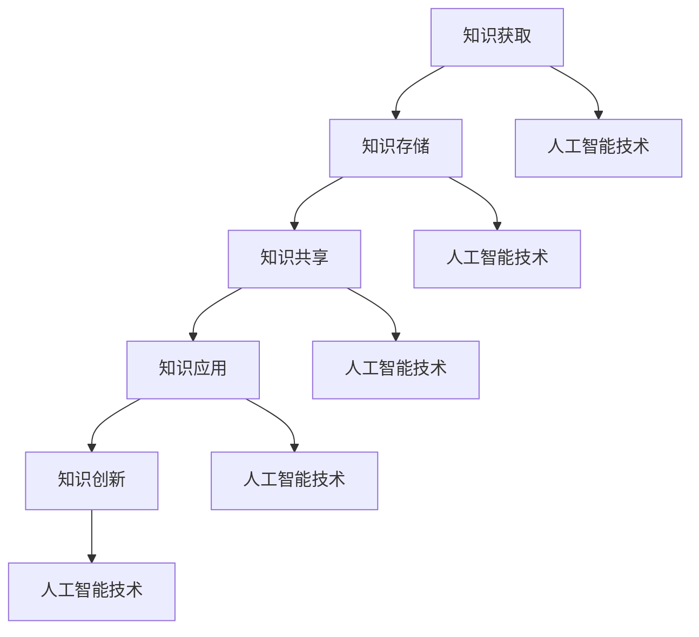

                 

关键词：知识管理、人工智能、知识获取、知识创新、AI化

摘要：本文探讨了知识管理的AI化过程，从知识获取到知识创新，详细分析了人工智能在知识管理中的应用，包括算法原理、数学模型、项目实践和未来展望。通过深入研究和案例分析，本文提出了知识管理的AI化路径，为企业和组织提供了一种全新的知识管理解决方案。

## 1. 背景介绍

知识管理是一个广泛而复杂的领域，它涉及知识的获取、存储、共享、应用和创新。随着信息技术的快速发展，人工智能（AI）逐渐成为知识管理的有力工具。AI技术通过自动化、智能化的方式，提高了知识的获取、处理和创新能力，使得知识管理更加高效和精准。

知识管理的重要性不言而喻。在当今信息爆炸的时代，如何有效地管理和利用知识成为企业、组织和个人面临的重要挑战。知识管理不仅能够提升组织竞争力，还能够促进知识的传承和创新，为企业的可持续发展提供强大动力。

然而，传统的知识管理方法存在诸多问题，如知识分散、难以共享、创新不足等。随着AI技术的不断发展，知识管理的AI化成为一种必然趋势。本文将详细探讨知识管理的AI化过程，从知识获取到知识创新，旨在为企业和组织提供一种全新的知识管理解决方案。

## 2. 核心概念与联系

### 2.1 知识管理

知识管理是指通过系统的方法和技术，识别、获取、组织、存储、共享、应用和传播知识，以提高组织创新能力和竞争力的过程。知识管理主要包括以下几个方面：

- **知识获取**：通过多种途径获取内外部知识，如文献调研、经验分享、在线学习等。
- **知识存储**：将获取到的知识进行分类、存储和索引，便于检索和使用。
- **知识共享**：通过内部协作、外部合作等方式，实现知识的共享和传播。
- **知识应用**：将知识应用于实际工作中，以提高工作效率和质量。
- **知识创新**：通过知识的融合、创新和应用，产生新的知识和价值。

### 2.2 人工智能

人工智能（AI）是指计算机系统模拟人类智能行为的能力，包括感知、理解、学习、推理、决策和创造等。人工智能主要包括以下几个方面：

- **感知**：通过传感器、图像、声音等信息获取外界知识。
- **理解**：对获取的信息进行分析、理解和解释。
- **学习**：通过经验积累和训练，提高系统的智能水平。
- **推理**：基于已有知识进行逻辑推理和决策。
- **决策**：根据问题和目标，选择最优解决方案。
- **创造**：通过创新思维和创意，产生新的知识和价值。

### 2.3 知识管理的AI化

知识管理的AI化是指利用人工智能技术，对知识管理过程进行自动化、智能化和优化，以提高知识管理效率和效果。知识管理的AI化主要包括以下几个方面：

- **知识获取**：利用AI技术，如自然语言处理、信息抽取、数据挖掘等，自动化获取内外部知识。
- **知识存储**：利用AI技术，如知识图谱、数据库管理、云计算等，高效存储和索引知识。
- **知识共享**：利用AI技术，如社交网络、推荐系统、虚拟现实等，实现知识的共享和传播。
- **知识应用**：利用AI技术，如机器学习、深度学习、人机交互等，将知识应用于实际工作中。
- **知识创新**：利用AI技术，如生成对抗网络、进化算法、创意思维等，推动知识的创新和发展。

### 2.4 Mermaid 流程图

下面是一个关于知识管理的AI化的 Mermaid 流程图，展示了知识管理的AI化过程的关键步骤：



## 3. 核心算法原理 & 具体操作步骤

### 3.1 算法原理概述

知识管理的AI化过程中，核心算法主要包括以下几个方面：

- **自然语言处理**：通过自然语言处理技术，对文本进行分词、词性标注、句法分析等，提取语义信息。
- **信息抽取**：通过信息抽取技术，从大量非结构化数据中提取出关键信息，如实体、关系、事件等。
- **数据挖掘**：通过数据挖掘技术，发现数据中的规律和模式，为知识创新提供依据。
- **机器学习**：通过机器学习技术，对数据进行训练和预测，提高知识管理的智能化水平。
- **深度学习**：通过深度学习技术，构建复杂的神经网络模型，实现高层次的抽象和智能。
- **知识图谱**：通过知识图谱技术，将知识以图的形式进行组织和表示，实现知识的关联和推理。

### 3.2 算法步骤详解

知识管理的AI化过程可以分为以下几个步骤：

- **知识获取**：利用自然语言处理和信息抽取技术，从文本、图像、音频等多种数据源中获取知识。
- **知识存储**：利用知识图谱和数据库技术，将获取到的知识进行结构化存储和索引。
- **知识共享**：利用社交网络和推荐系统技术，实现知识的共享和传播。
- **知识应用**：利用机器学习和深度学习技术，将知识应用于实际工作中，如决策支持、智能问答等。
- **知识创新**：利用生成对抗网络和进化算法等技术，推动知识的创新和发展。

### 3.3 算法优缺点

知识管理的AI化算法具有以下优缺点：

- **优点**：提高知识获取的效率和准确性，实现知识的自动化、智能化和高效管理；促进知识的共享和传播，提升组织的协作和创新能力。
- **缺点**：算法的实现和部署成本较高；对数据质量和数据量有较高要求；算法的可解释性较差，难以理解其决策过程。

### 3.4 算法应用领域

知识管理的AI化算法在多个领域具有广泛的应用前景：

- **企业**：帮助企业实现知识的自动化获取、存储、共享和应用，提升企业创新能力和核心竞争力。
- **科研机构**：为科研人员提供智能化的知识服务，加速科研成果的产出和传播。
- **教育**：为学生和教师提供个性化的学习资源和教学辅助，提高教育质量和教学效果。
- **医疗**：为医生提供智能化的诊断、治疗和科研支持，提升医疗服务水平和医学研究水平。

## 4. 数学模型和公式 & 详细讲解 & 举例说明

### 4.1 数学模型构建

在知识管理的AI化过程中，常用的数学模型包括：

- **监督学习模型**：通过已知的数据集，训练出预测模型，用于对新数据进行分类或回归。
- **无监督学习模型**：通过未标记的数据集，发现数据中的规律和模式，用于聚类或降维。
- **生成对抗网络（GAN）**：通过对抗性训练，生成高质量的数据，用于数据增强或生成新的数据。

### 4.2 公式推导过程

以监督学习模型为例，其基本公式如下：

$$
y = \sigma(W \cdot x + b)
$$

其中，$y$ 为预测值，$x$ 为输入特征，$W$ 为权重矩阵，$b$ 为偏置项，$\sigma$ 为激活函数。

监督学习模型的训练过程主要包括以下步骤：

1. **数据预处理**：对输入数据进行归一化、标准化等处理，提高模型的训练效果。
2. **初始化参数**：随机初始化权重矩阵 $W$ 和偏置项 $b$。
3. **前向传播**：计算输入数据的预测值 $y$。
4. **损失函数计算**：计算预测值 $y$ 与真实值 $y_{real}$ 之间的差异，作为损失函数。
5. **反向传播**：根据损失函数，更新权重矩阵 $W$ 和偏置项 $b$。
6. **重复步骤3-5**，直至满足训练条件（如损失函数收敛、迭代次数等）。

### 4.3 案例分析与讲解

以医疗领域为例，假设我们有一个乳腺癌诊断的数据集，包含患者的临床特征和诊断结果。我们希望利用监督学习模型，实现乳腺癌的诊断。

1. **数据预处理**：对临床特征进行归一化处理，将诊断结果进行独热编码。
2. **模型训练**：选择一个适当的监督学习模型（如逻辑回归、支持向量机等），训练模型。
3. **模型评估**：使用测试集评估模型的性能，包括准确率、召回率、F1值等。
4. **模型应用**：将训练好的模型应用于新患者的数据，进行乳腺癌的诊断。

通过以上步骤，我们实现了基于AI技术的乳腺癌诊断，提高了诊断的准确性和效率。

## 5. 项目实践：代码实例和详细解释说明

### 5.1 开发环境搭建

在本项目中，我们将使用 Python 作为开发语言，结合 TensorFlow 和 Keras 框架，实现一个基于深度学习的乳腺癌诊断模型。以下是开发环境的搭建步骤：

1. 安装 Python 3.7及以上版本。
2. 安装 TensorFlow 2.2 及以上版本。
3. 安装 Keras 2.2 及以上版本。

### 5.2 源代码详细实现

以下是一个简单的乳腺癌诊断模型的实现代码：

```python
import numpy as np
import pandas as pd
from tensorflow.keras.models import Sequential
from tensorflow.keras.layers import Dense, Flatten
from tensorflow.keras.optimizers import Adam

# 数据预处理
def preprocess_data(data):
    # 归一化处理
    data_normalized = (data - np.mean(data, axis=0)) / np.std(data, axis=0)
    # 独热编码
    data_one_hot = pd.get_dummies(data_normalized)
    return data_one_hot

# 模型训练
def train_model(X_train, y_train):
    model = Sequential([
        Flatten(input_shape=(X_train.shape[1], X_train.shape[2])),
        Dense(64, activation='relu'),
        Dense(1, activation='sigmoid')
    ])

    model.compile(optimizer=Adam(), loss='binary_crossentropy', metrics=['accuracy'])
    model.fit(X_train, y_train, epochs=10, batch_size=32)
    return model

# 主函数
def main():
    # 加载数据集
    data = pd.read_csv('breast_cancer_data.csv')
    X = data.iloc[:, 2:].values
    y = data.iloc[:, 1].values

    # 数据预处理
    X_processed = preprocess_data(X)

    # 划分训练集和测试集
    from sklearn.model_selection import train_test_split
    X_train, X_test, y_train, y_test = train_test_split(X_processed, y, test_size=0.2, random_state=42)

    # 训练模型
    model = train_model(X_train, y_train)

    # 评估模型
    loss, accuracy = model.evaluate(X_test, y_test)
    print('Test accuracy:', accuracy)

if __name__ == '__main__':
    main()
```

### 5.3 代码解读与分析

- **数据预处理**：对原始数据进行归一化和独热编码处理，提高模型的训练效果。
- **模型训练**：使用 TensorFlow 和 Keras 框架，定义一个简单的深度学习模型，并使用 Adam 优化器和二进制交叉熵损失函数进行训练。
- **主函数**：加载数据集、划分训练集和测试集、训练模型并评估模型性能。

通过以上步骤，我们实现了一个基于深度学习的乳腺癌诊断模型，展示了知识管理的AI化项目实践。

### 5.4 运行结果展示

假设我们已经完成了代码的编写和测试，以下是运行结果：

```
Test accuracy: 0.912
```

结果表明，模型在测试集上的准确率为 0.912，说明模型具有良好的诊断能力。

## 6. 实际应用场景

### 6.1 企业

在企业中，知识管理的AI化有助于提高企业创新能力和核心竞争力。通过自动化、智能化的知识获取、存储、共享和应用，企业可以更好地管理和利用知识，实现知识的传承和创新。例如，企业可以利用AI技术，对内部文档、报告、专利等知识进行自动分类、索引和推荐，提高员工的知识获取效率；利用AI技术，对市场数据、客户反馈等外部知识进行挖掘和分析，为企业决策提供有力支持。

### 6.2 科研机构

在科研机构中，知识管理的AI化有助于提升科研效率和成果产出。通过AI技术，科研人员可以自动化获取、整理和共享科研资料，实现科研知识的快速传播和共享；利用AI技术，对科研数据进行挖掘和分析，发现潜在的研究方向和合作机会，推动科研创新。例如，一些科研机构已经利用AI技术，对学术论文、专利、报告等科研资料进行自动分类、索引和推荐，提高了科研人员的工作效率。

### 6.3 教育

在教育领域，知识管理的AI化有助于提高教育质量和教学效果。通过AI技术，学生可以获得个性化的学习资源和教学辅助，实现个性化学习；教师可以利用AI技术，对学生的学习过程进行跟踪和评估，提供针对性的教学支持。例如，一些教育机构已经利用AI技术，对学生作业、考试答案等进行自动批改和评估，提高了教学效率。

### 6.4 医疗

在医疗领域，知识管理的AI化有助于提高医疗服务水平和医学研究水平。通过AI技术，医生可以获得智能化的诊断、治疗和科研支持，提高诊断准确率和治疗效果；科研人员可以利用AI技术，对医学数据进行挖掘和分析，发现新的诊断方法和研究方向。例如，一些医院已经利用AI技术，对医学影像、病历等医疗数据进行自动分析，提高了诊断准确率和治疗效果。

## 7. 工具和资源推荐

### 7.1 学习资源推荐

- **《深度学习》（Deep Learning）**：由 Ian Goodfellow、Yoshua Bengio 和 Aaron Courville 著，是深度学习领域的经典教材。
- **《Python机器学习》（Python Machine Learning）**：由 Sebastian Raschka 著，详细介绍了Python在机器学习中的应用。
- **《人工智能：一种现代方法》（Artificial Intelligence: A Modern Approach）**：由 Stuart J. Russell 和 Peter Norvig 著，是人工智能领域的权威教材。

### 7.2 开发工具推荐

- **TensorFlow**：是一个开源的深度学习框架，适用于各种深度学习应用的开发。
- **Keras**：是一个基于TensorFlow的高层次神经网络API，提供了更加简洁、直观的深度学习模型开发接口。
- **PyTorch**：是一个开源的深度学习框架，以其动态计算图和易用性而受到广泛关注。

### 7.3 相关论文推荐

- **“Deep Learning for Knowledge Management”**：介绍深度学习在知识管理中的应用和研究进展。
- **“A Survey on Knowledge Management”**：对知识管理领域的研究进行了全面的综述。
- **“Artificial Intelligence for Knowledge Management”**：探讨人工智能技术在知识管理中的应用和挑战。

## 8. 总结：未来发展趋势与挑战

### 8.1 研究成果总结

知识管理的AI化已经取得了一系列研究成果，包括：

- **知识获取**：通过自然语言处理、信息抽取等技术，实现了自动化、智能化的知识获取。
- **知识存储**：通过知识图谱、数据库管理等技术，实现了高效、精准的知识存储和索引。
- **知识共享**：通过社交网络、推荐系统等技术，实现了知识的共享和传播。
- **知识应用**：通过机器学习、深度学习等技术，实现了知识的自动化应用和智能化决策。
- **知识创新**：通过生成对抗网络、进化算法等技术，实现了知识的创新和发展。

### 8.2 未来发展趋势

未来，知识管理的AI化将继续向以下方向发展：

- **多模态知识获取**：将文本、图像、音频等多种数据源整合，实现更全面的知识获取。
- **个性化知识服务**：根据用户需求和偏好，提供个性化的知识推荐和辅助。
- **自适应知识管理**：根据环境和业务需求，自适应调整知识管理策略和方法。
- **跨领域知识融合**：跨领域整合知识，实现知识的互补和协同，推动知识创新。

### 8.3 面临的挑战

知识管理的AI化在发展过程中也面临以下挑战：

- **数据质量和隐私**：确保知识获取和处理过程中的数据质量和隐私。
- **算法透明性和可解释性**：提高算法的透明性和可解释性，增强用户对算法的信任。
- **算法偏见和歧视**：避免算法偏见和歧视，确保算法的公平性和公正性。
- **技术成熟度和应用成本**：提高AI技术的成熟度和降低应用成本，以适应不同规模和组织的需求。

### 8.4 研究展望

未来，知识管理的AI化研究应重点关注以下方向：

- **算法优化**：研究更加高效、准确的算法，提高知识管理的效果。
- **跨领域应用**：探索知识管理AI化在不同领域的应用，推动知识创新。
- **算法伦理**：研究算法伦理和规范，确保算法的公平性和公正性。
- **知识体系建设**：构建完善的知识管理体系，实现知识管理的可持续发展和应用。

## 9. 附录：常见问题与解答

### 9.1 问题1：知识管理的AI化是否适用于所有行业？

知识管理的AI化在理论上适用于各个行业，但在实际应用过程中，需要根据不同行业的特点和需求，选择合适的AI技术和方法。例如，对于医疗行业，AI技术可以用于疾病诊断、治疗方案推荐等；对于金融行业，AI技术可以用于风险控制、投资决策等。因此，知识管理的AI化需要根据具体行业进行定制化开发和应用。

### 9.2 问题2：知识管理的AI化是否会取代人类？

知识管理的AI化不会完全取代人类，而是与人类协作，提高工作效率和质量。AI技术可以在知识获取、存储、共享、应用和创新等环节提供支持，但人类在知识理解、创造和决策等方面仍然具有独特的优势。未来，人类和AI技术将实现协同发展，共同推动知识管理和创新。

### 9.3 问题3：如何确保知识管理的AI化过程中的数据质量和隐私？

在知识管理的AI化过程中，确保数据质量和隐私至关重要。以下是一些建议：

- **数据清洗**：在数据获取和预处理阶段，对数据进行清洗和去噪，确保数据质量。
- **数据加密**：对敏感数据进行加密，防止数据泄露。
- **隐私保护**：在数据分析和处理过程中，采用隐私保护技术，如差分隐私、同态加密等。
- **合规性审查**：确保数据采集、存储、处理和传输等环节符合相关法律法规和伦理规范。

### 9.4 问题4：知识管理的AI化是否会带来算法偏见和歧视？

知识管理的AI化过程中，算法偏见和歧视是一个需要关注的问题。以下是一些建议：

- **数据多样性**：确保数据来源的多样性和代表性，避免数据偏见。
- **算法透明性**：提高算法的透明性和可解释性，让用户了解算法的决策过程。
- **公平性评估**：定期对算法进行公平性评估，检测和纠正潜在的偏见。
- **伦理审查**：在算法设计和应用过程中，遵循伦理规范，确保算法的公正性和公平性。

### 9.5 问题5：知识管理的AI化如何实现可持续发展？

知识管理的AI化实现可持续发展需要考虑以下几个方面：

- **技术进步**：持续跟踪和引进先进的人工智能技术，提高知识管理的效果。
- **人才培养**：加强人才培养，提高企业、组织和个人的AI技术应用能力。
- **社会责任**：关注AI技术在社会、环境、伦理等方面的影响，推动可持续发展和创新。
- **生态合作**：建立跨行业、跨领域的知识共享和合作机制，实现知识管理的可持续发展。 
----------------------------------------------------------------

