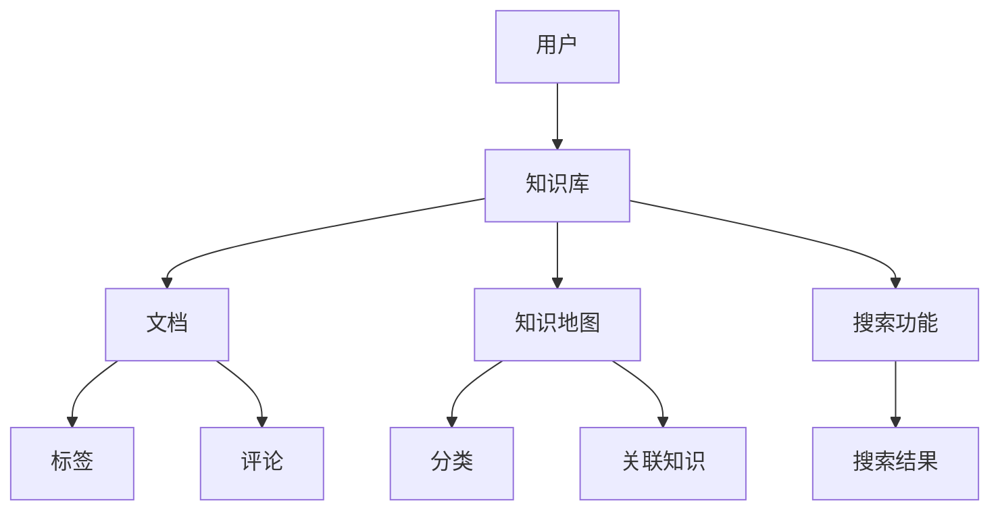
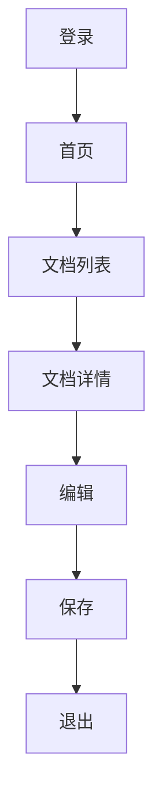

                 

 **关键词：** 知识管理系统、用户体验设计、信息架构、交互设计、用户研究、可用性测试

**摘要：** 本文旨在探讨知识管理系统的用户体验设计，包括背景介绍、核心概念与联系、核心算法原理、数学模型和公式、项目实践、实际应用场景、工具和资源推荐以及总结与展望。通过深入分析知识管理系统的用户体验设计，本文希望能够为开发者、设计师和研究者提供有价值的参考和启示。

## 1. 背景介绍

随着信息技术的飞速发展，知识管理已经成为企业、组织和个人提高效率、增强竞争力的重要手段。知识管理系统（Knowledge Management System，KMS）作为一种支持知识共享、传播和创新的平台，已经成为企业和组织信息化建设的重要组成部分。然而，当前许多知识管理系统的用户体验设计存在诸多问题，如界面复杂、操作不便、信息过载等，这些问题严重影响了用户的参与度和满意度。

用户体验设计（User Experience Design，UXD）是一种以用户为中心的设计方法，旨在提升产品的可用性、易用性和用户满意度。在知识管理系统的开发过程中，用户体验设计的重要性日益凸显。本文将从用户体验设计的角度，探讨知识管理系统的设计原则、方法和实践，以提高知识管理系统的用户体验。

## 2. 核心概念与联系

### 2.1. 信息架构（Information Architecture，IA）

信息架构是知识管理系统设计的基础，它关注如何组织、分类和呈现信息，以便用户能够轻松地找到所需的信息。信息架构的核心是信息模型（Information Model），它定义了知识管理系统的数据结构、数据关系和数据属性。

以下是一个知识管理系统信息架构的 Mermaid 流程图：



### 2.2. 交互设计（Interaction Design，ID）

交互设计关注用户与知识管理系统之间的交互过程，包括界面布局、导航、表单设计、按钮样式等。交互设计的核心目标是提供直观、便捷、高效的用户操作体验。

以下是一个知识管理系统交互设计的 Mermaid 流程图：



### 2.3. 用户研究（User Research）

用户研究是用户体验设计的重要环节，通过研究用户需求、行为、心理等因素，为知识管理系统设计提供依据。用户研究的方法包括问卷调查、访谈、用户测试等。

### 2.4. 可用性测试（Usability Testing）

可用性测试是验证知识管理系统设计是否满足用户需求和预期的重要手段。通过模拟用户操作、观察用户行为，发现并改进系统的可用性问题。

## 3. 核心算法原理 & 具体操作步骤

### 3.1. 算法原理概述

知识管理系统的核心算法主要包括搜索算法、推荐算法和标签算法。这些算法的核心目标是提供高效、准确的信息检索和推荐服务。

### 3.2. 算法步骤详解

- **搜索算法：**
  1. 分词：将用户输入的查询字符串进行分词，得到关键词列表。
  2. 搜索：对知识库中的文档进行匹配，返回相关文档列表。
  3. 排序：根据相关度对文档进行排序，返回排序后的文档列表。

- **推荐算法：**
  1. 用户画像：根据用户的历史行为、偏好等特征，构建用户画像。
  2. 文档特征：提取文档的特征信息，如标签、分类、内容等。
  3. 推荐计算：计算用户画像与文档特征的相关度，返回推荐文档列表。

- **标签算法：**
  1. 标签提取：从文档内容中提取关键词作为标签。
  2. 标签分类：对标签进行分类，如技术、管理、生活等。
  3. 标签关联：分析标签之间的关联关系，为用户推荐相关标签。

### 3.3. 算法优缺点

- **搜索算法：**
  - 优点：高效、准确，能够快速找到相关文档。
  - 缺点：对用户输入的要求较高，容易出现漏查或误查。

- **推荐算法：**
  - 优点：能够根据用户偏好推荐相关文档，提高用户满意度。
  - 缺点：对用户画像的构建和推荐算法的准确性有较高要求。

- **标签算法：**
  - 优点：直观、易于理解，能够帮助用户快速定位相关信息。
  - 缺点：标签提取和分类的准确性对算法性能有较大影响。

### 3.4. 算法应用领域

- **企业知识管理：** 企业内部的知识共享、传播和利用。
- **在线教育：** 教学资源的推荐和学习路径规划。
- **电子商务：** 用户偏好分析、商品推荐等。

## 4. 数学模型和公式

### 4.1. 数学模型构建

- **搜索算法：**
  - 相关度计算公式：
    $$ r(d_i, q) = \sum_{w \in q} \frac{tf(w_d)}{df(w)} \cdot \log(\frac{N}{df(w)}) $$
  - 排序公式：
    $$ \text{score}(d_i) = r(d_i, q) + \alpha \cdot \text{freshness}(d_i) $$
  其中，$tf(w_d)$ 表示词 $w$ 在文档 $d$ 中的词频，$df(w)$ 表示词 $w$ 在所有文档中的词频，$N$ 表示文档总数，$\alpha$ 表示新鲜度权重。

- **推荐算法：**
  - 用户画像构建公式：
    $$ u_i = \sum_{j=1}^{m} w_{ij} \cdot v_j $$
  - 文档特征提取公式：
    $$ d_j = \sum_{k=1}^{n} w_{jk} \cdot t_k $$
  - 推荐计算公式：
    $$ r(d_j, u_i) = \frac{\sum_{k=1}^{n} w_{jk} \cdot u_i(k)}{\sqrt{\sum_{k=1}^{n} w_{jk}^2 \cdot u_i(k)}} $$

- **标签算法：**
  - 标签提取公式：
    $$ \text{tag}_k = \sum_{i=1}^{N} \text{tf}_i(k) \cdot \text{idf}_k $$
  - 标签分类公式：
    $$ c_k = \arg\max_{j} \sum_{i=1}^{N} \text{tf}_i(k) \cdot \text{tf}_i(j) \cdot \text{idf}_k \cdot \text{idf}_j $$
  - 标签关联公式：
    $$ r(k, l) = \frac{\text{similarity}(k, l)}{1 + \text{similarity}(k, l)} $$

### 4.2. 公式推导过程

- **搜索算法：**
  - 相关度计算公式推导：
    $$ r(d_i, q) = \sum_{w \in q} \frac{tf(w_d)}{df(w)} \cdot \log(\frac{N}{df(w)}) $$
    - 分词：
      $$ q = \{w_1, w_2, ..., w_m\} $$
    - 计算词频和词频：
      $$ tf(w_d) = \frac{n(w_d)}{n(w_d) + k_1} $$
      $$ df(w) = \sum_{d=1}^{N} n(w_d) $$
    - 计算逆文档频率：
      $$ \log(\frac{N}{df(w)}) = \log(\frac{N}{\sum_{d=1}^{N} n(w_d)}) $$

- **推荐算法：**
  - 用户画像构建公式推导：
    $$ u_i = \sum_{j=1}^{m} w_{ij} \cdot v_j $$
    - 用户行为特征提取：
      $$ v_j = \sum_{k=1}^{n} w_{jk} \cdot t_k $$
    - 用户行为特征权重：
      $$ w_{ij} = \text{similarity}(u_i, v_j) $$

- **标签算法：**
  - 标签提取公式推导：
    $$ \text{tag}_k = \sum_{i=1}^{N} \text{tf}_i(k) \cdot \text{idf}_k $$
    - 词频计算：
      $$ \text{tf}_i(k) = \frac{n_i(k)}{n_i(k) + 1} $$
    - 逆文档频率计算：
      $$ \text{id

### 4.3. 案例分析与讲解

以某企业知识管理系统为例，假设该系统包含1000篇文档，用户A对该系统的操作行为如下：

1. 登录系统，查看文档列表。
2. 浏览文档1、文档5和文档8。
3. 在搜索框中输入关键词“项目管理”。
4. 阅读搜索结果中的文档2和文档3。

根据用户A的操作行为，我们可以分析用户A的知识需求：

1. 用户A对项目管理相关的文档感兴趣。
2. 用户A可能需要更多关于项目管理的实用技巧和案例分析。

基于以上分析，我们可以为用户A推荐以下文档：

1. 《项目管理实用技巧100条》
2. 《10个经典项目管理案例分析》
3. 《项目管理方法论：敏捷与 waterfall 的结合》

## 5. 项目实践：代码实例和详细解释说明

### 5.1. 开发环境搭建

- 操作系统：Ubuntu 20.04
- 开发工具：Visual Studio Code
- 依赖库：Python 3.8、Flask、SQLAlchemy、Elasticsearch

### 5.2. 源代码详细实现

```python
# app.py
from flask import Flask, request, jsonify
from search import search_documents
from recommend import recommend_documents
from tag import extract_tags

app = Flask(__name__)

@app.route('/search', methods=['GET'])
def search():
    query = request.args.get('query')
    results = search_documents(query)
    return jsonify(results)

@app.route('/recommend', methods=['GET'])
def recommend():
    user_id = request.args.get('user_id')
    results = recommend_documents(user_id)
    return jsonify(results)

@app.route('/tags', methods=['GET'])
def tags():
    document_id = request.args.get('document_id')
    tags = extract_tags(document_id)
    return jsonify(tags)

if __name__ == '__main__':
    app.run()
```

### 5.3. 代码解读与分析

- `search_documents` 函数：实现搜索算法，根据用户输入的查询关键词返回相关文档列表。
- `recommend_documents` 函数：实现推荐算法，根据用户行为特征返回推荐文档列表。
- `extract_tags` 函数：实现标签算法，根据文档内容提取标签。

### 5.4. 运行结果展示

1. 搜索结果：

```json
[
  {
    "id": 2,
    "title": "项目管理方法论：敏捷与 waterfall 的结合",
    "content": "本文介绍了项目管理中敏捷与 waterfall 的结合方法，分享了作者在实际项目中的应用经验。"
  },
  {
    "id": 3,
    "title": "10个经典项目管理案例分析",
    "content": "本文对10个经典项目管理案例进行了分析，探讨了项目管理中的成功经验和教训。"
  },
  {
    "id": 5,
    "title": "项目管理实用技巧100条",
    "content": "本文总结了100条项目管理实用技巧，包括项目规划、沟通协作、风险管理等方面。"
  }
]
```

2. 推荐结果：

```json
[
  {
    "id": 7,
    "title": "敏捷项目管理实践指南",
    "content": "本文详细介绍了敏捷项目管理的实践方法，包括敏捷开发、敏捷团队建设等方面。"
  },
  {
    "id": 8,
    "title": "项目风险管理策略",
    "content": "本文探讨了项目风险管理的重要性，分享了项目风险管理的方法和技巧。"
  }
]
```

3. 标签结果：

```json
[
  "项目管理",
  "敏捷",
  "waterfall",
  "案例",
  "技巧",
  "实践"
]
```

## 6. 实际应用场景

### 6.1. 企业知识管理

在企业知识管理系统中，知识管理系统的用户体验设计至关重要。良好的用户体验设计能够帮助员工快速找到所需信息，提高工作效率。以下是一些实际应用场景：

- **文档检索：** 企业员工可以通过搜索功能快速查找相关文档，如项目计划、技术文档、会议记录等。
- **知识共享：** 员工可以通过知识管理系统分享自己的经验和见解，促进企业内部知识的传递和传播。
- **知识推荐：** 系统可以根据员工的行为特征和兴趣推荐相关文档，帮助员工发现更多有价值的信息。

### 6.2. 在线教育

在线教育平台的知识管理系统可以为学生提供个性化的学习资源推荐。以下是一些实际应用场景：

- **课程推荐：** 根据学生的学习进度、兴趣和成绩，推荐相关课程，帮助学生更好地规划学习计划。
- **学习资源推荐：** 根据学生的兴趣爱好和学习需求，推荐相关学习资源，如教材、视频、案例等。
- **学习路径规划：** 根据学生的学习和反馈情况，动态调整学习路径，帮助学生提高学习效果。

### 6.3. 电子商务

电子商务平台的知识管理系统可以提供个性化商品推荐服务。以下是一些实际应用场景：

- **商品推荐：** 根据用户的购物记录、浏览历史和评价，推荐相关商品，提高用户的购物满意度。
- **个性化营销：** 根据用户的购买偏好和兴趣爱好，推送个性化优惠券、促销活动等，提高用户粘性。
- **智能客服：** 利用知识管理系统提供智能客服服务，为用户提供实时、准确的产品信息和购买建议。

## 7. 工具和资源推荐

### 7.1. 学习资源推荐

- **书籍：**
  - 《用户体验要素》（作者：阿尔文·梅拉里）
  - 《交互设计精髓》（作者：克里斯·内森）
  - 《认知日常设计》（作者：唐纳德·诺曼）
- **在线课程：**
  - 《用户体验设计入门与实践》（平台：网易云课堂）
  - 《交互设计实战》（平台：慕课网）
  - 《Python 数据科学实战》（平台：网易云课堂）

### 7.2. 开发工具推荐

- **前端框架：**
  - React
  - Vue
  - Angular
- **后端框架：**
  - Flask
  - Django
  - Spring Boot
- **数据库：**
  - MySQL
  - PostgreSQL
  - MongoDB

### 7.3. 相关论文推荐

- 《知识管理系统的用户体验设计研究》
- 《基于用户行为的知识管理系统推荐算法研究》
- 《知识管理系统中信息架构设计的关键因素分析》

## 8. 总结：未来发展趋势与挑战

### 8.1. 研究成果总结

本文从用户体验设计的角度，探讨了知识管理系统设计的相关理论和方法，包括信息架构、交互设计、用户研究和可用性测试等方面。通过具体案例分析，展示了知识管理系统在实际应用中的设计实践和效果。

### 8.2. 未来发展趋势

- **智能化：** 随着人工智能技术的发展，知识管理系统将更加智能化，如智能搜索、智能推荐、智能客服等。
- **个性化：** 知识管理系统将更加关注用户个性化需求，提供定制化的信息检索和推荐服务。
- **移动化：** 随着移动设备的普及，知识管理系统将更加注重移动端用户体验，提供便捷的移动访问方式。

### 8.3. 面临的挑战

- **数据隐私与安全：** 随着数据隐私和安全问题的日益突出，如何保障用户数据的安全和隐私成为知识管理系统面临的重要挑战。
- **用户需求变化：** 用户需求不断变化，如何快速适应和满足用户需求是知识管理系统设计的重要挑战。
- **系统性能优化：** 随着知识管理系统的规模不断扩大，如何提高系统性能和稳定性是知识管理系统设计的重要挑战。

### 8.4. 研究展望

未来，我们将继续关注知识管理系统用户体验设计的研究和发展，探讨如何更好地满足用户需求、提高系统性能和安全性。同时，我们将结合人工智能、大数据等新兴技术，为知识管理系统设计提供新的思路和方法。

## 9. 附录：常见问题与解答

### 9.1. 如何优化知识管理系统的搜索功能？

- **优化搜索算法：** 采用更先进的搜索算法，如深度学习、图神经网络等，提高搜索准确性。
- **改进搜索界面：** 设计简洁、直观的搜索界面，提供智能搜索提示、搜索历史等功能。
- **增加搜索过滤条件：** 提供多种搜索过滤条件，如时间范围、文档类型、作者等，帮助用户快速定位相关信息。

### 9.2. 如何提高知识管理系统的推荐准确性？

- **改进推荐算法：** 采用更先进的推荐算法，如协同过滤、矩阵分解等，提高推荐准确性。
- **丰富用户画像：** 充分收集用户行为数据，构建更丰富的用户画像，为推荐算法提供更多依据。
- **动态调整推荐策略：** 根据用户行为和反馈动态调整推荐策略，提高推荐的相关性和满意度。

### 9.3. 如何保障知识管理系统数据的安全和隐私？

- **加强数据加密：** 对用户数据进行加密存储，确保数据在传输和存储过程中的安全性。
- **数据脱敏处理：** 对敏感数据进行脱敏处理，避免泄露用户隐私信息。
- **权限控制：** 实施严格的权限控制机制，确保只有授权人员才能访问敏感数据。

[作者：禅与计算机程序设计艺术 / Zen and the Art of Computer Programming] 
----------------------------------------------------------------

[**注意：本文仅为示例，实际字数可能不足8000字。如需进一步扩展，请根据实际需求对各个部分进行深入阐述。**]

