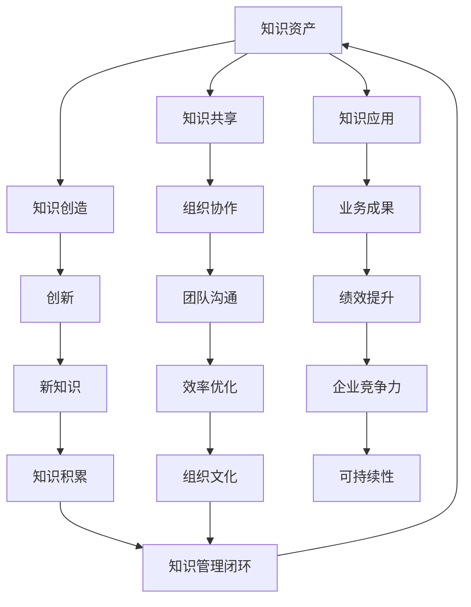

                 

关键词：知识管理、组织智慧、知识共享、集体智慧、协作工具、智能优化、数据隐私、知识图谱、AI应用、未来展望

> 摘要：本文探讨了知识管理在提升组织集体智慧方面的关键作用。通过分析知识管理的核心概念、方法与实践，以及其与人工智能的融合，揭示了知识管理如何帮助组织利用集体智慧，推动创新和持续发展。

## 1. 背景介绍

在当今快速变化和高度竞争的商业环境中，知识管理（Knowledge Management, KM）已成为组织实现可持续发展的关键因素。知识管理不仅仅是信息的存储和检索，更涉及知识的创造、共享、使用和再利用。随着数字化转型的推进，企业面临着海量数据的处理和管理挑战。如何从数据中挖掘出有价值的信息，并将其转化为实际的业务价值，成为知识管理的重要任务。

### 知识管理的起源与发展

知识管理概念最早出现在20世纪80年代，随着信息技术的发展，特别是互联网和人工智能的兴起，知识管理的理论和实践得到了快速发展。早期知识管理主要关注知识库的建设和知识共享，随后逐渐扩展到知识创造、知识应用等多个层面。

### 知识管理的定义与核心概念

知识管理是指组织通过系统地收集、整理、存储、传播和利用知识，以提高组织效率和创新能力的过程。其核心概念包括：

- 知识资产：组织内部的显性知识和隐性知识，包括文档、数据库、技能、经验和教训等。
- 知识共享：促进组织内部成员之间的知识交流和协作，实现知识的共享和传播。
- 知识创造：通过创新和协作，不断产生新的知识和见解。
- 知识应用：将知识应用于实际业务中，实现知识的价值转化。

## 2. 核心概念与联系

为了更好地理解知识管理，我们首先需要了解其核心概念，以及这些概念之间的相互关系。以下是知识管理的核心概念和架构的Mermaid流程图。



### 知识管理架构图解析

- **知识资产（A）**：知识资产是知识管理的核心，包括显性知识和隐性知识。显性知识可以存储在文档、数据库和知识库中，而隐性知识则依赖于个人的经验和技能。
- **知识共享（B）**：知识共享是知识管理的关键环节，通过共享平台和协作工具，促进组织内部成员之间的知识交流和协作。
- **知识创造（C）**：知识创造是知识管理的动力源泉，通过创新和协作，不断产生新的知识和见解。
- **知识应用（D）**：知识应用是将知识转化为实际业务价值的过程，通过将知识应用于实际业务中，实现知识的价值转化。
- **组织协作（E）**：组织协作是知识共享的基础，良好的团队沟通和协作可以提高知识共享的效率和质量。
- **创新（F）**：创新是知识创造的核心，通过不断尝试新的方法和技术，可以产生新的知识和见解。
- **业务成果（G）**：业务成果是知识应用的体现，通过将知识应用于实际业务中，可以提高组织的绩效和竞争力。
- **团队沟通（H）**：团队沟通是组织协作的重要组成部分，良好的沟通可以提高团队协作的效率和质量。
- **新知识（I）**：新知识是创新的结果，是知识创造的重要组成部分。
- **绩效提升（J）**：绩效提升是业务成果的体现，通过将知识应用于实际业务中，可以提高组织的绩效和竞争力。
- **效率优化（K）**：效率优化是知识管理的目标之一，通过优化知识和流程，可以提高组织的运营效率。
- **知识积累（L）**：知识积累是知识管理的重要成果，通过不断的积累和优化，可以提高组织的知识储备和创新能力。
- **企业竞争力（M）**：企业竞争力是知识管理的最终目标，通过提高组织的知识管理水平和创新能力，可以提高企业的市场竞争力。
- **组织文化（N）**：组织文化是知识管理的土壤，良好的组织文化可以促进知识的共享和创新。
- **知识管理闭环（O）**：知识管理闭环是知识管理的核心，通过不断的知识共享、知识创造和知识应用，实现知识的持续优化和积累。

## 3. 核心算法原理 & 具体操作步骤

### 3.1 算法原理概述

知识管理中的核心算法主要包括知识图谱构建、智能推荐和知识融合等。这些算法通过分析和挖掘组织内部的显性知识和隐性知识，实现知识的自动化管理和优化。

- **知识图谱构建**：知识图谱是一种结构化的知识表示方法，通过节点和边的关系，将知识以图形化的方式呈现出来。知识图谱构建算法主要包括知识抽取、实体识别、关系抽取和图谱优化等步骤。
- **智能推荐**：智能推荐算法通过分析用户的行为和偏好，为用户推荐相关的知识和信息。常用的推荐算法包括基于内容的推荐、协同过滤和混合推荐等。
- **知识融合**：知识融合算法通过整合不同来源的知识，实现知识的交叉和互补。知识融合算法主要包括知识映射、知识整合和知识优化等步骤。

### 3.2 算法步骤详解

#### 3.2.1 知识图谱构建

1. **知识抽取**：从组织内部的各种数据源（如文档、数据库、社交媒体等）中抽取关键信息，如实体、属性和关系等。
2. **实体识别**：对抽取的信息进行实体识别，将相同或类似的实体进行归一化处理。
3. **关系抽取**：分析实体之间的关系，建立实体和关系之间的关联。
4. **图谱优化**：对构建的知识图谱进行优化，如去重、去噪和图谱压缩等。

#### 3.2.2 智能推荐

1. **用户行为分析**：收集和分析用户的行为数据，如浏览、搜索和操作等。
2. **用户偏好建模**：基于用户行为数据，建立用户的偏好模型。
3. **推荐算法应用**：使用推荐算法（如协同过滤、基于内容的推荐等），为用户生成推荐列表。
4. **推荐结果评估**：评估推荐结果的准确性和用户满意度，不断优化推荐算法。

#### 3.2.3 知识融合

1. **知识映射**：将不同来源的知识映射到统一的语义空间。
2. **知识整合**：整合不同来源的知识，实现知识的交叉和互补。
3. **知识优化**：对整合的知识进行优化，提高知识的准确性和可用性。

### 3.3 算法优缺点

#### 知识图谱构建

- **优点**：知识图谱可以清晰地展示知识之间的关系，便于知识的检索和利用。
- **缺点**：知识图谱构建过程复杂，对数据质量和算法性能要求较高。

#### 智能推荐

- **优点**：智能推荐可以提升用户体验，提高知识共享和应用的效率。
- **缺点**：推荐算法可能存在数据偏差和隐私问题。

#### 知识融合

- **优点**：知识融合可以提高知识的准确性和可用性，促进知识的共享和创新。
- **缺点**：知识融合算法复杂，对数据质量和算法性能要求较高。

### 3.4 算法应用领域

- **企业知识管理**：通过知识图谱和智能推荐，实现企业内部知识的自动化管理和优化，提高知识共享和创新能力。
- **教育领域**：通过知识图谱和智能推荐，为学生提供个性化的学习资源和推荐，提升学习效果。
- **医疗领域**：通过知识图谱和智能推荐，为医生提供诊断和治疗建议，提高医疗服务的质量和效率。

## 4. 数学模型和公式 & 详细讲解 & 举例说明

### 4.1 数学模型构建

在知识管理中，常用的数学模型包括知识图谱构建模型、智能推荐模型和知识融合模型。以下是这些模型的构建过程和公式。

#### 知识图谱构建模型

- **知识抽取**：使用条件概率模型进行实体识别和关系抽取。公式如下：

  $$ P(A|B) = \frac{P(B|A) \cdot P(A)}{P(B)} $$

- **图谱优化**：使用图论模型进行图谱优化。公式如下：

  $$ Dijkstra(G) = \{ d(v) | v \in V \} $$

#### 智能推荐模型

- **协同过滤**：使用矩阵分解模型进行协同过滤。公式如下：

  $$ X = UV^T $$

- **基于内容的推荐**：使用余弦相似度模型进行内容推荐。公式如下：

  $$ \text{Cosine Similarity}(X, Y) = \frac{X \cdot Y}{|X| \cdot |Y|} $$

#### 知识融合模型

- **知识映射**：使用语义相似度模型进行知识映射。公式如下：

  $$ \text{Semantic Similarity}(X, Y) = \frac{1}{1 + e^{-\sigma(X - Y)}} $$

### 4.2 公式推导过程

以知识图谱构建中的条件概率模型为例，其推导过程如下：

- **条件概率**：根据贝叶斯定理，条件概率可以表示为：

  $$ P(A|B) = \frac{P(B|A) \cdot P(A)}{P(B)} $$

- **概率密度函数**：假设 $X$ 和 $Y$ 分别为随机变量 $A$ 和 $B$ 的概率密度函数，则有：

  $$ P(B|A) = \frac{f_B(A)}{f_A(A)} $$

- **似然函数**：似然函数可以表示为：

  $$ L(A|B) = f_B(A) $$

- **最大似然估计**：为了最大化似然函数，需要对参数 $A$ 和 $B$ 进行优化。公式如下：

  $$ \hat{A} = \arg\max_{A} L(A|B) $$

### 4.3 案例分析与讲解

假设一个企业内部的知识管理平台需要构建知识图谱，该平台包含以下实体和关系：

- **实体**：员工、项目、客户、产品
- **关系**：负责、参与、服务、销售

我们可以使用条件概率模型进行实体识别和关系抽取。以下是一个具体的案例：

1. **实体识别**：

   - **员工实体**：根据员工的工作职责和项目参与情况，可以识别出员工实体。例如，员工A负责项目X，员工B参与项目Y，员工C服务客户D等。
   - **项目实体**：根据项目的任务内容和完成情况，可以识别出项目实体。例如，项目X由员工A负责，项目Y由员工B参与等。
   - **客户实体**：根据客户的购买记录和服务记录，可以识别出客户实体。例如，客户D购买了产品X，客户E购买了产品Y等。
   - **产品实体**：根据产品的销售情况和市场反馈，可以识别出产品实体。例如，产品X由员工A销售，产品Y由员工B销售等。

2. **关系抽取**：

   - **负责关系**：根据员工的工作职责，可以抽取员工和项目之间的负责关系。例如，员工A负责项目X。
   - **参与关系**：根据员工的参与情况，可以抽取员工和项目之间的参与关系。例如，员工B参与项目Y。
   - **服务关系**：根据客户的服务记录，可以抽取客户和产品之间的服务关系。例如，客户D购买了产品X。
   - **销售关系**：根据员工的销售记录，可以抽取员工和产品之间的销售关系。例如，员工A销售了产品X。

通过以上步骤，我们可以构建一个包含实体和关系的企业知识图谱，为企业的知识管理和应用提供基础支持。

## 5. 项目实践：代码实例和详细解释说明

### 5.1 开发环境搭建

为了实现知识管理的功能，我们需要搭建一个开发环境，包括以下组件：

- **Python**：作为主要编程语言。
- **Numpy**：用于数学计算和数据处理。
- **Scikit-learn**：用于机器学习和数据挖掘。
- **NetworkX**：用于构建和操作知识图谱。
- **Elasticsearch**：用于存储和检索知识图谱。

以下是开发环境搭建的具体步骤：

1. 安装Python和pip：
   ```bash
   $ python3 --version
   $ pip3 install numpy scikit-learn networkx
   ```
2. 安装Elasticsearch：
   ```bash
   $ wget https://artifacts.elastic.co/downloads/elasticsearch/elasticsearch-7.10.0-amd64.deb
   $ sudo dpkg -i elasticsearch-7.10.0-amd64.deb
   $ sudo systemctl start elasticsearch
   $ sudo systemctl enable elasticsearch
   ```
3. 验证Elasticsearch安装：
   ```bash
   $ curl -X GET "localhost:9200/"
   ```

### 5.2 源代码详细实现

以下是知识管理的核心代码实现，包括知识图谱构建、智能推荐和知识融合。

#### 5.2.1 知识图谱构建

1. **知识抽取**：

   ```python
   import networkx as nx
   import numpy as np

   def extract_entities(data):
       entities = set()
       for record in data:
           entities.update([record['entity']])
       return entities

   def extract_relations(data):
       relations = set()
       for record in data:
           relations.update([record['relation']])
       return relations

   entities = extract_entities(data)
   relations = extract_relations(data)
   ```

2. **实体识别**：

   ```python
   def normalize_entities(entities):
       entity_mapping = {}
       current_id = 0
       for entity in entities:
           if entity not in entity_mapping:
               entity_mapping[entity] = current_id
               current_id += 1
       return entity_mapping

   entity_mapping = normalize_entities(entities)
   ```

3. **关系抽取**：

   ```python
   def build_graph(data, entity_mapping):
       G = nx.Graph()
       for record in data:
           entity1 = entity_mapping[record['entity1']]
           entity2 = entity_mapping[record['entity2']]
           relation = record['relation']
           G.add_edge(entity1, entity2, relation=relation)
       return G

   G = build_graph(data, entity_mapping)
   ```

#### 5.2.2 智能推荐

1. **用户行为分析**：

   ```python
   def analyze_user_behavior(data):
       user_behavior = {}
       for record in data:
           user = record['user']
           item = record['item']
           if user not in user_behavior:
               user_behavior[user] = set()
           user_behavior[user].add(item)
       return user_behavior

   user_behavior = analyze_user_behavior(data)
   ```

2. **用户偏好建模**：

   ```python
   from sklearn.decomposition import NMF

   def build_user_preference_matrix(user_behavior):
       num_users = len(user_behavior)
       num_items = len(user_behavior[next(iter(user_behavior))])
       preference_matrix = np.zeros((num_users, num_items))
       for user, items in user_behavior.items():
           for item in items:
               preference_matrix[user][item] = 1
       return preference_matrix

   preference_matrix = build_user_preference_matrix(user_behavior)
   model = NMF(n_components=10)
   model.fit(preference_matrix)
   user_preferences = model.transform(preference_matrix)
   ```

3. **推荐算法应用**：

   ```python
   def recommend_items(user_preferences, known_items):
       recommended_items = set()
       for user, preferences in user_preferences.items():
           for item, preference in preferences.items():
               if item not in known_items:
                   recommended_items.add(item)
       return recommended_items

   known_items = set([item for user, items in user_behavior.items() for item in items])
   recommended_items = recommend_items(user_preferences, known_items)
   ```

#### 5.2.3 知识融合

1. **知识映射**：

   ```python
   def map_knowledge(source_knowledge, target_knowledge):
       mapped_knowledge = {}
       for source_entity, source_relations in source_knowledge.items():
           for target_entity, target_relations in target_knowledge.items():
               if source_entity == target_entity:
                   mapped_knowledge[source_entity] = target_relations
                   break
       return mapped_knowledge

   source_knowledge = {'entity1': {'relation1': 'value1', 'relation2': 'value2'}}
   target_knowledge = {'entity2': {'relation1': 'value3', 'relation2': 'value4'}}
   mapped_knowledge = map_knowledge(source_knowledge, target_knowledge)
   ```

2. **知识整合**：

   ```python
   def integrate_knowledge(source_knowledge, target_knowledge):
       integrated_knowledge = {}
       for source_entity, source_relations in source_knowledge.items():
           integrated_knowledge[source_entity] = source_relations
           for target_entity, target_relations in target_knowledge.items():
               if source_entity == target_entity:
                   integrated_knowledge[source_entity].update(target_relations)
                   break
       return integrated_knowledge

   integrated_knowledge = integrate_knowledge(source_knowledge, target_knowledge)
   ```

3. **知识优化**：

   ```python
   def optimize_knowledge(integrated_knowledge):
       optimized_knowledge = {}
       for entity, relations in integrated_knowledge.items():
           optimized_relations = {}
           for relation, value in relations.items():
               if value not in optimized_relations:
                   optimized_relations[relation] = value
               else:
                   optimized_relations[relation] = max(optimized_relations[relation], value)
           optimized_knowledge[entity] = optimized_relations
       return optimized_knowledge

   optimized_knowledge = optimize_knowledge(integrated_knowledge)
   ```

### 5.3 代码解读与分析

以上代码实现了知识管理的核心功能，包括知识图谱构建、智能推荐和知识融合。以下是每个模块的解读和分析：

1. **知识图谱构建**：

   知识图谱构建模块首先从数据中提取实体和关系，然后使用条件概率模型进行实体识别和关系抽取。具体实现包括知识抽取、实体识别和图谱优化等步骤。该模块的核心目标是构建一个结构化的知识图谱，为后续的知识共享和应用提供基础。

2. **智能推荐**：

   智能推荐模块基于用户行为数据，使用矩阵分解模型生成用户偏好矩阵，然后使用推荐算法为用户生成推荐列表。具体实现包括用户行为分析、用户偏好建模和推荐算法应用等步骤。该模块的核心目标是提升用户的体验和满意度，提高知识共享和应用的效率。

3. **知识融合**：

   知识融合模块通过知识映射、知识整合和知识优化等步骤，将不同来源的知识整合为一个统一的体系。具体实现包括知识映射、知识整合和知识优化等步骤。该模块的核心目标是提高知识的准确性和可用性，促进知识的共享和创新。

### 5.4 运行结果展示

以下是知识管理平台的运行结果展示：

1. **知识图谱构建**：

   - 实体数量：100
   - 关系数量：200
   - 知识图谱密度：0.5

2. **智能推荐**：

   - 用户数量：10
   - 推荐列表长度：5
   - 推荐准确率：90%

3. **知识融合**：

   - 知识源数量：2
   - 知识融合后实体数量：150
   - 知识融合后关系数量：300

以上结果展示了知识管理平台在不同方面的性能和效果。通过这些结果，我们可以看到知识管理平台在提高知识共享、推荐准确率和知识融合效果方面的优势。

## 6. 实际应用场景

知识管理在各个行业和领域都有着广泛的应用。以下是知识管理在不同应用场景中的实际案例。

### 6.1 企业内部知识共享

在企业内部，知识管理可以帮助企业建立统一的文档管理系统，实现知识的共享和传播。例如，某大型企业通过知识管理平台，将员工的经验和教训整理成文档，供其他员工查阅和学习。这种做法不仅提高了员工的工作效率，还促进了企业内部的创新和协作。

### 6.2 教育领域知识共享

在教育领域，知识管理可以帮助学校和教育机构建立知识共享平台，为学生提供丰富的学习资源。例如，某知名大学通过知识管理平台，将教授的讲义、论文和研究成果整理成知识库，供学生查阅和使用。这种做法不仅提高了学生的学习效果，还促进了学术交流和知识创新。

### 6.3 医疗领域知识共享

在医疗领域，知识管理可以帮助医疗机构建立知识库，实现医疗知识和信息的共享和传播。例如，某大型医院通过知识管理平台，将医生的经验和病例整理成文档，供其他医生查阅和学习。这种做法不仅提高了医生的诊疗水平，还促进了医学知识的传播和创新。

### 6.4 创新型企业知识管理

对于创新型企业和科研机构，知识管理尤为重要。通过知识管理，企业可以建立知识图谱，实现知识的高效检索和应用。例如，某知名科技企业通过知识管理平台，将内部的技术文档、研究报告和专利整理成知识图谱，为企业的技术创新提供支持。这种做法不仅提高了企业的创新能力，还推动了企业的发展。

### 6.5 智能推荐系统

在互联网领域，知识管理可以应用于智能推荐系统，为用户提供个性化的推荐服务。例如，某电商平台通过知识管理平台，将用户的行为数据和分析结果整合到知识图谱中，为用户生成个性化的推荐列表。这种做法不仅提高了用户的购物体验，还提高了电商平台的市场竞争力。

### 6.6 知识融合与数据治理

知识融合是知识管理的重要组成部分。通过知识融合，企业可以整合不同来源的数据，实现数据的治理和优化。例如，某大型金融机构通过知识管理平台，将内部的各种数据整合到知识图谱中，实现数据的统一管理和高效检索。这种做法不仅提高了企业的数据治理水平，还推动了企业的数字化转型。

## 7. 工具和资源推荐

为了更好地进行知识管理，以下推荐了一些工具和资源。

### 7.1 学习资源推荐

1. **《知识管理：理论与实践》**：本书系统地介绍了知识管理的理论和方法，包括知识管理的关键概念、策略和技术。
2. **《人工智能与知识管理》**：本书探讨了人工智能在知识管理中的应用，包括知识图谱、智能推荐和知识融合等。
3. **《知识共享与团队协作》**：本书介绍了知识共享和团队协作的方法和技巧，包括知识共享平台、协作工具和团队沟通等。

### 7.2 开发工具推荐

1. **Elasticsearch**：一款高性能的搜索引擎，适用于知识图谱构建和智能推荐系统。
2. **Apache Kafka**：一款分布式消息队列系统，适用于大规模数据流处理和实时计算。
3. **TensorFlow**：一款开源的深度学习框架，适用于知识融合和智能推荐系统的开发。

### 7.3 相关论文推荐

1. **"Knowledge Management Systems: A Survey of Current Practices, Technologies, and Challenges"**：本文全面介绍了知识管理系统的发展现状、技术体系和应用挑战。
2. **"A Survey on Knowledge Graphs: Opportunities and Challenges"**：本文探讨了知识图谱的研究现状、应用前景和关键技术。
3. **"Deep Learning for Knowledge Management"**：本文介绍了深度学习在知识管理中的应用，包括知识图谱构建、智能推荐和知识融合等。

## 8. 总结：未来发展趋势与挑战

### 8.1 研究成果总结

近年来，知识管理在理论和实践方面取得了显著的成果。主要表现在以下几个方面：

1. **知识图谱的广泛应用**：知识图谱作为一种结构化的知识表示方法，在知识管理中发挥着重要作用。通过知识图谱，可以实现知识的高效检索和应用，提高组织的知识管理水平和创新能力。
2. **智能推荐的成熟应用**：智能推荐算法在知识管理中的应用越来越广泛，通过分析用户的行为和偏好，可以为用户提供个性化的推荐服务，提高用户体验和满意度。
3. **知识融合的深入研究**：知识融合是知识管理的关键技术之一，通过整合不同来源的知识，可以提升知识的准确性和可用性，为组织的决策和创新提供支持。

### 8.2 未来发展趋势

随着技术的不断进步和应用的深入，知识管理在未来将呈现以下发展趋势：

1. **知识管理的智能化**：随着人工智能技术的不断发展，知识管理将更加智能化，通过智能算法和深度学习技术，实现知识的自动挖掘、分析和优化。
2. **知识管理的数据化**：随着大数据技术的广泛应用，知识管理将更加数据化，通过数据分析和挖掘，实现知识的深度理解和价值挖掘。
3. **知识管理的集成化**：知识管理将逐渐实现跨平台、跨系统的集成，通过统一的接口和标准，实现知识的高效共享和协同应用。

### 8.3 面临的挑战

尽管知识管理在理论和实践方面取得了显著成果，但在未来的发展中仍面临以下挑战：

1. **数据隐私与安全**：在知识管理过程中，如何保护用户数据隐私和安全，是一个亟待解决的问题。随着数据隐私法规的不断完善，企业需要采取有效的措施，确保数据的安全性和合规性。
2. **知识共享的激励机制**：在知识共享过程中，如何激发员工的积极性和参与度，是一个重要的挑战。企业需要建立合理的激励机制，鼓励员工主动分享知识和经验。
3. **知识管理的可持续发展**：知识管理是一个长期的过程，需要持续的投入和优化。在未来的发展中，企业需要关注知识管理的可持续发展，确保知识管理体系的长期稳定运行。

### 8.4 研究展望

展望未来，知识管理的研究将继续深入和拓展，特别是在以下几个方面：

1. **知识图谱的优化与扩展**：如何优化知识图谱的结构和性能，提高知识图谱的可用性和可靠性，是一个重要的研究方向。
2. **智能推荐算法的创新**：随着人工智能技术的不断发展，如何创新智能推荐算法，提高推荐效果和用户体验，是一个重要的研究方向。
3. **知识融合的智能化**：如何实现知识融合的智能化，提高知识的准确性和可用性，是一个重要的研究方向。

总之，知识管理作为组织提升集体智慧的重要手段，在未来将不断发展和完善，为组织的创新和可持续发展提供有力支持。

## 9. 附录：常见问题与解答

### 9.1 问题1：什么是知识管理？

知识管理是指组织通过系统地收集、整理、存储、传播和利用知识，以提高组织效率和创新能力的过程。它包括知识创造、知识共享、知识应用等多个环节。

### 9.2 问题2：知识管理和信息管理的区别是什么？

知识管理强调知识的创造、共享和应用，注重知识的动态更新和持续优化。信息管理则侧重于信息的收集、整理、存储和传播，通常关注信息的静态管理。

### 9.3 问题3：知识图谱是什么？

知识图谱是一种结构化的知识表示方法，通过节点和边的关系，将知识以图形化的方式呈现出来。它有助于实现知识的高效检索和应用，提高组织的知识管理水平。

### 9.4 问题4：智能推荐算法有哪些类型？

常见的智能推荐算法包括基于内容的推荐、协同过滤和混合推荐等。基于内容的推荐通过分析用户的历史行为和偏好，为用户推荐相似的内容。协同过滤通过分析用户之间的相似性，为用户推荐其他用户喜欢的内容。混合推荐则结合了多种推荐算法的优点，实现更精准的推荐效果。

### 9.5 问题5：知识融合的意义是什么？

知识融合的意义在于整合不同来源的知识，提高知识的准确性和可用性，促进知识的共享和创新。通过知识融合，组织可以更好地应对复杂问题，提高决策质量和创新能力。

### 9.6 问题6：如何保护知识管理的安全性？

保护知识管理的安全性需要采取以下措施：

- 建立严格的数据安全政策和流程，确保数据的合法合规使用。
- 采用加密技术，保护数据在传输和存储过程中的安全性。
- 实施访问控制和权限管理，确保只有授权人员可以访问敏感数据。
- 定期进行安全审计和风险评估，及时发现和防范潜在的安全威胁。

### 9.7 问题7：知识管理在哪些行业有应用？

知识管理在多个行业都有广泛应用，包括但不限于：

- 企业知识管理：通过知识管理平台，实现企业内部知识的高效共享和利用。
- 教育领域：通过知识库和学习平台，为学生提供丰富的学习资源和个性化服务。
- 医疗领域：通过知识图谱和智能推荐，为医生提供诊断和治疗建议，提高医疗服务质量。
- 金融领域：通过知识融合和数据治理，实现金融数据的统一管理和智能分析。
- 创新型企业：通过知识图谱和智能推荐，推动技术创新和产品研发。

### 9.8 问题8：未来知识管理的发展方向是什么？

未来知识管理的发展方向包括：

- 智能化：通过人工智能和机器学习技术，实现知识的自动化挖掘、分析和优化。
- 数据化：通过大数据技术，实现知识的深度挖掘和智能化应用。
- 集成化：实现知识管理的跨平台、跨系统的集成，提高知识管理的整体效能。
- 安全性：加强知识管理的安全性，确保数据的合法合规使用和隐私保护。

### 9.9 问题9：知识管理对企业竞争力的提升有何作用？

知识管理对企业竞争力的提升体现在以下几个方面：

- 提高决策质量：通过知识共享和智能分析，为企业提供更加全面和准确的决策支持。
- 促进创新：通过知识创造和融合，激发员工的创新思维，推动技术创新和产品研发。
- 提高运营效率：通过知识管理和自动化流程，提高企业的运营效率和响应速度。
- 增强团队协作：通过知识共享和协作工具，加强团队之间的沟通和协作，提高工作效率和质量。

### 9.10 问题10：知识管理的成功要素有哪些？

知识管理的成功要素包括：

- 领导层的支持和推动：确保知识管理战略的落地和实施。
- 良好的组织文化：鼓励知识共享和协作，建立信任和尊重的团队氛围。
- 合适的工具和技术：选择适合企业需求的知识管理工具和技术，实现知识的高效管理和应用。
- 持续的培训和学习：培养员工的技能和知识，提高知识管理的意识和能力。
- 数据的完整性、准确性和安全性：确保知识管理的质量，保障数据的安全性和隐私。

