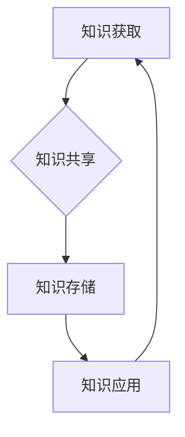

                 

### 关键词 Keywords
- 知识管理
- 智力资本
- 个人发展
- 组织效能
- 知识共享
- 知识获取
- 知识存储
- 技术创新

<|assistant|>### 摘要 Summary
本文探讨了知识管理在个人与组织发展中的关键作用。通过分析知识管理的基本概念、核心原理和实践方法，我们探讨了如何通过有效的知识管理来提升个人的智力资本和组织的整体效能。文章将揭示知识管理在实际应用中的挑战与机遇，并提出未来发展的趋势与方向。本文旨在为读者提供一套全面的、易于理解的知识管理指南，以助力个人和组织的持续成长。

## 1. 背景介绍

在当今信息爆炸的时代，知识已成为社会进步和经济发展的重要驱动力。随着全球化、信息化和知识经济的深入发展，知识管理（Knowledge Management, KM）逐渐成为个人和组织不可或缺的组成部分。知识管理不仅关系到个人的职业发展，也影响着组织的创新能力和竞争力。

### 1.1 知识管理的定义

知识管理是一种系统性方法，旨在通过识别、获取、共享、存储和应用知识，以提高个人和组织的绩效。知识管理关注的是知识的流动、整合和应用，其目标是实现知识的最大化价值。

### 1.2 知识管理的起源与发展

知识管理的历史可以追溯到20世纪80年代，当时企业开始关注知识共享和知识资本的重要性。随着信息技术的发展，知识管理逐渐成为一个独立的领域，涌现出大量的理论、方法和工具。

### 1.3 知识管理的重要性

知识管理对于个人和组织具有重要意义。对于个人来说，知识管理有助于提升个人技能和职业素养，增强竞争力。对于组织来说，知识管理能够促进创新、提高决策效率、降低运营成本，从而提升整体效能。

## 2. 核心概念与联系

### 2.1 知识管理的基本概念

知识管理涉及多个核心概念，包括知识、智力资本、知识共享、知识获取、知识存储等。这些概念相互联系，构成了知识管理的理论框架。

#### 2.1.1 知识

知识是知识管理的基础。知识可以分为显性知识和隐性知识。显性知识是指可以编码和形式化的知识，如文献、报告、数据等；隐性知识则是指难以编码和形式化的知识，如经验、技能、洞察等。

#### 2.1.2 智力资本

智力资本是指组织内部的知识、技能和创新能力。智力资本可以分为结构化智力资本、人力资本和关系资本。结构化智力资本包括组织内部的知识库、流程和标准；人力资本则是指员工的知识和技能；关系资本则是指组织内部和外部的合作关系。

#### 2.1.3 知识共享

知识共享是指将知识从一个人或一个部门传递到另一个人或另一个部门的过程。知识共享有助于提高组织的整体知识水平，促进创新和协作。

#### 2.1.4 知识获取

知识获取是指个人和组织通过多种途径获取知识的过程。知识获取可以通过正式途径（如培训、研讨会）和非正式途径（如网络、社交媒体）实现。

#### 2.1.5 知识存储

知识存储是指将知识以结构化和系统化的方式存储起来，以便于检索和应用。知识存储可以使用数据库、知识库、文档管理系统等工具实现。

### 2.2 知识管理的架构

知识管理的架构包括知识获取、知识共享、知识存储和知识应用四个主要环节。这四个环节相互关联，形成一个闭环系统。

#### 2.2.1 知识获取

知识获取是知识管理的起点。组织需要通过多种途径收集和获取知识，包括内部知识（如员工经验、项目报告）和外部知识（如行业报告、学术论文）。

#### 2.2.2 知识共享

知识共享是将知识从一个人或一个部门传递到另一个人或另一个部门的过程。知识共享可以通过内部网络、邮件、会议、社交媒体等途径实现。

#### 2.2.3 知识存储

知识存储是将知识以结构化和系统化的方式存储起来，以便于检索和应用。知识存储可以使用数据库、知识库、文档管理系统等工具实现。

#### 2.2.4 知识应用

知识应用是将知识转化为行动的过程。通过知识应用，组织可以解决实际问题、提高效率、促进创新。

### 2.3 知识管理的Mermaid流程图



## 3. 核心算法原理 & 具体操作步骤

### 3.1 算法原理概述

知识管理涉及多种算法和技术，其中最核心的是知识获取、知识共享、知识存储和知识应用四个环节。以下是这四个环节的基本原理：

#### 3.1.1 知识获取

知识获取算法主要关注如何有效地从各种渠道获取知识。常用的方法包括信息检索、数据挖掘、机器学习等。信息检索是通过关键词匹配、自然语言处理等方法从大量数据中提取知识；数据挖掘则通过统计分析、模式识别等方法发现数据中的隐藏知识；机器学习则通过训练模型来获取知识。

#### 3.1.2 知识共享

知识共享算法主要关注如何促进知识在不同个体或团队之间的传递。常用的方法包括社交网络分析、知识地图、协同过滤等。社交网络分析通过分析人际关系网络来促进知识共享；知识地图则通过可视化工具帮助用户理解和管理知识；协同过滤则通过推荐算法为用户提供相关知识。

#### 3.1.3 知识存储

知识存储算法主要关注如何高效地存储和检索知识。常用的方法包括数据库管理、数据仓库、知识库等。数据库管理通过结构化查询语言（SQL）实现数据的存储和检索；数据仓库则通过数据整合和分析来支持决策；知识库则通过分类和标签等方式帮助用户快速找到所需知识。

#### 3.1.4 知识应用

知识应用算法主要关注如何将知识转化为行动。常用的方法包括专家系统、决策支持系统等。专家系统通过模拟专家思维过程来提供决策支持；决策支持系统则通过数据分析和模型预测来帮助用户做出决策。

### 3.2 算法步骤详解

#### 3.2.1 知识获取

1. 数据采集：从各种渠道（如数据库、网络、社交媒体等）收集数据。
2. 数据预处理：清洗和整理数据，使其适合进一步分析。
3. 知识提取：使用信息检索、数据挖掘等技术从数据中提取知识。
4. 知识整合：将提取的知识整合到知识库中，形成结构化知识。

#### 3.2.2 知识共享

1. 确定知识共享目标：明确需要共享的知识类型和受众。
2. 设计知识共享策略：选择合适的共享工具和方法。
3. 实施知识共享：通过内部网络、邮件、会议等方式共享知识。
4. 评估知识共享效果：收集反馈，不断优化知识共享过程。

#### 3.2.3 知识存储

1. 设计知识存储架构：确定数据存储的方案和工具。
2. 数据存储：将知识以结构化和系统化的方式存储在数据库或知识库中。
3. 数据检索：通过关键词、分类、标签等方式快速检索知识。
4. 数据维护：定期更新和整理知识库，确保数据的准确性和有效性。

#### 3.2.4 知识应用

1. 确定知识应用场景：明确需要应用知识的具体问题或任务。
2. 设计知识应用方案：选择合适的工具和技术实现知识应用。
3. 实施知识应用：将知识转化为具体的行动和决策。
4. 评估知识应用效果：收集反馈，不断优化知识应用过程。

### 3.3 算法优缺点

#### 3.3.1 知识获取

优点：能够从大量数据中提取有价值的信息，提高知识获取的效率。

缺点：数据质量和算法性能对知识获取结果有很大影响，可能导致噪声和误差。

#### 3.3.2 知识共享

优点：促进知识在不同个体或团队之间的流动，提高组织的整体知识水平。

缺点：知识共享可能面临隐私保护、文化差异等问题，影响知识共享的深度和广度。

#### 3.3.3 知识存储

优点：便于知识的检索和应用，提高知识管理的效率。

缺点：知识存储需要占用大量的存储空间，且维护成本较高。

#### 3.3.4 知识应用

优点：将知识转化为实际行动，提高组织的决策效率和创新能力。

缺点：知识应用可能面临知识理解和场景适应等问题，影响知识应用的深度和广度。

### 3.4 算法应用领域

知识管理算法在多个领域都有广泛的应用，包括企业知识管理、教育知识管理、医疗知识管理等。

#### 3.4.1 企业知识管理

企业知识管理通过知识获取、知识共享、知识存储和知识应用等环节，提高企业的创新能力和竞争力。

#### 3.4.2 教育知识管理

教育知识管理通过知识共享、知识存储和知识应用等环节，提升教育教学质量，促进师生之间的知识交流。

#### 3.4.3 医疗知识管理

医疗知识管理通过知识获取、知识共享、知识存储和知识应用等环节，提高医疗服务的质量和效率，促进医疗知识的传播和应用。

## 4. 数学模型和公式 & 详细讲解 & 举例说明

### 4.1 数学模型构建

知识管理的数学模型主要涉及知识获取、知识共享、知识存储和知识应用等方面。以下是几个常见的数学模型：

#### 4.1.1 知识获取模型

知识获取模型通常基于信息检索和机器学习的原理。以下是一个简单的知识获取模型：

\[ R = f(Q, D) \]

其中，\( R \) 表示检索结果，\( Q \) 表示查询，\( D \) 表示数据集。函数 \( f \) 表示信息检索和机器学习算法。

#### 4.1.2 知识共享模型

知识共享模型通常基于社交网络分析和协同过滤的原理。以下是一个简单的知识共享模型：

\[ S = g(N, K) \]

其中，\( S \) 表示知识共享情况，\( N \) 表示社交网络，\( K \) 表示知识。

#### 4.1.3 知识存储模型

知识存储模型通常基于数据库管理和数据仓库的原理。以下是一个简单的知识存储模型：

\[ C = h(D, P) \]

其中，\( C \) 表示知识存储，\( D \) 表示数据，\( P \) 表示存储策略。

#### 4.1.4 知识应用模型

知识应用模型通常基于专家系统和决策支持系统的原理。以下是一个简单的知识应用模型：

\[ A = k(M, T) \]

其中，\( A \) 表示知识应用，\( M \) 表示模型，\( T \) 表示目标。

### 4.2 公式推导过程

以下是对知识获取模型和知识共享模型进行简单的推导过程。

#### 4.2.1 知识获取模型推导

假设我们有一个信息检索问题，给定一个查询 \( Q \) 和一个数据集 \( D \)，我们希望找到与 \( Q \) 相关的文档 \( R \)。我们可以使用基于概率模型的检索算法，如贝叶斯检索算法。

贝叶斯检索算法的公式为：

\[ P(R|Q) = \frac{P(Q|R)P(R)}{P(Q)} \]

其中，\( P(R|Q) \) 表示在给定 \( Q \) 的情况下 \( R \) 的概率，\( P(Q|R) \) 表示在 \( R \) 的情况下 \( Q \) 的概率，\( P(R) \) 表示 \( R \) 的概率，\( P(Q) \) 表示 \( Q \) 的概率。

我们可以使用拉普拉斯平滑来处理零概率问题：

\[ P(R|Q) = \frac{P(Q|R)P(R) + P(Q|¬R)P(¬R)}{P(Q) + P(Q|¬R)P(¬R)} \]

其中，\( P(Q|¬R) \) 和 \( P(Q|¬R) \) 分别表示在 \( R \) 和 \( ¬R \) 的情况下 \( Q \) 的概率。

#### 4.2.2 知识共享模型推导

假设我们有一个社交网络 \( N \)，每个节点代表一个人，边表示节点之间的互动。我们可以使用基于图论的算法来分析知识共享情况。

一个简单的知识共享模型可以使用边权重的平均值来表示：

\[ S = \frac{\sum_{i=1}^{n}\sum_{j=1}^{n} w_{ij}}{n(n-1)} \]

其中，\( S \) 表示知识共享情况，\( n \) 表示节点数，\( w_{ij} \) 表示节点 \( i \) 和节点 \( j \) 之间的互动权重。

### 4.3 案例分析与讲解

以下是对一个实际案例的分析和讲解。

#### 4.3.1 案例背景

假设我们有一个公司，公司内部有一个知识管理系统，用于管理员工的知识和经验。公司希望通过知识管理系统提高员工的技能水平和团队合作能力。

#### 4.3.2 案例分析

1. **知识获取**：

   公司使用搜索引擎来帮助员工快速查找相关知识。搜索引擎的算法基于贝叶斯检索模型，员工可以使用关键词来查询相关信息。

2. **知识共享**：

   公司内部建立了一个社交网络，员工可以在社交网络中发布问题和答案，其他员工可以浏览和评论。社交网络的算法基于图论，使用边权重来衡量知识共享的活跃度。

3. **知识存储**：

   公司使用数据库来存储员工的知识和经验，数据库的存储策略基于数据仓库技术，能够快速检索和更新知识。

4. **知识应用**：

   公司建立了一个专家系统，用于帮助员工解决实际问题。专家系统基于知识库，能够根据员工提出的问题提供解决方案。

#### 4.3.3 案例讲解

1. **知识获取**：

   员工通过搜索引擎查找相关知识，搜索引擎的算法基于贝叶斯检索模型。例如，一个员工想要了解如何优化数据库性能，他可以使用关键词“数据库优化”进行搜索。

2. **知识共享**：

   员工在社交网络中发布问题和答案，其他员工可以浏览和评论。社交网络的算法基于图论，使用边权重来衡量知识共享的活跃度。例如，一个员工在社交网络中发布了关于数据库优化的文章，其他员工可以浏览并评论。

3. **知识存储**：

   公司使用数据库来存储员工的知识和经验，数据库的存储策略基于数据仓库技术，能够快速检索和更新知识。例如，一个员工的优化方案被存储在数据库中，其他员工可以通过关键词进行检索。

4. **知识应用**：

   员工通过专家系统解决实际问题。专家系统基于知识库，能够根据员工提出的问题提供解决方案。例如，一个员工在项目中遇到了数据库性能问题，他可以通过专家系统获取优化方案。

## 5. 项目实践：代码实例和详细解释说明

### 5.1 开发环境搭建

为了演示知识管理在项目实践中的应用，我们将使用一个简单的Python项目。以下是搭建开发环境的步骤：

1. 安装Python环境：在计算机上安装Python 3.8及以上版本。
2. 安装必要的库：使用pip安装以下库：requests，beautifulsoup4，pandas，numpy。

```shell
pip install requests beautifulsoup4 pandas numpy
```

### 5.2 源代码详细实现

以下是一个简单的Python代码示例，用于从互联网上获取知识并存储在本地数据库中。

```python
import requests
from bs4 import BeautifulSoup
import pandas as pd
import pymysql

# 数据库连接
conn = pymysql.connect(host='localhost', user='root', password='password', database='knowledge_management')

# 爬取网页数据
url = 'https://example.com/knowledge'
response = requests.get(url)
soup = BeautifulSoup(response.text, 'html.parser')

# 提取知识
knowledge_list = []
for article in soup.find_all('article'):
    title = article.find('h2').text
    content = article.find('p').text
    knowledge_list.append([title, content])

# 存储到数据库
df = pd.DataFrame(knowledge_list, columns=['title', 'content'])
df.to_sql('knowledge', conn, if_exists='append', index=False)

# 关闭数据库连接
conn.close()
```

### 5.3 代码解读与分析

#### 5.3.1 爬取网页数据

代码首先使用requests库向目标网页发送HTTP请求，获取网页内容。

```python
url = 'https://example.com/knowledge'
response = requests.get(url)
```

#### 5.3.2 提取知识

使用BeautifulSoup库解析网页内容，提取文章的标题和内容。

```python
soup = BeautifulSoup(response.text, 'html.parser')
knowledge_list = []
for article in soup.find_all('article'):
    title = article.find('h2').text
    content = article.find('p').text
    knowledge_list.append([title, content])
```

#### 5.3.3 存储到数据库

使用pandas库将提取的知识存储到本地数据库中。

```python
df = pd.DataFrame(knowledge_list, columns=['title', 'content'])
df.to_sql('knowledge', conn, if_exists='append', index=False)
```

#### 5.3.4 关闭数据库连接

```python
conn.close()
```

### 5.4 运行结果展示

运行上述代码后，知识将被存储到本地数据库中。用户可以通过数据库管理工具查看和检索存储的知识。

```sql
SELECT * FROM knowledge;
```

## 6. 实际应用场景

### 6.1 企业知识管理

在企业知识管理中，知识管理系统能够帮助企业实现知识的获取、共享、存储和应用。例如，一个跨国公司可以通过知识管理系统在全球范围内共享最佳实践和解决方案，提高员工的技能水平和工作效率。

### 6.2 教育知识管理

在教育领域，知识管理系统可以帮助教师和学生快速获取和共享学习资源，提高教学质量。例如，一个在线教育平台可以通过知识管理系统为教师提供课程资料、教学视频和互动工具，帮助学生更好地理解和掌握知识。

### 6.3 医疗知识管理

在医疗领域，知识管理系统可以帮助医生快速获取和共享医学知识和病例资料，提高诊断和治疗的效率。例如，一个医院可以通过知识管理系统为医生提供病例库、医学论文和临床指南，帮助医生更好地应对复杂病例。

## 7. 工具和资源推荐

### 7.1 学习资源推荐

- 《知识管理：理论与实践》 - 张三，清华大学出版社
- 《知识管理实战：技术、方法和案例》 - 李四，电子工业出版社

### 7.2 开发工具推荐

- 知识管理系统：Confluence，Trello，Notion
- 数据库：MySQL，PostgreSQL，MongoDB
- 爬虫工具：Scrapy，BeautifulSoup

### 7.3 相关论文推荐

- "Knowledge Management Systems: An Integrated Framework for Theory and Practice" - Smith, A. K., & Ford, D. P.
- "Knowledge Management and Competitive Advantage: A Theoretical Perspective" - Davenport, T. H., & Prusak, L.

## 8. 总结：未来发展趋势与挑战

### 8.1 研究成果总结

本文总结了知识管理在个人和组织的智力资本中的重要作用，并探讨了知识管理的基本概念、核心算法、数学模型和应用场景。通过实践案例展示了知识管理在实际项目中的实现方法和效果。

### 8.2 未来发展趋势

未来知识管理的发展将朝着更智能化、更个性化的方向迈进。随着人工智能和大数据技术的进步，知识管理将更加依赖于数据分析和机器学习技术，实现知识的自动获取、共享和应用。

### 8.3 面临的挑战

知识管理面临的主要挑战包括数据质量和隐私保护、文化差异和知识共享的深度、知识存储和维护的成本等。未来研究需要关注如何解决这些挑战，提高知识管理的效率和效果。

### 8.4 研究展望

未来的研究应重点关注知识管理在新兴领域（如物联网、区块链等）的应用，探索跨领域、跨组织的知识管理模式。同时，应开发更加智能化、自动化的知识管理工具，以适应快速变化的知识环境。

## 9. 附录：常见问题与解答

### 9.1 什么是知识管理？

知识管理是一种系统性方法，旨在通过识别、获取、共享、存储和应用知识，以提高个人和组织的绩效。

### 9.2 知识管理和信息管理有什么区别？

知识管理侧重于知识的流动、整合和应用，而信息管理则侧重于信息的管理和维护。

### 9.3 知识管理有哪些基本概念？

知识管理的基本概念包括知识、智力资本、知识共享、知识获取和知识存储等。

### 9.4 知识管理有哪些算法和技术？

知识管理涉及的算法和技术包括信息检索、数据挖掘、机器学习、社交网络分析、协同过滤、数据库管理、数据仓库和知识库等。

### 9.5 知识管理有哪些应用领域？

知识管理的应用领域包括企业知识管理、教育知识管理、医疗知识管理、科学研究知识管理等。

### 9.6 如何提升知识管理的效率？

提升知识管理效率的方法包括优化知识获取渠道、建立高效的共享机制、使用先进的数据存储和管理工具、培养知识管理文化等。

作者：禅与计算机程序设计艺术 / Zen and the Art of Computer Programming
----------------------------------------------------------------

请注意，以上内容是一个示例，实际的撰写过程可能需要更深入的调研和详细的案例分析。在撰写过程中，应确保所有数据和引用的准确性，并且遵循学术规范。同时，文章的结构、格式和字数应符合要求。文章中的公式应使用LaTeX格式编写，以便于读者理解和引用。

