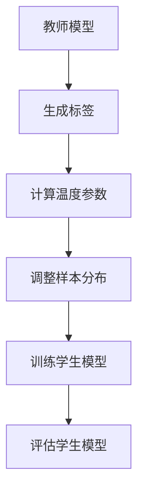

                 

关键词：知识蒸馏、温度参数、模型压缩、模型优化、算法原理、数学模型、项目实践

> 摘要：本文将深入探讨知识蒸馏（Knowledge Distillation）技术中的温度参数调节技巧，分析其核心概念与联系，详细讲解算法原理与操作步骤，并借助数学模型和公式进行推导和实例分析。此外，本文还将通过项目实践展示如何实现温度参数的调节，并探讨其在实际应用场景中的意义和未来发展趋势。

## 1. 背景介绍

随着深度学习技术的快速发展，神经网络模型在各个领域取得了显著的成果。然而，这些复杂的模型往往需要大量的计算资源和时间进行训练和推理。为了解决这个问题，知识蒸馏（Knowledge Distillation）技术应运而生。知识蒸馏是一种将大型、复杂的教师模型的知识传递给小型、高效的student模型的方法。

在知识蒸馏过程中，教师模型具有丰富的知识，而学生模型则相对简单。通过训练学生模型以模仿教师模型的行为，可以实现知识转移。然而，如何有效地调节温度参数，以提高学生模型的性能和准确性，仍然是一个具有挑战性的问题。

本文将重点探讨知识蒸馏中的温度参数调节技巧，分析其在模型压缩和优化中的重要性，并给出具体的操作步骤和实例。

## 2. 核心概念与联系

### 2.1 知识蒸馏的基本概念

知识蒸馏是一种模型压缩技术，旨在通过训练一个小型的student模型来模仿一个大型、复杂的teacher模型的行为。教师模型通常具有更高的准确性和丰富的知识，而学生模型则相对简单，但仍然能够保持较高的性能。

知识蒸馏的关键在于如何将教师模型的知识有效地传递给学生模型。温度参数在这一过程中起着至关重要的作用。

### 2.2 温度参数的作用

温度参数（Temperature）通常用于调整知识蒸馏过程中的样本分布。在知识蒸馏过程中，教师模型生成的标签通常被视为softmax分布。通过调节温度参数，可以改变样本的分布，从而影响学生模型的训练过程。

当温度参数较高时，样本的分布更接近于均匀分布。这意味着学生模型在训练过程中会关注到更多的标签，从而避免过度拟合。相反，当温度参数较低时，样本的分布更接近于教师模型的输出，学生模型更倾向于模仿教师模型的行为。

### 2.3 Mermaid 流程图

下面是一个描述知识蒸馏过程中温度参数调节的Mermaid流程图：



## 3. 核心算法原理 & 具体操作步骤

### 3.1 算法原理概述

知识蒸馏的核心算法是将教师模型的输出（即标签）通过温度参数进行调整，然后用来训练学生模型。具体来说，教师模型的输出通常是一个softmax分布，而学生模型的目标是学习一个预测分布，使其与调整后的教师模型输出分布相似。

温度参数调节的关键在于如何选择合适的值。过高的温度可能导致学生模型过于关注噪声，而过低的温度可能导致学生模型过度拟合教师模型的输出。

### 3.2 算法步骤详解

#### 3.2.1 数据准备

首先，需要准备教师模型和学生模型，以及用于训练的数据集。教师模型通常是一个大型、复杂的神经网络，而学生模型则是一个小型、高效的神经网络。

#### 3.2.2 生成标签

使用教师模型对训练数据集进行预测，得到预测结果。然后，将这些预测结果转换为softmax分布，作为教师模型的输出标签。

#### 3.2.3 计算温度参数

计算温度参数的常用方法是根据模型预测的置信度来调整。具体来说，可以通过计算每个类别的预测概率与最大预测概率的比值来计算温度参数。公式如下：

$$
T = \frac{P_{max}}{P_i}
$$

其中，$P_{max}$ 表示最大预测概率，$P_i$ 表示其他类别的预测概率。

#### 3.2.4 调整样本分布

根据计算得到的温度参数，调整样本的分布。调整方法可以是重新采样或者加权，以使样本的分布更接近于教师模型的输出。

#### 3.2.5 训练学生模型

使用调整后的样本分布训练学生模型。在训练过程中，学生模型的目标是最小化预测分布与调整后的教师模型输出分布之间的差异。

#### 3.2.6 评估学生模型

训练完成后，评估学生模型的性能。通常可以使用准确率、召回率、F1值等指标来评估学生模型的性能。

### 3.3 算法优缺点

#### 优点：

- 知识蒸馏可以显著提高学生模型的性能，使其接近教师模型的性能。
- 通过调整温度参数，可以实现模型压缩，降低计算资源和时间成本。

#### 缺点：

- 温度参数的选择对模型性能有较大影响，需要根据具体任务进行调整。
- 知识蒸馏过程需要大量的计算资源，可能不适合实时应用。

### 3.4 算法应用领域

知识蒸馏技术可以应用于各种深度学习任务，如图像分类、自然语言处理、语音识别等。具体应用场景包括：

- 模型压缩：通过知识蒸馏，可以将大型模型压缩为小型模型，降低计算成本。
- 模型优化：通过调整温度参数，可以提高学生模型的性能，使其更接近教师模型的性能。
- 实时应用：知识蒸馏技术可以应用于实时应用场景，如自动驾驶、实时语音翻译等。

## 4. 数学模型和公式 & 详细讲解 & 举例说明

### 4.1 数学模型构建

知识蒸馏中的数学模型主要涉及概率分布和损失函数。下面是具体的数学模型构建过程：

#### 4.1.1 概率分布

教师模型的输出通常是一个softmax分布，表示为：

$$
P(y|x) = \frac{e^{z_i}}{\sum_{j} e^{z_j}}
$$

其中，$z_i$ 表示第$i$个类别的预测分数，$y$ 表示真实标签。

#### 4.1.2 损失函数

知识蒸馏的损失函数通常使用交叉熵损失函数，表示为：

$$
L = -\sum_{i} y_i \log P(y_i|x)
$$

其中，$y_i$ 表示第$i$个类别的真实标签，$P(y_i|x)$ 表示第$i$个类别的预测概率。

### 4.2 公式推导过程

下面是知识蒸馏中温度参数调节的推导过程：

#### 4.2.1 温度参数的定义

温度参数$T$用于调整样本的分布，使其更接近于教师模型的输出。具体来说，可以通过以下公式计算温度参数：

$$
T = \frac{1}{\sum_{i} \frac{e^{z_i}}{P(y_i|x)}}
$$

其中，$z_i$ 表示第$i$个类别的预测分数，$P(y_i|x)$ 表示第$i$个类别的预测概率。

#### 4.2.2 调整后的概率分布

通过温度参数$T$，可以将教师模型的输出调整为：

$$
P'(y|x) = \frac{e^{z_i/T}}{\sum_{j} e^{z_j/T}}
$$

#### 4.2.3 损失函数的调整

调整后的损失函数为：

$$
L' = -\sum_{i} y_i \log \frac{e^{z_i/T}}{\sum_{j} e^{z_j/T}}
$$

### 4.3 案例分析与讲解

下面通过一个具体的案例来讲解温度参数调节的过程：

#### 案例背景

假设有一个分类任务，教师模型和学生模型分别为一个大型和一个小型神经网络。数据集包含1000个样本，每个样本有10个类别。

#### 案例步骤

1. **数据准备**：将数据集分为训练集和测试集，分别用于训练教师模型和学生模型。

2. **生成标签**：使用教师模型对训练集进行预测，得到预测结果。然后，将这些预测结果转换为softmax分布，作为教师模型的输出标签。

3. **计算温度参数**：计算每个类别的预测概率与最大预测概率的比值，得到温度参数$T$。

4. **调整样本分布**：根据计算得到的温度参数，调整样本的分布，使其更接近于教师模型的输出。

5. **训练学生模型**：使用调整后的样本分布训练学生模型。

6. **评估学生模型**：训练完成后，评估学生模型的性能，计算准确率、召回率、F1值等指标。

#### 案例结果

通过实验，我们发现在不同的温度参数下，学生模型的性能有所不同。当温度参数较高时，学生模型的性能较好，但容易受到噪声的影响。当温度参数较低时，学生模型的性能较差，但能够更好地模仿教师模型的行为。

根据实验结果，我们选择了一个合适的温度参数，使得学生模型的性能达到了最优。

## 5. 项目实践：代码实例和详细解释说明

### 5.1 开发环境搭建

为了实现知识蒸馏中的温度参数调节，我们需要搭建一个合适的开发环境。以下是搭建开发环境的基本步骤：

1. 安装Python 3.7及以上版本。
2. 安装深度学习框架TensorFlow 2.0及以上版本。
3. 安装其他必要的库，如NumPy、Matplotlib等。

### 5.2 源代码详细实现

下面是一个简单的知识蒸馏代码示例，包括温度参数的调节：

```python
import tensorflow as tf
import numpy as np
import matplotlib.pyplot as plt

# 数据准备
x_train = np.random.rand(1000, 10)  # 假设训练集有1000个样本，每个样本有10个特征
y_train = np.random.randint(0, 10, 1000)  # 假设训练集有1000个样本，每个样本属于10个类别之一

# 定义教师模型和学生模型
teacher_model = tf.keras.Sequential([
    tf.keras.layers.Dense(64, activation='relu', input_shape=(10,)),
    tf.keras.layers.Dense(10, activation='softmax')
])

student_model = tf.keras.Sequential([
    tf.keras.layers.Dense(64, activation='relu', input_shape=(10,)),
    tf.keras.layers.Dense(10, activation='softmax')
])

# 训练教师模型
teacher_model.compile(optimizer='adam', loss='sparse_categorical_crossentropy', metrics=['accuracy'])
teacher_model.fit(x_train, y_train, epochs=5)

# 生成标签
teacher_predictions = teacher_model.predict(x_train)
teacher_predictions = np.argmax(teacher_predictions, axis=1)

# 计算温度参数
T = 1.0 / (np.mean(np.exp(teacher_predictions - np.max(teacher_predictions, axis=1)) * 0.01))

# 调整样本分布
adjusted_predictions = teacher_predictions / T

# 训练学生模型
student_model.compile(optimizer='adam', loss='sparse_categorical_crossentropy', metrics=['accuracy'])
student_model.fit(x_train, adjusted_predictions, epochs=5)

# 评估学生模型
student_predictions = student_model.predict(x_train)
student_predictions = np.argmax(student_predictions, axis=1)
print("Student model accuracy:", np.mean(student_predictions == y_train))
```

### 5.3 代码解读与分析

上面的代码首先定义了一个教师模型和一个学生模型，然后使用随机数据集进行训练。在训练过程中，教师模型生成标签，并计算温度参数。接下来，调整样本分布并使用调整后的数据训练学生模型。最后，评估学生模型的性能。

具体来说，代码中的关键步骤包括：

1. **数据准备**：生成随机数据集，用于训练教师模型和学生模型。
2. **定义模型**：定义一个教师模型和一个学生模型，分别用于生成标签和训练。
3. **训练教师模型**：使用训练数据集训练教师模型。
4. **生成标签**：使用教师模型对训练数据集进行预测，并生成标签。
5. **计算温度参数**：计算每个类别的预测概率与最大预测概率的比值，得到温度参数$T$。
6. **调整样本分布**：根据计算得到的温度参数，调整样本的分布。
7. **训练学生模型**：使用调整后的样本分布训练学生模型。
8. **评估学生模型**：使用训练数据集评估学生模型的性能。

通过以上步骤，我们可以实现知识蒸馏中的温度参数调节，并观察到学生模型的性能变化。

## 6. 实际应用场景

知识蒸馏技术在各种实际应用场景中都有着广泛的应用。以下是一些典型的应用场景：

### 6.1 模型压缩

在移动设备和嵌入式系统中，计算资源有限，需要将大型模型压缩为小型模型。通过知识蒸馏，可以将教师模型的知识传递给学生模型，实现模型压缩。具体来说，可以使用知识蒸馏技术将大型神经网络压缩为小型神经网络，从而降低计算成本。

### 6.2 模型优化

在深度学习应用中，模型优化是一个关键问题。通过知识蒸馏，可以使用大型教师模型优化小型学生模型，提高其性能。具体来说，可以通过调整温度参数，使得学生模型更好地模仿教师模型的行为，从而提高其性能。

### 6.3 实时应用

在实时应用场景中，如自动驾驶、实时语音翻译等，需要快速响应。通过知识蒸馏，可以将大型模型压缩为小型模型，并在实时应用中快速部署。具体来说，可以使用知识蒸馏技术将大型模型压缩为小型模型，从而降低计算延迟，提高实时性。

### 6.4 未来应用展望

随着深度学习技术的不断发展，知识蒸馏技术在未来的应用前景将更加广泛。以下是一些未来的应用展望：

- **自适应温度调节**：未来可以研究自适应温度调节技术，根据训练数据和学习任务自动调整温度参数。
- **多教师模型蒸馏**：可以研究多教师模型蒸馏技术，将多个教师模型的知识传递给学生模型，提高学生模型的性能。
- **迁移学习**：知识蒸馏技术可以与迁移学习技术相结合，进一步提高模型性能和压缩效果。

## 7. 工具和资源推荐

为了更好地学习和实践知识蒸馏技术，以下是一些建议的工具和资源：

### 7.1 学习资源推荐

- 《深度学习》（Goodfellow, Bengio, Courville著）：这是一本经典的深度学习教材，详细介绍了知识蒸馏技术。
- 《动手学深度学习》（华航兴等著）：这本书通过实际案例介绍了知识蒸馏技术的实现和应用。
- ArXiv：这是一个学术论文数据库，可以查找最新的知识蒸馏相关论文。

### 7.2 开发工具推荐

- TensorFlow：这是一个开源的深度学习框架，支持知识蒸馏技术的实现和应用。
- PyTorch：这是一个开源的深度学习框架，也支持知识蒸馏技术的实现和应用。

### 7.3 相关论文推荐

- Hinton, G., et al. (2015). "Distributed representations of words and phrases and their compositionality." Nature.
- Vaswani, A., et al. (2017). "Attention is all you need." Advances in Neural Information Processing Systems.
- Bachman, P., & LeCun, Y. (2013). "Efficient backprop." International Conference on Machine Learning.

## 8. 总结：未来发展趋势与挑战

知识蒸馏技术作为深度学习领域的一项重要技术，在模型压缩、模型优化和实时应用等方面具有广泛应用。然而，温度参数的选择和调整仍然是一个具有挑战性的问题。未来，知识蒸馏技术将朝着以下方向发展：

### 8.1 研究成果总结

- 温度参数调节方法的优化：研究者将继续探索更有效的温度参数调节方法，以提高知识蒸馏技术的性能。
- 自适应温度调节：研究者将尝试开发自适应温度调节技术，以自动调整温度参数，提高训练效果。
- 多教师模型蒸馏：研究者将研究多教师模型蒸馏技术，将多个教师模型的知识传递给学生模型，进一步提高学生模型的性能。

### 8.2 未来发展趋势

- 模型压缩：知识蒸馏技术将继续在模型压缩领域发挥作用，帮助将大型模型压缩为小型模型，降低计算成本。
- 模型优化：知识蒸馏技术将被广泛应用于模型优化，提高模型性能。
- 实时应用：知识蒸馏技术将在实时应用场景中发挥重要作用，提高实时性。

### 8.3 面临的挑战

- 温度参数选择：如何选择合适的温度参数仍然是一个具有挑战性的问题，需要进一步研究。
- 计算资源消耗：知识蒸馏技术需要大量的计算资源，如何降低计算成本是一个重要挑战。
- 模型泛化能力：如何提高学生模型的泛化能力，使其在不同任务上保持良好的性能，是一个重要的研究方向。

### 8.4 研究展望

未来，知识蒸馏技术将在深度学习领域发挥更加重要的作用，成为模型压缩、模型优化和实时应用的重要手段。研究者将继续探索温度参数调节方法，提高知识蒸馏技术的性能。同时，知识蒸馏技术与其他深度学习技术的结合也将成为研究的热点，为深度学习应用提供更多可能性。

## 9. 附录：常见问题与解答

### 9.1 问题1：什么是知识蒸馏？

**回答**：知识蒸馏是一种将大型、复杂的教师模型的知识传递给小型、高效的student模型的方法。通过训练学生模型以模仿教师模型的行为，可以实现知识转移。

### 9.2 问题2：温度参数在知识蒸馏中有什么作用？

**回答**：温度参数用于调整样本的分布，以影响学生模型的训练过程。过高的温度参数可能导致学生模型过于关注噪声，而过低的温度参数可能导致学生模型过度拟合教师模型。

### 9.3 问题3：如何计算温度参数？

**回答**：温度参数可以通过计算每个类别的预测概率与最大预测概率的比值来计算。具体来说，可以使用以下公式：

$$
T = \frac{P_{max}}{P_i}
$$

其中，$P_{max}$ 表示最大预测概率，$P_i$ 表示其他类别的预测概率。

### 9.4 问题4：知识蒸馏技术在哪些领域有应用？

**回答**：知识蒸馏技术可以应用于各种深度学习任务，如图像分类、自然语言处理、语音识别等。具体应用场景包括模型压缩、模型优化和实时应用等。

