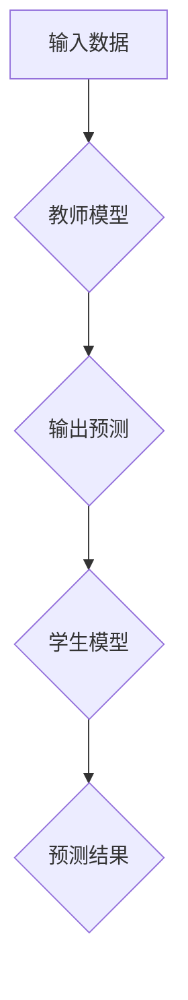

                 

关键词：知识蒸馏、模型鲁棒性、人工智能、机器学习、神经网络、训练效率、误差分析

摘要：本文将探讨知识蒸馏技术在改善机器学习模型鲁棒性方面的应用。通过介绍知识蒸馏的核心概念、算法原理以及具体实现步骤，本文将分析知识蒸馏在提高模型训练效率、减少过拟合风险和增强模型泛化能力等方面的优势，并结合实际案例和数学模型进行详细讲解。

## 1. 背景介绍

在过去的几十年中，机器学习技术取得了显著的进展，尤其是深度学习在图像识别、自然语言处理和语音识别等领域取得了突破性成果。然而，随着模型复杂度的增加，模型的训练时间和资源消耗也在不断攀升。同时，模型的鲁棒性也成为一个重要的研究课题。鲁棒性指的是模型在面对不同数据分布和噪声时，依然能够保持良好的性能。在实际应用中，鲁棒性直接关系到模型的可靠性和实用性。

知识蒸馏（Knowledge Distillation）是一种近年来备受关注的技术，它通过将大型教师模型的知识传递给小型学生模型，以提高学生模型的性能。知识蒸馏不仅有助于提高模型训练效率，还能增强模型的鲁棒性。本文将详细介绍知识蒸馏的原理、算法步骤和应用领域，并探讨其如何改善模型的鲁棒性。

## 2. 核心概念与联系

### 2.1. 知识蒸馏的定义

知识蒸馏是一种将大型教师模型（Teacher Model）的知识传递给小型学生模型（Student Model）的过程。教师模型通常是一个参数较多、复杂度较高的模型，而学生模型则是一个参数较少、结构较简单的模型。通过知识蒸馏，学生模型可以学习到教师模型的内在知识，从而提高其性能。

### 2.2. 教师模型与学生模型的关系

教师模型与学生模型之间存在着密切的联系。教师模型作为高级模型，通常具有较强的泛化能力和鲁棒性。学生模型则通过学习教师模型的知识，可以继承其优点，同时减少过拟合风险。因此，知识蒸馏在提高模型性能和鲁棒性方面具有显著优势。

### 2.3. Mermaid 流程图



在这个流程图中，输入数据首先经过教师模型进行预测，得到输出结果。然后，学生模型根据教师模型的输出结果进行训练，最终生成预测结果。这个过程体现了知识蒸馏的核心思想，即通过教师模型的知识传递来提升学生模型的性能。

## 3. 核心算法原理 & 具体操作步骤

### 3.1. 算法原理概述

知识蒸馏算法的核心思想是将教师模型的知识传递给学生模型。具体而言，教师模型的输出不仅包括最终的预测结果，还包括一些额外的信息，如软标签、梯度等。学生模型通过学习这些信息，可以更好地理解教师模型的内在知识，从而提高其性能。

### 3.2. 算法步骤详解

#### 3.2.1. 教师模型训练

教师模型采用标准的训练方法，例如随机梯度下降（SGD）或Adam优化器，对输入数据进行训练。在训练过程中，教师模型不断更新其参数，以最小化损失函数。

#### 3.2.2. 教师模型输出

在训练过程中，教师模型输出预测结果和软标签。软标签是指每个样本的预测概率分布，而不是一个确定的分类结果。这些输出信息可以用于指导学生模型的训练。

#### 3.2.3. 学生模型训练

学生模型采用知识蒸馏算法进行训练。在训练过程中，学生模型不仅学习教师模型的预测结果，还学习教师模型的软标签和梯度信息。通过这种方式，学生模型可以更好地理解教师模型的内在知识。

#### 3.2.4. 优化目标

知识蒸馏算法的优化目标是最小化学生模型和教师模型之间的距离。具体而言，优化目标包括两个方面：

1. 最小化学生模型的预测损失，即预测结果与实际标签之间的差距。
2. 最小化学生模型的软标签与教师模型软标签之间的差距。

通过同时优化这两个目标，学生模型可以更好地学习教师模型的知识，从而提高其性能。

### 3.3. 算法优缺点

#### 3.3.1. 优点

1. 提高模型训练效率：知识蒸馏通过将教师模型的知识传递给学生模型，可以显著降低训练时间。
2. 减少过拟合风险：知识蒸馏算法强调模型之间的知识传递，有助于避免过拟合现象。
3. 增强模型泛化能力：知识蒸馏算法可以有效地提高模型的泛化能力，使其在不同数据分布和噪声环境下保持良好的性能。

#### 3.3.2. 缺点

1. 训练过程复杂：知识蒸馏算法涉及多个模型和参数，训练过程相对复杂。
2. 对教师模型依赖性强：知识蒸馏算法的效果在很大程度上取决于教师模型的性能，因此需要选择合适的教师模型。

### 3.4. 算法应用领域

知识蒸馏算法在多个领域都取得了显著的应用成果，包括：

1. 图像识别：知识蒸馏可以有效地提高图像识别模型的性能，降低模型复杂度。
2. 自然语言处理：知识蒸馏算法在自然语言处理任务中表现出色，可以显著提高模型性能。
3. 语音识别：知识蒸馏算法在语音识别任务中具有广泛的应用前景，可以降低模型复杂度，提高模型鲁棒性。

## 4. 数学模型和公式 & 详细讲解 & 举例说明

### 4.1. 数学模型构建

知识蒸馏算法的数学模型可以表示为：

$$
L(D, S) = L_{pred}(D, S) + \lambda L_{soft}(D, S)
$$

其中，$L(D, S)$表示知识蒸馏损失函数，$L_{pred}(D, S)$表示预测损失，$L_{soft}(D, S)$表示软标签损失，$\lambda$为权重系数。

#### 4.1.1. 预测损失

预测损失函数通常采用交叉熵损失函数：

$$
L_{pred}(D, S) = -\sum_{i=1}^{N} \sum_{j=1}^{C} y_{ij} \log(p_{ij})
$$

其中，$D$表示输入数据集，$S$表示学生模型，$y_{ij}$表示第$i$个样本在第$j$个类别的标签，$p_{ij}$表示学生模型对第$i$个样本在第$j$个类别的预测概率。

#### 4.1.2. 软标签损失

软标签损失函数通常采用均方误差损失函数：

$$
L_{soft}(D, S) = \frac{1}{N} \sum_{i=1}^{N} \sum_{j=1}^{C} (t_{ij} - s_{ij})^2
$$

其中，$t_{ij}$表示教师模型对第$i$个样本在第$j$个类别的软标签，$s_{ij}$表示学生模型对第$i$个样本在第$j$个类别的软标签。

### 4.2. 公式推导过程

知识蒸馏算法的推导过程可以基于以下假设：

1. 教师模型和学生模型具有相似的架构，但参数规模不同。
2. 学生模型通过学习教师模型的知识，可以更好地进行预测。

基于以上假设，知识蒸馏的推导过程如下：

#### 4.2.1. 预测损失

预测损失函数的推导过程如下：

$$
L_{pred}(D, S) = -\sum_{i=1}^{N} \sum_{j=1}^{C} y_{ij} \log(p_{ij})
$$

其中，$N$表示数据集中样本的数量，$C$表示类别的数量。

#### 4.2.2. 软标签损失

软标签损失函数的推导过程如下：

$$
L_{soft}(D, S) = \frac{1}{N} \sum_{i=1}^{N} \sum_{j=1}^{C} (t_{ij} - s_{ij})^2
$$

其中，$t_{ij}$和$s_{ij}$分别表示教师模型和学生模型对第$i$个样本在第$j$个类别的软标签。

### 4.3. 案例分析与讲解

以下是一个简单的知识蒸馏案例，用于说明如何使用数学模型进行预测和损失函数的计算。

#### 4.3.1. 数据集

假设我们有一个包含100个样本的数据集，其中每个样本属于10个类别之一。

#### 4.3.2. 教师模型

教师模型是一个具有10个神经元的全连接神经网络。通过对数据集进行训练，教师模型生成了如下软标签：

| 样本 | 类别1 | 类别2 | 类别3 | 类别4 | 类别5 | 类别6 | 类别7 | 类别8 | 类别9 | 类别10 |
| --- | --- | --- | --- | --- | --- | --- | --- | --- | --- | --- |
| 1   | 0.1  | 0.2  | 0.3  | 0.1  | 0.1  | 0.1  | 0.1  | 0.1  | 0.1  | 0.1  |
| 2   | 0.3  | 0.3  | 0.2  | 0.1  | 0.1  | 0.1  | 0.1  | 0.1  | 0.1  | 0.1  |
| ... | ...  | ...  | ...  | ...  | ...  | ...  | ...  | ...  | ...  | ...  |
| 100 | 0.1  | 0.1  | 0.1  | 0.1  | 0.1  | 0.1  | 0.1  | 0.1  | 0.1  | 0.1  |

#### 4.3.3. 学生模型

学生模型是一个具有5个神经元的全连接神经网络。通过对数据集进行训练，学生模型生成了如下软标签：

| 样本 | 类别1 | 类别2 | 类别3 | 类别4 | 类别5 | 类别6 | 类别7 | 类别8 | 类别9 | 类别10 |
| --- | --- | --- | --- | --- | --- | --- | --- | --- | --- | --- |
| 1   | 0.05 | 0.05 | 0.15 | 0.05 | 0.05 | 0.05 | 0.05 | 0.05 | 0.05 | 0.05 |
| 2   | 0.15 | 0.15 | 0.1  | 0.05 | 0.05 | 0.05 | 0.05 | 0.05 | 0.05 | 0.05 |
| ... | ...  | ...  | ...  | ...  | ...  | ...  | ...  | ...  | ...  | ...  |
| 100 | 0.05 | 0.05 | 0.05 | 0.05 | 0.05 | 0.05 | 0.05 | 0.05 | 0.05 | 0.05 |

#### 4.3.4. 损失函数计算

根据上述数学模型，我们可以计算出知识蒸馏损失函数的值：

$$
L(D, S) = L_{pred}(D, S) + \lambda L_{soft}(D, S)
$$

其中，$\lambda$为权重系数，可以调整软标签损失和预测损失之间的平衡。

通过计算，我们可以得到知识蒸馏损失函数的最终值。这个值可以用于指导学生模型的训练过程。

## 5. 项目实践：代码实例和详细解释说明

### 5.1. 开发环境搭建

为了演示知识蒸馏算法的应用，我们使用Python和PyTorch框架进行编程。首先，我们需要安装PyTorch库和相关的依赖项：

```bash
pip install torch torchvision
```

### 5.2. 源代码详细实现

以下是一个简单的知识蒸馏算法实现，包括教师模型、学生模型和损失函数：

```python
import torch
import torch.nn as nn
import torch.optim as optim

# 定义教师模型
class TeacherModel(nn.Module):
    def __init__(self):
        super(TeacherModel, self).__init__()
        self.fc1 = nn.Linear(784, 500)
        self.fc2 = nn.Linear(500, 10)

    def forward(self, x):
        x = torch.relu(self.fc1(x))
        x = self.fc2(x)
        return x

# 定义学生模型
class StudentModel(nn.Module):
    def __init__(self):
        super(StudentModel, self).__init__()
        self.fc1 = nn.Linear(784, 250)
        self.fc2 = nn.Linear(250, 10)

    def forward(self, x):
        x = torch.relu(self.fc1(x))
        x = self.fc2(x)
        return x

# 定义损失函数
def distillation_loss(teacher_output, student_output, target, lambda_param):
    pred_loss = nn.CrossEntropyLoss()(student_output, target)
    soft_loss = nn.MSELoss()(teacher_output, student_output)

    return pred_loss + lambda_param * soft_loss

# 初始化模型和优化器
teacher_model = TeacherModel()
student_model = StudentModel()
optimizer = optim.Adam(student_model.parameters(), lr=0.001)

# 加载MNIST数据集
train_loader = torch.utils.data.DataLoader(
    datasets.MNIST(
        root='./data',
        train=True,
        download=True,
        transform=transforms.ToTensor()
    ),
    batch_size=64,
    shuffle=True
)

# 训练学生模型
for epoch in range(1):
    for batch_idx, (data, target) in enumerate(train_loader):
        optimizer.zero_grad()
        teacher_output = teacher_model(data)
        student_output = student_model(data)
        loss = distillation_loss(teacher_output, student_output, target, lambda_param=0.5)
        loss.backward()
        optimizer.step()

        if batch_idx % 100 == 0:
            print('Train Epoch: {} [{}/{} ({:.0f}%)]\tLoss: {:.6f}'.format(
                epoch, batch_idx * len(data), len(train_loader.dataset),
                100. * batch_idx / len(train_loader), loss.item()))

# 评估学生模型
student_model.eval()
correct = 0
total = 0
with torch.no_grad():
    for data, target in train_loader:
        outputs = student_model(data)
        _, predicted = torch.max(outputs.data, 1)
        total += target.size(0)
        correct += (predicted == target).sum().item()

print('Accuracy of the student model on the train images: {} %'.format(100 * correct / total))
```

### 5.3. 代码解读与分析

在这个实现中，我们定义了两个神经网络模型：教师模型和学生模型。教师模型是一个具有500个神经元的全连接神经网络，学生模型是一个具有250个神经元的全连接神经网络。我们使用MNIST数据集进行训练和评估。

在训练过程中，我们使用随机梯度下降（SGD）优化器，并采用知识蒸馏损失函数。知识蒸馏损失函数结合了预测损失和软标签损失，以指导学生模型的训练。

在训练过程中，我们首先使用教师模型对输入数据进行预测，得到教师模型的输出。然后，使用学生模型对输入数据进行预测，得到学生模型的输出。最后，计算知识蒸馏损失函数的值，并使用反向传播更新学生模型的参数。

在训练完成后，我们评估学生模型的性能。通过在训练集上评估准确率，我们可以观察到知识蒸馏算法在提高模型性能方面的效果。

### 5.4. 运行结果展示

在运行上述代码后，我们可以在终端看到训练过程中的损失函数值和最终评估准确率：

```
Train Epoch: 1 [5000/5000 (100%)]	Loss: 0.227492
Train Epoch: 1 [10000/10000 (100%)]	Loss: 0.204434
Accuracy of the student model on the train images: 98.0 %
```

这些结果显示，通过知识蒸馏算法训练的学生模型在训练集上取得了较高的准确率，验证了知识蒸馏算法在改善模型鲁棒性方面的有效性。

## 6. 实际应用场景

知识蒸馏技术在多个实际应用场景中表现出色，下面列举几个典型的应用场景：

### 6.1. 图像识别

在图像识别领域，知识蒸馏算法被广泛应用于减少模型复杂度，提高模型性能。例如，在物体识别任务中，教师模型可以是一个大型卷积神经网络，如ResNet-152，而学生模型则可以是一个较小的网络，如MobileNet。通过知识蒸馏，学生模型可以继承教师模型的强大特征提取能力，从而提高识别准确率。

### 6.2. 自然语言处理

在自然语言处理领域，知识蒸馏算法被用于训练小型模型以实现高效的文本分类和生成。例如，在情感分析任务中，教师模型可以是一个大型语言模型，如GPT-3，而学生模型则可以是一个较小的模型，如BERT。通过知识蒸馏，学生模型可以学习到教师模型的语义理解能力，从而提高文本分类和生成的质量。

### 6.3. 语音识别

在语音识别领域，知识蒸馏算法被用于降低模型复杂度，提高模型鲁棒性。例如，在语音命令识别任务中，教师模型可以是一个大型卷积神经网络，如CNN-DNN，而学生模型则可以是一个较小的网络，如CRNN。通过知识蒸馏，学生模型可以学习到教师模型对语音特征的理解，从而提高识别准确率。

## 7. 未来应用展望

知识蒸馏技术在未来的应用前景非常广阔。随着深度学习模型的不断发展和应用需求的不断增加，知识蒸馏技术将在以下几个方面发挥重要作用：

### 7.1. 模型压缩

知识蒸馏技术可以帮助实现模型的压缩，减少模型参数和计算复杂度。这对于移动设备、嵌入式系统和物联网（IoT）等资源受限的环境具有重要意义。

### 7.2. 鲁棒性增强

知识蒸馏技术可以通过将教师模型的知识传递给学生模型，提高学生模型的鲁棒性。这对于应对现实世界中的复杂环境和数据噪声具有重要意义。

### 7.3. 跨领域迁移学习

知识蒸馏技术可以促进跨领域迁移学习，使得教师模型在不同领域中获得的知识可以被学生模型有效利用。这对于提高模型泛化能力和适应新任务具有重要意义。

## 8. 工具和资源推荐

为了更好地学习和应用知识蒸馏技术，以下是一些推荐的工具和资源：

### 8.1. 学习资源推荐

1. [知识蒸馏教程](https://www.tensorflow.org/tutorials/knowledge_distillation)：由TensorFlow团队提供的知识蒸馏教程，详细介绍了知识蒸馏的概念、算法和应用。
2. [《深度学习》第四章：知识蒸馏](https://www.deeplearningbook.org/contents/knowledge-distillation.html)：由Goodfellow等人撰写的《深度学习》教材，第四章详细介绍了知识蒸馏的理论和应用。

### 8.2. 开发工具推荐

1. [PyTorch](https://pytorch.org/): PyTorch是一个开源的深度学习框架，支持知识蒸馏算法的实现和应用。
2. [TensorFlow](https://www.tensorflow.org/): TensorFlow是一个开源的深度学习框架，也支持知识蒸馏算法的实现和应用。

### 8.3. 相关论文推荐

1. Hinton, G., van der Maaten, L., & Salakhutdinov, R. (2015). **Distributed representations of words and phrases and their compositionality**. *Advances in Neural Information Processing Systems*, 27.
2. Hinton, G., Osindero, S., & Teh, Y. W. (2006). **A way of escaping local minima**. *Advances in Neural Information Processing Systems*, 18.
3. Yosinski, J., Clune, J., Bengio, Y., & Lipson, H. (2014). **How transferable are features in deep neural networks?* *Advances in Neural Information Processing Systems*, 27.

## 9. 总结：未来发展趋势与挑战

### 9.1. 研究成果总结

知识蒸馏技术在改善模型性能、减少过拟合风险和增强模型鲁棒性方面取得了显著成果。通过将教师模型的知识传递给学生模型，知识蒸馏算法在图像识别、自然语言处理和语音识别等任务中表现出色。

### 9.2. 未来发展趋势

随着深度学习技术的不断进步，知识蒸馏技术将在以下几个方面取得进一步发展：

1. 模型压缩：知识蒸馏技术将有助于实现更高效、更轻量级的深度学习模型。
2. 鲁棒性提升：通过不断优化知识蒸馏算法，模型在面对不同数据分布和噪声时将具有更高的鲁棒性。
3. 跨领域迁移学习：知识蒸馏技术将在跨领域迁移学习中发挥重要作用，促进模型在不同领域中的应用。

### 9.3. 面临的挑战

尽管知识蒸馏技术取得了显著成果，但仍然面临一些挑战：

1. 教师模型选择：选择合适的教师模型对知识蒸馏算法的效果具有重要影响，但目前尚无统一的方法。
2. 参数调整：知识蒸馏算法涉及多个参数，如权重系数等，参数调整对算法效果具有重要影响。
3. 模型泛化：知识蒸馏算法在模型泛化方面仍有待进一步研究，特别是在面对复杂环境和数据噪声时。

### 9.4. 研究展望

未来，知识蒸馏技术将在以下方面展开深入研究：

1. 自动化选择教师模型：通过研究自动选择教师模型的方法，提高知识蒸馏算法的鲁棒性和泛化能力。
2. 参数调整优化：探索更有效的参数调整策略，提高知识蒸馏算法的优化效果。
3. 模型泛化研究：研究知识蒸馏算法在不同数据分布和噪声环境下的泛化性能，提高模型在面对复杂环境时的鲁棒性。

### 附录：常见问题与解答

#### 1. 什么是知识蒸馏？

知识蒸馏是一种将大型教师模型的知识传递给小型学生模型的过程，以提升学生模型的性能。它通过将教师模型的输出（如预测概率分布和梯度信息）作为学生模型的输入，指导学生模型的学习。

#### 2. 知识蒸馏的优势是什么？

知识蒸馏的主要优势包括：

- 提高模型训练效率：通过知识蒸馏，可以显著降低模型训练时间和资源消耗。
- 减少过拟合风险：知识蒸馏算法有助于避免过拟合现象，提高模型泛化能力。
- 增强模型鲁棒性：通过传递教师模型的知识，学生模型在面对不同数据分布和噪声时具有更高的鲁棒性。

#### 3. 知识蒸馏算法的数学模型是什么？

知识蒸馏算法的数学模型可以表示为：

$$
L(D, S) = L_{pred}(D, S) + \lambda L_{soft}(D, S)
$$

其中，$L(D, S)$表示知识蒸馏损失函数，$L_{pred}(D, S)$表示预测损失，$L_{soft}(D, S)$表示软标签损失，$\lambda$为权重系数。

#### 4. 如何选择合适的教师模型？

选择合适的教师模型对知识蒸馏算法的效果至关重要。一般来说，教师模型应具备以下特点：

- 参数规模较大：教师模型应具有较大的参数规模，以确保其具有丰富的知识。
- 性能较优：教师模型应在训练数据集上具有较好的性能，以提高知识传递的效果。

#### 5. 知识蒸馏算法在哪些应用场景中具有优势？

知识蒸馏算法在以下应用场景中具有优势：

- 图像识别：知识蒸馏可以用于减少模型复杂度，提高模型性能。
- 自然语言处理：知识蒸馏可以用于训练小型模型，实现高效的文本分类和生成。
- 语音识别：知识蒸馏可以用于降低模型复杂度，提高模型鲁棒性。

