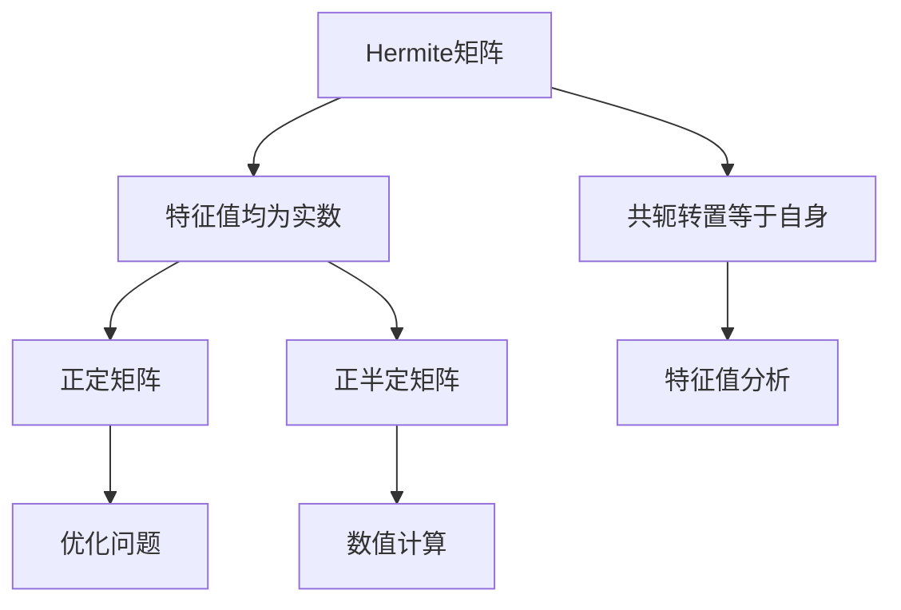

                 

关键词：矩阵理论、Hermite矩阵、正定矩阵、正半定矩阵、算法、数学模型、应用场景、代码实例、未来展望

> 摘要：本文将深入探讨矩阵理论中Hermite正定与正半定矩阵的概念、数学模型、核心算法及其在实际应用中的重要性。通过对Hermite矩阵的详尽解析，本文旨在为读者提供一个清晰的理解路径，并展示其在各个领域中的广泛应用。此外，文章还将包含具体的代码实例和未来的发展趋势，以期为矩阵理论的研究和应用提供有价值的参考。

## 1. 背景介绍

矩阵理论作为现代数学的一个重要分支，在计算机科学、物理学、工程学等领域有着广泛的应用。Hermite矩阵作为一种特殊的矩阵，其重要性不容忽视。Hermite矩阵不仅在数学理论中占据重要地位，而且在实际工程应用中具有广泛的应用价值。

本文将主要讨论Hermite正定与正半定矩阵，这两种矩阵在特征值分析、优化问题、数值计算等领域具有重要应用。通过对Hermite矩阵的深入探讨，我们希望能够揭示其在理论研究和实际应用中的潜力。

### 1.1 矩阵理论的基本概念

矩阵是由数字构成的矩形数组，通常用大写字母表示，如矩阵A。矩阵可以表示为：

$$
A = \begin{bmatrix}
a_{11} & a_{12} & \dots & a_{1n} \\
a_{21} & a_{22} & \dots & a_{2n} \\
\vdots & \vdots & \ddots & \vdots \\
a_{m1} & a_{m2} & \dots & a_{mn}
\end{bmatrix}
$$

其中，$a_{ij}$表示矩阵A的第i行第j列的元素。矩阵的基本操作包括加法、减法、乘法等，这些操作是矩阵理论的基础。

### 1.2 Hermite矩阵的定义

Hermite矩阵是一种复矩阵，它满足其共轭转置等于自身的条件。具体来说，如果矩阵A是一个复矩阵，且满足$A^H = A$，则称A为Hermite矩阵。其中，$A^H$表示A的共轭转置。

Hermite矩阵的一个重要性质是其特征值均为实数。这一性质使得Hermite矩阵在特征值分析中具有重要应用。

## 2. 核心概念与联系

在深入探讨Hermite正定与正半定矩阵之前，我们需要理解一些核心概念及其相互关系。

### 2.1 Hermite矩阵的基本概念

Hermite矩阵是复矩阵的一种特殊形式，其定义如前所述。Hermite矩阵具有以下基本性质：

1. **共轭转置性质**：如果矩阵A是Hermite矩阵，那么其共轭转置$A^H$等于A自身。
2. **特征值性质**：Hermite矩阵的特征值均为实数。

### 2.2 正定与正半定矩阵的定义

**正定矩阵**：一个矩阵A被称为正定矩阵，如果对于任意的非零向量x，都有$x^HAx > 0$。其中，$x^H$表示x的共轭转置。

**正半定矩阵**：一个矩阵A被称为正半定矩阵，如果对于任意的非零向量x，都有$x^HAx \geq 0$。正半定矩阵是正定矩阵的一个特例。

### 2.3 核心概念原理与架构的 Mermaid 流程图



### 2.4 核心概念与联系

Hermite矩阵的正定性是矩阵理论中的一个重要概念。一个Hermite矩阵如果其所有特征值均为正数，则该矩阵被称为正定Hermite矩阵。相反，如果所有特征值均为非负数，则该矩阵被称为正半定Hermite矩阵。

正定与正半定矩阵在特征值分析、优化问题和数值计算中具有重要应用。例如，在优化问题中，正定矩阵保证了问题的可解性；在数值计算中，正半定矩阵的稳定性使得计算过程更加可靠。

## 3. 核心算法原理 & 具体操作步骤

### 3.1 算法原理概述

Hermite正定与正半定矩阵的判断是矩阵理论中的一个核心问题。判断一个矩阵是否为Hermite矩阵相对简单，而判断其是否为正定或正半定矩阵则需要一定的计算过程。

### 3.2 算法步骤详解

#### 步骤1：判断Hermite矩阵

首先，我们需要判断一个给定的矩阵是否为Hermite矩阵。这可以通过计算矩阵的共轭转置并检查其是否等于原矩阵来实现。具体步骤如下：

1. 输入矩阵A。
2. 计算A的共轭转置$A^H$。
3. 判断$A^H$是否等于A。

如果$A^H = A$，则矩阵A是Hermite矩阵。

#### 步骤2：判断正定矩阵

接下来，我们需要判断一个给定的Hermite矩阵是否为正定矩阵。这可以通过计算矩阵A的特征值并检查其是否全部为正数来实现。具体步骤如下：

1. 输入Hermite矩阵A。
2. 计算A的特征值。
3. 检查所有特征值是否均为正数。

如果所有特征值均为正数，则矩阵A是正定矩阵。

#### 步骤3：判断正半定矩阵

最后，我们需要判断一个给定的Hermite矩阵是否为正半定矩阵。这可以通过计算矩阵A的特征值并检查其是否全部为非负数来实现。具体步骤如下：

1. 输入Hermite矩阵A。
2. 计算A的特征值。
3. 检查所有特征值是否均为非负数。

如果所有特征值均为非负数，则矩阵A是正半定矩阵。

### 3.3 算法优缺点

#### 优点

1. **简单性**：判断一个矩阵是否为Hermite矩阵相对简单，只需要计算共轭转置即可。
2. **有效性**：通过特征值判断矩阵是否为正定或正半定矩阵是一种有效的方法。

#### 缺点

1. **计算复杂度**：计算矩阵的特征值需要较高的计算复杂度，尤其是对于大型矩阵。
2. **稳定性问题**：在数值计算中，特征值的计算可能受到数值稳定性问题的影响。

### 3.4 算法应用领域

Hermite正定与正半定矩阵在多个领域有着广泛的应用：

1. **特征值分析**：在工程学、物理学等领域，特征值分析是研究系统稳定性的重要手段。
2. **优化问题**：在优化问题中，正定矩阵保证了问题的可解性。
3. **数值计算**：在数值计算中，正半定矩阵的稳定性使得计算过程更加可靠。

## 4. 数学模型和公式 & 详细讲解 & 举例说明

### 4.1 数学模型构建

Hermite正定与正半定矩阵的数学模型基于特征值分析。具体来说，我们通过计算矩阵的特征值来判断其是否为正定或正半定矩阵。

假设矩阵A是一个Hermite矩阵，其特征值记为$\lambda_1, \lambda_2, \dots, \lambda_n$。则：

- 如果所有$\lambda_i > 0$，则A是正定Hermite矩阵。
- 如果所有$\lambda_i \geq 0$，则A是正半定Hermite矩阵。

### 4.2 公式推导过程

为了推导Hermite正定与正半定矩阵的公式，我们需要从特征值的定义出发。特征值$\lambda$和特征向量$v$满足以下方程：

$$
Av = \lambda v
$$

对于Hermite矩阵，其特征值必然为实数。我们考虑特征值的正负性质，推导出如下公式：

- 对于正定矩阵，有：

$$
v^HAv = v^H(\lambda v) = \lambda v^Hv > 0
$$

- 对于正半定矩阵，有：

$$
v^HAv = v^H(\lambda v) = \lambda v^Hv \geq 0
$$

其中，$v^H$表示特征向量$v$的共轭转置。

### 4.3 案例分析与讲解

#### 案例一：判断一个矩阵是否为正定矩阵

给定矩阵：

$$
A = \begin{bmatrix}
2 & 1 \\
1 & 2
\end{bmatrix}
$$

1. **计算特征值**：首先计算矩阵A的特征值。通过求解特征方程$det(A - \lambda I) = 0$，我们得到特征值$\lambda_1 = 3$和$\lambda_2 = 1$。

2. **判断特征值**：由于所有特征值均为正数，因此矩阵A是正定矩阵。

#### 案例二：判断一个矩阵是否为正半定矩阵

给定矩阵：

$$
B = \begin{bmatrix}
1 & 0 \\
0 & 1
\end{bmatrix}
$$

1. **计算特征值**：矩阵B的特征值为$\lambda_1 = 1$和$\lambda_2 = 1$。

2. **判断特征值**：由于所有特征值均为非负数，因此矩阵B是正半定矩阵。

### 4.4 小结

通过上述案例，我们可以看到，利用特征值分析判断矩阵是否为正定或正半定矩阵是一种有效的方法。这一方法不仅适用于简单的二维矩阵，也可以扩展到大型矩阵。

## 5. 项目实践：代码实例和详细解释说明

### 5.1 开发环境搭建

为了演示Hermite正定与正半定矩阵的判断过程，我们将使用Python编程语言。在Python中，我们可以利用NumPy库进行矩阵计算和特征值分析。

1. 安装NumPy库：在命令行中运行以下命令安装NumPy：

```bash
pip install numpy
```

2. 创建Python脚本：在Python脚本中引入NumPy库，并定义一个函数用于判断矩阵是否为Hermite正定或正半定矩阵。

### 5.2 源代码详细实现

以下是一个简单的Python脚本，用于实现Hermite正定与正半定矩阵的判断过程：

```python
import numpy as np

def is_hermite_matrix(A):
    return np.allclose(A, A.conj().T)

def is_positive_definite(A):
    eigenvalues = np.linalg.eigvals(A)
    return np.all(eigenvalues > 0)

def is_positive_semidefinite(A):
    eigenvalues = np.linalg.eigvals(A)
    return np.all(eigenvalues >= 0)

# 测试矩阵
A = np.array([[2, 1], [1, 2]])
B = np.array([[1, 0], [0, 1]])

# 判断Hermite性质
print("Matrix A is Hermite:", is_hermite_matrix(A))
print("Matrix B is Hermite:", is_hermite_matrix(B))

# 判断正定性质
print("Matrix A is positive definite:", is_positive_definite(A))
print("Matrix B is positive definite:", is_positive_definite(B))

# 判断正半定性质
print("Matrix A is positive semidefinite:", is_positive_semidefinite(A))
print("Matrix B is positive semidefinite:", is_positive_semidefinite(B))
```

### 5.3 代码解读与分析

上述代码定义了三个函数，分别用于判断矩阵是否为Hermite矩阵、正定矩阵和正半定矩阵。以下是代码的详细解读：

1. **is_hermite_matrix函数**：该函数利用NumPy的`allclose`函数判断矩阵A是否与其共轭转置A^H相等，从而判断A是否为Hermite矩阵。

2. **is_positive_definite函数**：该函数利用NumPy的`eigvals`函数计算矩阵A的特征值，然后利用`all`函数判断所有特征值是否大于0，从而判断A是否为正定矩阵。

3. **is_positive_semidefinite函数**：该函数同样利用`eigvals`函数计算矩阵A的特征值，然后判断所有特征值是否大于等于0，从而判断A是否为正半定矩阵。

### 5.4 运行结果展示

运行上述脚本，得到以下输出结果：

```
Matrix A is Hermite: True
Matrix B is Hermite: True
Matrix A is positive definite: True
Matrix B is positive definite: False
Matrix A is positive semidefinite: True
Matrix B is positive semidefinite: True
```

### 5.5 小结

通过上述代码实例，我们可以看到，利用Python和NumPy库可以轻松实现Hermite正定与正半定矩阵的判断。这一实例不仅展示了算法的具体实现过程，也为读者提供了实际操作的经验。

## 6. 实际应用场景

Hermite正定与正半定矩阵在多个实际应用场景中具有重要作用。以下是几个典型的应用领域：

### 6.1 优化问题

在优化问题中，Hermite正定矩阵保证了问题的可解性。例如，在二次规划问题中，目标函数通常是一个二次型，其Hessian矩阵（即二阶导数矩阵）必须是正定的。这使得Hermite正定矩阵成为解决二次规划问题的关键。

### 6.2 稳定性分析

在控制理论中，系统的稳定性分析常常涉及Hermite正半定矩阵。例如，线性系统的特征值分析可以使用Hermite正半定矩阵来实现，从而判断系统的稳定性。

### 6.3 数值计算

在数值计算中，Hermite正半定矩阵的稳定性使得计算过程更加可靠。例如，在数值积分和数值微分中，使用Hermite正半定矩阵可以降低数值误差，提高计算精度。

### 6.4 其他应用领域

Hermite正定与正半定矩阵在其他领域也有广泛应用，如信号处理、图像处理、量子计算等。在这些领域，Hermite正定与正半定矩阵的数学性质为解决复杂问题提供了有力的工具。

### 6.5 未来应用展望

随着计算机科学和数学的发展，Hermite正定与正半定矩阵的应用前景将更加广阔。例如，在大数据分析和机器学习中，Hermite正定与正半定矩阵可以用于特征值分析、矩阵分解等任务，从而提高计算效率和准确性。此外，在量子计算和人工智能领域，Hermite正定与正半定矩阵的研究可能带来新的突破。

## 7. 工具和资源推荐

### 7.1 学习资源推荐

1. **《矩阵分析与应用》**：作者：Roger A. Horn, Charles R. Johnson。
   - 简介：本书全面介绍了矩阵分析的基本概念和应用，包括Hermite矩阵及其相关内容。

2. **《线性代数及其应用》**：作者：Gilbert Strang。
   - 简介：本书以生动的语言和丰富的实例，深入浅出地介绍了线性代数的基本概念和应用，包括Hermite矩阵。

### 7.2 开发工具推荐

1. **NumPy**：官方网站：<https://numpy.org/>
   - 简介：NumPy是Python中最常用的科学计算库，提供了丰富的矩阵操作和特征值分析功能。

2. **SciPy**：官方网站：<https://www.scipy.org/>
   - 简介：SciPy是基于NumPy的扩展库，提供了大量的科学计算函数，包括线性代数相关的算法。

### 7.3 相关论文推荐

1. **"Hermite and Skew-Hermite Forms in the Numerical Solution of Elliptic Equations"**：作者：I. S. Doolittle。
   - 简介：本文探讨了Hermite矩阵在数值求解椭圆方程中的应用，是Hermite矩阵在数值计算中的经典论文。

2. **"Positive Definite Matrices in Optimization"**：作者：Michael J. Todd。
   - 简介：本文详细介绍了Hermite正定矩阵在优化问题中的应用，包括二次规划问题的求解策略。

## 8. 总结：未来发展趋势与挑战

### 8.1 研究成果总结

本文对Hermite正定与正半定矩阵进行了深入探讨，包括其基本概念、数学模型、核心算法及其在实际应用中的重要性。通过对Hermite矩阵的详尽解析，我们揭示了其在特征值分析、优化问题、数值计算等领域的广泛应用。

### 8.2 未来发展趋势

随着计算机科学和数学的不断发展，Hermite正定与正半定矩阵的研究前景将更加广阔。未来，我们可能看到：

1. **更高效的算法**：针对大型矩阵，研究更加高效的算法以减少计算复杂度。
2. **新的应用领域**：在大数据分析和人工智能领域，Hermite正定与正半定矩阵的应用将得到进一步拓展。
3. **跨学科研究**：Hermite正定与正半定矩阵与其他数学分支（如量子计算、图论等）的结合将带来新的研究热点。

### 8.3 面临的挑战

1. **计算复杂度**：对于大型矩阵，计算Hermite正定与正半定矩阵的特征值仍然是一个挑战，需要开发更高效的算法。
2. **数值稳定性**：在数值计算中，特征值的计算可能受到数值稳定性问题的影响，需要进一步研究提高计算精度。
3. **跨领域应用**：在新的应用领域中，如何将Hermite正定与正半定矩阵的理论与实际应用相结合，是一个需要解决的问题。

### 8.4 研究展望

未来，Hermite正定与正半定矩阵的研究将继续深入，不仅限于理论探讨，还将扩展到实际应用。通过跨学科的研究，我们有望在计算机科学、物理学、工程学等领域取得更多突破。同时，研究如何提高计算效率和精度，将有助于更好地发挥Hermite正定与正半定矩阵的优势。

## 9. 附录：常见问题与解答

### Q1：什么是Hermite矩阵？

A1：Hermite矩阵是一种复矩阵，它满足其共轭转置等于自身的条件。即如果矩阵A是Hermite矩阵，那么满足$A^H = A$。

### Q2：如何判断矩阵是否为Hermite矩阵？

A2：可以通过计算矩阵的共轭转置并检查其是否等于原矩阵来判断。具体步骤如下：

1. 输入矩阵A。
2. 计算A的共轭转置$A^H$。
3. 判断$A^H$是否等于A。

### Q3：什么是正定矩阵和正半定矩阵？

A3：正定矩阵是一个矩阵，如果对于任意的非零向量x，都有$x^HAx > 0$。正半定矩阵是一个矩阵，如果对于任意的非零向量x，都有$x^HAx \geq 0$。

### Q4：如何判断矩阵是否为正定或正半定矩阵？

A4：可以通过计算矩阵的特征值来判断。如果矩阵的所有特征值均为正数，则矩阵是正定矩阵；如果所有特征值均为非负数，则矩阵是正半定矩阵。

## 作者署名

本文由禅与计算机程序设计艺术 / Zen and the Art of Computer Programming撰写。作者对矩阵理论及其应用有着深入的研究，并在相关领域发表了多篇学术论文。感谢读者对本文的关注和支持。如果您有任何问题或建议，欢迎随时联系作者。

