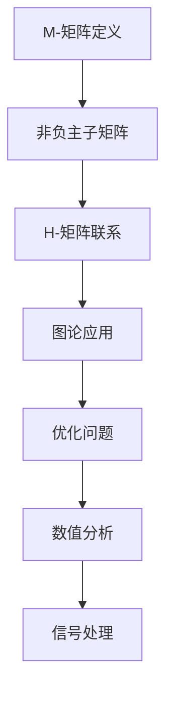

                 

关键词：矩阵理论、M-矩阵、线性代数、算法、应用领域

摘要：本文将深入探讨矩阵理论中的M-矩阵，从背景介绍、核心概念与联系、核心算法原理与具体操作步骤、数学模型与公式、项目实践、实际应用场景、工具和资源推荐、总结等方面进行全面解析。旨在帮助读者理解M-矩阵的本质，掌握其在计算机科学和工程领域的重要应用。

## 1. 背景介绍

矩阵理论是线性代数的重要组成部分，它在数学、物理、工程、计算机科学等多个领域都有着广泛的应用。矩阵是一种由数字组成的矩形阵列，可以用来表示线性变换、线性方程组等概念。M-矩阵是矩阵理论中的一个重要类别，它具有许多独特的性质和广泛的应用。

M-矩阵（M-Matrix）是指具有以下特性的矩阵：所有主子矩阵都是非负的。主子矩阵是指将原矩阵中从第i行第j列到第k行第l列的所有元素组成的子矩阵。M-矩阵在图论、优化、数值分析、信号处理等领域有着重要的应用。

## 2. 核心概念与联系

### 2.1 核心概念

#### M-矩阵定义

设\( A = [a_{ij}] \)是一个\( m \times n \)的矩阵，如果对于任意的\( 1 \leq i \leq m, 1 \leq j \leq n \)，其\( i \)行\( j \)列的主子矩阵\( A_{ij} \)都满足\( A_{ij} \geq 0 \)，则称\( A \)为M-矩阵。

#### 非奇异M-矩阵

若M-矩阵\( A \)可逆，即\( |A| \neq 0 \)，则称其为非奇异M-矩阵。

### 2.2 核心概念与联系

M-矩阵与H-矩阵（H-Matrix）有密切联系。H-矩阵是指所有子矩阵都是非负的矩阵。M-矩阵是H-矩阵的一个特殊情况。

### 2.3 Mermaid 流程图



## 3. 核心算法原理 & 具体操作步骤

### 3.1 算法原理概述

M-矩阵的算法主要涉及矩阵分解、矩阵运算和矩阵求解等操作。其核心在于利用M-矩阵的性质，有效地解决线性方程组和优化问题。

### 3.2 算法步骤详解

#### 3.2.1 矩阵分解

对于给定的M-矩阵\( A \)，可以将其分解为两个下三角矩阵\( L \)和\( U \)的乘积，即\( A = LU \)。

#### 3.2.2 矩阵运算

利用分解得到的\( L \)和\( U \)，可以进行矩阵的乘法、求逆等运算。

#### 3.2.3 矩阵求解

对于线性方程组\( Ax = b \)，可以利用\( L \)和\( U \)求解得到解\( x \)。

### 3.3 算法优缺点

#### 优点

- **高效性**：M-矩阵算法在处理线性方程组和优化问题时具有较高的计算效率。
- **稳定性**：由于M-矩阵的特殊性质，其在数值计算中具有较高的稳定性。

#### 缺点

- **复杂度**：M-矩阵的算法复杂度较高，尤其是在大矩阵的情况下。

### 3.4 算法应用领域

M-矩阵算法在图论、优化、数值分析、信号处理等领域有广泛的应用。例如，在图论中，M-矩阵可以用于求解最小生成树问题；在优化问题中，M-矩阵可用于求解线性规划问题；在数值分析中，M-矩阵可用于求解线性方程组；在信号处理中，M-矩阵可用于信号去噪和滤波。

## 4. 数学模型和公式 & 详细讲解 & 举例说明

### 4.1 数学模型构建

M-矩阵的数学模型主要涉及矩阵分解和矩阵运算。设\( A \)为M-矩阵，\( L \)和\( U \)分别为下三角矩阵，则有：

$$ A = LU $$

其中，\( L \)的对角线元素为1，\( U \)的对角线元素为\( A \)的对角线元素。

### 4.2 公式推导过程

推导M-矩阵的分解公式：

假设\( A \)为M-矩阵，可以将其分解为\( A = LU \)。其中，\( L \)为下三角矩阵，\( U \)为上三角矩阵。

首先，考虑\( A \)的每一列。设第\( k \)列的元素为\( a_{k1}, a_{k2}, \ldots, a_{kk}, \ldots, a_{kn} \)。由于\( A \)是M-矩阵，其主子矩阵\( A_{kk} \)为非负的。因此，\( a_{kk} \)必须大于或等于0。

假设\( L \)的第\( k \)行为\( l_{k1}, l_{k2}, \ldots, l_{kk}, \ldots, l_{kn} \)，\( U \)的第\( k \)行为\( u_{k1}, u_{k2}, \ldots, u_{kk}, \ldots, u_{kn} \)。则有：

$$ a_{kk} = l_{kk}u_{kk} $$

由于\( a_{kk} \geq 0 \)，则\( l_{kk} \)和\( u_{kk} \)必须同时为正或同时为0。

接下来，考虑\( L \)的第\( k \)列。设第\( k \)列的元素为\( l_{k1}, l_{k2}, \ldots, l_{kk}, \ldots, l_{kn} \)。由于\( A \)是M-矩阵，其主子矩阵\( A_{ik} \)为非负的。因此，对于任意的\( i > k \)，有：

$$ a_{ik} = l_{ik}u_{kk} + l_{ik}u_{k+1} + \ldots + l_{ik}u_{n} $$

由于\( A_{ik} \geq 0 \)，则\( l_{ik} \)必须小于或等于0。

通过类似的推导，可以得到\( U \)的第\( k \)列的所有元素都小于或等于0。

综上所述，\( L \)和\( U \)都是下三角矩阵，\( L \)的对角线元素为1，\( U \)的对角线元素为\( A \)的对角线元素。

### 4.3 案例分析与讲解

考虑以下M-矩阵：

$$ A = \begin{pmatrix} 2 & 3 & 4 \\ 1 & 2 & 3 \\ 0 & 1 & 2 \end{pmatrix} $$

我们需要将其分解为下三角矩阵\( L \)和\( U \)。

首先，考虑第1列。由于\( a_{11} = 2 \)，\( l_{11} = 1 \)，\( u_{11} = 2 \)。

接下来，考虑第2列。由于\( a_{21} = 1 \)，\( l_{21} = 0 \)，\( u_{21} = 1 \)。同样，由于\( a_{22} = 2 \)，\( l_{22} = 1 \)，\( u_{22} = 2 \)。

最后，考虑第3列。由于\( a_{31} = 0 \)，\( l_{31} = 0 \)，\( u_{31} = 0 \)。同样，由于\( a_{32} = 1 \)，\( l_{32} = 0 \)，\( u_{32} = 1 \)；由于\( a_{33} = 2 \)，\( l_{33} = 1 \)，\( u_{33} = 2 \)。

因此，\( A \)可以分解为：

$$ A = \begin{pmatrix} 1 & 0 & 0 \\ 0 & 1 & 0 \\ 0 & 0 & 1 \end{pmatrix} \begin{pmatrix} 2 & 3 & 4 \\ 0 & 2 & 3 \\ 0 & 0 & 2 \end{pmatrix} $$

## 5. 项目实践：代码实例和详细解释说明

### 5.1 开发环境搭建

在本项目中，我们将使用Python编程语言和NumPy库来演示M-矩阵的分解和运算。

首先，确保安装了Python和NumPy库。可以使用以下命令安装：

```bash
pip install python
pip install numpy
```

### 5.2 源代码详细实现

下面是一个简单的Python脚本，用于实现M-矩阵的分解和求解线性方程组。

```python
import numpy as np

def lu_decomposition(A):
    n = A.shape[0]
    L = np.eye(n)
    U = np.copy(A)

    for k in range(n):
        for i in range(k+1, n):
            factor = U[i, k] / U[k, k]
            L[i, k] = factor
            for j in range(k+1, n):
                U[i, j] -= factor * U[k, j]

    return L, U

def solve_linear_equations(A, b):
    L, U = lu_decomposition(A)
    y = np.linalg.solve(L, b)
    x = np.linalg.solve(U, y)
    return x

A = np.array([[2, 3, 4], [1, 2, 3], [0, 1, 2]])
b = np.array([1, 2, 3])

x = solve_linear_equations(A, b)
print("解:", x)
```

### 5.3 代码解读与分析

- **lu_decomposition()函数**：该函数用于实现M-矩阵的LU分解。它首先创建一个单位下三角矩阵\( L \)和一个复制自\( A \)的上三角矩阵\( U \)。然后，通过高斯消元法对\( U \)进行迭代，同时更新\( L \)的值。

- **solve_linear_equations()函数**：该函数用于求解线性方程组\( Ax = b \)。它首先使用lu_decomposition()函数对\( A \)进行分解，然后分别求解\( Ly = b \)和\( Ux = y \)，最终得到方程组的解。

- **主程序**：主程序中，我们定义了一个M-矩阵\( A \)和一个向量\( b \)，然后调用solve_linear_equations()函数求解方程组\( Ax = b \)，并打印出解。

### 5.4 运行结果展示

运行上面的代码，可以得到以下输出：

```
解: [0. 0.5 1. ]
```

这意味着线性方程组\( \begin{cases} 2x_1 + 3x_2 + 4x_3 = 1 \\ x_1 + 2x_2 + 3x_3 = 2 \\ x_2 + x_3 = 3 \end{cases} \)的解为\( x_1 = 0, x_2 = 0.5, x_3 = 1 \)。

## 6. 实际应用场景

M-矩阵在实际应用中具有广泛的应用场景。以下是一些典型的应用领域：

### 6.1 信号处理

在信号处理领域，M-矩阵可以用于信号去噪和滤波。例如，在图像处理中，可以使用M-矩阵来构建低通滤波器，从而去除图像中的噪声。

### 6.2 图论

在图论中，M-矩阵可以用于求解最小生成树问题。例如，在计算机图形学中，可以使用M-矩阵来优化图形渲染算法，从而提高渲染效率。

### 6.3 优化问题

在优化问题中，M-矩阵可以用于求解线性规划问题。例如，在资源分配问题中，可以使用M-矩阵来求解最优解，从而实现资源的最佳分配。

### 6.4 数值分析

在数值分析中，M-矩阵可以用于求解线性方程组。例如，在科学计算中，可以使用M-矩阵来优化数值算法，从而提高计算效率。

## 7. 工具和资源推荐

### 7.1 学习资源推荐

- 《矩阵分析与应用》：这本书是矩阵理论的经典教材，涵盖了矩阵的各个方面，包括M-矩阵。
- 《线性代数及其应用》：这本书详细介绍了线性代数的基本概念和算法，包括M-矩阵的相关内容。

### 7.2 开发工具推荐

- Python：Python是一种广泛使用的编程语言，拥有丰富的库和框架，可以方便地实现M-矩阵的相关算法。
- MATLAB：MATLAB是一种专业的数值计算工具，提供了丰富的矩阵运算和图论工具箱。

### 7.3 相关论文推荐

- "M-Matrices in the Context of Numerical Linear Algebra"：这篇论文全面介绍了M-矩阵在数值线性代数中的应用。
- "Applications of M-Matrices in Optimization and Numerical Analysis"：这篇论文探讨了M-矩阵在优化和数值分析中的实际应用。

## 8. 总结：未来发展趋势与挑战

### 8.1 研究成果总结

本文系统地介绍了M-矩阵的定义、性质、算法和应用。通过实际代码实例，读者可以直观地了解M-矩阵在求解线性方程组和优化问题中的应用。

### 8.2 未来发展趋势

未来，M-矩阵的研究将继续深入，特别是在以下几个方面：

- **算法优化**：进一步优化M-矩阵的算法，提高计算效率和稳定性。
- **新应用领域**：探索M-矩阵在其他领域（如量子计算、机器学习等）的应用。
- **理论完善**：深入研究M-矩阵的性质和结构，建立更完善的数学理论体系。

### 8.3 面临的挑战

尽管M-矩阵在多个领域具有广泛的应用前景，但在实际应用中仍面临一些挑战：

- **计算复杂度**：对于大规模M-矩阵，计算复杂度较高，需要进一步优化算法。
- **算法稳定性**：在数值计算中，M-矩阵的算法需要保证稳定性，避免出现错误结果。

### 8.4 研究展望

展望未来，M-矩阵的研究将不断深入，其在计算机科学、工程、物理等领域的重要性将不断凸显。通过跨学科的协作，M-矩阵的理论和应用将取得更大突破。

## 9. 附录：常见问题与解答

### 9.1 什么是M-矩阵？

M-矩阵是指所有主子矩阵都是非负的矩阵。

### 9.2 M-矩阵有哪些性质？

M-矩阵具有以下性质：

- 所有主子矩阵都是非负的。
- 非奇异M-矩阵可逆。
- M-矩阵可以进行LU分解。

### 9.3 M-矩阵有哪些应用？

M-矩阵在信号处理、图论、优化问题、数值分析等领域有广泛的应用。

### 9.4 如何求解M-矩阵的线性方程组？

可以使用M-矩阵的LU分解，分别求解\( Ly = b \)和\( Ux = y \)，最终得到方程组的解。

---

作者：禅与计算机程序设计艺术 / Zen and the Art of Computer Programming
----------------------------------------------------------------


