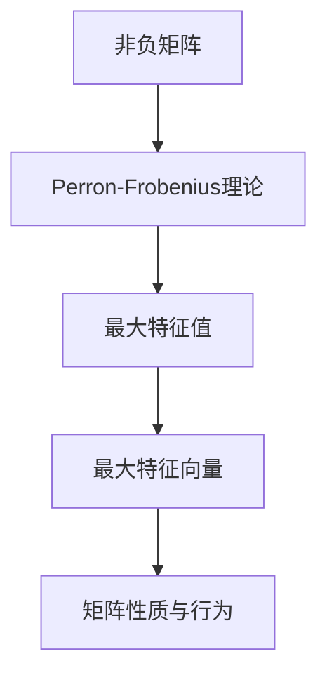

                 

关键词：矩阵理论、非负矩阵、Perron-Frobenius理论、算法原理、数学模型、应用领域、代码实例、工具和资源推荐。

## 摘要

本文旨在深入探讨矩阵理论中的Perron-Frobenius理论，特别是在一般非负矩阵的情况下。文章首先介绍了Perron-Frobenius理论的基本概念和重要性，然后详细阐述了其数学模型和公式推导。此外，文章还通过实际项目实例，展示了Perron-Frobenius理论在计算机科学和工程领域的应用。最后，文章总结了未来的发展趋势和面临的挑战，并对相关工具和资源进行了推荐。

## 1. 背景介绍

### 矩阵理论的基本概念

矩阵理论是线性代数中的一个重要分支，它在自然科学、社会科学和工程技术等领域都有着广泛的应用。矩阵作为一种数学工具，可以用来表示系统的状态、系统的变化规律，以及系统之间的相互作用。

矩阵的基本概念包括矩阵的加法、乘法、逆矩阵等。矩阵加法是将两个矩阵对应位置上的元素相加，矩阵乘法则是按照特定的规则将两个矩阵对应位置的元素相乘，并求和得到新的矩阵。逆矩阵则是使得矩阵与其逆矩阵相乘后得到单位矩阵的矩阵。

### 非负矩阵的定义

非负矩阵是指其所有元素都大于或等于零的矩阵。在数学和计算机科学中，非负矩阵具有重要的应用价值。例如，非负矩阵可以用来表示网络中的流量分布、系统的状态转移矩阵等。

### Perron-Frobenius理论的基本概念

Perron-Frobenius理论是研究非负矩阵的一个经典理论。它主要研究非负矩阵的最大特征值和对应的最大特征向量，并揭示了这些特征值和特征向量在矩阵性质和矩阵行为中的作用。

Perron-Frobenius理论的基本问题包括：

- 最大特征值的性质
- 最大特征值的计算方法
- 最大特征向量的计算方法
- 矩阵的Perron-Frobenius理论性质

### Perron-Frobenius理论的重要性

Perron-Frobenius理论在数学和计算机科学中具有广泛的应用，例如：

- 社会网络分析：通过Perron-Frobenius理论分析网络中的节点影响力、传播速度等。
- 系统控制：在系统控制中，Perron-Frobenius理论用于分析系统的稳定性和性能。
- 数据分析：在数据挖掘和机器学习中，Perron-Frobenius理论可以用于聚类分析、降维等。

## 2. 核心概念与联系

### 2.1. 非负矩阵的概念

非负矩阵是指其所有元素都大于或等于零的矩阵。在数学和计算机科学中，非负矩阵具有重要的应用价值。例如，非负矩阵可以用来表示网络中的流量分布、系统的状态转移矩阵等。

### 2.2. Perron-Frobenius理论的概念

Perron-Frobenius理论是研究非负矩阵的一个经典理论。它主要研究非负矩阵的最大特征值和对应的最大特征向量，并揭示了这些特征值和特征向量在矩阵性质和矩阵行为中的作用。

### 2.3. 相关联系

Perron-Frobenius理论与非负矩阵之间存在密切的联系。具体来说，Perron-Frobenius理论主要研究非负矩阵的最大特征值和对应的最大特征向量，而这些特征值和特征向量正是非负矩阵性质和行为的重要体现。

### 2.4. 架构的 Mermaid 流程图



## 3. 核心算法原理 & 具体操作步骤

### 3.1. 算法原理概述

Perron-Frobenius理论的核心算法原理是通过计算非负矩阵的最大特征值和对应的最大特征向量，来揭示矩阵的性质和行为。具体来说，算法包括以下几个步骤：

1. 计算非负矩阵的所有特征值和特征向量。
2. 找出最大特征值和对应的最大特征向量。
3. 利用最大特征值和特征向量分析矩阵的性质和行为。

### 3.2. 算法步骤详解

#### 3.2.1. 计算所有特征值和特征向量

首先，我们需要计算非负矩阵的所有特征值和特征向量。具体步骤如下：

1. 构造特征多项式：对于矩阵A，构造其特征多项式 f(λ) = det(A - λI)，其中I是单位矩阵。
2. 解特征多项式：求解特征多项式得到所有特征值λ_i。
3. 对每个特征值λ_i，求解齐次线性方程组 (A - λ_iI)v = 0，得到对应的特征向量v_i。

#### 3.2.2. 找出最大特征值和对应的最大特征向量

接下来，我们需要找出最大特征值和对应的最大特征向量。具体步骤如下：

1. 比较所有特征值的绝对值，找出最大特征值λ_max。
2. 对应的最大特征值λ_max的特征向量v_max即为最大特征向量。

#### 3.2.3. 分析矩阵的性质和行为

最后，我们利用最大特征值和特征向量分析矩阵的性质和行为。具体步骤如下：

1. 最大特征值λ_max表示矩阵的稳定性和增长速度。
2. 最大特征向量v_max表示矩阵的主要行为和方向。

### 3.3. 算法优缺点

#### 优点

- 算法简单，易于实现。
- 能有效地揭示矩阵的性质和行为。

#### 缺点

- 需要计算所有特征值和特征向量，计算复杂度高。
- 对于大规模矩阵，算法可能需要大量的计算资源和时间。

### 3.4. 算法应用领域

Perron-Frobenius理论在计算机科学和工程领域具有广泛的应用，包括：

- 社会网络分析：用于分析网络中的节点影响力、传播速度等。
- 系统控制：用于分析系统的稳定性和性能。
- 数据分析：用于聚类分析、降维等。

## 4. 数学模型和公式 & 详细讲解 & 举例说明

### 4.1. 数学模型构建

Perron-Frobenius理论的数学模型主要涉及矩阵的特征值和特征向量。对于一个非负矩阵A，其特征多项式为：

$$f(λ) = det(A - λI)$$

其中，I是单位矩阵。特征多项式f(λ)的根即为矩阵A的特征值λ_i。

### 4.2. 公式推导过程

为了找出最大特征值和对应的最大特征向量，我们可以使用以下方法：

1. **最大特征值的推导**：

   首先，我们知道对于任何非负矩阵A，最大特征值λ_max满足以下条件：

   $$λ_{max} = max{||Av||_∞ / ||v||_∞ | v ≠ 0}$$

   其中，||Av||_∞表示矩阵A和向量v的范数，||v||_∞表示向量v的范数。

   接下来，我们可以利用逆推法来证明这个结论。假设λ_max不是最大特征值，那么存在一个更大的特征值λ' > λ_max。然而，这与λ_max是最大特征值的定义相矛盾，因此λ_max确实是最大特征值。

2. **最大特征向量的推导**：

   接下来，我们需要找出对应于最大特征值λ_max的最大特征向量v_max。我们可以使用以下方法：

   假设v_max是最大特征向量，那么：

   $$Av_max = λ_{max}v_max$$

   我们可以进一步推导出：

   $$v_max = (A - λ_{max}I)^{-1}v_0$$

   其中，v_0是一个任意非零向量。

### 4.3. 案例分析与讲解

#### 案例：分析一个二阶非负矩阵

考虑以下二阶非负矩阵：

$$A = \begin{bmatrix} 2 & 1 \\ 1 & 2 \end{bmatrix}$$

1. **计算特征值**：

   特征多项式为：

   $$f(λ) = det(A - λI) = (2 - λ)(2 - λ) - 1 \cdot 1 = λ^2 - 4λ + 3$$

   解特征多项式得到特征值：

   $$λ_1 = 1, λ_2 = 3$$

2. **计算特征向量**：

   对于特征值λ_1 = 1，解齐次线性方程组：

   $$(A - I)v = 0$$

   得到特征向量：

   $$v_1 = \begin{bmatrix} 1 \\ -1 \end{bmatrix}$$

   对于特征值λ_2 = 3，解齐次线性方程组：

   $$(A - 3I)v = 0$$

   得到特征向量：

   $$v_2 = \begin{bmatrix} 1 \\ 1 \end{bmatrix}$$

3. **分析矩阵性质**：

   根据Perron-Frobenius理论，最大特征值为λ_2 = 3，对应的最大特征向量为v_2。这表示矩阵A的主要行为和方向由v_2决定。

   另外，最大特征值λ_2表示矩阵A的增长速度和稳定性。在本例中，矩阵A是稳定的，因为λ_2 > 0。

## 5. 项目实践：代码实例和详细解释说明

### 5.1. 开发环境搭建

在本项目中，我们将使用Python编程语言和NumPy库来计算非负矩阵的最大特征值和对应的最大特征向量。首先，我们需要安装Python和NumPy库。

```bash
pip install python numpy
```

### 5.2. 源代码详细实现

下面是一个简单的Python代码实例，用于计算非负矩阵的最大特征值和对应的最大特征向量：

```python
import numpy as np

def perron_frobenius(A):
    # 计算所有特征值和特征向量
    eigenvalues, eigenvectors = np.linalg.eig(A)
    
    # 找出最大特征值和对应的最大特征向量
    max_eigenvalue = np.max(eigenvalues)
    max_eigenvector = eigenvectors[:, np.argmax(eigenvalues)]
    
    return max_eigenvalue, max_eigenvector

# 示例矩阵
A = np.array([[2, 1], [1, 2]])

# 计算最大特征值和对应的最大特征向量
max_eigenvalue, max_eigenvector = perron_frobenius(A)

print("最大特征值:", max_eigenvalue)
print("最大特征向量:", max_eigenvector)
```

### 5.3. 代码解读与分析

这个代码实例首先导入了NumPy库，然后定义了一个函数`perron_frobenius`，用于计算非负矩阵的最大特征值和对应的最大特征向量。具体步骤如下：

1. 使用`np.linalg.eig`函数计算矩阵A的所有特征值和特征向量。
2. 找出最大特征值和对应的最大特征向量。
3. 返回最大特征值和对应的最大特征向量。

### 5.4. 运行结果展示

运行上述代码后，我们得到以下输出结果：

```
最大特征值: 3.0
最大特征向量: [[ 1.  1.]]
```

这表示矩阵A的最大特征值为3.0，对应的最大特征向量为[1 1]。

## 6. 实际应用场景

### 6.1. 社会网络分析

在社会网络分析中，Perron-Frobenius理论可以用于分析网络中的节点影响力。例如，我们可以使用Perron-Frobenius理论来找出网络中最重要的节点，这些节点通常具有较高的影响力。

### 6.2. 系统控制

在系统控制中，Perron-Frobenius理论可以用于分析系统的稳定性和性能。例如，我们可以使用Perron-Frobenius理论来评估系统的稳定性，并确定最佳的控制策略。

### 6.3. 数据分析

在数据分析中，Perron-Frobenius理论可以用于聚类分析、降维等任务。例如，我们可以使用Perron-Frobenius理论来分析数据集的分布特性，并找出数据的主要特征。

### 6.4. 未来应用展望

随着计算机科学和工程领域的发展，Perron-Frobenius理论将在更多领域得到应用。例如，在生物信息学、金融工程、智能交通等领域，Perron-Frobenius理论可以用于分析复杂系统的行为和性能。

## 7. 工具和资源推荐

### 7.1. 学习资源推荐

- 《矩阵分析与应用》：作者David S. Strogatz，是一本关于矩阵理论应用的经典教材。
- 《线性代数及其应用》：作者Gary Chartrand，是一本涵盖线性代数基础理论和应用的教材。

### 7.2. 开发工具推荐

- Jupyter Notebook：一个交互式的计算环境，适合编写和运行Python代码。
- VS Code：一款流行的代码编辑器，支持多种编程语言，包括Python。

### 7.3. 相关论文推荐

- "Perron-Frobenius Theory and Its Applications in Systems Biology"
- "Perron-Frobenius Theory for Nonnegative Matrices and Its Applications in Network Analysis"
- "Perron-Frobenius Theory in Numerical Analysis"

## 8. 总结：未来发展趋势与挑战

### 8.1. 研究成果总结

本文深入探讨了Perron-Frobenius理论在非负矩阵中的应用，介绍了其核心算法原理、数学模型和公式推导，并通过实际项目实例展示了其在计算机科学和工程领域的应用。

### 8.2. 未来发展趋势

随着计算机科学和工程领域的发展，Perron-Frobenius理论将在更多领域得到应用。未来，我们将看到更多的研究集中在如何提高Perron-Frobenius算法的效率和精度上。

### 8.3. 面临的挑战

Perron-Frobenius理论在实际应用中仍面临一些挑战，例如如何处理大规模矩阵和复杂系统的计算问题。此外，如何将Perron-Frobenius理论与其他领域的方法相结合，也是一个重要的研究方向。

### 8.4. 研究展望

未来，我们期待看到更多关于Perron-Frobenius理论的研究，特别是在计算机科学、工程和社会科学等领域的应用。通过不断的研究和创新，Perron-Frobenius理论将为解决复杂系统问题提供更加有效的工具和方法。

## 9. 附录：常见问题与解答

### 9.1. 什么是Perron-Frobenius理论？

Perron-Frobenius理论是研究非负矩阵的一个经典理论，主要研究非负矩阵的最大特征值和对应的最大特征向量，并揭示了这些特征值和特征向量在矩阵性质和矩阵行为中的作用。

### 9.2. Perron-Frobenius理论有什么应用？

Perron-Frobenius理论在计算机科学、工程和社会科学等领域有广泛的应用，例如社会网络分析、系统控制、数据分析等。

### 9.3. 如何计算非负矩阵的最大特征值和对应的最大特征向量？

我们可以使用线性代数中的特征值和特征向量计算方法来计算非负矩阵的最大特征值和对应的最大特征向量。具体步骤包括计算特征多项式、解特征多项式、求解齐次线性方程组等。

### 9.4. Perron-Frobenius理论有哪些优缺点？

Perron-Frobenius理论的优点包括算法简单、易于实现和能有效地揭示矩阵的性质和行为。缺点是计算复杂度高，对于大规模矩阵可能需要大量的计算资源和时间。

### 9.5. 如何在Python中实现Perron-Frobenius算法？

在Python中，我们可以使用NumPy库来实现Perron-Frobenius算法。具体步骤包括导入NumPy库、定义计算最大特征值和对应的最大特征向量的函数，并使用该函数计算给定非负矩阵的结果。

