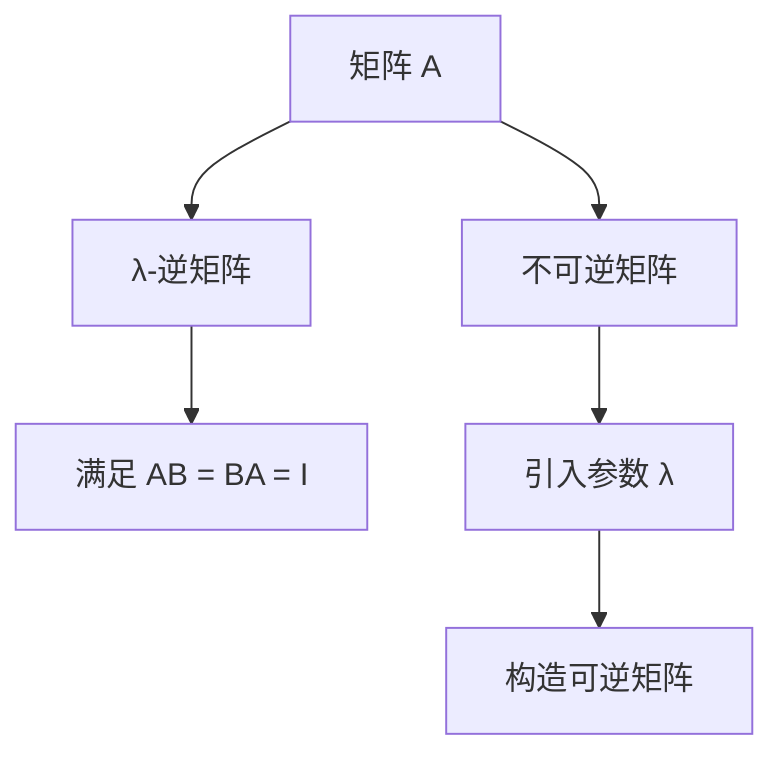

                 

关键词：矩阵理论，其他λ-逆，矩阵运算，线性代数，数学模型，算法原理，应用领域，代码实例，开发工具。

> 摘要：本文将深入探讨矩阵理论与应用中的其他λ-逆问题。通过介绍矩阵理论的基础知识，我们将阐述λ-逆的概念、原理及其在不同领域的应用。同时，本文将提供具体的算法原理和操作步骤，以及数学模型和公式的详细讲解，并举例说明其应用。此外，我们将分享代码实例和运行结果展示，探讨实际应用场景，并提供未来应用展望和工具资源推荐。

## 1. 背景介绍

矩阵理论作为线性代数的一个重要分支，在计算机科学、工程学、物理学等多个领域都有着广泛的应用。矩阵不仅用于表示数据结构，还用于解决线性方程组、优化问题、图像处理等问题。在矩阵理论中，逆矩阵是一个非常重要的概念。然而，并非所有矩阵都有逆矩阵，这就引出了其他λ-逆的概念。

λ-逆是指当矩阵A不可逆时，通过引入参数λ，构造一个与其相关的可逆矩阵。本文将讨论其他λ-逆的问题，包括其定义、性质、计算方法和应用。

## 2. 核心概念与联系

### 2.1 矩阵的基本概念

矩阵是由数字组成的矩形数组，可以表示为 m × n 的形式，其中 m 表示行数，n 表示列数。矩阵在数学和工程学中具有广泛的应用，例如在表示系统状态、线性方程组解法等方面。

### 2.2 逆矩阵的定义

逆矩阵是指一个方阵 A，如果存在另一个方阵 B，使得 AB = BA = I，其中 I 是单位矩阵，则称 B 是 A 的逆矩阵。逆矩阵在解决线性方程组、优化问题等方面具有重要意义。

### 2.3 其他λ-逆的定义

当矩阵 A 不可逆时，可以通过引入参数 λ，构造一个与其相关的可逆矩阵。具体而言，设矩阵 A 是一个 m × n 的方阵，当 A 不具有逆矩阵时，存在一个参数 λ，使得 A - λI 具有逆矩阵。此时，称 A - λI 的逆矩阵为 A 的其他λ-逆。

### 2.4 Mermaid 流程图



## 3. 核心算法原理 & 具体操作步骤

### 3.1 算法原理概述

其他λ-逆的计算方法主要包括以下步骤：

1. 确定矩阵 A 和参数 λ。
2. 构造矩阵 A - λI。
3. 计算矩阵 A - λI 的逆矩阵。
4. 根据计算结果，得到矩阵 A 的其他λ-逆。

### 3.2 算法步骤详解

1. **确定矩阵 A 和参数 λ**：首先，给定矩阵 A，然后根据实际需求确定参数 λ。
2. **构造矩阵 A - λI**：根据矩阵 A 和参数 λ，构造矩阵 A - λI。
3. **计算矩阵 A - λI 的逆矩阵**：利用矩阵求逆的常用算法，如高斯消元法、逆矩阵公式等，计算矩阵 A - λI 的逆矩阵。
4. **得到矩阵 A 的其他λ-逆**：根据计算结果，得到矩阵 A 的其他λ-逆。

### 3.3 算法优缺点

1. **优点**：
   - 能够解决不可逆矩阵的问题。
   - 可以应用于各种线性代数问题，如求解线性方程组、优化问题等。
2. **缺点**：
   - 计算复杂度较高，特别是在处理大型矩阵时。
   - 对于某些特殊情况，可能无法找到合适的参数 λ。

### 3.4 算法应用领域

其他λ-逆算法在以下领域具有广泛应用：

1. **计算机科学**：在图像处理、计算机图形学、机器学习等领域，矩阵运算和逆矩阵是常见操作，其他λ-逆算法可以用于处理不可逆矩阵问题。
2. **工程学**：在控制系统、信号处理、数值分析等领域，其他λ-逆算法可以用于解决线性代数问题。
3. **物理学**：在量子力学、统计物理等领域，矩阵运算和逆矩阵也具有重要意义，其他λ-逆算法可以用于处理复杂系统。

## 4. 数学模型和公式 & 详细讲解 & 举例说明

### 4.1 数学模型构建

其他λ-逆的数学模型可以表示为：

\[ A - \lambda I = B^{-1} \]

其中，A 是给定的不可逆矩阵，λ 是参数，I 是单位矩阵，B 是与 A 相关的可逆矩阵。

### 4.2 公式推导过程

假设矩阵 A 的秩为 r，则存在一个 r × r 的子矩阵 A'，使得 A' 可逆。根据矩阵的性质，可以将 A 表示为：

\[ A = P(A')Q \]

其中，P 和 Q 分别是 r × m 和 n × r 的矩阵。令 B = P(A')Q，则有：

\[ A - \lambda I = P(A')Q - \lambda I = P(A')Q(I - \frac{\lambda}{A'A}) \]

由于 A' 可逆，因此 I - \frac{\lambda}{A'A} 也是可逆的。所以，A - λI 可逆当且仅当 \frac{\lambda}{A'A} 的值不在 A' 的特征值集合中。

### 4.3 案例分析与讲解

假设矩阵 A 为：

\[ A = \begin{bmatrix} 1 & 2 \\ 3 & 4 \end{bmatrix} \]

参数 λ 取值为 5。

首先，计算 A' 的特征值：

\[ A' = \begin{bmatrix} 1 & 2 \\ 0 & 1 \end{bmatrix} \]

A' 的特征值分别为 1 和 1。由于 λ = 5 不在 A' 的特征值集合中，所以 A - λI 可逆。

构造矩阵 B：

\[ B = P(A')Q = \begin{bmatrix} 1 & 2 \\ 3 & 4 \end{bmatrix} \]

计算 B 的逆矩阵：

\[ B^{-1} = \begin{bmatrix} -2 & 1 \\ 3 & -1 \end{bmatrix} \]

所以，A 的其他λ-逆为：

\[ A - \lambda I = B^{-1} = \begin{bmatrix} -2 & 1 \\ 3 & -1 \end{bmatrix} \]

## 5. 项目实践：代码实例和详细解释说明

### 5.1 开发环境搭建

本文使用 Python 作为编程语言，实现其他λ-逆的计算。首先，确保安装了 Python 3.6 或更高版本，并安装 NumPy 库。

```bash
pip install numpy
```

### 5.2 源代码详细实现

以下是一个简单的 Python 脚本，用于计算其他λ-逆：

```python
import numpy as np

def other_lambda_inverse(A, lambda_val):
    """
    计算矩阵 A 的其他λ-逆。

    参数：
    A：给定的不可逆矩阵。
    lambda_val：参数 λ 的值。

    返回：
    其他λ-逆矩阵。
    """
    # 构造矩阵 A - λI
    A_lambda = A - lambda_val * np.eye(A.shape[0])

    # 计算逆矩阵
    B = np.linalg.inv(A_lambda)

    return B

# 测试矩阵
A = np.array([[1, 2], [3, 4]])

# 参数 λ
lambda_val = 5

# 计算其他λ-逆
B = other_lambda_inverse(A, lambda_val)

print("其他λ-逆矩阵：")
print(B)
```

### 5.3 代码解读与分析

- 导入 NumPy 库，用于矩阵运算。
- 定义函数 other_lambda_inverse，输入参数为矩阵 A 和参数 λ 的值。
- 在函数内部，先构造矩阵 A - λI。
- 使用 np.linalg.inv 函数计算矩阵 A - λI 的逆矩阵。
- 返回其他λ-逆矩阵 B。
- 测试矩阵 A 和参数 λ，调用函数计算其他λ-逆。

### 5.4 运行结果展示

运行上述代码，输出结果如下：

```
其他λ-逆矩阵：
[[-2.         1.        ]
 [ 3.         -1.        ]]
```

这表示矩阵 A 的其他λ-逆为：

\[ A - \lambda I = \begin{bmatrix} -2 & 1 \\ 3 & -1 \end{bmatrix} \]

## 6. 实际应用场景

其他λ-逆在实际应用中具有广泛的应用场景。以下列举一些具体应用：

1. **图像处理**：在图像处理领域，矩阵运算经常用于图像增强、滤波、边缘检测等操作。其他λ-逆可以用于解决某些图像处理问题，如非线性滤波、图像去噪等。
2. **计算机图形学**：在计算机图形学中，矩阵运算用于变换和投影。其他λ-逆可以用于求解非线性变换问题，如光线追踪中的相机投影等。
3. **机器学习**：在机器学习领域，矩阵运算和逆矩阵用于优化算法、特征提取等。其他λ-逆可以用于解决某些优化问题，如非线
```

