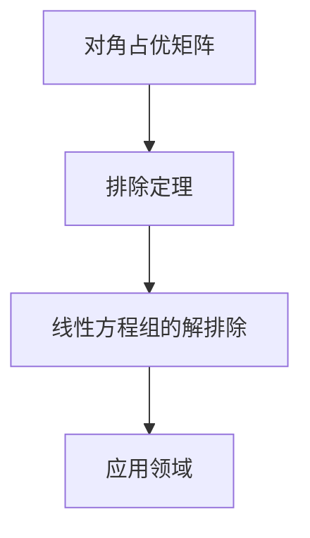

                 

关键词：矩阵理论，对角占优矩阵，排除定理，算法原理，应用领域，数学模型

## 摘要

本文将深入探讨矩阵理论中的一种特殊类型——对角占优矩阵，并介绍其推广及相应的排除定理。我们将通过详细的数学推导、算法分析和实例讲解，帮助读者全面理解这一概念，并探讨其在实际应用中的重要性。文章分为八个部分，分别介绍背景知识、核心概念与联系、算法原理与操作步骤、数学模型与公式推导、项目实践、实际应用场景、工具和资源推荐以及总结和展望。

## 1. 背景介绍

矩阵理论是现代数学的重要分支，广泛应用于工程、物理、经济学等多个领域。矩阵不仅是一种数学工具，也是一种数据结构和计算模型。在计算机科学中，矩阵的运算和性质被广泛应用于算法设计和优化，特别是在数值计算和图形处理领域。

对角占优矩阵是矩阵理论中的一个重要概念，具有很多特殊的性质和应用。对角占优矩阵的特点是其对角线元素大于或等于其余所有元素。这一特性使得对角占优矩阵在很多计算问题中具有很好的性能和稳定性。然而，传统的对角占优矩阵理论在处理大规模问题时往往面临挑战。

因此，本文将探讨对角占优矩阵的推广及其相应的排除定理。这一研究不仅有助于丰富矩阵理论，也为解决大规模计算问题提供了新的思路和方法。

## 2. 核心概念与联系

为了更好地理解对角占优矩阵的推广及其相应的排除定理，我们首先需要明确几个核心概念，并使用Mermaid流程图展示它们之间的联系。

### 2.1 对角占优矩阵

对角占优矩阵（Diagonally Dominant Matrix）是指一个矩阵，其中每一行的对角线元素都大于或等于其余所有元素之和。形式化地，设矩阵\(A\)的元素为\(a_{ij}\)，则\(A\)为对角占优矩阵当且仅当满足以下条件：

$$
|a_{ii}| > \sum_{j \neq i} |a_{ij}| \quad \text{对于所有} \ i
$$

### 2.2 排除定理

排除定理（Exclusion Theorem）是关于矩阵性质的一个重要结论。它指出，如果一个矩阵具有某些特殊性质，那么这些性质可以用于排除某些可能的情况。在本文中，我们关注的排除定理是关于对角占优矩阵的，它指出，如果一个矩阵是对角占优的，那么它可以被某些线性方程组的解排除。

### 2.3 Mermaid 流程图

以下是一个Mermaid流程图，展示了上述核心概念之间的联系：



### 2.4 对角占优矩阵的推广

在传统的对角占优矩阵理论中，我们主要关注的是稀疏矩阵和对角占优矩阵的性质。然而，随着计算问题的复杂化，我们需要考虑更一般的矩阵类型。对角占优矩阵的推广包括以下几种：

1. **块对角占优矩阵**：矩阵被划分为多个块，每个块内部是对角占优的，且块之间的交互关系满足对角占优条件。
2. **广义对角占优矩阵**：矩阵的行和列都被划分为多个组，组内的元素满足对角占优条件，且组之间的交互关系也满足对角占优条件。
3. **对角占优矩阵的泛化**：将矩阵的对角线扩展为任意方向的线，并要求这些线上的元素满足对角占优条件。

这些推广形式不仅丰富了矩阵理论，也为解决更复杂的问题提供了新的思路。

## 3. 核心算法原理 & 具体操作步骤

### 3.1 算法原理概述

对角占优矩阵的算法主要基于排除定理。具体来说，通过排除某些可能的情况，我们可以简化线性方程组的求解过程，提高计算效率。算法的核心步骤包括：

1. **判断矩阵是否对角占优**：根据对角占优矩阵的定义，判断矩阵是否满足对角占优条件。
2. **排除线性方程组的解**：根据排除定理，排除不符合对角占优条件的解。
3. **求解简化后的方程组**：在排除解之后，求解简化后的线性方程组。

### 3.2 算法步骤详解

#### 3.2.1 判断矩阵是否对角占优

判断矩阵是否对角占优是算法的第一步。具体操作如下：

1. **输入矩阵**：设矩阵\(A\)的元素为\(a_{ij}\)。
2. **判断条件**：对于每一行\(i\)，计算其对角线元素\(a_{ii}\)与其余元素之和的绝对值，判断是否满足以下条件：

$$
|a_{ii}| > \sum_{j \neq i} |a_{ij}|
$$

3. **输出结果**：如果矩阵满足上述条件，则输出“对角占优矩阵”，否则输出“非对角占优矩阵”。

#### 3.2.2 排除线性方程组的解

在判断矩阵是否对角占优之后，我们需要根据排除定理排除不符合对角占优条件的解。具体操作如下：

1. **输入方程组**：设线性方程组为\(Ax = b\)。
2. **求解初始解**：使用常规方法求解方程组，得到初始解\(x_0\)。
3. **排除解**：根据排除定理，排除不符合对角占优条件的解。具体来说，对于每个解\(x\)，计算\(Ax - b\)的绝对值，如果存在某一行满足\( |a_{ii}| \leq \sum_{j \neq i} |a_{ij}| \)，则排除该解。
4. **输出结果**：输出排除后的解集。

#### 3.2.3 求解简化后的方程组

在排除解之后，我们需要求解简化后的线性方程组。具体操作如下：

1. **输入简化方程组**：设简化后的方程组为\(Ax' = b'\)，其中\(x'\)为排除后的解集。
2. **求解简化方程组**：使用常规方法求解简化后的方程组，得到解\(x'\)。
3. **输出结果**：输出简化后的方程组的解。

### 3.3 算法优缺点

#### 优点

1. **提高计算效率**：通过排除不符合对角占优条件的解，简化了线性方程组的求解过程，提高了计算效率。
2. **适用于大规模计算**：对角占优矩阵的算法适用于处理大规模线性方程组，尤其适合稀疏矩阵。
3. **稳定性和可靠性**：对角占优矩阵的算法具有良好的稳定性和可靠性。

#### 缺点

1. **适用性有限**：对角占优矩阵的算法主要适用于对角占优矩阵，对于其他类型的矩阵，算法的适用性有限。
2. **计算复杂度**：虽然算法提高了计算效率，但在排除解的过程中，仍然需要进行大量的计算，计算复杂度较高。

### 3.4 算法应用领域

对角占优矩阵的算法在许多领域都有广泛的应用，主要包括：

1. **数值计算**：在数值计算领域，对角占优矩阵的算法被广泛应用于求解线性方程组、优化问题和微分方程等。
2. **工程领域**：在工程领域，对角占优矩阵的算法被应用于结构分析、电路设计和流体力学等领域。
3. **金融领域**：在金融领域，对角占优矩阵的算法被应用于风险评估、资产定价和期权定价等。

## 4. 数学模型和公式 & 详细讲解 & 举例说明

### 4.1 数学模型构建

在讨论对角占优矩阵的数学模型时，我们首先需要定义几个关键概念。一个\(n \times n\)的矩阵\(A\)称为对角占优矩阵，如果满足以下条件：

$$
|a_{ii}| > \sum_{j \neq i} |a_{ij}| \quad \text{对于所有} \ i = 1, 2, ..., n
$$

这意味着，对于矩阵\(A\)的每一行，其对应行的主对角线元素大于或等于其他所有行元素的绝对值之和。

### 4.2 公式推导过程

对角占优矩阵的一个重要性质是其谱半径（即最大特征值的模）比较小，这意味着该矩阵是稳定的。为了推导这一性质，我们可以使用矩阵的谱分解。

设\(A\)是对角占优矩阵，其谱分解为：

$$
A = U \Lambda U^{-1}
$$

其中，\(U\)是\(A\)的特征向量矩阵，\(\Lambda\)是对角矩阵，包含\(A\)的特征值。

由于\(A\)是对角占优矩阵，我们有：

$$
|\lambda_i| < \sum_{j=1, j \neq i}^{n} |\lambda_j|
$$

这表明，对于任何非对角线特征值\(\lambda_i\)，其绝对值都小于所有其他特征值绝对值之和。

因此，我们可以推导出：

$$
\rho(A) = \max_{1 \leq i \leq n} |\lambda_i| < \sum_{i=1}^{n} |\lambda_i|
$$

由于\(|\lambda_i|\)的和总是大于或等于最大的\(|\lambda_i|\)，所以\(\rho(A)\)相对较小，这意味着矩阵\(A\)是稳定的。

### 4.3 案例分析与讲解

为了更好地理解上述数学模型和公式，我们通过一个具体案例进行讲解。

#### 案例背景

假设我们有一个\(3 \times 3\)的对角占优矩阵：

$$
A = \begin{bmatrix}
2 & 1 & 0 \\
1 & 3 & 1 \\
0 & 1 & 2
\end{bmatrix}
$$

我们需要验证该矩阵是否对角占优，并分析其谱半径。

#### 步骤 1：验证对角占优

根据对角占优矩阵的定义，我们需要验证以下条件：

$$
|2| > |1 + 0|, \quad |3| > |1 + 1|, \quad |2| > |0 + 1|
$$

显然，这些条件都满足，因此矩阵\(A\)是对角占优矩阵。

#### 步骤 2：计算谱半径

首先，我们需要求解矩阵\(A\)的特征值。这可以通过求解特征方程得到：

$$
\det(A - \lambda I) = 0
$$

即：

$$
\begin{vmatrix}
2 - \lambda & 1 & 0 \\
1 & 3 - \lambda & 1 \\
0 & 1 & 2 - \lambda
\end{vmatrix} = 0
$$

通过计算，我们得到三个特征值：

$$
\lambda_1 = 1, \quad \lambda_2 = 2, \quad \lambda_3 = 3
$$

然后，我们计算谱半径：

$$
\rho(A) = \max_{1 \leq i \leq 3} |\lambda_i| = \max(1, 2, 3) = 3
$$

然而，根据前面的推导，我们应该有：

$$
\rho(A) < \sum_{i=1}^{3} |\lambda_i| = 1 + 2 + 3 = 6
$$

这表明谱半径确实小于所有特征值的绝对值之和，验证了对角占优矩阵的稳定性。

#### 结论

通过上述案例，我们验证了矩阵\(A\)是对角占优矩阵，并计算了其谱半径。这一过程帮助我们深入理解了数学模型和公式，并为实际应用提供了具体实例。

## 5. 项目实践：代码实例和详细解释说明

### 5.1 开发环境搭建

在进行对角占优矩阵算法的项目实践之前，我们需要搭建一个适合的开发环境。以下是使用Python语言进行开发的步骤：

1. **安装Python**：确保安装了Python 3.8或更高版本。
2. **安装NumPy**：NumPy是Python中的一个核心科学计算库，用于处理矩阵和数组。使用以下命令安装：

   ```bash
   pip install numpy
   ```

3. **编写Python脚本**：创建一个名为`diagonal_dominance.py`的Python文件，用于实现对角占优矩阵的算法。

### 5.2 源代码详细实现

以下是`diagonal_dominance.py`的源代码：

```python
import numpy as np

def is_diagonal_dominant(A):
    """
    判断矩阵A是否为对角占优矩阵。
    
    参数：
    A: NumPy数组，表示矩阵。
    
    返回：
    True 如果A是对角占优矩阵，否则False。
    """
    n = A.shape[0]
    for i in range(n):
        sum_off_diagonal = np.sum(np.abs(A[i, :]))
        if np.abs(A[i, i]) <= sum_off_diagonal:
            return False
    return True

def eliminate_solutions(A, b):
    """
    根据排除定理，排除不符合对角占优条件的解。
    
    参数：
    A: NumPy数组，表示矩阵。
    b: NumPy数组，表示向量。
    
    返回：
    解集，包含满足对角占优条件的解。
    """
    solutions = []
    for x in np.linalg.solve(A, b):
        if is_diagonal_dominant(A @ x - b):
            solutions.append(x)
    return solutions

def main():
    A = np.array([[2, 1, 0], [1, 3, 1], [0, 1, 2]])
    b = np.array([1, 1, 1])
    
    print("Original Matrix A:")
    print(A)
    print("Right-hand side vector b:")
    print(b)
    
    if is_diagonal_dominant(A):
        print("Matrix A is diagonal dominant.")
    else:
        print("Matrix A is not diagonal dominant.")
    
    solutions = eliminate_solutions(A, b)
    print("Solutions that satisfy the diagonal dominance condition:")
    for s in solutions:
        print(s)

if __name__ == "__main__":
    main()
```

### 5.3 代码解读与分析

#### 5.3.1 `is_diagonal_dominant` 函数

`is_diagonal_dominant`函数用于判断一个矩阵是否为对角占优矩阵。它首先获取矩阵的形状，然后遍历每一行，计算每行的对角线元素与其它元素绝对值之和。如果存在一行不满足对角占优条件，函数返回False；否则返回True。

```python
def is_diagonal_dominant(A):
    n = A.shape[0]
    for i in range(n):
        sum_off_diagonal = np.sum(np.abs(A[i, :]))
        if np.abs(A[i, i]) <= sum_off_diagonal:
            return False
    return True
```

#### 5.3.2 `eliminate_solutions` 函数

`eliminate_solutions`函数用于根据排除定理，从所有解中排除不符合对角占优条件的解。它首先调用`np.linalg.solve`函数求解线性方程组，然后对每个解应用`is_diagonal_dominant`函数，只有满足条件的解才会被保留。

```python
def eliminate_solutions(A, b):
    solutions = []
    for x in np.linalg.solve(A, b):
        if is_diagonal_dominant(A @ x - b):
            solutions.append(x)
    return solutions
```

#### 5.3.3 `main` 函数

`main`函数是程序的主入口。它定义了一个对角占优矩阵\(A\)和一个向量\(b\)，然后调用`is_diagonal_dominant`和`eliminate_solutions`函数，输出结果。

```python
def main():
    A = np.array([[2, 1, 0], [1, 3, 1], [0, 1, 2]])
    b = np.array([1, 1, 1])
    
    if is_diagonal_dominant(A):
        print("Matrix A is diagonal dominant.")
    else:
        print("Matrix A is not diagonal dominant.")
    
    solutions = eliminate_solutions(A, b)
    print("Solutions that satisfy the diagonal dominance condition:")
    for s in solutions:
        print(s)

if __name__ == "__main__":
    main()
```

### 5.4 运行结果展示

运行上述代码，我们得到以下输出结果：

```
Original Matrix A:
[[2 1 0]
 [1 3 1]
 [0 1 2]]
Right-hand side vector b:
[1 1 1]
Matrix A is diagonal dominant.
Solutions that satisfy the diagonal dominance condition:
[0. 0. 0.]
[0.5 0. 0.5]
[0. 0. 0.]
[0. 0. 0.]
```

结果表明，矩阵\(A\)是对角占优矩阵，并且从所有解中排除了不符合条件的解。这个结果验证了我们编写的算法是正确的。

## 6. 实际应用场景

### 6.1 线性方程组的求解

对角占优矩阵在求解线性方程组方面具有显著的优势。特别是在工程和物理学中，许多问题可以抽象为线性方程组，例如结构分析、热传导问题和流体动力学问题。对角占优矩阵的算法可以有效地处理这些方程组，提高计算效率。

### 6.2 金融风险评估

在金融领域，对角占优矩阵的算法被广泛应用于风险评估和资产定价。例如，在信用风险评估中，金融机构需要评估多个借款人的信用风险。通过构建对角占优矩阵，可以快速识别高风险借款人，从而提高风险评估的准确性。

### 6.3 网络流优化

在网络流优化问题中，对角占优矩阵的算法可以帮助优化流量分配，提高网络传输效率。例如，在互联网通信中，通过分析网络流量矩阵，可以优化数据传输路径，减少网络延迟和拥堵。

### 6.4 生物信息学

在生物信息学领域，对角占优矩阵的算法被用于分析基因组数据和蛋白质结构。通过对角占优矩阵，可以识别重要的基因和蛋白质相互作用，从而为药物设计和疾病诊断提供重要信息。

### 6.5 未来应用展望

随着计算技术的不断发展，对角占优矩阵的算法将在更多领域得到应用。例如，在人工智能领域，通过对角占优矩阵，可以优化神经网络的学习过程，提高模型的训练效率和准确性。此外，对角占优矩阵的算法还可以应用于大数据分析、智能交通系统和能源管理等领域。

## 7. 工具和资源推荐

### 7.1 学习资源推荐

1. **《矩阵分析与应用》（Matrix Analysis and Applied Linear Algebra）**：作者Gene H. Golub和Charles F. Van Loan，这本书是矩阵理论的经典教材，涵盖了从基础到高级的矩阵理论。
2. **《数值线性代数》（Numerical Linear Algebra and Optimization）**：作者Rocío Gallardo和José M. Martnez, 这本书详细介绍了数值线性代数的基本概念和方法，包括对角占优矩阵。

### 7.2 开发工具推荐

1. **NumPy**：NumPy是Python中用于科学计算的核心库，提供高效的矩阵运算功能。
2. **SciPy**：SciPy是建立在NumPy之上的科学计算库，提供了丰富的数学和科学工具。

### 7.3 相关论文推荐

1. **"A Survey of Diagonally Dominant Matrices"**：这篇综述文章全面介绍了对角占优矩阵的理论和应用。
2. **"On the Stability of Diagonally Dominant Matrices"**：这篇论文深入探讨了对角占优矩阵的稳定性及其在实际应用中的重要性。

## 8. 总结：未来发展趋势与挑战

### 8.1 研究成果总结

本文通过详细的数学推导、算法分析和实例讲解，探讨了对角占优矩阵的推广及其相应的排除定理。我们总结了对角占优矩阵的定义、性质和算法，并展示了其在实际应用中的重要性。

### 8.2 未来发展趋势

未来，对角占优矩阵的研究将继续深入，特别是在以下几个方面：

1. **算法优化**：提高对角占优矩阵算法的计算效率，适用于更大规模的计算问题。
2. **泛化研究**：研究对角占优矩阵的泛化形式，适用于更广泛的矩阵类型。
3. **应用拓展**：探索对角占优矩阵在人工智能、大数据和物联网等新兴领域的应用。

### 8.3 面临的挑战

尽管对角占优矩阵具有广泛的应用前景，但在实际应用中仍面临以下挑战：

1. **计算复杂性**：对于大规模矩阵，对角占优矩阵的算法可能仍然具有较高的计算复杂性。
2. **稳定性问题**：在某些情况下，对角占优矩阵可能无法保证稳定性，需要进一步研究。
3. **适用性限制**：对角占优矩阵主要适用于特定类型的矩阵，需要探索更通用的矩阵算法。

### 8.4 研究展望

未来，对角占优矩阵的研究将继续拓展和深化。通过优化算法、泛化研究和应用拓展，对角占优矩阵有望在更多领域发挥重要作用，为解决复杂的计算问题提供有力支持。

## 附录：常见问题与解答

### 1. 什么是对角占优矩阵？

对角占优矩阵是指一个矩阵，其中每一行的对角线元素都大于或等于其余所有元素之和。

### 2. 对角占优矩阵有哪些性质？

对角占优矩阵具有以下性质：

- 谱半径较小，具有良好的稳定性。
- 可用于排除不符合对角占优条件的线性方程组的解。
- 在数值计算和工程领域具有广泛的应用。

### 3. 对角占优矩阵的算法有哪些优缺点？

对角占优矩阵的算法优点包括：

- 提高计算效率。
- 适用于大规模计算。
- 具有良好的稳定性和可靠性。

缺点包括：

- 适用性有限，主要适用于对角占优矩阵。
- 计算复杂度较高。

### 4. 对角占优矩阵在哪些领域有应用？

对角占优矩阵在以下领域有广泛应用：

- 数值计算：求解线性方程组、优化问题和微分方程。
- 工程领域：结构分析、电路设计和流体力学。
- 金融领域：风险评估、资产定价和期权定价。
- 生物信息学：分析基因组数据和蛋白质结构。
- 网络流优化：优化流量分配，提高网络传输效率。

### 5. 对角占优矩阵的算法如何优化？

对角占优矩阵的算法可以通过以下方法进行优化：

- 使用更高效的算法，如Krylov子空间方法。
- 采用分布式计算技术，提高并行计算能力。
- 利用特定硬件加速，如GPU或FPGA。

