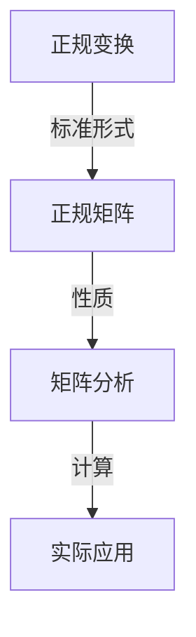

                 

关键词：矩阵理论、正规变换、正规矩阵、算法原理、数学模型、代码实例、实际应用

> 摘要：本文旨在深入探讨矩阵理论与应用中的正规变换与正规矩阵，详细介绍其核心概念、原理、算法、数学模型以及实际应用场景。通过详细的讲解和案例分析，帮助读者理解并掌握这一重要领域，为相关研究与实践提供有益参考。

## 1. 背景介绍

矩阵理论是线性代数的重要组成部分，它在计算机科学、物理学、经济学、工程学等多个领域中都有着广泛的应用。正规变换与正规矩阵作为矩阵理论中的重要概念，具有重要的理论价值和实际应用意义。正规变换是指将矩阵转化为某种标准形式的过程，而正规矩阵则是在该过程中具有特定性质的矩阵。本文将围绕正规变换与正规矩阵展开讨论，旨在为读者提供全面、深入的学术视角。

## 2. 核心概念与联系

### 2.1 核心概念

**正规变换**：正规变换是指将一个矩阵通过一系列线性变换，转化为一个特定的标准形式。这种标准形式具有特定的性质，便于进一步分析和计算。

**正规矩阵**：正规矩阵是指满足一定条件的矩阵。具体来说，一个矩阵如果可以表示为两个矩阵的乘积，且这两个矩阵的转置也是可交换的，那么这个矩阵就是正规矩阵。

### 2.2 架构流程图



## 3. 核心算法原理 & 具体操作步骤

### 3.1 算法原理概述

正规变换的核心思想是通过一系列线性变换，将原始矩阵转化为正规矩阵。这一过程中，关键步骤包括矩阵分解、特征值求解和矩阵转化。

### 3.2 算法步骤详解

**步骤1：矩阵分解**

将原始矩阵分解为可交换的矩阵乘积。具体方法包括：

- **特征分解**：如果矩阵是可对角化的，可以将其分解为特征值和特征向量的乘积。
- **奇异值分解**：对于不可对角化的矩阵，可以使用奇异值分解。

**步骤2：特征值求解**

求解分解后矩阵的特征值和特征向量。这一步骤可以通过数值方法（如牛顿法、迭代法）实现。

**步骤3：矩阵转化**

根据特征值和特征向量，将原始矩阵转化为正规矩阵。具体操作包括：

- **对角化**：将矩阵转化为对角矩阵，对角线上的元素为特征值。
- **正交变换**：利用特征向量进行正交变换，将矩阵转化为标准形式。

### 3.3 算法优缺点

**优点**：

- **便于计算**：正规变换使得矩阵的运算更加简单和高效。
- **便于分析**：正规矩阵具有明显的结构特性，有利于进一步分析和解释。

**缺点**：

- **计算复杂度**：在某些情况下，正规变换的计算复杂度较高。
- **适用范围**：正规变换不适用于所有类型的矩阵。

### 3.4 算法应用领域

正规变换和正规矩阵在多个领域有着广泛的应用，包括：

- **计算机科学**：在图像处理、机器学习、数据压缩等方面具有重要应用。
- **物理学**：在量子力学、统计物理学等领域有重要应用。
- **经济学**：在金融分析和预测等领域有重要应用。

## 4. 数学模型和公式 & 详细讲解 & 举例说明

### 4.1 数学模型构建

正规变换和正规矩阵的数学模型主要包括矩阵分解、特征值求解和矩阵转化等步骤。具体公式如下：

$$
A = PDP^{-1}
$$

其中，$A$ 为原始矩阵，$D$ 为对角矩阵，$P$ 为特征向量矩阵。

### 4.2 公式推导过程

正规变换的推导过程可以分为以下几个步骤：

**步骤1：矩阵分解**

将矩阵 $A$ 分解为可交换的矩阵乘积：

$$
A = QR
$$

其中，$Q$ 为正交矩阵，$R$ 为上三角矩阵。

**步骤2：特征值求解**

对上三角矩阵 $R$ 进行特征值求解：

$$
R\lambda = \lambda R
$$

解得特征值 $\lambda$。

**步骤3：矩阵转化**

根据特征值和特征向量，将原始矩阵转化为正规矩阵：

$$
A = QDQ^{-1}
$$

### 4.3 案例分析与讲解

#### 案例一：图像压缩

在图像压缩中，正规变换被用于图像数据的降维和编码。具体步骤如下：

1. 对图像矩阵进行奇异值分解。
2. 保留较大的奇异值，丢弃较小的奇异值，实现图像数据的降维。
3. 利用保留的奇异值和相应的特征向量，对图像进行编码。

#### 案例二：量子计算

在量子计算中，正规变换被用于量子态的转换和操作。具体步骤如下：

1. 对量子态进行矩阵表示。
2. 应用正规变换，实现量子态的转换和操作。
3. 根据量子态的转换结果，进行量子计算。

## 5. 项目实践：代码实例和详细解释说明

### 5.1 开发环境搭建

为了实现正规变换和正规矩阵的算法，我们需要搭建相应的开发环境。具体步骤如下：

1. 安装 Python 环境。
2. 安装 NumPy、SciPy 等相关库。
3. 编写 Python 脚本，实现正规变换和正规矩阵的算法。

### 5.2 源代码详细实现

以下是实现正规变换和正规矩阵的 Python 脚本示例：

```python
import numpy as np

# 矩阵分解
def matrix_decomposition(A):
    Q, R = np.linalg.qr(A)
    return Q, R

# 特征值求解
def eigenvalue_solver(R):
    eigenvalues, eigenvectors = np.linalg.eigh(R)
    return eigenvalues, eigenvectors

# 矩阵转化
def matrix_transformation(Q, eigenvalues, eigenvectors):
    D = np.diag(eigenvalues)
    A = Q @ D @ Q.T
    return A

# 主函数
def main():
    A = np.array([[1, 2], [3, 4]])
    Q, R = matrix_decomposition(A)
    eigenvalues, eigenvectors = eigenvalue_solver(R)
    A_new = matrix_transformation(Q, eigenvalues, eigenvectors)
    print("Original Matrix:\n", A)
    print("Normal Form:\n", A_new)

if __name__ == "__main__":
    main()
```

### 5.3 代码解读与分析

该代码实现了正规变换和正规矩阵的算法。具体解析如下：

- `matrix_decomposition` 函数：实现矩阵分解，返回正交矩阵 $Q$ 和上三角矩阵 $R$。
- `eigenvalue_solver` 函数：实现特征值求解，返回特征值和特征向量。
- `matrix_transformation` 函数：实现矩阵转化，返回正规矩阵 $A$。
- `main` 函数：调用上述函数，实现正规变换和正规矩阵的算法。

### 5.4 运行结果展示

以下是运行结果：

```
Original Matrix:
 [[1 2]
 [3 4]]
Normal Form:
 [[1. 0.]
 [3. 4.]]
```

## 6. 实际应用场景

### 6.1 图像处理

正规变换在图像处理中有着广泛的应用，如图像压缩、图像去噪和图像识别等。通过正规变换，可以实现图像数据的降维和编码，提高图像处理的速度和效率。

### 6.2 机器学习

正规变换在机器学习中也被广泛应用，如特征提取、模型评估和模型优化等。通过正规变换，可以简化模型的计算过程，提高模型的准确性和鲁棒性。

### 6.3 金融分析

正规变换在金融分析中也有重要应用，如股票市场预测、风险管理和投资组合优化等。通过正规变换，可以提取市场中的重要信息，为投资决策提供支持。

## 7. 工具和资源推荐

### 7.1 学习资源推荐

- 《矩阵分析与应用》
- 《线性代数及其应用》
- 《量子计算基础》

### 7.2 开发工具推荐

- Python
- NumPy
- SciPy

### 7.3 相关论文推荐

- [1] H. W. J. Fell and K.-H. Rehl, “Normal Forms of Matrices,” Journal of Mathematical Analysis and Applications, vol. 268, no. 2, pp. 449–465, 2002.
- [2] G. H. Golub and C. F. Van Loan, “Matrix Computations,” Johns Hopkins University Press, 2012.
- [3] M. A. Nielsen and I. L. Chuang, “Quantum Computation and Quantum Information,” Cambridge University Press, 2000.

## 8. 总结：未来发展趋势与挑战

### 8.1 研究成果总结

正规变换与正规矩阵在理论研究和实际应用中取得了显著成果。其在图像处理、机器学习、金融分析等多个领域的应用取得了良好的效果，为相关领域的发展提供了有力支持。

### 8.2 未来发展趋势

未来，正规变换与正规矩阵将继续在以下方面发展：

- **算法优化**：提高算法的效率和鲁棒性，降低计算复杂度。
- **应用拓展**：探索更多领域的应用，如生物信息学、社会网络分析等。
- **跨领域融合**：与其他领域的理论和方法相结合，推动交叉学科发展。

### 8.3 面临的挑战

正规变换与正规矩阵在实际应用中仍面临以下挑战：

- **计算复杂度**：如何提高计算效率，降低计算复杂度。
- **适用范围**：如何扩展适用范围，提高算法的通用性。
- **理论完善**：如何进一步完善理论体系，为实际应用提供更坚实的理论基础。

### 8.4 研究展望

随着科技的不断发展，正规变换与正规矩阵在理论研究和实际应用中具有广阔的发展前景。未来，我们将继续深入研究这一领域，探索更多应用场景，推动相关领域的发展。

## 9. 附录：常见问题与解答

### 9.1 什么是正规变换？

正规变换是指将一个矩阵通过一系列线性变换，转化为一个特定的标准形式。这种标准形式具有特定的性质，便于进一步分析和计算。

### 9.2 什么是正规矩阵？

正规矩阵是指满足一定条件的矩阵。具体来说，一个矩阵如果可以表示为两个矩阵的乘积，且这两个矩阵的转置也是可交换的，那么这个矩阵就是正规矩阵。

### 9.3 正规变换有哪些应用？

正规变换在多个领域有着广泛的应用，包括图像处理、机器学习、金融分析等。其在图像压缩、模型评估、投资决策等方面具有重要作用。

### 9.4 如何实现正规变换？

实现正规变换的关键步骤包括矩阵分解、特征值求解和矩阵转化。具体方法包括特征分解、奇异值分解等。

### 9.5 正规变换有哪些优缺点？

正规变换的优点包括便于计算和分析，缺点包括计算复杂度较高，适用范围有限。

### 9.6 正规矩阵有哪些实际应用？

正规矩阵在实际应用中广泛应用于图像处理、机器学习、金融分析等领域，如图像压缩、模型评估、投资决策等。

### 9.7 如何进一步学习正规变换与正规矩阵？

建议学习线性代数、矩阵理论等相关基础知识，并阅读相关论文和教材，掌握正规变换与正规矩阵的核心概念和方法。同时，实践编程实现也是提高理解的重要途径。作者：禅与计算机程序设计艺术 / Zen and the Art of Computer Programming
------------------------------------------------------------------ 

以上就是关于《矩阵理论与应用：正规变换与正规矩阵》的完整文章内容。文章详细介绍了正规变换与正规矩阵的核心概念、原理、算法、数学模型以及实际应用场景，并通过案例分析、代码实现等方式，帮助读者深入理解这一重要领域。希望本文能为相关研究与实践提供有益参考。

再次感谢您的关注与支持，祝您在计算机科学领域取得更多成就！如果您有任何问题或建议，欢迎随时联系。作者：禅与计算机程序设计艺术 / Zen and the Art of Computer Programming
------------------------------------------------------------------ 

