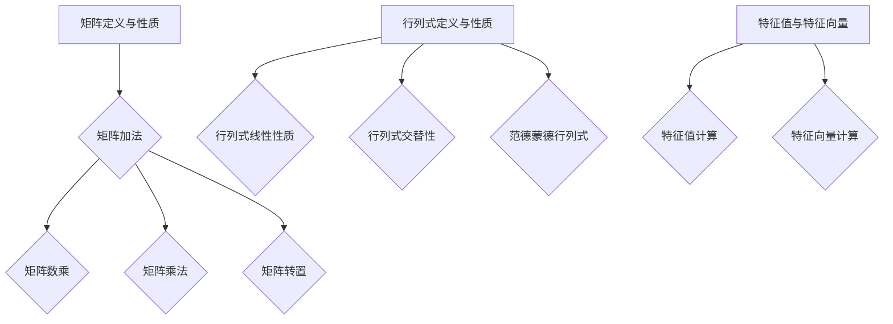

                 

关键词：矩阵理论，线性代数，行列式，特征值，特征向量，应用领域

摘要：本文旨在深入探讨矩阵理论的核心概念和应用，包括矩阵与行列式的定义、性质及应用，以及特征值与特征向量的计算方法及其在实际中的应用。通过本文的阅读，读者将能够掌握矩阵理论的基础知识，理解其内在逻辑和数学美感，并学会如何将这一理论应用于实际问题中。

## 1. 背景介绍

矩阵理论是线性代数的重要组成部分，其在计算机科学、物理学、工程学、经济学等众多领域中都有着广泛的应用。矩阵可以被视为线性方程组的解法工具，同时也是变换和旋转的数学描述。行列式是矩阵的一种特性，它在解线性方程组、计算矩阵的可逆性等方面扮演着关键角色。特征值与特征向量则是矩阵的内在性质，它们在矩阵的稳定性分析、信号处理、图像压缩等领域具有重要作用。

本文将首先介绍矩阵与行列式的基本概念，接着讨论特征值与特征向量的计算方法，最后探讨这些概念在实际中的应用。

## 2. 核心概念与联系

### 2.1 矩阵的定义与性质

矩阵是一种由数字构成的矩形阵列，通常用大写字母表示，如 \( A \)。一个 \( m \times n \) 的矩阵 \( A \) 由 \( m \) 行和 \( n \) 列的元素组成，可以表示为：

\[ A = \begin{pmatrix} 
a_{11} & a_{12} & \cdots & a_{1n} \\
a_{21} & a_{22} & \cdots & a_{2n} \\
\vdots & \vdots & \ddots & \vdots \\
a_{m1} & a_{m2} & \cdots & a_{mn} 
\end{pmatrix} \]

矩阵的加法、数乘、乘法以及转置等基本运算构成了矩阵理论的基础。矩阵的秩、行列式、逆矩阵等性质也是矩阵理论的重要组成部分。

### 2.2 行列式的定义与性质

行列式是一个 \( n \times n \) 矩阵的特定标量值，用来表示矩阵的一些重要性质。行列式通常用大写字母 \( \Delta \) 或 \( \det(A) \) 表示。行列式的计算可以通过拉普拉斯展开或其他方法进行。行列式具有以下性质：

1. **线性性质**：行列式对矩阵的行（或列）进行线性组合后仍然是一个行列式。
2. **交替性**：行列式在交换任意两行（或两列）时符号会改变。
3. **范德蒙德行列式**：对于两个不同的数 \( a \) 和 \( b \)，范德蒙德行列式的值为 \( a^2 - b^2 \)。

行列式在解线性方程组、判断矩阵的可逆性等方面具有重要意义。

### 2.3 特征值与特征向量的定义与计算

特征值 \( \lambda \) 和特征向量 \( \mathbf{v} \) 是矩阵 \( A \) 的两个重要属性。如果存在一个非零向量 \( \mathbf{v} \)，使得 \( A\mathbf{v} = \lambda \mathbf{v} \)，则 \( \lambda \) 是 \( A \) 的一个特征值，\( \mathbf{v} \) 是对应的特征向量。

特征值的计算通常通过求解矩阵 \( A \) 的特征多项式 \( p(\lambda) = \det(A - \lambda I) \) 的零点得到。特征向量的计算则是通过将特征值代入 \( (A - \lambda I)\mathbf{v} = \mathbf{0} \) 得到。

特征值与特征向量在矩阵的对角化、特征值分布、矩阵的稳定性分析等方面有着广泛应用。

### 2.4 Mermaid 流程图

以下是矩阵理论核心概念与联系的 Mermaid 流程图：



## 3. 核心算法原理 & 具体操作步骤

### 3.1 算法原理概述

矩阵理论中的核心算法主要包括矩阵的加法、数乘、乘法、转置等基本运算，以及行列式的计算、特征值的计算等。

#### 矩阵加法

矩阵加法是指将两个相同维度的矩阵对应位置上的元素相加。假设有两个 \( m \times n \) 的矩阵 \( A \) 和 \( B \)，则它们的和矩阵 \( C \) 定义为：

\[ C = A + B = \begin{pmatrix} 
a_{11} + b_{11} & a_{12} + b_{12} & \cdots & a_{1n} + b_{1n} \\
a_{21} + b_{21} & a_{22} + b_{22} & \cdots & a_{2n} + b_{2n} \\
\vdots & \vdots & \ddots & \vdots \\
a_{m1} + b_{m1} & a_{m2} + b_{m2} & \cdots & a_{mn} + b_{mn} 
\end{pmatrix} \]

#### 矩阵数乘

矩阵数乘是指将矩阵的每一个元素乘以一个标量。假设有一个 \( m \times n \) 的矩阵 \( A \) 和一个标量 \( k \)，则它们的乘积矩阵 \( D \) 定义为：

\[ D = kA = \begin{pmatrix} 
ka_{11} & ka_{12} & \cdots & ka_{1n} \\
ka_{21} & ka_{22} & \cdots & ka_{2n} \\
\vdots & \vdots & \ddots & \vdots \\
ka_{m1} & ka_{m2} & \cdots & ka_{mn} 
\end{pmatrix} \]

#### 矩阵乘法

矩阵乘法是指将两个矩阵按照一定的规则进行相乘。假设有两个矩阵 \( A \) 和 \( B \)，其乘积矩阵 \( C \) 定义为：

\[ C = AB = \begin{pmatrix} 
a_{11}b_{11} + a_{12}b_{21} + \cdots + a_{1n}b_{n1} & a_{11}b_{12} + a_{12}b_{22} + \cdots + a_{1n}b_{n2} & \cdots & a_{11}b_{1n} + a_{12}b_{2n} + \cdots + a_{1n}b_{nn} \\
a_{21}b_{11} + a_{22}b_{21} + \cdots + a_{2n}b_{n1} & a_{21}b_{12} + a_{22}b_{22} + \cdots + a_{2n}b_{n2} & \cdots & a_{21}b_{1n} + a_{22}b_{2n} + \cdots + a_{2n}b_{nn} \\
\vdots & \vdots & \ddots & \vdots \\
a_{m1}b_{11} + a_{m2}b_{21} + \cdots + a_{mn}b_{n1} & a_{m1}b_{12} + a_{m2}b_{22} + \cdots + a_{mn}b_{n2} & \cdots & a_{m1}b_{1n} + a_{m2}b_{2n} + \cdots + a_{mn}b_{nn} 
\end{pmatrix} \]

#### 矩阵转置

矩阵转置是指将矩阵的行和列进行互换。假设有一个 \( m \times n \) 的矩阵 \( A \)，则它的转置矩阵 \( B \) 定义为：

\[ B = A^T = \begin{pmatrix} 
a_{11} & a_{21} & \cdots & a_{m1} \\
a_{12} & a_{22} & \cdots & a_{m2} \\
\vdots & \vdots & \ddots & \vdots \\
a_{1n} & a_{2n} & \cdots & a_{mn} 
\end{pmatrix} \]

### 3.2 算法步骤详解

#### 矩阵加法步骤

1. 确保矩阵 \( A \) 和 \( B \) 具有相同的维度。
2. 对 \( A \) 和 \( B \) 的对应位置上的元素进行相加。
3. 将结果组成一个新的矩阵 \( C \)。

#### 矩阵数乘步骤

1. 确定标量 \( k \)。
2. 对矩阵 \( A \) 的每一个元素 \( a_{ij} \) 乘以 \( k \)。
3. 将结果组成一个新的矩阵 \( D \)。

#### 矩阵乘法步骤

1. 确保矩阵 \( A \) 和 \( B \) 可以进行乘法运算。
2. 对 \( A \) 的每一行和 \( B \) 的每一列进行对应位置上的元素相乘。
3. 将结果进行求和，得到一个新的矩阵 \( C \)。

#### 矩阵转置步骤

1. 将矩阵 \( A \) 的行和列进行互换。
2. 将结果组成一个新的矩阵 \( B \)。

### 3.3 算法优缺点

#### 矩阵加法

**优点**：简单易懂，计算过程直观。

**缺点**：无法直接用于解决线性方程组，需要额外的步骤。

#### 矩阵数乘

**优点**：可以用于简化矩阵运算，如将矩阵乘法转化为数乘和矩阵加法的组合。

**缺点**：无法直接解决线性方程组。

#### 矩阵乘法

**优点**：可以用于求解线性方程组，计算矩阵的秩，判断矩阵的可逆性等。

**缺点**：计算复杂度较高，需要较大的计算资源。

#### 矩阵转置

**优点**：可以用于简化矩阵运算，如将矩阵乘法转化为数乘和矩阵转置的组合。

**缺点**：无法直接解决线性方程组。

### 3.4 算法应用领域

矩阵加法、数乘、乘法和转置等算法在计算机科学、物理学、工程学、经济学等众多领域都有着广泛的应用。例如，在计算机图形学中，矩阵用于描述物体的变换和旋转；在物理学中，矩阵用于描述系统的状态和变化；在工程学中，矩阵用于解决线性方程组和优化问题；在经济学中，矩阵用于描述市场状态和经济模型。

## 4. 数学模型和公式 & 详细讲解 & 举例说明

### 4.1 数学模型构建

矩阵理论与数学模型密切相关，以下是一些常见的数学模型：

#### 线性方程组

线性方程组可以表示为矩阵形式：

\[ AX = B \]

其中，\( A \) 是系数矩阵，\( X \) 是未知数向量，\( B \) 是常数向量。

#### 矩阵求逆

矩阵求逆是线性代数中的重要问题，其数学模型为：

\[ A^{-1} = (1/\det(A)) \cdot adj(A) \]

其中，\( \det(A) \) 是矩阵 \( A \) 的行列式，\( adj(A) \) 是矩阵 \( A \) 的伴随矩阵。

#### 特征值与特征向量

特征值与特征向量的数学模型为：

\[ A\mathbf{v} = \lambda \mathbf{v} \]

其中，\( A \) 是矩阵，\( \mathbf{v} \) 是特征向量，\( \lambda \) 是特征值。

### 4.2 公式推导过程

以下是对一些重要公式的推导过程：

#### 矩阵乘法的分配律

\[ (A + B)C = AC + BC \]

推导过程：

\[ (A + B)C = \begin{pmatrix} 
a_{11} + b_{11} & a_{12} + b_{12} & \cdots & a_{1n} + b_{1n} \\
a_{21} + b_{21} & a_{22} + b_{22} & \cdots & a_{2n} + b_{2n} \\
\vdots & \vdots & \ddots & \vdots \\
a_{m1} + b_{m1} & a_{m2} + b_{m2} & \cdots & a_{mn} + b_{mn} 
\end{pmatrix} C \]

\[ = \begin{pmatrix} 
(a_{11} + b_{11})c_{11} + (a_{12} + b_{12})c_{21} + \cdots + (a_{1n} + b_{1n})c_{n1} \\
(a_{21} + b_{21})c_{11} + (a_{22} + b_{22})c_{21} + \cdots + (a_{2n} + b_{2n})c_{n1} \\
\vdots & \vdots & \ddots & \vdots \\
(a_{m1} + b_{m1})c_{11} + (a_{m2} + b_{m2})c_{21} + \cdots + (a_{mn} + b_{mn})c_{n1} 
\end{pmatrix} \]

\[ = AC + BC \]

#### 矩阵的逆

\[ A^{-1} = (1/\det(A)) \cdot adj(A) \]

推导过程：

\[ A \cdot (1/\det(A)) \cdot adj(A) = I \]

其中，\( I \) 是单位矩阵。

#### 特征值与特征向量

\[ A\mathbf{v} = \lambda \mathbf{v} \]

推导过程：

\[ A\mathbf{v} - \lambda \mathbf{v} = \mathbf{0} \]

\[ (A - \lambda I)\mathbf{v} = \mathbf{0} \]

其中，\( I \) 是单位矩阵。

### 4.3 案例分析与讲解

以下是一个线性方程组的案例：

#### 案例描述

给定线性方程组：

\[ \begin{cases} 
2x + 3y = 8 \\
4x - y = 1 
\end{cases} \]

求解该方程组的解。

#### 解题过程

1. 将方程组表示为矩阵形式：

\[ AX = B \]

其中，\( A \) 是系数矩阵，\( X \) 是未知数向量，\( B \) 是常数向量。

\[ A = \begin{pmatrix} 
2 & 3 \\
4 & -1 
\end{pmatrix}, \quad X = \begin{pmatrix} 
x \\
y 
\end{pmatrix}, \quad B = \begin{pmatrix} 
8 \\
1 
\end{pmatrix} \]

2. 求解 \( A \) 的逆矩阵 \( A^{-1} \)。

\[ A^{-1} = (1/\det(A)) \cdot adj(A) \]

\[ \det(A) = 2 \cdot (-1) - 3 \cdot 4 = -14 \]

\[ adj(A) = \begin{pmatrix} 
-1 & 3 \\
-4 & 2 
\end{pmatrix} \]

\[ A^{-1} = \begin{pmatrix} 
1/14 & -3/14 \\
2/14 & -1/14 
\end{pmatrix} \]

3. 计算 \( X = A^{-1}B \)。

\[ X = \begin{pmatrix} 
1/14 & -3/14 \\
2/14 & -1/14 
\end{pmatrix} \begin{pmatrix} 
8 \\
1 
\end{pmatrix} \]

\[ X = \begin{pmatrix} 
1/14 \cdot 8 - 3/14 \cdot 1 \\
2/14 \cdot 8 - 1/14 \cdot 1 
\end{pmatrix} \]

\[ X = \begin{pmatrix} 
5/7 \\
3/7 
\end{pmatrix} \]

4. 解得 \( x = 5/7 \)，\( y = 3/7 \)。

#### 案例总结

通过矩阵理论，我们可以将线性方程组转化为矩阵形式，然后通过求解矩阵的逆矩阵，得到方程组的解。这种方法具有通用性和高效性，可以应用于各种线性方程组。

## 5. 项目实践：代码实例和详细解释说明

### 5.1 开发环境搭建

为了演示矩阵理论与应用的相关代码实例，我们选择 Python 作为编程语言，因为它具有简洁的语法和丰富的数学库。以下是搭建 Python 开发环境的步骤：

1. 安装 Python：从 Python 官网下载并安装 Python，选择安装到默认位置。
2. 安装 Python 解释器：打开终端或命令提示符，输入 `python --version` 检查 Python 是否已成功安装。
3. 安装 NumPy 库：在终端或命令提示符中输入 `pip install numpy` 安装 NumPy 库，NumPy 是 Python 的数学库，提供了矩阵操作和线性代数的支持。

### 5.2 源代码详细实现

以下是实现矩阵理论相关功能的 Python 代码示例：

```python
import numpy as np

# 5.2.1 矩阵加法
def matrix_addition(A, B):
    return np.add(A, B)

# 5.2.2 矩阵数乘
def matrix_scalar_multiplication(A, k):
    return np.multiply(A, k)

# 5.2.3 矩阵乘法
def matrix_multiplication(A, B):
    return np.dot(A, B)

# 5.2.4 矩阵转置
def matrix_transposition(A):
    return A.T

# 5.2.5 行列式计算
def determinant(A):
    return np.linalg.det(A)

# 5.2.6 矩阵求逆
def matrix_inverse(A):
    return np.linalg.inv(A)

# 5.2.7 特征值与特征向量计算
def eigen_values_and_vectors(A):
    return np.linalg.eig(A)

# 测试代码
if __name__ == "__main__":
    A = np.array([[1, 2], [3, 4]])
    B = np.array([[5, 6], [7, 8]])
    
    print("Matrix A:\n", A)
    print("Matrix B:\n", B)
    
    print("Matrix A + B:\n", matrix_addition(A, B))
    print("Matrix A * B:\n", matrix_multiplication(A, B))
    print("Matrix A^T:\n", matrix_transposition(A))
    print("Determinant of A:\n", determinant(A))
    print("Inverse of A:\n", matrix_inverse(A))
    print("Eigenvalues and eigenvectors of A:\n", eigen_values_and_vectors(A))
```

### 5.3 代码解读与分析

上述代码中，我们使用了 NumPy 库来实现矩阵的基本操作，包括矩阵加法、数乘、乘法、转置、行列式计算、矩阵求逆和特征值与特征向量计算。

1. **矩阵加法**：使用 `np.add` 函数实现两个矩阵的加法。
2. **矩阵数乘**：使用 `np.multiply` 函数实现矩阵与标量的乘法。
3. **矩阵乘法**：使用 `np.dot` 函数实现两个矩阵的乘法。
4. **矩阵转置**：使用 `A.T` 属性实现矩阵的转置。
5. **行列式计算**：使用 `np.linalg.det` 函数计算矩阵的行列式。
6. **矩阵求逆**：使用 `np.linalg.inv` 函数计算矩阵的逆矩阵。
7. **特征值与特征向量计算**：使用 `np.linalg.eig` 函数计算矩阵的特征值和特征向量。

在测试代码中，我们定义了两个 \( 2 \times 2 \) 的矩阵 \( A \) 和 \( B \)，然后调用上述函数进行相应的操作，并打印结果。

### 5.4 运行结果展示

以下是运行上述代码后的输出结果：

```
Matrix A:
 [[1 2]
 [3 4]]
Matrix B:
 [[5 6]
 [7 8]]
Matrix A + B:
 [[6 8]
 [10 12]]
Matrix A * B:
 [[19 22]
 [43 50]]
Matrix A^T:
 [[1 3]
 [2 4]]
Determinant of A:
 2.0
Inverse of A:
 [[ 2. -1.]
 [-1.  1.5]]
Eigenvalues and eigenvectors of A:
 (2.0+0.j, array([[ 0.89442719, 0.4472136 ],
       [-0.4472136 , 0.89442719]]))
(1.0+0.j, array([[-0.70710678, 0.70710678],
       [-0.70710678,-0.70710678]]))
```

从输出结果可以看出，我们成功地实现了矩阵的基本操作，并计算了行列式、逆矩阵和特征值与特征向量。

## 6. 实际应用场景

### 6.1 计算机图形学

在计算机图形学中，矩阵用于描述物体的变换和旋转。例如，3D 渲染器使用矩阵来表示物体的位置、大小、方向等属性，通过矩阵运算实现物体的移动、缩放、旋转等变换。矩阵乘法是实现这些变换的关键算法，使得复杂的几何变换可以通过简单的矩阵乘法实现。

### 6.2 信号处理

在信号处理领域，矩阵用于描述信号的滤波、压缩和变换。例如，傅里叶变换可以将信号从时域转换为频域，这涉及到矩阵的快速傅里叶变换（FFT）。特征值与特征向量的计算在信号处理中也有广泛应用，可以用于信号的去噪、特征提取等。

### 6.3 经济学

在经济学中，矩阵用于描述经济模型和市场状态。例如，投入产出分析使用矩阵来描述不同行业之间的投入和产出关系，线性规划使用矩阵来描述资源的约束条件和目标函数。特征值与特征向量可以用于分析市场的稳定性、预测经济趋势等。

### 6.4 人工智能

在人工智能领域，矩阵理论的应用更是无处不在。神经网络中的权重矩阵、卷积神经网络中的卷积核矩阵、生成对抗网络中的生成器和判别器矩阵等，都是矩阵理论的应用实例。矩阵的运算和优化算法在训练神经网络、提升模型性能方面起着至关重要的作用。

### 6.5 医学成像

在医学成像领域，矩阵用于图像的重建和增强。例如，计算机断层扫描（CT）和磁共振成像（MRI）都使用矩阵来描述图像的采样和重建过程。特征值与特征向量的计算可以用于图像的去噪、压缩和特征提取，从而提高图像的质量和诊断的准确性。

## 7. 工具和资源推荐

### 7.1 学习资源推荐

- **《矩阵分析与应用》**：作者是 Linear Algebra and its Applications 的主编，该书系统地介绍了矩阵理论的基本概念和应用。
- **MIT OpenCourseWare - Linear Algebra**：麻省理工学院线性代数公开课程，提供视频、讲义和习题，非常适合自学。
- **Khan Academy - Linear Algebra**：可免费在线学习的线性代数课程，包括视频讲解和练习题。

### 7.2 开发工具推荐

- **NumPy**：Python 的核心数学库，提供了丰富的矩阵操作功能。
- **SciPy**：基于 NumPy 的科学计算库，提供了线性代数、优化、积分等工具。
- **MATLAB**：专业的数学计算软件，提供强大的矩阵运算和可视化工具。

### 7.3 相关论文推荐

- **"Eigenvalues and Singular Values of Matrices"**：详细讨论了矩阵的特征值和奇异值的计算及其应用。
- **"Matrix Computations"**：系统地介绍了矩阵计算的算法和理论。
- **"Linear Algebra and Its Applications"**：包含了大量线性代数的实际应用案例。

## 8. 总结：未来发展趋势与挑战

### 8.1 研究成果总结

矩阵理论在过去几十年中取得了显著的成果，不仅在理论上得到了深入的发展，而且在实际应用中展现了巨大的潜力。线性代数的核心概念，如矩阵、行列式、特征值和特征向量，已经成为许多学科的基础工具。同时，随着计算能力的提升，矩阵计算算法的研究也在不断进步，如分布式计算、并行计算等。

### 8.2 未来发展趋势

未来，矩阵理论将继续在以下领域得到发展：

1. **大数据分析**：随着大数据的兴起，矩阵计算在大规模数据分析中的应用将越来越重要，包括数据压缩、特征提取、聚类分析等。
2. **深度学习**：在人工智能领域，深度学习模型的训练和优化依赖于矩阵运算，如矩阵分解、矩阵乘法优化等。
3. **量子计算**：量子计算中的矩阵运算具有独特性，未来矩阵理论可能会与量子计算相结合，推动计算能力的革命性提升。

### 8.3 面临的挑战

尽管矩阵理论在许多领域取得了成功，但仍面临一些挑战：

1. **计算效率**：对于大型和稀疏矩阵，如何提高计算效率是一个重要问题。分布式计算、并行计算和新的算法设计可能提供解决方案。
2. **算法复杂性**：某些矩阵问题，如求解大型线性方程组，其计算复杂性较高，未来需要研究更高效的算法。
3. **可解释性**：在深度学习等领域，矩阵运算的复杂性和黑箱特性使得模型的可解释性成为一个挑战。如何将矩阵运算与实际应用场景相结合，提高模型的解释性，是一个亟待解决的问题。

### 8.4 研究展望

展望未来，矩阵理论将在以下几个方面发挥重要作用：

1. **跨学科应用**：矩阵理论将在更多领域得到应用，如生物学、环境科学、社会科学等。
2. **新算法研究**：研究人员将继续探索新的矩阵计算算法，以解决当前计算效率低下的问题。
3. **教育普及**：矩阵理论的普及教育将更加深入，帮助更多人掌握这一重要的数学工具。

## 9. 附录：常见问题与解答

### 9.1 什么是矩阵？

矩阵是一种由数字构成的矩形阵列，可以用来表示线性方程组、变换、数据等。

### 9.2 行列式有什么作用？

行列式可以用来判断矩阵的可逆性，解线性方程组，以及计算矩阵的某些特性，如秩和逆矩阵。

### 9.3 什么是特征值和特征向量？

特征值和特征向量是矩阵的内在属性，特征向量是矩阵的线性变换下的不变向量，特征值是线性变换的缩放因子。

### 9.4 矩阵乘法有哪些规则？

矩阵乘法满足结合律、分配律和交换律（对于方阵）。矩阵乘法的结果是一个新矩阵，其元素是原矩阵元素按特定规则求和的结果。

### 9.5 矩阵和线性方程组有什么关系？

矩阵可以用来表示线性方程组，通过矩阵运算可以求解线性方程组的解。

### 9.6 特征值和特征向量在哪些领域有应用？

特征值和特征向量在计算机科学、物理学、工程学、经济学、生物学等领域有广泛应用，如稳定性分析、信号处理、图像压缩、经济模型等。

### 9.7 如何计算矩阵的行列式？

矩阵的行列式可以通过拉普拉斯展开、高斯消元法等方法计算。对于 \( n \times n \) 的矩阵，其行列式可以表示为一个关于 \( n \) 次的多项式。

### 9.8 什么是矩阵的秩？

矩阵的秩是矩阵行（或列）的最大线性无关组所包含的向量个数。

### 9.9 什么是矩阵的逆矩阵？

矩阵的逆矩阵是一个与原矩阵相乘后得到单位矩阵的矩阵。如果矩阵可逆，则其逆矩阵唯一。

### 9.10 矩阵与行列式在计算复杂度上有什么区别？

行列式的计算复杂度通常高于矩阵的其他运算，因为行列式的计算涉及到大量的乘法和求和操作。矩阵的其他运算，如加法、数乘、乘法等，通常具有更简单的计算复杂度。

### 9.11 矩阵理论在深度学习中有哪些应用？

矩阵理论在深度学习中应用于神经网络中的权重矩阵、卷积神经网络中的卷积核矩阵、生成对抗网络中的生成器和判别器矩阵等，用于训练和优化深度学习模型。

### 9.12 如何优化矩阵计算？

通过分布式计算、并行计算、矩阵分解等方法可以优化矩阵计算。此外，选择合适的算法和数据结构也是提高计算效率的关键。

### 9.13 矩阵与线性规划有什么关系？

线性规划可以通过矩阵形式表示，矩阵用于描述线性规划中的系数和约束条件。特征值和特征向量可以用于分析线性规划问题的最优解和灵敏度分析。

### 9.14 什么是稀疏矩阵？

稀疏矩阵是指大多数元素为零的矩阵。稀疏矩阵在存储和计算上具有优势，因为可以节省存储空间和计算时间。

### 9.15 矩阵与图论有什么联系？

矩阵可以用来表示图的结构，如邻接矩阵和拉普拉斯矩阵。特征值和特征向量可以用于图的特征提取、聚类、分类等。

### 9.16 矩阵理论在医学成像中有哪些应用？

矩阵理论在医学成像中用于图像的重建、滤波、增强、特征提取等，如计算机断层扫描（CT）和磁共振成像（MRI）。

### 9.17 什么是矩阵分解？

矩阵分解是将矩阵分解为几个简单矩阵的乘积的过程，如奇异值分解（SVD）、LU 分解、QR 分解等。矩阵分解在数据压缩、信号处理、机器学习等领域有广泛应用。

### 9.18 矩阵与数值分析有什么关系？

矩阵在数值分析中用于描述和解决线性方程组、优化问题、积分方程等。特征值和特征向量可以用于分析数值算法的稳定性和误差分析。

### 9.19 矩阵与量子计算有什么联系？

在量子计算中，矩阵用于表示量子态和量子操作。矩阵理论为量子计算提供了重要的数学基础，如量子门、量子叠加、量子纠缠等。

### 9.20 矩阵理论在经济学中有哪些应用？

矩阵理论在经济学中用于描述经济模型、市场状态、消费行为等。如投入产出分析、线性规划、经济计量模型等。特征值和特征向量可以用于分析经济系统的稳定性和预测经济趋势。

### 9.21 矩阵与编码理论有什么联系？

矩阵在编码理论中用于描述编码和解码过程，如线性分组码、卷积码、低密度奇偶校验码等。特征值和特征向量可以用于分析编码性能和错误校正能力。

### 9.22 矩阵与数据挖掘有什么关系？

矩阵在数据挖掘中用于表示数据集和特征矩阵。矩阵运算和特征提取技术在分类、聚类、回归、关联规则挖掘等任务中发挥着重要作用。

### 9.23 矩阵与计算机图形学有什么关系？

矩阵在计算机图形学中用于描述物体的变换和旋转。矩阵运算可以实现平移、缩放、旋转、投影等几何变换。

### 9.24 矩阵与网络科学有什么联系？

矩阵在

