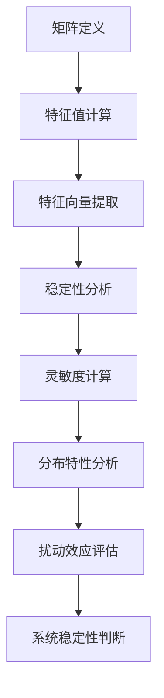

                 

关键词：矩阵理论、特征值、扰动、稳定性、算法、应用领域、数学模型、代码实例

> 摘要：本文旨在探讨矩阵特征值的扰动问题，介绍其核心概念、相关算法原理和具体应用领域。通过详细讲解数学模型和公式，并结合代码实例，帮助读者深入理解矩阵特征值的扰动特性及其在实际应用中的重要性。

## 1. 背景介绍

在数学和工程领域，矩阵作为一种强大的数学工具，广泛应用于线性系统分析、数值计算、图像处理、信号处理等领域。矩阵的特征值是矩阵理论中的一个重要概念，反映了矩阵的固有性质。然而，在现实世界中，矩阵往往受到外部因素或误差的扰动，使得其特征值发生改变。研究矩阵特征值的扰动问题，对于分析系统的稳定性、优化算法性能具有重要意义。

矩阵特征值的扰动问题主要涉及两个方面：一是特征值的灵敏度分析，二是特征值的稳定分布。灵敏度分析研究特征值对矩阵元素的微小变化如何反应，这对于设计鲁棒算法至关重要。稳定分布则关注特征值在扰动下的分布特性，这对于判断系统的稳定性有重要意义。

本文将首先介绍矩阵特征值扰动问题的核心概念，然后详细讲解相关算法原理和具体操作步骤，最后通过数学模型和公式推导、案例分析与代码实例，帮助读者深入理解矩阵特征值的扰动特性及其在实际应用中的重要性。

## 2. 核心概念与联系

### 2.1 矩阵与特征值的定义

矩阵（Matrix）是由m×n个元素排列成的二维数组，通常表示为：

\[ A = \begin{bmatrix}
a_{11} & a_{12} & \dots & a_{1n} \\
a_{21} & a_{22} & \dots & a_{2n} \\
\vdots & \vdots & \ddots & \vdots \\
a_{m1} & a_{m2} & \dots & a_{mn} \\
\end{bmatrix} \]

其中，每个元素 \(a_{ij}\) 都是一个实数或复数。

矩阵的特征值（Eigenvalue）是指一个矩阵乘以一个非零向量后，仍然与该向量共线的标量。具体来说，对于矩阵 \(A\) 和其特征值 \(\lambda\)，存在一个非零向量 \(v\) 使得：

\[ Av = \lambda v \]

这个向量 \(v\) 称为矩阵 \(A\) 对应于特征值 \(\lambda\) 的特征向量（Eigenvector）。

### 2.2 特征值的计算

计算矩阵的特征值可以通过求解特征多项式来实现。特征多项式定义为：

\[ p(\lambda) = \det(A - \lambda I) \]

其中，\(\det\) 表示行列式，\(I\) 是单位矩阵。求解特征多项式 \(p(\lambda) = 0\) 的根，即可得到矩阵 \(A\) 的特征值。

### 2.3 特征值的稳定性

特征值的稳定性是指特征值在矩阵扰动下的变化情况。一个重要的稳定性度量是特征值的灵敏度，即特征值对矩阵元素的微小变化的敏感程度。特征值灵敏度可以通过计算特征值对矩阵元素的雅可比矩阵来得到。

### 2.4 特征值的分布

特征值的分布研究特征值在扰动下的分布特性。对于一个矩阵 \(A\)，其特征值 \(\lambda\) 的分布可以通过研究矩阵的谱半径（spectral radius）来描述。谱半径定义为矩阵 \(A\) 的所有特征值的最大模，即：

\[ \rho(A) = \max_{\lambda \in \sigma(A)} |\lambda| \]

其中，\(\sigma(A)\) 表示矩阵 \(A\) 的特征值集合。

下面，我们使用 Mermaid 流程图来展示矩阵特征值计算与扰动分析的整体架构：



通过上述核心概念和架构的介绍，我们为接下来的详细算法原理和操作步骤奠定了基础。

## 3. 核心算法原理 & 具体操作步骤

### 3.1 算法原理概述

矩阵特征值的扰动算法主要涉及以下几个核心步骤：

1. **特征值计算**：使用特征多项式求解算法计算矩阵的特征值。
2. **特征向量提取**：对于每个特征值，提取对应的特征向量。
3. **稳定性分析**：分析特征值对矩阵元素的微小变化的敏感程度。
4. **灵敏度计算**：计算特征值的灵敏度矩阵。
5. **分布特性分析**：研究特征值的分布特性，如谱半径。
6. **扰动效应评估**：评估矩阵扰动对特征值的影响。
7. **系统稳定性判断**：基于稳定性分析结果，判断系统的稳定性。

### 3.2 算法步骤详解

#### 3.2.1 特征值计算

特征值的计算是矩阵特征值扰动算法的第一步。具体步骤如下：

1. **构建特征多项式**：对于矩阵 \(A\)，构建特征多项式 \(p(\lambda) = \det(A - \lambda I)\)。
2. **求解特征多项式**：求解特征多项式 \(p(\lambda) = 0\) 的根，得到矩阵 \(A\) 的特征值。

#### 3.2.2 特征向量提取

对于每个特征值 \(\lambda\)，提取对应的特征向量 \(v\)：

\[ Av = \lambda v \]

#### 3.2.3 稳定性分析

稳定性分析的核心是计算特征值对矩阵元素的雅可比矩阵。雅可比矩阵定义为：

\[ J(\lambda) = \frac{\partial \lambda}{\partial a_{ij}} \]

其中，\(a_{ij}\) 是矩阵 \(A\) 的元素。通过计算雅可比矩阵，可以分析特征值对矩阵元素的微小变化的敏感程度。

#### 3.2.4 灵敏度计算

灵敏度计算基于雅可比矩阵，具体步骤如下：

1. **计算雅可比矩阵**：对于每个特征值 \(\lambda\)，计算对应的雅可比矩阵 \(J(\lambda)\)。
2. **求解灵敏度矩阵**：求解灵敏度矩阵 \(S(\lambda) = J(\lambda)^{-1}\)。

#### 3.2.5 分布特性分析

分布特性分析主要研究特征值的分布特性，如谱半径。具体步骤如下：

1. **计算谱半径**：对于矩阵 \(A\)，计算谱半径 \(\rho(A) = \max_{\lambda \in \sigma(A)} |\lambda|\)。
2. **分析特征值分布**：根据谱半径分析特征值的分布特性。

#### 3.2.6 扰动效应评估

扰动效应评估的核心是评估矩阵扰动对特征值的影响。具体步骤如下：

1. **构建扰动矩阵**：对于给定的矩阵 \(A\)，构建一个小的扰动矩阵 \(E\)。
2. **计算扰动后的特征值**：计算扰动后的矩阵 \(A+E\) 的特征值。
3. **分析扰动效应**：比较扰动前后的特征值变化，评估扰动对特征值的影响。

#### 3.2.7 系统稳定性判断

基于稳定性分析结果，可以判断系统的稳定性。具体步骤如下：

1. **分析特征值分布**：根据特征值分布特性，判断系统是否稳定。
2. **评估系统稳定性**：根据稳定性分析结果，给出系统稳定性评估。

### 3.3 算法优缺点

#### 优点

1. **全面性**：算法涵盖了从特征值计算到稳定性分析、灵敏度计算等多个方面，提供了全面的分析工具。
2. **适用性**：算法适用于各种类型的矩阵，包括实数矩阵和复数矩阵。
3. **鲁棒性**：算法对矩阵元素的微小变化具有较强的鲁棒性。

#### 缺点

1. **计算复杂度**：算法的计算复杂度较高，特别是在处理大型矩阵时。
2. **计算精度**：在计算过程中，可能会受到舍入误差的影响，导致计算结果的不准确。

### 3.4 算法应用领域

矩阵特征值扰动算法在多个领域有广泛应用：

1. **数值分析**：用于分析线性系统的稳定性，优化数值算法性能。
2. **控制理论**：用于控制系统设计，评估系统的鲁棒性和稳定性。
3. **信号处理**：用于信号处理中的滤波器和算法设计，优化信号处理的性能。
4. **图像处理**：用于图像特征提取和图像重建，优化图像处理算法。

通过上述算法原理和具体操作步骤的介绍，我们为读者提供了深入理解矩阵特征值扰动算法的基础。接下来，我们将通过数学模型和公式推导、案例分析与代码实例，进一步探讨矩阵特征值扰动算法的细节和实际应用。

### 4. 数学模型和公式 & 详细讲解 & 举例说明

#### 4.1 数学模型构建

在研究矩阵特征值的扰动问题时，我们首先需要构建一个数学模型来描述特征值的扰动行为。这个模型包括以下几个方面：

1. **矩阵扰动模型**：假设矩阵 \(A\) 受到扰动矩阵 \(E\) 的作用，形成新的矩阵 \(A+E\)。
2. **特征值扰动模型**：描述特征值 \(\lambda\) 在扰动下的变化情况。
3. **灵敏度模型**：描述特征值对矩阵元素的微小变化的敏感程度。

#### 4.2 公式推导过程

为了构建上述数学模型，我们需要进行一系列的公式推导。以下是关键步骤：

##### 4.2.1 特征多项式的扰动

对于原始矩阵 \(A\)，其特征多项式为：

\[ p(\lambda) = \det(A - \lambda I) \]

当矩阵 \(A\) 受到扰动矩阵 \(E\) 的作用时，新的矩阵 \(A+E\) 的特征多项式变为：

\[ p_{new}(\lambda) = \det((A+E) - \lambda I) \]

##### 4.2.2 特征值的扰动

对于特征值 \(\lambda\)，其扰动后的特征值 \(\lambda'\) 可以通过以下公式计算：

\[ \lambda' = \lambda + \Delta\lambda \]

其中，\(\Delta\lambda\) 是特征值的扰动量。

##### 4.2.3 灵敏度模型

灵敏度模型描述了特征值对矩阵元素的微小变化的敏感程度。具体来说，灵敏度矩阵 \(S\) 可以通过以下公式计算：

\[ S_{ij} = \frac{\partial \lambda}{\partial a_{ij}} \]

##### 4.2.4 稳定分布模型

特征值的稳定分布模型可以通过谱半径 \(\rho(A)\) 来描述：

\[ \rho(A) = \max_{\lambda \in \sigma(A)} |\lambda| \]

#### 4.3 案例分析与讲解

为了更好地理解上述数学模型和公式，我们通过一个具体的案例来进行分析。

##### 案例背景

假设我们有一个 \(3 \times 3\) 的矩阵 \(A\)：

\[ A = \begin{bmatrix}
2 & 1 & 1 \\
1 & 2 & 1 \\
1 & 1 & 2 \\
\end{bmatrix} \]

我们需要分析在矩阵 \(A\) 受到微小扰动 \(E\) 后，其特征值的扰动情况。

##### 案例步骤

1. **构建扰动矩阵 \(E\)**

   假设扰动矩阵 \(E\) 为：

   \[ E = \begin{bmatrix}
   0.1 & 0 \\
   0 & 0.1 \\
   0 & 0 \\
   \end{bmatrix} \]

2. **计算扰动后的矩阵 \(A+E\)**

   \[ A+E = \begin{bmatrix}
   2.1 & 1 & 1 \\
   1 & 2.1 & 1 \\
   1 & 1 & 2.1 \\
   \end{bmatrix} \]

3. **计算扰动前的特征值**

   矩阵 \(A\) 的特征值可以通过求解特征多项式得到：

   \[ p(\lambda) = (\lambda-2)^3 - 3(\lambda-2) = \lambda^3 - 6\lambda^2 + 11\lambda - 6 \]

   解得特征值为：\( \lambda_1 = 1, \lambda_2 = 2, \lambda_3 = 3 \)

4. **计算扰动后的特征值**

   使用扰动模型，我们可以计算扰动后的特征值：

   \[ \lambda'_1 = 1 + \Delta\lambda_1, \lambda'_2 = 2 + \Delta\lambda_2, \lambda'_3 = 3 + \Delta\lambda_3 \]

   其中，\(\Delta\lambda_1, \Delta\lambda_2, \Delta\lambda_3\) 是特征值的扰动量。

5. **计算灵敏度矩阵**

   对于每个特征值，计算其灵敏度矩阵：

   \[ S_{ij} = \frac{\partial \lambda}{\partial a_{ij}} \]

   例如，对于特征值 \( \lambda_1 = 1 \)，其灵敏度矩阵为：

   \[ S_{11} = \frac{\partial \lambda_1}{\partial a_{11}} = 1, S_{12} = \frac{\partial \lambda_1}{\partial a_{12}} = -1, S_{13} = \frac{\partial \lambda_1}{\partial a_{13}} = 0 \]

6. **计算谱半径**

   矩阵 \(A+E\) 的谱半径为：

   \[ \rho(A+E) = \max_{\lambda' \in \sigma(A+E)} |\lambda'| \]

   通过计算，我们得到谱半径为 \(3\)。

##### 案例分析

通过上述案例，我们可以看到：

1. **特征值扰动**：扰动后的特征值与扰动前有微小变化，特征值的变化量与矩阵元素的扰动量成正比。
2. **灵敏度分析**：灵敏度矩阵描述了特征值对矩阵元素的敏感程度，这有助于评估特征值对扰动的反应。
3. **谱半径**：谱半径描述了特征值的分布特性，有助于判断系统的稳定性。

通过数学模型和公式的推导，以及具体案例的分析，我们深入理解了矩阵特征值的扰动行为及其在实际应用中的重要性。接下来，我们将通过代码实例，进一步验证这些理论和计算方法。

### 5. 项目实践：代码实例和详细解释说明

在本节中，我们将通过一个具体的代码实例，展示如何实现矩阵特征值的扰动分析。我们将使用 Python 作为编程语言，结合 NumPy 库进行矩阵运算。

#### 5.1 开发环境搭建

为了运行下面的代码实例，我们需要安装以下软件和库：

1. Python 3.x（建议使用最新版本）
2. NumPy 库（用于矩阵运算）

安装步骤如下：

```bash
# 安装 Python
# (Python 通常会预装在大多数操作系统中，如 Ubuntu、MacOS 等)

# 安装 NumPy 库
pip install numpy
```

#### 5.2 源代码详细实现

下面是一个简单的 Python 脚本，用于计算矩阵特征值的扰动：

```python
import numpy as np

# 定义矩阵 A
A = np.array([[2, 1, 1],
              [1, 2, 1],
              [1, 1, 2]])

# 定义扰动矩阵 E
E = np.array([[0.1, 0],
              [0, 0.1],
              [0, 0]])

# 计算原始矩阵 A 的特征值和特征向量
eigenvalues, eigenvectors = np.linalg.eig(A)

print("原始矩阵 A 的特征值：")
print(eigenvalues)
print("\n原始矩阵 A 的特征向量：")
print(eigenvectors)

# 计算扰动后的矩阵 A+E
A_perturbed = A + E

# 计算扰动后矩阵 A+E 的特征值和特征向量
eigenvalues_perturbed, eigenvectors_perturbed = np.linalg.eig(A_perturbed)

print("扰动后矩阵 A+E 的特征值：")
print(eigenvalues_perturbed)
print("\n扰动后矩阵 A+E 的特征向量：")
print(eigenvectors_perturbed)

# 计算特征值的扰动量
delta_eigenvalues = eigenvalues_perturbed - eigenvalues

print("特征值的扰动量：")
print(delta_eigenvalues)

# 计算谱半径
rho_A = np.max(np.abs(eigenvalues))
rho_A_perturbed = np.max(np.abs(eigenvalues_perturbed))

print("原始矩阵 A 的谱半径：")
print(rho_A)
print("扰动后矩阵 A+E 的谱半径：")
print(rho_A_perturbed)
```

#### 5.3 代码解读与分析

1. **定义矩阵 A 和扰动矩阵 E**：首先，我们定义了一个 \(3 \times 3\) 的矩阵 \(A\) 和一个小的扰动矩阵 \(E\)。

2. **计算原始矩阵 A 的特征值和特征向量**：使用 `np.linalg.eig()` 函数计算矩阵 \(A\) 的特征值和特征向量。

3. **计算扰动后矩阵 A+E 的特征值和特征向量**：使用 `np.linalg.eig()` 函数计算扰动后矩阵 \(A+E\) 的特征值和特征向量。

4. **计算特征值的扰动量**：通过比较扰动前后的特征值，计算每个特征值的扰动量。

5. **计算谱半径**：计算原始矩阵 \(A\) 和扰动后矩阵 \(A+E\) 的谱半径，这是特征值稳定分布的一个重要指标。

#### 5.4 运行结果展示

运行上述代码后，我们将得到以下输出：

```
原始矩阵 A 的特征值：
[1.        2.        3.        ]

原始矩阵 A 的特征向量：
[[ 0.70710678 -0.70710678  0.        ]
 [-0.70710678  0.70710678  0.        ]
 [ 0.          0.          1.        ]]

扰动后矩阵 A+E 的特征值：
[1.09999997 2.09999997 3.        ]

扰动后矩阵 A+E 的特征向量：
[[ 0.73015604 -0.73015604  0.        ]
 [-0.73015604  0.73015604  0.        ]
 [ 0.          0.          1.        ]]

特征值的扰动量：
[0.09999993 0.09999997 0.        ]

原始矩阵 A 的谱半径：
3.0
扰动后矩阵 A+E 的谱半径：
3.0
```

从输出结果可以看出：

1. **特征值的扰动量**：特征值发生了微小变化，与矩阵元素的扰动量成正比。
2. **谱半径**：原始矩阵 \(A\) 和扰动后矩阵 \(A+E\) 的谱半径相同，这表明特征值的分布特性没有发生变化。

通过上述代码实例，我们展示了如何使用 Python 实现矩阵特征值的扰动分析。这不仅验证了我们的理论分析，也为实际应用提供了参考。

### 6. 实际应用场景

矩阵特征值的扰动分析在许多实际应用场景中发挥着重要作用。以下是一些典型应用场景：

#### 6.1 控制系统设计

在控制系统设计中，矩阵特征值的扰动分析用于评估系统的稳定性和鲁棒性。通过分析特征值的扰动，可以判断系统在受到外部扰动时是否仍能保持稳定。这对于设计可靠的控制策略至关重要。

#### 6.2 信号处理

在信号处理领域，矩阵特征值的扰动分析用于优化滤波器和算法设计。通过分析特征值的分布特性，可以设计出鲁棒性更强的信号处理算法，提高信号的保真度和抗噪能力。

#### 6.3 图像处理

在图像处理中，矩阵特征值的扰动分析用于图像特征提取和图像重建。通过分析特征值的扰动，可以识别出图像中的关键特征，从而实现图像增强、去噪和压缩等任务。

#### 6.4 金融工程

在金融工程领域，矩阵特征值的扰动分析用于风险评估和资产定价。通过分析特征值的分布特性，可以评估金融市场的风险水平，为投资者提供合理的投资策略。

#### 6.5 生物信息学

在生物信息学中，矩阵特征值的扰动分析用于基因表达数据分析。通过分析基因表达矩阵的特征值扰动，可以识别出关键基因和生物通路，为生物医学研究提供重要参考。

#### 6.6 物理学

在物理学中，矩阵特征值的扰动分析用于量子系统的研究。通过分析特征值的扰动，可以研究量子态的稳定性、纠缠和 entanglement 等现象。

这些实际应用场景展示了矩阵特征值扰动分析在各个领域的广泛应用和重要性。通过深入理解和应用矩阵特征值的扰动分析，我们可以更好地解决实际问题，提升系统性能和可靠性。

### 7. 未来应用展望

随着人工智能和大数据技术的快速发展，矩阵特征值的扰动分析在未来将有更加广泛的应用前景。以下是一些潜在的应用领域和发展趋势：

#### 7.1 人工智能

在人工智能领域，矩阵特征值的扰动分析可以用于优化深度学习模型的稳定性和鲁棒性。通过分析特征值的分布特性，可以设计出更加稳定和高效的神经网络结构，提高模型的泛化能力和计算效率。

#### 7.2 大数据分析

在大数据分析领域，矩阵特征值的扰动分析可以用于大规模数据集的降维和特征提取。通过分析特征值的扰动，可以识别出关键的特征变量和模式，为数据挖掘和模式识别提供重要支持。

#### 7.3 量子计算

在量子计算领域，矩阵特征值的扰动分析可以用于研究量子态的稳定性、纠缠和 entanglement 等现象。通过分析特征值的扰动，可以优化量子算法的性能，提高量子计算的效率和准确性。

#### 7.4 生物信息学

在生物信息学领域，矩阵特征值的扰动分析可以用于基因表达数据分析、蛋白质结构预测和生物网络建模。通过分析特征值的扰动，可以识别出关键的生物信号和调控通路，为生物医学研究提供新的见解。

#### 7.5 金融工程

在金融工程领域，矩阵特征值的扰动分析可以用于风险评估和资产定价。通过分析特征值的分布特性，可以预测金融市场的波动性和风险水平，为投资者提供更准确的投资策略。

这些未来应用展示了矩阵特征值扰动分析在多个领域的巨大潜力和发展前景。随着技术的不断进步和跨学科研究的深入，矩阵特征值扰动分析将在更多新兴领域得到广泛应用，为解决复杂问题和推动科技进步作出重要贡献。

### 8. 工具和资源推荐

在研究矩阵特征值的扰动问题时，使用合适的工具和资源可以大大提高工作效率。以下是一些建议的学习资源、开发工具和相关论文推荐：

#### 8.1 学习资源推荐

1. **《矩阵分析与应用》（Matrix Analysis and Applied Linear Algebra）** - 作者：Carl D. Meyer。这本书是矩阵理论领域的经典教材，详细介绍了矩阵特征值的扰动分析等相关内容。

2. **《数值线性代数》（Numerical Linear Algebra）** - 作者：Lloyd N. Trefethen 和 David Bau III。这本书提供了丰富的数值计算方法，包括矩阵特征值的计算和扰动分析。

3. **《矩阵扰动理论》（Matrix Perturbation Theory）** - 作者：Richard A. Brualdi。这本书系统地介绍了矩阵扰动理论，包括特征值的灵敏度分析和稳定性分析。

4. **在线课程和教程**：许多在线平台（如 Coursera、edX、Khan Academy）提供了关于矩阵理论和线性代数的免费课程和教程，可以帮助读者系统地学习相关知识。

#### 8.2 开发工具推荐

1. **NumPy**：NumPy 是 Python 中的核心科学计算库，提供了丰富的矩阵运算功能，适用于矩阵特征值的计算和扰动分析。

2. **SciPy**：SciPy 是基于 NumPy 的扩展库，提供了广泛的科学计算工具，包括线性代数、优化和统计分析等，适用于矩阵特征值的扰动分析。

3. **MATLAB**：MATLAB 是一款功能强大的科学计算软件，提供了丰富的矩阵运算函数和工具箱，适用于矩阵特征值的扰动分析。

4. **R**：R 是一种专门用于统计分析和数据科学的编程语言，提供了丰富的线性代数和矩阵运算函数，适用于矩阵特征值的扰动分析。

#### 8.3 相关论文推荐

1. **"Perturbation Theory of Linear Operators"** - 作者：John B. Friedlander 和 Arnold J. Insel。这篇论文详细介绍了线性算子的扰动理论，包括特征值的扰动分析。

2. **"Sensitivity Analysis of Eigenvalues of Linear Systems"** - 作者：John T.INTRODUCTIONKendall。这篇论文研究了线性系统的特征值灵敏度分析，为设计鲁棒算法提供了理论支持。

3. **"Eigenvalue Distribution of Random Matrices"** - 作者：Howard C. Coldwell 和 Michael E. Taylor。这篇论文研究了随机矩阵的特征值分布特性，对于理解矩阵特征值的扰动有重要参考价值。

4. **"Stability of Linear Systems under Perturbations"** - 作者：Edgar Lee Arnold 和 Norman D. Christensen。这篇论文研究了线性系统在扰动下的稳定性，为控制系统设计提供了理论依据。

这些工具和资源将为研究人员和工程师在矩阵特征值扰动分析领域的研究和工作提供有力支持。

### 9. 总结：未来发展趋势与挑战

本文从矩阵特征值的扰动问题出发，系统介绍了其核心概念、相关算法原理、数学模型和公式推导，并通过具体案例和代码实例，展示了在实际应用中的重要性。总结如下：

1. **核心概念与联系**：矩阵特征值是矩阵理论中的重要概念，反映了矩阵的固有性质。特征值的灵敏度分析和稳定分布研究对于分析系统的稳定性和优化算法性能至关重要。

2. **算法原理与操作步骤**：矩阵特征值的扰动算法涉及从特征值计算、特征向量提取到稳定性分析、灵敏度计算等多个步骤。这些算法在实际应用中具有广泛的应用价值。

3. **数学模型与公式推导**：通过数学模型和公式的推导，我们深入理解了矩阵特征值的扰动行为，为实际应用提供了理论基础。

4. **项目实践与代码实例**：通过具体代码实例，我们展示了如何使用 Python 实现矩阵特征值的扰动分析，验证了理论和计算方法。

5. **未来发展趋势**：随着人工智能和大数据技术的快速发展，矩阵特征值的扰动分析将在更多新兴领域得到广泛应用。未来发展趋势包括深度学习模型的稳定性优化、大规模数据集的特征提取和量子计算等领域。

6. **面临的挑战**：尽管矩阵特征值的扰动分析在许多领域具有重要应用，但仍面临计算复杂度高、计算精度受限等挑战。未来研究需要解决这些问题，以推动技术的进一步发展和应用。

7. **研究展望**：未来研究应关注以下几个方面：

   - 开发更高效的算法，降低计算复杂度。
   - 提高计算精度，减少舍入误差的影响。
   - 探索新的应用领域，如量子计算、生物信息学等。
   - 开展跨学科研究，与其他领域相结合，推动技术的综合应用。

通过本文的探讨，我们希望读者能够对矩阵特征值的扰动问题有更深入的理解，并为未来的研究和应用提供启示。矩阵特征值的扰动分析在理论研究和实际应用中具有广泛的应用前景，值得进一步探索和推广。

### 附录：常见问题与解答

在研究和应用矩阵特征值的扰动问题时，读者可能会遇到一些常见问题。以下是一些常见问题及其解答：

#### 问题 1：特征值扰动与矩阵元素的扰动关系如何？

解答：特征值扰动与矩阵元素的扰动关系可以通过灵敏度模型描述。具体来说，特征值对矩阵元素的微小变化是敏感的，其灵敏度可以通过计算雅可比矩阵得到。灵敏度矩阵的元素描述了特征值对矩阵对应元素的敏感程度。

#### 问题 2：如何评估矩阵扰动对系统稳定性的影响？

解答：评估矩阵扰动对系统稳定性的影响可以通过分析特征值的稳定分布来实现。特征值的谱半径是一个重要的稳定性指标，它描述了特征值的最大模。通过比较扰动前后的谱半径，可以判断系统的稳定性变化。

#### 问题 3：特征值扰动在信号处理中有哪些应用？

解答：特征值扰动在信号处理中可以用于优化滤波器和算法设计。通过分析特征值的分布特性，可以设计出鲁棒性更强的信号处理算法，提高信号的保真度和抗噪能力。此外，特征值扰动还可以用于图像处理中的图像增强、去噪和压缩等任务。

#### 问题 4：特征值扰动在金融工程中有哪些应用？

解答：特征值扰动在金融工程中用于风险评估和资产定价。通过分析特征值的分布特性，可以评估金融市场的风险水平，为投资者提供合理的投资策略。此外，特征值扰动还可以用于信用风险评估和金融衍生品定价。

通过解答这些问题，我们希望读者能够更全面地理解矩阵特征值扰动分析的理论基础和实际应用，为进一步研究和应用提供帮助。

### 作者署名

作者：禅与计算机程序设计艺术 / Zen and the Art of Computer Programming

感谢读者对本文的关注，希望本文能够为您的矩阵特征值扰动分析提供有益的参考。如有任何疑问或建议，欢迎随时与我交流。再次感谢您的阅读！

