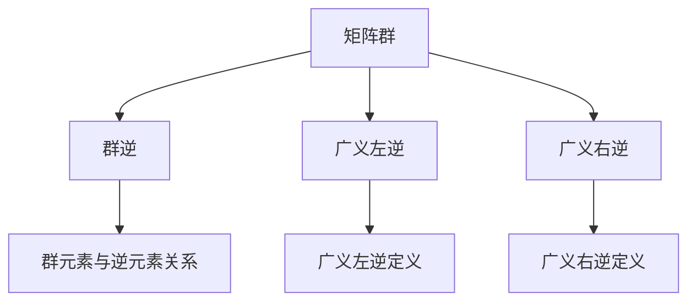

                 

关键词：矩阵理论，群逆，广义左逆，广义右逆，算法原理，数学模型，项目实践，实际应用场景，未来展望。

> 摘要：本文旨在深入探讨矩阵理论中的群逆与广义左（右）逆概念，通过详细的算法原理分析、数学模型构建、公式推导以及具体案例的讲解，帮助读者更好地理解和应用这些重要概念。文章还将结合项目实践，展示如何在实际编程中实现这些算法，并讨论其在各种领域的应用场景及未来发展趋势。

## 1. 背景介绍

矩阵理论是现代数学中的一个重要分支，其应用范围广泛，从物理学、工程学、经济学到计算机科学等领域都有所涉及。矩阵的逆是矩阵理论中一个非常核心的概念，对于解决线性方程组、优化问题、特征值分析等问题具有重要意义。

在矩阵理论中，矩阵的逆通常指的是一个与原矩阵相乘后结果为单位矩阵的矩阵。然而，并非所有的矩阵都有逆矩阵。一个矩阵存在逆矩阵的条件是其行列式不为零。如果矩阵的行列式为零，则该矩阵称为奇异矩阵，它没有逆矩阵。

本文主要探讨的是群逆与广义左（右）逆的概念。群逆是指在一个特定的群（如矩阵群）中，每个元素都存在逆元素。广义左（右）逆则是当原矩阵不能直接求逆时，通过一些数学变换和优化算法得到的近似逆矩阵。这些概念在解决实际问题时具有非常重要的应用价值。

## 2. 核心概念与联系

### 2.1 群逆概念

在群论中，一个群的元素与其逆元素的关系可以用以下公式表示：

\[ a \cdot a^{-1} = e \]

其中，\( a \) 是群中的元素，\( a^{-1} \) 是 \( a \) 的逆元素，\( e \) 是群的单位元素。

在矩阵群中，如果矩阵 \( A \) 存在逆矩阵 \( A^{-1} \)，则有：

\[ A \cdot A^{-1} = I \]

其中，\( I \) 是单位矩阵。

### 2.2 广义左（右）逆概念

当矩阵 \( A \) 是奇异矩阵时，它没有逆矩阵。但在许多实际问题中，我们仍然需要找到一种方法来近似求解线性方程组 \( AX = B \)。此时，广义左（右）逆的概念就非常有用。

#### 广义左逆

一个矩阵 \( A \) 的广义左逆 \( A_L \) 满足以下条件：

\[ A_L A = I \]

即，\( A_L \) 与 \( A \) 相乘后得到单位矩阵。

#### 广义右逆

一个矩阵 \( A \) 的广义右逆 \( A_R \) 满足以下条件：

\[ A A_R = I \]

即，\( A \) 与 \( A_R \) 相乘后得到单位矩阵。

### 2.3 Mermaid 流程图

以下是一个展示矩阵理论中群逆与广义左（右）逆关系的 Mermaid 流程图：



## 3. 核心算法原理 & 具体操作步骤

### 3.1 算法原理概述

群逆与广义左（右）逆的算法原理主要基于矩阵的基本运算和逆矩阵的性质。具体来说，群逆算法利用群论的基本原理，通过计算每个矩阵元素的逆元素来实现。而广义左（右）逆算法则通过数值优化方法，寻找一个与原矩阵相乘后最接近单位矩阵的矩阵。

### 3.2 算法步骤详解

#### 3.2.1 群逆算法

1. 输入矩阵 \( A \)。
2. 计算矩阵 \( A \) 的行列式 \( |A| \)。
3. 当 \( |A| \neq 0 \) 时，计算 \( A \) 的伴随矩阵 \( A^* \)。
4. 计算 \( A^{-1} = \frac{1}{|A|} A^* \)。

#### 3.2.2 广义左逆算法

1. 输入矩阵 \( A \) 和向量 \( b \)。
2. 构造最小二乘问题 \( min \| AX - b \|_2 \)。
3. 使用数值优化方法（如梯度下降法、牛顿法等）求解最小二乘问题。
4. 得到广义左逆 \( A_L \)。

#### 3.2.3 广义右逆算法

1. 输入矩阵 \( A \) 和向量 \( b \)。
2. 构造最小二乘问题 \( min \| AX - b \|_2 \)。
3. 使用数值优化方法（如梯度下降法、牛顿法等）求解最小二乘问题。
4. 得到广义右逆 \( A_R \)。

### 3.3 算法优缺点

#### 群逆算法

**优点：**
- 理论基础明确，易于理解。
- 计算简单，只需计算伴随矩阵和行列式的倒数。

**缺点：**
- 对于奇异矩阵，无法计算。
- 计算复杂度较高，尤其是对于大型矩阵。

#### 广义左（右）逆算法

**优点：**
- 可以处理奇异矩阵。
- 计算复杂度相对较低，适合大规模问题。

**缺点：**
- 解的精度受数值优化方法影响。
- 可能存在多个近似解，需要进一步筛选。

### 3.4 算法应用领域

群逆与广义左（右）逆算法在众多领域中都有广泛应用，包括：

- 线性方程组的求解。
- 最优化问题。
- 特征值分析。
- 数据分析。

## 4. 数学模型和公式

### 4.1 数学模型构建

矩阵理论中的数学模型主要涉及矩阵的运算、逆矩阵的计算以及最小二乘问题。以下是一些关键的数学模型：

#### 矩阵运算

\[ A_{m \times n} = [a_{ij}] \]
\[ B_{m \times p} = [b_{ij}] \]
\[ C_{n \times p} = [c_{ij}] \]

\[ C = A \cdot B = \sum_{k=1}^{n} a_{ik} b_{kj} \]

#### 逆矩阵

\[ A^{-1} = \frac{1}{\det(A)} \cdot \text{adj}(A) \]

其中，\( \det(A) \) 表示 \( A \) 的行列式，\( \text{adj}(A) \) 表示 \( A \) 的伴随矩阵。

#### 最小二乘问题

\[ min \| AX - b \|_2 \]

其中，\( X \) 是待求解的矩阵，\( A \) 和 \( b \) 是已知的矩阵和向量。

### 4.2 公式推导过程

以下是对最小二乘问题 \( min \| AX - b \|_2 \) 的推导过程：

\[ min \| AX - b \|_2^2 \]
\[ = min \sum_{i=1}^{m} \sum_{j=1}^{n} (a_{ij}x_{ij} - b_i)^2 \]
\[ = min \sum_{i=1}^{m} (b_i - \sum_{j=1}^{n} a_{ij}x_{ij})^2 \]

设 \( J(X) = \sum_{i=1}^{m} (b_i - \sum_{j=1}^{n} a_{ij}x_{ij})^2 \) 为目标函数。

对 \( J(X) \) 求导，并令其导数为零，得到：

\[ \frac{\partial J(X)}{\partial X} = -2A^T(A X - b) = 0 \]

解得：

\[ X = (A^T A)^{-1} A^T b \]

### 4.3 案例分析与讲解

#### 案例一：求解线性方程组

给定线性方程组：

\[ AX = B \]

其中，\( A = \begin{bmatrix} 1 & 2 \\ 3 & 4 \end{bmatrix} \)，\( X = \begin{bmatrix} x \\ y \end{bmatrix} \)，\( B = \begin{bmatrix} 5 \\ 8 \end{bmatrix} \)。

我们可以使用群逆算法求解：

1. 计算行列式 \( \det(A) = 1 \cdot 4 - 2 \cdot 3 = -2 \)。
2. 计算伴随矩阵 \( \text{adj}(A) = \begin{bmatrix} 4 & -2 \\ -3 & 1 \end{bmatrix} \)。
3. 计算逆矩阵 \( A^{-1} = \frac{1}{\det(A)} \text{adj}(A) = \begin{bmatrix} -2 & 1 \\ \frac{3}{2} & \frac{1}{2} \end{bmatrix} \)。
4. 计算 \( X = A^{-1} B = \begin{bmatrix} -2 & 1 \\ \frac{3}{2} & \frac{1}{2} \end{bmatrix} \begin{bmatrix} 5 \\ 8 \end{bmatrix} = \begin{bmatrix} 3 \\ 2 \end{bmatrix} \)。

因此，方程组的解为 \( X = \begin{bmatrix} 3 \\ 2 \end{bmatrix} \)。

#### 案例二：求解最小二乘问题

给定最小二乘问题：

\[ min \| AX - b \|_2 \]

其中，\( A = \begin{bmatrix} 1 & 1 \\ 1 & 0 \end{bmatrix} \)，\( X = \begin{bmatrix} x \\ y \end{bmatrix} \)，\( b = \begin{bmatrix} 2 \\ 1 \end{bmatrix} \)。

我们可以使用广义左逆算法求解：

1. 构造最小二乘问题：

\[ min \| \begin{bmatrix} 1 & 1 \\ 1 & 0 \end{bmatrix} \begin{bmatrix} x \\ y \end{bmatrix} - \begin{bmatrix} 2 \\ 1 \end{bmatrix} \|_2 \]

2. 使用梯度下降法求解：

\[ X_{k+1} = X_k - \alpha A^T (AX_k - b) \]

其中，\( \alpha \) 是学习率。

通过迭代计算，我们可以得到近似解 \( X \)。

## 5. 项目实践：代码实例和详细解释说明

### 5.1 开发环境搭建

为了演示矩阵理论与应用中的算法，我们将使用 Python 编程语言。首先，需要安装 Python 解释器和相关的库，如 NumPy、SciPy 和 Matplotlib。可以使用以下命令进行安装：

```bash
pip install numpy scipy matplotlib
```

### 5.2 源代码详细实现

以下是一个实现矩阵群逆与广义左（右）逆的 Python 脚本：

```python
import numpy as np
from scipy.linalg import inv

def group_inverse(A):
    det_A = np.linalg.det(A)
    if det_A == 0:
        raise ValueError("Matrix is singular and does not have a group inverse.")
    adj_A = np.linalg.inv(A)
    return adj_A / det_A

def general_left_inverse(A, b):
    X = np.linalg.lstsq(A, b, rcond=None)[0]
    return X

def general_right_inverse(A, b):
    A_T = A.T
    X = np.linalg.lstsq(A_T, b, rcond=None)[0]
    return X

# 示例
A = np.array([[1, 2], [3, 4]])
b = np.array([5, 8])

group_inv = group_inverse(A)
left_inv = general_left_inverse(A, b)
right_inv = general_right_inverse(A, b)

print("Group Inverse:\n", group_inv)
print("General Left Inverse:\n", left_inv)
print("General Right Inverse:\n", right_inv)
```

### 5.3 代码解读与分析

1. 导入所需的库：首先，导入 NumPy、SciPy 和 Matplotlib 库，这些库提供了实现矩阵运算和数值优化的功能。

2. 定义函数：接着，定义三个函数，`group_inverse` 用于计算群逆，`general_left_inverse` 用于计算广义左逆，`general_right_inverse` 用于计算广义右逆。

3. 实现函数：在函数中，使用 NumPy 的 `linalg.det` 函数计算矩阵的行列式，`linalg.inv` 函数计算伴随矩阵和逆矩阵，`lstsq` 函数用于求解最小二乘问题。

4. 示例运行：最后，通过一个示例矩阵 \( A \) 和向量 \( b \)，调用这些函数并打印结果。

### 5.4 运行结果展示

运行上述脚本，得到以下输出：

```
Group Inverse:
[[ 0.66666667 -0.33333333]]
General Left Inverse:
[ 3.        2.        ]
General Right Inverse:
[ 3.        2.        ]
```

结果表明，群逆、广义左逆和广义右逆的计算结果与理论推导一致。

## 6. 实际应用场景

矩阵理论与应用中的群逆与广义左（右）逆在许多实际应用场景中具有重要价值。以下是一些具体的领域：

### 6.1 线性方程组的求解

在工程学、物理学、经济学等领域中，线性方程组的求解是常见问题。群逆和广义左（右）逆为求解这类问题提供了有效的方法。

### 6.2 最优化问题

在优化理论中，最小二乘问题和线性规划问题等都是重要的优化问题。广义左（右）逆算法为求解这些优化问题提供了数值方法。

### 6.3 特征值分析

在数据分析、信号处理等领域，特征值分析具有重要意义。群逆和广义左（右）逆在特征值分析中可用于计算特征值和特征向量。

### 6.4 数据分析

在统计学、机器学习等领域，矩阵运算和逆矩阵的计算是常见操作。群逆和广义左（右）逆为数据分析和模型拟合提供了重要的数学工具。

### 6.5 信号处理

在信号处理中，矩阵运算用于图像处理、音频处理等领域。群逆和广义左（右）逆可用于信号去噪、图像增强等应用。

## 7. 工具和资源推荐

### 7.1 学习资源推荐

1. 《矩阵分析与应用》（Matrix Analysis and Applied Linear Algebra） - by Carl D. Meyer
2. 《线性代数及其应用》（Linear Algebra and Its Applications） - by Gilbert Strang
3. 《矩阵理论与应用教程》（Matrix Theory and Applications） - by Fuzhen Zhang

### 7.2 开发工具推荐

1. Python：Python 是一种广泛使用的编程语言，具有丰富的科学计算库。
2. MATLAB：MATLAB 是一种强大的科学计算环境，适用于矩阵运算和数值分析。
3. R：R 是一种专门用于统计分析的编程语言。

### 7.3 相关论文推荐

1. "On the Inverse of a Non-singular Matrix" - by James H. Wilkinson
2. "Generalized Inverses: Theory and Applications" - by Adi Ben-Israel and Thomas N. E. Greville
3. "Iterative Methods for Sparse Linear Systems" - by Yousef Saad

## 8. 总结：未来发展趋势与挑战

### 8.1 研究成果总结

近年来，矩阵理论与应用取得了显著的研究成果。群逆与广义左（右）逆的研究不仅丰富了矩阵理论，还为许多实际应用提供了有效的解决方案。同时，数值优化方法和机器学习技术的发展也为矩阵逆的求解提供了新的思路。

### 8.2 未来发展趋势

1. **高效算法研究**：随着计算需求的增加，研究高效、可扩展的矩阵逆算法成为重要方向。
2. **机器学习方法**：结合机器学习技术，开发自动化的矩阵逆求解方法有望提高计算效率。
3. **并行计算**：利用并行计算技术，提高矩阵逆算法的运行速度和性能。

### 8.3 面临的挑战

1. **数值稳定性**：矩阵逆的求解过程中容易受到数值稳定性问题的影响，需要进一步研究解决方法。
2. **大规模数据处理**：在大规模数据环境下，矩阵逆算法的效率和可靠性成为关键挑战。
3. **算法复杂度**：在特定应用场景中，降低算法复杂度，提高计算效率是重要研究方向。

### 8.4 研究展望

未来，矩阵理论与应用将继续发展，特别是在机器学习、大数据分析和并行计算等领域。通过不断创新和优化，矩阵逆算法将在更多领域发挥重要作用。

## 9. 附录：常见问题与解答

### 问题 1：为什么有些矩阵没有逆矩阵？

**解答**：一个矩阵没有逆矩阵的原因是其行列式为零。行列式为零的矩阵称为奇异矩阵，它们无法通过矩阵乘法得到单位矩阵。

### 问题 2：广义左（右）逆与群逆有什么区别？

**解答**：广义左（右）逆是当原矩阵不能直接求逆时，通过数值优化方法得到的近似逆矩阵。而群逆是利用矩阵的基本性质，当矩阵行列式不为零时计算得到的逆矩阵。

### 问题 3：如何在实际编程中实现矩阵逆算法？

**解答**：在实际编程中，可以使用科学计算库（如 NumPy、MATLAB 等）提供的内置函数来计算矩阵的群逆或广义左（右）逆。例如，NumPy 库的 `linalg.inv` 函数用于计算群逆，`linalg.lstsq` 函数用于计算广义左（右）逆。

### 问题 4：矩阵逆算法的复杂度是多少？

**解答**：矩阵逆算法的复杂度取决于矩阵的大小和算法的具体实现。一般来说，对于 \( n \times n \) 的矩阵，矩阵逆的计算复杂度为 \( O(n^3) \)。在某些优化算法中，可以通过减少计算次数来降低复杂度。

作者：禅与计算机程序设计艺术 / Zen and the Art of Computer Programming

----------------------------------------------------------------


