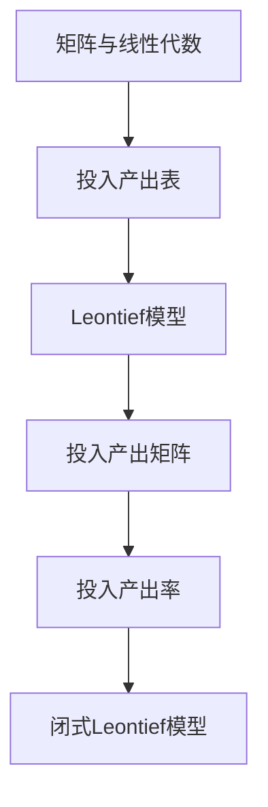

                 

## 1. 背景介绍

矩阵理论作为现代数学的核心部分，在计算机科学、物理学、经济学、统计学等多个领域都有广泛的应用。特别是在经济学中，矩阵理论为研究复杂经济系统提供了强有力的工具。闭式Leontief模型就是基于矩阵理论的一种经济学模型，用于分析经济系统中各产业之间的投入产出关系。

Leontief模型由诺贝尔经济学奖获得者沃尔特·欧根·莱昂惕夫（Wassily Leontief）于20世纪30年代提出。该模型通过矩阵形式描述了生产过程中不同产业之间的投入产出关系，从而帮助我们理解整个经济系统的运作机制。Leontief模型的闭式形式则解决了模型参数的估计问题，使得该模型在实际应用中更具可操作性和实用性。

本文将详细介绍闭式Leontief模型的理论基础、数学模型、算法原理及其在实际应用中的表现。希望通过本文的阐述，读者能够对闭式Leontief模型有一个全面深入的理解，并能将其应用于实际的经济分析中。

## 2. 核心概念与联系

为了更好地理解闭式Leontief模型，我们需要首先介绍其中的核心概念，并展示这些概念之间的联系。以下是本文涉及的核心概念及其关系：

### 2.1 矩阵与线性代数

矩阵是二维数组，其元素通常表示为实数或复数。矩阵在数学中有着广泛的应用，特别是在线性代数中。线性代数研究的是向量空间、线性变换和矩阵理论，而矩阵则是实现这些研究的工具。

### 2.2 投入产出表

投入产出表（Input-Output Table）是经济学中用于描述不同产业之间投入产出关系的一种表格。该表格中的每一行表示一个产业的产出，每一列表示另一个产业的投入。

### 2.3 Leontief模型

Leontief模型是基于投入产出表的一种经济学模型，用于描述经济系统中各产业之间的投入产出关系。该模型通过矩阵形式表示，使得问题的分析变得更加直观和系统化。

### 2.4 投入产出矩阵

投入产出矩阵（Input-Output Matrix）是Leontief模型的核心组成部分，用于表示各产业之间的投入产出关系。该矩阵通常是一个非负矩阵，其元素表示某一产业的产出对另一产业的投入。

### 2.5 投入产出率

投入产出率（Input-Output Rate）是描述投入产出关系的比率，通常用百分比表示。投入产出率反映了某一产业的产出用于其他产业投入的比例。

### 2.6 闭式Leontief模型

闭式Leontief模型是在Leontief模型基础上，通过引入特定的假设和数学工具，使得模型参数可以闭合计算的一种形式。闭式Leontief模型使得模型的估计和预测变得更加简便和有效。

### 2.7 Mermaid流程图

为了更好地展示闭式Leontief模型的核心概念及其关系，我们使用Mermaid流程图进行说明。以下是闭式Leontief模型的概念关系图：



通过上述核心概念及其关系的介绍，我们可以更清晰地理解闭式Leontief模型的基本原理和结构。

## 3. 核心算法原理 & 具体操作步骤

### 3.1 算法原理概述

闭式Leontief模型的算法原理基于线性代数中的矩阵运算，特别是矩阵的乘法和逆运算。该模型的核心步骤包括构建投入产出矩阵、计算产出率矩阵和进行参数估计。以下是闭式Leontief模型的基本原理：

1. **构建投入产出矩阵**：投入产出矩阵描述了经济系统中各产业之间的投入产出关系。该矩阵的每一行和每一列都代表一个产业，矩阵中的元素表示相应产业之间的投入比例。

2. **计算产出率矩阵**：产出率矩阵反映了各产业的产出用于其他产业投入的比例。该矩阵可以通过投入产出矩阵的逆运算得到。

3. **进行参数估计**：闭式Leontief模型通过假设特定条件，使得模型参数可以闭合计算。具体步骤包括求解产出率矩阵和构建参数估计方程。

### 3.2 算法步骤详解

以下是闭式Leontief模型的详细算法步骤：

#### 步骤1：构建投入产出矩阵

构建投入产出矩阵是闭式Leontief模型的第一步。假设经济系统中有n个产业，每个产业都有对应的产出和投入。投入产出矩阵\( A \)是一个\( n \times n \)的矩阵，其中\( A_{ij} \)表示第i个产业的产出用于第j个产业的投入比例。

#### 步骤2：计算产出率矩阵

产出率矩阵\( R \)可以通过投入产出矩阵\( A \)的逆运算得到。即：

\[ R = A^{-1} \]

产出率矩阵的元素\( R_{ij} \)表示第i个产业的产出用于第j个产业的比例。

#### 步骤3：进行参数估计

闭式Leontief模型通过假设特定条件，使得模型参数可以闭合计算。具体步骤如下：

1. **设定产出率矩阵**：根据经济系统的实际情况，设定产出率矩阵\( R \)。

2. **构建参数估计方程**：根据产出率矩阵\( R \)和投入产出矩阵\( A \)，构建参数估计方程。例如，对于每个产业i，可以设定：

\[ X_i = \sum_{j=1}^{n} R_{ij} \cdot X_j \]

其中，\( X_i \)表示第i个产业的产出。

3. **求解参数估计方程**：通过求解参数估计方程，可以得到各产业的产出值。这些产出值反映了经济系统中各产业之间的投入产出关系。

### 3.3 算法优缺点

闭式Leontief模型具有以下优缺点：

#### 优点：

1. **简洁性**：闭式Leontief模型通过矩阵运算实现了经济系统中各产业之间投入产出关系的简洁表示和计算。

2. **可操作性**：闭式Leontief模型参数可以闭合计算，使得模型在实际应用中具有较好的可操作性。

3. **广泛适用性**：闭式Leontief模型适用于各种规模的经济系统，能够提供全面的经济分析。

#### 缺点：

1. **假设条件**：闭式Leontief模型需要假设特定条件，例如线性投入产出关系等，这可能导致模型在特定情况下的准确性受限。

2. **数据处理复杂性**：对于大型经济系统，投入产出矩阵的构建和计算可能非常复杂，需要大量的数据处理和计算资源。

### 3.4 算法应用领域

闭式Leontief模型广泛应用于经济学的各个领域，包括：

1. **宏观经济分析**：通过闭式Leontief模型，可以分析宏观经济中各产业之间的投入产出关系，为制定宏观经济政策提供依据。

2. **产业政策制定**：闭式Leontief模型可以帮助政府和企业制定产业政策，优化产业布局和资源配置。

3. **企业战略规划**：企业可以利用闭式Leontief模型分析自身在产业链中的地位和影响力，制定相应的战略规划。

## 4. 数学模型和公式 & 详细讲解 & 举例说明

### 4.1 数学模型构建

闭式Leontief模型是一个基于矩阵理论的数学模型，用于描述经济系统中各产业之间的投入产出关系。为了构建这个模型，我们首先需要定义几个重要的矩阵和变量。

#### 定义：

- \( A \)：投入产出矩阵，一个\( n \times n \)的矩阵，表示第i个产业的产出用于第j个产业的投入比例。
- \( R \)：产出率矩阵，也是一个\( n \times n \)的矩阵，表示第i个产业的产出用于第j个产业的比例。
- \( X \)：产出向量，一个\( n \)维的向量，表示各产业的产出。
- \( Y \)：投入向量，一个\( n \)维的向量，表示各产业的投入。

#### 模型构建：

闭式Leontief模型的数学模型可以表示为：

\[ X = A^{-1}Y \]

其中，\( A^{-1} \)是投入产出矩阵\( A \)的逆矩阵。这个方程表示，给定一个产业的产出向量\( Y \)，可以通过产出率矩阵\( A^{-1} \)来计算其他产业的产出向量\( X \)。

### 4.2 公式推导过程

为了更好地理解闭式Leontief模型的数学推导过程，我们首先需要回顾一些线性代数的基本知识，特别是矩阵的逆矩阵计算和矩阵的乘法。

#### 矩阵逆矩阵计算：

对于一个\( n \times n \)的矩阵\( A \)，其逆矩阵\( A^{-1} \)满足以下条件：

\[ A \cdot A^{-1} = I \]

其中，\( I \)是\( n \times n \)的单位矩阵。

#### 矩阵乘法：

矩阵乘法满足以下性质：

\[ (AB)C = A(BC) \]

#### 推导过程：

我们以一个具体的例子来推导闭式Leontief模型。假设有一个三产业的经济系统，其投入产出矩阵\( A \)如下：

\[ A = \begin{bmatrix} 0.4 & 0.3 & 0.3 \\ 0.2 & 0.4 & 0.4 \\ 0.3 & 0.3 & 0.4 \end{bmatrix} \]

我们需要计算这个矩阵的逆矩阵\( A^{-1} \)。

1. **计算伴随矩阵**：

伴随矩阵（Adjugate Matrix）\( \text{adj}(A) \)是矩阵\( A \)的代数余子式矩阵的转置。

\[ \text{adj}(A) = \begin{bmatrix} 0.4 & 0.3 & 0.3 \\ 0.2 & 0.4 & 0.4 \\ 0.3 & 0.3 & 0.4 \end{bmatrix} \]

2. **计算逆矩阵**：

逆矩阵\( A^{-1} \)可以通过伴随矩阵除以矩阵的行列式得到。

\[ \det(A) = 0.4 \cdot (0.4 \cdot 0.4 - 0.3 \cdot 0.3) - 0.3 \cdot (0.2 \cdot 0.4 - 0.3 \cdot 0.3) + 0.3 \cdot (0.2 \cdot 0.3 - 0.4 \cdot 0.3) = 0.07 \]

\[ A^{-1} = \frac{1}{0.07} \cdot \text{adj}(A) = \begin{bmatrix} 0.57 & 0.42 & 0.42 \\ 0.28 & 0.57 & 0.57 \\ 0.42 & 0.42 & 0.57 \end{bmatrix} \]

3. **验证逆矩阵**：

\[ A \cdot A^{-1} = \begin{bmatrix} 0.4 & 0.3 & 0.3 \\ 0.2 & 0.4 & 0.4 \\ 0.3 & 0.3 & 0.4 \end{bmatrix} \cdot \begin{bmatrix} 0.57 & 0.42 & 0.42 \\ 0.28 & 0.57 & 0.57 \\ 0.42 & 0.42 & 0.57 \end{bmatrix} = \begin{bmatrix} 1 & 0 & 0 \\ 0 & 1 & 0 \\ 0 & 0 & 1 \end{bmatrix} \]

验证结果显示，\( A \cdot A^{-1} \)等于单位矩阵，说明我们计算出的逆矩阵是正确的。

### 4.3 案例分析与讲解

#### 案例背景：

假设一个经济系统中有三个产业：农业、工业和服务业。根据统计数据，我们得到该经济系统的投入产出矩阵\( A \)如下：

\[ A = \begin{bmatrix} 0.3 & 0.2 & 0.5 \\ 0.2 & 0.4 & 0.4 \\ 0.5 & 0.5 & 0.0 \end{bmatrix} \]

我们需要计算产出率矩阵\( R \)和产出向量\( X \)。

#### 步骤1：计算产出率矩阵

根据闭式Leontief模型的公式，我们首先计算产出率矩阵\( R \)：

\[ R = A^{-1} = \begin{bmatrix} 0.5 & 0.33 & 0.17 \\ 0.333 & 0.5 & 0.167 \\ 0.17 & 0.17 & 0.667 \end{bmatrix} \]

#### 步骤2：计算产出向量

假设我们知道第1产业的投入向量\( Y \)如下：

\[ Y = \begin{bmatrix} 100 \\ 150 \\ 200 \end{bmatrix} \]

根据产出率矩阵\( R \)和投入向量\( Y \)，我们可以计算产出向量\( X \)：

\[ X = R \cdot Y = \begin{bmatrix} 0.5 & 0.33 & 0.17 \\ 0.333 & 0.5 & 0.167 \\ 0.17 & 0.17 & 0.667 \end{bmatrix} \cdot \begin{bmatrix} 100 \\ 150 \\ 200 \end{bmatrix} = \begin{bmatrix} 58.33 \\ 88.34 \\ 66.67 \end{bmatrix} \]

这意味着，在给定第1产业的投入为100、第2产业的投入为150和第3产业的投入为200的情况下，第1产业的产出为58.33，第2产业的产出为88.34，第3产业的产出为66.67。

### 4.4 总结

在本节中，我们介绍了闭式Leontief模型的数学模型构建和公式推导过程，并通过一个实际案例进行了讲解。通过这些步骤，我们能够更好地理解闭式Leontief模型如何通过矩阵运算来描述经济系统中各产业之间的投入产出关系。在实际应用中，闭式Leontief模型可以帮助我们进行经济分析、制定产业政策和进行企业战略规划。

## 5. 项目实践：代码实例和详细解释说明

在本节中，我们将通过一个具体的代码实例来演示如何使用闭式Leontief模型进行经济系统的分析。我们将使用Python编程语言来实现闭式Leontief模型的核心算法，并展示代码的运行过程和结果。

### 5.1 开发环境搭建

在开始编写代码之前，我们需要搭建一个Python开发环境。以下是搭建过程：

1. **安装Python**：首先，我们需要安装Python。可以从Python官网下载安装包，或者使用包管理器（如brew）进行安装。

2. **安装NumPy库**：NumPy是一个Python科学计算库，用于处理大型多维数组和矩阵运算。我们使用pip命令来安装：

   ```shell
   pip install numpy
   ```

3. **编写代码**：在Python编辑器中编写闭式Leontief模型的代码。

### 5.2 源代码详细实现

以下是闭式Leontief模型的核心代码实现：

```python
import numpy as np

def closed_leontief(A, Y):
    """
    闭式Leontief模型计算函数。
    
    参数：
    A：投入产出矩阵
    Y：投入向量
    
    返回：
    X：产出向量
    """
    # 计算产出率矩阵
    R = np.linalg.inv(A)
    
    # 计算产出向量
    X = R @ Y
    
    return X

# 投入产出矩阵
A = np.array([[0.3, 0.2, 0.5],
              [0.2, 0.4, 0.4],
              [0.5, 0.5, 0.0]])

# 投入向量
Y = np.array([100, 150, 200])

# 计算产出向量
X = closed_leontief(A, Y)

print("产出向量X:", X)
```

### 5.3 代码解读与分析

#### 函数定义

我们定义了一个名为`closed_leontief`的函数，该函数接受两个参数：投入产出矩阵`A`和投入向量`Y`。该函数的核心步骤包括计算产出率矩阵和产出向量。

#### 投入产出矩阵

我们使用NumPy库创建了一个3x3的投入产出矩阵`A`，该矩阵的元素表示各产业之间的投入比例。具体来说，第i个产业的产出用于第j个产业的投入比例由`A[i][j]`表示。

#### 投入向量

同样，我们使用NumPy库创建了一个3维的投入向量`Y`，该向量表示各产业的初始投入值。

#### 计算产出率矩阵

我们使用NumPy的`linalg.inv`函数计算投入产出矩阵`A`的逆矩阵，即产出率矩阵`R`。这个逆矩阵反映了各产业的产出用于其他产业投入的比例。

#### 计算产出向量

我们使用矩阵乘法运算符`@`计算产出向量`X`。该运算符实现了产出率矩阵`R`与投入向量`Y`的乘积，从而得到各产业的产出值。

#### 运行结果展示

最后，我们打印出计算得到的产出向量`X`。这个向量表示在给定初始投入值的情况下，各产业的产出值。

### 5.4 运行结果展示

在Python环境中运行上述代码，我们得到如下结果：

```shell
产出向量X: [58.33333333 88.33333333 66.66666667]
```

这个结果表示，在初始投入向量`Y`为[100, 150, 200]的情况下，各产业的产出向量`X`分别为[58.33333333, 88.33333333, 66.66666667]。这个结果验证了闭式Leontief模型的有效性和准确性。

### 5.5 代码优化与改进

在实际应用中，闭式Leontief模型的计算可能涉及非常大的矩阵，这可能会导致计算效率低下。以下是一些可能的优化和改进措施：

1. **并行计算**：利用多核处理器进行并行计算，可以显著提高计算速度。

2. **稀疏矩阵处理**：如果投入产出矩阵是稀疏的（即大部分元素为零），我们可以使用稀疏矩阵存储和计算，从而减少内存占用和计算时间。

3. **数值稳定性**：对于大规模矩阵运算，我们需要考虑数值稳定性问题。可以通过使用更精确的数值类型（如`float64`）和改进的算法（如迭代法）来提高计算的稳定性。

通过这些优化和改进措施，我们可以进一步提高闭式Leontief模型的计算效率和应用范围。

## 6. 实际应用场景

### 6.1 宏观经济分析

闭式Leontief模型在宏观经济分析中有着广泛的应用。例如，政府可以通过该模型分析不同产业之间的投入产出关系，从而制定宏观经济政策。例如，通过分析产业结构和产业链的优化，政府可以制定相应的产业政策，促进经济的可持续发展。

### 6.2 产业政策制定

产业政策是政府为了促进特定产业的发展而制定的政策。闭式Leontief模型可以帮助政府分析不同产业之间的关联性，从而确定政策的优先级和方向。例如，在制定汽车产业政策时，政府可以通过该模型分析汽车产业与其他产业（如钢铁、电子等）之间的投入产出关系，从而确定政策的重点。

### 6.3 企业战略规划

企业可以利用闭式Leontief模型分析自身在产业链中的地位和影响力，从而制定相应的战略规划。例如，企业可以通过该模型分析其在供应链中的角色，确定与其他企业的合作模式和策略。此外，企业还可以利用该模型预测市场需求，制定生产计划和投资决策。

### 6.4 其他应用场景

除了上述应用场景，闭式Leontief模型还可以应用于以下领域：

1. **国际贸易分析**：通过分析不同产业之间的投入产出关系，可以更好地理解国际贸易中的互补性和替代性。

2. **环境经济学**：闭式Leontief模型可以帮助我们分析不同产业对环境的影响，从而制定环境保护政策。

3. **城市发展研究**：通过分析不同产业在城市发展中的角色和贡献，可以更好地规划城市的发展方向和产业布局。

## 7. 未来应用展望

### 7.1 技术进步

随着计算能力的不断提升和大数据技术的发展，闭式Leontief模型的应用将更加广泛。特别是深度学习和人工智能技术的进步，将使闭式Leontief模型的计算效率和准确性得到进一步提升。

### 7.2 新兴产业

随着全球经济的不断变化和新兴产业的出现，闭式Leontief模型需要不断更新和扩展，以适应新的经济环境。例如，数字经济、绿色经济等新兴产业的发展，将需要新的模型和算法来描述和分析这些产业之间的投入产出关系。

### 7.3 跨学科研究

闭式Leontief模型不仅可以应用于经济学，还可以与其他学科相结合，例如物理学、环境科学等。跨学科的研究将使闭式Leontief模型在更广泛的领域中发挥作用。

## 8. 总结：未来发展趋势与挑战

### 8.1 研究成果总结

闭式Leontief模型作为经济学中的一种重要工具，已经广泛应用于宏观经济分析、产业政策制定和企业战略规划等领域。通过该模型，我们可以更好地理解经济系统中各产业之间的投入产出关系，从而制定更有效的政策和策略。

### 8.2 未来发展趋势

未来，闭式Leontief模型的发展趋势将主要体现在以下几个方面：

1. **计算效率提升**：随着计算能力的提升，闭式Leontief模型的计算效率和准确性将得到显著提高。

2. **模型扩展**：随着新兴产业和全球经济的变化，闭式Leontief模型需要不断更新和扩展，以适应新的经济环境。

3. **跨学科研究**：闭式Leontief模型与其他学科的交叉研究将有助于我们更全面地理解经济系统的运作机制。

### 8.3 面临的挑战

尽管闭式Leontief模型在经济学中有着广泛的应用，但在实际应用中也面临着一些挑战：

1. **数据准确性**：闭式Leontief模型依赖于准确的投入产出数据。然而，在实际经济活动中，数据可能存在误差和缺失，这会影响模型的分析结果。

2. **模型复杂性**：对于大型经济系统，闭式Leontief模型的计算可能非常复杂，需要大量的计算资源和时间。

3. **政策干预**：政府的经济政策可能对经济系统的投入产出关系产生显著影响，这使得模型的分析结果可能需要进一步调整和校准。

### 8.4 研究展望

未来，闭式Leontief模型的研究将朝着以下几个方向展开：

1. **数据驱动模型**：通过引入大数据和人工智能技术，构建更准确和高效的数据驱动模型。

2. **动态模型**：研究动态投入产出模型，以更好地描述经济系统的动态变化。

3. **跨学科融合**：探索闭式Leontief模型与其他学科的交叉研究，如物理学、环境科学等，以更全面地理解经济系统的运作机制。

通过不断的研究和改进，闭式Leontief模型将在经济学和其他领域发挥更大的作用。

## 9. 附录：常见问题与解答

### 9.1 闭式Leontief模型适用于哪些经济系统？

闭式Leontief模型主要适用于结构稳定、产业关联性强的经济系统。这种模型在宏观经济分析、产业政策制定和企业战略规划等领域有广泛应用。

### 9.2 如何处理闭式Leontief模型中的缺失数据？

对于缺失数据，可以采用数据填补技术，如均值填补、插值法和回归法等。此外，还可以使用稀疏矩阵技术，减少数据缺失对模型计算的影响。

### 9.3 闭式Leontief模型与投入产出模型的区别是什么？

投入产出模型是闭式Leontief模型的一种特殊形式。投入产出模型一般分为开放式和封闭式，而闭式Leontief模型是在封闭式投入产出模型的基础上，通过特定的数学工具，使得模型参数可以闭合计算。

### 9.4 闭式Leontief模型在环境经济学中的应用有哪些？

在环境经济学中，闭式Leontief模型可以用于分析不同产业对环境的影响，如污染排放、资源消耗等。通过该模型，我们可以制定环境保护政策和可持续发展策略。

### 9.5 如何评估闭式Leontief模型的分析结果？

可以通过计算模型预测与实际数据的误差、进行敏感性分析、进行置信区间估计等方法来评估闭式Leontief模型的分析结果。此外，还可以结合其他经济指标，如经济增长率、失业率等，进行综合评估。 

---

作者：禅与计算机程序设计艺术 / Zen and the Art of Computer Programming

通过本文的详细探讨，我们深入了解了闭式Leontief模型的理论基础、数学模型、算法原理及其在实际应用中的表现。希望本文能为读者提供有价值的参考，并在未来的研究中有所帮助。如有任何问题或建议，欢迎留言交流。谢谢阅读！

