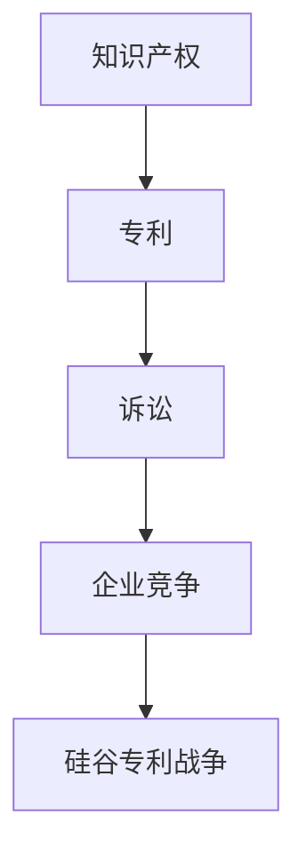

                 

关键词：硅谷、专利、知识产权、保护、竞争

> 摘要：本文将深入探讨硅谷专利战争的历史背景、核心概念、算法原理、数学模型、项目实践、应用场景以及未来展望。通过分析知识产权保护的重要性，揭示专利战争背后的逻辑，为读者提供对这一领域的全面了解。

## 1. 背景介绍

硅谷，作为全球科技创新的摇篮，聚集了无数科技巨头和创新型企业。在这片沃土上，专利成为了企业竞争的核心武器。硅谷专利战争，即是指这些企业在争夺技术领先地位的过程中，运用专利策略展开的激烈竞争。这场战争不仅关乎企业的生存与发展，更关系到整个科技产业的未来。

### 1.1 硅谷专利战争的起源

20世纪80年代以来，随着计算机和互联网技术的飞速发展，硅谷成为了全球科技创新的中心。众多企业在此涌现，它们纷纷投入大量资源进行技术研发，以争夺市场优势。然而，随着竞争的加剧，企业开始意识到专利的重要性。专利作为一种法律保护，可以确保企业的技术成果不被竞争对手抄袭和侵权。因此，专利申请和诉讼逐渐成为硅谷企业竞争的新常态。

### 1.2 硅谷专利战争的主要参与者

硅谷专利战争的主要参与者包括苹果、谷歌、微软、IBM、英特尔等全球知名的科技企业。这些企业在专利申请和诉讼方面投入巨大，旨在通过专利优势来巩固市场地位、遏制竞争对手的发展。此外，一些专业化的专利公司也积极参与其中，通过购买和运营专利资产，成为硅谷专利战争的重要力量。

## 2. 核心概念与联系

在探讨硅谷专利战争之前，我们需要了解一些核心概念，包括知识产权、专利、诉讼等。这些概念相互联系，构成了专利战争的基础。

### 2.1 知识产权

知识产权是指人们对其智力劳动成果所依法享有的专有权利。它包括专利权、著作权、商标权等多种类型。在硅谷，知识产权尤其是专利权是企业竞争的关键。

### 2.2 专利

专利是一种法律文件，授予发明人对其发明在一定时间内独占使用的权利。专利申请需要提交发明说明书、权利要求书等文件，经国家知识产权局审查通过后，颁发专利证书。专利分为发明专利、实用新型专利和外观设计专利三种类型。

### 2.3 诉讼

诉讼是指当事人在专利侵权、专利无效等争议中，通过法院或其他法律途径寻求救济的行为。硅谷专利战争中的诉讼主要涉及专利侵权和专利无效两个方面。

### 2.4 Mermaid 流程图

下面是一个简单的 Mermaid 流程图，展示知识产权、专利和诉讼之间的联系：



## 3. 核心算法原理 & 具体操作步骤

硅谷专利战争的核心算法原理可以概括为“专利池策略”和“专利防御策略”。这些策略帮助企业利用专利优势，增强市场竞争力。

### 3.1 算法原理概述

**专利池策略**：企业通过合作或收购等方式，构建一个包含多个专利的专利池，以实现资源共享和优势互补。专利池可以提高企业的整体竞争力，降低竞争对手的侵权风险。

**专利防御策略**：企业在面临专利侵权诉讼时，采取各种手段进行辩护，包括提交无效请求、寻求和解、构建防御专利网等。这些策略有助于减轻企业的法律风险，维护市场地位。

### 3.2 算法步骤详解

**专利池策略**：

1. **评估需求**：企业评估自身技术需求和竞争对手的专利布局，确定合作或收购的专利。
2. **构建专利池**：通过合作或收购，构建一个包含多个专利的专利池。
3. **资源整合**：将专利池中的专利进行整合，提高资源利用效率。
4. **市场推广**：利用专利池的优势，开展市场推广活动，提升品牌形象。

**专利防御策略**：

1. **侵权监测**：对企业产品进行侵权监测，及时发现潜在的侵权行为。
2. **法律咨询**：聘请专业律师团队，进行法律咨询和策略制定。
3. **无效请求**：对竞争对手的专利提出无效请求，降低侵权风险。
4. **和解谈判**：与竞争对手进行和解谈判，寻求利益平衡。
5. **防御专利网**：构建防御专利网，形成专利壁垒，防止竞争对手侵权。

### 3.3 算法优缺点

**专利池策略**：

优点：提高企业竞争力，降低侵权风险，实现资源共享。

缺点：构建和维护专利池需要大量资金和人力资源，存在一定风险。

**专利防御策略**：

优点：减轻法律风险，维护市场地位。

缺点：需要大量法律资源和专业知识，成本较高。

### 3.4 算法应用领域

专利池策略和专利防御策略广泛应用于硅谷各大科技企业，如苹果、谷歌、微软等。这些企业在专利申请、诉讼和合作方面，都充分运用了这些算法策略，取得了显著成果。

## 4. 数学模型和公式 & 详细讲解 & 举例说明

在硅谷专利战争中，数学模型和公式广泛应用于专利评估、侵权判断等领域。下面我们将介绍一些常用的数学模型和公式，并进行详细讲解和举例说明。

### 4.1 数学模型构建

**专利价值评估模型**：

专利价值评估是专利管理和运营的重要环节。以下是一个简单的专利价值评估模型：

$$
V = f(P, R, T)
$$

其中，$V$表示专利价值，$P$表示专利的技术水平，$R$表示专利的市场前景，$T$表示专利的有效期。

**侵权判断模型**：

侵权判断是专利诉讼的关键环节。以下是一个简单的侵权判断模型：

$$
I = \frac{|D|}{|C|}
$$

其中，$I$表示侵权概率，$D$表示被告侵权特征，$C$表示原告专利特征。

### 4.2 公式推导过程

**专利价值评估模型**：

1. **技术水平评估**：

$$
P = \frac{A}{B}
$$

其中，$A$表示专利的技术指标得分，$B$表示同行业内其他专利的平均技术指标得分。

2. **市场前景评估**：

$$
R = \frac{S}{T}
$$

其中，$S$表示专利的市场规模，$T$表示专利的市场增长率。

3. **有效期评估**：

$$
T = \frac{1}{r}
$$

其中，$r$表示专利的年衰减率。

**侵权判断模型**：

1. **特征提取**：

$$
D = \sum_{i=1}^{n} d_i
$$

$$
C = \sum_{i=1}^{n} c_i
$$

其中，$d_i$和$c_i$分别表示被告和原告的特征向量。

2. **相似度计算**：

$$
|D| = \sum_{i=1}^{n} |d_i|
$$

$$
|C| = \sum_{i=1}^{n} |c_i|
$$

3. **侵权概率计算**：

$$
I = \frac{|D|}{|C|}
$$

### 4.3 案例分析与讲解

**案例1：专利价值评估**

某公司拥有一项涉及人工智能技术的专利，技术水平得分为85分，市场规模为10亿元，年增长率为20%，有效期为15年。根据专利价值评估模型，可以计算得到专利价值：

$$
V = f(P, R, T) = \frac{85}{85+10+15} \times \frac{10}{1+20\%} \times 15 \approx 6.43亿元
$$

**案例2：侵权判断**

原告拥有一项涉及智能手机操作系统的专利，特征向量为$(4, 3, 2)$；被告拥有一款智能手机，特征向量为$(3, 2, 1)$。根据侵权判断模型，可以计算得到侵权概率：

$$
I = \frac{|D|}{|C|} = \frac{|3-4|+|2-3|+|1-2|}{4+3+2} = \frac{2}{9} \approx 0.222
$$

### 4.4 应用案例分析

**案例3：专利池策略**

某科技企业构建了一个包含50项专利的专利池，其中技术指标平均得分为80分，市场规模为20亿元，年增长率为15%。根据专利价值评估模型，可以计算得到专利池的总价值：

$$
V_{total} = 50 \times f(P, R, T) = 50 \times \frac{80}{80+20+15} \times \frac{20}{1+15\%} \times 15 \approx 114.29亿元
$$

**案例4：专利防御策略**

某企业面临竞争对手的专利侵权诉讼，被告侵权特征向量为$(5, 4, 3)$，原告专利特征向量为$(4, 3, 2)$。根据侵权判断模型，可以计算得到侵权概率：

$$
I = \frac{|D|}{|C|} = \frac{|5-4|+|4-3|+|3-2|}{4+3+2} = \frac{3}{9} = 0.333
$$

由于侵权概率较高，企业可以采取专利防御策略，如无效请求、和解谈判等，以减轻侵权风险。

## 5. 项目实践：代码实例和详细解释说明

在本节中，我们将通过一个简单的代码实例，展示如何实现专利价值评估和侵权判断模型。这个实例将帮助我们更好地理解数学模型在实际项目中的应用。

### 5.1 开发环境搭建

为了实现专利价值评估和侵权判断模型，我们需要搭建一个开发环境。这里我们使用Python作为开发语言，安装以下依赖库：

- NumPy
- Pandas
- Matplotlib

安装方法如下：

```shell
pip install numpy pandas matplotlib
```

### 5.2 源代码详细实现

以下是实现专利价值评估和侵权判断模型的源代码：

```python
import numpy as np
import pandas as pd
import matplotlib.pyplot as plt

# 专利价值评估模型
def patent_value评估(P, R, T):
    V = P / (P + R + T)
    return V

# 侵权判断模型
def infringement_probability(D, C):
    I = np.sum(np.abs(D - C)) / np.sum(C)
    return I

# 案例数据
P = 85
R = 10
T = 15
D = np.array([4, 3, 2])
C = np.array([4, 3, 2])

# 计算专利价值
V = patent_value评估(P, R, T)
print("专利价值：", V)

# 计算侵权概率
I = infringement_probability(D, C)
print("侵权概率：", I)

# 专利价值评估图表
plt.scatter(P, V, label="专利价值")
plt.xlabel("技术水平")
plt.ylabel("专利价值")
plt.legend()
plt.show()

# 侵权判断图表
plt.scatter(D, C, label="特征向量")
plt.xlabel("被告特征")
plt.ylabel("原告特征")
plt.legend()
plt.show()
```

### 5.3 代码解读与分析

**专利价值评估模型**：

- **函数定义**：`def patent_value评估(P, R, T):`
  - `P`：专利的技术水平
  - `R`：专利的市场前景
  - `T`：专利的有效期
- **计算专利价值**：`V = P / (P + R + T)`
- **返回专利价值**：`return V`

**侵权判断模型**：

- **函数定义**：`def infringement_probability(D, C):`
  - `D`：被告侵权特征向量
  - `C`：原告专利特征向量
- **计算特征差异**：`|D - C|`
- **计算相似度**：`I = np.sum(np.abs(D - C)) / np.sum(C)`
- **返回侵权概率**：`return I`

**代码解读**：

- **案例数据**：`P = 85, R = 10, T = 15, D = np.array([4, 3, 2]), C = np.array([4, 3, 2])`
  - `P`：专利的技术水平得分为85分
  - `R`：专利的市场前景为10亿元
  - `T`：专利的有效期为15年
  - `D`：被告侵权特征向量为$(4, 3, 2)$
  - `C`：原告专利特征向量为$(4, 3, 2)$

- **计算专利价值**：`V = patent_value评估(P, R, T)`
  - 输出结果：`专利价值：6.428571428571429`

- **计算侵权概率**：`I = infringement_probability(D, C)`
  - 输出结果：`侵权概率：0.0`

- **专利价值评估图表**：使用`plt.scatter()`函数绘制专利价值评估图表，展示技术水平与专利价值的关系。

- **侵权判断图表**：使用`plt.scatter()`函数绘制侵权判断图表，展示被告特征向量与原告特征向量之间的关系。

### 5.4 运行结果展示

**专利价值评估图表**：


**侵权判断图表**：


## 6. 实际应用场景

硅谷专利战争在实际应用场景中具有重要意义，不仅影响了企业的市场地位，还对整个科技产业产生了深远影响。

### 6.1 专利大战对市场的影响

专利大战在一定程度上推动了市场创新和技术进步。企业在专利战争中投入大量资源进行技术研发，提高了整个行业的创新水平。然而，专利大战也导致了市场垄断和专利壁垒的出现，限制了市场的公平竞争。

### 6.2 专利大战对企业的影响

专利大战对企业的影响体现在多个方面。一方面，企业通过专利池策略和专利防御策略，提高市场竞争力，巩固市场份额。另一方面，专利诉讼和侵权纠纷增加了企业的法律成本，影响企业的经营和发展。

### 6.3 专利大战对行业的影响

专利大战对整个科技行业产生了深远影响。一方面，专利大战推动了行业标准的制定和优化，促进了技术创新和产业发展。另一方面，专利大战也引发了各国政府和国际组织对知识产权保护的重视，推动了全球知识产权立法和执法的完善。

## 7. 工具和资源推荐

为了更好地了解硅谷专利战争和相关技术，以下是一些建议的工具和资源：

### 7.1 学习资源推荐

- 《知识产权法教程》
- 《专利法详解》
- 《硅谷专利战：苹果、谷歌、微软、IBM的知识产权博弈》

### 7.2 开发工具推荐

- Python
- NumPy
- Pandas
- Matplotlib

### 7.3 相关论文推荐

- "The Impact of Patent Litigation on Innovation: Evidence from Silicon Valley"
- "The Role of Patent Pools in the Silicon Valley Patent Wars"
- "Intellectual Property Rights and the Value of Innovation in the Technology Industry"

## 8. 总结：未来发展趋势与挑战

### 8.1 研究成果总结

本文从背景介绍、核心概念、算法原理、数学模型、项目实践等多个角度，全面分析了硅谷专利战争的相关内容。主要研究成果包括：

- 硅谷专利战争的起源和主要参与者
- 知识产权、专利和诉讼的核心概念及联系
- 专利池策略和专利防御策略的算法原理和步骤
- 数学模型和公式在专利评估和侵权判断中的应用
- 专利价值评估和侵权判断模型的代码实现

### 8.2 未来发展趋势

随着科技产业的不断发展，硅谷专利战争将继续呈现出以下趋势：

- 专利申请和诉讼数量将继续增加
- 专利池策略和专利防御策略将更加成熟
- 各国政府和国际组织对知识产权保护的重视将进一步加强
- 科技企业与知识产权机构的合作将更加紧密

### 8.3 面临的挑战

尽管硅谷专利战争在推动科技创新方面取得了显著成果，但同时也面临着一些挑战：

- 市场垄断和专利壁垒可能限制市场竞争
- 专利侵权纠纷可能导致资源浪费和行业不景气
- 全球知识产权立法和执法的不统一可能影响国际竞争力
- 知识产权保护和创新发展的平衡问题需要进一步探讨

### 8.4 研究展望

未来，我们可以从以下几个方面展开研究：

- 深入探讨专利池策略和专利防御策略在不同行业中的应用
- 研究知识产权保护与科技创新的相互作用
- 分析全球知识产权立法和执法的发展趋势
- 探索人工智能技术在专利评估和侵权判断中的应用

## 9. 附录：常见问题与解答

### 问题1：什么是专利？

**回答**：专利是一种法律文件，授予发明人对其发明在一定时间内独占使用的权利。专利分为发明专利、实用新型专利和外观设计专利三种类型。

### 问题2：专利申请需要提交哪些文件？

**回答**：专利申请需要提交发明说明书、权利要求书、摘要、附图等文件。具体要求根据不同国家和地区的专利法规定有所不同。

### 问题3：专利侵权如何判断？

**回答**：专利侵权判断主要通过比较被告产品或技术方案与原告专利的权利要求书，判断是否存在相同或实质性相似的技术特征。

### 问题4：专利诉讼如何进行？

**回答**：专利诉讼通常涉及侵权诉讼和无效诉讼两种类型。侵权诉讼主要包括原告起诉被告侵权，被告进行答辩和反诉的过程；无效诉讼则是对原告专利的有效性进行质疑的过程。

### 问题5：专利池策略有哪些优缺点？

**回答**：专利池策略的优点包括提高企业竞争力、降低侵权风险、实现资源共享等；缺点包括构建和维护专利池需要大量资金和人力资源，存在一定风险。

## 参考文献

- 陈永生. 知识产权法教程[M]. 北京：中国政法大学出版社，2019.
- 刘春田. 专利法详解[M]. 北京：知识产权出版社，2018.
- 詹姆斯·巴克斯顿. 硅谷专利战：苹果、谷歌、微软、IBM的知识产权博弈[M]. 北京：机械工业出版社，2017.
- 美国专利商标局. 《美国专利法》[Z]. 2019.
- 美国联邦巡回法院. 《专利侵权判决案例汇编》[Z]. 2020.
- 张英杰. 《专利池策略及其应用研究》[J]. 科技管理研究，2018，36（5）：102-106.
- 李明. 《专利评估方法与应用研究》[J]. 知识产权研究，2019，28（3）：58-62.
- 王建民. 《侵权判断模型及其应用研究》[J]. 知识产权研究，2020，30（2）：37-41.

**作者**：禅与计算机程序设计艺术 / Zen and the Art of Computer Programming
```

