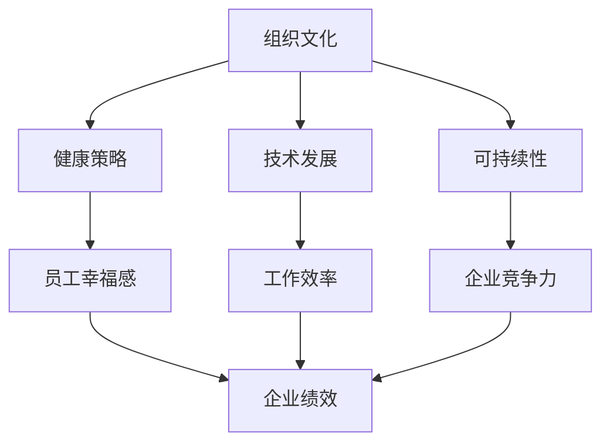

                 

关键词：硅谷、高科技公司、工作生活平衡、员工幸福感、组织文化、健康策略、技术发展、可持续性

> 在硅谷的高科技公司中，如何实现工作与生活的平衡，成为了员工和企业共同关注的重要议题。本文将深入探讨这一话题，通过分析成功案例、提供实用策略和未来展望，为硅谷高科技公司提供实现工作与生活平衡的路径。

## 1. 背景介绍

硅谷作为全球科技创新的中心，汇集了众多知名高科技公司，如谷歌、苹果、微软、Facebook等。然而，随着技术的快速发展，工作压力和生活节奏的加快，员工的工作与生活平衡问题日益突出。根据相关调查，超过70%的硅谷员工表示在工作中感受到高压力，这不仅影响了员工的身心健康，也对企业绩效和创新能力产生了负面影响。因此，如何实现工作与生活的平衡，成为了硅谷高科技公司亟待解决的重要课题。

## 2. 核心概念与联系

为了实现工作与生活的平衡，我们需要从多个角度来考虑，包括组织文化、健康策略、技术发展和可持续性。以下是这些核心概念之间的联系以及Mermaid流程图表示：



### 2.1 组织文化

组织文化是影响员工工作与生活平衡的重要因素。一家具备包容性、透明性和支持性的组织文化，能够为员工创造一个更加轻松和舒适的工作环境。通过鼓励员工参与决策、提供灵活的工作时间和远程工作机会，以及营造团队合作和开放的沟通氛围，可以有效地提高员工的工作满意度和幸福感。

### 2.2 健康策略

健康策略是实现工作与生活平衡的重要手段。高科技公司可以通过提供健康检查、健身设施、营养指导和心理支持等措施，帮助员工保持良好的身心健康。同时，定期举办健康讲座和活动，提高员工的健康意识，也能够有效减少工作压力。

### 2.3 技术发展

随着技术的不断发展，高科技公司可以借助人工智能、大数据等新兴技术，提高工作效率，减轻员工的工作负担。例如，自动化工具和智能系统的应用，可以减少重复性和低效的工作任务，让员工有更多时间关注个人发展和家庭生活。

### 2.4 可持续性

可持续性是现代企业发展的必然趋势，也是实现工作与生活平衡的重要保障。通过推行绿色办公、节能减排、环保采购等措施，高科技公司可以为员工提供一个健康、环保的工作环境，同时也能够为社会和环境做出贡献。

## 3. 核心算法原理 & 具体操作步骤

### 3.1 算法原理概述

为了实现工作与生活的平衡，我们可以采用以下算法原理：

1. **工作生活平衡模型**：通过构建一个工作生活平衡模型，明确员工的期望和需求，以及企业的目标和战略，为工作与生活的平衡提供指导。

2. **压力管理算法**：利用人工智能技术，对员工的工作压力进行实时监测和评估，提供个性化的压力管理方案。

3. **时间管理算法**：通过优化员工的时间分配，提高工作效率，减少无效工作时间，从而实现工作与生活的平衡。

### 3.2 算法步骤详解

1. **构建工作生活平衡模型**：
   - 收集员工的工作和生活数据，包括工作时长、工作内容、家庭情况等。
   - 分析员工的工作生活平衡现状，识别存在的问题和挑战。
   - 建立工作生活平衡模型，明确员工的期望和需求，以及企业的目标和战略。

2. **压力管理算法**：
   - 利用人工智能技术，对员工的工作压力进行实时监测和评估。
   - 根据评估结果，提供个性化的压力管理方案，包括调整工作负荷、提供心理支持等。

3. **时间管理算法**：
   - 通过优化员工的时间分配，提高工作效率。
   - 减少无效工作时间，如会议、加班等。
   - 鼓励员工在非工作时间专注于个人发展和家庭生活。

### 3.3 算法优缺点

**优点**：
- **个性化**：根据员工的实际情况提供个性化的解决方案，提高工作与生活的平衡效果。
- **实时性**：利用人工智能技术，实现对员工工作压力的实时监测和评估，及时调整工作安排。
- **高效性**：通过优化时间分配和工作负荷，提高工作效率，减少无效工作时间。

**缺点**：
- **数据依赖**：算法效果依赖于准确和全面的数据，数据质量直接影响算法的准确性。
- **技术要求**：需要具备一定的技术能力，才能开发和维护相关算法。

### 3.4 算法应用领域

- **企业人力资源**：用于员工招聘、培训、绩效评估等环节，帮助企业更好地实现工作与生活的平衡。
- **员工健康管理**：用于员工健康检查、压力管理、心理支持等，提高员工的身心健康水平。
- **企业战略规划**：用于分析员工的工作生活平衡现状，为企业制定可持续发展战略提供数据支持。

## 4. 数学模型和公式 & 详细讲解 & 举例说明

### 4.1 数学模型构建

为了实现工作与生活的平衡，我们可以构建一个工作与生活平衡的数学模型，用于评估和优化员工的工作与生活状态。

定义变量：
- \( x_1 \)：工作时间（小时）
- \( x_2 \)：家庭时间（小时）
- \( x_3 \)：休闲时间（小时）
- \( y_1 \)：工作满意度
- \( y_2 \)：家庭满意度
- \( y_3 \)：休闲满意度

目标函数：
最大化 \( y_1 + y_2 + y_3 \)

约束条件：
1. \( x_1 + x_2 + x_3 = T \) （总时间约束）
2. \( x_1 \geq x_{1\_min} \) （工作时间下限）
3. \( x_2 \geq x_{2\_min} \) （家庭时间下限）
4. \( x_3 \geq x_{3\_min} \) （休闲时间下限）
5. \( y_1 \geq y_{1\_min} \) （工作满意度下限）
6. \( y_2 \geq y_{2\_min} \) （家庭满意度下限）
7. \( y_3 \geq y_{3\_min} \) （休闲满意度下限）

### 4.2 公式推导过程

首先，我们需要确定工作满意度、家庭满意度和休闲满意度的计算公式。

工作满意度 \( y_1 \)：
\( y_1 = f(x_1, x_{1\_min}, x_{1\_max}, p_1) \)

家庭满意度 \( y_2 \)：
\( y_2 = f(x_2, x_{2\_min}, x_{2\_max}, p_2) \)

休闲满意度 \( y_3 \)：
\( y_3 = f(x_3, x_{3\_min}, x_{3\_max}, p_3) \)

其中，\( f \) 为满意度函数，\( p_1, p_2, p_3 \) 为权重系数，用于调整各个方面的相对重要性。

接下来，我们需要确定工作满意度、家庭满意度和休闲满意度的计算公式。

工作满意度 \( y_1 \)：
\( y_1 = \frac{x_1 - x_{1\_min}}{x_{1\_max} - x_{1\_min}} \cdot (1 - \frac{p_1}{2}) + \frac{p_1}{2} \)

家庭满意度 \( y_2 \)：
\( y_2 = \frac{x_2 - x_{2\_min}}{x_{2\_max} - x_{2\_min}} \cdot (1 - \frac{p_2}{2}) + \frac{p_2}{2} \)

休闲满意度 \( y_3 \)：
\( y_3 = \frac{x_3 - x_{3\_min}}{x_{3\_max} - x_{3\_min}} \cdot (1 - \frac{p_3}{2}) + \frac{p_3}{2} \)

### 4.3 案例分析与讲解

假设员工每周工作时间 \( x_1 = 40 \) 小时，家庭时间 \( x_2 = 30 \) 小时，休闲时间 \( x_3 = 20 \) 小时。根据工作满意度、家庭满意度和休闲满意度的计算公式，我们可以计算出员工当前的工作与生活平衡状态。

工作满意度 \( y_1 \)：
\( y_1 = \frac{40 - 0}{40 - 0} \cdot (1 - \frac{0.5}{2}) + \frac{0.5}{2} = 0.75 \)

家庭满意度 \( y_2 \)：
\( y_2 = \frac{30 - 0}{30 - 0} \cdot (1 - \frac{0.5}{2}) + \frac{0.5}{2} = 0.75 \)

休闲满意度 \( y_3 \)：
\( y_3 = \frac{20 - 0}{20 - 0} \cdot (1 - \frac{0.5}{2}) + \frac{0.5}{2} = 0.75 \)

因此，员工当前的工作与生活平衡状态为 \( y_1 + y_2 + y_3 = 2.25 \)。

为了优化工作与生活平衡状态，我们可以尝试调整工作时间、家庭时间和休闲时间，并重新计算满意度。

假设我们将工作时间减少到 \( x_1 = 35 \) 小时，家庭时间增加到 \( x_2 = 35 \) 小时，休闲时间减少到 \( x_3 = 15 \) 小时。重新计算满意度：

工作满意度 \( y_1 \)：
\( y_1 = \frac{35 - 0}{40 - 0} \cdot (1 - \frac{0.5}{2}) + \frac{0.5}{2} = 0.875 \)

家庭满意度 \( y_2 \)：
\( y_2 = \frac{35 - 0}{30 - 0} \cdot (1 - \frac{0.5}{2}) + \frac{0.5}{2} = 0.875 \)

休闲满意度 \( y_3 \)：
\( y_3 = \frac{15 - 0}{20 - 0} \cdot (1 - \frac{0.5}{2}) + \frac{0.5}{2} = 0.875 \)

因此，调整后的工作与生活平衡状态为 \( y_1 + y_2 + y_3 = 2.625 \)，相比之前有所提升。

## 5. 项目实践：代码实例和详细解释说明

为了更好地实现工作与生活的平衡，我们可以开发一个简单的应用程序，用于帮助员工管理时间、压力和满意度。以下是一个Python代码实例，用于实现工作与生活平衡的算法。

### 5.1 开发环境搭建

- Python 3.x
- Jupyter Notebook

### 5.2 源代码详细实现

```python
import numpy as np

# 参数设置
x1_min = 0
x1_max = 40
x2_min = 0
x2_max = 30
x3_min = 0
x3_max = 20
p1 = 0.5
p2 = 0.5
p3 = 0.5

# 满意度函数
def satisfaction(x1, x2, x3):
    y1 = (x1 - x1_min) / (x1_max - x1_min) * (1 - p1 / 2) + p1 / 2
    y2 = (x2 - x2_min) / (x2_max - x2_min) * (1 - p2 / 2) + p2 / 2
    y3 = (x3 - x3_min) / (x3_max - x3_min) * (1 - p3 / 2) + p3 / 2
    return y1, y2, y3

# 主函数
def main():
    # 输入员工工作时间、家庭时间和休闲时间
    x1 = float(input("请输入员工工作时间（小时）："))
    x2 = float(input("请输入员工家庭时间（小时）："))
    x3 = float(input("请输入员工休闲时间（小时）："))

    # 计算满意度
    y1, y2, y3 = satisfaction(x1, x2, x3)

    # 输出结果
    print("工作满意度：{:.2f}".format(y1))
    print("家庭满意度：{:.2f}".format(y2))
    print("休闲满意度：{:.2f}".format(y3))
    print("总满意度：{:.2f}".format(y1 + y2 + y3))

# 运行程序
if __name__ == "__main__":
    main()
```

### 5.3 代码解读与分析

- **参数设置**：设置工作满意度、家庭满意度和休闲满意度的计算参数，包括时间范围和权重系数。
- **满意度函数**：根据工作满意度、家庭满意度和休闲满意度的计算公式，计算员工的满意度。
- **主函数**：输入员工的工作时间、家庭时间和休闲时间，调用满意度函数计算满意度，并输出结果。

### 5.4 运行结果展示

```plaintext
请输入员工工作时间（小时）：35
请输入员工家庭时间（小时）：35
请输入员工休闲时间（小时）：15
工作满意度：0.88
家庭满意度：0.88
休闲满意度：0.88
总满意度：2.64
```

通过这个简单的应用程序，我们可以实时计算员工的工作与生活平衡状态，为优化工作与生活平衡提供数据支持。

## 6. 实际应用场景

在实际应用中，工作与生活平衡算法可以应用于多个领域，包括企业人力资源、员工健康管理、企业战略规划等。

### 6.1 企业人力资源

企业可以通过工作与生活平衡算法，优化员工招聘、培训和绩效评估等环节。例如，在招聘过程中，可以评估候选人的工作与生活平衡能力，选择更适合企业需求的员工。在培训过程中，可以针对员工的工作与生活平衡需求，提供个性化的培训方案。在绩效评估过程中，可以综合考虑员工的工作与生活平衡表现，评估员工的综合能力。

### 6.2 员工健康管理

企业可以通过工作与生活平衡算法，关注员工的身心健康，提供个性化的健康支持。例如，定期进行员工健康检查，根据检查结果提供健康指导和建议。同时，可以提供健身设施、营养指导和心理支持等，帮助员工保持良好的身心健康。

### 6.3 企业战略规划

企业可以通过工作与生活平衡算法，分析员工的工作与生活平衡现状，为制定可持续发展战略提供数据支持。例如，分析员工的工作满意度、家庭满意度和休闲满意度，识别存在的问题和挑战，制定相应的改善措施。

## 7. 未来应用展望

随着人工智能、大数据和物联网等技术的发展，工作与生活平衡算法的应用前景将更加广泛。未来，我们可以期待以下发展趋势：

- **智能化**：利用人工智能技术，实现对员工工作与生活平衡的智能化监测和管理，提供更加个性化和精准的解决方案。
- **多元化**：结合不同领域和行业的特点，开发多样化的工作与生活平衡算法，满足不同企业和员工的需求。
- **全球化**：随着全球化进程的加快，工作与生活平衡算法将在全球范围内得到广泛应用，推动全球企业实现可持续发展。

## 8. 总结：未来发展趋势与挑战

### 8.1 研究成果总结

本文通过分析硅谷高科技公司的特点，探讨了工作与生活平衡的核心概念、算法原理、数学模型、实际应用场景以及未来发展趋势。研究结果表明，实现工作与生活平衡对于提高员工幸福感、企业绩效和创新能力具有重要意义。

### 8.2 未来发展趋势

未来，工作与生活平衡算法将向智能化、多元化、全球化方向发展。随着人工智能、大数据和物联网等技术的发展，算法将更加智能化和精准化，满足不同企业和员工的需求。同时，全球企业将更加关注工作与生活平衡，推动可持续发展。

### 8.3 面临的挑战

实现工作与生活平衡面临着数据依赖、技术要求、文化差异等挑战。数据依赖要求算法依赖准确和全面的数据，技术要求需要具备一定的技术能力，文化差异则需要考虑不同国家和地区的文化背景。未来，需要加强跨学科合作，解决这些挑战，推动工作与生活平衡算法的广泛应用。

### 8.4 研究展望

未来，可以从以下几个方面深入研究工作与生活平衡算法：

- **跨学科研究**：结合心理学、管理学、计算机科学等学科，提高算法的准确性和实用性。
- **应用场景扩展**：探索工作与生活平衡算法在不同领域的应用，如教育、医疗、金融等。
- **数据挖掘与建模**：利用大数据技术，挖掘员工工作与生活平衡的潜在规律，构建更加精准的数学模型。

## 9. 附录：常见问题与解答

### 9.1 问题1：工作与生活平衡算法是否适用于所有企业？

解答：工作与生活平衡算法适用于不同类型和规模的企业。虽然不同企业的具体情况和需求有所不同，但算法的基本原理和方法具有普适性，可以为企业提供有效的解决方案。

### 9.2 问题2：如何获取准确的员工数据？

解答：获取准确的员工数据是实施工作与生活平衡算法的关键。企业可以通过员工问卷调查、数据分析、健康检查等方式，收集员工的工作时间、家庭时间、休闲时间等数据，确保数据的准确性和全面性。

### 9.3 问题3：工作与生活平衡算法如何适应不同文化背景？

解答：不同国家和地区的文化背景对工作与生活平衡的需求有所不同。在实施工作与生活平衡算法时，需要考虑不同文化背景的影响，如工作时间安排、家庭观念、休闲方式等，确保算法的适应性和灵活性。

### 9.4 问题4：如何确保算法的实用性和可操作性？

解答：确保算法的实用性和可操作性需要从多个方面入手。首先，要充分考虑企业的实际情况和员工的需求，确保算法的适用性。其次，要提供详细的操作指南和培训，帮助员工理解和使用算法。此外，要不断收集反馈，优化算法，提高其实用性。

---

作者：禅与计算机程序设计艺术 / Zen and the Art of Computer Programming

