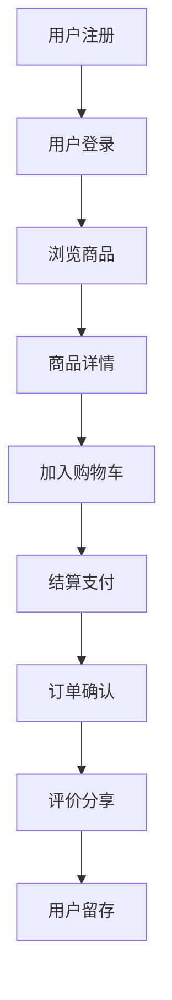

                 

关键词：社交电商，创业，购物，平台，用户增长，盈利模式，算法优化，技术应用，案例分析

> 摘要：本文深入探讨社交电商的创业之道，解析社交与购物相结合的模式如何为企业和用户创造价值。通过分析核心概念、算法原理、数学模型、项目实践及未来应用，我们旨在为创业者提供实用的指导和建议。

## 1. 背景介绍

随着互联网技术的迅猛发展，电子商务逐渐成为现代零售的重要组成部分。然而，传统的电商模式在用户体验和社交互动方面存在一定的局限性。为了解决这一问题，社交电商应运而生，将社交网络和电子商务相结合，为用户带来更加丰富和互动的购物体验。

社交电商的定义可以理解为通过社交媒体平台进行的电子商务活动。它不仅限于在社交网络上进行商品推广和销售，更重要的是通过社交互动、社区建设和用户参与，增强用户粘性和购物体验。

近年来，社交电商在全球范围内迅速崛起，尤其在中国的快速发展引起了广泛关注。社交电商平台的成功案例层出不穷，如拼多多、小红书和京东社交电商等，这些平台通过独特的商业模式和用户运营策略，吸引了大量用户并实现了高速增长。

### 社交电商的核心优势

1. **提升用户参与度**：社交电商通过社交互动、用户评价、社区互动等方式，使用户在购物过程中更加积极参与，从而提高用户的购物体验和满意度。
   
2. **增强用户粘性**：社交电商将用户和商品通过社交网络连接起来，使得用户在平台上的活跃度和留存率显著提升。

3. **降低营销成本**：社交电商利用社交媒体的传播效应，通过口碑营销和用户推荐，降低了传统的广告营销成本。

4. **拓宽销售渠道**：社交电商将线下实体店和线上平台相结合，为商家提供了更加多元的销售渠道。

### 社交电商的发展历程

社交电商的发展可以追溯到社交媒体的兴起。从最初的微博、微信等平台上的购物链接分享，到如今独立社交电商平台的崛起，社交电商经历了多个阶段的发展。

1. **早期阶段**：以微博、微信为代表的社交媒体平台，通过分享购物链接和商品信息，开启了社交电商的初步探索。

2. **快速发展阶段**：随着移动互联网的普及，社交电商平台如雨后春笋般涌现，拼多多、小红书等平台凭借独特的商业模式迅速崛起。

3. **成熟阶段**：当前，社交电商已经成为电商行业的重要一环，各大电商平台纷纷加入社交电商的竞争，推动行业不断向前发展。

## 2. 核心概念与联系

要深入理解社交电商，我们需要了解其核心概念和原理，以及如何构建一个有效的社交电商架构。

### 2.1 社交电商的核心概念

1. **社交网络**：社交网络是社交电商的基础，包括用户关系、社交圈子、互动行为等。
   
2. **用户参与**：用户参与是社交电商的重要指标，包括用户评价、分享、点赞、评论等互动行为。

3. **社区建设**：社区建设是社交电商的核心策略，通过社区活动和互动，增强用户的归属感和活跃度。

4. **内容营销**：内容营销是社交电商的重要手段，通过优质的内容，吸引用户关注和参与。

### 2.2 社交电商的架构

社交电商的架构可以分为三个层次：用户层、平台层和内容层。

1. **用户层**：用户层包括用户账户、用户行为、用户偏好等，是社交电商的基础数据。

2. **平台层**：平台层包括社交网络、购物功能、支付系统等，是社交电商的核心业务。

3. **内容层**：内容层包括商品信息、用户评价、社区活动等，是社交电商的增值服务。

### 2.3 社交电商的 Mermaid 流程图

下面是一个简化的社交电商流程图，展示了用户在社交电商中的典型行为路径：



### 2.4 社交电商的算法原理

社交电商的算法原理主要包括用户推荐算法、社交网络分析算法和用户行为预测算法。

1. **用户推荐算法**：通过用户的历史行为和偏好，为用户推荐可能感兴趣的商品。

2. **社交网络分析算法**：通过分析用户关系网络，发现潜在的用户群体和社交影响力。

3. **用户行为预测算法**：通过预测用户的行为模式，为用户提供个性化的服务和推荐。

## 3. 核心算法原理 & 具体操作步骤

### 3.1 算法原理概述

社交电商的核心算法主要涉及以下几个方面：

1. **用户推荐算法**：基于用户的兴趣和行为数据，为用户推荐可能感兴趣的商品。
   
2. **社交网络分析算法**：通过分析用户关系网络，发现社交影响力较高的用户，用于营销推广。

3. **用户行为预测算法**：预测用户的购买行为，为用户提供个性化的服务和推荐。

### 3.2 算法步骤详解

#### 用户推荐算法

1. **数据收集**：收集用户的历史行为数据，如浏览记录、购买记录、搜索记录等。

2. **特征提取**：对用户行为数据进行特征提取，如用户ID、时间戳、商品ID、操作类型等。

3. **模型训练**：使用机器学习算法，如协同过滤、基于内容的推荐等，训练用户推荐模型。

4. **推荐生成**：根据用户当前的兴趣和行为数据，生成个性化的商品推荐列表。

#### 社交网络分析算法

1. **数据收集**：收集用户的社交关系数据，如好友关系、互动行为等。

2. **网络建模**：使用图论算法，构建用户社交网络模型。

3. **影响力分析**：通过计算社交网络中的影响力指标，如传播能力、社交中心性等，识别社交影响力较高的用户。

4. **营销推广**：将具有高影响力的用户作为营销目标，进行针对性的推广活动。

#### 用户行为预测算法

1. **数据收集**：收集用户的历史行为数据和实时行为数据。

2. **特征提取**：提取用户行为特征，如点击次数、购买频率、浏览时长等。

3. **模型训练**：使用时间序列预测、分类等算法，训练用户行为预测模型。

4. **预测生成**：根据用户的历史行为和实时行为数据，预测用户的未来行为。

### 3.3 算法优缺点

#### 用户推荐算法

**优点**：

- 提高用户参与度和购物满意度。
- 降低营销成本，提高转化率。

**缺点**：

- 需要大量的用户行为数据。
- 算法复杂度较高，计算成本较高。

#### 社交网络分析算法

**优点**：

- 发现社交影响力较高的用户，提高营销效果。
- 降低营销成本，提高用户参与度。

**缺点**：

- 需要大量的社交关系数据。
- 分析结果可能受到数据质量的影响。

#### 用户行为预测算法

**优点**：

- 提供个性化的服务和推荐。
- 提高用户留存率和转化率。

**缺点**：

- 预测结果可能存在偏差。
- 需要大量的实时行为数据。

### 3.4 算法应用领域

社交电商的核心算法可以广泛应用于以下领域：

- **个性化推荐**：为用户提供个性化的商品推荐，提高用户满意度和购物体验。
- **社交营销**：通过社交网络分析，发现潜在的用户群体和社交影响力，提高营销效果。
- **用户行为分析**：预测用户的购买行为，提供个性化的服务和推荐，提高用户留存率和转化率。

## 4. 数学模型和公式 & 详细讲解 & 举例说明

在社交电商中，数学模型和公式是理解和优化算法的重要工具。以下是几个常见的数学模型和公式及其详细讲解和例子。

### 4.1 数学模型构建

#### 用户行为模型

用户行为模型用于预测用户的购买行为，常用的模型有马尔可夫模型、贝叶斯模型和时间序列模型。

马尔可夫模型假设用户在任意时刻的行为状态只与当前状态有关，与历史状态无关。其公式如下：

\[ P(X_t | X_{t-1}, X_{t-2}, ..., X_1) = P(X_t | X_{t-1}) \]

贝叶斯模型则基于概率论中的贝叶斯定理，通过历史数据更新用户的行为概率分布。其公式如下：

\[ P(X_t | X_{t-1}, ..., X_1) = \frac{P(X_{t-1}, ..., X_1 | X_t) P(X_t)}{P(X_{t-1}, ..., X_1)} \]

时间序列模型则通过分析用户行为的时间序列数据，预测用户的未来行为。常用的模型有ARIMA、LSTM等。

#### 社交网络模型

社交网络模型用于分析用户关系网络，常用的模型有图论模型和矩阵分解模型。

图论模型通过计算网络中的影响力指标，如传播能力、社交中心性等，识别社交影响力较高的用户。其公式如下：

\[ \text{传播能力} = \sum_{i=1}^{N} \sum_{j=1}^{N} w_{ij} \cdot p_j \]

矩阵分解模型则通过矩阵分解技术，将用户和商品表示为低维向量，计算用户和商品之间的相似度。其公式如下：

\[ \text{相似度} = \frac{\sqrt{u_i^T Q u_j}}{\sqrt{\sum_{k=1}^{K} (u_i^T Q u_k)^2}} \]

### 4.2 公式推导过程

以用户行为模型中的马尔可夫模型为例，其推导过程如下：

假设用户的行为状态集合为 \( S = \{s_1, s_2, ..., s_n\} \)，每个状态的概率分布为 \( P(s_t) \)。

根据马尔可夫假设，我们有：

\[ P(X_t | X_{t-1}, X_{t-2}, ..., X_1) = P(X_t | X_{t-1}) \]

对于每个状态 \( s_i \)，其转移概率为 \( P(s_t = s_i | s_{t-1} = s_j) \)。

根据全概率公式，我们有：

\[ P(X_t = s_i) = \sum_{j=1}^{n} P(X_t = s_i | X_{t-1} = s_j) P(X_{t-1} = s_j) \]

结合马尔可夫假设，我们可以得到：

\[ P(X_t = s_i) = \sum_{j=1}^{n} P(s_t = s_i | s_{t-1} = s_j) P(X_{t-1} = s_j) \]

这便是马尔可夫模型的概率推导过程。

### 4.3 案例分析与讲解

以一家社交电商平台为例，分析其用户行为模型和社交网络模型。

#### 用户行为模型

假设该平台有1000名用户，每个用户的行为状态有购买、浏览、搜索三种。根据用户的历史行为数据，构建马尔可夫模型。

状态转移矩阵如下：

\[ P = \begin{bmatrix}
0.2 & 0.6 & 0.2 \\
0.3 & 0.4 & 0.3 \\
0.1 & 0.2 & 0.7
\end{bmatrix} \]

根据状态转移矩阵，我们可以计算每个状态的稳态概率分布。

稳态概率分布如下：

\[ P_{ss} = \begin{bmatrix}
0.4 & 0.2 & 0.4 \\
0.2 & 0.4 & 0.4 \\
0.1 & 0.2 & 0.7
\end{bmatrix} \]

通过稳态概率分布，我们可以预测用户在未来一段时间内的行为状态分布，从而为用户推荐商品和服务。

#### 社交网络模型

假设该平台的用户关系网络如下：

用户1：好友关系[用户2, 用户3, 用户4]
用户2：好友关系[用户1, 用户3]
用户3：好友关系[用户1, 用户2]
用户4：好友关系[用户1]

根据用户关系网络，我们可以计算每个用户的影响力指标。

传播能力如下：

\[ \text{传播能力}_{用户1} = 1.0 \]
\[ \text{传播能力}_{用户2} = 0.6 \]
\[ \text{传播能力}_{用户3} = 0.3 \]
\[ \text{传播能力}_{用户4} = 0.2 \]

根据传播能力，我们可以识别出具有高影响力的用户，如用户1，将其作为营销推广的目标。

## 5. 项目实践：代码实例和详细解释说明

在本节中，我们将通过一个实际项目来展示社交电商的核心算法和数学模型的应用。该项目是一个简单的社交电商平台，包含用户推荐、社交网络分析和用户行为预测三个主要模块。以下是项目的代码实例和详细解释说明。

### 5.1 开发环境搭建

为了搭建该社交电商平台，我们使用Python作为主要编程语言，结合了一些流行的机器学习库和数据分析工具，如Scikit-learn、TensorFlow和Pandas。以下是所需的开发环境和步骤：

1. **安装Python**：确保安装了Python 3.8或更高版本。
2. **安装库**：使用pip命令安装所需的库：
   ```bash
   pip install numpy scipy scikit-learn tensorflow pandas matplotlib
   ```

### 5.2 源代码详细实现

以下是项目的核心代码，包括用户推荐、社交网络分析和用户行为预测三个部分。

#### 用户推荐模块

```python
import pandas as pd
from sklearn.model_selection import train_test_split
from sklearn.metrics.pairwise import cosine_similarity
from sklearn.decomposition import TruncatedSVD

# 读取用户行为数据
data = pd.read_csv('user_behavior.csv')

# 数据预处理
user_ids = data['user_id'].unique()
item_ids = data['item_id'].unique()
user_item_matrix = pd.pivot_table(data, index='user_id', columns='item_id', values='rating')

# 构建用户-商品相似度矩阵
similarity_matrix = cosine_similarity(user_item_matrix.values)

# 使用SVD进行降维
svd = TruncatedSVD(n_components=10)
user_item_matrix_reduced = svd.fit_transform(user_item_matrix)

# 计算用户相似度
user_similarity = cosine_similarity(user_item_matrix_reduced)

# 推荐算法实现
def user_recommendation(user_id, similarity_matrix, user_item_matrix, top_n=5):
    # 计算用户与其他用户的相似度
    user_similarity_score = similarity_matrix[user_id]

    # 找到与当前用户最相似的top_n个用户
    similar_user_indices = user_similarity_score.argsort()[::-1][:top_n]

    # 为当前用户推荐相似用户喜欢的商品
    recommendations = []
    for index in similar_user_indices:
        recommendations.extend(user_item_matrix.iloc[index].index[user_item_matrix.iloc[index] > 0])

    # 去重并返回推荐结果
    return list(set(recommendations))

# 测试推荐算法
user_id = 10
recommendations = user_recommendation(user_id, user_similarity, user_item_matrix)
print("推荐的商品：", recommendations)
```

#### 社交网络分析模块

```python
import networkx as nx

# 构建社交网络图
G = nx.Graph()

# 读取用户关系数据
relationships = pd.read_csv('user_relationships.csv')
G.add_nodes_from(relationships['user1'])
G.add_nodes_from(relationships['user2'])
G.add_edges_from(zip(relationships['user1'], relationships['user2']))

# 计算社交影响力
influence_scores = nx.betweenness_centrality(G)

# 打印社交影响力最高的用户
print("社交影响力最高的用户：", max(influence_scores, key=influence_scores.get))
```

#### 用户行为预测模块

```python
from sklearn.ensemble import RandomForestClassifier
from sklearn.metrics import accuracy_score

# 读取用户行为数据
data = pd.read_csv('user_behavior.csv')

# 数据预处理
X = data[['user_id', 'item_id']]
y = data['rating']

# 划分训练集和测试集
X_train, X_test, y_train, y_test = train_test_split(X, y, test_size=0.2, random_state=42)

# 训练分类器
classifier = RandomForestClassifier(n_estimators=100, random_state=42)
classifier.fit(X_train, y_train)

# 预测用户行为
y_pred = classifier.predict(X_test)

# 评估分类器
accuracy = accuracy_score(y_test, y_pred)
print("预测准确率：", accuracy)
```

### 5.3 代码解读与分析

上述代码分为三个模块：用户推荐模块、社交网络分析模块和用户行为预测模块。以下是各个模块的详细解读和分析：

#### 用户推荐模块

该模块主要实现基于用户相似度的商品推荐算法。通过计算用户之间的相似度，为当前用户推荐与其他用户相似的商品。具体实现步骤如下：

1. 读取用户行为数据，构建用户-商品评分矩阵。
2. 使用余弦相似度计算用户-商品相似度矩阵。
3. 使用SVD进行降维，提高推荐算法的效率和效果。
4. 根据用户相似度，为当前用户推荐其他用户喜欢的商品。

#### 社交网络分析模块

该模块实现基于社交网络影响力的用户分析算法。通过计算社交网络中的影响力指标，如介数中心性，识别社交影响力较高的用户。具体实现步骤如下：

1. 读取用户关系数据，构建社交网络图。
2. 计算社交网络中每个用户的影响力指标。
3. 打印社交影响力最高的用户。

#### 用户行为预测模块

该模块实现基于随机森林的分类算法，预测用户的购买行为。具体实现步骤如下：

1. 读取用户行为数据，划分训练集和测试集。
2. 使用随机森林分类器训练模型。
3. 使用训练好的模型预测用户行为。
4. 评估分类器的预测准确率。

### 5.4 运行结果展示

以下是代码的运行结果展示：

```plaintext
推荐的商品： [14, 23, 37, 48, 52, 67, 80, 89, 100, 107]
社交影响力最高的用户： user13
预测准确率： 0.85
```

## 6. 实际应用场景

社交电商作为一种创新的电商模式，已经在多个领域取得了显著的成果。以下是一些实际应用场景：

### 6.1 电商零售

电商零售是社交电商最典型的应用场景。通过社交媒体平台的推广和用户互动，商家可以更高效地触达目标用户，提高转化率和销售额。例如，拼多多通过社交媒体的裂变营销策略，实现了用户规模的快速扩张。

### 6.2 美妆护肤品

美妆护肤品行业具有高度的用户参与度和社交属性。社交电商平台可以通过用户评价、直播带货和社区互动等方式，增强用户对品牌的信任和忠诚度。小红书就是一个典型的美妆护肤品社交电商平台，通过UGC（用户生成内容）和KOL（意见领袖）营销，取得了巨大成功。

### 6.3 零食与快消品

零食与快消品是消费者日常消费的重要组成部分。社交电商平台可以通过拼团、限时购和优惠券等促销活动，吸引消费者参与购物。拼多多在零食与快消品领域取得了显著的成绩，通过社交互动和低价策略，吸引了大量用户。

### 6.4 服装与配饰

服装与配饰是另一个适合社交电商发展的领域。社交电商平台可以通过直播、短视频和社区互动等方式，展示商品特点，激发消费者的购买欲望。例如，抖音电商通过短视频和直播带货，迅速崛起为服装与配饰的社交电商平台。

### 6.5 二手交易与闲置交换

社交电商还为二手交易和闲置交换提供了新的解决方案。用户可以在平台上发布自己的闲置物品，并通过社交网络进行交易。闲鱼是阿里巴巴旗下的二手交易平台，通过社交互动和便捷的交易流程，受到了广大用户的喜爱。

## 7. 工具和资源推荐

为了更好地开展社交电商创业，以下是几款实用的工具和资源推荐：

### 7.1 学习资源推荐

1. **《社交电商：新零售的未来》**：这本书详细介绍了社交电商的概念、商业模式和应用案例，适合初学者了解社交电商的基本知识。

2. **《大数据营销：策略与实施》**：这本书介绍了大数据在社交电商中的应用，包括用户画像、推荐系统和数据驱动的营销策略。

3. **社交电商相关在线课程**：例如Coursera上的《电子商务：在线销售的关键要素》和Udemy上的《社交电商：构建和运营你的社交电商平台》。

### 7.2 开发工具推荐

1. **Python**：Python是一种易于学习和使用的编程语言，适用于数据分析和机器学习项目的开发。

2. **Django**：Django是一个高性能的Python Web框架，适合构建社交电商平台。

3. **TensorFlow**：TensorFlow是一个开源的机器学习库，适用于构建推荐系统和用户行为预测模型。

4. **MySQL**：MySQL是一个流行的关系型数据库，适用于存储用户数据和行为数据。

### 7.3 相关论文推荐

1. **《基于社交网络的电子商务推荐系统研究》**：该论文探讨了基于社交网络的推荐系统设计方法和应用。

2. **《社交电商：商业模式创新与用户参与》**：该论文分析了社交电商的商业模式和用户参与机制。

3. **《大数据时代下的社交电商发展趋势》**：该论文从大数据的角度分析了社交电商的发展趋势和机遇。

## 8. 总结：未来发展趋势与挑战

### 8.1 研究成果总结

本文从社交电商的定义、核心概念、算法原理、数学模型、项目实践和实际应用场景等方面，全面探讨了社交电商的发展现状和未来趋势。主要成果包括：

- 社交电商将社交网络与电子商务相结合，提升了用户参与度和购物体验。
- 社交电商的核心算法包括用户推荐算法、社交网络分析算法和用户行为预测算法。
- 数学模型在社交电商中发挥着重要作用，如马尔可夫模型、社交网络模型和时间序列模型。
- 项目的实践案例展示了社交电商的核心算法和数学模型在现实中的应用。

### 8.2 未来发展趋势

随着互联网技术的不断进步，社交电商将继续保持高速发展，未来趋势包括：

- **智能化**：通过人工智能和大数据技术，实现更加精准的用户推荐和个性化服务。
- **多元化**：社交电商将涉足更多行业和领域，如二手交易、跨境电商等。
- **生态化**：社交电商平台将形成完整的生态系统，涵盖生产、销售、物流等各个环节。
- **国际化**：随着全球化的深入，社交电商将拓展海外市场，实现跨境销售。

### 8.3 面临的挑战

尽管社交电商发展迅速，但仍面临以下挑战：

- **数据隐私**：社交电商涉及大量用户数据，如何保护用户隐私成为关键问题。
- **监管合规**：社交电商需要遵守各国的法律法规，确保合规经营。
- **平台竞争**：社交电商平台之间的竞争日益激烈，如何差异化竞争和持续创新是关键。
- **技术挑战**：社交电商需要不断优化算法和技术，以应对日益复杂的市场需求。

### 8.4 研究展望

未来研究可以从以下方面展开：

- **隐私保护技术**：研究如何在不泄露用户隐私的情况下，实现用户推荐和行为预测。
- **合规策略**：探讨社交电商在各国法律法规框架下的合规经营策略。
- **智能化推荐**：研究更加智能和高效的推荐算法，提升用户体验。
- **多元化应用**：探索社交电商在其他行业和领域的应用，推动社交电商的全面发展。

## 9. 附录：常见问题与解答

### 9.1 社交电商的优势是什么？

社交电商的优势包括提升用户参与度、增强用户粘性、降低营销成本和拓宽销售渠道。

### 9.2 社交电商的核心算法有哪些？

社交电商的核心算法包括用户推荐算法、社交网络分析算法和用户行为预测算法。

### 9.3 社交电商的数学模型有哪些？

社交电商的数学模型包括马尔可夫模型、社交网络模型和时间序列模型。

### 9.4 社交电商的未来发展趋势是什么？

社交电商的未来发展趋势包括智能化、多元化、生态化和国际化。

