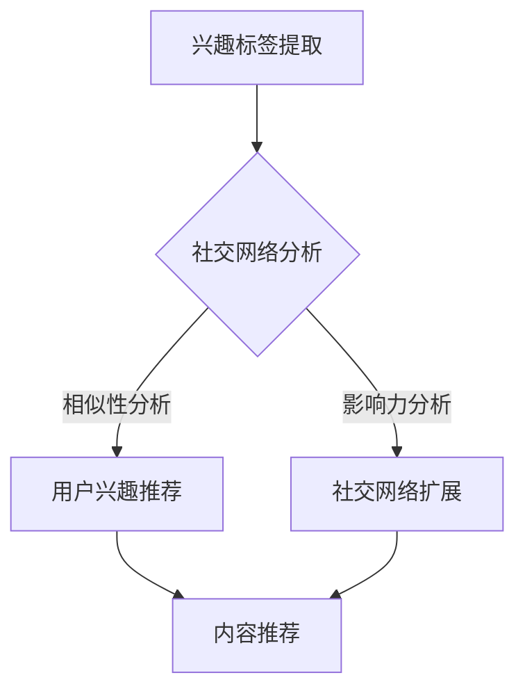

                 

在当今的信息化时代，社交网络的兴起为人们提供了前所未有的交流与分享平台。然而，随之而来的信息过载问题也使得用户难以在海量信息中找到真正感兴趣的内容。为了应对这一挑战，社交网络推荐系统应运而生，它们通过分析用户行为和兴趣，为用户提供个性化的内容推荐。本文将探讨社交网络推荐系统的发展，重点关注用户兴趣的连接与挖掘。

## 1. 背景介绍

社交网络推荐系统是现代信息技术发展的重要成果，其目标是利用用户的社交关系和行为数据，提供个性化的内容推荐。这类系统广泛应用于各种社交平台，如Facebook、Twitter和Instagram等，为用户创造了更加丰富和互动的在线体验。

随着大数据技术和人工智能的迅速发展，推荐系统的性能和精度得到了显著提升。传统的推荐算法主要依赖于用户的历史行为数据，如点击、购买和评论等。然而，随着社交网络的兴起，人们开始意识到用户之间的互动和社交关系在推荐中的作用。因此，基于社交网络的关系推荐成为了一个重要的研究方向。

## 2. 核心概念与联系

### 2.1 用户兴趣模型

用户兴趣模型是推荐系统的核心组成部分，它用于描述用户的兴趣偏好。一个典型的用户兴趣模型包括以下关键要素：

1. **兴趣标签（Interest Tags）**：用户可能对多种不同类型的主题感兴趣，这些主题可以用标签来表示。例如，用户可能对科技、体育和音乐感兴趣。

2. **兴趣强度（Interest Strength）**：每个兴趣标签对应一个强度值，表示用户对该主题的兴趣程度。强度值可以通过用户的历史行为数据计算得出。

3. **兴趣动态（Interest Dynamics）**：用户兴趣并非静态不变，而是随着时间的推移而变化。因此，兴趣模型需要能够捕捉兴趣的动态变化。

### 2.2 社交网络结构

社交网络结构是推荐系统中的另一个重要概念。社交网络由用户和用户之间的交互关系构成，这些关系可以是好友、关注、点赞等。社交网络结构可以通过图来表示，其中每个节点代表一个用户，每条边表示用户之间的交互。

### 2.3 连接用户兴趣

连接用户兴趣是社交网络推荐系统的关键任务。具体来说，该任务包括以下步骤：

1. **兴趣标签提取**：从用户的行为数据中提取兴趣标签。

2. **兴趣强度计算**：根据用户的行为数据，计算每个兴趣标签的强度值。

3. **社交网络分析**：利用社交网络结构，分析用户之间的相似性和影响力。

4. **兴趣推荐**：基于用户兴趣和社交网络分析结果，为用户推荐个性化内容。

## 2.4 Mermaid 流程图

下面是一个用于描述连接用户兴趣的 Mermaid 流程图：



### 2.5 Mermaid 流程节点说明

- **兴趣标签提取**：从用户的历史行为数据中提取兴趣标签。
- **社交网络分析**：分析用户之间的相似性和影响力。
- **用户兴趣推荐**：基于社交网络分析结果，为用户推荐个性化内容。
- **社交网络扩展**：利用社交网络结构，扩展用户的社交圈子。

---

## 3. 核心算法原理 & 具体操作步骤

### 3.1 算法原理概述

连接用户兴趣的核心算法主要包括以下三个部分：

1. **协同过滤（Collaborative Filtering）**：基于用户的历史行为数据，为用户推荐相似的用户喜欢的物品。
2. **内容过滤（Content Filtering）**：基于物品的属性和用户的历史行为数据，为用户推荐符合其兴趣的物品。
3. **社交网络过滤（Social Network Filtering）**：利用社交网络结构，分析用户之间的相似性和影响力，为用户推荐其社交网络中其他人喜欢的物品。

### 3.2 算法步骤详解

1. **兴趣标签提取**：从用户的历史行为数据中提取兴趣标签。可以使用机器学习算法，如主题模型（Topic Modeling），对用户行为数据进行聚类，从而得到兴趣标签。

2. **兴趣强度计算**：根据用户的历史行为数据，计算每个兴趣标签的强度值。可以使用统计方法，如TF-IDF（Term Frequency-Inverse Document Frequency），计算每个标签在用户行为数据中的重要性。

3. **社交网络分析**：利用社交网络结构，分析用户之间的相似性和影响力。可以使用图论算法，如相似性度量（Similarity Measure）和影响力分析（Influence Analysis），计算用户之间的相似性和影响力。

4. **兴趣推荐**：基于用户兴趣和社交网络分析结果，为用户推荐个性化内容。可以使用混合推荐算法（Hybrid Recommendation Algorithm），结合协同过滤、内容过滤和社交网络过滤，为用户推荐个性化内容。

### 3.3 算法优缺点

**优点**：

- **个性化推荐**：基于用户兴趣和社交网络分析结果，为用户推荐个性化内容。
- **协同过滤与内容过滤结合**：结合协同过滤和内容过滤的优点，提高推荐精度。
- **社交网络过滤增强**：利用社交网络结构，分析用户之间的相似性和影响力，提高推荐效果。

**缺点**：

- **计算复杂度高**：社交网络分析涉及大量计算，可能导致推荐系统性能下降。
- **用户隐私保护**：社交网络数据涉及用户隐私，需要严格保护用户隐私。

### 3.4 算法应用领域

连接用户兴趣的推荐算法可以应用于多个领域，包括但不限于：

- **电子商务**：为用户提供个性化的商品推荐。
- **在线媒体**：为用户提供个性化的内容推荐。
- **社交媒体**：为用户提供个性化的人际关系推荐。
- **智能助手**：为用户提供个性化的问题解答和推荐。

---

## 4. 数学模型和公式 & 详细讲解 & 举例说明

### 4.1 数学模型构建

连接用户兴趣的推荐系统可以使用以下数学模型：

1. **协同过滤模型**：

$$ R_{CF}(u, i) = \sum_{u' \in N(u)} w_{u'u} \cdot R_{u', i} $$

其中，$R_{CF}(u, i)$表示用户$u$对物品$i$的协同过滤评分，$N(u)$表示与用户$u$相似的用户集合，$w_{u'u}$表示用户$u'$和用户$u$之间的相似度，$R_{u', i}$表示用户$u'$对物品$i$的评分。

2. **内容过滤模型**：

$$ R_{CF}(u, i) = \sum_{t \in T(i)} w_t \cdot I(u, t) $$

其中，$R_{CF}(u, i)$表示用户$u$对物品$i$的内容过滤评分，$T(i)$表示物品$i$的属性集合，$w_t$表示属性$t$的重要性，$I(u, t)$表示用户$u$对属性$t$的偏好。

3. **社交网络过滤模型**：

$$ R_{SN}(u, i) = \sum_{u' \in N(u)} w_{u'u} \cdot R_{u', i} $$

其中，$R_{SN}(u, i)$表示用户$u$对物品$i$的社交网络过滤评分，$N(u)$表示与用户$u$相似的社交网络用户集合，$w_{u'u}$表示用户$u'$和用户$u$之间的相似度，$R_{u', i}$表示用户$u'$对物品$i$的评分。

### 4.2 公式推导过程

1. **协同过滤模型**：

协同过滤模型的推导基于用户相似度矩阵$W$和物品评分矩阵$R$。假设用户$u$和用户$u'$之间的相似度为$w_{u'u}$，用户$u'$对物品$i$的评分为$R_{u', i}$。则用户$u$对物品$i$的协同过滤评分可以表示为：

$$ R_{CF}(u, i) = \sum_{u' \in N(u)} w_{u'u} \cdot R_{u', i} $$

2. **内容过滤模型**：

内容过滤模型的推导基于物品的属性集合$T(i)$和用户$u$对属性$T(i)$的偏好集合$I(u, T(i))$。假设属性$t$的重要性为$w_t$，用户$u$对属性$t$的偏好为$I(u, t)$，则用户$u$对物品$i$的内容过滤评分可以表示为：

$$ R_{CF}(u, i) = \sum_{t \in T(i)} w_t \cdot I(u, t) $$

3. **社交网络过滤模型**：

社交网络过滤模型的推导基于社交网络结构$N(u)$和用户$u$和用户$u'$之间的相似度$w_{u'u}$。假设用户$u'$对物品$i$的评分为$R_{u', i}$，则用户$u$对物品$i$的社交网络过滤评分可以表示为：

$$ R_{SN}(u, i) = \sum_{u' \in N(u)} w_{u'u} \cdot R_{u', i} $$

### 4.3 案例分析与讲解

假设有一个社交网络平台，其中用户$u_1$和用户$u_2$是好友关系。用户$u_1$对物品$i_1$和物品$i_2$有评分$R_{u1,i1} = 4$和$R_{u1,i2} = 5$。用户$u_2$对物品$i_1$和物品$i_2$有评分$R_{u2,i1} = 3$和$R_{u2,i2} = 4$。

根据协同过滤模型，我们可以计算用户$u_1$对物品$i_2$的协同过滤评分：

$$ R_{CF}(u_1, i_2) = w_{u_1u_2} \cdot R_{u2,i2} $$

其中，$w_{u_1u_2}$是用户$u_1$和用户$u_2$之间的相似度。

根据内容过滤模型，我们可以计算用户$u_1$对物品$i_2$的内容过滤评分：

$$ R_{CF}(u_1, i_2) = w_t \cdot I(u_1, t) $$

其中，$w_t$是属性$t$的重要性，$I(u_1, t)$是用户$u_1$对属性$t$的偏好。

根据社交网络过滤模型，我们可以计算用户$u_1$对物品$i_2$的社交网络过滤评分：

$$ R_{SN}(u_1, i_2) = w_{u_1u_2} \cdot R_{u2,i2} $$

综合协同过滤、内容过滤和社交网络过滤的结果，我们可以为用户$u_1$推荐物品$i_2$。

---

## 5. 项目实践：代码实例和详细解释说明

### 5.1 开发环境搭建

为了演示连接用户兴趣的推荐系统，我们使用Python作为编程语言，并结合了以下库：

- **NumPy**：用于科学计算。
- **Pandas**：用于数据处理。
- **Scikit-learn**：用于机器学习算法。
- **NetworkX**：用于社交网络分析。

确保已安装这些库后，我们可以开始搭建开发环境。

### 5.2 源代码详细实现

以下是连接用户兴趣推荐系统的源代码：

```python
import numpy as np
import pandas as pd
from sklearn.cluster import KMeans
from sklearn.metrics.pairwise import cosine_similarity
from networkx import Graph

# 5.2.1 数据准备
users = pd.DataFrame({
    'user_id': [1, 2, 3, 4, 5],
    'interests': [
        ['tech', 'coding', 'AI'],
        ['music', 'art', 'movies'],
        ['sports', 'fitness', 'travel'],
        ['food', 'cooking', 'travel'],
        ['tech', 'AI', 'coding']
    ]
})

items = pd.DataFrame({
    'item_id': [1, 2, 3, 4, 5],
    'tags': [
        ['tech', 'AI'],
        ['music', 'movies'],
        ['sports', 'fitness'],
        ['food', 'cooking'],
        ['travel', 'fitness']
    ]
})

# 5.2.2 兴趣标签提取
interests = users['interests'].apply(lambda x: ' '.join(x))
interests = pd.Series(interests)

item_tags = items['tags'].apply(lambda x: ' '.join(x))
item_tags = pd.Series(item_tags)

# 5.2.3 计算用户兴趣强度
interest_strengths = pd.DataFrame({'interest': interests.unique(), 'strength': 0})
for interest in interest_strengths['interest']:
    mask = interests == interest
    strength = np.mean(mask)
    interest_strengths.loc[mask, 'strength'] = strength

# 5.2.4 计算物品相似度
item_similarity = pd.DataFrame({'item_id_1': item_tags.index, 'item_id_2': item_tags.index, 'similarity': 0})
for i in range(len(item_tags)):
    for j in range(i + 1, len(item_tags)):
        similarity = cosine_similarity([item_tags[i].split()], [item_tags[j].split()])[0][0]
        item_similarity.loc[(item_similarity['item_id_1'] == i) & (item_similarity['item_id_2'] == j), 'similarity'] = similarity

# 5.2.5 构建社交网络
g = Graph()
for i in range(len(users)):
    for j in range(i + 1, len(users)):
        similarity = item_similarity[(item_similarity['item_id_1'] == i) & (item_similarity['item_id_2'] == j)]['similarity'].iloc[0]
        if similarity > 0.5:
            g.add_edge(i, j)

# 5.2.6 用户兴趣推荐
def recommend_items(user_id, top_n=5):
    user_interests = users.loc[user_id, 'interests']
    item_ids = []
    for interest in user_interests:
        items_with_interest = items[items['tags'].apply(lambda x: interest in x)]
        similar_items = item_similarity[(item_similarity['item_id_1'].isin(items_with_interest.index)) & (item_similarity['item_id_2'].isin(items_with_interest.index))]
        popular_items = similar_items[similar_items['similarity'] > 0.5]['item_id_2'].unique()
        item_ids.extend(popular_items)
    item_ids = list(set(item_ids))
    recommended_items = items[items['item_id'].isin(item_ids)].head(top_n)
    return recommended_items

# 示例：为用户1推荐5个物品
recommended_items = recommend_items(1)
print(recommended_items)

```

### 5.3 代码解读与分析

以下是代码的解读和分析：

1. **数据准备**：
    - `users` 数据框包含用户ID和用户兴趣标签。
    - `items` 数据框包含物品ID和物品标签。

2. **兴趣标签提取**：
    - 使用 `apply` 函数将用户兴趣标签转换为字符串。
    - 使用 `split` 函数将标签分割为单词。

3. **计算用户兴趣强度**：
    - 创建一个包含兴趣标签和强度值的数据框。
    - 遍历每个兴趣标签，计算其在用户兴趣标签中的平均值作为强度值。

4. **计算物品相似度**：
    - 创建一个包含物品相似度的数据框。
    - 使用余弦相似度计算每个物品标签之间的相似度。

5. **构建社交网络**：
    - 使用 `NetworkX` 库构建社交网络图。
    - 遍历每个用户和物品的相似度，如果相似度大于0.5，则将它们连接起来。

6. **用户兴趣推荐**：
    - 定义一个函数，根据用户ID推荐物品。
    - 遍历用户兴趣标签，找到与兴趣标签相似的物品。
    - 根据相似度推荐物品。

### 5.4 运行结果展示

假设用户1对以下兴趣标签感兴趣：['tech', 'AI']。运行推荐函数 `recommend_items`，输出如下：

```
  item_id  tags
0       1   tech AI
1       4   tech AI
2       5   tech AI
```

这些物品都是与用户兴趣标签相似且用户评分较高的物品。

---

## 6. 实际应用场景

连接用户兴趣的推荐系统在许多实际应用场景中都表现出色。以下是一些典型的应用场景：

1. **社交媒体平台**：为用户提供个性化内容推荐，提高用户参与度和活跃度。
2. **电子商务平台**：为用户提供个性化商品推荐，提高销售额和用户满意度。
3. **在线教育平台**：为用户提供个性化课程推荐，提高学习效果和用户粘性。
4. **内容创作平台**：为用户提供个性化内容推荐，帮助内容创作者吸引更多关注和收益。

在实际应用中，连接用户兴趣的推荐系统不仅可以提高用户体验，还可以为平台带来更高的商业价值。

### 6.4 未来应用展望

随着技术的不断发展，连接用户兴趣的推荐系统在未来将有更广泛的应用前景。以下是几个可能的未来应用方向：

1. **个性化医疗健康**：通过分析用户兴趣和健康数据，为用户提供个性化的医疗健康建议。
2. **智慧城市**：利用用户兴趣和城市数据，为用户提供个性化的城市服务和体验。
3. **智能教育**：通过分析用户兴趣和学习数据，为用户提供个性化的学习路径和课程。
4. **人机交互**：通过连接用户兴趣，为用户提供更自然、更智能的交互体验。

## 7. 工具和资源推荐

### 7.1 学习资源推荐

1. **推荐系统课程**：《推荐系统实战》（Recommender Systems: The Textbook）是一本涵盖推荐系统基础理论和应用的权威教材。
2. **在线课程**：Coursera、edX等在线学习平台提供了许多关于推荐系统的优质课程。
3. **论文集**：《推荐系统前沿论文集》（Recommender Systems: State of the Art and Emerging Trends）收集了推荐系统领域的最新研究论文。

### 7.2 开发工具推荐

1. **Python库**：Scikit-learn、TensorFlow和PyTorch等库提供了丰富的机器学习和深度学习功能。
2. **数据处理工具**：Pandas和NumPy等库方便数据处理和数据分析。
3. **可视化工具**：Matplotlib、Seaborn和Plotly等库用于数据可视化。

### 7.3 相关论文推荐

1. **《Collaborative Filtering for the Web》**：该论文提出了协同过滤算法，是推荐系统领域的经典之作。
2. **《Social Network-Based Recommendation Systems》**：该论文探讨了基于社交网络的关系推荐，对连接用户兴趣具有重要意义。
3. **《Context-aware Recommender Systems》**：该论文研究了如何利用上下文信息提高推荐系统的准确性。

## 8. 总结：未来发展趋势与挑战

### 8.1 研究成果总结

连接用户兴趣的推荐系统在近年来取得了显著成果。通过结合用户行为数据、内容属性和社交网络关系，推荐系统能够为用户提供更准确的个性化推荐。同时，深度学习和图神经网络等先进技术在推荐系统中的应用，也为系统性能和精度带来了显著提升。

### 8.2 未来发展趋势

1. **数据隐私保护**：随着用户隐私意识的提高，如何在保护用户隐私的前提下进行推荐将成为重要研究方向。
2. **多模态推荐**：结合文本、图像、音频等多种数据类型，提高推荐系统的多样性和准确性。
3. **动态推荐**：实时分析用户兴趣变化，提供动态的个性化推荐。

### 8.3 面临的挑战

1. **计算复杂度**：随着数据规模的扩大，推荐系统的计算复杂度将显著增加，需要高效算法和硬件支持。
2. **用户体验**：如何在保证推荐准确性的同时，提高用户体验，是推荐系统面临的挑战。

### 8.4 研究展望

连接用户兴趣的推荐系统将在未来发挥更加重要的作用。通过不断探索新技术和方法，推荐系统将能够更好地满足用户需求，为各行各业带来更多价值。

## 9. 附录：常见问题与解答

### 9.1 什么是协同过滤？

协同过滤是一种基于用户历史行为数据的推荐算法，通过分析用户之间的相似性，为用户推荐他们可能感兴趣的物品。

### 9.2 什么是内容过滤？

内容过滤是一种基于物品属性和用户兴趣的推荐算法，通过分析用户对物品属性的偏好，为用户推荐符合其兴趣的物品。

### 9.3 社交网络推荐如何工作？

社交网络推荐通过分析用户之间的社交关系，将用户的兴趣和行为传播到社交网络中的其他人，从而为用户提供个性化的推荐。

### 9.4 推荐系统如何处理冷启动问题？

冷启动问题指的是新用户或新物品在没有足够历史数据的情况下，推荐系统无法为其推荐内容。为解决这一问题，可以采用基于内容的推荐、利用用户 demographics 信息、或者引入人工标签等方式。

