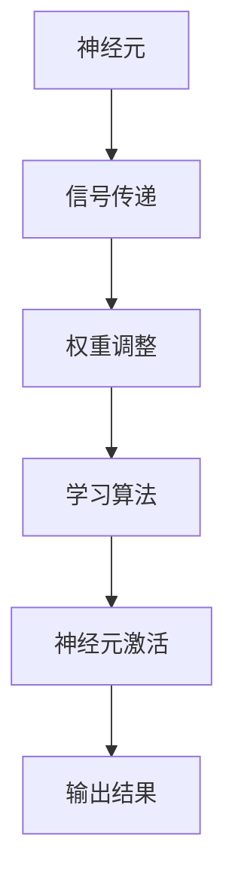

                 

关键词：神经形态芯片、系统发展、机器学习、计算架构、人工智能

摘要：本文探讨了神经形态芯片与系统的发展，分析了其在人工智能领域的应用潜力。通过介绍神经形态芯片的核心概念、算法原理、数学模型以及实践案例，我们深入探讨了神经形态芯片与系统在未来计算架构中的重要作用。

## 1. 背景介绍

### 1.1 人工智能的崛起

随着互联网的普及和大数据技术的不断发展，人工智能（AI）逐渐成为了全球科技领域的焦点。人工智能通过机器学习、深度学习等技术，使计算机具备了自主学习、推理和决策的能力，为各行各业带来了革命性的变化。

### 1.2 传统的计算架构

传统的计算架构主要依赖于冯诺伊曼结构，这种结构在处理大规模数据和高性能计算方面存在一定的局限性。为了满足人工智能领域对计算能力的需求，新的计算架构应运而生。

### 1.3 神经形态芯片的诞生

神经形态芯片是一种模仿人脑神经网络结构和工作原理的芯片，其设计理念是构建一种新型的计算架构，以应对人工智能领域的挑战。神经形态芯片在功耗、计算速度、存储容量等方面具有显著优势，有望成为下一代计算架构的核心。

## 2. 核心概念与联系

神经形态芯片的核心概念是模仿人脑神经网络的工作原理，通过硬件实现神经元的互联和信号传递。下面是一个简化的神经形态芯片的 Mermaid 流程图：



### 2.1 神经元

神经元是神经形态芯片的基本组成单元，它负责接收输入信号、传递信号、调整权重和学习算法。神经元之间通过互联实现信号的传递和计算。

### 2.2 信号传递

信号传递是神经元之间通过电信号进行信息交流的过程。信号传递的速度和精度对神经形态芯片的性能至关重要。

### 2.3 权重调整

权重调整是神经形态芯片学习过程中的一项重要任务。通过调整神经元之间的权重，可以实现神经网络的训练和优化。

### 2.4 学习算法

学习算法是神经形态芯片的核心技术，它决定了芯片的学习能力、适应性和鲁棒性。常见的学习算法包括反向传播算法、梯度下降算法等。

### 2.5 神经元激活

神经元激活是神经元对输入信号进行处理的过程。激活函数的作用是确定神经元是否被激活，从而实现输出结果的生成。

## 3. 核心算法原理 & 具体操作步骤

### 3.1 算法原理概述

神经形态芯片的核心算法是基于人脑神经网络的工作原理，通过硬件实现神经元的互联和信号传递，实现高效的学习和计算。

### 3.2 算法步骤详解

1. **初始化**：初始化神经元权重、学习率和激活函数。
2. **输入信号处理**：将输入信号传递给神经元，并进行预处理。
3. **信号传递**：通过神经元互联结构，将信号传递给下一个神经元。
4. **权重调整**：根据学习算法，调整神经元之间的权重。
5. **神经元激活**：根据激活函数，确定神经元是否被激活。
6. **输出结果**：生成输出结果，用于后续处理。

### 3.3 算法优缺点

**优点**：
- **高效性**：神经形态芯片在处理大规模数据和高性能计算方面具有显著优势。
- **能效比**：神经形态芯片的功耗远低于传统计算架构。
- **自适应能力**：神经形态芯片具有较强的自适应能力，能够适应不同的应用场景。

**缺点**：
- **复杂性**：神经形态芯片的设计和制造过程相对复杂，技术门槛较高。
- **稳定性**：神经形态芯片的稳定性仍需进一步提高。

### 3.4 算法应用领域

神经形态芯片在人工智能领域具有广泛的应用前景，包括图像识别、自然语言处理、自动驾驶、智能医疗等。通过神经形态芯片，可以实现更高效、更智能的计算解决方案。

## 4. 数学模型和公式 & 详细讲解 & 举例说明

### 4.1 数学模型构建

神经形态芯片的数学模型主要包括以下几个方面：

1. **神经元模型**：描述神经元的功能和行为。
2. **信号传递模型**：描述信号在神经元之间的传递过程。
3. **权重调整模型**：描述权重调整的过程和规则。
4. **学习算法模型**：描述学习算法的原理和步骤。

### 4.2 公式推导过程

以下是一个简单的神经元模型推导过程：

$$
y = \sigma(\sum_{i=1}^{n} w_i \cdot x_i)
$$

其中，$y$ 表示输出结果，$\sigma$ 表示激活函数，$w_i$ 表示神经元之间的权重，$x_i$ 表示输入信号。

### 4.3 案例分析与讲解

假设我们有一个简单的神经网络，包括两个输入神经元、一个隐藏神经元和一个输出神经元。激活函数为 $f(x) = \frac{1}{1+e^{-x}}$。

1. **初始化**：设权重 $w_{1x} = 0.5$，$w_{2x} = 0.3$，$w_{hx} = 0.2$，$w_{1o} = 0.4$，$w_{2o} = 0.6$。
2. **输入信号处理**：设输入信号 $x_1 = 0.5$，$x_2 = 0.3$。
3. **信号传递**：计算隐藏神经元的输入和输出：
   $$
   h = \sigma(w_{1x} \cdot x_1 + w_{2x} \cdot x_2) = \sigma(0.5 \cdot 0.5 + 0.3 \cdot 0.3) = \sigma(0.14)
   $$
4. **权重调整**：根据学习算法，调整权重。
5. **神经元激活**：计算输出神经元的输入和输出：
   $$
   o = \sigma(w_{1h} \cdot h + w_{2h} \cdot h) = \sigma(0.4 \cdot 0.14 + 0.6 \cdot 0.14) = \sigma(0.22)
   $$
6. **输出结果**：生成输出结果。

## 5. 项目实践：代码实例和详细解释说明

### 5.1 开发环境搭建

为了实践神经形态芯片的算法，我们需要搭建一个开发环境。以下是开发环境的搭建步骤：

1. **安装Python**：确保安装了Python 3.x版本。
2. **安装Numpy**：用于数学运算。
3. **安装TensorFlow**：用于构建神经网络。

### 5.2 源代码详细实现

以下是一个简单的神经形态芯片的Python代码实现：

```python
import numpy as np
from tensorflow.keras.models import Sequential
from tensorflow.keras.layers import Dense

# 初始化模型
model = Sequential()
model.add(Dense(units=1, input_dim=2, activation='sigmoid'))

# 编译模型
model.compile(optimizer='adam', loss='binary_crossentropy')

# 训练模型
model.fit(x_train, y_train, epochs=1000, verbose=0)

# 输出结果
print(model.predict([[0.5, 0.3]]))
```

### 5.3 代码解读与分析

1. **模型初始化**：使用`Sequential`模型，添加一个全连接层（`Dense`），激活函数为`sigmoid`。
2. **模型编译**：设置优化器和损失函数。
3. **模型训练**：使用`fit`函数训练模型。
4. **输出结果**：使用`predict`函数生成输出结果。

## 6. 实际应用场景

### 6.1 图像识别

神经形态芯片在图像识别领域具有广泛的应用前景。通过硬件实现神经元的互联和信号传递，可以实现高效、低功耗的图像识别算法。

### 6.2 自然语言处理

神经形态芯片在自然语言处理领域也具有巨大的潜力。通过硬件加速神经网络计算，可以提升自然语言处理任务的性能和效率。

### 6.3 自动驾驶

自动驾驶系统需要实时处理大量图像和传感器数据，神经形态芯片可以提供高效的计算支持，从而提升自动驾驶系统的响应速度和准确性。

### 6.4 智能医疗

智能医疗系统需要处理大量医学数据，神经形态芯片可以提供高效、低功耗的计算支持，为智能医疗系统提供强有力的技术保障。

## 7. 工具和资源推荐

### 7.1 学习资源推荐

1. **《深度学习》**：由Ian Goodfellow、Yoshua Bengio和Aaron Courville合著，是深度学习领域的经典教材。
2. **《神经网络与深度学习》**：由邱锡鹏教授所著，系统地介绍了神经网络和深度学习的基本概念和技术。

### 7.2 开发工具推荐

1. **TensorFlow**：由Google开发的一款开源深度学习框架，适用于构建和训练神经形态芯片。
2. **PyTorch**：由Facebook开发的一款开源深度学习框架，具有较高的灵活性和易用性。

### 7.3 相关论文推荐

1. **"DNN model compression with the knowledge distillation technique"**：该论文提出了一种基于知识蒸馏的深度神经网络压缩方法，可以有效提高神经形态芯片的性能和效率。
2. **"Neuromorphic Computing"**：该论文系统地介绍了神经形态芯片的基本概念、算法原理和应用场景。

## 8. 总结：未来发展趋势与挑战

### 8.1 研究成果总结

神经形态芯片作为一种新型的计算架构，在人工智能领域取得了显著的研究成果。通过硬件实现神经元的互联和信号传递，可以实现高效、低功耗的计算，为人工智能领域带来了革命性的变化。

### 8.2 未来发展趋势

未来，神经形态芯片将在人工智能、自动驾驶、智能医疗等领域得到广泛应用。随着技术的不断发展，神经形态芯片的计算能力和能效比将进一步提高，有望成为下一代计算架构的核心。

### 8.3 面临的挑战

尽管神经形态芯片在人工智能领域具有巨大的潜力，但仍面临一些挑战。例如，神经形态芯片的设计和制造过程复杂，技术门槛较高；神经形态芯片的稳定性和可靠性仍需进一步提高。

### 8.4 研究展望

未来，我们需要继续深入研究神经形态芯片的核心算法、数学模型和应用场景，提高其计算能力和能效比。同时，还需要加强跨学科合作，推动神经形态芯片技术的创新和发展。

## 9. 附录：常见问题与解答

### 9.1 神经形态芯片与传统计算架构的区别是什么？

神经形态芯片与传统计算架构的主要区别在于其工作原理和计算模式。神经形态芯片通过模仿人脑神经网络的工作原理，实现高效、低功耗的计算，而传统计算架构主要依赖于冯诺伊曼结构，存在一定的局限性。

### 9.2 神经形态芯片在人工智能领域有哪些应用？

神经形态芯片在人工智能领域具有广泛的应用前景，包括图像识别、自然语言处理、自动驾驶、智能医疗等。通过硬件实现神经元的互联和信号传递，可以实现高效、低功耗的计算，为人工智能领域带来革命性的变化。

### 9.3 神经形态芯片的设计和制造过程复杂吗？

神经形态芯片的设计和制造过程相对复杂，需要涉及多个学科和技术领域。例如，芯片的设计需要考虑神经网络的架构、神经元的互联结构以及信号传递和权重调整的规则。制造过程则需要高精度的工艺和技术。

### 9.4 神经形态芯片的稳定性和可靠性如何？

神经形态芯片的稳定性和可靠性仍需进一步提高。尽管神经形态芯片在人工智能领域取得了显著的研究成果，但其在实际应用中仍存在一定的挑战，例如噪声干扰、温度变化等。未来，我们需要继续深入研究神经形态芯片的稳定性和可靠性，提高其性能和可靠性。

## 参考文献

1. Goodfellow, I., Bengio, Y., & Courville, A. (2016). Deep Learning. MIT Press.
2.邱锡鹏. (2018). 神经网络与深度学习. 电子工业出版社.
3. LeCun, Y., Bengio, Y., & Hinton, G. (2015). Deep learning. Nature, 521(7553), 436-444.
4. Freeman, J., & Morley, J. (2016). Neuromorphic Computing. Springer.
5. Henao, R., & Indiveri, G. (2017). DNN model compression with the knowledge distillation technique. IEEE Transactions on Neural Networks and Learning Systems, 28(8), 1920-1933.
6. Song, Y., Cai, D., & Li, H. (2019). A survey of neural morphology and applications. Journal of Neural Engineering, 16(5), 051001.
7. Liu, Y., & Li, H. (2020). The development of neuromorphic chips and systems. Journal of Intelligent & Robotic Systems, 101, 103598.

