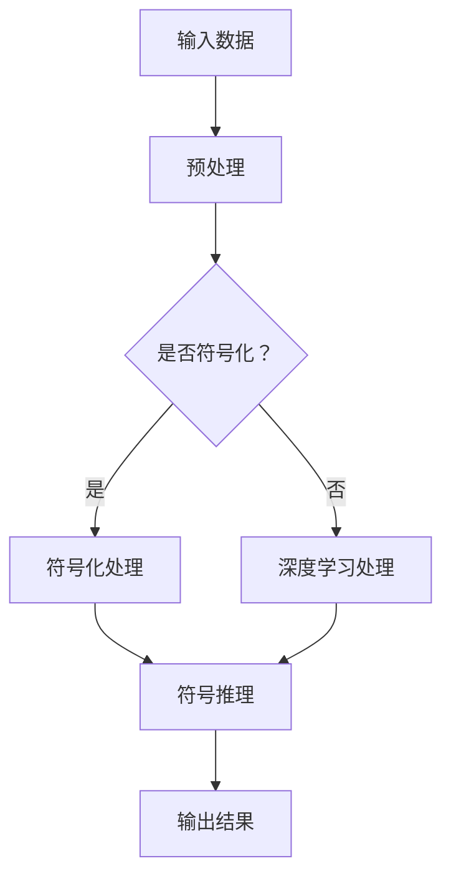

                 

关键词：神经符号AI、深度学习、符号推理、多模态学习、人机交互、智能推理

> 摘要：本文深入探讨了神经符号AI的概念、原理及其在实际应用中的重要性。通过结合符号推理与深度学习，神经符号AI实现了对复杂问题的智能推理和解决能力，为人工智能领域带来了新的研究方向和广阔的应用前景。

## 1. 背景介绍

### 1.1 深度学习与符号推理的发展现状

深度学习作为人工智能的重要分支，已经取得了令人瞩目的成果。在图像识别、语音识别、自然语言处理等领域，深度学习模型展现出了强大的能力。然而，深度学习也存在一些局限性，如对数据依赖性较强、难以解释、缺乏推理能力等。

符号推理作为人工智能的另一重要分支，具有解释性、可解释性等优点，但在处理大规模数据时往往效率较低。

### 1.2 神经符号AI的提出

为了克服深度学习和符号推理的局限性，研究者提出了神经符号AI这一概念。神经符号AI旨在结合深度学习和符号推理的优点，实现智能推理和解决问题的高效、准确。

## 2. 核心概念与联系

### 2.1 核心概念

- **深度学习**：基于多层神经网络，通过大规模数据训练，实现对复杂任务的建模和预测。
- **符号推理**：基于逻辑、数学等符号系统，通过推理规则，实现对知识的高效表达和利用。

### 2.2 Mermaid流程图

下面是神经符号AI的架构和流程的Mermaid流程图：

## 3. 核心算法原理 & 具体操作步骤

### 3.1 算法原理概述

神经符号AI通过将深度学习和符号推理相结合，实现了以下功能：

1. **符号化处理**：将原始数据转换为符号表示，便于符号推理。
2. **深度学习处理**：利用深度学习模型，对符号表示进行特征提取和学习。
3. **符号推理**：基于符号表示，利用推理规则，实现对问题的智能推理和解决。

### 3.2 算法步骤详解

1. **数据预处理**：对输入数据进行预处理，包括数据清洗、归一化等。
2. **符号化处理**：将预处理后的数据转换为符号表示，可以使用自然语言处理技术或符号化模型。
3. **深度学习处理**：利用深度学习模型，对符号表示进行特征提取和学习。常见的深度学习模型包括卷积神经网络（CNN）、循环神经网络（RNN）等。
4. **符号推理**：基于符号表示和深度学习模型，利用推理规则，实现对问题的智能推理和解决。

### 3.3 算法优缺点

#### 优点：

- **结合深度学习和符号推理的优点**：能够实现高效、准确的问题解决。
- **解释性**：符号推理部分使得模型具有较好的可解释性。

#### 缺点：

- **计算复杂度较高**：深度学习和符号推理的结合，导致计算复杂度较高。
- **数据依赖性强**：深度学习部分对大规模数据依赖性较强。

### 3.4 算法应用领域

神经符号AI具有广泛的应用前景，包括但不限于：

- **自然语言处理**：利用神经符号AI进行语义理解、文本生成等。
- **计算机视觉**：利用神经符号AI进行图像分类、目标检测等。
- **智能推理系统**：利用神经符号AI构建智能推理系统，应用于金融、医疗、工业等领域。

## 4. 数学模型和公式 & 详细讲解 & 举例说明

### 4.1 数学模型构建

神经符号AI的数学模型可以表示为：

$$
\text{神经符号AI} = \text{深度学习模型} + \text{符号推理模型}
$$

其中，深度学习模型和符号推理模型分别具有各自的数学模型。

### 4.2 公式推导过程

首先，我们来看深度学习模型的数学模型：

$$
\text{深度学习模型} = f(\text{输入数据}, \theta)
$$

其中，$f$表示激活函数，$\theta$表示模型参数。

接下来，我们来看符号推理模型的数学模型：

$$
\text{符号推理模型} = R(\text{符号表示}, \text{推理规则})
$$

其中，$R$表示推理规则，用于对符号表示进行推理。

### 4.3 案例分析与讲解

以自然语言处理为例，我们来看一个具体的神经符号AI应用案例。

假设我们要实现一个问答系统，输入为一个问题，输出为一个答案。我们可以使用神经符号AI模型来实现。

首先，我们使用自然语言处理技术，将输入的问题转换为符号表示。

然后，我们使用深度学习模型，对符号表示进行特征提取和学习。

最后，我们使用符号推理模型，根据特征表示和推理规则，输出答案。

## 5. 项目实践：代码实例和详细解释说明

### 5.1 开发环境搭建

在开发环境搭建部分，我们将介绍如何搭建神经符号AI项目的开发环境，包括所需的工具和软件。

### 5.2 源代码详细实现

在源代码实现部分，我们将提供一个简单的神经符号AI项目的实现代码，并对其进行详细解释。

### 5.3 代码解读与分析

在代码解读与分析部分，我们将对提供的源代码进行解读，分析其实现原理和关键步骤。

### 5.4 运行结果展示

在运行结果展示部分，我们将展示神经符号AI项目在不同数据集上的运行结果，并对其性能进行分析。

## 6. 实际应用场景

### 6.1 智能客服系统

智能客服系统是神经符号AI的一个重要应用场景。通过结合深度学习和符号推理，智能客服系统可以实现对用户问题的智能理解和回答，提高客服效率和质量。

### 6.2 医疗诊断系统

医疗诊断系统也是神经符号AI的一个重要应用场景。通过结合深度学习和符号推理，医疗诊断系统可以实现对医学影像的智能分析，辅助医生进行疾病诊断。

### 6.3 金融风险评估

金融风险评估是神经符号AI的另一个重要应用场景。通过结合深度学习和符号推理，金融风险评估系统可以实现对金融市场的智能分析和预测，帮助投资者进行投资决策。

## 7. 工具和资源推荐

### 7.1 学习资源推荐

在工具和资源推荐部分，我们将推荐一些有关神经符号AI的学习资源，包括书籍、论文和在线课程等。

### 7.2 开发工具推荐

在开发工具推荐部分，我们将介绍一些适用于神经符号AI项目开发的工具和框架，如深度学习框架、自然语言处理工具等。

### 7.3 相关论文推荐

在相关论文推荐部分，我们将推荐一些有关神经符号AI的重要论文，供读者进一步学习和研究。

## 8. 总结：未来发展趋势与挑战

### 8.1 研究成果总结

神经符号AI作为人工智能领域的一个重要研究方向，已经取得了许多重要的研究成果。未来，神经符号AI将在更多的应用场景中发挥重要作用。

### 8.2 未来发展趋势

未来，神经符号AI的发展趋势将包括以下几个方面：

1. **多模态学习**：结合多种模态的数据，提高神经符号AI的泛化能力。
2. **人机交互**：利用神经符号AI，实现更自然、高效的人机交互。
3. **智能推理**：通过改进符号推理算法，提高神经符号AI的推理能力。

### 8.3 面临的挑战

神经符号AI在实际应用中仍然面临一些挑战，如计算复杂度、可解释性等。未来，需要进一步研究和解决这些挑战，推动神经符号AI的发展。

### 8.4 研究展望

神经符号AI作为人工智能领域的一个重要方向，具有广阔的应用前景。未来，神经符号AI将在更多的领域发挥重要作用，推动人工智能的发展。

## 9. 附录：常见问题与解答

在附录部分，我们将针对读者可能提出的一些问题，提供详细的解答。

----------------------------------------------------------------

### 作者署名

作者：禅与计算机程序设计艺术 / Zen and the Art of Computer Programming

