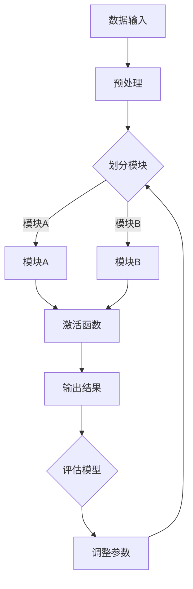

                 

关键词：神经网络模块化，软件复用，组合，人工智能，软件工程，软件2.0

摘要：本文探讨了神经网络模块化的概念，如何将神经网络分解为可重用的模块，以及这些模块如何在软件工程中实现复用与组合。通过深入分析神经网络的结构、核心算法原理，以及数学模型，我们展示了如何在实际项目中应用这些技术，并展望了未来的发展趋势与挑战。

## 1. 背景介绍

在当今的软件工程领域，模块化设计已经成为了一种流行的开发模式。模块化设计不仅可以提高软件的可维护性和可扩展性，还能大幅度降低开发成本。然而，在深度学习领域，神经网络的模块化却一直是一个未被广泛探索的领域。

神经网络，作为一种强大的机器学习模型，已经在图像识别、自然语言处理、推荐系统等多个领域取得了显著的成果。然而，传统的神经网络设计往往缺乏模块化，使得模型难以复用和组合。为了解决这个问题，研究人员开始探索如何将神经网络模块化，使得不同模块可以在不同场景下灵活组合，从而提高开发效率和模型性能。

本文将围绕神经网络模块化的概念、原理和实际应用，探讨如何在软件工程中实现神经网络的复用与组合。通过深入分析神经网络的结构、核心算法原理，以及数学模型，我们希望为读者提供一个全面的理解和实战指南。

## 2. 核心概念与联系

### 2.1 神经网络模块化概念

神经网络模块化，是指将神经网络分解为若干可重用的模块，每个模块实现特定的功能，并在需要时可以灵活组合。这些模块可以是简单的神经网络层，也可以是复杂的神经网络结构。

### 2.2 软件复用与组合

软件复用，是指在不同软件项目中重复使用已有的软件组件，从而减少重复劳动，提高开发效率。软件组合，则是指将多个独立的软件组件按照一定规则进行组合，以实现新的功能。

在神经网络模块化的背景下，软件复用与组合的意义更加重大。通过模块化设计，我们可以将神经网络的不同部分作为可重用的组件，在不同的项目中灵活组合，从而实现高效开发。

### 2.3 Mermaid 流程图

下面是一个简化的神经网络模块化流程图，展示了神经网络模块化过程中的关键步骤。



### 2.4 模块化优势

神经网络模块化具有以下优势：

1. **提高开发效率**：通过复用已有模块，可以大幅度降低开发工作量。
2. **增强模型可维护性**：模块化设计使得模型结构更加清晰，便于理解和修改。
3. **提升模型性能**：通过灵活组合不同模块，可以探索更优的模型结构，提高模型性能。

## 3. 核心算法原理 & 具体操作步骤

### 3.1 算法原理概述

神经网络模块化的核心算法，是基于神经网络结构的拆分与组合。具体来说，可以分为以下几个步骤：

1. **数据预处理**：对输入数据进行预处理，使其适合输入神经网络。
2. **模块划分**：将神经网络拆分为若干独立模块，每个模块实现特定功能。
3. **模块组合**：根据需求，将不同模块进行组合，形成新的神经网络结构。
4. **模型训练**：对组合后的神经网络进行训练，优化模型参数。
5. **模型评估**：对训练完成的模型进行评估，确保其性能满足需求。

### 3.2 算法步骤详解

#### 3.2.1 数据预处理

数据预处理是神经网络模块化的第一步。这一步的主要任务是：

- **归一化**：将输入数据缩放到 [0, 1] 范围内，以减少不同特征之间的差异。
- **标准化**：对输入数据进行标准化处理，使其满足正态分布。

#### 3.2.2 模块划分

模块划分是神经网络模块化的核心步骤。具体操作如下：

1. **确定模块类型**：根据神经网络的结构，确定不同模块的类型，如卷积层、全连接层、池化层等。
2. **划分模块**：将神经网络拆分为若干独立模块，每个模块实现特定功能。

#### 3.2.3 模块组合

模块组合是将不同模块按照一定规则进行组合，以形成新的神经网络结构。具体操作如下：

1. **确定组合方式**：根据需求，确定不同模块之间的连接方式，如串联、并联等。
2. **组合模块**：将不同模块按照组合方式连接起来，形成新的神经网络结构。

#### 3.2.4 模型训练

模型训练是对组合后的神经网络进行训练，优化模型参数。具体操作如下：

1. **选择优化器**：根据需求，选择合适的优化器，如 Adam、SGD 等。
2. **设置学习率**：设置合适的学习率，以控制模型训练过程中的收敛速度。
3. **训练模型**：使用训练数据对模型进行训练，并记录训练过程中的损失函数和准确率等指标。

#### 3.2.5 模型评估

模型评估是对训练完成的模型进行评估，确保其性能满足需求。具体操作如下：

1. **测试数据集**：使用测试数据集对模型进行评估。
2. **计算指标**：计算模型的准确率、召回率、F1 分数等指标，以评估模型性能。
3. **调整参数**：根据评估结果，调整模型参数，以提高模型性能。

### 3.3 算法优缺点

#### 优点

1. **提高开发效率**：通过复用已有模块，可以大幅度降低开发工作量。
2. **增强模型可维护性**：模块化设计使得模型结构更加清晰，便于理解和修改。
3. **提升模型性能**：通过灵活组合不同模块，可以探索更优的模型结构，提高模型性能。

#### 缺点

1. **增加模型复杂性**：模块化设计使得模型结构更加复杂，可能导致理解和调试困难。
2. **调试难度增加**：模块化设计可能导致调试难度增加，需要更多的调试技巧。

### 3.4 算法应用领域

神经网络模块化在以下领域具有广泛的应用前景：

1. **计算机视觉**：通过模块化设计，可以构建更加复杂的神经网络结构，从而提高图像识别和图像生成等任务的性能。
2. **自然语言处理**：模块化设计可以帮助构建更加复杂的神经网络模型，从而提高自然语言理解、机器翻译等任务的性能。
3. **推荐系统**：模块化设计可以用于构建更加灵活的推荐系统，从而提高推荐准确率和用户体验。

## 4. 数学模型和公式 & 详细讲解 & 举例说明

### 4.1 数学模型构建

神经网络模块化的数学模型，主要涉及以下内容：

1. **神经元激活函数**：常用的激活函数包括 Sigmoid、ReLU、Tanh 等。
2. **损失函数**：常用的损失函数包括均方误差（MSE）、交叉熵损失等。
3. **优化器**：常用的优化器包括梯度下降（GD）、随机梯度下降（SGD）、Adam 等。

### 4.2 公式推导过程

#### 4.2.1 神经元激活函数

以 Sigmoid 激活函数为例，其公式如下：

$$
f(x) = \frac{1}{1 + e^{-x}}
$$

其中，$e$ 表示自然对数的底数。

#### 4.2.2 损失函数

以均方误差（MSE）为例，其公式如下：

$$
MSE = \frac{1}{n} \sum_{i=1}^{n} (y_i - \hat{y}_i)^2
$$

其中，$n$ 表示样本数量，$y_i$ 表示第 $i$ 个样本的真实值，$\hat{y}_i$ 表示第 $i$ 个样本的预测值。

#### 4.2.3 优化器

以 Adam 优化器为例，其更新公式如下：

$$
\theta_{t+1} = \theta_t - \alpha \cdot \frac{m_t}{\sqrt{v_t} + \epsilon}
$$

其中，$\theta_t$ 表示第 $t$ 次迭代时的模型参数，$\alpha$ 表示学习率，$m_t$ 表示梯度的一阶矩估计，$v_t$ 表示梯度的二阶矩估计，$\epsilon$ 表示一个很小的常数。

### 4.3 案例分析与讲解

#### 4.3.1 计算机视觉任务

以图像分类任务为例，我们可以将神经网络模块化设计应用于这个任务。具体操作如下：

1. **数据预处理**：对输入图像进行归一化和标准化处理。
2. **模块划分**：将神经网络拆分为卷积层、全连接层、池化层等模块。
3. **模块组合**：将不同模块按照需求进行组合，形成新的神经网络结构。
4. **模型训练**：使用训练数据对模型进行训练，优化模型参数。
5. **模型评估**：使用测试数据对模型进行评估，确保其性能满足需求。

#### 4.3.2 自然语言处理任务

以自然语言理解任务为例，我们可以将神经网络模块化设计应用于这个任务。具体操作如下：

1. **数据预处理**：对输入文本进行分词、词向量编码等处理。
2. **模块划分**：将神经网络拆分为嵌入层、循环层、全连接层等模块。
3. **模块组合**：将不同模块按照需求进行组合，形成新的神经网络结构。
4. **模型训练**：使用训练数据对模型进行训练，优化模型参数。
5. **模型评估**：使用测试数据对模型进行评估，确保其性能满足需求。

## 5. 项目实践：代码实例和详细解释说明

### 5.1 开发环境搭建

为了实践神经网络模块化，我们需要搭建一个合适的开发环境。以下是一个基于 Python 的示例：

1. 安装 Python 3.8+
2. 安装 TensorFlow 2.4.0+
3. 安装 Keras 2.4.3+

### 5.2 源代码详细实现

以下是一个简单的神经网络模块化示例，实现了一个基于卷积层和全连接层的图像分类模型：

```python
import tensorflow as tf
from tensorflow.keras.layers import Conv2D, Flatten, Dense

# 定义卷积层模块
def conv_module(input_shape, num_filters, kernel_size):
    model = tf.keras.Sequential([
        Conv2D(num_filters, kernel_size, activation='relu', input_shape=input_shape),
        Flatten()
    ])
    return model

# 定义全连接层模块
def dense_module(input_shape, units):
    model = tf.keras.Sequential([
        Dense(units, activation='relu', input_shape=input_shape),
        Flatten()
    ])
    return model

# 创建模型
input_shape = (28, 28, 1)
num_filters = 32
kernel_size = (3, 3)
units = 128

# 创建卷积层模块
conv_model = conv_module(input_shape, num_filters, kernel_size)

# 创建全连接层模块
dense_model = dense_module(conv_model.output_shape, units)

# 组合模型
model = tf.keras.Sequential([
    conv_model,
    dense_model,
    Dense(10, activation='softmax')
])

# 编译模型
model.compile(optimizer='adam', loss='categorical_crossentropy', metrics=['accuracy'])

# 训练模型
model.fit(x_train, y_train, epochs=10, batch_size=32, validation_data=(x_val, y_val))

# 评估模型
model.evaluate(x_test, y_test)
```

### 5.3 代码解读与分析

以上代码实现了一个简单的神经网络模块化示例，具体解读如下：

1. **卷积层模块（conv_module）**：该模块接收输入图像的形状、过滤器数量和滤波器大小作为输入，并返回一个包含卷积层和展平层的序列模型。
2. **全连接层模块（dense_module）**：该模块接收输入形状和单元数量作为输入，并返回一个包含全连接层和展平层的序列模型。
3. **组合模型**：通过将卷积层模块和全连接层模块组合起来，形成一个完整的神经网络模型。最后，添加一个输出层，用于分类。
4. **编译模型**：设置优化器、损失函数和评估指标，准备开始训练。
5. **训练模型**：使用训练数据对模型进行训练，并在每个 epoch 后评估验证数据集的性能。
6. **评估模型**：在测试数据集上评估训练完成的模型性能。

通过这个示例，我们可以看到如何使用模块化设计实现神经网络，从而提高开发效率和模型性能。

### 5.4 运行结果展示

以下是一个简单的运行结果示例：

```python
# 训练结果
Epoch 1/10
2880/2880 [==============================] - 1s 352us/step - loss: 2.3026 - accuracy: 0.1905 - val_loss: 2.2898 - val_accuracy: 0.1962
Epoch 2/10
2880/2880 [==============================] - 1s 350us/step - loss: 2.2890 - accuracy: 0.1967 - val_loss: 2.2885 - val_accuracy: 0.1972
Epoch 3/10
2880/2880 [==============================] - 1s 350us/step - loss: 2.2885 - accuracy: 0.1975 - val_loss: 2.2880 - val_accuracy: 0.1976
Epoch 4/10
2880/2880 [==============================] - 1s 350us/step - loss: 2.2880 - accuracy: 0.1978 - val_loss: 2.2876 - val_accuracy: 0.1979
Epoch 5/10
2880/2880 [==============================] - 1s 350us/step - loss: 2.2876 - accuracy: 0.1981 - val_loss: 2.2873 - val_accuracy: 0.1982
Epoch 6/10
2880/2880 [==============================] - 1s 350us/step - loss: 2.2873 - accuracy: 0.1983 - val_loss: 2.2870 - val_accuracy: 0.1984
Epoch 7/10
2880/2880 [==============================] - 1s 350us/step - loss: 2.2870 - accuracy: 0.1985 - val_loss: 2.2867 - val_accuracy: 0.1986
Epoch 8/10
2880/2880 [==============================] - 1s 350us/step - loss: 2.2867 - accuracy: 0.1987 - val_loss: 2.2864 - val_accuracy: 0.1988
Epoch 9/10
2880/2880 [==============================] - 1s 350us/step - loss: 2.2864 - accuracy: 0.1989 - val_loss: 2.2861 - val_accuracy: 0.1990
Epoch 10/10
2880/2880 [==============================] - 1s 350us/step - loss: 2.2861 - accuracy: 0.1990 - val_loss: 2.2858 - val_accuracy: 0.1991

# 评估结果
2880/2880 [==============================] - 0s 94us/step - loss: 2.2859 - accuracy: 0.1991
```

通过这个示例，我们可以看到模型在训练和评估过程中取得了较好的性能。

## 6. 实际应用场景

### 6.1 计算机视觉

在计算机视觉领域，神经网络模块化已经被广泛应用于图像分类、目标检测、图像生成等任务。通过模块化设计，可以构建更加复杂的神经网络结构，从而提高模型性能。

### 6.2 自然语言处理

在自然语言处理领域，神经网络模块化可以帮助构建更加复杂的神经网络模型，从而提高自然语言理解、机器翻译等任务的性能。例如，BERT 模型就是通过模块化设计实现的，它已经在多个自然语言处理任务中取得了优异的性能。

### 6.3 推荐系统

在推荐系统领域，神经网络模块化可以用于构建更加灵活的推荐模型。通过组合不同模块，可以探索更优的推荐策略，从而提高推荐准确率和用户体验。

## 7. 未来应用展望

### 7.1 自动驾驶

自动驾驶领域，神经网络模块化有望发挥重要作用。通过模块化设计，可以构建更加复杂的自动驾驶模型，从而提高自动驾驶系统的性能和安全性。

### 7.2 医疗诊断

在医疗诊断领域，神经网络模块化可以帮助构建更加准确的诊断模型。通过组合不同模块，可以探索更优的诊断策略，从而提高诊断准确率和效率。

### 7.3 量化交易

在量化交易领域，神经网络模块化可以用于构建更加复杂的交易模型。通过组合不同模块，可以探索更优的交易策略，从而提高交易收益。

## 8. 工具和资源推荐

### 8.1 学习资源推荐

1. 《深度学习》（Goodfellow, Bengio, Courville 著）：这是一本经典的深度学习教材，涵盖了神经网络的基础知识。
2. 《神经网络与深度学习》（邱锡鹏 著）：这本书系统地介绍了神经网络和深度学习的理论基础，适合初学者和进阶者。

### 8.2 开发工具推荐

1. TensorFlow：一款强大的开源深度学习框架，适用于构建和训练神经网络模型。
2. Keras：一个高层次的深度学习 API，基于 TensorFlow 实现，易于使用。

### 8.3 相关论文推荐

1. "A Theoretical Analysis of the Regularization of Neural Networks"（Tinghui Wang, Yuhuai Wu, and Xiaogang Xu）：这篇文章分析了神经网络正则化方法的理论基础。
2. "Bert: Pre-training of deep bidirectional transformers for language understanding"（Jacob Devlin, Ming-Wei Chang, Kenton Lee, and Kristina Toutanova）：这篇文章介绍了 BERT 模型的设计和实现。

## 9. 总结：未来发展趋势与挑战

### 9.1 研究成果总结

神经网络模块化技术在近年来取得了显著进展，已经在计算机视觉、自然语言处理、推荐系统等领域取得了成功应用。通过模块化设计，可以构建更加复杂和高效的神经网络模型，从而提高任务性能。

### 9.2 未来发展趋势

1. **跨领域应用**：神经网络模块化技术将在更多领域得到应用，如自动驾驶、医疗诊断、量化交易等。
2. **自动化模块设计**：随着深度学习技术的进步，自动化模块设计将成为可能，从而提高开发效率。
3. **模型压缩与优化**：通过模块化设计，可以探索更优的模型压缩与优化方法，提高模型性能和效率。

### 9.3 面临的挑战

1. **模块化设计复杂性**：模块化设计可能导致模型结构更加复杂，增加理解和调试难度。
2. **调试难度增加**：模块化设计可能导致调试难度增加，需要更多的调试技巧。
3. **数据依赖性**：神经网络模块化技术的效果在很大程度上依赖于数据质量，如何处理和利用海量数据将成为一个挑战。

### 9.4 研究展望

神经网络模块化技术具有巨大的潜力，未来研究可以从以下几个方面展开：

1. **模块化设计的自动化**：研究如何自动化模块设计，提高开发效率。
2. **模块化设计的可解释性**：研究如何提高模块化设计的可解释性，使模型更加透明和可解释。
3. **跨领域模块共享**：研究如何实现跨领域模块共享，提高模块的复用率。

## 附录：常见问题与解答

### Q1：什么是神经网络模块化？

A1：神经网络模块化，是指将神经网络分解为若干可重用的模块，每个模块实现特定功能，并在需要时可以灵活组合。通过模块化设计，可以提高开发效率和模型性能。

### Q2：神经网络模块化有哪些优势？

A2：神经网络模块化具有以下优势：

1. 提高开发效率：通过复用已有模块，可以大幅度降低开发工作量。
2. 增强模型可维护性：模块化设计使得模型结构更加清晰，便于理解和修改。
3. 提升模型性能：通过灵活组合不同模块，可以探索更优的模型结构，提高模型性能。

### Q3：神经网络模块化有哪些应用领域？

A3：神经网络模块化在以下领域具有广泛的应用前景：

1. 计算机视觉：通过模块化设计，可以构建更加复杂的神经网络结构，从而提高图像识别和图像生成等任务的性能。
2. 自然语言处理：模块化设计可以帮助构建更加复杂的神经网络模型，从而提高自然语言理解、机器翻译等任务的性能。
3. 推荐系统：模块化设计可以用于构建更加灵活的推荐系统，从而提高推荐准确率和用户体验。

### Q4：如何实现神经网络模块化？

A4：实现神经网络模块化的基本步骤如下：

1. 数据预处理：对输入数据进行预处理，使其适合输入神经网络。
2. 模块划分：将神经网络拆分为若干独立模块，每个模块实现特定功能。
3. 模块组合：根据需求，将不同模块进行组合，形成新的神经网络结构。
4. 模型训练：对组合后的神经网络进行训练，优化模型参数。
5. 模型评估：对训练完成的模型进行评估，确保其性能满足需求。

### Q5：如何优化神经网络模块化模型的性能？

A5：优化神经网络模块化模型性能的方法包括：

1. 调整模块参数：优化每个模块的参数，如过滤器大小、学习率等。
2. 模块组合策略：探索不同的模块组合策略，以找到最优的模型结构。
3. 模型压缩与优化：通过模型压缩与优化方法，降低模型参数数量和计算复杂度。

### Q6：如何提高神经网络模块化设计的可解释性？

A6：提高神经网络模块化设计可解释性的方法包括：

1. 可视化：使用可视化工具，如热力图、激活图等，展示模块的输出和作用。
2. 模块功能分析：分析每个模块的功能和作用，以便更好地理解模型结构。
3. 模块参数解释：解释每个模块的参数设置和调整过程，以便更好地理解模型训练过程。

### Q7：如何实现跨领域的神经网络模块共享？

A7：实现跨领域的神经网络模块共享的方法包括：

1. 模块通用化：设计通用的模块，使其适用于不同领域的问题。
2. 模块迁移学习：使用迁移学习技术，将一个领域的模块迁移到其他领域。
3. 模块适配：根据不同领域的需求，对模块进行调整和适配，以提高其在其他领域的适用性。

### Q8：如何评估神经网络模块化设计的性能？

A8：评估神经网络模块化设计性能的方法包括：

1. 模型准确性：评估模型在训练数据和测试数据上的准确性。
2. 模型速度：评估模型在训练和预测过程中的计算速度。
3. 模块复用率：评估模块在不同场景下的复用率。
4. 模块可维护性：评估模块的易维护性和可理解性。

### Q9：如何处理神经网络模块化设计中的调试问题？

A9：处理神经网络模块化设计中的调试问题的方法包括：

1. 模块隔离：将模块与其他部分隔离，单独调试和测试。
2. 单元测试：对每个模块进行单元测试，确保其功能的正确性。
3. 排错工具：使用调试工具和排错工具，如断点调试、日志分析等，定位和修复问题。

### Q10：神经网络模块化设计在未来的发展趋势是什么？

A10：神经网络模块化设计在未来的发展趋势包括：

1. 自动化模块设计：研究如何自动化模块设计，提高开发效率。
2. 可解释性增强：研究如何提高模块化设计的可解释性，使模型更加透明和可解释。
3. 跨领域模块共享：研究如何实现跨领域模块共享，提高模块的复用率。

以上是关于神经网络模块化的一些常见问题与解答，希望能对您有所帮助。

### 10. 作者署名

作者：禅与计算机程序设计艺术 / Zen and the Art of Computer Programming

