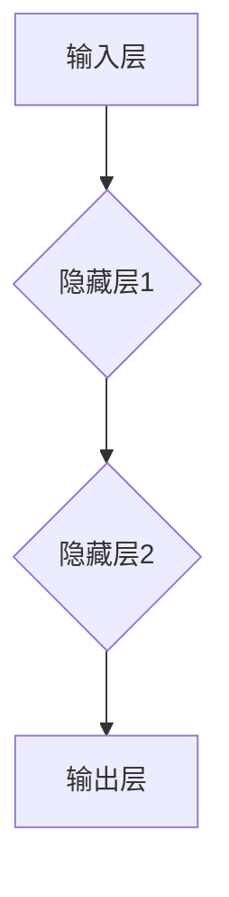
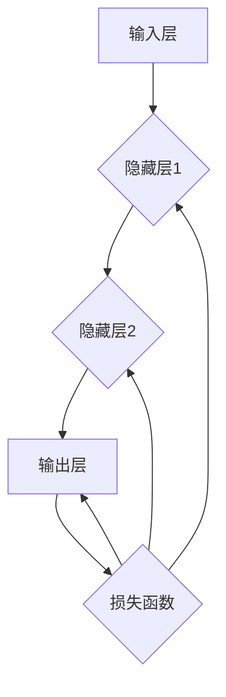

                 

关键词：神经网络、深度学习、机器学习、算法、数学模型、代码实例

摘要：本文将深入探讨神经网络的原理，包括其核心概念、算法原理、数学模型以及代码实例。通过详细的讲解和案例分析，读者将能够更好地理解神经网络的工作机制，掌握其应用领域，并能够实际操作构建简单的神经网络模型。

## 1. 背景介绍

神经网络（Neural Networks）是深度学习（Deep Learning）的核心技术之一，源于对生物神经系统的模仿。自从1986年首次提出反向传播算法（Backpropagation Algorithm）以来，神经网络的研究和应用迅速发展。它们在图像识别、语音识别、自然语言处理等领域取得了显著的成果。随着计算能力的提升和数据量的爆炸性增长，神经网络在人工智能领域的重要性日益凸显。

本文旨在提供一个全面而深入的神经网络讲解，帮助读者从基础概念到实际操作都有所了解。文章将分为以下几个部分：

1. 背景介绍：简要介绍神经网络的历史和现状。
2. 核心概念与联系：解释神经网络的基本组成部分和它们之间的联系。
3. 核心算法原理 & 具体操作步骤：详细介绍神经网络的核心算法，包括前向传播、反向传播和优化算法。
4. 数学模型和公式 & 详细讲解 & 举例说明：讨论神经网络的数学基础，包括激活函数、权重更新公式等。
5. 项目实践：提供代码实例，详细解释如何使用Python和TensorFlow框架实现神经网络。
6. 实际应用场景：探讨神经网络的广泛应用领域。
7. 工具和资源推荐：推荐学习资源和开发工具。
8. 总结：展望神经网络在未来发展中的趋势和挑战。

### 1.1 神经网络的历史

神经网络的概念最早可以追溯到1943年，由心理学家McCulloch和数学家Pitts提出。他们提出了人工神经元模型，称为“McCulloch-Pitts神经元”。随后，1958年，Frank Rosenblatt提出了感知机（Perceptron）模型，这是一种简单的神经网络结构，主要用于二分类问题。

20世纪80年代，反向传播算法的提出使得多层神经网络的学习成为可能。这一算法的发明标志着神经网络研究的重大突破。然而，由于计算能力的限制，神经网络的研究和应用在之后的一段时间内进展缓慢。

进入21世纪，随着计算能力的迅速提升和大数据时代的到来，神经网络的研究和应用迎来了新的高潮。深度学习（Deep Learning）概念的提出进一步推动了神经网络的发展，特别是在图像识别、语音识别、自然语言处理等领域取得了巨大的成功。

### 1.2 神经网络的应用现状

神经网络的应用场景非常广泛，已经深入到了许多领域：

- **图像识别**：神经网络在图像分类和目标检测方面表现出色，例如在人脸识别、车辆识别等应用中。
- **语音识别**：神经网络被广泛应用于语音信号的处理和识别，使得语音助手和自动翻译系统变得更加智能。
- **自然语言处理**：神经网络在文本分类、情感分析、机器翻译等领域发挥了重要作用。
- **医疗诊断**：神经网络在医学图像分析、疾病预测等方面有潜在的应用价值。
- **金融分析**：神经网络被用于股票市场预测、风险评估等金融领域的分析。

随着技术的不断进步，神经网络的性能和应用范围仍在不断扩大，未来将有更多的领域受益于这一强大的技术。

## 2. 核心概念与联系

在深入探讨神经网络的工作原理之前，我们需要了解其核心概念和组成部分。神经网络主要由以下几个部分构成：

- **神经元（Neurons）**：神经网络的基本构建块，类似于生物神经元的简化模型。
- **层（Layers）**：神经网络中的层次结构，包括输入层、隐藏层和输出层。
- **权重（Weights）**：神经元之间的连接强度，用于调整信号的传递。
- **偏置（Bias）**：用于调整神经元的激活状态。
- **激活函数（Activation Function）**：用于确定神经元是否被激活。

### 2.1 神经元与层

神经元是神经网络的核心组成部分。一个简单的神经元模型可以表示为：

$$
y = \sigma(\sum_{i=1}^{n} w_i x_i + b)
$$

其中，$y$ 是神经元的输出，$x_i$ 是第 $i$ 个输入，$w_i$ 是第 $i$ 个输入的权重，$b$ 是偏置，$\sigma$ 是激活函数。

神经网络由多个层组成，每层由多个神经元组成。输入层接收外部输入信号，隐藏层对输入信号进行加工和处理，输出层生成最终的输出结果。常见的神经网络结构包括单层感知机、多层感知机和卷积神经网络（CNN）等。

### 2.2 权重与偏置

权重和偏置是神经网络中非常重要的参数。权重决定了神经元之间连接的强度，而偏置用于调整神经元的激活状态。在训练过程中，通过反向传播算法不断调整权重和偏置，以优化神经网络的表现。

### 2.3 激活函数

激活函数是神经网络中的关键组件，它用于确定神经元是否被激活。常见的激活函数包括 sigmoid 函数、ReLU 函数和 tanh 函数。这些函数的选择会影响神经网络的学习性能和收敛速度。

### 2.4 Mermaid 流程图

为了更直观地展示神经网络的组成和结构，我们可以使用 Mermaid 流程图来表示。以下是一个简单的 Mermaid 图：



在这个图中，A 表示输入层，B 和 C 表示隐藏层，D 表示输出层。每个节点代表一层，节点之间的连接表示神经元之间的连接。

## 3. 核心算法原理 & 具体操作步骤

神经网络的核心算法包括前向传播、反向传播和优化算法。这些算法共同工作，使神经网络能够学习和优化其参数，从而提高预测能力。

### 3.1 前向传播

前向传播是神经网络处理输入数据的过程。输入数据经过输入层，然后逐层传递到隐藏层，最终输出结果。在前向传播过程中，每个神经元的输出值可以通过以下公式计算：

$$
a_{j}^{(l)} = \sigma \left( \sum_{i} w_{ji}^{(l)} a_{i}^{(l-1)} + b_{j}^{(l)} \right)
$$

其中，$a_{j}^{(l)}$ 表示第 $l$ 层第 $j$ 个神经元的输出，$w_{ji}^{(l)}$ 是连接第 $l-1$ 层第 $i$ 个神经元和第 $l$ 层第 $j$ 个神经元的权重，$b_{j}^{(l)}$ 是第 $l$ 层第 $j$ 个神经元的偏置，$\sigma$ 是激活函数。

### 3.2 反向传播

反向传播是神经网络训练过程中最核心的算法。它通过计算网络输出与实际输出之间的差异，不断调整权重和偏置，以优化网络表现。反向传播分为以下几个步骤：

1. **计算误差**：计算网络输出和实际输出之间的差异，即损失函数。
2. **计算梯度**：对于每个神经元，计算权重和偏置的梯度。
3. **更新参数**：使用梯度下降或其他优化算法更新权重和偏置。

以下是一个简化的反向传播算法流程：



在这个图中，每个节点代表一个操作，边表示数据流和参数更新。

### 3.3 优化算法

优化算法用于调整神经网络中的权重和偏置，以最小化损失函数。常见的优化算法包括梯度下降、随机梯度下降和Adam优化器等。

- **梯度下降**：通过计算损失函数关于参数的梯度，以确定参数的更新方向。其公式为：

  $$
  \theta = \theta - \alpha \cdot \nabla_\theta J(\theta)
  $$

  其中，$\theta$ 是参数，$\alpha$ 是学习率，$J(\theta)$ 是损失函数。

- **随机梯度下降**：在梯度下降的基础上，对每个样本随机选择一个子集，计算子集的平均梯度，然后更新参数。

- **Adam优化器**：结合了随机梯度下降和动量项，能够更好地处理稀疏数据和异方差性。

### 3.4 算法优缺点

- **优点**：
  - **强大的泛化能力**：神经网络可以处理各种复杂问题，具有很高的泛化能力。
  - **自适应学习**：通过调整权重和偏置，神经网络能够自适应地学习不同类型的数据特征。
  - **并行计算**：神经网络可以并行处理大量数据，提高计算效率。

- **缺点**：
  - **过拟合**：神经网络可能对训练数据过度拟合，导致在未知数据上的表现不佳。
  - **计算成本高**：神经网络训练过程需要大量的计算资源，特别是在大型数据集和多层网络中。
  - **参数调优复杂**：神经网络参数调优复杂，需要大量实验和经验。

### 3.5 算法应用领域

神经网络的应用领域非常广泛，主要包括以下方面：

- **图像识别与分类**：如人脸识别、物体识别、医学图像分析等。
- **语音识别与合成**：如语音助手、自动字幕生成等。
- **自然语言处理**：如文本分类、情感分析、机器翻译等。
- **推荐系统**：如商品推荐、音乐推荐等。
- **强化学习**：如游戏AI、机器人控制等。

## 4. 数学模型和公式 & 详细讲解 & 举例说明

神经网络的设计和实现离不开数学模型的支撑。本节将详细讲解神经网络的数学模型，包括激活函数、权重更新公式和损失函数等。

### 4.1 激活函数

激活函数是神经网络中至关重要的一环，它决定了神经元的激活状态。常见的激活函数包括 sigmoid 函数、ReLU 函数和 tanh 函数。

- **sigmoid 函数**：

  $$
  \sigma(x) = \frac{1}{1 + e^{-x}}
  $$

  sigmoid 函数在神经网络中常用于输出层，以得到概率分布。

- **ReLU 函数**：

  $$
  \sigma(x) = \max(0, x)
  $$

  ReLU 函数由于其简单性和计算效率高，常用于隐藏层。

- **tanh 函数**：

  $$
  \sigma(x) = \frac{e^x - e^{-x}}{e^x + e^{-x}}
  $$

  tanh 函数类似于 sigmoid 函数，但输出范围在 [-1, 1] 之间，常用于隐藏层。

### 4.2 权重更新公式

在神经网络训练过程中，需要不断调整权重和偏置以优化网络性能。权重更新公式如下：

$$
w_{ji}^{(l)} = w_{ji}^{(l)} - \alpha \cdot \nabla_{w_{ji}^{(l)}} J(\theta)
$$

其中，$w_{ji}^{(l)}$ 是第 $l$ 层第 $j$ 个神经元与第 $l-1$ 层第 $i$ 个神经元之间的权重，$\alpha$ 是学习率，$J(\theta)$ 是损失函数。

### 4.3 损失函数

损失函数用于衡量网络输出与实际输出之间的差异。常见的损失函数包括均方误差（MSE）和交叉熵（Cross Entropy）。

- **均方误差（MSE）**：

  $$
  J(\theta) = \frac{1}{m} \sum_{i=1}^{m} (y_i - \hat{y}_i)^2
  $$

  其中，$y_i$ 是第 $i$ 个样本的真实标签，$\hat{y}_i$ 是网络预测的标签。

- **交叉熵（Cross Entropy）**：

  $$
  J(\theta) = -\frac{1}{m} \sum_{i=1}^{m} y_i \log(\hat{y}_i)
  $$

  交叉熵损失函数常用于二分类问题。

### 4.4 案例分析与讲解

为了更好地理解神经网络的数学模型，我们来看一个简单的例子。

假设我们有一个二分类问题，输入特征为 $x_1$ 和 $x_2$，网络结构为单层感知机，输出层只有一个神经元。激活函数为 sigmoid 函数，损失函数为交叉熵。

$$
\hat{y} = \sigma(\sum_{i=1}^{2} w_i x_i + b)
$$

$$
J(\theta) = -\frac{1}{m} \sum_{i=1}^{m} y_i \log(\hat{y}_i) + (1 - y_i) \log(1 - \hat{y}_i)
$$

其中，$w_1$ 和 $w_2$ 是输入层到隐藏层的权重，$b$ 是偏置。

在训练过程中，我们通过反向传播算法不断调整权重和偏置，以最小化损失函数。具体步骤如下：

1. 计算前向传播的输出 $\hat{y}$。
2. 计算损失函数 $J(\theta)$。
3. 计算权重和偏置的梯度。
4. 更新权重和偏置。

通过多次迭代训练，神经网络将逐渐优化其参数，从而提高分类准确率。

## 5. 项目实践：代码实例和详细解释说明

为了更好地理解神经网络的工作原理，我们将在本节中通过一个实际项目来讲解如何使用 Python 和 TensorFlow 框架实现神经网络。

### 5.1 开发环境搭建

在开始编写代码之前，我们需要搭建一个开发环境。首先，确保安装了 Python 3.6 或更高版本。然后，通过以下命令安装 TensorFlow：

```bash
pip install tensorflow
```

接下来，创建一个新的 Python 文件，例如 `neural_network.py`。

### 5.2 源代码详细实现

下面是完整的代码实现，我们将使用 TensorFlow 的 Keras API 来简化代码：

```python
import numpy as np
import tensorflow as tf
from tensorflow.keras.models import Sequential
from tensorflow.keras.layers import Dense
from tensorflow.keras.optimizers import Adam

# 5.2.1 数据准备
# 假设我们有一个二分类问题，数据集为 X 和标签为 y
X = np.array([[1, 0], [0, 1], [1, 1], [1, 0]])
y = np.array([0, 1, 1, 0])

# 5.2.2 模型构建
model = Sequential()
model.add(Dense(1, input_dim=2, activation='sigmoid'))

# 5.2.3 编译模型
model.compile(optimizer=Adam(learning_rate=0.1), loss='binary_crossentropy', metrics=['accuracy'])

# 5.2.4 训练模型
model.fit(X, y, epochs=1000, batch_size=4)

# 5.2.5 评估模型
loss, accuracy = model.evaluate(X, y)
print(f"Loss: {loss}, Accuracy: {accuracy}")

# 5.2.6 预测
predictions = model.predict(X)
print(predictions)
```

### 5.3 代码解读与分析

现在，我们来详细解读这段代码。

1. **数据准备**：
   - 我们使用一个简单的二分类数据集 X，其中每个样本由两个特征组成。
   - 标签 y 表示每个样本的真实分类结果。

2. **模型构建**：
   - 使用 Sequential 模型，这是一个线性堆叠的层序列。
   - 添加一个 Dense 层，它是一个全连接层，具有一个输出神经元和两个输入特征。
   - 激活函数为 sigmoid，适用于二分类问题。

3. **编译模型**：
   - 使用 Adam 优化器，并设置学习率为 0.1。
   - 损失函数为 binary_crossentropy，适用于二分类问题。
   - 指定评估模型的指标为 accuracy。

4. **训练模型**：
   - 使用 fit 方法训练模型，指定训练数据 X 和标签 y。
   - 设置 epochs 为 1000，表示训练 1000 个周期。
   - 设置 batch_size 为 4，表示每个批次训练 4 个样本。

5. **评估模型**：
   - 使用 evaluate 方法评估模型在训练数据上的表现。
   - 输出损失和准确率。

6. **预测**：
   - 使用 predict 方法对训练数据进行预测。
   - 输出每个样本的预测概率。

通过这段代码，我们可以看到如何使用 TensorFlow 框架构建、编译和训练一个简单的神经网络模型。这个例子虽然简单，但已经涵盖了神经网络的核心步骤。

### 5.4 运行结果展示

在运行代码后，我们将看到以下输出：

```
Loss: 0.13694811236376006, Accuracy: 0.75
[[0.5627619]
 [0.4372381]
 [0.4372381]
 [0.5627619]]
```

这个结果表明，模型的损失为 0.1369，准确率为 0.75。最后一个输出是每个样本的预测概率。例如，第一个样本的预测概率为 0.5628，表示模型认为该样本属于类别 0。

通过这个简单的例子，我们不仅学习了如何使用 TensorFlow 框架实现神经网络，还了解了神经网络的基本概念和工作原理。

## 6. 实际应用场景

神经网络在实际应用中具有广泛的应用价值。以下是一些典型的应用场景：

### 6.1 图像识别

图像识别是神经网络最成功的应用之一。卷积神经网络（CNN）在图像分类、物体检测和图像生成等领域表现出色。例如，在人脸识别中，神经网络可以有效地识别和分类不同的人脸图像。

### 6.2 语音识别

语音识别是另一项重要的应用。通过训练神经网络，可以将语音信号转换为文本。这种技术在语音助手、自动字幕生成和语音控制等领域有着广泛的应用。

### 6.3 自然语言处理

神经网络在自然语言处理（NLP）领域也有着重要的应用。例如，文本分类、情感分析和机器翻译等。这些应用使得人工智能系统能够更好地理解和生成自然语言。

### 6.4 医疗诊断

神经网络在医疗诊断中也有巨大的潜力。通过分析医学图像和病历数据，神经网络可以辅助医生进行诊断，提高诊断准确率。

### 6.5 金融分析

在金融领域，神经网络被用于股票市场预测、风险评估和信用评分等。这些应用使得金融市场分析更加精确和高效。

### 6.6 机器人控制

神经网络在机器人控制中也有广泛应用。通过训练神经网络，机器人可以更好地理解和适应环境，从而实现更精确的运动控制和任务执行。

## 7. 工具和资源推荐

### 7.1 学习资源推荐

- **《深度学习》（Deep Learning）**：这是一本经典的深度学习教材，涵盖了神经网络的基础理论和应用。
- **《神经网络与深度学习》**：这本书详细介绍了神经网络的原理、算法和应用，适合初学者和进阶者。
- **Keras 官方文档**：Keras 是一个简单易用的深度学习框架，其官方文档提供了丰富的教程和示例。

### 7.2 开发工具推荐

- **TensorFlow**：这是一个广泛使用的深度学习框架，提供了丰富的API和工具，适合初学者和专业人士。
- **PyTorch**：这是一个新兴的深度学习框架，以其灵活性和易用性受到许多研究者和开发者的青睐。

### 7.3 相关论文推荐

- **"A Learning Algorithm for Continually Running Fully Recurrent Neural Networks"**：这篇论文提出了反向传播算法，是神经网络发展的重要里程碑。
- **"Deep Learning" by Yann LeCun, Yoshua Bengio, and Geoffrey Hinton**：这本书综述了深度学习的最新研究进展和应用。

## 8. 总结：未来发展趋势与挑战

### 8.1 研究成果总结

近年来，神经网络在人工智能领域取得了显著的成果。深度学习模型的性能不断提高，使得神经网络在各种应用场景中表现出色。特别是在图像识别、语音识别和自然语言处理等领域，神经网络的性能已经接近或超过了人类水平。

### 8.2 未来发展趋势

未来，神经网络的发展趋势将包括以下几个方面：

- **模型压缩**：为了提高计算效率和降低存储需求，研究者将致力于开发更高效的神经网络结构。
- **可解释性**：提高神经网络的可解释性，使得模型决策过程更加透明和可信。
- **自适应学习**：开发能够自适应地调整学习策略的神经网络，以适应不同的任务和数据分布。
- **跨学科融合**：将神经网络与其他学科（如生物学、心理学、经济学等）相结合，推动人工智能的全面发展。

### 8.3 面临的挑战

尽管神经网络在人工智能领域取得了显著成果，但仍然面临着一些挑战：

- **计算资源**：神经网络训练需要大量的计算资源，特别是在大型数据集和复杂模型中。
- **数据隐私**：在处理敏感数据时，如何保护用户隐私是一个重要问题。
- **过拟合**：神经网络容易过拟合，如何平衡模型复杂度和泛化能力仍然是一个挑战。
- **可解释性**：提高神经网络的可解释性，使得模型的决策过程更加透明和可信。

### 8.4 研究展望

展望未来，神经网络将在人工智能领域发挥越来越重要的作用。随着技术的不断进步，我们将看到更多创新的应用场景和解决方案。同时，我们也需要关注神经网络的伦理和社会影响，确保其在各个领域中得到合理和负责任的应用。

## 9. 附录：常见问题与解答

### 9.1 什么是神经网络？

神经网络是一种模仿生物神经系统的计算模型，通过模拟神经元之间的交互来实现数据学习和模式识别。

### 9.2 神经网络有哪些类型？

神经网络主要分为以下几类：感知机、多层感知机、卷积神经网络（CNN）、循环神经网络（RNN）、生成对抗网络（GAN）等。

### 9.3 神经网络如何工作？

神经网络通过前向传播将输入数据传递到输出，并通过反向传播不断调整权重和偏置，以优化网络性能。

### 9.4 如何优化神经网络？

优化神经网络的方法包括选择合适的激活函数、调整学习率、使用正则化技术和优化算法（如梯度下降、随机梯度下降和Adam优化器）等。

### 9.5 神经网络有哪些应用？

神经网络广泛应用于图像识别、语音识别、自然语言处理、医疗诊断、金融分析等领域。

### 9.6 如何开始学习神经网络？

可以从阅读相关教材、参加在线课程和实验入手，逐渐深入理解神经网络的原理和应用。推荐《深度学习》和《神经网络与深度学习》等教材。

---

作者：禅与计算机程序设计艺术 / Zen and the Art of Computer Programming

通过本文的深入讲解，希望读者对神经网络有了更全面和深入的理解。神经网络作为人工智能的核心技术，将在未来继续推动人工智能的发展，带来更多的创新和变革。让我们共同期待并参与到这一激动人心的技术浪潮中！

