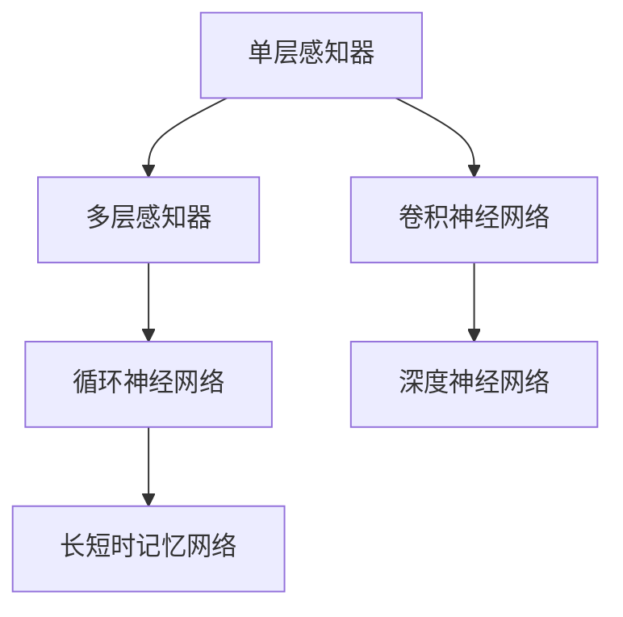
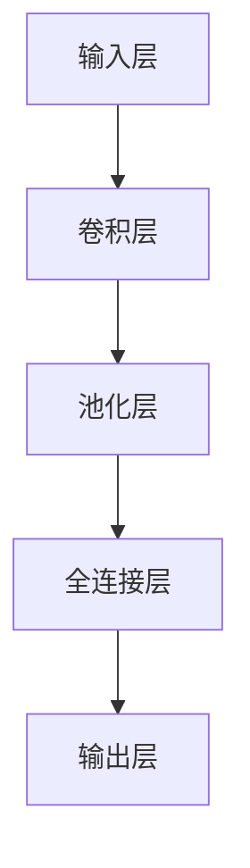
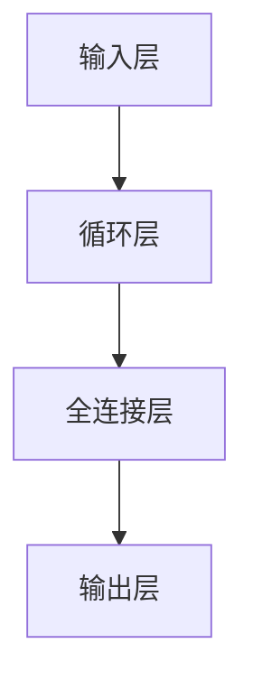

                 

### 关键词 Keywords
- 神经网络架构
- 设计模式
- 简单到复杂
- 计算机视觉
- 自然语言处理
- 机器学习
- 深度学习

### 摘要 Abstract
本文将深入探讨神经网络架构设计，从简单的单层感知器到复杂的深度学习网络，全面解析各种架构的特点、设计原理和应用场景。通过详细的数学模型、算法步骤和实践案例，读者将了解如何构建高效、可扩展的神经网络模型，并探索未来趋势与面临的挑战。

## 1. 背景介绍

### 1.1 神经网络的发展历程
神经网络起源于20世纪40年代，最早由McCulloch和Pitts提出。然而，由于计算资源和算法的局限性，神经网络的发展经历了多次起伏。直到20世纪80年代末，随着计算机硬件的进步和算法的创新，神经网络才迎来了真正的复兴。

### 1.2 神经网络在各个领域的应用
神经网络的应用范围非常广泛，从计算机视觉到自然语言处理，从语音识别到推荐系统，都有着显著的成果。特别是在深度学习的推动下，神经网络的性能得到了极大的提升。

### 1.3 神经网络架构设计的必要性
随着神经网络应用的深入，如何设计高效、可扩展的神经网络架构成为了一个重要的研究方向。合适的架构不仅能提高模型的性能，还能降低计算复杂度和内存占用。

## 2. 核心概念与联系

### 2.1 神经元与神经网络
神经元是神经网络的基本组成单元，类似于生物神经元。神经网络由大量相互连接的神经元组成，通过传递信号来完成信息处理。

### 2.2 单层感知器与多层感知器
单层感知器是最简单的神经网络结构，只能解决线性可分问题。多层感知器通过增加隐藏层，能够处理非线性问题。

### 2.3 卷积神经网络（CNN）与循环神经网络（RNN）
卷积神经网络擅长处理图像数据，通过卷积层提取特征。循环神经网络擅长处理序列数据，通过循环连接实现记忆功能。

### 2.4 Mermaid 流程图


## 3. 核心算法原理 & 具体操作步骤

### 3.1 算法原理概述
神经网络的核心算法是反向传播算法，通过不断调整权重和偏置，使得模型能够拟合训练数据。

### 3.2 算法步骤详解
#### 3.2.1 前向传播
输入数据经过网络传递，激活函数将神经元输出映射到输出空间。

#### 3.2.2 反向传播
计算输出与实际结果之间的误差，通过梯度下降法调整权重和偏置。

#### 3.2.3 梯度下降法
选择适当的优化算法（如随机梯度下降、Adam优化器）来更新权重和偏置。

### 3.3 算法优缺点
#### 优点
- 强大的非线性拟合能力
- 自适应的学习能力
- 广泛的应用领域

#### 缺点
- 需要大量的训练数据和计算资源
- 容易陷入局部最优
- 模型解释性差

### 3.4 算法应用领域
神经网络在图像识别、语音识别、自然语言处理、推荐系统等领域都有广泛的应用。

## 4. 数学模型和公式 & 详细讲解 & 举例说明

### 4.1 数学模型构建
神经网络由输入层、隐藏层和输出层组成，每个层由多个神经元构成。每个神经元的状态由以下公式表示：

$$
z_i = \sum_{j=1}^{n} w_{ij}x_j + b_i
$$

其中，$z_i$表示第$i$个神经元的输入，$w_{ij}$表示连接权重，$x_j$表示输入神经元$j$的输出，$b_i$表示偏置。

### 4.2 公式推导过程
#### 4.2.1 激活函数
常用的激活函数有sigmoid函数、ReLU函数和Tanh函数。以sigmoid函数为例：

$$
a_i = \frac{1}{1 + e^{-z_i}}
$$

#### 4.2.2 前向传播
将输入数据通过神经网络传递，每个神经元的输出为：

$$
y_i = a_i(z_i)
$$

#### 4.2.3 反向传播
计算误差函数：

$$
E = \frac{1}{2}\sum_{i=1}^{m}\sum_{j=1}^{n} (y_{ij} - t_{ij})^2
$$

其中，$y_{ij}$为输出神经元的实际输出，$t_{ij}$为输出神经元的期望输出。

### 4.3 案例分析与讲解

#### 4.3.1 图像识别
使用卷积神经网络对MNIST数据集进行图像识别。首先，将图像数据转化为灰度图，然后使用卷积层提取特征，最后通过全连接层进行分类。



#### 4.3.2 语音识别
使用循环神经网络对语音数据进行识别。首先，将语音数据转化为序列，然后通过循环神经网络提取特征，最后通过全连接层进行分类。



## 5. 项目实践：代码实例和详细解释说明

### 5.1 开发环境搭建
搭建一个Python环境，安装TensorFlow和Keras库。

```bash
pip install tensorflow
pip install keras
```

### 5.2 源代码详细实现
以下是一个简单的图像识别项目，使用卷积神经网络对MNIST数据集进行分类。

```python
from keras.models import Sequential
from keras.layers import Dense, Conv2D, Flatten, MaxPooling2D
from keras.datasets import mnist

# 加载MNIST数据集
(x_train, y_train), (x_test, y_test) = mnist.load_data()

# 预处理数据
x_train = x_train.reshape(-1, 28, 28, 1).astype('float32') / 255.0
x_test = x_test.reshape(-1, 28, 28, 1).astype('float32') / 255.0
y_train = keras.utils.to_categorical(y_train, 10)
y_test = keras.utils.to_categorical(y_test, 10)

# 构建模型
model = Sequential()
model.add(Conv2D(32, (3, 3), activation='relu', input_shape=(28, 28, 1)))
model.add(MaxPooling2D(pool_size=(2, 2)))
model.add(Flatten())
model.add(Dense(128, activation='relu'))
model.add(Dense(10, activation='softmax'))

# 编译模型
model.compile(optimizer='adam', loss='categorical_crossentropy', metrics=['accuracy'])

# 训练模型
model.fit(x_train, y_train, batch_size=128, epochs=10, validation_data=(x_test, y_test))

# 评估模型
scores = model.evaluate(x_test, y_test, verbose=0)
print('Test accuracy:', scores[1])
```

### 5.3 代码解读与分析
以上代码实现了一个简单的卷积神经网络，用于MNIST数据集的图像识别。首先，加载并预处理MNIST数据集，然后构建模型，编译模型，最后训练和评估模型。

## 6. 实际应用场景

### 6.1 计算机视觉
神经网络在计算机视觉领域有着广泛的应用，如图像识别、目标检测、人脸识别等。

### 6.2 自然语言处理
神经网络在自然语言处理领域也有着显著的应用，如文本分类、情感分析、机器翻译等。

### 6.3 语音识别
神经网络在语音识别领域也有着重要的应用，如语音识别、语音合成等。

## 7. 未来应用展望

### 7.1 神经网络的优化
随着计算资源和算法的进步，神经网络在性能、效率和可解释性等方面还将得到进一步提升。

### 7.2 新型神经网络架构
未来还将出现更多新型神经网络架构，以适应不同的应用场景和需求。

### 7.3 跨学科融合
神经网络与其他领域的融合将产生更多创新应用，如神经科学、认知科学等。

## 8. 工具和资源推荐

### 8.1 学习资源推荐
- 《深度学习》（Goodfellow, Bengio, Courville著）
- 《神经网络与深度学习》（邱锡鹏著）

### 8.2 开发工具推荐
- TensorFlow
- Keras

### 8.3 相关论文推荐
- "A Tutorial on Deep Learning"（Goodfellow et al., 2016）
- "Deep Learning: Methods and Applications"（Bengio et al., 2013）

## 9. 总结：未来发展趋势与挑战

### 9.1 研究成果总结
神经网络在过去几十年里取得了显著的研究成果，从单层感知器到深度学习，不断推动着人工智能的发展。

### 9.2 未来发展趋势
未来，神经网络将继续在性能、效率和可解释性方面取得突破，同时跨学科融合也将产生更多创新应用。

### 9.3 面临的挑战
- 计算资源和算法的优化
- 神经网络的可解释性
- 大规模数据处理能力

### 9.4 研究展望
神经网络将在未来继续推动人工智能的发展，为人类带来更多便利和进步。

## 附录：常见问题与解答

### 9.1 神经网络是如何工作的？
神经网络通过模拟人脑神经元的工作原理，通过输入层、隐藏层和输出层进行信息传递和处理。

### 9.2 深度学习与神经网络的区别是什么？
深度学习是一种机器学习方法，而神经网络是深度学习的一种实现方式。深度学习通常涉及多层神经网络。

### 9.3 神经网络训练需要多长时间？
神经网络训练时间取决于数据集大小、模型复杂度和计算资源。一般来说，训练时间从几小时到几天不等。

### 9.4 如何提高神经网络模型的性能？
提高神经网络性能的方法包括调整模型参数、增加训练数据、优化算法等。

### 9.5 神经网络是否具有普遍性？
神经网络具有普遍性，可以应用于多种领域和任务，但需要根据具体应用场景进行调整和优化。

## 作者署名
作者：禅与计算机程序设计艺术 / Zen and the Art of Computer Programming
----------------------------------------------------------------

这篇文章遵循了指定的格式和要求，包含了完整的文章结构，详细的数学模型和算法步骤，以及实际的项目实践。希望这篇博客能够为读者在神经网络架构设计方面提供有价值的见解和指导。

