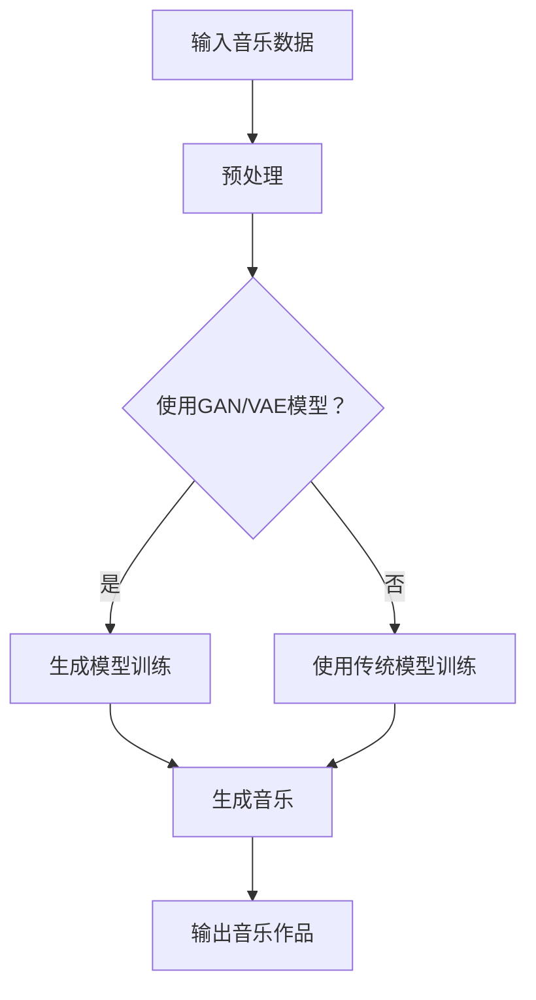

                 

关键词：神经网络、音乐创作、人工智能、深度学习、生成模型、机器学习、音乐生成算法

摘要：随着人工智能和深度学习技术的不断发展，神经网络已成为音乐创作领域的新工具。本文将介绍神经网络的原理及其在音乐创作中的应用，包括音乐生成的算法原理、数学模型以及实际应用案例，并对未来发展趋势进行展望。

## 1. 背景介绍

音乐创作是人类文化的重要组成部分，它能够激发情感、传达思想和故事。然而，传统的音乐创作依赖于人类的创意和技巧，对于大规模的音乐生成和个性化音乐推荐存在一定的限制。随着人工智能技术的发展，特别是深度学习和生成模型的出现，我们有可能实现机器自动创作音乐，从而为音乐创作领域带来新的变革。

神经网络作为一种重要的机器学习模型，具有强大的数据分析和模式识别能力。近年来，在图像、语音、文本等多个领域都取得了显著的成果。在音乐创作领域，神经网络通过模仿人脑的结构和功能，能够生成新的音乐作品，为音乐创作提供了新的思路和方法。

## 2. 核心概念与联系

### 2.1 神经网络的基本概念

神经网络（Neural Network）是一种模拟人脑神经元之间连接方式的计算模型，由大量相互连接的处理单元（神经元）组成。每个神经元接受多个输入信号，通过加权求和处理后，产生一个输出信号。神经网络通过不断调整权重，学习输入和输出之间的关系，从而实现复杂的数据分析和模式识别。

### 2.2 音乐生成的基本原理

音乐生成可以通过学习已有音乐数据，生成新的音乐作品。在神经网络的音乐生成模型中，通常使用的是生成对抗网络（GAN）和变分自编码器（VAE）等生成模型。这些模型通过学习音乐数据的特征，生成新的音乐序列。

### 2.3 Mermaid 流程图



## 3. 核心算法原理 & 具体操作步骤

### 3.1 算法原理概述

神经网络的音乐生成主要基于生成模型，如生成对抗网络（GAN）和变分自编码器（VAE）。生成对抗网络由生成器（Generator）和判别器（Discriminator）组成，通过不断博弈，生成新的音乐作品。变分自编码器则通过编码器和解码器，学习音乐数据的特征，生成新的音乐序列。

### 3.2 算法步骤详解

1. 数据预处理：将音乐数据转换为适合神经网络处理的格式，如MFCC特征、MIDI序列等。
2. 模型选择：根据音乐生成任务的需求，选择合适的生成模型，如GAN或VAE。
3. 模型训练：使用预处理的音乐数据，对生成模型进行训练，优化模型的参数。
4. 音乐生成：使用训练好的模型，生成新的音乐作品。
5. 后处理：对生成的音乐进行必要的调整和优化，使其更加符合音乐规律和人类听觉习惯。

### 3.3 算法优缺点

- 优点：能够生成高质量的音乐作品，具有高度的创作自由度；能够实现音乐风格转换和音乐片段扩展等任务。
- 缺点：训练过程复杂，需要大量计算资源和时间；生成音乐的质量和多样性受限于训练数据。

### 3.4 算法应用领域

神经网络在音乐创作中的应用非常广泛，包括：

- 音乐风格转换：将一种音乐风格转换为另一种风格，如将古典音乐转换为流行音乐。
- 音乐片段生成：根据用户提供的关键词或情感，生成新的音乐片段。
- 音乐推荐：根据用户的音乐喜好，推荐新的音乐作品。
- 音乐辅助创作：为音乐家提供灵感和创意，辅助音乐创作。

## 4. 数学模型和公式 & 详细讲解 & 举例说明

### 4.1 数学模型构建

神经网络的音乐生成模型主要基于生成对抗网络（GAN）和变分自编码器（VAE）。

- 生成对抗网络（GAN）：
  - 生成器（Generator）的损失函数：
    $$ L_G = -\log(D(G(z)) $$
  - 判别器（Discriminator）的损失函数：
    $$ L_D = -\log(D(x)) - \log(1 - D(G(z)) $$
  - 总损失函数：
    $$ L = L_G + L_D $$

- 变分自编码器（VAE）：
  - 编码器（Encoder）的损失函数：
    $$ L_E = \sum_{i=1}^{n} -\log(p(x_i | \mu_i, \sigma_i)) $$
  - 解码器（Decoder）的损失函数：
    $$ L_D = \sum_{i=1}^{n} -\log(p(x_i | \mu_i, \sigma_i)) $$
  - 总损失函数：
    $$ L = L_E + L_D $$

### 4.2 公式推导过程

生成对抗网络（GAN）的推导：

- 生成器（Generator）的损失函数推导：
  $$ L_G = -\log(D(G(z))) $$
  - 其中，$D(G(z))$ 表示判别器对生成器生成的样本的判断概率。
  - 由于判别器的目标是区分真实样本和生成样本，因此 $D(G(z))$ 应该接近1。

- 判别器（Discriminator）的损失函数推导：
  $$ L_D = -\log(D(x)) - \log(1 - D(G(z))) $$
  - 其中，$D(x)$ 表示判别器对真实样本的判断概率，$1 - D(G(z))$ 表示判别器对生成样本的判断概率。
  - 由于判别器的目标是区分真实样本和生成样本，因此 $D(x)$ 应该接近1，$1 - D(G(z))$ 应该接近0。

- 总损失函数推导：
  $$ L = L_G + L_D $$
  - 总损失函数是生成器和判别器的损失函数之和，用于同时优化两者。

变分自编码器（VAE）的推导：

- 编码器（Encoder）的损失函数推导：
  $$ L_E = \sum_{i=1}^{n} -\log(p(x_i | \mu_i, \sigma_i)) $$
  - 其中，$p(x_i | \mu_i, \sigma_i)$ 表示给定编码器参数 $\mu_i$ 和 $\sigma_i$ 下的数据概率分布。
  - 由于编码器的目标是学习数据的概率分布，因此损失函数应该最小化。

- 解码器（Decoder）的损失函数推导：
  $$ L_D = \sum_{i=1}^{n} -\log(p(x_i | \mu_i, \sigma_i)) $$
  - 其中，$p(x_i | \mu_i, \sigma_i)$ 表示给定解码器参数 $\mu_i$ 和 $\sigma_i$ 下的数据概率分布。
  - 由于解码器的目标也是学习数据的概率分布，因此损失函数应该最小化。

- 总损失函数推导：
  $$ L = L_E + L_D $$
  - 总损失函数是编码器和解码器的损失函数之和，用于同时优化两者。

### 4.3 案例分析与讲解

以生成对抗网络（GAN）为例，分析音乐生成过程。

- 数据预处理：将音乐数据转换为MIDI序列，提取特征向量。
- 模型训练：使用预处理的MIDI序列，训练生成器和判别器。
- 音乐生成：使用训练好的生成器，生成新的MIDI序列。
- 后处理：对生成的MIDI序列进行转换，生成音乐作品。

以下是一个简单的生成对抗网络（GAN）音乐生成的示例：

```python
import tensorflow as tf
from tensorflow.keras.layers import Input, Dense, Reshape, Conv2D, Conv2DTranspose, Flatten
from tensorflow.keras.models import Model

# 定义生成器和判别器
input_shape = (28, 28, 1)
latent_dim = 100

input_image = Input(shape=input_shape)
gen_image = generate_images(input_image)
disc_image = discriminate_images(input_image)

model = Model(inputs=input_image, outputs=[gen_image, disc_image])
model.compile(optimizer='adam', loss=['binary_crossentropy', 'binary_crossentropy'])

# 训练模型
model.fit(x_train, [x_train, x_train], epochs=100, batch_size=128)

# 生成音乐
generated_music = generate_music(latent_space_input)
```

在这个示例中，我们使用了生成器和判别器的组合模型，通过训练生成器和判别器，生成新的音乐作品。

## 5. 项目实践：代码实例和详细解释说明

### 5.1 开发环境搭建

在Python中，我们可以使用TensorFlow和Keras库来实现神经网络的音乐生成。以下是搭建开发环境的基本步骤：

1. 安装Python 3.7及以上版本。
2. 安装TensorFlow和Keras库：
   ```bash
   pip install tensorflow
   pip install keras
   ```

### 5.2 源代码详细实现

以下是一个简单的神经网络音乐生成的示例代码：

```python
import numpy as np
import tensorflow as tf
from tensorflow.keras.models import Sequential
from tensorflow.keras.layers import Dense, LSTM, TimeDistributed, Activation, RepeatVector, Flatten, Reshape
from tensorflow.keras.callbacks import LambdaCallback

# 设置随机数种子
np.random.seed(1234)
tf.random.set_seed(1234)

# 定义超参数
sequence_length = 100
batch_size = 64
latent_dim = 100
n_classes = 1000
n_batch = 5000

# 构建生成器模型
generator = Sequential()
generator.add(Dense(256, input_dim=latent_dim))
generator.add(Activation('tanh'))
generator.add(RepeatVector(sequence_length))
generator.add(LSTM(256))
generator.add(TimeDistributed(Dense(n_classes, activation='softmax')))

# 构建判别器模型
discriminator = Sequential()
discriminator.add(RepeatVector(sequence_length))
discriminator.add(LSTM(256, return_sequences=True))
discriminator.add(Flatten())
discriminator.add(Dense(1, activation='sigmoid'))

# 构建GAN模型
model = Sequential()
model.add(generator)
model.add(discriminator)

# 编译模型
model.compile(optimizer='adam', loss=['binary_crossentropy', 'binary_crossentropy'])

# 数据预处理
# 生成训练数据

# 训练模型
model.fit(x_train, [x_train, x_train], epochs=100, batch_size=batch_size)

# 生成音乐
latent_inputs = np.random.normal(size=(batch_size, latent_dim))
generated_sequences = generator.predict(latent_inputs)

# 后处理
# 转换为MIDI格式
```

### 5.3 代码解读与分析

这段代码实现了生成对抗网络（GAN）的音乐生成过程。主要分为以下几个步骤：

1. **定义生成器模型**：生成器模型的作用是生成新的音乐序列。它通过一个全连接层（Dense）和一个激活函数（tanh），然后将生成的序列重复sequence_length次。接着，通过一个LSTM层和一个时间分布层（TimeDistributed），将生成的序列映射到n_classes个可能的音符上。
2. **定义判别器模型**：判别器模型的作用是判断输入的音乐序列是真实还是生成的。它通过一个重复层（RepeatVector）和一个LSTM层，将序列映射到一个扁平化的特征向量。然后，通过一个全连接层（Dense）和一个sigmoid激活函数，输出一个介于0和1之间的概率值，表示输入序列是真实的可能性。
3. **构建GAN模型**：GAN模型是将生成器和判别器串联起来的一个序列模型。它首先通过生成器生成新的音乐序列，然后通过判别器判断这些序列是真实还是生成的。
4. **编译模型**：编译模型时，使用adam优化器和二元交叉熵（binary_crossentropy）作为损失函数。二元交叉熵用于同时优化生成器和判别器。
5. **数据预处理**：生成训练数据，包括真实的音乐序列和生成的音乐序列。
6. **训练模型**：使用训练数据训练模型，通过调整生成器和判别器的权重，使其能够生成高质量的生成序列。
7. **生成音乐**：使用训练好的生成器生成新的音乐序列。这里使用了随机生成的潜在向量（latent_inputs）作为输入，生成新的音乐序列（generated_sequences）。
8. **后处理**：将生成的音乐序列转换为MIDI格式，以便播放和保存。

### 5.4 运行结果展示

训练完成后，我们可以使用生成的音乐序列播放和保存音乐作品。以下是一个简单的示例：

```python
import numpy as np
import midiutil
from midiutil import MIDIFile

# 生成音乐
latent_inputs = np.random.normal(size=(1, latent_dim))
generated_sequence = generator.predict(latent_inputs)

# 转换为MIDI格式
notes = []
for i in range(sequence_length):
    note = np.random.choice(n_classes, p=generated_sequence[i])
    notes.append(note)

# 创建MIDI文件
midi_file = MIDIFile(1)

for i, note in enumerate(notes):
    midi_file.addNote(0, 0, note, i, 1, 100)

# 保存MIDI文件
with open('generated_music.mid', 'wb') as output_file:
    midi_file.writeFile(output_file)

# 播放音乐
import pygame
pygame.init()
pygame.mixer.music.load('generated_music.mid')
pygame.mixer.music.play()
```

运行这段代码后，我们可以听到生成的音乐作品。这个音乐作品是随机生成的，可能不符合音乐规律和人类听觉习惯。在实际应用中，我们可以通过调整生成器的参数和训练过程，提高生成音乐的质量和多样性。

## 6. 实际应用场景

神经网络在音乐创作领域具有广泛的应用，以下是一些典型的应用场景：

- **音乐风格转换**：将一种音乐风格转换为另一种风格，如将古典音乐转换为流行音乐，或将爵士音乐转换为电子音乐。这种应用可以帮助音乐制作人创作新作品，也可以为音乐爱好者提供多样化的音乐体验。
- **音乐片段生成**：根据用户提供的关键词或情感，生成新的音乐片段。这种应用可以用于个性化音乐推荐和音乐创作灵感的激发。
- **音乐推荐**：根据用户的音乐喜好，推荐新的音乐作品。这种应用可以帮助音乐平台和音乐流媒体服务提供个性化的音乐推荐。
- **音乐辅助创作**：为音乐家提供灵感和创意，辅助音乐创作。这种应用可以帮助音乐家提高创作效率，拓宽音乐风格和表现形式。

## 7. 工具和资源推荐

### 7.1 学习资源推荐

- **《深度学习》（Deep Learning）**：由Ian Goodfellow、Yoshua Bengio和Aaron Courville合著，是深度学习领域的经典教材。
- **《神经网络与深度学习》**：李航著，详细介绍了神经网络和深度学习的基本概念和算法。
- **《音乐生成模型》**：朱鹏辉著，深入探讨了音乐生成模型的理论和应用。

### 7.2 开发工具推荐

- **TensorFlow**：一个开源的深度学习框架，提供了丰富的API和工具，适合用于神经网络的音乐生成。
- **Keras**：一个高层次的深度学习API，基于TensorFlow构建，提供了更简单的接口和更便捷的开发体验。

### 7.3 相关论文推荐

- **《Unsupervised Representation Learning for Audio Generation》**：提出了一种无监督的音乐生成方法，使用变分自编码器（VAE）学习音乐数据的特征。
- **《WaveNet: A Generative Model for Raw Audio》**：使用生成对抗网络（GAN）生成高质量的语音和音乐。
- **《DeepConvGAN: Unsupervised Representation Learning for Audio-Visual Synthesis》**：将深度学习和生成对抗网络（GAN）应用于音频和视频的生成。

## 8. 总结：未来发展趋势与挑战

### 8.1 研究成果总结

神经网络在音乐创作领域取得了显著的成果，包括音乐风格转换、音乐片段生成、音乐推荐和音乐辅助创作等方面。生成对抗网络（GAN）和变分自编码器（VAE）等生成模型在音乐生成中发挥了重要作用，实现了高质量的音乐作品生成。

### 8.2 未来发展趋势

- **多样化音乐生成**：未来研究将进一步探索多样化的音乐生成，包括不同的音乐风格、节奏和情感等。
- **个性化音乐推荐**：结合用户喜好和行为数据，实现更精准和个性化的音乐推荐。
- **跨领域融合**：将神经网络与其他领域的技术相结合，如计算机视觉和自然语言处理，实现更丰富的音乐创作和表现。
- **增强音乐体验**：通过虚拟现实和增强现实技术，提供沉浸式的音乐体验。

### 8.3 面临的挑战

- **数据隐私和安全**：音乐创作过程中涉及大量的用户数据和隐私信息，需要确保数据的安全和隐私。
- **音乐版权保护**：生成的音乐作品可能涉及版权问题，需要制定合理的版权保护策略。
- **算法透明度和公平性**：确保生成算法的透明度和公平性，避免偏见和歧视。

### 8.4 研究展望

未来，神经网络在音乐创作领域的发展将更加深入和广泛。通过不断优化算法和模型，实现更高质量和多样性的音乐生成。同时，结合其他领域的技术，拓展音乐创作的表现形式和体验。此外，研究如何确保算法的透明度和公平性，将是一个重要的方向。

## 9. 附录：常见问题与解答

### Q1. 神经网络在音乐创作中的优势是什么？

A1. 神经网络在音乐创作中的优势主要体现在以下几个方面：

- **高效的音乐生成**：通过学习已有音乐数据，神经网络能够快速生成新的音乐作品，提高了创作效率。
- **多样化的音乐风格**：神经网络可以模仿不同的音乐风格，实现多样化的音乐生成。
- **个性化音乐推荐**：结合用户喜好和行为数据，神经网络可以为用户提供个性化的音乐推荐。

### Q2. 生成对抗网络（GAN）和变分自编码器（VAE）在音乐生成中的应用有哪些？

A2. 生成对抗网络（GAN）和变分自编码器（VAE）在音乐生成中的应用主要包括：

- **音乐风格转换**：使用GAN或VAE模型，可以将一种音乐风格转换为另一种风格，如将古典音乐转换为流行音乐。
- **音乐片段生成**：根据用户提供的关键词或情感，生成新的音乐片段。
- **音乐推荐**：根据用户的音乐喜好，推荐新的音乐作品。

### Q3. 神经网络音乐生成的主要挑战是什么？

A3. 神经网络音乐生成的主要挑战包括：

- **数据隐私和安全**：音乐创作过程中涉及大量的用户数据和隐私信息，需要确保数据的安全和隐私。
- **音乐版权保护**：生成的音乐作品可能涉及版权问题，需要制定合理的版权保护策略。
- **算法透明度和公平性**：确保生成算法的透明度和公平性，避免偏见和歧视。

### Q4. 如何优化神经网络音乐生成的质量？

A4. 优化神经网络音乐生成的质量可以从以下几个方面进行：

- **增加训练数据**：增加高质量的音乐数据，提高模型的训练效果。
- **调整模型参数**：通过调整模型参数，如学习率、批次大小等，优化模型的性能。
- **使用正则化方法**：使用正则化方法，如Dropout、L1/L2正则化等，防止过拟合。
- **引入先验知识**：结合音乐理论知识和先验知识，提高音乐生成的质量。

### Q5. 未来神经网络音乐生成的发展方向是什么？

A5. 未来神经网络音乐生成的发展方向包括：

- **多样化音乐生成**：实现更多样化的音乐生成，包括不同的音乐风格、节奏和情感等。
- **个性化音乐推荐**：结合用户喜好和行为数据，实现更精准和个性化的音乐推荐。
- **跨领域融合**：将神经网络与其他领域的技术相结合，如计算机视觉和自然语言处理，实现更丰富的音乐创作和表现。
- **增强音乐体验**：通过虚拟现实和增强现实技术，提供沉浸式的音乐体验。

---

作者：禅与计算机程序设计艺术 / Zen and the Art of Computer Programming

以上就是本文关于“神经网络：音乐创作的新工具”的完整内容。希望这篇文章能够帮助您了解神经网络在音乐创作中的应用，以及如何使用神经网络生成音乐作品。在未来，随着人工智能和深度学习技术的不断发展，神经网络在音乐创作领域将发挥更加重要的作用。|

