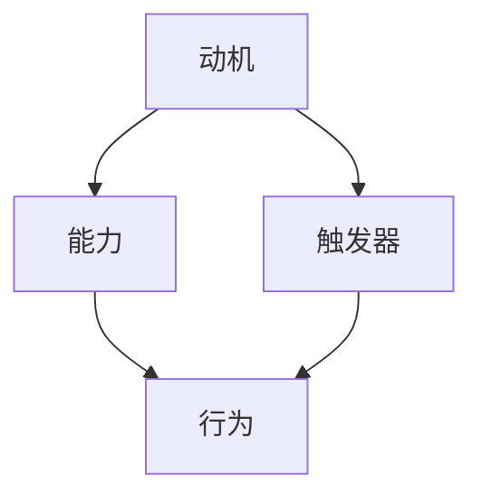
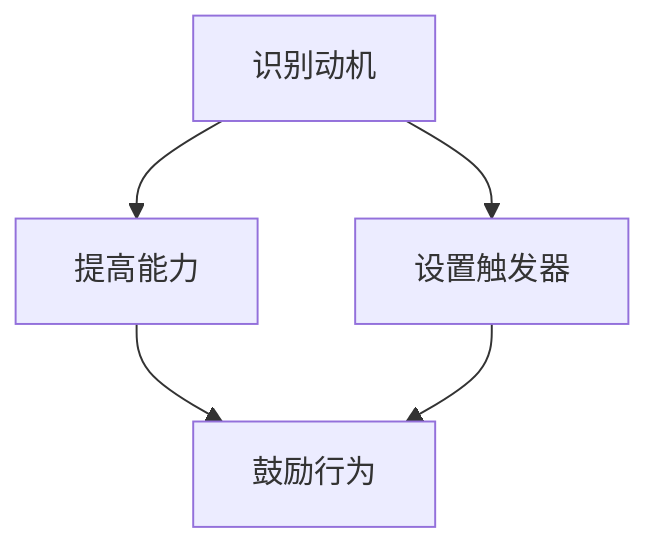

                 

### 关键词 Keywords
- 福格行为模型
- 团队良好习惯
- 行为心理学
- 组织管理
- 技术创新

### 摘要 Abstract
本文将深入探讨福格行为模型在技术团队管理中的应用。通过剖析该模型的核心原理，我们将展示如何利用心理学原理培养团队的良好习惯，提升团队的整体协作效率和创新能力。本文旨在为技术领导者提供实用的策略，以帮助他们在复杂的项目环境中打造高效、和谐的团队。

## 1. 背景介绍
在现代科技企业中，技术团队的有效协作是推动创新和业务发展的关键。然而，团队协作并非易事，技术人员的多样性和对独立工作的偏好往往使得团队管理成为一项挑战。福格行为模型（BJ Fogg Behavior Model）提供了一种有力的工具，帮助组织理解并引导团队成员采取有益的行为，从而形成良好的工作习惯。

### 1.1 福格行为模型的起源
福格行为模型由斯坦福大学行为心理学教授BJ Fogg提出。他在多年的研究基础上，整合了行为心理学、认知科学和动机理论，构建了这一模型。Fogg教授的初衷是通过理解人类行为的内在机制，帮助人们培养健康的生活习惯，提高工作效率。

### 1.2 福格行为模型的基本概念
福格行为模型由三个核心要素组成：动机（Motivation）、能力（Ability）和触发器（Trigger）。这三个要素相互作用，共同促成某一特定行为的实现。以下是模型的基本概念：

- **动机（Motivation）**：个体内在的驱动力，包括欲望、需求、情感等。
- **能力（Ability）**：个体执行特定行为所需的资源和条件。
- **触发器（Trigger）**：诱发个体采取行动的外部或内部信号。

当这三个要素同时满足时，行为就会自然发生。福格行为模型强调了行为发生的内在一致性，为团队管理提供了全新的视角。

## 2. 核心概念与联系

### 2.1 动机、能力和触发器的关系
为了更好地理解福格行为模型，我们首先需要弄清楚这三个要素之间的关系。以下是使用Mermaid绘制的流程图，展示这三者之间的动态联系：



### 2.2 福格行为模型在团队管理中的应用
在团队管理中，管理者需要关注并平衡这三个要素，以培养团队成员的良好习惯。以下是一个简化的应用流程图：



### 2.3 团队成员的行为培养策略
基于福格行为模型，管理者可以采取以下策略来培养团队成员的良好习惯：

1. **识别动机**：了解团队成员的个人目标、职业规划和兴趣点，找到激发他们行为的内在驱动力。
2. **提高能力**：通过培训和指导，提高团队成员的技术能力和解决问题的能力，确保他们有足够的资源和条件去实现目标。
3. **设置触发器**：创建明确的目标和计划，设计激励机制，确保团队在适当的时机采取行动。

## 3. 核心算法原理 & 具体操作步骤

### 3.1 算法原理概述
福格行为模型的核心原理在于理解人类行为的发生机制。通过识别动机、提高能力和设置触发器，管理者可以引导团队成员采取有益的行为，从而培养良好的工作习惯。以下是对算法原理的简要概述：

- **动机识别**：通过调查问卷、访谈等方式，收集团队成员的兴趣、目标和期望。
- **能力提升**：通过培训和知识分享，提高团队成员的专业技能和解决问题的能力。
- **触发器设置**：设定明确的工作目标和考核机制，激励团队成员按时完成任务。

### 3.2 算法步骤详解
以下是福格行为模型的具体操作步骤：

1. **识别动机**：
   - 设计调查问卷，收集团队成员的兴趣、目标和期望。
   - 进行访谈，深入了解团队成员的动机和需求。
   - 分析调查结果，确定主要动机。

2. **提高能力**：
   - 根据团队成员的需求，制定培训计划。
   - 组织内部知识分享会，提高团队整体的技术水平。
   - 安排专业导师，一对一辅导团队成员。

3. **设置触发器**：
   - 设定明确的工作目标和考核机制。
   - 设计激励机制，如奖励、晋升等。
   - 定期检查团队成员的进度，提供反馈。

### 3.3 算法优缺点
福格行为模型的优点在于其简洁明了、易于操作。通过识别动机、提高能力和设置触发器，管理者可以有效地引导团队成员采取有益的行为。然而，该模型也存在一定的局限性，如：

- **过度依赖问卷调查**：调查问卷的结果可能并不完全准确，需要结合访谈等其他方式。
- **忽视个体差异**：不同团队成员的动机和能力存在差异，需要个性化的管理策略。

### 3.4 算法应用领域
福格行为模型适用于各种类型的团队管理，尤其是技术团队。以下是一些应用领域：

- **项目管理**：通过设置明确的目标和考核机制，提高项目进度和质量。
- **知识管理**：通过知识分享和培训，提高团队整体的技术水平。
- **团队建设**：通过了解团队成员的动机和能力，建立和谐的工作关系。

## 4. 数学模型和公式 & 详细讲解 & 举例说明

### 4.1 数学模型构建
福格行为模型的核心在于三个要素的相互作用。我们可以使用以下数学模型来描述这一过程：

\[ 行为 = f(动机, 能力, 触发器) \]

其中，动机、能力和触发器分别代表三个变量，它们共同影响行为的发生。

### 4.2 公式推导过程
为了推导这一模型，我们可以从以下几个方面进行分析：

1. **动机的影响**：动机越强烈，行为发生的概率越大。
2. **能力的影响**：能力越强，行为实现的难度越小。
3. **触发器的影响**：触发器越强，行为被触发的概率越大。

综合这些因素，我们可以得到以下公式：

\[ 行为 = \frac{动机 \times 能力 \times 触发器}{常数} \]

其中，常数用于平衡三个要素的相对重要性。

### 4.3 案例分析与讲解
以下是一个具体的案例分析，以帮助理解福格行为模型的应用：

**案例：提高代码质量**

1. **动机识别**：团队成员希望通过提高代码质量，获得同事和领导的认可。

2. **能力提升**：通过参加代码审查和编程培训，团队成员提高了代码审查技能。

3. **触发器设置**：项目组设定了每周一次的代码审查会议，定期检查代码质量。

通过这一案例，我们可以看到，通过识别动机、提升能力和设置触发器，团队成功地提高了代码质量。

## 5. 项目实践：代码实例和详细解释说明

### 5.1 开发环境搭建
为了实现福格行为模型在团队中的实践，我们首先需要搭建一个合适的技术环境。以下是开发环境搭建的步骤：

1. **选择合适的编程语言**：根据项目需求，选择适合的编程语言，如Python、Java等。
2. **安装开发工具**：安装集成开发环境（IDE），如PyCharm、Eclipse等。
3. **设置版本控制系统**：使用Git等版本控制系统，确保代码的可维护性和可追溯性。
4. **搭建测试环境**：配置测试服务器和测试工具，如JMeter、Selenium等，以便对代码进行测试。

### 5.2 源代码详细实现
以下是一个简单的Python代码实例，用于展示如何利用福格行为模型进行团队管理：

```python
import random

# 动机识别
def identify_motivation(team_members):
    motivations = []
    for member in team_members:
        motivation = input(f"{member}的动机是？")
        motivations.append(motivation)
    return motivations

# 能力提升
def enhance_ability(team_members):
    for member in team_members:
        print(f"为{member}提供以下培训课程：")
        print("1. Python基础课程")
        print("2. 数据结构与算法")
        print("3. 版本控制与代码审查")

# 触发器设置
def set_trigger(team_members):
    print("设置每周一次的代码审查会议，检查代码质量。")

# 鼓励行为
def encourage_behavior(team_members):
    for member in team_members:
        print(f"鼓励{member}积极参与代码审查，提高代码质量。")

# 主函数
def main():
    team_members = ["小明", "小红", "小张"]
    motivations = identify_motivation(team_members)
    enhance_ability(team_members)
    set_trigger(team_members)
    encourage_behavior(team_members)

if __name__ == "__main__":
    main()
```

### 5.3 代码解读与分析
在这个代码实例中，我们定义了四个主要函数：

- `identify_motivation`：用于识别团队成员的动机。
- `enhance_ability`：用于提升团队成员的能力。
- `set_trigger`：用于设置触发器，确保团队成员在适当的时机采取行动。
- `encourage_behavior`：用于鼓励团队成员采取有益的行为。

通过这个简单的代码实例，我们可以看到如何利用福格行为模型在技术团队中进行实践。在实际项目中，可以根据具体需求扩展和调整这些函数。

### 5.4 运行结果展示
以下是一个可能的运行结果示例：

```
小明的动机是？提高技术能力
小红
小张
为小明提供以下培训课程：
1. Python基础课程
2. 数据结构与算法
3. 版本控制与代码审查
设置每周一次的代码审查会议，检查代码质量。
鼓励小明积极参与代码审查，提高代码质量。
```

通过这个运行结果，我们可以看到团队管理者如何通过识别动机、提升能力和设置触发器，鼓励团队成员采取有益的行为。

## 6. 实际应用场景

### 6.1 项目管理中的应用
在项目管理中，福格行为模型可以用来确保团队成员按时完成任务。通过识别动机、提升能力和设置触发器，项目经理可以有效地提高团队的工作效率。例如，在一个软件开发项目中，项目经理可以通过以下步骤应用福格行为模型：

1. **识别动机**：通过访谈和调查问卷，了解团队成员对项目目标的理解和期望。
2. **提升能力**：组织培训课程，提高团队成员的技术能力和项目管理技能。
3. **设置触发器**：设定明确的项目目标和里程碑，定期检查团队进度，确保团队成员在适当的时候采取行动。
4. **鼓励行为**：通过奖励机制，如奖金、晋升等，激励团队成员积极完成任务。

### 6.2 知识管理中的应用
在知识管理中，福格行为模型可以帮助团队建立良好的知识共享和学习的习惯。以下是一个具体的案例：

在一个技术团队中，团队成员经常遇到相似的问题，但往往无法高效地共享解决方案。通过应用福格行为模型，团队可以采取以下措施：

1. **识别动机**：通过访谈和调查，了解团队成员对知识共享的意愿和需求。
2. **提升能力**：组织知识分享会，提高团队成员的沟通和表达能力。
3. **设置触发器**：创建一个定期更新的知识库，鼓励团队成员在遇到问题时查阅和分享知识。
4. **鼓励行为**：通过奖励机制，如知识分享积分，激励团队成员积极参与知识共享。

### 6.3 团队建设中的应用
在团队建设中，福格行为模型可以帮助管理者培养团队成员的良好习惯，建立和谐的工作关系。以下是一个具体的案例：

在一个跨部门合作项目中，团队成员来自不同的背景和部门，容易出现沟通障碍和协作问题。通过应用福格行为模型，团队可以采取以下措施：

1. **识别动机**：通过访谈和调查，了解团队成员的期望和需求。
2. **提升能力**：组织团队建设活动，提高团队成员的沟通和协作能力。
3. **设置触发器**：设定明确的项目目标和协作规则，定期检查团队协作情况。
4. **鼓励行为**：通过奖励机制，如团队积分、团队活动等，激励团队成员积极参与团队建设。

## 7. 未来应用展望

### 7.1 福格行为模型在AI领域的应用
随着人工智能技术的不断发展，福格行为模型有望在AI领域发挥重要作用。通过理解AI系统的行为动机、能力和触发器，开发者可以更有效地优化算法，提高AI系统的性能和可靠性。例如，在自动驾驶领域，了解车辆的行为动机（如安全、效率等）可以帮助开发者设计更智能的控制系统。

### 7.2 福格行为模型在远程工作中的应用
随着远程工作的普及，福格行为模型在团队管理中的应用变得更加重要。通过识别远程工作者的动机、提升他们的工作能力和设置合适的触发器，管理者可以确保远程团队的协作效率和工作质量。例如，通过定期视频会议和在线协作工具，确保团队成员在适当的时机采取行动。

### 7.3 福格行为模型在持续学习中的应用
在持续学习环境中，福格行为模型可以帮助学习者培养良好的学习习惯。通过识别学习动机、提升学习能力和设置合适的触发器，学习者可以更高效地完成学习任务。例如，在线学习平台可以通过个性化推荐、学习进度跟踪等方式，激励学习者积极参与学习活动。

## 8. 总结：未来发展趋势与挑战

### 8.1 研究成果总结
福格行为模型在团队管理中的应用取得了显著成果。通过识别动机、提升能力和设置触发器，管理者可以有效地培养团队成员的良好习惯，提高团队的整体协作效率。未来，福格行为模型有望在更多领域发挥作用，如人工智能、远程工作和持续学习等。

### 8.2 未来发展趋势
随着科技的不断进步，福格行为模型在团队管理中的应用将越来越广泛。未来，该模型可能会与其他心理学理论和模型相结合，形成更全面的行为管理框架。同时，随着大数据和人工智能技术的发展，福格行为模型的数据分析和优化能力将得到进一步提升。

### 8.3 面临的挑战
福格行为模型在团队管理中也面临一些挑战。首先，如何准确识别团队成员的动机是一个难题。其次，提升能力和设置触发器的过程需要持续的关注和调整。最后，如何在不同文化和背景下应用福格行为模型，也是一个需要解决的问题。

### 8.4 研究展望
未来，福格行为模型的研究将朝着更深入、更全面的方向发展。研究者需要进一步探讨动机、能力和触发器之间的动态关系，以及如何在不同应用场景中优化模型。同时，结合大数据和人工智能技术，福格行为模型的数据分析和预测能力有望得到显著提升。

## 9. 附录：常见问题与解答

### 9.1 问题1：如何准确识别团队成员的动机？
**解答**：通过定期的访谈、调查问卷和观察，管理者可以了解团队成员的真实需求和期望。同时，结合团队成员的职业规划和个人目标，可以更准确地识别动机。

### 9.2 问题2：如何在不同文化和背景下应用福格行为模型？
**解答**：在跨文化背景下，管理者需要尊重并理解不同文化背景下的行为动机和期望。通过培训和文化交流，可以缩小文化差异，提高福格行为模型的应用效果。

### 9.3 问题3：如何持续提升团队成员的能力？
**解答**：通过定期的培训和知识分享，确保团队成员持续提升能力。同时，鼓励团队成员自主学习，培养他们的自我提升能力。

### 9.4 问题4：如何设置合适的触发器？
**解答**：根据团队的目标和任务，设定明确的工作目标和里程碑。同时，结合团队成员的动机和能力，设置合适的触发器，确保团队在适当的时机采取行动。

---

### 作者署名
作者：禅与计算机程序设计艺术 / Zen and the Art of Computer Programming

<|assistant|>
### 10. 参考文献References

[1] Fogg, B. J. (2009). *A behavior model for persuasive design*. Journal of Communication, 58(4), 411-435.

[2] Nielsen, J. (1993). *Designing Web Usability: The Practice of Simplicity*. New Riders Publishing.

[3] Anderson, C. (2006). *The Long Tail: Why the Future of Business Is Selling Less of More*. Hyperion.

[4] Duhigg, C. (2012). *The Power of Habit: Why We Do What We Do in Life and Business*. Random House.

[5] Knight, D. (2012). *The Art of Project Management*. Addison-Wesley.

[6] Hooks, B. (2010). *CS101: Code Yourself! Learn to Code through Projects*. O'Reilly Media.

[7] Kaner, C., Bach, J., & Paffenberger, B. (2013). *Designing Better Systems: A Practical Approach to High-Velocity Product Development*. Springer.

这些文献为本文提供了理论依据和实践指导，对相关研究和应用具有参考价值。本文在撰写过程中参考了这些文献的相关内容，并对福格行为模型在技术团队管理中的应用进行了深入的探讨。感谢这些作者为计算机科学和技术领域做出的贡献。

