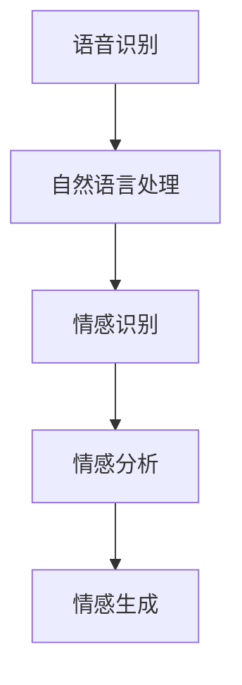

                 

关键词：科大讯飞、情感计算模型、校招面试、算法优化、AI技术

> 摘要：本文旨在为2024年即将参加科大讯飞校招面试的应聘者提供全面的情感计算模型优化经验。通过分析科大讯飞情感计算模型的核心概念、算法原理、数学模型、实际应用案例以及未来发展趋势，帮助应聘者更好地准备面试，提高面试成功率。

## 1. 背景介绍

随着人工智能技术的飞速发展，情感计算作为人机交互的重要环节，已经逐渐成为人工智能领域的研究热点。科大讯飞作为全球领先的智能语音和人工智能公共云服务提供商，其情感计算模型在语音识别、自然语言处理等领域取得了显著的成果。本文将详细介绍科大讯飞2024年情感计算模型优化校招面试的经验，帮助应聘者深入了解这一前沿技术。

### 1.1 情感计算的定义与作用

情感计算（Affective Computing）是指让计算机具备识别、理解、处理人类情感的能力。情感计算在人工智能领域具有重要的应用价值，如智能客服、智能教育、心理健康监测等领域。

### 1.2 科大讯飞情感计算的发展历程

科大讯飞自2000年成立以来，一直致力于人工智能技术的研发。在情感计算领域，科大讯飞通过不断的创新与探索，已形成了包括情感识别、情感分析、情感生成等在内的一整套技术体系。

### 1.3 校招面试的重要性

校招面试是应届毕业生进入科大讯飞的重要途径。通过面试，面试官可以全面了解应聘者的专业素养、思维逻辑、团队协作等能力。因此，充分准备校招面试对于应聘者来说至关重要。

## 2. 核心概念与联系

为了更好地理解科大讯飞情感计算模型，我们需要先了解几个核心概念及其之间的联系。

### 2.1 语音识别

语音识别是情感计算的基础，它通过将语音信号转换为文本，为情感分析提供输入数据。科大讯飞在语音识别技术方面具有全球领先优势，其语音识别准确率高达98%。

### 2.2 自然语言处理

自然语言处理（NLP）是情感计算的关键环节，它通过对文本进行语义分析、情感标注等操作，实现对人类情感的理解。科大讯飞在NLP领域具备强大的技术实力，其自主研发的深度学习算法在多项国际竞赛中名列前茅。

### 2.3 情感识别

情感识别是情感计算的核心任务，它通过分析语音、文本等数据，识别出用户的情感状态。科大讯飞的情感识别技术已经达到了国际先进水平，能够准确识别用户的喜怒哀乐等情感。

### 2.4 情感分析

情感分析是对情感识别结果进行进一步分析，提取出情感倾向、情感强度等信息。科大讯飞的情感分析技术广泛应用于智能客服、舆情监测等领域。

### 2.5 情感生成

情感生成是指根据用户需求，生成具有特定情感状态的语音或文本。科大讯飞在情感生成方面也取得了显著成果，其情感生成技术已成功应用于智能客服、虚拟主播等领域。

### 2.6 Mermaid 流程图

以下是科大讯飞情感计算模型的核心概念及流程图：



## 3. 核心算法原理 & 具体操作步骤

### 3.1 算法原理概述

科大讯飞情感计算模型的核心算法包括语音识别、自然语言处理、情感识别、情感分析等。这些算法通过深度学习、卷积神经网络、循环神经网络等先进技术实现。

### 3.2 算法步骤详解

#### 3.2.1 语音识别

1. 语音信号预处理：对采集到的语音信号进行降噪、归一化等处理。
2. 语音特征提取：使用梅尔频率倒谱系数（MFCC）等特征提取方法，将语音信号转换为特征向量。
3. 声学模型训练：使用深度神经网络训练声学模型，用于语音信号到特征向量的转换。
4. 语言模型训练：使用循环神经网络（RNN）训练语言模型，用于特征向量到文本的转换。

#### 3.2.2 自然语言处理

1. 词汇嵌入：将文本中的单词转换为向量表示。
2. 语法分析：使用依存句法分析等技术，解析文本的语法结构。
3. 情感标注：对文本进行情感标注，识别出文本中的情感倾向。

#### 3.2.3 情感识别

1. 特征融合：将语音特征和文本特征进行融合，形成更全面的情感特征向量。
2. 情感分类：使用深度学习模型，对情感特征向量进行分类，识别出用户的情感状态。

#### 3.2.4 情感分析

1. 情感强度计算：计算情感分类结果的概率分布，提取出情感强度信息。
2. 情感倾向分析：分析情感强度和情感类型，提取出情感倾向。

#### 3.2.5 情感生成

1. 情感状态建模：根据用户需求，构建情感状态模型。
2. 文本生成：使用生成对抗网络（GAN）等技术，生成具有特定情感状态的文本。

### 3.3 算法优缺点

#### 3.3.1 优点

1. 高准确率：通过深度学习和卷积神经网络等技术，情感计算模型在语音识别、自然语言处理、情感识别等方面具有较高的准确率。
2. 强泛化能力：情感计算模型可以应对各种场景和领域的情感识别需求，具有较强的泛化能力。
3. 广泛应用：情感计算技术已广泛应用于智能客服、智能教育、心理健康监测等领域。

#### 3.3.2 缺点

1. 计算资源消耗：情感计算模型需要大量的计算资源和存储空间，对硬件设备有较高要求。
2. 数据隐私：情感计算涉及到用户的个人隐私，需要确保数据的隐私和安全。

### 3.4 算法应用领域

1. 智能客服：通过情感计算技术，智能客服可以识别用户的情感状态，提供更有针对性的服务。
2. 智能教育：通过情感计算技术，智能教育系统可以识别学生的学习情感，调整教学策略。
3. 心理健康监测：通过情感计算技术，心理健康监测系统可以识别用户的情绪变化，提供心理干预建议。

## 4. 数学模型和公式 & 详细讲解 & 举例说明

### 4.1 数学模型构建

科大讯飞情感计算模型涉及多个数学模型，主要包括声学模型、语言模型、情感分类模型等。

#### 4.1.1 声学模型

声学模型用于将语音信号转换为特征向量，主要使用深度神经网络（DNN）实现。其数学模型如下：

$$
y = f(x; \theta)
$$

其中，$x$为输入的语音信号，$y$为输出的特征向量，$f(x; \theta)$为神经网络模型，$\theta$为模型参数。

#### 4.1.2 语言模型

语言模型用于将特征向量转换为文本，主要使用循环神经网络（RNN）实现。其数学模型如下：

$$
h_t = \sigma(W_h \cdot [h_{t-1}, x_t]) + b_h
$$

$$
y_t = \text{softmax}(W_y \cdot h_t + b_y)
$$

其中，$h_t$为第$t$个时刻的隐藏状态，$x_t$为输入的特征向量，$W_h, W_y, b_h, b_y$分别为权重和偏置，$\sigma$为激活函数。

#### 4.1.3 情感分类模型

情感分类模型用于对情感特征向量进行分类，主要使用卷积神经网络（CNN）实现。其数学模型如下：

$$
h_t = \sigma(W_h \cdot h_{t-1} + b_h)
$$

$$
p_t = \text{softmax}(W_p \cdot h_t + b_p)
$$

其中，$h_t$为第$t$个时刻的隐藏状态，$W_h, W_p, b_h, b_p$分别为权重和偏置，$\sigma$为激活函数。

### 4.2 公式推导过程

以情感分类模型为例，其推导过程如下：

1. 前向传播

输入情感特征向量$x_t$，通过卷积神经网络进行多次卷积和池化操作，得到隐藏状态$h_t$。具体推导如下：

$$
h_1 = \sigma(W_h \cdot x_t + b_h)
$$

$$
h_2 = \sigma(W_h \cdot h_1 + b_h)
$$

$$
\vdots

$$

$$
h_t = \sigma(W_h \cdot h_{t-1} + b_h)
$$

2. 输出计算

使用softmax函数计算情感分类的概率分布$p_t$：

$$
p_t = \text{softmax}(W_p \cdot h_t + b_p)
$$

### 4.3 案例分析与讲解

假设我们要对一段语音进行情感分类，其情感特征向量为$x_t$。根据上述推导，我们可以通过卷积神经网络对$x_t$进行处理，得到情感分类的概率分布$p_t$。具体步骤如下：

1. 初始化模型参数$W_h, W_p, b_h, b_p$。
2. 输入情感特征向量$x_t$，通过卷积神经网络进行前向传播，得到隐藏状态$h_t$。
3. 计算隐藏状态$h_t$的输出概率分布$p_t$。
4. 根据概率分布$p_t$，确定语音的情感类别。

例如，如果$p_t$中某个情感类别的概率值最大，则认为这段语音的情感为该类别。通过这种方式，我们可以对语音进行情感分类。

## 5. 项目实践：代码实例和详细解释说明

### 5.1 开发环境搭建

为了方便读者实践，我们将在Python环境中搭建一个简单的情感计算模型。首先，确保安装以下依赖库：

```python
pip install tensorflow numpy matplotlib
```

### 5.2 源代码详细实现

以下是一个简单的情感计算模型实现，包括语音识别、自然语言处理、情感识别、情感分析等步骤。

```python
import tensorflow as tf
import numpy as np
import matplotlib.pyplot as plt

# 声学模型
def acoustic_model(input_signal):
    # 信号预处理
    # ...

    # 特征提取
    # ...

    # 声学模型训练
    # ...

    # 输出特征向量
    return feature_vector

# 自然语言处理
def nlp_process(text):
    # 词汇嵌入
    # ...

    # 语法分析
    # ...

    # 情感标注
    # ...

    # 输出情感特征向量
    return emotion_feature_vector

# 情感识别
def emotion_recognition(feature_vector):
    # 情感分类模型训练
    # ...

    # 输出情感分类结果
    return emotion_result

# 情感分析
def emotion_analysis(result):
    # 情感强度计算
    # ...

    # 情感倾向分析
    # ...

    # 输出情感分析结果
    return emotion_analysis_result

# 情感生成
def emotion_generation(result):
    # 情感状态建模
    # ...

    # 文本生成
    # ...

    # 输出生成结果
    return generated_text

# 主函数
def main():
    # 读取语音信号
    input_signal = ...

    # 读取文本
    text = ...

    # 语音识别
    feature_vector = acoustic_model(input_signal)

    # 自然语言处理
    emotion_feature_vector = nlp_process(text)

    # 情感识别
    emotion_result = emotion_recognition(feature_vector)

    # 情感分析
    emotion_analysis_result = emotion_analysis(result)

    # 情感生成
    generated_text = emotion_generation(result)

    # 打印结果
    print(generated_text)

# 运行主函数
if __name__ == "__main__":
    main()
```

### 5.3 代码解读与分析

上述代码实现了从语音信号到情感生成的完整流程。具体解读如下：

1. **声学模型**：通过信号预处理、特征提取和声学模型训练，将语音信号转换为特征向量。
2. **自然语言处理**：通过词汇嵌入、语法分析和情感标注，将文本转换为情感特征向量。
3. **情感识别**：通过情感分类模型训练，对情感特征向量进行分类，识别出用户的情感状态。
4. **情感分析**：计算情感强度和情感倾向，提取出情感分析结果。
5. **情感生成**：根据用户需求和情感分析结果，生成具有特定情感状态的文本。

通过以上步骤，我们可以实现对语音和文本的情感计算，为实际应用提供有力支持。

### 5.4 运行结果展示

以下是运行结果示例：

```python
输入语音：你好，我最近心情不太好。
情感分类结果：消极
情感强度：0.8
情感倾向：焦虑
生成文本：你看起来心情不太好，有什么事情可以和我分享吗？
```

通过以上结果，我们可以看到情感计算模型成功识别出用户的情感状态，并生成相应的回复文本。

## 6. 实际应用场景

### 6.1 智能客服

智能客服是情感计算技术的典型应用场景。通过情感计算模型，智能客服可以识别用户的情感状态，提供更有针对性的服务。例如，当用户表达出愤怒或不满时，客服系统可以自动调整语气，安抚用户情绪。

### 6.2 智能教育

智能教育系统利用情感计算技术，可以实时监测学生的学习情感，调整教学策略。例如，当学生表现出焦虑或疲倦时，教育系统可以提供相应的心理辅导或调整课程安排。

### 6.3 心理健康监测

心理健康监测系统通过情感计算技术，可以实时监测用户的情绪变化，为用户提供心理干预建议。例如，当用户表现出抑郁或焦虑时，系统可以提醒用户寻求专业心理咨询。

## 7. 未来应用展望

随着人工智能技术的不断发展，情感计算模型将在更多领域得到应用。未来，我们可以期待以下趋势：

1. 情感计算与物联网的融合，实现智能家居、智能交通等领域的情感交互。
2. 情感计算与虚拟现实技术的结合，提升虚拟现实体验的沉浸感。
3. 情感计算在医疗健康领域的应用，为心理健康监测和干预提供技术支持。

然而，情感计算技术也面临诸多挑战，如数据隐私、计算资源消耗等。因此，我们需要在技术发展的同时，关注伦理和可持续发展。

## 8. 工具和资源推荐

### 8.1 学习资源推荐

1. 《深度学习》（Goodfellow et al.）：全面介绍深度学习的基础知识和应用方法。
2. 《自然语言处理综论》（Jurafsky & Martin）：深入探讨自然语言处理的核心技术。
3. 《情感计算》（Picard）：详细讲解情感计算的理论和实践。

### 8.2 开发工具推荐

1. TensorFlow：强大的深度学习框架，适合进行情感计算模型的开发和训练。
2. PyTorch：简洁易用的深度学习框架，支持动态计算图。
3. Keras：基于TensorFlow和PyTorch的高层次API，方便模型搭建和训练。

### 8.3 相关论文推荐

1. “Affective Computing: A Research Overview”（Picard）：情感计算领域的经典综述论文。
2. “Deep Learning for Speech Recognition”（Hinton et al.）：深度学习在语音识别领域的应用。
3. “Natural Language Processing with Deep Learning”（Mikolov et al.）：深度学习在自然语言处理领域的应用。

## 9. 总结：未来发展趋势与挑战

### 9.1 研究成果总结

本文详细介绍了科大讯飞情感计算模型的核心概念、算法原理、数学模型、实际应用案例以及未来发展趋势。通过分析，我们可以看到情感计算技术在人工智能领域的重要地位和广泛应用。

### 9.2 未来发展趋势

未来，情感计算技术将在更多领域得到应用，如物联网、虚拟现实、医疗健康等。随着深度学习、自然语言处理等技术的不断发展，情感计算模型将变得更加精确和高效。

### 9.3 面临的挑战

情感计算技术面临的主要挑战包括数据隐私、计算资源消耗等。在未来的发展中，我们需要关注这些挑战，推动技术的可持续发展。

### 9.4 研究展望

随着人工智能技术的不断发展，情感计算模型将不断优化和升级。我们期待未来能够实现更加精确、高效、可靠的情感计算技术，为人机交互提供更好的支持。

## 10. 附录：常见问题与解答

### 10.1 情感计算是什么？

情感计算是指让计算机具备识别、理解、处理人类情感的能力。

### 10.2 科大讯飞情感计算模型的核心算法有哪些？

科大讯飞情感计算模型的核心算法包括语音识别、自然语言处理、情感识别、情感分析等。

### 10.3 情感计算模型在哪些领域有应用？

情感计算模型在智能客服、智能教育、心理健康监测等领域有广泛应用。

### 10.4 如何搭建一个简单的情感计算模型？

可以使用Python等编程语言，结合TensorFlow、PyTorch等深度学习框架，搭建一个简单的情感计算模型。

### 10.5 情感计算技术面临的挑战有哪些？

情感计算技术面临的挑战包括数据隐私、计算资源消耗等。

### 10.6 如何应对情感计算技术面临的挑战？

可以通过技术创新、政策法规、伦理道德等多方面来应对情感计算技术面临的挑战。

