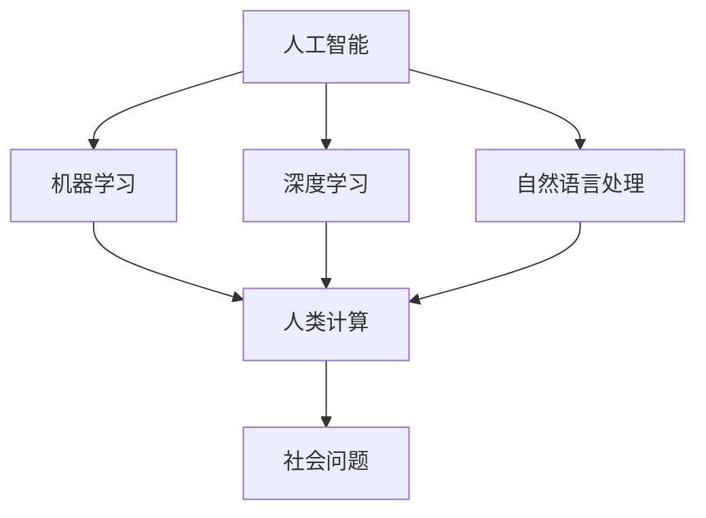

                 

关键词：科技向善，人类计算，社会问题，算法，数学模型，项目实践，应用场景，未来展望

> 摘要：本文旨在探讨如何利用人工智能和人类计算的优势，解决当前社会中存在的种种问题。通过对核心概念、算法原理、数学模型以及实际项目实践的深入分析，本文提出了科技向善的新路径，为未来科技发展提供了有益的启示。

## 1. 背景介绍

在当今科技迅猛发展的时代，人工智能（AI）已经成为改变社会的重要力量。从语音识别、图像处理到自动驾驶、医疗诊断，AI技术的应用已经深入到我们生活的方方面面。然而，AI的发展并非只是技术的进步，更重要的是如何将这些技术用于解决社会问题，实现科技向善。

科技向善是指利用科技创新来改善人类生活、解决社会问题的一种理念。与单纯追求技术突破不同，科技向善更加注重技术对社会的积极影响。例如，通过人工智能技术，我们可以更好地应对自然灾害、提高教育质量、减少贫困等。然而，要实现这一目标，不仅需要强大的技术支撑，还需要人类的智慧参与。

人类计算，即人类智慧和计算机能力的结合，是一种新型的计算模式。在这一模式下，人类和计算机相互协作，共同解决问题。例如，在人工智能算法的设计和优化过程中，人类专家可以发挥关键作用，提高算法的性能和效率。同样，在处理复杂问题时，计算机可以协助人类进行数据分析和决策支持。

本文将围绕科技向善的主题，探讨如何利用人类计算解决社会问题。首先，我们将介绍核心概念和原理，然后分析算法和数学模型，最后通过实际项目实践，展示科技向善的具体应用。

## 2. 核心概念与联系

### 2.1. 核心概念

在讨论科技向善和人类计算时，我们需要明确以下几个核心概念：

- **人工智能（AI）**：模拟人类智能的技术，包括机器学习、深度学习、自然语言处理等。

- **机器学习（ML）**：一种人工智能技术，通过数据驱动的方式，使计算机具备学习、推理和决策能力。

- **深度学习（DL）**：一种复杂的机器学习技术，通过多层神经网络，实现高效的图像、语音和文本识别。

- **自然语言处理（NLP）**：研究如何使计算机理解和生成自然语言的一门技术。

- **人类计算**：人类智慧和计算机能力的结合，包括人类专家的判断、经验、创造力和计算机的计算、分析、存储等能力。

- **社会问题**：当前社会中存在的各种挑战，如自然灾害、贫困、教育不平等、环境污染等。

### 2.2. 关联与联系

为了更好地理解这些概念之间的联系，我们可以使用Mermaid流程图（不包含括号、逗号等特殊字符）来展示它们之间的相互作用。



从图中可以看出，人工智能、机器学习、深度学习、自然语言处理等技术都是人类计算的重要组成部分，它们共同作用，为解决社会问题提供技术支持。而人类计算则通过结合人类的智慧和计算机的能力，实现更高效、更智能的解决问题的方式。

## 3. 核心算法原理 & 具体操作步骤

### 3.1 算法原理概述

在科技向善的背景下，核心算法原理的研究至关重要。本文将介绍一种具有代表性的算法——深度学习（DL）算法。深度学习是一种通过多层神经网络来实现复杂任务的人工智能技术，其原理如下：

1. **输入层（Input Layer）**：接收外部输入数据，如图像、语音、文本等。

2. **隐藏层（Hidden Layers）**：通过多个神经元（节点）进行特征提取和变换，每层神经元接收前一层的结果作为输入，并输出到下一层。

3. **输出层（Output Layer）**：根据隐藏层的输出，生成最终的结果，如分类结果、预测值等。

4. **权重（Weights）**：连接各层神经元的参数，用于调节输入数据在传递过程中的重要性。

5. **激活函数（Activation Function）**：对神经元输出进行非线性变换，使神经网络具备学习能力。

6. **反向传播（Backpropagation）**：通过比较预测结果与真实结果，计算各层神经元的误差，并反向传播更新权重。

### 3.2 算法步骤详解

1. **数据预处理**：对输入数据进行归一化、去噪、补全等处理，以提高算法性能。

2. **构建神经网络**：设计网络结构，包括层数、每层神经元个数、激活函数等。

3. **初始化权重**：随机初始化各层神经元的权重。

4. **前向传播（Forward Propagation）**：将输入数据传递到神经网络，得到输出结果。

5. **计算误差**：通过比较输出结果与真实结果，计算整体误差。

6. **反向传播**：根据误差，调整各层神经元的权重。

7. **优化算法**：采用梯度下降等优化算法，加速权重更新。

8. **迭代训练**：重复上述步骤，直到满足停止条件，如达到预设的训练轮数或误差阈值。

### 3.3 算法优缺点

深度学习算法具有以下优点：

- **强大的特征学习能力**：通过多层神经网络，能够自动提取复杂特征，提高模型性能。

- **广泛的应用领域**：在图像识别、语音识别、自然语言处理等领域具有显著优势。

- **自动特征提取**：省去了人工设计特征的过程，降低了模型复杂性。

深度学习算法也存在以下缺点：

- **训练成本高**：需要大量的数据和计算资源，训练时间较长。

- **过拟合风险**：当模型复杂度过高时，容易在训练数据上表现良好，但在测试数据上表现不佳。

- **参数调优困难**：需要大量实验和经验来调整模型参数，以获得最佳性能。

### 3.4 算法应用领域

深度学习算法在以下领域具有广泛的应用：

- **图像识别**：用于人脸识别、物体检测、图像分类等任务。

- **语音识别**：用于语音转文字、语音合成等任务。

- **自然语言处理**：用于机器翻译、情感分析、文本分类等任务。

- **医学诊断**：用于疾病诊断、药物研发等任务。

- **金融风控**：用于风险评估、欺诈检测等任务。

## 4. 数学模型和公式 & 详细讲解 & 举例说明

### 4.1 数学模型构建

在深度学习算法中，数学模型构建是关键步骤之一。本文将介绍一种常用的数学模型——多层感知机（MLP）。

#### 4.1.1 MLP模型构建

多层感知机是一种前馈神经网络，包括输入层、隐藏层和输出层。输入层接收外部输入数据，隐藏层通过非线性变换提取特征，输出层生成最终结果。

1. **输入层**：假设输入层有n个神经元，输入数据为\[x_1, x_2, ..., x_n\]。

2. **隐藏层**：假设隐藏层有m个神经元，每个神经元与输入层的所有神经元相连接，得到加权求和的结果。隐藏层的输出为\[z_1, z_2, ..., z_m\]。

3. **输出层**：假设输出层有k个神经元，每个神经元与隐藏层的所有神经元相连接，得到加权求和的结果。输出层的输出为\[y_1, y_2, ..., y_k\]。

4. **权重**：假设输入层到隐藏层的权重为\[w_{ij}\]，隐藏层到输出层的权重为\[v_{ji}\]。

5. **激活函数**：常用的激活函数有Sigmoid函数、ReLU函数等。

#### 4.1.2 公式推导

1. **前向传播**：

\[z_i = \sum_{j=1}^{n} w_{ij}x_j\]

\[y_i = \sigma(v_i'\cdot z_i)\]

其中，\(v_i'\)为隐藏层到输出层的权重，\(\sigma\)为激活函数。

2. **反向传播**：

计算输出误差：

\[E = \frac{1}{2}\sum_{i=1}^{k}(y_i - t_i)^2\]

计算隐藏层误差：

\[\delta_{ij} = \frac{\partial E}{\partial z_j} = (y_j - t_j)\sigma'(z_j)\]

更新权重：

\[w_{ij} = w_{ij} - \alpha \cdot x_j \cdot \delta_{ij}\]

\[v_{ji} = v_{ji} - \alpha \cdot z_j \cdot \delta_{i}\]

其中，\(\alpha\)为学习率，\(\sigma'\)为激活函数的导数。

### 4.2 公式推导过程

#### 4.2.1 前向传播推导

假设输入层有n个神经元，隐藏层有m个神经元，输出层有k个神经元。

1. **输入层到隐藏层的权重**：

\[w_{ij} = \text{random()} \quad (1 \leq i \leq m, 1 \leq j \leq n)\]

2. **隐藏层到输出层的权重**：

\[v_{ji} = \text{random()} \quad (1 \leq j \leq m, 1 \leq i \leq k)\]

3. **隐藏层输出**：

\[z_i = \sum_{j=1}^{n} w_{ij}x_j \quad (1 \leq i \leq m)\]

4. **输出层输出**：

\[y_i = \sigma(z_i) \quad (1 \leq i \leq k)\]

其中，\(\sigma\)为激活函数，如Sigmoid函数：

\[\sigma(z) = \frac{1}{1 + e^{-z}}\]

#### 4.2.2 反向传播推导

1. **计算输出误差**：

\[E = \frac{1}{2}\sum_{i=1}^{k}(y_i - t_i)^2\]

其中，\(t_i\)为真实标签。

2. **计算输出层误差**：

\[\delta_i = \frac{\partial E}{\partial y_i} = y_i - t_i\]

3. **计算隐藏层误差**：

\[\delta_i = \delta_i \cdot \sigma'(z_i) = (y_i - t_i) \cdot \sigma'(z_i)\]

4. **更新权重**：

\[w_{ij} = w_{ij} - \alpha \cdot x_j \cdot \delta_i\]

\[v_{ji} = v_{ji} - \alpha \cdot z_i \cdot \delta_i\]

其中，\(\alpha\)为学习率。

### 4.3 案例分析与讲解

#### 4.3.1 问题背景

假设我们有一个二分类问题，输入数据为图像，输出为类别标签。数据集包含1000张图片，其中500张为正样本，500张为负样本。我们需要使用多层感知机（MLP）模型进行分类。

#### 4.3.2 数据预处理

1. **图像数据归一化**：

将图像数据归一化到\[0, 1\]区间，以适应MLP模型。

2. **标签编码**：

将类别标签进行二进制编码，如正样本标签为\[1, 0\]，负样本标签为\[0, 1\]。

#### 4.3.3 模型构建

1. **输入层**：

输入层有784个神经元，对应图像的像素值。

2. **隐藏层**：

隐藏层有100个神经元，采用ReLU激活函数。

3. **输出层**：

输出层有2个神经元，对应类别标签。

#### 4.3.4 模型训练

1. **随机初始化权重**：

将输入层到隐藏层的权重随机初始化，范围在\[-1, 1\]之间。

2. **前向传播**：

计算隐藏层输出和输出层输出。

3. **计算误差**：

计算输出误差，用于更新权重。

4. **反向传播**：

计算隐藏层误差和输出层误差，更新权重。

5. **迭代训练**：

重复上述步骤，直到达到预设的训练轮数或误差阈值。

#### 4.3.5 模型评估

1. **验证集评估**：

使用验证集评估模型性能，计算准确率、召回率、F1值等指标。

2. **测试集评估**：

使用测试集评估模型性能，以验证模型的泛化能力。

## 5. 项目实践：代码实例和详细解释说明

### 5.1 开发环境搭建

在本文的项目实践中，我们将使用Python编程语言和相关的深度学习库，如TensorFlow和Keras，来构建和训练多层感知机（MLP）模型。

#### 5.1.1 环境准备

1. **安装Python**：

确保Python版本在3.6及以上。

2. **安装TensorFlow**：

使用pip命令安装TensorFlow：

```bash
pip install tensorflow
```

3. **安装Keras**：

使用pip命令安装Keras：

```bash
pip install keras
```

### 5.2 源代码详细实现

以下是多层感知机（MLP）模型的源代码实现：

```python
import numpy as np
import tensorflow as tf
from tensorflow.keras import layers

# 数据预处理
def preprocess_data(images, labels):
    images = images / 255.0
    labels = tf.keras.utils.to_categorical(labels)
    return images, labels

# 构建模型
def build_model(input_shape, num_classes):
    model = tf.keras.Sequential([
        layers.Dense(128, activation='relu', input_shape=input_shape),
        layers.Dense(64, activation='relu'),
        layers.Dense(num_classes, activation='softmax')
    ])
    return model

# 训练模型
def train_model(model, images, labels, epochs=10, batch_size=32):
    model.compile(optimizer='adam', loss='categorical_crossentropy', metrics=['accuracy'])
    model.fit(images, labels, epochs=epochs, batch_size=batch_size)

# 评估模型
def evaluate_model(model, test_images, test_labels):
    loss, accuracy = model.evaluate(test_images, test_labels)
    print(f"Test accuracy: {accuracy:.4f}")

# 主函数
def main():
    # 加载数据
    (train_images, train_labels), (test_images, test_labels) = tf.keras.datasets.mnist.load_data()

    # 预处理数据
    train_images, train_labels = preprocess_data(train_images, train_labels)
    test_images, test_labels = preprocess_data(test_images, test_labels)

    # 构建模型
    model = build_model(input_shape=(28, 28), num_classes=10)

    # 训练模型
    train_model(model, train_images, train_labels, epochs=10)

    # 评估模型
    evaluate_model(model, test_images, test_labels)

if __name__ == "__main__":
    main()
```

### 5.3 代码解读与分析

以下是代码的详细解读与分析：

1. **数据预处理**：

```python
def preprocess_data(images, labels):
    images = images / 255.0
    labels = tf.keras.utils.to_categorical(labels)
    return images, labels
```

该函数用于对图像数据和标签进行预处理。首先，将图像数据归一化到\[0, 1\]区间，然后使用to_categorical函数将标签进行二进制编码。

2. **构建模型**：

```python
def build_model(input_shape, num_classes):
    model = tf.keras.Sequential([
        layers.Dense(128, activation='relu', input_shape=input_shape),
        layers.Dense(64, activation='relu'),
        layers.Dense(num_classes, activation='softmax')
    ])
    return model
```

该函数用于构建多层感知机（MLP）模型。模型包含三个层

