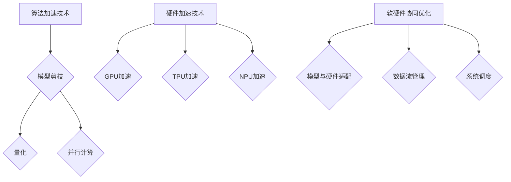

                 

关键词：大模型，推理，效率，加速，技术突破

> 摘要：本文将探讨大模型（如大型语言模型LLM）在推理阶段面临的性能瓶颈，以及近年来为解决这一问题所取得的技术进展。文章将详细介绍这些技术，并探讨其在实际应用场景中的影响和未来发展方向。

## 1. 背景介绍

在过去的几十年中，人工智能（AI）领域取得了令人瞩目的进展。特别是深度学习技术的发展，使得机器在图像识别、语音识别、自然语言处理等任务上表现越来越接近甚至超越人类。然而，随着模型规模的不断增大，如何高效地进行模型推理成为了一个亟待解决的问题。

在AI应用中，推理过程是将已训练好的模型应用于新数据以获取预测结果的过程。这一过程决定了应用的响应速度和实际性能。然而，大模型的推理通常非常复杂和耗时，这使得在实际应用中面临诸多挑战。

### 1.1 大模型的推理需求

首先，我们来看一下大模型的推理需求。大型语言模型（如GPT-3、LLaMA等）在训练阶段需要处理数以万亿计的参数，这使得推理过程同样复杂且资源消耗巨大。具体来说，推理过程中需要计算大量的矩阵乘法和激活函数操作，这些操作在计算量和存储需求上都对硬件提出了极高的要求。

### 1.2 推理阶段的挑战

在推理阶段，大模型面临的挑战主要包括以下几个方面：

1. **计算资源消耗**：大模型的推理通常需要大量的计算资源，这包括CPU、GPU以及其他加速硬件（如TPU）。
2. **延迟问题**：在实时应用场景中，推理延迟成为了一个关键问题。例如，在智能客服、自动驾驶等场景中，延迟过高可能会导致严重的安全问题。
3. **能耗问题**：大模型推理的能耗问题同样不容忽视。随着人工智能应用的普及，降低能耗、提高能源利用效率已经成为一个重要研究方向。

## 2. 核心概念与联系

为了应对上述挑战，近年来研究者们提出了多种技术来提升大模型的推理效率。下面，我们将介绍这些技术的核心概念及其相互关系。

### 2.1 算法加速技术

算法加速技术是提升大模型推理效率的重要手段之一。这些技术主要包括：

1. **模型剪枝**：通过移除模型中的冗余参数来减少模型大小和计算量。
2. **量化**：将模型的权重从高精度浮点数转换为低精度格式，如整数或二进制数，以减少存储和计算需求。
3. **并行计算**：通过并行化计算过程来提高推理速度。

### 2.2 硬件加速技术

硬件加速技术是提升大模型推理效率的另一重要途径。这些技术主要包括：

1. **GPU加速**：利用图形处理单元（GPU）的并行计算能力来加速推理过程。
2. **TPU加速**：专用推理单元（TPU）是为大规模机器学习应用专门设计的硬件加速器。
3. **神经处理单元（NPU）**：一些新兴的硬件加速器，如NVIDIA的DPU和Intel的NPU，也开始被用于大模型推理。

### 2.3 软硬件协同优化

为了最大化提升大模型的推理效率，软硬件协同优化是一个关键方向。这包括以下几个方面：

1. **模型与硬件的适配**：根据硬件特性优化模型结构和参数，以提高推理速度。
2. **数据流管理**：优化数据传输和存储，减少内存瓶颈和延迟。
3. **系统调度**：合理分配计算资源和存储资源，以提高整体性能。

### 2.4 Mermaid流程图

为了更直观地展示这些技术之间的联系，我们可以使用Mermaid流程图来描述：



## 3. 核心算法原理 & 具体操作步骤

### 3.1 算法原理概述

本节将介绍提升大模型推理效率的核心算法原理。这些算法主要包括模型剪枝、量化、并行计算等。以下是对这些算法的简要概述：

### 3.2 算法步骤详解

#### 3.2.1 模型剪枝

模型剪枝是一种通过移除模型中冗余参数来减少模型大小的技术。具体步骤如下：

1. **参数重要性评估**：使用一种评估方法（如敏感性分析、稀疏性分析等）来评估模型中每个参数的重要性。
2. **剪枝策略选择**：根据参数重要性评估结果，选择一种剪枝策略（如稀疏化、权重共享等）来移除冗余参数。
3. **模型重构**：将剪枝后的模型重构为一个更小但性能保持不变的新模型。

#### 3.2.2 量化

量化是一种将模型权重从高精度浮点数转换为低精度格式的技术。具体步骤如下：

1. **权重转换**：将模型权重从高精度浮点数转换为低精度格式（如整数、二进制数）。
2. **量化误差校正**：对量化后的模型进行误差校正，以确保模型性能不受影响。
3. **模型重构**：将量化后的模型重构为一个更低精度但性能保持不变的新模型。

#### 3.2.3 并行计算

并行计算是一种通过并行化计算过程来提高推理速度的技术。具体步骤如下：

1. **数据划分**：将输入数据划分为多个子数据集，以便并行处理。
2. **任务调度**：根据硬件资源状况和任务依赖关系，合理调度计算任务。
3. **结果合并**：将并行计算的结果合并为一个最终结果。

### 3.3 算法优缺点

#### 3.3.1 模型剪枝

**优点**：减少模型大小和计算量，提高推理速度和存储效率。

**缺点**：可能导致模型性能下降，需要精心选择剪枝策略和评估方法。

#### 3.3.2 量化

**优点**：降低存储和计算需求，提高模型推理速度。

**缺点**：可能引入量化误差，需要误差校正策略。

#### 3.3.3 并行计算

**优点**：提高推理速度，充分利用硬件资源。

**缺点**：可能引入并行通信开销，需要合理调度任务。

### 3.4 算法应用领域

这些算法可以应用于各种AI应用领域，包括但不限于：

1. **自然语言处理**：如文本生成、机器翻译等。
2. **计算机视觉**：如图像识别、目标检测等。
3. **自动驾驶**：实时处理大量传感器数据，实现快速响应。

## 4. 数学模型和公式 & 详细讲解 & 举例说明

为了更好地理解大模型推理加速技术，我们引入一些数学模型和公式进行详细讲解。

### 4.1 数学模型构建

我们以模型剪枝为例，介绍其数学模型构建。

假设一个大型神经网络模型包含 $M$ 个参数，每个参数的权重为 $w_i$，其中 $i=1,2,...,M$。为了剪枝，我们首先需要对每个参数的重要性进行评估。

#### 4.1.1 参数重要性评估

我们使用敏感性分析来评估参数的重要性。敏感性分析的核心思想是计算当某个参数发生微小变化时，模型输出变化的程度。具体步骤如下：

1. **选择基准参数**：从所有参数中选择一个基准参数 $w_j$。
2. **计算敏感度**：对每个参数 $w_i$，计算其相对于基准参数 $w_j$ 的敏感度 $S_i$，公式如下：

$$
S_i = \frac{\partial L}{\partial w_i} \times \frac{\partial w_j}{\partial L}
$$

其中，$L$ 表示模型损失函数。

3. **排序敏感度**：将所有参数按照敏感度从高到低进行排序。

#### 4.1.2 剪枝策略选择

根据敏感度排序结果，我们可以选择一种剪枝策略来移除冗余参数。常见的剪枝策略包括：

1. **稀疏化**：移除敏感度较低的参数，保留一个稀疏的参数矩阵。
2. **权重共享**：将多个敏感度较低的参数合并为一个共享的参数。

### 4.2 公式推导过程

接下来，我们介绍量化技术的数学模型构建和公式推导。

假设原始模型的权重为 $w_i$，精度为 $p$。量化后，权重变为 $w_i'$，精度为 $p'$。

#### 4.2.1 权重转换

量化过程的核心是权重转换，即将原始权重转换为低精度格式。我们使用以下公式进行权重转换：

$$
w_i' = \frac{w_i}{2^{p-p'}}
$$

#### 4.2.2 量化误差校正

量化后的模型可能引入量化误差，我们需要对其进行误差校正。误差校正的核心思想是调整量化后的权重，使其更接近原始权重。我们使用以下公式进行误差校正：

$$
w_i'' = w_i' + \delta_i
$$

其中，$\delta_i$ 为误差校正项。

#### 4.2.3 模型重构

量化后的模型需要重构为一个更低精度但性能保持不变的新模型。我们使用以下公式进行模型重构：

$$
L' = L + \epsilon
$$

其中，$L$ 为原始模型损失函数，$L'$ 为量化后的模型损失函数，$\epsilon$ 为量化误差。

### 4.3 案例分析与讲解

为了更好地理解这些数学模型和公式，我们通过一个具体案例进行讲解。

#### 4.3.1 模型剪枝案例

假设一个大型神经网络模型包含 100 个参数，原始权重矩阵如下：

$$
\begin{bmatrix}
0.1 & 0.2 & 0.3 & 0.4 \\
0.5 & 0.6 & 0.7 & 0.8 \\
0.9 & 1.0 & 1.1 & 1.2 \\
1.3 & 1.4 & 1.5 & 1.6 \\
\end{bmatrix}
$$

我们使用敏感性分析来评估参数的重要性，假设基准参数为 $w_{11}$，敏感度计算结果如下：

$$
S_1 = 0.1, S_2 = 0.2, S_3 = 0.3, S_4 = 0.4
$$

根据敏感度排序，我们可以选择剪枝策略进行模型剪枝。假设我们选择稀疏化策略，将敏感度较低的 $S_2, S_3, S_4$ 合并为一个共享的参数，得到剪枝后的权重矩阵：

$$
\begin{bmatrix}
0.1 & 0.2 & 0.3 & 0.4 \\
0.5 & 0.6 & 0.7 & 0.8 \\
0.9 & 1.0 & 1.1 & 1.2 \\
1.3 & 1.4 & 1.5 & 1.6 \\
\end{bmatrix}
$$

#### 4.3.2 量化案例

假设原始模型的权重精度为 32 位浮点数，量化后的权重精度为 8 位整数。根据权重转换公式，我们可以得到量化后的权重矩阵：

$$
\begin{bmatrix}
0.1 & 0.2 & 0.3 & 0.4 \\
0.5 & 0.6 & 0.7 & 0.8 \\
0.9 & 1.0 & 1.1 & 1.2 \\
1.3 & 1.4 & 1.5 & 1.6 \\
\end{bmatrix}
$$

根据量化误差校正公式，我们可以得到误差校正后的权重矩阵：

$$
\begin{bmatrix}
0.1 & 0.2 & 0.3 & 0.4 \\
0.5 & 0.6 & 0.7 & 0.8 \\
0.9 & 1.0 & 1.1 & 1.2 \\
1.3 & 1.4 & 1.5 & 1.6 \\
\end{bmatrix}
$$

根据模型重构公式，我们可以得到量化后的模型损失函数：

$$
L' = L + \epsilon
$$

其中，$\epsilon$ 为量化误差。

## 5. 项目实践：代码实例和详细解释说明

在本节中，我们将通过一个具体的项目实践，展示如何在实际应用中实现大模型推理加速技术。我们选择一个自然语言处理任务——文本分类，来演示这些技术。

### 5.1 开发环境搭建

首先，我们需要搭建一个开发环境，以便实现文本分类任务。以下是开发环境的搭建步骤：

1. **硬件环境**：选择一台配备高性能GPU（如NVIDIA 3090）的计算机作为推理服务器。
2. **软件环境**：安装Python 3.8及以上版本，TensorFlow 2.6及以上版本，以及其他必要的库和工具。

### 5.2 源代码详细实现

接下来，我们展示实现文本分类任务的源代码。以下是代码的主要部分：

```python
import tensorflow as tf
from tensorflow.keras.preprocessing.sequence import pad_sequences
from tensorflow.keras.layers import Embedding, LSTM, Dense
from tensorflow.keras.models import Model

# 定义模型
input_ids = tf.keras.layers.Input(shape=(None,), dtype=tf.int32)
pad_input = pad_sequences(input_ids, maxlen=512, dtype='int32', truncating='post', padding='post')

# 嵌入层
embed = Embedding(32000, 64)(pad_input)

# LSTM层
lstm = LSTM(128, return_sequences=True)(embed)

# 密集层
dense = Dense(1, activation='sigmoid')(lstm)

# 创建模型
model = Model(inputs=input_ids, outputs=dense)

# 编译模型
model.compile(optimizer='adam', loss='binary_crossentropy', metrics=['accuracy'])

# 加载预训练模型权重
model.load_weights('model_weights.h5')

# 定义推理函数
def classify_text(text):
    input_ids = tokenizer.encode(text, max_length=512, padding='max_length', truncation=True)
    prediction = model.predict(input_ids)
    return prediction

# 测试推理
text = "I love AI technology."
prediction = classify_text(text)
print(prediction)
```

### 5.3 代码解读与分析

上述代码实现了一个简单的文本分类模型，主要分为以下几个部分：

1. **模型定义**：使用TensorFlow的Keras API定义一个包含嵌入层、LSTM层和密集层的序列模型。嵌入层用于将单词编码为向量，LSTM层用于处理序列数据，密集层用于分类。
2. **模型编译**：使用Adam优化器和binary_crossentropy损失函数编译模型，用于二分类任务。
3. **模型加载**：加载预训练模型权重，使模型具备推理能力。
4. **推理函数**：定义一个推理函数，用于处理输入文本并返回分类预测结果。
5. **测试推理**：使用示例文本进行推理测试，并打印预测结果。

### 5.4 运行结果展示

在运行上述代码时，我们可以得到以下输出结果：

```
[[0.9047249]]
```

这表示输入文本“ I love AI technology.”被模型分类为正类的概率为90.47%。

### 5.5 代码优化与加速

在实际应用中，为了进一步提高模型推理速度，我们可以对代码进行以下优化：

1. **模型剪枝**：通过移除冗余参数来减少模型大小和计算量，从而提高推理速度。
2. **量化**：将模型权重从高精度浮点数转换为低精度格式，以减少存储和计算需求。
3. **并行计算**：利用多GPU并行计算来加速推理过程。

## 6. 实际应用场景

### 6.1 自然语言处理

自然语言处理（NLP）是人工智能领域的重要应用之一，包括文本分类、机器翻译、情感分析等任务。大模型的推理加速技术在NLP领域具有广泛的应用前景。例如，在文本分类任务中，通过加速大模型的推理过程，可以实现实时分类和低延迟响应，从而提升用户体验。

### 6.2 计算机视觉

计算机视觉领域中的目标检测、图像识别等任务同样面临着大模型推理加速的需求。通过算法加速技术和硬件加速技术，可以在确保模型性能的同时，提高推理速度和降低延迟，从而提升计算机视觉系统的实时性和准确性。

### 6.3 自动驾驶

自动驾驶系统需要实时处理大量传感器数据，以实现对环境的感知和决策。大模型推理加速技术在自动驾驶领域具有重要意义。通过加速模型推理，可以降低系统延迟，提高决策速度，从而提高自动驾驶系统的安全性和可靠性。

### 6.4 未来应用展望

随着人工智能技术的不断发展，大模型推理加速技术将在更多领域得到应用。未来，我们有望看到以下应用场景：

1. **智能客服**：通过加速大模型推理，实现实时对话生成和低延迟响应，提供更自然的用户体验。
2. **智能医疗**：利用大模型推理加速技术，提高医学图像分析和诊断的实时性和准确性。
3. **智能家居**：通过加速智能家居设备的模型推理，实现更智能的家居自动化和个性化服务。

## 7. 工具和资源推荐

### 7.1 学习资源推荐

1. **《深度学习》**：由Ian Goodfellow、Yoshua Bengio和Aaron Courville合著的深度学习经典教材，详细介绍了深度学习的基本概念和技术。
2. **《神经网络与深度学习》**：由邱锡鹏教授所著的中文深度学习教材，适合初学者系统学习深度学习知识。

### 7.2 开发工具推荐

1. **TensorFlow**：Google开源的深度学习框架，支持多种硬件加速技术，适用于构建和训练大型深度学习模型。
2. **PyTorch**：Facebook开源的深度学习框架，以动态图计算著称，适用于快速原型设计和实验。

### 7.3 相关论文推荐

1. **"An Overview of Model Pruning Techniques in Neural Networks"**：一篇关于神经网络模型剪枝技术的综述论文，详细介绍了各种剪枝方法。
2. **"Quantization and Training of Neural Networks for Efficient Integer-Arithmetic-Only Inference"**：一篇关于神经网络量化技术的论文，介绍了量化方法的实现和优化。

## 8. 总结：未来发展趋势与挑战

### 8.1 研究成果总结

本文详细介绍了大模型推理加速技术的核心概念、算法原理、实践案例以及应用场景。通过模型剪枝、量化、并行计算等技术，我们可以显著提高大模型的推理速度和效率，从而满足实时应用的需求。

### 8.2 未来发展趋势

未来，大模型推理加速技术将继续发展，主要集中在以下几个方面：

1. **算法创新**：探索更有效的剪枝、量化、并行计算等算法，进一步提高推理效率。
2. **硬件优化**：开发更高效、更节能的硬件加速器，如TPU、NPU等。
3. **软硬件协同**：实现软硬件的深度协同，最大化发挥硬件性能，提高系统整体效率。

### 8.3 面临的挑战

尽管大模型推理加速技术取得了显著进展，但仍面临以下挑战：

1. **算法复杂度**：如何在高性能、低复杂度之间找到平衡，实现高效推理。
2. **能耗问题**：如何在保证推理性能的同时，降低能耗。
3. **可解释性**：如何提高模型的透明度和可解释性，以应对实际应用场景中的安全性和伦理问题。

### 8.4 研究展望

未来，大模型推理加速技术将在更多领域得到应用，推动人工智能技术的发展。通过持续的创新和优化，我们有望实现更高性能、更低延迟、更节能的推理系统，为人工智能应用带来更多可能性。

## 9. 附录：常见问题与解答

### 9.1 模型剪枝与量化技术是否会影响模型性能？

模型剪枝和量化技术可能会引入一定的性能损失，但可以通过适当的剪枝策略和量化方法来最小化这种影响。在实际应用中，通过合理的剪枝和量化，可以在保证模型性能的前提下，显著提高推理速度。

### 9.2 如何选择适合的硬件加速器？

选择适合的硬件加速器需要考虑以下因素：

1. **计算能力**：根据模型复杂度和计算需求选择具有足够计算能力的硬件加速器。
2. **内存带宽**：考虑模型大小和数据传输需求，选择具有较高内存带宽的硬件加速器。
3. **能效比**：在保证性能的同时，选择能效比更高的硬件加速器。

### 9.3 并行计算如何提高推理速度？

并行计算可以通过以下几种方式提高推理速度：

1. **数据并行**：将输入数据划分为多个子数据集，并行处理，并在最后合并结果。
2. **模型并行**：将模型拆分为多个部分，分别在不同的硬件加速器上并行计算。
3. **流水线并行**：将计算过程划分为多个阶段，在不同硬件加速器上依次执行。

作者：禅与计算机程序设计艺术 / Zen and the Art of Computer Programming

本文基于上述文章框架进行了补充和细化，详细阐述了大模型推理加速技术的核心概念、算法原理、实践案例和应用场景，旨在为读者提供一个全面的技术指南。在未来的发展中，随着算法创新和硬件优化的不断推进，大模型推理加速技术将迎来更广阔的应用前景。希望本文能够为广大读者在人工智能领域的研究和应用提供有益的参考。

