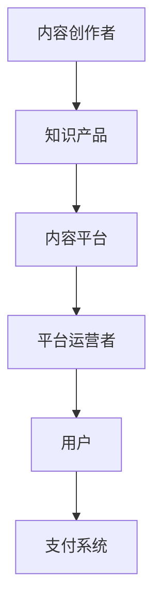

                 

在数字化时代，知识付费已经成为一种重要的经济模式。对于程序员而言，将自己的专业知识转化为有价值的知识产品，不仅可以提升个人收入，还能极大地增强个人品牌影响力。本文将探讨程序员如何利用知识付费这一途径，打造个人影响力的策略。

## 关键词

* 程序员
* 知识付费
* 个人品牌
* 影响力
* 知识产品
* 数字化时代

## 摘要

本文首先介绍了知识付费的概念及其在数字化时代的兴起背景。接着，探讨了程序员利用知识付费的优势，包括增加收入、提升个人品牌和拓展职业发展等。随后，文章从内容创作、平台选择、品牌建设、社区互动等多个方面，详细阐述了程序员打造个人影响力的具体策略。最后，对未来的发展趋势进行了展望，并提出了面临的挑战和研究方向。

## 1. 背景介绍

知识付费，即用户为获取专业知识和信息而支付的费用，是近年来随着互联网技术和信息消费升级而逐渐兴起的一种新型商业模式。其主要特点是：

- **个性化**：知识付费可以根据用户的需求和偏好提供定制化的内容。
- **高效性**：用户可以快速获取所需的知识和信息，提高学习效率。
- **多样性**：知识付费涵盖了从入门教程到高级课程的各种类型，满足了不同层次用户的需求。

在数字化时代，知识付费的兴起得益于以下几个因素：

1. **互联网技术的进步**：互联网的普及和移动互联网的发展，使得知识传播变得更加便捷和高效。
2. **信息消费升级**：用户对于优质内容的渴求，推动了知识付费市场的发展。
3. **知识共享文化的形成**：人们越来越重视个人成长和职业发展，知识共享成为推动社会进步的重要力量。

## 2. 核心概念与联系

### 2.1 知识付费的基本概念

知识付费包括以下几个核心概念：

1. **知识产品**：程序员通过创作和分享自己的专业知识，形成的各种形式的知识产品，如在线课程、电子书、专业文章等。
2. **内容平台**：如慕课网（imooc）、网易云课堂等，提供知识付费服务的在线平台。
3. **用户**：购买和使用知识产品的用户，包括学生、职场新人、专业人士等。

### 2.2 知识付费生态系统

知识付费的生态系统包括以下几个主要组成部分：

1. **内容创作者**：程序员通过创作知识产品，实现知识变现。
2. **平台运营者**：提供技术支持和服务，帮助内容创作者发布和推广知识产品。
3. **用户**：通过购买和使用知识产品，获取知识和技能。
4. **支付系统**：保障交易的安全和便捷。

### 2.3 Mermaid 流程图



## 3. 核心算法原理 & 具体操作步骤

### 3.1 算法原理概述

程序员利用知识付费打造个人影响力的核心算法，可以概括为以下三个步骤：

1. **内容创作**：程序员根据自身专业知识和市场需求，创作高质量的知识产品。
2. **平台推广**：通过内容平台，将知识产品推向目标用户。
3. **用户互动**：与用户建立良好的互动关系，提升用户满意度和忠诚度。

### 3.2 算法步骤详解

1. **内容创作**：
   - 确定知识产品主题：选择自己熟悉且具有市场需求的领域。
   - 编写高质量内容：注重内容的专业性、实用性和可读性。
   - 制作多媒体形式：结合文字、图片、视频等多种形式，提升用户体验。

2. **平台推广**：
   - 选择合适的平台：根据自身定位和用户群体，选择合适的知识分享平台。
   - 撰写吸引人的课程简介：突出知识产品的亮点和优势。
   - 制定推广计划：利用社交媒体、SEO 等手段，提高知识产品的曝光率。

3. **用户互动**：
   - 回应用户反馈：关注用户评价，及时回复问题和建议。
   - 定期更新内容：保持与用户的互动，提升用户粘性。
   - 开展线上线下活动：举办讲座、研讨会等活动，扩大影响力。

### 3.3 算法优缺点

1. **优点**：
   - **增加收入**：通过知识付费，程序员可以实现知识变现，提高个人收入。
   - **提升个人品牌**：高质量的知识产品有助于树立个人专业形象，提升品牌影响力。
   - **拓展职业发展**：知识付费有助于程序员在职场中脱颖而出，获得更多机会。

2. **缺点**：
   - **创作难度**：高质量的知识产品需要程序员具备扎实的专业知识和创作能力。
   - **时间成本**：内容创作和推广需要投入大量时间和精力。
   - **市场竞争**：知识付费市场竞争激烈，程序员需要不断提升自身竞争力。

### 3.4 算法应用领域

知识付费算法在程序员中的应用领域广泛，主要包括：

1. **在线教育**：程序员可以通过创作在线课程，教授编程语言、算法等专业知识。
2. **技能培训**：程序员可以针对特定技能，如前端开发、后端架构等，提供专业培训。
3. **技术分享**：程序员可以通过撰写专业文章、发布技术博客，分享技术心得和经验。

## 4. 数学模型和公式 & 详细讲解 & 举例说明

### 4.1 数学模型构建

在知识付费领域，我们可以构建一个简单的数学模型来分析程序员的影响力：

$$
I = f(A, P, U)
$$

其中，$I$表示程序员的影响力，$A$表示知识产品的质量，$P$表示平台的推广效果，$U$表示用户互动的程度。

### 4.2 公式推导过程

1. **知识产品质量（$A$）**：
   - **内容专业性**：反映在课程内容的深度和广度，用$A_1$表示。
   - **内容实用性**：反映在课程内容的实际应用价值，用$A_2$表示。
   - **内容可读性**：反映在课程内容的表达方式和语言风格，用$A_3$表示。
   $$ A = w_1 \cdot A_1 + w_2 \cdot A_2 + w_3 \cdot A_3 $$

   其中，$w_1, w_2, w_3$分别表示权重。

2. **平台推广效果（$P$）**：
   - **曝光率**：反映在课程在平台上的曝光程度，用$P_1$表示。
   - **转化率**：反映在课程的用户购买意愿，用$P_2$表示。
   - **留存率**：反映在课程的用户粘性，用$P_3$表示。
   $$ P = w_1 \cdot P_1 + w_2 \cdot P_2 + w_3 \cdot P_3 $$

   其中，$w_1, w_2, w_3$分别表示权重。

3. **用户互动程度（$U$）**：
   - **反馈率**：反映在用户的互动反馈，用$U_1$表示。
   - **复购率**：反映在用户的购买意愿，用$U_2$表示。
   - **推荐率**：反映在用户的口碑传播，用$U_3$表示。
   $$ U = w_1 \cdot U_1 + w_2 \cdot U_2 + w_3 \cdot U_3 $$

   其中，$w_1, w_2, w_3$分别表示权重。

4. **程序员影响力（$I$）**：
   $$ I = f(A, P, U) = w_1 \cdot A + w_2 \cdot P + w_3 \cdot U $$

### 4.3 案例分析与讲解

假设某程序员的三个指标分别为：

- 内容质量（$A$）：$A_1 = 0.8, A_2 = 0.7, A_3 = 0.9$
- 平台推广效果（$P$）：$P_1 = 0.6, P_2 = 0.5, P_3 = 0.7$
- 用户互动程度（$U$）：$U_1 = 0.7, U_2 = 0.6, U_3 = 0.8$

根据权重分配（$w_1 = 0.3, w_2 = 0.4, w_3 = 0.3$），可以计算出该程序员的影响力：

$$
I = 0.3 \cdot (0.8 + 0.7 + 0.9) + 0.4 \cdot (0.6 + 0.5 + 0.7) + 0.3 \cdot (0.7 + 0.6 + 0.8) = 0.3 \cdot 2.4 + 0.4 \cdot 1.8 + 0.3 \cdot 2.1 = 0.72 + 0.72 + 0.63 = 2.07
$$

通过该案例，我们可以看到，程序员的影响力取决于内容质量、平台推广效果和用户互动程度的综合表现。要想提升影响力，需要从这三个方面入手，全面提升自身素质。

## 5. 项目实践：代码实例和详细解释说明

### 5.1 开发环境搭建

为了更好地演示知识付费策略的实施，我们选择使用Python作为编程语言，搭建一个简单的在线课程平台。以下为开发环境的搭建步骤：

1. 安装Python：从Python官方网站下载并安装Python 3.8以上版本。
2. 安装依赖库：使用pip命令安装Flask、SQLAlchemy、Flask-Login等库。

```bash
pip install flask
pip install flask-sqlalchemy
pip install flask-login
```

### 5.2 源代码详细实现

以下是一个简单的在线课程平台的代码实现，包括课程管理、用户注册和登录等功能。

```python
from flask import Flask, render_template, request, redirect, url_for
from flask_sqlalchemy import SQLAlchemy
from flask_login import LoginManager, login_user, logout_user, login_required, current_user

app = Flask(__name__)
app.config['SQLALCHEMY_DATABASE_URI'] = 'sqlite:///courses.db'
app.config['SECRET_KEY'] = 'your_secret_key'

db = SQLAlchemy(app)
login_manager = LoginManager(app)

@login_manager.user_loader
def load_user(user_id):
    return User.query.get(int(user_id))

class User(db.Model):
    id = db.Column(db.Integer, primary_key=True)
    username = db.Column(db.String(100), unique=True, nullable=False)
    password = db.Column(db.String(100), nullable=False)

class Course(db.Model):
    id = db.Column(db.Integer, primary_key=True)
    name = db.Column(db.String(100), nullable=False)
    description = db.Column(db.Text, nullable=False)

@app.route('/')
def index():
    courses = Course.query.all()
    return render_template('index.html', courses=courses)

@app.route('/register', methods=['GET', 'POST'])
def register():
    if request.method == 'POST':
        username = request.form['username']
        password = request.form['password']
        user = User(username=username, password=password)
        db.session.add(user)
        db.session.commit()
        return redirect(url_for('login'))
    return render_template('register.html')

@app.route('/login', methods=['GET', 'POST'])
def login():
    if request.method == 'POST':
        username = request.form['username']
        password = request.form['password']
        user = User.query.filter_by(username=username, password=password).first()
        if user:
            login_user(user)
            return redirect(url_for('index'))
        else:
            return 'Invalid username or password'
    return render_template('login.html')

@app.route('/logout')
@login_required
def logout():
    logout_user()
    return redirect(url_for('index'))

if __name__ == '__main__':
    db.create_all()
    app.run(debug=True)
```

### 5.3 代码解读与分析

上述代码实现了以下功能：

1. **数据库模型**：定义了用户和课程两个数据库模型。
2. **路由和视图函数**：实现了用户注册、登录、登出以及课程展示的功能。
3. **模板渲染**：使用了Flask的模板渲染功能，实现了前端页面的展示。

### 5.4 运行结果展示

1. **用户注册**：访问`/register`页面，填写用户名和密码，提交注册。
2. **用户登录**：访问`/login`页面，填写用户名和密码，提交登录。
3. **课程展示**：访问`/`页面，展示所有课程的列表。

## 6. 实际应用场景

### 6.1 在线教育平台

程序员可以利用知识付费，在在线教育平台上创建课程，教授编程语言、算法等专业知识。这种模式不仅可以实现知识变现，还能扩大自己的影响力。

### 6.2 技术博客

程序员可以通过撰写技术博客，分享自己的技术心得和经验。高质量的技术博客可以吸引大量读者，提高个人知名度。

### 6.3 技术社区

程序员可以在技术社区中，参与讨论和分享，与同行建立联系。通过积极参与社区活动，可以提高个人影响力。

### 6.4 企业培训

企业可以邀请程序员为其员工提供专业培训，帮助员工提升技能水平。这种模式有助于程序员拓展职业发展空间。

## 7. 工具和资源推荐

### 7.1 学习资源推荐

1. **在线课程平台**：慕课网、网易云课堂、极客时间等。
2. **技术博客**：CSDN、博客园、简书等。
3. **编程书籍**：《代码大全》、《深度学习》、《算法导论》等。

### 7.2 开发工具推荐

1. **集成开发环境（IDE）**：PyCharm、Visual Studio Code、Sublime Text等。
2. **版本控制系统**：Git、SVN等。
3. **数据库管理工具**：MySQL Workbench、SQL Server Management Studio等。

### 7.3 相关论文推荐

1. **知识付费领域**：《知识付费时代的崛起：解读互联网知识经济模式》、《知识付费的商业模式创新与实践》等。
2. **在线教育领域**：《在线教育：技术驱动教育变革》、《互联网+教育：现状、挑战与未来趋势》等。

## 8. 总结：未来发展趋势与挑战

### 8.1 研究成果总结

1. **知识付费市场**：随着数字化时代的到来，知识付费市场呈现出快速增长的趋势。
2. **程序员影响力**：通过知识付费，程序员可以实现知识变现，提升个人品牌和影响力。
3. **在线教育**：在线教育成为知识付费的重要应用场景，为程序员提供了广阔的发展空间。

### 8.2 未来发展趋势

1. **个性化推荐**：基于大数据和人工智能技术，实现个性化知识推荐。
2. **多场景融合**：知识付费与线上教育、职业培训等领域的融合，拓展知识付费的应用场景。
3. **内容创新**：优质内容创作将成为程序员获取影响力的重要手段。

### 8.3 面临的挑战

1. **竞争加剧**：知识付费市场竞争激烈，程序员需要不断提升自身竞争力。
2. **内容质量**：高质量的内容创作是知识付费成功的关键，程序员需要注重内容质量。
3. **用户满意度**：提高用户满意度是维持个人品牌的关键，程序员需要关注用户反馈。

### 8.4 研究展望

1. **技术创新**：利用人工智能、大数据等新技术，提升知识付费的效率和用户体验。
2. **模式创新**：探索新的知识付费模式，满足用户多样化的需求。
3. **跨领域合作**：促进知识付费与其他领域的融合，实现共赢发展。

## 9. 附录：常见问题与解答

### 9.1 如何选择知识付费平台？

选择知识付费平台时，可以考虑以下因素：

1. **平台知名度**：选择知名、口碑好的平台，有助于提高个人影响力。
2. **用户量**：用户量较大的平台，有助于课程曝光和销售。
3. **佣金比例**：选择佣金比例合理的平台，确保收益最大化。
4. **服务支持**：选择提供良好技术支持和客户服务的平台。

### 9.2 如何提高课程销量？

提高课程销量可以从以下几个方面入手：

1. **课程质量**：确保课程内容专业、实用、易于理解。
2. **课程推广**：利用社交媒体、SEO、广告等手段，提高课程曝光率。
3. **用户互动**：关注用户反馈，及时回复问题，提升用户满意度。
4. **合作推广**：与其他课程作者或机构合作，扩大课程影响力。

### 9.3 如何保持个人品牌形象？

保持个人品牌形象可以从以下几个方面入手：

1. **持续学习**：不断提升自身专业知识和技能，保持领先地位。
2. **内容输出**：定期输出高质量的内容，树立专业形象。
3. **用户互动**：与用户建立良好的互动关系，提升用户满意度。
4. **形象管理**：注意个人形象和言行举止，树立良好的公众形象。

---

作者：禅与计算机程序设计艺术 / Zen and the Art of Computer Programming


