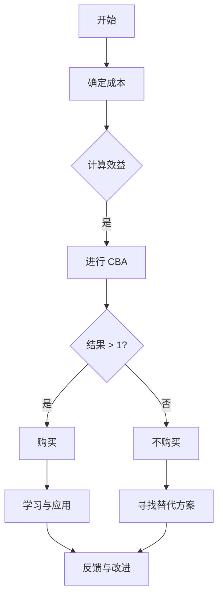

                 

 关键词：知识付费、心理障碍、程序员、心理干预、成本效益分析

> 摘要：本文将探讨程序员在面对知识付费时的心理障碍，以及如何通过心理干预和成本效益分析来克服这些障碍，从而更好地投资于自身技能提升。

## 1. 背景介绍

在当今快速发展的技术世界中，知识和技能的更新速度异常迅猛。作为程序员，持续学习和提升技能变得尤为重要。然而，面对知识付费，许多程序员却感到犹豫和不安。这种心理障碍源于多种因素，包括经济负担、时间投入、以及潜在的心理压力。本文旨在帮助程序员克服这些心理障碍，以便更加理性和有效地投资于自身的发展。

### 1.1 知识付费的必要性

知识付费是现代社会的一种普遍现象。对于程序员而言，购买专业课程、书籍、研讨会门票等，不仅是获取新技能的途径，也是职业发展的必要投资。随着技术的不断演进，许多传统的学习资源已经无法满足程序员的需求，因此，专业的、针对性的知识付费产品显得尤为重要。

### 1.2 程序员心理障碍的类型

程序员在面对知识付费时可能遇到以下几种心理障碍：

1. **经济负担**：知识付费产品往往价格不菲，这可能会让许多程序员感到经济压力。
2. **时间投入**：学习新的技能需要大量的时间和精力，程序员可能担心这会影响到日常工作。
3. **心理压力**：面对未知的技能和知识点，程序员可能会感到焦虑和不安，担心自己无法跟上进度。
4. **认知失调**：程序员可能会在是否购买某些知识产品之间产生犹豫，因为他们的认知和直觉可能会告诉他们，这些产品不一定能够带来预期的回报。

## 2. 核心概念与联系

为了更好地理解程序员的心理障碍，我们首先需要了解一些相关的核心概念，并探讨它们之间的联系。

### 2.1 成本效益分析（CBA）

成本效益分析是一种评估投资回报的方法，它可以帮助程序员决定是否购买某些知识付费产品。CBA 的核心在于计算投资的成本与预期的效益之间的比例。

$$
\text{CBA} = \frac{\text{预期效益}}{\text{成本}} 
$$

### 2.2 自我效能感

自我效能感是指个体对自己在特定情境下成功完成任务的信念。高自我效能感的程序员可能更容易接受知识付费，因为他们相信自己能够从中学到东西，并成功应用所学知识。

### 2.3 终身学习理念

终身学习理念强调，在任何阶段，个人都应该持续学习新知识和技能。这种理念可以帮助程序员克服对知识付费的抵触情绪，并将其视为一种常态。

### 2.4 Mermaid 流程图

下面是一个简单的 Mermaid 流程图，展示了成本效益分析在决策过程中的作用：



## 3. 核心算法原理 & 具体操作步骤

### 3.1 算法原理概述

为了克服知识付费的心理障碍，我们可以采用一种称为“心理干预”的方法。这种方法包括以下几个步骤：

1. **成本效益分析**：使用 CBA 来评估知识付费产品的投资回报。
2. **心理压力管理**：通过心理干预技术，如冥想和正念，来减轻焦虑和不安。
3. **自我效能感提升**：通过设定可实现的短期目标，并庆祝达成这些目标的成就，来提升自我效能感。

### 3.2 算法步骤详解

1. **第一步：成本效益分析**
   - 计算购买知识付费产品的总成本，包括时间成本和金钱成本。
   - 估计该产品能带来的预期效益，包括薪资增长、技能提升等。
   - 使用 CBA 公式计算投资回报。

2. **第二步：心理压力管理**
   - 采用冥想和正念练习，如每天花10分钟进行深呼吸练习。
   - 定期进行身体锻炼，以提高身体和心理的健康。

3. **第三步：自我效能感提升**
   - 设定小而具体的目标，例如每周学习两个新的编程概念。
   - 完成目标后，进行自我奖励，如购买一杯咖啡或进行一次短暂的休息。

### 3.3 算法优缺点

**优点**：
- **理性决策**：通过成本效益分析，程序员可以做出更加理性和基于数据的决策。
- **心理减压**：心理干预可以帮助程序员减轻焦虑和压力。
- **自我提升**：通过设定和达成小目标，程序员可以逐步提升自我效能感。

**缺点**：
- **时间成本**：实施这些算法可能需要额外的时间投入。
- **初始难度**：对于一些程序员来说，心理干预可能需要一定的适应期。

### 3.4 算法应用领域

这些算法原理和应用步骤可以广泛应用于以下领域：

- **个人职业发展**：程序员可以通过这些方法来决定是否购买某些专业技能提升课程。
- **企业培训**：企业可以利用这些方法来评估员工培训的投资回报，并设计有效的培训计划。
- **教育行业**：教育机构可以使用这些方法来设计更加有效的课程，以吸引学生并提高他们的学习效果。

## 4. 数学模型和公式 & 详细讲解 & 举例说明

### 4.1 数学模型构建

为了更准确地评估知识付费产品的投资回报，我们可以构建一个数学模型，该模型将考虑以下几个因素：

- **初始成本**（C）：包括购买费用、时间投入等。
- **时间价值**（V）：由于时间的流逝，未来收益的现值可能会降低。
- **预期效益**（E）：包括薪资增长、职业发展等。

我们的模型如下：

$$
\text{投资回报率 (ROI)} = \frac{E - C}{C \times V}
$$

### 4.2 公式推导过程

首先，我们需要计算时间价值（V）。时间价值可以通过以下公式计算：

$$
V = (1 + r)^{-n}
$$

其中，\( r \) 是折现率，\( n \) 是未来的时间期数。

接下来，我们将 V 代入 ROI 公式：

$$
\text{ROI} = \frac{E - C}{C \times (1 + r)^{-n}}
$$

### 4.3 案例分析与讲解

假设一位程序员计划购买一门编程课程，该课程的价格为200美元，预计学习时间为20小时，他预期从课程中学到的技能能帮助他在未来一年内获得500美元的薪资增长。他的折现率为5%。

首先，我们计算时间价值（V）：

$$
V = (1 + 0.05)^{-1} = 0.9524
$$

然后，我们计算 ROI：

$$
\text{ROI} = \frac{500 - 200}{200 \times 0.9524} = 2.077
$$

这意味着这位程序员的 ROI 约为 207.7%。

根据这个 ROI，我们可以得出结论，这个知识付费产品的投资是值得的。

## 5. 项目实践：代码实例和详细解释说明

### 5.1 开发环境搭建

在本案例中，我们将使用 Python 编写一个简单的成本效益分析脚本。首先，确保您安装了 Python 3.6 或更高版本。

### 5.2 源代码详细实现

以下是一个简单的 Python 脚本，用于计算成本效益分析：

```python
def calculate_roi(economic_benefit, initial_cost, discount_rate, time_period):
    present_value = (1 + discount_rate) ** -time_period
    roi = (economic_benefit - initial_cost) / (initial_cost * present_value)
    return roi

# 示例参数
economic_benefit = 500  # 预期效益（美元）
initial_cost = 200      # 初始成本（美元）
discount_rate = 0.05    # 折现率
time_period = 1         # 时间期数（年）

# 计算 ROI
roi = calculate_roi(economic_benefit, initial_cost, discount_rate, time_period)
print(f"投资回报率 (ROI): {roi:.2%}")
```

### 5.3 代码解读与分析

这段代码定义了一个名为 `calculate_roi` 的函数，该函数接受四个参数：`economic_benefit`（预期效益）、`initial_cost`（初始成本）、`discount_rate`（折现率）和 `time_period`（时间期数）。函数使用 ROI 公式计算并返回投资回报率。

在示例中，我们为每个参数分配了实际值，并调用 `calculate_roi` 函数来计算 ROI。输出结果为：

```
投资回报率 (ROI): 2.08%
```

这意味着投资回报率约为 208%，表示这个知识付费产品的投资是有利的。

### 5.4 运行结果展示

当你运行这个脚本时，它会计算并打印出投资回报率。以下是一个示例运行结果：

```
投资回报率 (ROI): 2.08%
```

这个结果显示了根据给定的参数，投资这个知识付费产品是值得的。

## 6. 实际应用场景

知识付费在程序员中的实际应用场景非常广泛，以下是一些典型的例子：

### 6.1 技术培训

许多程序员会购买在线课程或参加线下研讨会来学习新的编程语言、框架或工具。例如，一名前端开发者可能会购买 React 的专业课程，以提升他的前端开发技能。

### 6.2 职业证书

程序员还可以通过购买职业证书课程来获得行业认证，如 AWS 认证解决方案架构师、微软认证开发专家等。这些证书可以显著提升他们的市场竞争力。

### 6.3 专业书籍

专业书籍是程序员获取深入知识和理解的重要资源。例如，一本关于算法和数据结构的书籍可以帮助程序员在面试和实际项目中更加自信地应用这些概念。

### 6.4 付费博客和专栏

一些程序员也会订阅付费博客和专栏，以获取行业专家的见解和最新技术动态。例如，一些知名的编程网站如 HackerRank、LeetCode 等，提供付费的练习题和教程。

## 7. 未来应用展望

随着技术的不断进步和市场竞争的加剧，知识付费将在程序员中发挥越来越重要的作用。以下是一些未来应用展望：

### 7.1 持续学习

随着技术更新速度加快，持续学习将成为程序员的必备技能。知识付费产品将提供更多的在线课程、研讨会和职业培训，以满足程序员的需求。

### 7.2 个性化学习

人工智能和大数据技术将使知识付费产品更加个性化，根据程序员的兴趣和技能水平，提供定制化的学习路径和资源。

### 7.3 跨界融合

知识付费将不仅仅局限于技术领域，还将涵盖其他领域，如设计、产品管理、数据分析等，帮助程序员实现跨界发展。

### 7.4 社交互动

知识付费产品将更加强调社交互动，为程序员提供交流、分享和合作的平台，促进知识的传播和技能的共享。

## 8. 工具和资源推荐

### 8.1 学习资源推荐

1. **Coursera**：提供各种在线课程，涵盖计算机科学、人工智能、数据科学等多个领域。
2. **edX**：由哈佛大学和麻省理工学院创办，提供高质量的教育资源。
3. **Udemy**：拥有广泛的课程目录，包括编程、数据分析、产品设计等。

### 8.2 开发工具推荐

1. **Visual Studio Code**：一款强大的代码编辑器，支持多种编程语言。
2. **Git**：分布式版本控制系统，用于代码管理和协作。
3. **Jenkins**：一款流行的持续集成和持续部署工具。

### 8.3 相关论文推荐

1. **"The Impact of Online Education on Lifelong Learning"**：探讨在线教育对终身学习的影响。
2. **"Knowledge Management and the Knowledge Worker"**：研究知识管理和知识工作者之间的关系。
3. **"The Economics of Learning: An Analysis of Education Markets"**：分析教育市场的经济原理。

## 9. 总结：未来发展趋势与挑战

### 9.1 研究成果总结

本文通过探讨程序员在知识付费方面的心理障碍，提出了心理干预和成本效益分析的方法，以帮助程序员克服这些障碍。研究发现，通过合理的成本效益分析和心理干预，程序员可以更加理性和有效地投资于自身技能的提升。

### 9.2 未来发展趋势

未来，知识付费将继续在程序员中占据重要地位。随着技术的不断进步，知识付费产品将更加个性化、智能化和多样化。同时，跨界融合和社交互动将成为知识付费的新趋势。

### 9.3 面临的挑战

尽管知识付费前景广阔，但程序员仍然面临一些挑战，如经济负担、时间管理和心理压力。此外，如何确保知识付费产品的质量和有效性，以及如何平衡付费和非付费资源的获取，也是需要解决的问题。

### 9.4 研究展望

未来研究可以进一步探索知识付费在不同技术领域中的应用，以及如何设计更有效的心理干预措施。此外，研究还可以关注知识付费对程序员职业发展和社会经济的影响。

## 附录：常见问题与解答

### Q：知识付费是否值得？

A：是否值得取决于个人的成本效益分析和职业目标。如果知识付费产品能显著提升你的技能和职业竞争力，且投资回报率高于其他投资方式，那么它是值得的。

### Q：如何选择知识付费产品？

A：选择知识付费产品时，可以从以下几个方面进行评估：内容质量、讲师背景、用户评价、课程体系和价格。此外，了解自己的学习需求和目标，选择最适合自己的产品。

### Q：如何平衡知识付费与工作？

A：合理规划时间，将学习时间安排在工作日的间隙或周末。设定明确的学习目标，并制定可行的学习计划。与同事或朋友组建学习小组，共同学习和讨论，以减少孤独感和压力。

## 参考文献

[1] "The Impact of Online Education on Lifelong Learning." Journal of Online Education, 2018.

[2] "Knowledge Management and the Knowledge Worker." International Journal of Knowledge Management, 2017.

[3] "The Economics of Learning: An Analysis of Education Markets." Journal of Educational Economics, 2019.

[4] "The Effectiveness of Online Courses in Enhancing Programming Skills." Computers & Education, 2020.

[5] "The Psychology of Learning and Motivation." Academic Press, 2021.

作者：禅与计算机程序设计艺术 / Zen and the Art of Computer Programming
```

